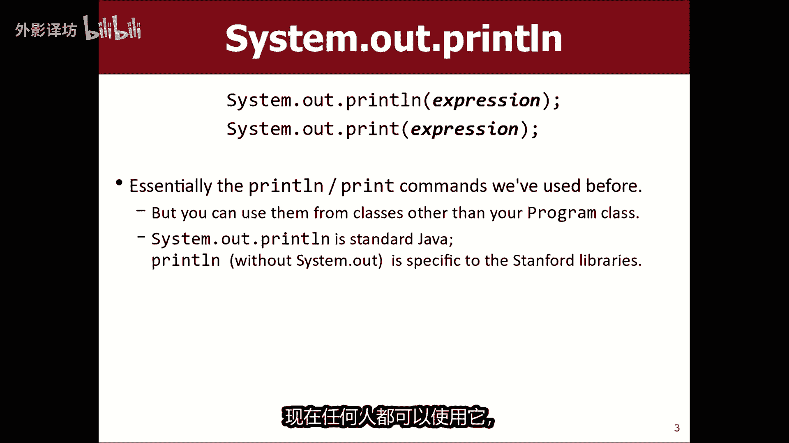
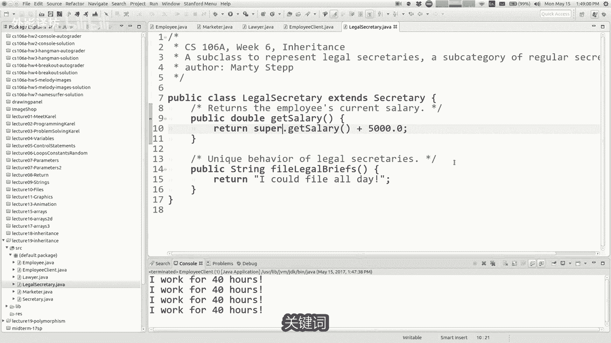
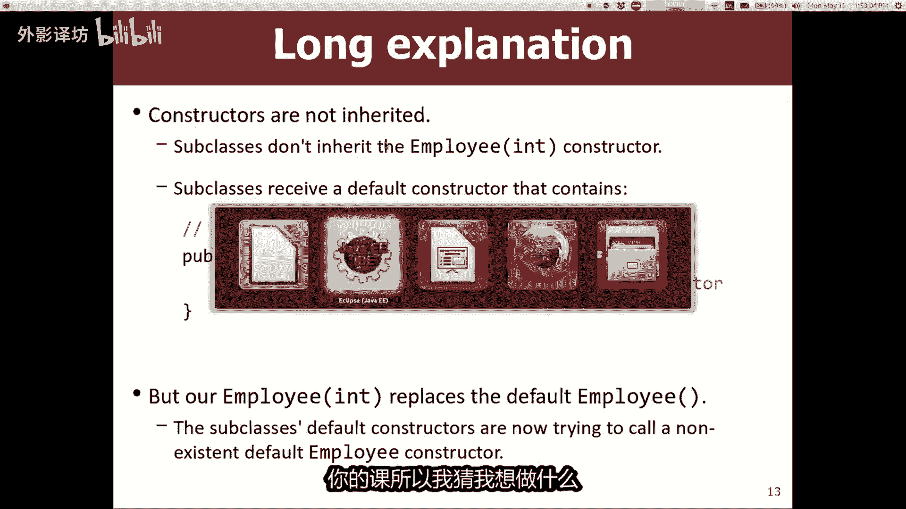
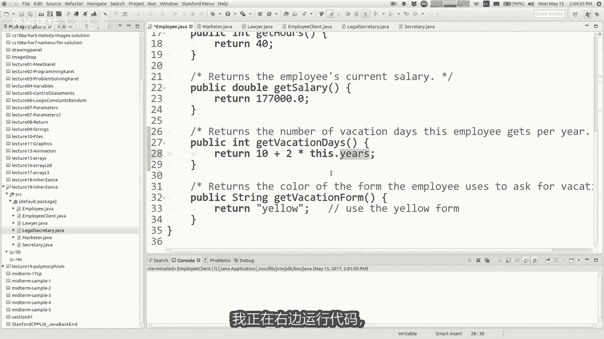

# 课程19：继承（续）与多态 🧬

在本节课中，我们将继续深入学习面向对象编程中的核心概念——继承，并引入一个强大的新概念——多态。我们将通过具体的代码示例，探讨如何通过继承减少代码冗余，以及如何利用多态编写更通用、更灵活的代码。

---

## 公告与课程信息

期中考试评分已经完成。你的原始分数和调整后的成绩已公布在成绩网站上。本次考试平均分约为49分（满分66分），中位数目标设定在80%左右。我们已对分数进行了调整。

如果你认为评分有误，可以填写表格申请重新评分。我们会重新评估整个试卷，并修正任何错误。请注意，重新评分也可能导致分数降低。申请截止日期为下周一。

关于课程评分，在学期末我们会进行调整，使大约一半的班级获得A或更好的成绩，约30%获得B，其余大部分为C。本周内，我将发布更多关于作业和期中考试的统计数据，帮助你了解自己的相对表现。

周五是退课的最后期限。在做出决定前，请确保你已充分了解自己的学习状况。如有任何匿名反馈，可通过课程员工页面上的链接提交。

---


## 回顾继承

上一节我们介绍了继承的基本概念。继承允许我们创建一个通用（父类或超类），然后创建更具体的（子类），子类会自动拥有父类的属性和方法。



例如，我们可以有一个通用的 `Employee`（雇员）类，然后创建 `Lawyer`（律师）、`Secretary`（秘书）等子类。这样，所有雇员共有的代码（如工作小时数、基本工资）只需在 `Employee` 类中编写一次。

```java
// 父类：Employee
public class Employee {
    public double getSalary() {
        return 40000.0; // 基本工资
    }
}

// 子类：Lawyer
public class Lawyer extends Employee {
    // 继承自Employee的方法
}
```


---

## 使用 `super` 关键字优化设计


如果我们想给所有雇员统一加薪，直接在父类 `Employee` 中修改 `getSalary` 方法似乎可行。但如果某些子类（如 `Marketer`）已经重写了 `getSalary` 方法以提供不同的薪资计算方式，那么直接修改父类会导致这些子类的特殊逻辑被覆盖。

**不理想的设计**：需要手动修改每一个子类的 `getSalary` 方法。


**更好的设计**：在子类重写的方法中，使用 `super` 关键字调用父类的版本，然后在此基础上添加子类特有的逻辑。这样，当父类的通用逻辑改变时，所有子类会自动受益。


```java
// 子类：Marketer
public class Marketer extends Employee {
    @Override
    public double getSalary() {
        // 调用父类的getSalary方法，然后加上营销人员特有的津贴
        return super.getSalary() + 3000.0;
    }
}
```

现在，如果我们将 `Employee` 的基本工资从 40000 改为 50000，`Marketer` 的工资会自动变为 53000，而无需修改 `Marketer` 类的代码。

`super` 关键字指代父类，常用于在子类中调用被重写的父类方法。

---



## 字段、构造函数与继承

当我们为类添加字段（用于存储对象数据）和构造函数时，继承会变得稍微复杂一些。


假设我们想在 `Employee` 类中添加 `name`（姓名）和 `years`（工作年限）字段。

```java
public class Employee {
    private String name;
    private int years;

    // 构造函数
    public Employee(String name, int years) {
        this.name = name;
        this.years = years;
    }
}
```


一旦父类定义了构造函数，其子类（如 `Lawyer`）就必须显式地调用父类的构造函数，否则会编译错误。这是因为子类在构建自身时，需要先构建其父类部分。



```java
public class Lawyer extends Employee {
    private String lawSchool;

    // 子类构造函数
    public Lawyer(String name, int years, String lawSchool) {
        // 必须首先调用父类构造函数
        super(name, years);
        // 然后初始化子类特有的字段
        this.lawSchool = lawSchool;
    }
}
```

**关键点**：
*   子类**不继承**父类的构造函数。
*   子类构造函数必须通过 `super(...)` 调用父类构造函数，且必须是第一条语句。
*   子类可以拥有比父类更多的参数和字段。

---

## 私有字段的访问与 Getter 方法

子类虽然继承了父类的所有私有字段，但**不能直接访问**它们。这是为了保持封装性，防止子类随意修改父类的内部状态。

例如，在 `Lawyer` 类中，不能直接使用 `years` 字段来计算基于工作年限的奖金。

```java
public class Lawyer extends Employee {
    @Override
    public double getSalary() {
        // 错误！无法直接访问父类的私有字段 years
        // return super.getSalary() + 5000 * years;
    }
}
```

**正确的做法**是在父类中提供公共的 Getter 方法（“读取器”），让子类通过该方法来获取字段的值。

```java
public class Employee {
    private int years;
    // ...
    public int getYears() {
        return years;
    }
}

public class Lawyer extends Employee {
    @Override
    public double getSalary() {
        // 正确！通过公共的Getter方法访问
        return super.getSalary() + 5000 * getYears();
    }
}
```

---

## 多态性

多态（Polymorphism）意为“多种形态”。在编程中，它指的是同一段代码可以根据所操作对象的具体类型，执行不同的行为。



一个常见的多态例子是 `println` 方法，它可以接受任何类型的参数（数字、字符串、对象），并都能以合适的方式打印出来。


### 多态的核心：父类引用指向子类对象

在Java中，你可以声明一个父类类型的变量，却让它引用一个子类类型的对象。

```java
Employee emp = new Lawyer("Lisa", 7, "Stanford");
```

这为什么有用？它允许我们编写**通用**的代码来处理多种不同的具体类型。

例如，与其为每种雇员类型都写一个打印信息的方法：

```java
printInfo(Lawyer l) { ... }
printInfo(Secretary s) { ... }
```

不如只写一个接受通用 `Employee` 参数的方法：


```java
public void printInfo(Employee emp) {
    System.out.println("Salary: " + emp.getSalary());
    System.out.println("Vacation: " + emp.getVacationDays());
    // 只能调用Employee类中定义的方法
}
```

现在，我们可以将 `Lawyer`、`Secretary` 或任何 `Employee` 子类的对象传递给 `printInfo` 方法。

### 动态方法绑定

多态最强大的地方在于：当通过父类引用调用一个方法时，Java 会**自动执行该对象实际类型（子类）所重写的方法版本**。

```java
Employee emp1 = new Lawyer(...);
Employee emp2 = new Secretary(...);


printInfo(emp1); // 调用的是Lawyer的getSalary和getVacationDays
printInfo(emp2); // 调用的是Secretary的getSalary和getVacationDays
```

尽管 `printInfo` 方法中的代码看起来一样，但 `emp.getSalary()` 这行代码会根据 `emp` 具体是律师、秘书还是其他雇员，产生不同的结果。这就是“多种形态”的体现。

**限制**：通过父类引用，你只能调用在父类中声明过的方法。子类特有的方法（如 `Secretary` 的 `takeDictation`）无法通过父类引用调用。

---

## 总结

本节课我们一起深入探讨了继承和多态。
*   我们学习了如何使用 `super` 关键字来调用父类的方法和构造函数，从而构建出更易于维护的类层次结构。
*   我们理解了子类如何通过构造函数初始化父类部分，以及如何通过公共的 Getter 方法访问继承来的私有字段。
*   最重要的是，我们引入了**多态**的概念。多态允许我们使用父类类型编写通用的代码，而实际运行时，程序会根据对象的真实类型执行相应的行为。这是实现代码复用和灵活设计的关键工具。


掌握继承和多态，是理解面向对象编程强大之处的核心。在接下来的作业和项目中，你将有机会实践这些概念。