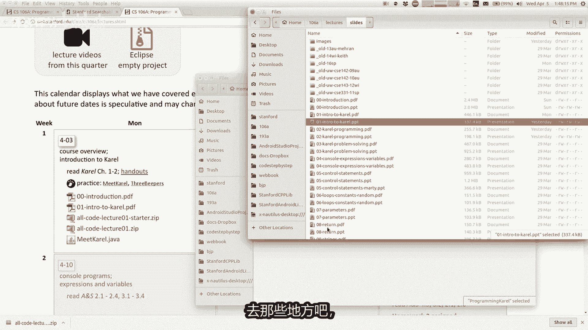
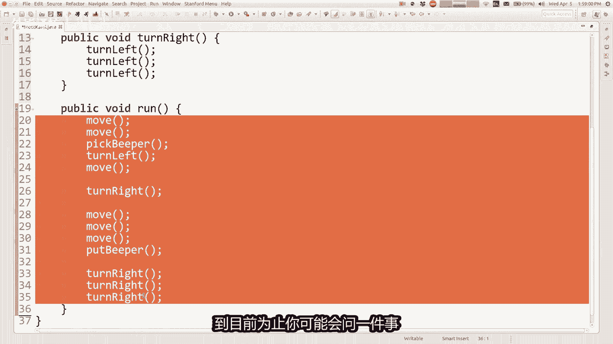

# 课程 02：编程 Karel 🧑‍💻


在本节课中，我们将学习如何为 Karel 机器人编写更复杂的程序。我们将深入探讨 Java 编程的核心概念，包括方法、循环和条件语句，并学习如何使用 Eclipse 集成开发环境。

## 概述

我们将从回顾上一讲的内容开始，然后介绍如何组织代码、消除冗余以及让程序根据环境做出决策。这些技能是构建更复杂、更智能程序的基础。

---

## 公告与课程设置


上一节我们介绍了 Karel 的基本命令。在深入新内容之前，有几个重要的课程公告。

以下是关于课程设置和讨论部分的说明：
*   助教尼克将于明天下午 3 点到 5 点在盖茨大厦地下室的 VO 房间提供帮助，协助你在计算机上设置 Java 和 Eclipse 软件。
*   本课程将有由小组长带领的每周讨论部分。你需要在班级网页上的“注册表单”链接中报名，选择你有空的时间段。该表格将于明天（周四）上线，开放至周日。请务必在本周末前填写。


关于课程材料，每次讲座的内容都会发布在网站上。这包括讲座视频、我编写的程序代码以及课程中使用的项目文件。通常，我会在课前发布“启动项目”，这是一个空项目，方便你跟着课程一起编写代码。

---


## 在 Eclipse 中开始项目


为了编写和运行 Java 程序，我们需要使用 Eclipse。本节中我们来看看如何开始一个 Eclipse 项目。

首先，你需要从课程网站下载项目压缩文件（zip 文件），并将其保存到电脑上的某个文件夹中。然后，你需要解压这个 zip 文件。

在 Eclipse 中，点击“导入项目”按钮（或通过“文件”菜单选择“导入”）。浏览到你解压项目文件的目录，选择名为 `programming-karel` 的文件夹并导入。导入成功后，该项目就会出现在你的 Eclipse 工作区中。项目的源代码位于 `src` 文件夹内，你可以在这里打开并编辑 Java 文件。


这就是开始处理 Eclipse 项目的基本流程，也是你开始做作业的方式。


---


## 剖析 Java 程序


现在，让我们回顾并深入分析上一讲我们编写的第一个程序。

我们的程序名为 `MeetKarel`。一个 Java 程序有几个关键元素：
*   `public class MeetKarel extends Karel`：这定义了我们的程序。`class` 在 Java 中类似于“程序”这个词。`extends Karel` 告诉 Java，我们的程序基于现有的 Karel 库的功能。
*   花括号 `{}`：Java 使用花括号作为分组机制，表示一段代码的开始和结束。我们程序的所有命令都放在 `public void run()` 方法的花括号之间。
*   命令：如 `move();`，`pickBeeper();`，`turnLeft();`。每个命令以分号结束。
*   空格和缩进：Java 不关心代码中的空格（只要不在单词中间添加），但良好的缩进能让代码更易读。例如，以下两段代码的行为完全相同：
    ```java
    // 版本一
    public void run() {
        move();
        pickBeeper();
    }
    // 版本二
    public void run() { move(); pickBeeper(); }
    ```

然而，Java 在某些方面非常严格。例如，如果你将 `move()` 错误地拼写为 `Move()`（大写 M），程序将无法运行，因为 Java 会报告“未定义”的错误。这类错误被称为**语法错误**，即代码不符合编程语言的规则。

---


## 编译与运行




计算机执行的是由 0 和 1 组成的二进制指令。我们编写的 Java 代码（人类可读）需要被翻译成二进制，这个过程称为**编译**。

在 Eclipse 中，每当你保存代码时，它会自动编译你的程序。点击“运行”按钮（一个绿色小人的图标）时，Eclipse 会先编译程序（如果必要），然后执行它。编译成功后，会生成一个 `.class` 文件，其中包含了计算机可以执行的二进制代码。


语法错误会阻止程序成功编译，因此它们也被称为**编译错误**。

---


## 标识符与关键字


程序、方法等的名称被称为**标识符**。Java 标识符的规则是：
*   可以包含字母、数字、下划线 `_` 或美元符号 `$`。
*   必须以字母、`_` 或 `$` 开头（通常以字母开头）。
*   例如，`go49ers` 是合法的，但 `49ers` 不合法，因为它以数字开头。

此外，有些单词是 Java 语言的**关键字**，具有特殊含义，不能用作标识符。例如，你不能将你的程序命名为 `public`。我们本课程不会用到所有的关键字。

---

## 代码注释


**注释**是写在代码中，用于给程序员自己或他人做笔记的文本。注释不会影响程序的运行行为。


编写注释有两种方式：
1.  单行注释：使用两个斜杠 `//`。
    ```java
    // CS106A, Spring 2017
    // Author: Marty
    // This program makes Karel move and pick up a beeper.
    ```
2.  多行注释：使用 `/*` 开始，`*/` 结束。
    ```java
    /*
     * CS106A, Spring 2017
     * Author: Marty
     * This program makes Karel move and pick up a beeper.
     */
    ```




注释的一个重要用途是临时“禁用”一部分代码。如果你在某行代码前加上 `//`，这行代码就会变成注释，运行时将被跳过。
```java
move();
// pickBeeper(); // 这行代码现在不会执行
turnLeft();
```

---


## 定义与使用方法


我们已经学会了基本的命令，但如何让程序执行更复杂的操作呢？本节中我们来看看**方法**。

**方法**是一组被命名并组合在一起的命令。你可以将方法理解为给 Karel 添加新的、自定义的命令。

定义方法有两个步骤：
1.  **声明方法**：编写方法的名称和它包含的命令。
2.  **调用方法**：在程序中使用该方法的名称来执行它。

例如，Karel 没有 `turnRight()` 命令。我们可以自己创建一个：
```java
// 1. 声明方法：定义 turnRight 做什么
public void turnRight() {
    turnLeft();
    turnLeft();
    turnLeft(); // 向左转三次等于向右转
}

// 2. 在 run 方法中调用它
public void run() {
    move();
    turnRight(); // 使用我们自定义的命令
    move();
}
```
当程序运行到 `turnRight();` 这一行时，Java 会跳转到 `turnRight` 方法的定义处，执行其中的三条 `turnLeft()` 命令，然后返回。


使用方法的**好处**是：
*   **消除冗余**：如果需要在多个地方右转，只需调用 `turnRight()`，而不用重复写三次 `turnLeft()`。
*   **组织代码**：将程序分解成逻辑块，使结构更清晰。


方法可以调用其他方法。例如：
```java
public void shake() { // 摇晃：左转然后右转
    turnLeft();
    turnRight();
}

public void tooMuchCoffee() { // 喝太多咖啡：摇晃三次
    shake();
    shake();
    shake();
}
```
`public void run()` 是一个特殊的方法，它是程序开始执行时 Java 自动寻找并运行的入口。


---


## 使用循环进行重复

如果你需要让 Karel 重复执行某个动作很多次，一遍遍写同样的命令非常冗余。这时，我们可以使用**循环**。

`for` 循环用于重复执行一系列命令特定的次数。其语法如下：
```java
for (int i = 0; i < 5; i++) {
    // 要重复执行的命令放在这里
    move();
}
```
这个循环的意思是：“对于 `i` 从 0 开始，只要 `i` 小于 5，就执行一次花括号里的命令，然后将 `i` 增加 1。” 最终，花括号内的命令会被执行 5 次。

你可以把多条命令放在循环的花括号里：
```java
for (int i = 0; i < 3; i++) {
    move();
    turnLeft(); // 这将执行：移动，左转，移动，左转，移动，左转。
}
```
循环也可以嵌套（一个循环 inside 另一个循环），以实现更复杂的重复模式。

**方法与循环的选择**：
*   **方法**适用于在程序不同位置重复一个**逻辑单元**（如 `turnRight`）。
*   **循环**适用于在**同一个位置**连续重复一系列命令。

---

## 使用条件语句做出决策


为了让 Karel 更智能，能根据周围环境做出不同反应，我们需要**条件语句**。


`if` 语句允许程序进行条件判断：只有当一个条件为“真”时，才执行特定的命令。其语法是：
```java
if (condition) {
    // 如果条件为真，则执行这里的命令
}
```
Karel 提供了一些测试条件的方法，例如：
*   `frontIsClear()`：前面是否畅通？
*   `beepersPresent()`：当前位置是否有蜂鸣器？
*   `facingNorth()`：是否面朝北方？


一个常见的例子是：让 Karel 移动并只在有蜂鸣器时才捡起它，避免在空地上执行 `pickBeeper()` 导致程序崩溃。
```java
public void run() {
    move();
    if (beepersPresent()) { // 检查脚下是否有蜂鸣器
        pickBeeper(); // 只有条件为真时才执行
    }
    move();
}
```

---


## 总结


本节课中我们一起学习了 Java 和 Karel 编程的几个核心概念：
1.  **项目设置**：如何在 Eclipse 中导入和开始一个项目。
2.  **程序结构**：理解了类、方法、注释和语法错误。
3.  **方法**：通过将命令分组并命名来创建自定义指令，从而消除冗余和组织代码。
4.  **循环**：使用 `for` 循环来重复执行代码块，提高效率。
5.  **条件语句**：使用 `if` 语句让程序能够根据环境（如是否有蜂鸣器）做出决策，编写更灵活、健壮的程序。


这些是构建所有程序的基础模块。通过组合使用这些技术，你将能够指挥 Karel 完成越来越复杂的任务。