# 课程20：小动物模拟器 🐾

在本节课中，我们将学习如何完成作业六——“小动物”模拟器。这是一个关于类和对象、继承以及状态管理的综合练习。我们将创建一个二维世界，其中不同种类的“小动物”会移动、战斗、进食和繁殖。你需要通过编写Java类来定义这些动物的行为。

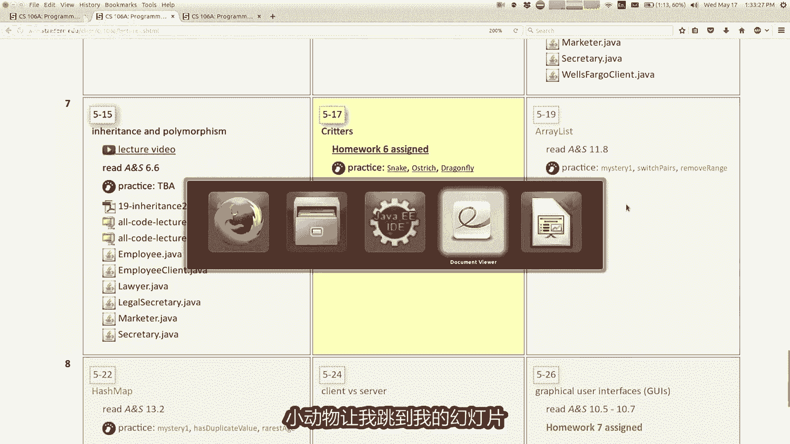

---

## 概述

作业六的核心是理解并实现一个名为“小动物”的模拟系统。你将编写多个扩展自基础`Critter`类的子类，每个子类代表一种具有特定行为的动物。模拟器会管理一个世界，让这些动物实例在其中互动。你的任务是重写父类中的方法，以定义每种动物如何移动、战斗、进食、显示颜色和外观。

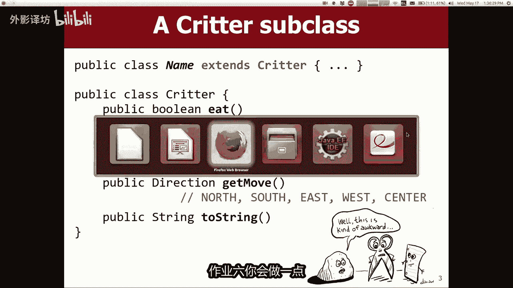

---

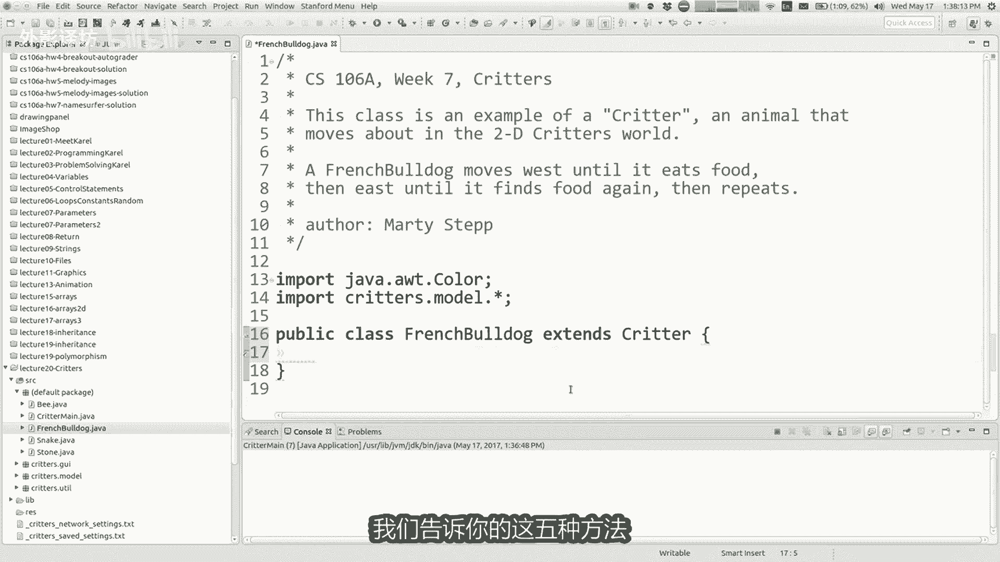


## 小动物世界的基本概念


上一节我们介绍了本作业的目标。本节中，我们来看看小动物世界的基本构成和运行机制。


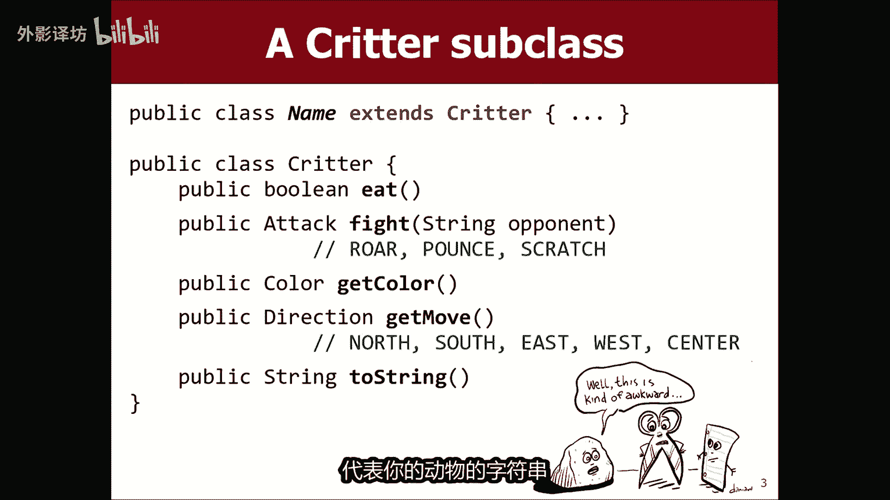


模拟器是一个二维网格世界。动物们在这个世界中以文本字符的形式显示和移动。每种动物都由一个Java类表示，例如`Bird`类或`Wolf`类。你编写的这些类将扩展我们提供的`Critter`类。


所有小动物都能执行五种主要行为：
*   **进食**：决定是否吃掉当前格子上的食物。
*   **战斗**：当与另一只动物相遇时，决定如何攻击。
*   **颜色**：决定自己在屏幕上显示的颜色。
*   **外观**：决定代表自己的文本字符（如“A”或“S”）。
*   **移动**：决定每一步移动的方向。


当你编写一个小动物类时，你需要重写这些方法来定义其独特行为。例如，我们提供的`Stone`类就非常简单：它总是返回`Attack.ROAR`（咆哮），颜色是灰色，外观是“S”，并且从不移动。


---

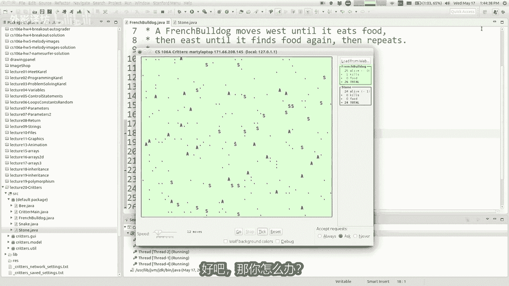

## 实现第一个小动物：法国斗牛犬 🐕

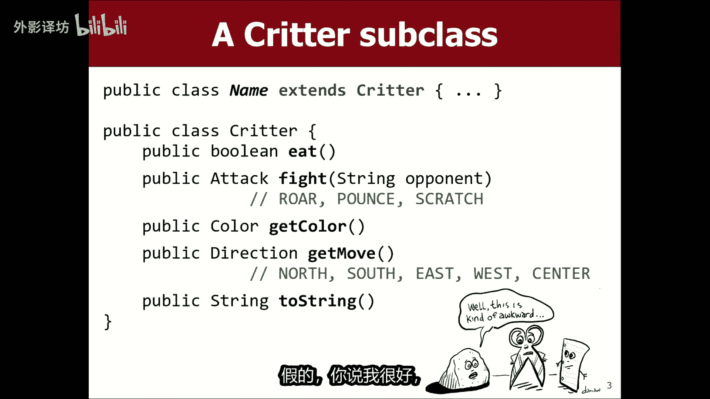

上一节我们了解了小动物的基本行为。本节中，我们通过创建一个`FrenchBulldog`类来实践如何实现它们。

首先，创建一个扩展`Critter`的新类。即使你不重写任何方法，程序也能运行，但动物会使用默认行为（黑色、问号“？”、不移动、战斗失败）。

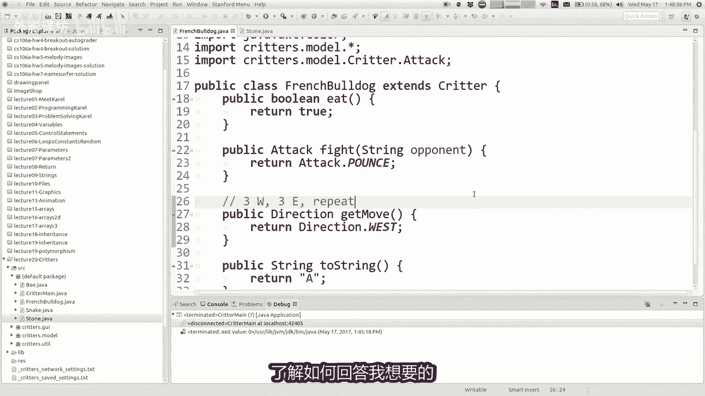

以下是逐步添加行为的方法：

**1. 定义外观**
要改变动物显示的文字，你需要重写`toString`方法。
```java
public String toString() {
    return "A";
}
```
现在，`FrenchBulldog`在屏幕上会显示为字母“A”。

**2. 实现移动**
动物通过重写`getMove`方法来移动。该方法需要返回一个`Direction`枚举值（如`Direction.WEST`）。
```java
public Direction getMove() {
    return Direction.WEST; // 始终向左（西）移动
}
```


**3. 处理战斗**
当两只动物相遇，模拟器会调用它们的`fight`方法。攻击方式有三种：`Attack.ROAR`（咆哮）、`Attack.POUNCE`（猛扑）、`Attack.SCRATCH`（抓挠）。它们遵循“石头剪刀布”的规则：咆哮击败抓挠，抓挠击败猛扑，猛扑击败咆哮。如果攻击方式相同，则随机决定胜负。
已知`Stone`总是咆哮。为了让`FrenchBulldog`击败`Stone`，它应该总是猛扑。
```java
public Attack fight(String opponent) {
    return Attack.POUNCE; // 总是使用猛扑
}
```

**4. 决定是否进食**
当动物移动到有食物的格子上，模拟器会调用`eat`方法。返回`true`表示吃掉食物，`false`表示不吃。吃食物可以得分，但吃太多会导致动物“睡觉”，在睡觉时被其他动物碰到则会死亡。
```java
public boolean eat() {
    return true; // 总是吃掉食物
}
```

---

## 管理状态：实现复杂行为 🔄

上一节我们实现了简单、固定的行为。本节中我们来看看如何实现更复杂的、依赖于历史状态的行为。这是本作业的关键和难点。

模拟器通过循环调用你的方法（如`getMove`）来驱动世界。**你不能在方法内部使用循环**来控制多步行动。你一次只能决定下一步做什么。

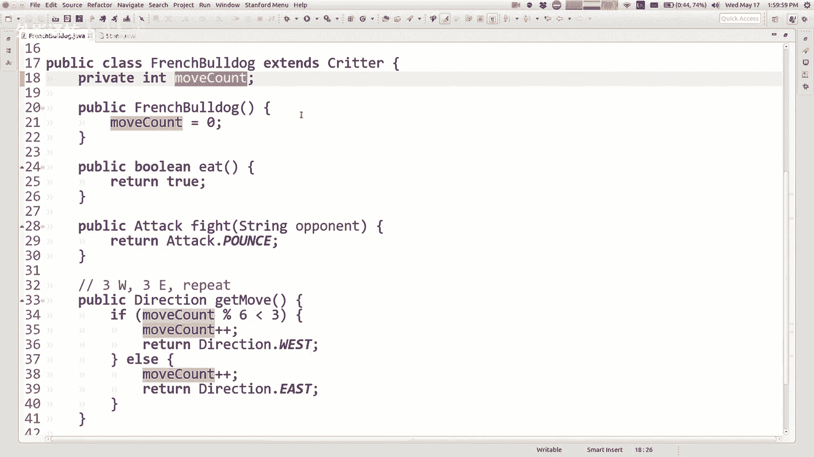

**核心思想**：你需要使用**私有字段（实例变量）** 来记录动物的状态，以便在下次方法被调用时“记住”接下来该做什么。

**示例1：实现“移动三步向西，再移动三步向东”的模式**
你不能说“我要向西走三步”。你只能说“我下一步向西走”。为了记住整个模式，你需要一个计数器。
```java
public class FrenchBulldog extends Critter {
    private int moveCount; // 记录已移动的次数

    public FrenchBulldog() {
        moveCount = 0; // 初始化
    }

    public Direction getMove() {
        moveCount++; // 移动次数加1
        // 如果 moveCount 对 6 取模的结果小于3，则向西走，否则向东走
        if (moveCount % 6 < 3) {
            return Direction.WEST;
        } else {
            return Direction.EAST;
        }
    }
    // ... 其他方法
}
```
通过调整`moveCount`的初始值和判断逻辑，你可以精确控制移动模式。

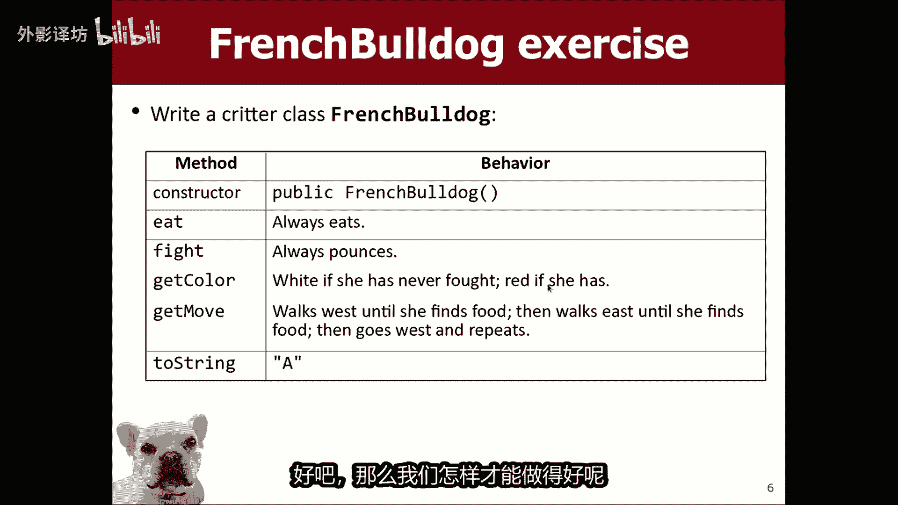

**示例2：根据是否战斗过来改变颜色**
规范要求：`FrenchBulldog`初始为白色，一旦参与过战斗，就永久变为红色。
```java
public class FrenchBulldog extends Critter {
    private boolean hasFought; // 记录是否战斗过

    public FrenchBulldog() {
        hasFought = false; // 初始未战斗
    }

    public Color getColor() {
        if (!hasFought) {
            return Color.WHITE;
        } else {
            return Color.RED;
        }
    }

    public Attack fight(String opponent) {
        hasFought = true; // 一旦战斗，标记为true
        return Attack.POUNCE;
    }
    // ... 其他方法
}
```
每个`FrenchBulldog`对象都有自己的`hasFought`变量副本，因此它们可以有不同的状态和行为。

---


## 挑战案例：实现蛇的移动模式 🐍


上一节我们学习了用状态字段实现模式。本节我们分析一个更复杂的案例——`Snake`的移动模式。

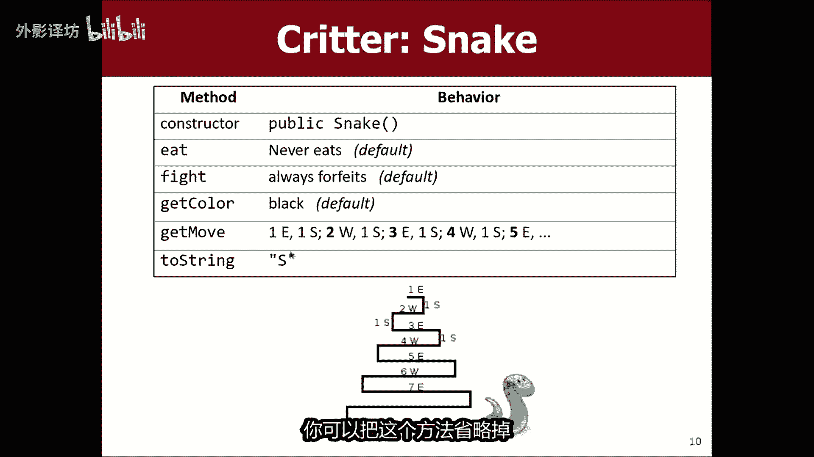


`Snake`的移动模式是：水平移动一段长度，然后向南一步，再反方向水平移动一段增加的长度，再向南一步，如此反复。
例如：东1，南1，西2，南1，东3，南1，西4...

**实现思路**：
你需要跟踪多个状态：
1.  `runLength`：当前水平移动需要走的步数。
2.  `stepsInCurrentRun`：在当前水平移动中已经走了多少步。
3.  `currentDirection`：当前水平移动的方向（东或西）。
4.  或者，可以用一个总移动计数器`moveCount`结合逻辑推导出上述状态。

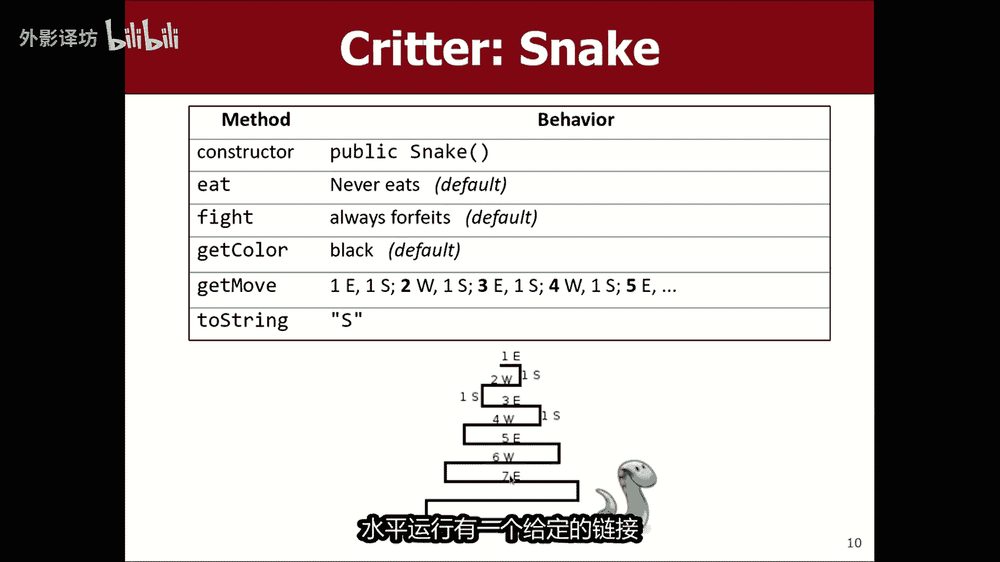

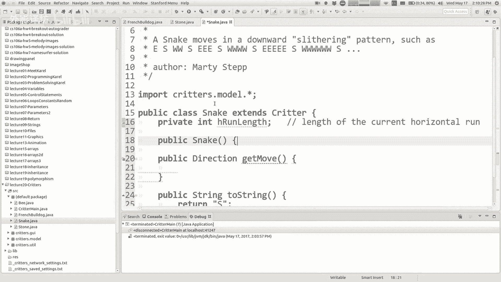

以下是概念性代码框架：
```java
public class Snake extends Critter {
    private int runLength;
    private int stepsTaken;
    private boolean movingEast;

    public Snake() {
        runLength = 1; // 初始水平移动长度为1
        stepsTaken = 0;
        movingEast = true; // 初始向东
    }

    public Direction getMove() {
        // 如果还在当前水平移动中
        if (stepsTaken < runLength) {
            stepsTaken++;
            return movingEast ? Direction.EAST : Direction.WEST;
        } else {
            // 水平移动结束，先向南走一步
            stepsTaken = 0;
            runLength++; // 下次水平移动长度增加
            movingEast = !movingEast; // 调转方向
            return Direction.SOUTH;
        }
    }
    // ... toString 等方法
}
```
这是一个简化的逻辑，实际实现可能需要调整初始值和边界条件。关键在于用私有字段记住“进行到哪一步了”。


---

## 调试与测试技巧 🐛

编写小动物类是一个迭代过程。以下是一些有用的调试技巧：

*   **使用“单步”按钮**：不要总是点击“开始”。使用“前进一次”按钮，观察你的动物每一步的行为是否符合预期。
*   **启用调试模式**：模拟器有“调试”选项，开启后会在控制台输出详细信息，帮助你跟踪动物的决策过程。
*   **使用 `System.out.println`**：在你的方法中插入打印语句，输出私有字段的值，这是理解程序状态的经典方法。
```java
public Direction getMove() {
    System.out.println("moveCount: " + moveCount);
    // ... 你的逻辑
}
```
*   **专注于一个动物**：在测试时，只添加你正在编写的动物类型，并观察其行为。

---

## 总结

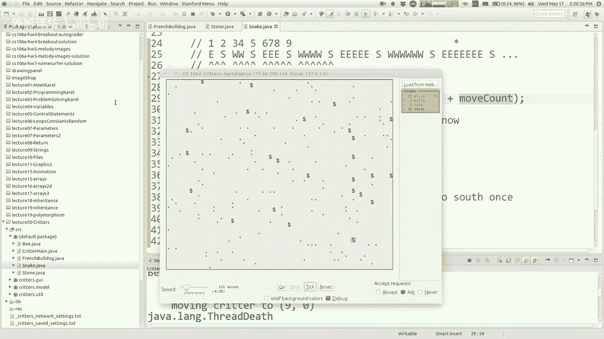


本节课中我们一起学习了作业六“小动物模拟器”的核心内容。我们回顾了如何通过继承`Critter`类并重写方法来定义动物的行为（`eat`, `fight`, `getColor`, `toString`, `getMove`）。我们重点探讨了如何使用**私有实例变量**来管理对象的状态，从而实现依赖于历史的复杂行为模式，这是面向对象编程中“对象拥有独立状态”这一概念的绝佳实践。记住，模拟器控制主循环，你的代码只需决定“下一步”做什么，并通过内部状态来“记忆”未来的计划。