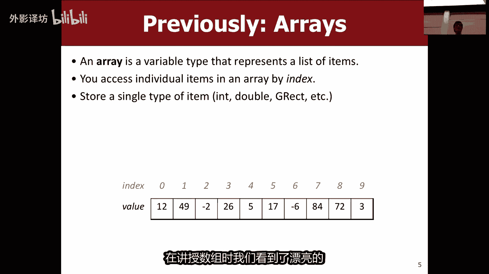
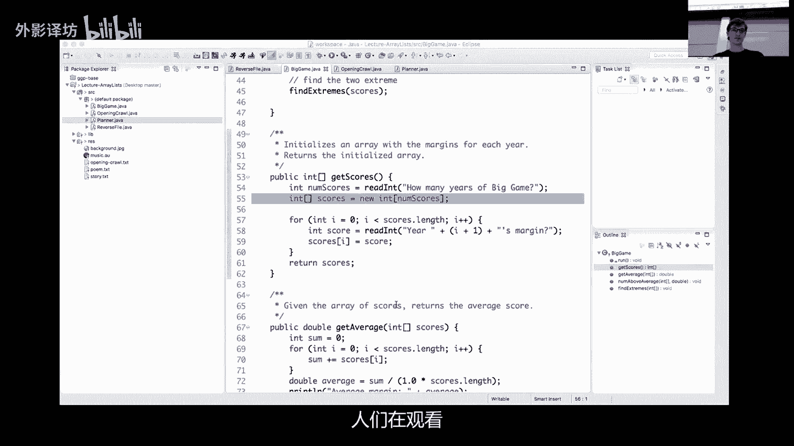
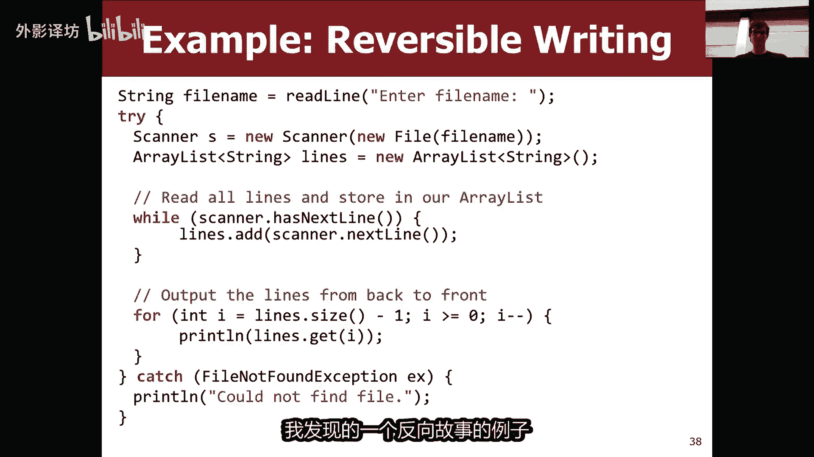
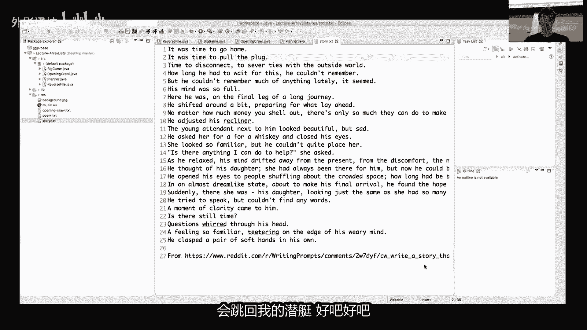
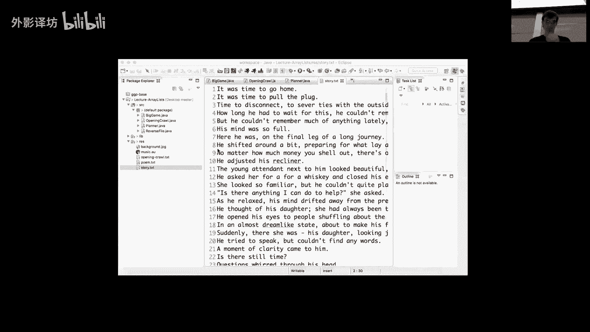
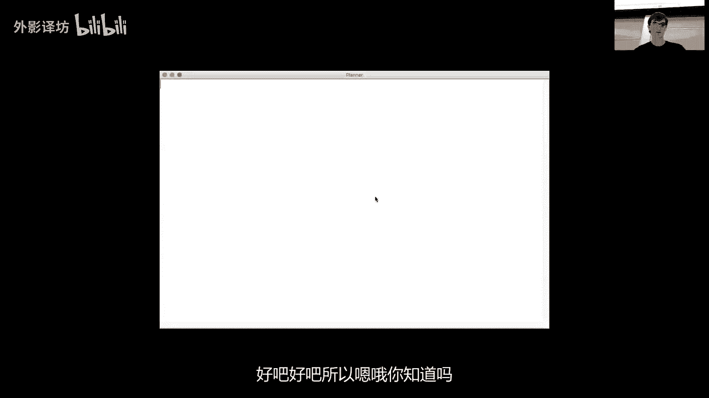
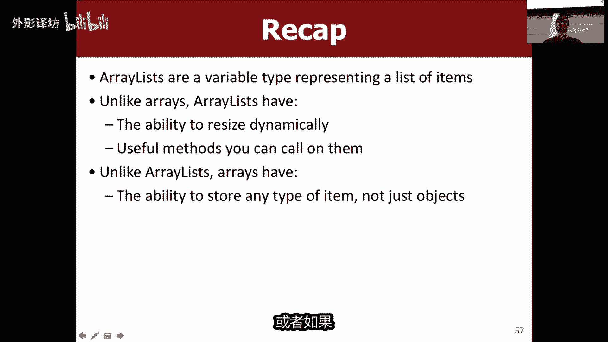

# 课程21：ArrayLists 📚


在本节课中，我们将要学习一个非常强大的数据结构——`ArrayList`。我们将了解它是什么，它与我们之前学过的数组有何不同，以及如何使用它来编写更灵活、功能更强大的程序。


---



## 概述 📖


`ArrayList` 是 Java 中一个可变大小的列表。与固定大小的数组不同，`ArrayList` 可以根据需要动态地增长和缩小。这使得它在处理用户输入或未知数量的数据时特别有用。本节课我们将学习如何创建 `ArrayList`，如何向其中添加、获取和删除元素，并通过两个实际例子来巩固理解。


---




## 回顾数组的局限性 🔍

上一节我们介绍了数组，本节我们来看看它的局限性。数组是一个固定大小的容器，用于存储单一类型的元素。

**创建数组的公式：**
```java
int[] scores = new int[5]; // 创建一个大小为5的整数数组
```

数组的主要限制在于其**静态尺寸**。你必须在创建时就指定其大小，之后无法更改。例如，在“大型游戏”程序中，我们必须先询问用户要输入多少年的数据，然后才能创建相应大小的数组来存储分数。如果用户后来想输入更多数据，程序就无法轻松处理。

另一个限制是，数组本身没有内置的方法来搜索元素或方便地打印所有内容，这些都需要我们手动编写循环代码来实现。

---

## 引入 ArrayList 🆕

正是为了克服数组的这些限制，`ArrayList` 应运而生。`ArrayList` 也是一个列表，你可以通过索引访问其中的单个项目。

**创建 ArrayList 的公式：**
```java
import java.util.*; // 必须导入这个包
ArrayList<String> myList = new ArrayList<String>();
```

与数组类似，`ArrayList` 也存储单一类型的对象（注意是**对象**，我们稍后会详细说明）。它的酷炫之处在于：
*   **可以调整大小**：你可以随时添加或删除元素。
*   **内置实用方法**：例如，可以搜索列表是否包含某个元素。

以下是 `ArrayList` 的一些基本操作：

**添加元素：**
```java
myList.add("Hello"); // 在列表末尾添加 "Hello"
```

**获取元素：**
```java
String firstItem = myList.get(0); // 获取索引为0的元素
```

**获取大小：**
```java
int size = myList.size(); // 获取列表当前包含的元素数量
```

---

## 遍历 ArrayList 🔄

与数组一样，我们可以使用循环来遍历 `ArrayList`。



**使用 for 循环：**
```java
for (int i = 0; i < myList.size(); i++) {
    String item = myList.get(i);
    System.out.println(item);
}
```


**使用 for-each 循环（更简洁）：**
```java
for (String item : myList) {
    System.out.println(item);
}
```





for-each 循环是遍历集合中每个元素的简写语法，当你不需要使用索引时非常方便。

---

## 实践示例一：反转故事文件 📄


现在让我们通过一个实际例子来运用 `ArrayList`。我们将编写一个程序来反转一个文本文件中的行序。这样，一个故事从前往后读和从后往前读会呈现出不同的情节。




**思路分析：**
1.  读取文件中的每一行。
2.  将每一行按顺序存储到一个 `ArrayList` 中。
3.  从后向前遍历这个列表，并打印每一行。

**核心代码片段：**
```java
ArrayList<String> lines = new ArrayList<String>();
while (scanner.hasNextLine()) {
    String line = scanner.nextLine();
    lines.add(line); // 将每一行添加到列表
}
// 反向打印
for (int i = lines.size() - 1; i >= 0; i--) {
    System.out.println(lines.get(i));
}
```
这个程序的关键在于 `ArrayList` 帮助我们“记住”了所有行的顺序，之后我们可以按任何顺序（包括反向）来处理它们。

---


## ArrayList 的更多方法 🛠️


除了 `add` 和 `get`，`ArrayList` 还提供了许多其他有用的方法。

以下是几个常用的方法：
*   **在指定索引处添加**：`myList.add(2, "插入的元素");`
*   **查找元素索引**：`int index = myList.indexOf("某值");`
*   **移除指定索引处的元素**：`myList.remove(5);`
*   **移除特定值的元素**：`myList.remove("某人");`
*   **替换元素**：`myList.set(1, "新值");`

**重要提示：** 当你在列表中间添加或删除元素时，其后的所有元素索引都会发生移动。你需要小心处理正在跟踪的索引。

---

## 实践示例二：任务规划程序 📝

我们将构建一个更复杂的程序——“任务规划器”。这个程序允许用户输入一系列当天想完成的任务，然后按照用户希望的顺序重新排列这些任务。

**程序步骤：**
1.  提示用户输入任务列表，直到输入空行为止。将这些任务存储在一个 `ArrayList` 中。
2.  显示剩余任务，反复提示用户选择下一个要完成的任务。
3.  将用户选择的任务从原始列表移到另一个“已排序”的 `ArrayList` 中。
4.  当所有任务都被选择后，按用户指定的顺序打印最终任务列表。

**核心逻辑片段：**
```java
// 步骤1：读取任务列表
ArrayList<String> tasks = new ArrayList<String>();
String task = readTask();
while (task.length() > 0) {
    tasks.add(task);
    task = readTask();
}

// 步骤2 & 3：让用户排序任务
ArrayList<String> orderedTasks = new ArrayList<String>();
while (tasks.size() > 0) {
    System.out.println("剩余任务: " + tasks);
    String next = readTask();
    if (tasks.contains(next)) {
        orderedTasks.add(next); // 加入有序列表
        tasks.remove(next);    // 从剩余列表中移除
    } else {
        System.out.println("该任务不在你的列表中。");
    }
}

// 步骤4：打印最终顺序
System.out.println("今日计划: " + orderedTasks);
```
在这个例子中，`ArrayList` 的 `contains` 和 `remove` 方法极大地简化了逻辑，让我们能轻松检查输入是否有效并更新列表。

---

## 对比：Array 与 ArrayList ⚖️


既然 `ArrayList` 如此强大，为什么我们还需要数组呢？让我们来比较一下。

| 特性 | 数组 (Array) | 列表 (ArrayList) |
| :--- | :--- | :--- |
| **创建** | `int[] arr = new int[10];` | `ArrayList<Integer> list = new ArrayList<>();` |
| **大小** | 固定，创建时指定 | 动态，可增长和缩小 |
| **访问元素** | `arr[0]` (简洁) | `list.get(0)` (稍显冗长) |
| **添加元素** | 无法直接添加（需手动管理） | `list.add(item)` (自动扩容) |
| **内置方法** | 很少 | 丰富 (`contains`, `remove`, `indexOf`等) |
| **存储类型** | 任何类型（包括基本类型） | 主要存储**对象** |

**关键区别与选择：**
*   **数组** 语法更简洁，性能在极少数场景下可能略优，并且可以直接存储 `int`, `double` 等基本类型。
*   **ArrayList** 功能更强大，特别适合数据量未知或需要频繁增删元素的场景。对于存储基本类型，Java 使用了“包装类”（如 `Integer`, `Double`）来自动处理，通常无需我们操心。

简单来说，如果你提前确切知道元素数量且不需要改变大小，数组可能更合适。否则，`ArrayList` 通常是更灵活、更省力的选择。

---

## 总结 🎯

本节课中我们一起学习了 `ArrayList`。
*   我们了解了 `ArrayList` 是一个**可变大小**的列表，解决了数组固定大小的主要限制。
*   我们学会了如何**创建** `ArrayList`，以及使用 `add`, `get`, `size`, `remove` 等核心方法来操作它。
*   我们通过**反转文本文件**和**任务规划器**两个程序，实践了 `ArrayList` 在存储动态数据和重新排序方面的强大能力。
*   最后，我们对比了 **Array** 和 **ArrayList**，理解了它们各自的优缺点和适用场景。



现在，你已经掌握了另一个重要的数据结构工具，可以让你在编程时更加得心应手！