# 【中文配音】斯坦福王牌课程 CS 106a Java教程 2017年春季课程 - P22：22_ Critters 2; Static 16sp - 外影译坊 - BV14U4geNEEq

欢迎回来，这是第八周，我们我们还要再听一场关于继承以及对象和类，以及所有这些事情我都会去做，今天花更多时间谈论小动物世界模拟，现在是作业六的基础已发布，这就是我们当前的任务，完成后，你将继续工作与图像。

算法和旋律和这种东西，只是关于您的日程安排的小说明规划，我想指出的是，作业六只完成一周，然后作业七出来了，我意识到这有点糟糕，因为你没有通常有一周的时间，每周在一次讲座中完成每项作业。

我的意思是长话短说，春天季度是最短的季度年，所以我们必须喜欢挤压一些事情，但我的决定，我认为这会带来更多挤压小动物任务的感觉，一周内，因为作业七可以去这里到星期三，作业七是更大一点的项目。

叫做名称服务器，有一点其中有更棘手的算法内容，所以我决定是我觉得作业六如果你有的话，小动物就是你要做的事，把一件事压缩成一周的时间，但无论如何，请记住这一点，你正在计划你的日程安排，作业六将在此处到期。

作业七我将在这里做一件事，决定了我想他在课程上说，人员构成的描述不允许你使用任何表格，作业七，迟到了，所以就像到期了一样，在那里你只需要完成它，课程信息，有一个原因表说那是因为决赛周五之后。

所以我们想要让你转而思考最后的结局，你知道，但我已经这么想了，结束了，我决定我要去让您可以使用较晚的时间作业七，如果你愿意的话，如果你使用一个周五六点就可以在这完成下午，如果你使用另一个。

他回让决赛周周三六点截止下午，所以你知道你可以利用你的女士们，像往常一样，我在作业期中做的一件事是必须检查一下，你是否知道我不是应该给你一个期末，考试和最终项目均在期末周，你知道我的意思。

这被认为是残酷和不寻常的惩罚，所以澄清是什么，我们接受决赛期间不到期一周，但如果利用你的最后几天，你可以周一仍然通过胜利上交后决赛周，但无论如何，那是时候，事情已经到了，我只是给你这些信息供您自己规划。

目的是让您知道安排休息一个季度，并分开我们迟到的日子等等，好吧，作业六就是这个小动物计划，我们谈论过它，周五我们再回顾一下今天作业有点多哦，六是的，我们的时间是周三晚上7。04。20几分。

40吧，也将其发布在作业页面上，我会再次提醒您这一点。

星期三让我们回到小动物身上，让我们来谈谈小动物吧，所谓静态数据的东西在这里可以，所以请记住这个生物世界，小动物行走的世界，动物周围有很少的文字，你们必须扮演的角色，写七种动物作为作业作业，他们是俱乐部。

以鸟蟹火蚁河马秃鹫和狼全部，但最后一个指定了什么，他们应该做他们应该做的事，等狼完全未指定，由你来写狼的行为，狼的行为是会很有趣，因为你认识一个该模拟的目标，是动物们都在努力生存，所以它们尝试吃食物。

并且它们正在尝试生孩子，它们却想杀人，远离其它动物，所以当你跑步时，模拟器有时会有些动物繁殖的更多一些。

如果你愿意的话，动物会稍微死去，我跑的真快，我可以跑解决方案代码，让我们看看作业六演示，我发布这些演示，所以你们可以像跑步者一样奔跑，解决方案，所以这是游戏世界，其中所有正常的六种动物类型。

如果我开始移动，它们都会开始做一些事情，有点疯狂，动物们正在做各种各样的事情，但是随着时间的推移，一些动物正在死亡，其中一些正在生长，并且正在扩散，就在这有多少个小面板，每众都还活着，有多少。

他们杀死了多少块食物，它们吃了等等，所以这是一种你生活的小动物世界，我通常会想到默认的动物河马做最好，就看谁最可能会生存下来，但情况并非总是如此，确实有时你会发现像鸟或秃鹫表现良好或类似，无论如何。

就是这样，这个小游戏世界有效，并且规范，具有所有不同的行为，所有提供的不同动物都是应该有，但你的狼可以做到，无论你想要什么，如果你是也许会写一部竞争性的狼，你的狼学会了如何战斗和杀戮。

所有现有的动物都消失了，也许他学习如何获取所有食物，并吃所有的食物和诸如此类的事情。

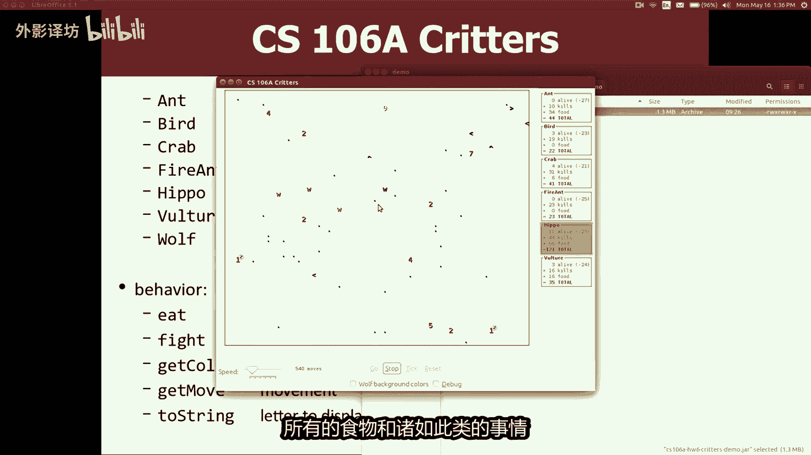

在课程的最后最后一堂课，我们要做一个我要参加的小动物锦标赛，你交出的所有狼，我会让他们互相对抗，一场生死之战，我们将观看直播，我们将观看小东西四处移动，谁让你进步，谁就知道谁是胜利者，会进步一点。

有趣的事情，所以你应该来，我们将在最后一堂课中做到这一点，但是不管怎样。

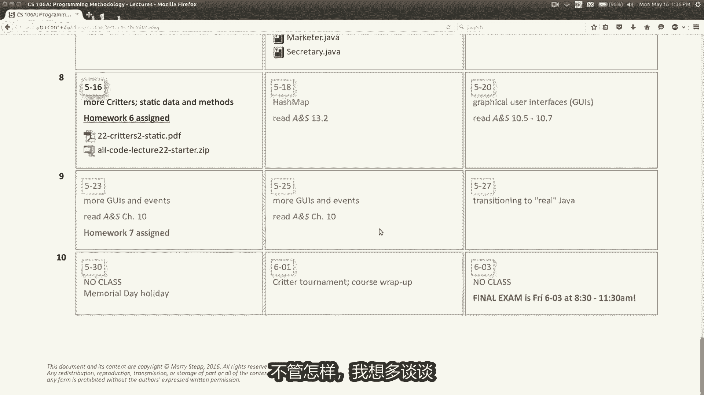

我想多谈谈这个世界，更多的谈论生物核，你需要对此做什么，这里有分配，所以有五个生物可以做的不同事情，它可以吃食物，它可以战斗，它可以在字符串上用颜色显示自身，它可以自行移动，我们讨论了五件事，如何如何。

当你编程时就是这样，小动物是什么，让你告诉我们要为每个小动物做些什么，运动和颜色，并与它们战斗，就像你怎么做，你怎么做，知道你什么时候写这个作业，就像你怎么说，这就是这样。

蚂蚁的移动方式与河马的移动方式相同，你知道你吃的怎么样，这么说，你捡的是的，是的，你写了一个子类，你要扩展的超类，超类名称是crater，并且当你延长该课程时，现在变成了一种动物好吧，那么如果我想说。

像我的动物以这种方式移动，这就是五个行为方法，记住这一点，上一对我们谈到的事情，讲座称为覆盖，所以我希望你覆盖这些行为，你将编写方法较吃或打架或得到颜色，或得到移动，或到您指定的字符串。

每只动物现在应该做什么，谢谢扩展小动物，你会收到默认值所有这五种方法的版本，creator类有这五个方法，它是您继承的五个方法来自crater，所以borrow默认eat方法总是返回的行为。

false表示你没有吃任何东西，食物战斗方法总是返回，我认为他说放弃战斗，所以你动物总是自动失败，默认情况下获取颜色返回黑色，移动保持在中心，它根本不动两个字符串返回，我认为是问号，所以这真的很无聊。

小动物好的，这是默认设置，如果你不希望你改变默认行为，通过编写自己的方法到达实施这些方法，模拟器的启动模拟器创建了一群动物，这就是我为他创建的用户代码提供的代码，所有的动物。

然后当你击中用于移动的勾按钮或勾选按钮，动画之前的模拟前面，他询问每只动物该走哪条路，你想移动它，打电话给继续所有的动物，然后他听，然后他让他们感动，这些方向经过一平方，然后如果有动物互相碰撞。

要用两者的战斗方法，让他们互相争斗，如果你碰巧落在一块石误上小点，他问你的动物是吗，想吃这个，他叫你吃方法，你应该返回你是否想吃东西，是对还是错，无论你是否返回true你的动物，如果你返回false。

则知食物，动物不吃食物就离开它，学生需要得到一件事，习惯就是你必须模拟器控制程序，这个程序你的小动物不是掌控一切的，不是你程序和运行方法，以及while循环和所有这些东西，你必须让模拟器做这些。

我之前已经提到过这些事情，最常见的地方是当你进行运动行为时，不能只是说偶我要写一个循环，向左行走五次，然后向右走五次，如果不能使用for循环，你如何指示像这样的运动模式，向左移动五，向右移动五如何。

一般来说你会怎么样，在这样的A中说这样的话，世界，是的，他们来使用技术好吧，所以让就像有多少部的最终记录，你让我再多一点，我喜欢的，这是一个好的开始好吧，我有数计算我正在做的动作数量，我还能做什么。

除了这个技术，我还能做什么，就像创建和存储什么的，你做LM吗，一定要把它设为私有，领域，所以它有点像生活的一部分，那个物体它的寿命与那个物体一样长，对象会存在，它是其中的一部分，每次创建数据对象移动。

你有点家长，加上你计数器，我再移动一次，还有什么，这似乎是一个好的开始点，我们还能做什么，是的，所以使用，就像一堆if else之类的，如果我的计数器删除的语句是五或更少，也许我会去左边。

如果我的计数器移除是六点或十点，我要向右走。

你可以做这些事情来了解向哪个方向移动，所以我们开始写作，我想我们这样称呼他的课程，伯克利人或伯克利学生活，我只是在开玩笑，所以他应该移动五个，向左走五步，然后开始结束了，这就是我们写的内容。

就像你说的那样，我们的动作计数器从零开始，记得你写的一个构造函数，来设置初始值物体的状态可以，那么当你做得到移动，你说移动加加，因为每次模拟器问我们，对于我们只会记住的举动，这是我们的又一举措。

然后我们说好，如果我们的举动，柜台不到五就会往西走，否则我们就往东走，原因是我们在这里添加了这个mod时，就这样，它会环绕并重新开始，就像当动作达到实时一样，认为它又为零，所以或者如果你不想说mod屎。

你也可以写一些逻辑来说明，如果我能够十将其设置回零，你可以做类似的东西，类似的东西，这里的事情就像如果移动式超过十不将归零，那也可以，那么你不必说，无论哪个人做的，作为父亲，你更有意义好吧。

那么当我运行这个东西时，我得到了QUATERMAIN，是我想要运行的，他问我是哪一种生物想要，所以我只会有，顺便说一句，伯克利的学生刚刚进来撰写此作业的条件，逐步的填充一件好事，关于你可以做的这个作业。

每种动物都可以单独测试一下，测试一下，更正确一点，再测试一点，您可以做的另一件事是学生们对此不知所措，其中很多如果你直接发送的话，就有25个，如果你愿意的话，就给一个吧，所以当我加载这个时是正确的。

它就在那里，为什么他说H我忘记了，每个应该像一头牛伯克利学生哦好吧，我不在乎什么，所以如果我愿意的话，我会向左移动五个五，对我可以说走，我可以有时注意它移动的有点快，如果你很难跟上，按下这个按钮。

它会说勾选它就行一次，这样我就可以数123，4512345，还有一个复选框显示调试，如果我选中该框，然后点击勾号，他会做一些他喜欢的事情，打印某种诊断信息信息，就像这样模拟总部数55。

我要开始移动55号小动物编号一共一，此数据更多，如果有很多小动物的话，很有用，但是现在只有一个上面写着，好像是伯克利的学生，有了这些信息，这就是他是我称之为移动，而你返回东部。

所以我要把你从21~22上X好吧，就像我一样，只是想向您展示一些这个东西提供的设施，对你来说，另一件事是很多学生们都喜欢，但不完全是向右移动，我真的不知道该做什么，如果你想展示的话，你知道吗。

一些有帮助的诊断信息，你自己你可以写你知道的消息，A的经典调试策略，学生将打印一行，你的代码中的语句是正确的，所以如果我说打印，我的移动次数是加上移动次数，但他没有，就像他强调了这个词。

很荣幸你还记得我展示的东西吗，你这样做，这样你就可以打一行程序中的任何位置，记住如何说，我听到低语很棒似的，我认为你说的是对的，你是说系统点除系统点点打印线，就是这样的，打印行的一般方式。

即使你的文件不是控制台程序文件，所以是的，现在他不再强调，他不再这样了，如果我关闭模拟器，我再次重新运行它，然后我再次只需要一个，实际上让我们do，让我们做，所以现在弹出他们是那里的两个，如果我点击。

如果我单击勾号，则转到此控制台，他会说我的移动次数是一，移动次数为一，因为有二个他们，这让他们都向右移动，但是另一件事是，如果你点击它调试模式，你实际上打勾，它一次只移动一只动物。

这样你可以观察每只动物，所以如果我点击勾号，我有点移动似的，然后如果我打电话又在那里，所以有点像我可以移动每只动物，12121两个等等，这样你就可以观看，我只是向您展示一些策略。

无论如何调试这个作业都可以，伯克利学生班，文字向左移动。

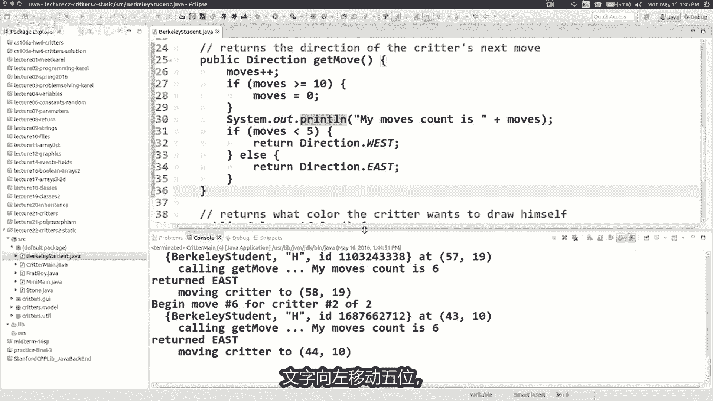

五位又五右好吧，我想稍微修改行为，让我回到这张幻灯片，哎呀我在哪里，如果我们说他怎么办，应该向西走，直到找到食物，并然后一旦他找到食物，它就应该吃它，然后一旦它吃完食物，应该改变主意。

现在改为向西走的地利的客户，给你一群人做饭吃它等等，我理解就像而不是数到五，数到545次，我要去指导我吃东西，你能帮我一下吗，我会让伯克利人这么做吗。

好吧，四人金条已经吃完了，那么也许当他第一次出生时，吃过的是假的，还好酷，顺便说一句，有些人你认识他们想要将这些合并起来，想说吃过等于假的，他们想要把这一切都做在一个这样的一个，没关系，但我想问题是。

有时你的构造函数有参数，并将变量设置为参数，所以我喜欢向人们展示你的模式有点一致，在这里证明你所有的私有字段，并你在这里设置它们的所有值，在某个初始值上，你知道他们应该有或有一些当事情发生时。

传入的值出生，所以我们有一个布尔值好吗，你还想用这个做什么战利品，还是其他人想帮忙这段代码之后的进展。

所以记住我们应该吃的食物，我们发现，然后改变方向，我们吃的很好，也许我们可以开始，让他们吃食物，你让他吃食物，是的。

好吧，我认为发生了一件事，有时学生想做，他们拥有的一种方法，以不同的方式做，比如我认为很多人都明白的例子，真正专注于运动，他们就走了好吧，我要向西走，往东走，这里有路吗，让我像你认识卡罗尔那样。

问你说如果蜂鸣器存在，我可以吗，说如果食品总统或类似的东西，你知道我可以在这里做吗，理解这种本能，但事实并非如此，这个模拟器的工作方式，这个模拟器在你碰撞时起作用，当你落在食物上时，它会记录食物。

告诉你通过调用一个方法，你的动物会调用get方法在你的动物身上，这个方法就是模拟器询问你的方式，动物你想吃那个食物吗，你刚刚落地，所以不用问关于食物哎呀，在这里，如果你想谈谈吃不吃吃食物。

你写一个公共布尔值第一次方法，在这里你返回，不管你想不想吃，总是可以返回相同的值，例如始终返回true或始终返回false，如果你总是想做同样的事，情，或者也许有时候你想吃东西。

有时你不喜欢用S和else调整你的行为。

基于什么的，当前状态，你正在为他的伯克利学生做总是吃食物。

所以我会回来，是的，你看到了吗，现在我们开始了，和你出去，让我做一个私人的，现在布尔值的字段是怎么回事，私人领域与这个新的互动，我们在这里写的方法，是的，所以此刻我就是这样，现在要吃食物。

每只脚都吃食物，现在我会说吃过等于真的，所以我会像记住一样记住，特别是对象的私有字段，在这种情况下，他们就下记，他们是该物体的大脑，记住发生在他身上的事情好吧，所以你的领域，你的私人实力。

您是否记得这里的字段，it方法曾经被调用过，基本上，所以我把它变成true好吧，移动代码，这个得到移动代码，它过去我们会数着步子，然后走左五，然后右五，我想要只是彻底改变那个动作，我要把他评论出来。

第二次哎呀，我正在评论他，因为我只是不想忘记什么，我们做到了，但我们并不真正想要那样不再有特定的代码。

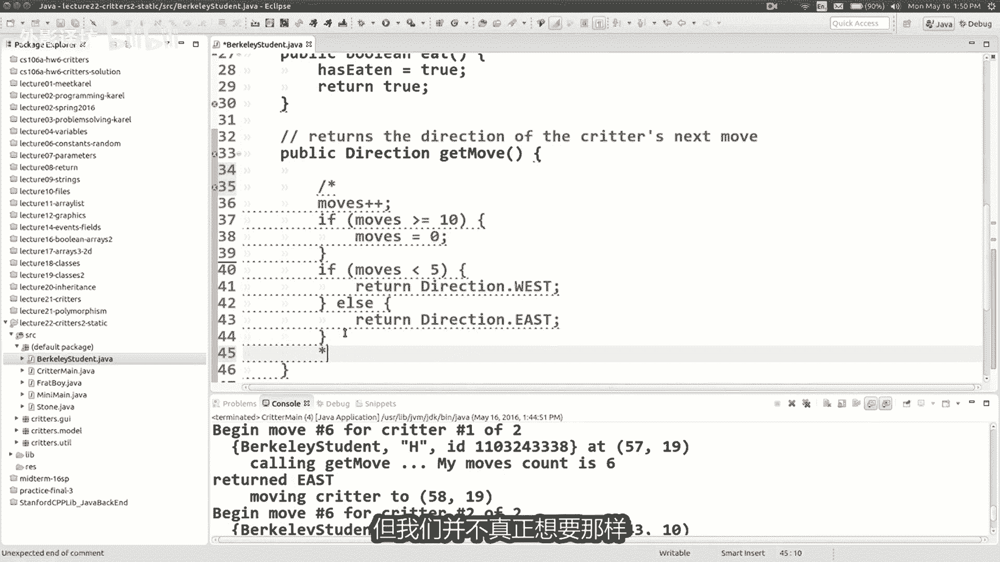

所以运动我真正想让他做的就是向西走，直到他找到食物，然后步行向东，直到他找到食物等等，就像我如何合并这个电流，我一直在写的代码，帮助我实现这个移动。

是的，当然可以，基本上就是我想要的方式。

动不动取决于我吃没吃，所以我会忘记他说的是什么，如果我从来没有在我向西走之前吃过。

直到我找到食物，然后我要去东边，也许就像如果我有，如果我有没吃过，我会向西走，但如果有的话，吃过我会向东走，让我们从这里开始，再次就像我想强调的那样，增量开发在这里作业对你写一个有好处。

测试它的代码很少，所以让我们开始，我认为这不完全是一切，但让我们用两个来运行它，伯克利的学生，所以我认为我们想要观看的是其中之一，他们就在这里，我想他会把这件事过去，最终他会在这里遇到一些美食家。

他会吃掉它，然后我就想要它之后就回去吧，让我们看看他是否这样做，去观看吧，好吃，她正在睡觉，他困了好吧，他走了，他又睡一会了好吧，无论如何，他开始去左边，然后他吃，然后他向右走，太好了，这就是我想要的。

除了我，我认为我想要的啤酒是一个虫子，虽然你看到这不是正是幻灯片所要求的内容，你看到上面现在是什么了吗，我是一个还没有帮助过我的人，任何新人，买什么，是的，他应该向左走，然后吃，然后退，然后吃。

然后再次向左走，但我们的优点一旦他永远保持正确，翻转到正确的模式，所以我该怎么做，他走路我该怎么解决这个问题，是什么问题，是的，重置已经吃过的东西似的，我想那就是好主意，所以我们有几种方法可以修复它。

有点像吃过东西，如果我按照我发现的那样走，就会变成真的，我吃的食物，我把布尔值翻转为true true，布尔值，让我回去，然后最终我发现，除了吃它之外的另一块食物在此，所以现在我需要寄出去。

再次回到左边，我想实现这一目标的最快方法是，只是打开和关闭布尔值，时断时续，就像一时一时，当我找到左边的食物并关闭时，找到右边的食物，所以我想如果有的话，你会做类似的事情，EIT已经是true。

如果则将其设置为false，这不是真的起始状态，将其设置为true类型，向右翻转，将其翻转到它不适的位置，当然这一切都是你亲手做的，可以缩短这一切，你可以说各有各的变成没有吃掉，你知道我的意思。

将布尔值设置为负，本身将其设置为与自身相反的值，翻转最简洁的子弹表达你所描述的内容的方式，所以如果它是假的，就翻转它，如果它是真的，这是真的，让它成为假好吧，所以让我们尝试一下，看看他们是否这样做。

我们就这样写吧，这样我就向左走，我现在吃点东西就走，他向右走，我看看它是什么，要吃这个，我要它向左走，是的，所以不他正在工作好吧，我认为这是一件很常见的事情，学生们会做的就是他们会说好吧。

让我检查一下他是否这样吃，他们会做一些事情，比如如果吃的话，他们会尝试调用it方法或其他方法，但我希望你明白，即使尽管java这样做是合法的，让你这样做，它不会生成编译器错误，并不能很好的工作。

对于大多数你正在做的事情，在小动物计划中做，因为他不喜欢你调用it的方法，那并没有真正做任何事情，重要的是模拟器何时调用你的饮食方法，就是这样事情，所以在几乎所有情况下，如果其中之一。

你的方法正在调用另一个方法之一，你可能正在做某事的方法错误的，因为大多数这些方法都是从外部向你发出信号，我的意思是想类似的，我看到很多误解是学生会说，嘿，我知道我想搬家两次，我想要移动。

就像我想要欺骗我，想要以两倍的速度移动，所以我会打电话说，动起来动起来吧，现在我有两个动作不会，让你明白我的意思，就像你可以打电话给移动100，如果你愿意的话，但模拟器不听，他不会注意到。

重要的是模拟器何时调用，无论你回到哪里，都要继续前进，它会让你更进一步那个方向，否则他们会像我一样想要以两倍的速度移动，所以我会返回方向，如西城2号屋，那行不通，你知道你做不到这些事情，人们总是问我。

我喜欢看人们来办公时间，他们会笑，你能告诉我如何欺骗他吗，这样我就能赢，我就像对不起你一样，知道你可以，但是无论如何，如果你我有这种本能，就像这种方法，真的想调用it方法什么，你可能实际上在说什么。

你可能真正想要的是你想要的你的饮食方法，来记住一些东西，然后你在get move中查看你想做某件事的方法，eat方法中有一个私有字段，然后在get中产生以下影响运动理解理解，所以那就是我想要传达的信息。

对此有任何其他问题吗，这门课是的是的，很多，学生真的很喜欢思考事情，在提示计数器等方面，所以你可以想象我有一次吃过计数器，它是一个int核，当你吃一块食物时，你会加上加上它，如果是偶数，则向左走。

向右走，很奇怪或者类似的，那太好了，我的意思是在这种情况下，他们同样好，因为就像你只走一条路或其他，所以你只需要在两种状态之间切换，但是是的。

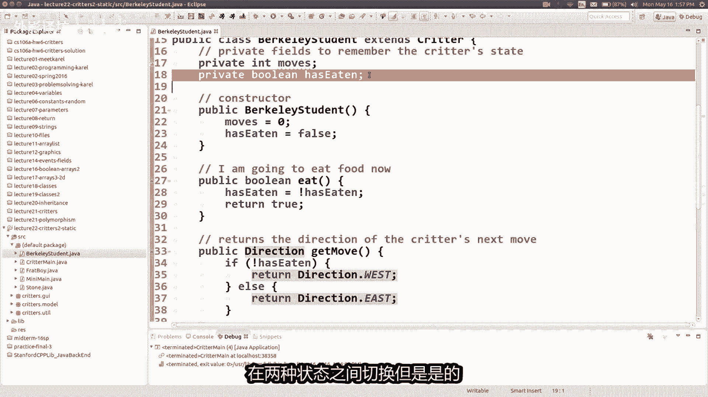

有时你宁愿有一个遇到一些已经死去的东西，有时取决于你们的思考，关于什么变量，什么私有，这些生物应该做什么状态，我该如何编写这段代码，这样我就可以记住，我需要记住的事情，实现我所要求的行为。

有时你想数一下有多少个总移动次数，是动物的移动次数，他吃了多少次，打了多少次，有时你想要记住过去发生的事情，上次我可能走哪条路，将其存储为方向厂或内野或其他什么地方，做了多少次，我朝那个方向移动。

保持柜台等正确，你只需要想出正确的记住这些事情的私有字段，好吧，让我们再做一个小动物吧，强调这种的罢工，这是蛇蛇东西，大多数有默认行为，但它没有吃食物，它不会战斗，它是黑色的颜色，但它是字符串。

是一个S，它是动作是那种像蛇一样模式好吧，他向东下降一两次，向西向下一三圈道，东下D456，所以这是一个向右拓宽水平路径，所以我想要。

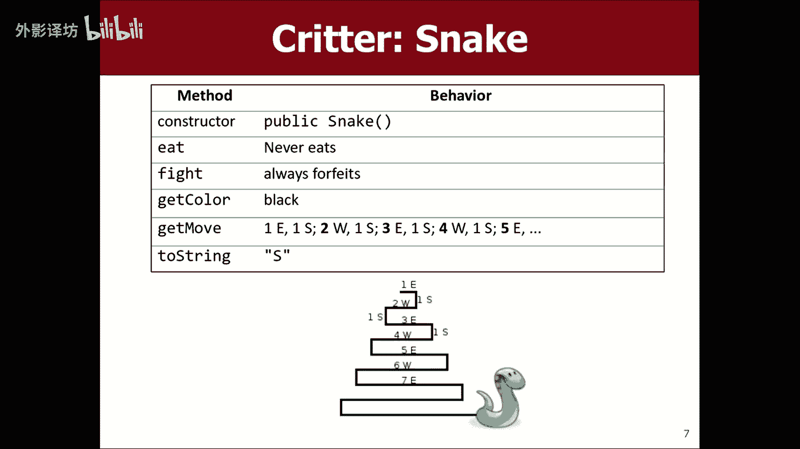

你们帮我编码这个我回到我的项目，我你看到了吗，java里没有蛇，在这里我只是想说明一下，就像你会如何创造一个新的生物，在一个项目中，如果你愿意的话，你可以右键单击此处编码并说出新类。

它就会弹出这个看起来非常可怕的盒子，所以不要害怕，只需输入snake并按enter键，然后他说好吧，我给你做了一个snake java，它是一个公共类社，但我在这里缺少一块。

我在光标扩展处放了什么正确的小动物，然后如果你保存它，他会说好，我不知道在哪里，小动物就是小动物和你可以悬停救下欧，修复它，我想导入小动物好吧，现在很酷，我已经导入信用了，就这样了。

现在你有一个学分课程，并且只是为了向你证明我有一个小动物，如果我再次运行模拟器，它是就像嘿，你想要一些蛇的样子吗，明白了，我可以说是的，我愿意，我确实想要一些蛇，它们就在那里，它们只是黑色问题是的。

所以我有一个小动物类，让我们不让它们成为问号，让我们把它们变成废话，是怎么回事，我可以把它从问号改为S吗。

我该用什么方法串起来，串一些正确的东西。

所以我写公共字符串到字符串，我返回SS好的保存，现在就跑，他们是AC大使，我们就这么简单，只需编写一个方法，再次运行它，编写一个方法，再次运行测试一下好吗，做最难的部分的动作，哎呀刚刚发生了什么哇。

我在哪里，我不知道发生了什么事，让我们做公共指导吧，让我们感动吧。

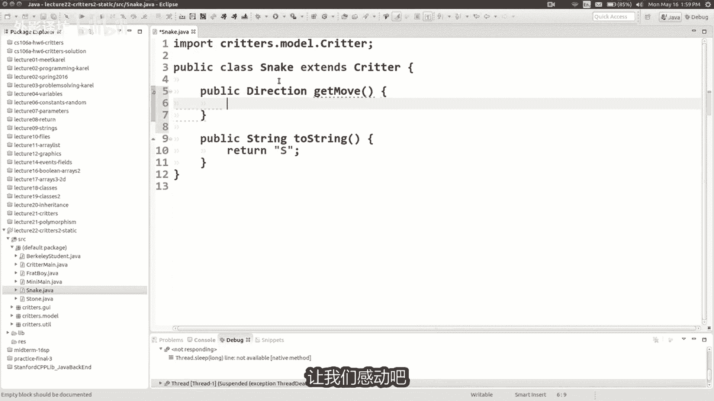

再次记住我的动作模式，只是想从幻灯片上写下注释，这里他应该向东向南移动到S向南。

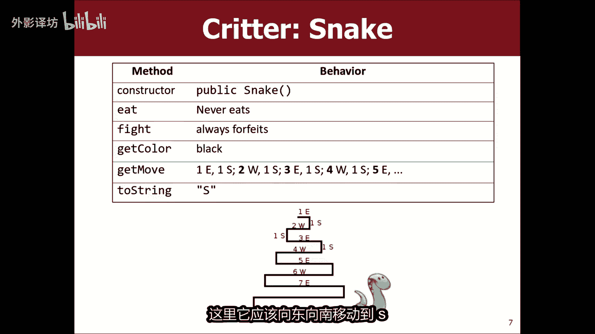

所以东西南西南东南向就是这样的运动，我应该这样做，我该怎么做，你们有什么建议，我想要，这么近。

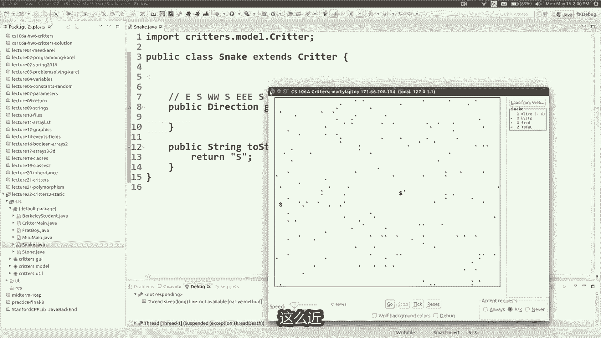

任何建议，东西方柜台移动好吧，你的意思是分开两端吗，一个为东，一个为西，好的私有int，有点像east，或者向西移动类似的东西，各自进行了多少步，每当我们有私人的时候，这些方式都可以。

我们可能想要公开的领域构造函数，设置值字段，所以你是这样说的，我已经做了多少步，所以我当我第一次的时候可能会转到零生来，就是这样的好吧，所以我在这里，可以说我还需要一点，意味着这是一个好的开始。

我喜欢这个开始，当然这是他的一部分，就像思考你可能想要哪些领域，然后他的另一部分正在制作，请务必仔细更新值代码中的这些字段，一起确保它们存储正确的，你想提供一些信息吗，更多的，哦好吧好吧是的。

我想这是一个像你一样善于观察，说这些水平延伸得到，每次都大一，所以也许这就像我距离的长度会水平移动，好吧，就像最初我的东或西长度是一个，然后在某个时刻，我在这里会加上，就像你说的那样。

所以就像我要加上加上这样，下一次从三点变成四点，这五个是我们需要的好元素更多，但这是一个好的开始，还有什么想法吗，确实如此，即使在古细菌，好吧好吧，所以你是说如果这样。

如果mod2是你的那事情就很奇怪了，说就像这个或这个或者这个，那么你就说我应该向东还是向东好，还有类似的东西好吧，这些事，顺便说一下一件事的好元素，常见的事情是人会得到这样的错误，他在这行代码下划线。

你知道为什么有下划线吗，以前可以，但现在不行了，喜欢看，你知道为什么是的，当你return方法停止以及原因，很生气的是，他说没有去19号线的方法，绝对有无法到达那行代码无法访问的代码，所以它是非法代码。

所以如果你要做这种事，你必须在回来之前做这件事，我猜问题是我什么时候做，所以我们正在做好事，但我们失踪了，我们还需要更多，这里有更多更多作品，还有其他想法吗，请记住，我们不仅在移动东塞西，我们也要去。

有时候向南走，太对了，你知道如果你想成功，我们可以做什么，稍微简单一点，我们就可以开始忽略男方的事情，我们可以做，如果您愿意，我们可以这样做，也许这样做将帮助我们了解如何把男方放进去。

所以还有其他想法吗，好吧，我有事会告诉你，这一点无法看到开头模式，但他们可以看的更清楚，稍后在模式中，如果我们像这样开始，所以就像，西五东六西七东方又怎样，如果这从四个开始。

我基本上是说前四个移动需要向西移动，所以我该怎么做，确保它正好移动了四次，西方时代就像这个东西mod2仕林不是易，所以他会进入这里，但他总是会在这里，永远永远永远向西走，怎么办，我能确保他去西部四次吗。

然后在那四次之后之后就会开始变得不同，我怎样才能做到这一点，是的，所以我把它放在前面，一切重要的事情就像哦如果我在的话，我的第四步还好，所以没办法，但你问的是我没有给你提供的数据。

说你想知道接下来会发生什么，这就是我需要多少步，但你想记住我有多少已经做到了，所以我希望你们能看到是的，你完全可以编写代码，但你必须记住，你必须这样做，你必须写字段。

所以我们就去像私人一样计算我们的动作，之前在伯克利大学做过这个学生，所以只是int移动了多少步，我们已经做了，所以最初我们已经做了没有动作好吧，所以每次都在这里行动起来，我们现在已经做了一个。

多动一下就好了，所以这是一个好的开始，就像现在这样，与此权利相关的秘密是什么，酱汁我还能做些什么吗，可以给你，是的是的，这件事一直在上升，如果他变得这么大的话，就会继续上升，事情变得那么大，我们应该做。

你想做的说的是增加短打的长度，然后从零开始移动，因为现在我们已经做到了零西方六格中，五个东方零移动式的，所以动作更像是这个动作，当前的水平行走，我们将到达水平行走的终点，重置并延长步行时间。

所以我想你的意思是在这里这样做，如果移动已达到向东或向西的长度，然后加上东或西长度，然后将动作重置为零，类似的事情我们应该想想，我们应该小心，有时我们不想被一个人打扰，思考它是否更大，大于或等于。

所以我们将在一分钟就看到了，但这很好，而且现在这个长度会不断调整，本身以及长度是偶数还是奇数，这会告诉我们向左或向右向西走或者东边，所以让我们尝试一下，所以我只会有一条蛇，所以它实在那里测试真的很容易。

它没问题，所以如果我做的对的话，让我们看看应该向西走东五，所以让我们勾选西西西，咚咚咚咚咚，嘻嘻嘻嘻嘻嘻嘻，那是，非常接近了356了，几乎是对的，几乎是对的，所以我认为我们想要的是，我认为我们想要。

我想这就是我们希望你必须做的，把这些事情做好，这样你就可以，如果我们现在是你，我们就迈出一步，知道我们现在是否已经准备好了，我们应该做出超过四步的动作，从我们的第一步开始，让我们再试一次。

让我们再试一次，这是蛇，123412345，1234561234567等，看起来像效果很好，当然然后哇发生了什么，我不知道，抱歉，当然那么我们就将其改回我们想要的，想从1234开始好吧。

但我一会儿就会做，但现在让我们把南方合并起来，东西应该去维斯维斯维斯西难难难，所以我有什么想法，确定如果他过去了，他是否会更大，我要开始我的下一个水平线，但是你是说这是否正确。

如果我刚刚完成我的边界水平运行去难瓦，所以否则，如果移动完全等于向东或西昌回南方向呢，就这样卖好吧，让我们试试吧，应该先向西走四次，然后向南走，东五四塞斯，让我们尝试一下，234哎呀，南12345。

所以我想我认为我们只是，差了一位，但这很容易解决正确，如果他等于长度加一，然后我想这就想这也需要加一，不是因为真正发生的情况是，如果你要去东方五次，应该进行五六步，然后转身，所以我认为只要它大于那加一。

我的意思是你必须稍微摆弄这些东西，有时加1-1，大于大于或等于重置为零，重置为你必须调整它的一个并填充并测试它，直到它可行，但让我们尝试一下，所以我想做自东南五次以来，西四次时代本身他已经准备好了。

1234南，12345男，123456男，看起来就像他正在工作一样，所以最后一件事为什么我一直这样做，想要从一开始长度，并且不是四点，让我们看看是不是行得通，让我们做25个来保存东西，有趣的准备好了。

他们出发了，所以我们有一个水槽，这有意义吗，到目前为止，你们还有疑问，我们在这里所做的，我的意思是，这并不容易正确的代码，这有点棘手，这对我们花了一些时间迭代，我们必须测试它，我们必须完善它。

但你最终会做很多像这样的东西，你知道你保留了您看到的几个不同的计数器，当他们获胜时，他们会互相联系，其中一个经过另一个你，你必须小心地增加他们，想象我之前还有多少部改变，你知道你经常做的事情。

这种东西我什么时候重置，回到一些初始状态，这些事当你写一个东西时，你会做一些事情，职业生涯的复杂运动，让我再教你一件事，我认为这会很有趣，最后一件事不是有趣，我认为这可能对一些人有帮助。

如果你想写一个酷狼动物，为你喂你模拟。

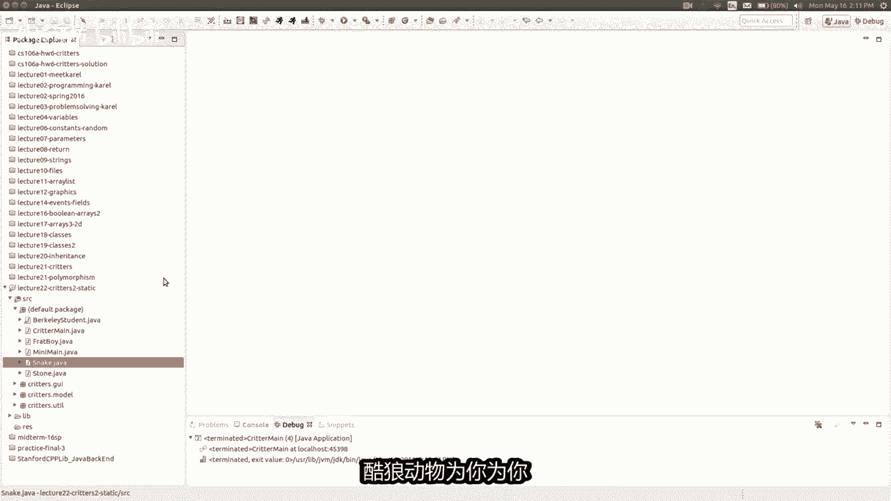

让我们谈谈一些事情，称为静态数据还是静态数据，嗯这就是我想要的例子，用来说明这个概念愚蠢的例子，这是一个兄弟会聚会，我们都会去同一个兄弟会聚会，所以我们互相打电话说，嘿，一切都在罗布里结束了。

罗布利很高兴，所以我们去那里参加派对，或者其他我不喜欢的活动吧，了解有关罗布利的一切，但我已经听说它亮了，所以我们要去那里，所以我们要去罗布尔，所以大家给每个人打电话，并给自己ROBT的地址或位置。

以便他们都想去那个地方游戏世界，还好他们怎么样，这就是为什么我说的具体一点向北，然后向东走，直到到达我正在开玩笑的聚会场所，我希望人们不会感到不安，我不知道我是否取消兄弟会或其他什么。

就像我只是说我可能会那样，兄弟会同意，他们都会去一起聚会什么的，但无论如何如何让多种动物能够互相交谈，就是这样，我真的很想，也许我们都会选择派对将在哪里举行，我们都在会会合，我们都会去看到彼此的位置。

所以如果派对有一个随机生成的地点，让我们假设一下世界的维度是六十五五十。

所以如果我们我们要去一个随机的地方吧，想一想，如果我们要的话，这里是兄弟会南海搬移动到一个随机地点，然后公开方向移动，我应该移动，移动到随机地点，好的随机的，我们需要随机选择一个地方举办这个派对。

我该如何随机挑选一个地点，以及我应该将代码放在哪里，我应该随机选择一个地方，把它放进去，get move方法，为什么是为什么不是什么，你认为是吗，是的，这是个好主意，将其放入构造函数。

你为什么喜欢把它放在，不仅仅是把它放进去，得到运动完全正确，所以如果你做，十超我不想十次收获，这是一个聚会场所，当人们改变时，你会讨厌混乱植物的一部分，在你右边十字，你想选择一次派对去那里好吧。

让我们随机选择聚会地点，我如何随机选择我使用的任何东西，随机生成器，是的，谢谢你好的，那么X方等于随机怎么样生成器点获取实力点，下一个整数从0~60，我认为最大是59，技术上恶好吧，然后是随机的。

为什么，我认为我们所说的世界，你知道60X50的世界好吗，为什么是0~49，好吧好吧，有我要去哪里，所以现在我在应该搬到那里，并开始行动，告诉我一些我需要做的事情，我需要做出的改变，这是个好问题。

你说那会让一个聚会成为每个兄弟会，都有不同的聚会地点，男孩对象是的，实际上是这样，不太行得通，我想写，首先就是这样来帮助说明，我们需要解决什么问题，如果您不介意，所以我的意思是，我认为这件事是。

如果我想在中使用这些变量，如果我想使用get move方法，一种方法中的变量，在另一种方法中，方法我需要做什么，我需要将它们设为私有领域，Private int party x。

Private int party y，然后，在这里我只是正确设置他们的价值观，好的现在移动到随机位置，我觉得应该很漂亮简单，只需向北移动，然后向东移动即可去参加聚会。

我怎么知道我是否你在聚会上发现了这个介绍，一件新的事情，是我如何知道我在世界的哪个地方，名为GX的小动物中的方法和得到Y，或者你可以询问XY位置，你在但也有你的动物写你不需要的作业，使用那种方法。

但我认为基本上你可以说的是，如果你明白为什么不是派对范围，那么你可以吗，返回北方，记得你包裹如果你穿过顶部，你就会结束，围绕底部向上，然后否则如果你得到X不是派对X，你会向东返回。

然后如果这些都不是真的，如果我得到了这个，这一定意味着我在派对就在我身边，所以我就返回方向中心，我会待在那里，直到他们用完，酒量不错，所以我们来试试吧，所以我要关掉蛇，我要向兄弟会的人发起攻击。

20个或者我们做十个都可以，准备好了，他们是问号，我们开始吧，很容易男孩们在那里安顿下来，他们生了一个孩子，但似乎并非如此，它们现在完全聚合了，实际上就回到了你的问题，你的问题非常，正如你所说。

这不是有洞察力吗，会卫每个物体都是我想要的，我知道有十个兄弟会男孩屏幕上的每一个物体，当他出生时，随机选择一个政党X和Y方，他会记住那组坐标，以便它记住那些坐标，下一个诞生精选他自己的一套派对。

X与Y并记住那些可能不是的坐标，与第一个人的坐标相同，所以他们各自进入自己的世界，个人聚会，这是一个Y的聚会，乘以十对，其中一些碰巧一路上互相碰撞，但嘿这只是你知道的，有点随机。

你知道tinder类型的东西，所以也许grinder实际上N，但无论如何，他们都会去不同的聚会地点，所以我真正想要的是，我想要所有的，我希望他们都去同一个地方聚会地点，我该如何实现，好吧。

看起来这实际上只是在java，其实很简单，必须改变一点代码，你在前面写上static这个词，这些变量我将解释原因，这有一瞬间的差别，让我只是运行它，哎呀我今天不能，我的意思是看这个样子，他们都是。

收敛哇，刚刚发生了什么，他们在那里汇聚，他们去，那他们去，那不管你在哪里，空气中都弥漫着爱的气息，去哪里，每个人都要去插入，你自己关于这个的笑话例子，但是N他们都在进行到同一个部分，一切都好。

似乎已经解决了，这样更好，你知道我们刚刚看到了什么吗，像他们一样发生了什么事，有点都来到同一个地方，但后来他们刚刚开始想去某个地方，否则过了一段时间似的，所以发生了什么事，好吧抱歉让我解释一下。

我没有解释一下static是什么意思，共享这些是它的同义词，通常分享记得我是如何教的，当你有一个类时，你在java中，你有我告诉过你的这些变量，那个的每个单独的对象类有自己的副本变量，这是一个重要的。

我希望你们是这样的概念，如果你读了这个词，就能理解，static位于变量前面，但它不是每个对象都有一个单独的副本，他们所有人都可以有一个共同的意识，查看同一变量的一个版本。

他们所有人共享一个X方来做一件事，他们共享同一个的部分原因，如果你改变其中一个对象，改变所有其他对象立即看到变化，所以为什么当他们相爱的时候，他们有动过吗，那是因为在前十个之后，后来出生的第11个孩子。

他收割党的快速解决办法是，您将这些设置为负疑惑某事，然后你在这里说好，如果他们是消极的，那我就只设置聚会地点一次，但不会再有这样的方式，如果出现以下情况，借五重新包装聚会地点。

我再次运行它，如果我再次运行它，我们。

时间不够了，所以我会在结束后立即停止，如果我再次运行它，并开始请运行它模拟器，它们都去一个聚会场所，它形成了一个非常多情的地方，某种小康家五线和那些小婴儿飞向空中，试图再次回到聚会。

所以这是一个非常快速的介绍静态数据。

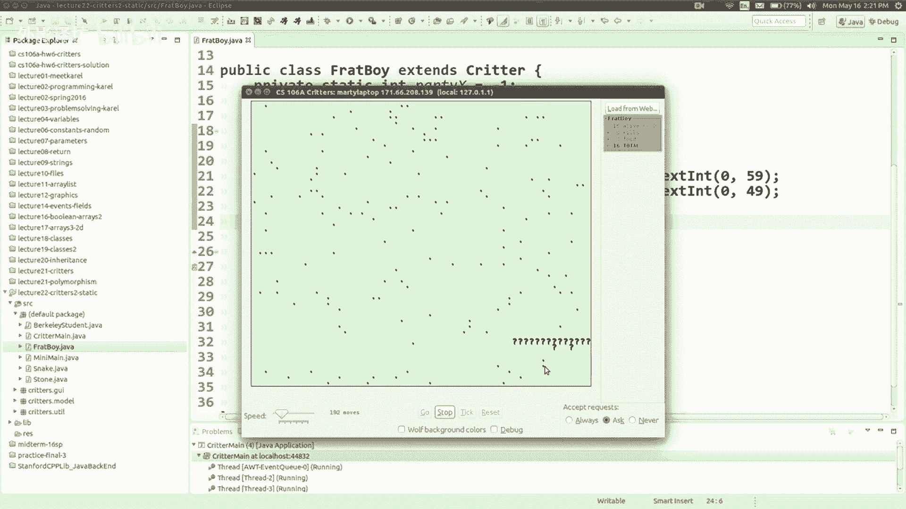