# 课程22：小动物模拟进阶与静态数据 🐾

在本节课中，我们将深入学习“小动物世界”模拟作业的更多细节，并探讨一个重要的Java概念——静态数据。我们将通过具体的代码示例，理解如何为不同的小动物编写复杂的行为逻辑，以及如何使用静态变量让多个对象共享信息。

---


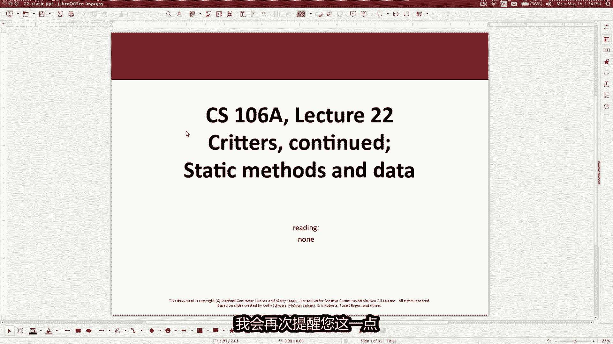

## 作业安排与课程概述

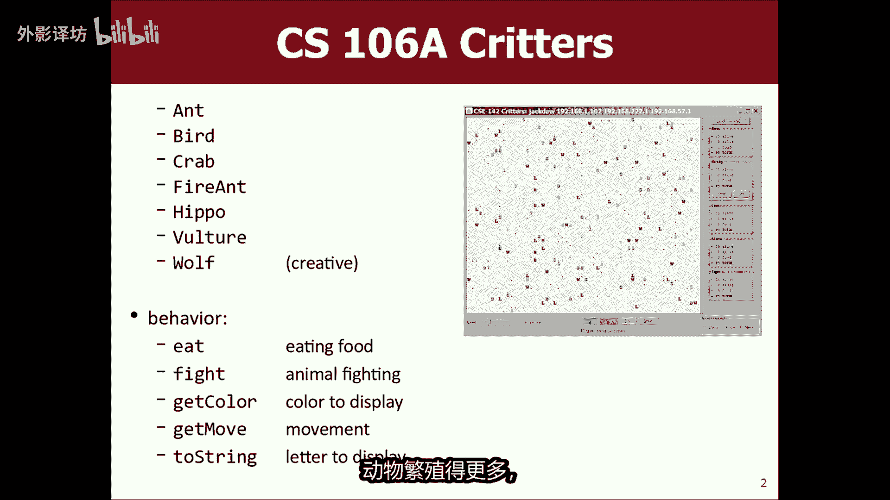

这是课程的第八周。本节课将继续围绕继承、对象和类等概念展开，并重点讲解作业六的基础——“小动物世界”模拟。

关于作业安排，请注意：作业六的完成时间为一周，随后作业七将发布。春季学期时间较短，因此课程安排较为紧凑。作业七是一个更大的项目，包含更具挑战性的算法内容。作业六的截止日期已确定，作业七将提供较晚的提交时间选项，以方便大家规划期末周的复习。


---

## 回顾小动物世界模拟

上一节我们介绍了小动物模拟的基本框架。本节中，我们来看看这个模拟的具体目标和你的任务。

在这个模拟世界中，有多种小动物（如鸟、蟹、火蚁、河马、秃鹫），它们的目标是生存：寻找食物、繁殖后代并避免被其他动物杀死。你的任务是编写七种动物的行为，其中前六种已有指定行为，而“狼”的行为完全由你设计。

模拟器运行时，动物们会根据你编写的逻辑行动、竞争。最终，一些动物种群会增长，另一些则会减少。在课程最后一课，我们将举办一场“小动物锦标赛”，让所有同学提交的“狼”一决高下。

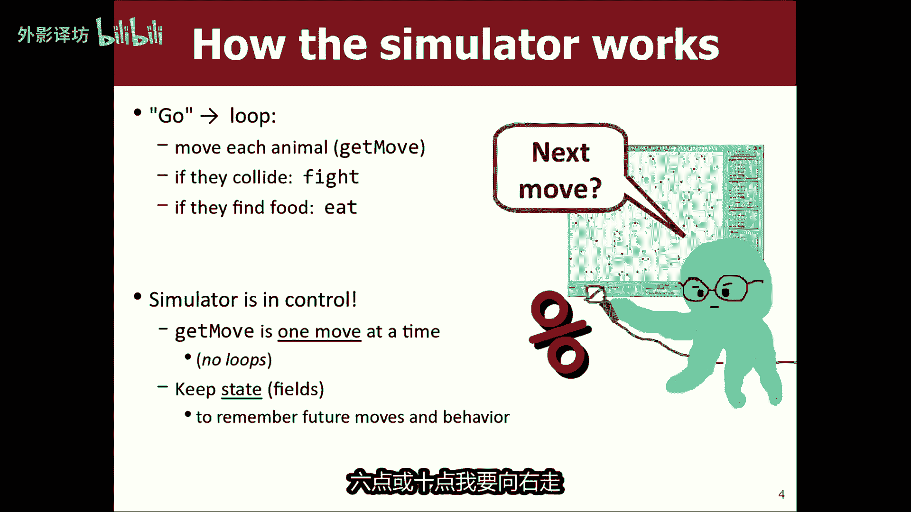

---

## 小动物类的核心方法

要为一个生物编程，你需要通过继承 `Critter` 类并重写（覆盖）其五个关键方法，来定义它的行为。以下是这五个方法及其默认行为：

*   **`public boolean eat()`**：当动物移动到食物上时被调用。返回 `true` 表示吃掉食物，返回 `false` 表示忽略。**默认返回 `false`**。
*   **`public Attack fight(String opponent)`**：当与另一个动物相邻时被调用，决定攻击方式。**默认返回 `Attack.FORFEIT`**（放弃战斗）。
*   **`public Color getColor()`**：决定动物在图形界面中显示的颜色。**默认返回 `Color.BLACK`**。
*   **`public Direction getMove()`**：决定动物每一步移动的方向。**默认返回 `Direction.CENTER`**（不动）。
*   **`public String toString()`**：决定动物在图形界面中显示的文本符号。**默认返回 `"?"`**。

**重要提示**：模拟器控制着整个流程。你的代码不是主动运行的“主程序”，而是通过重写上述方法，来“响应”模拟器的询问。你不能在方法内部使用循环来控制多步移动，而需要通过**私有字段（实例变量）**来记录状态，从而决定每一步的行为。


---

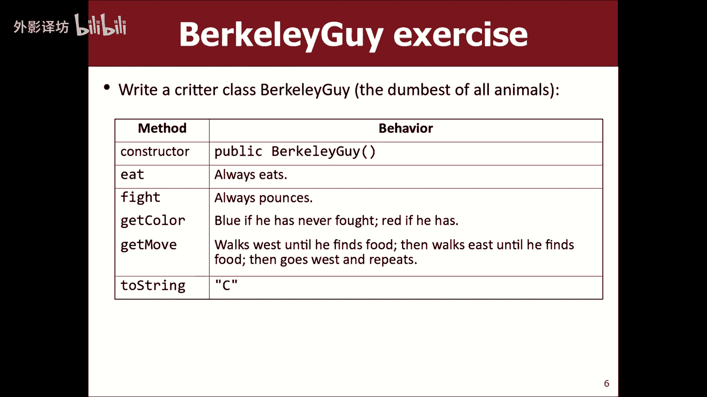

## 实现复杂行为：状态记录与私有字段

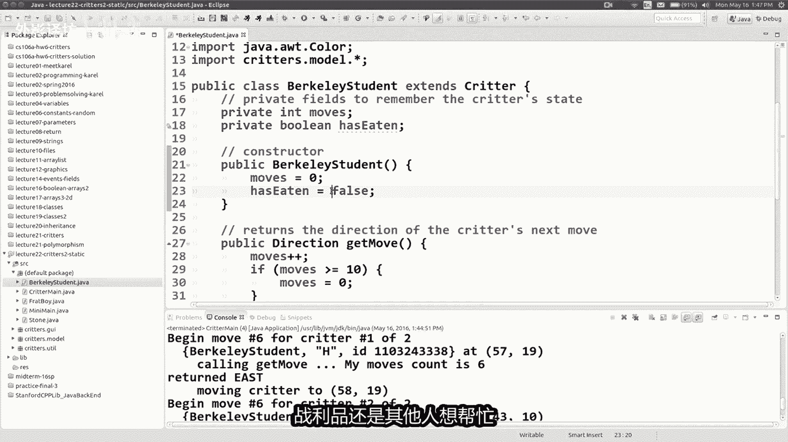

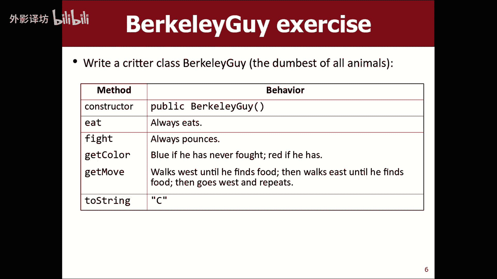

为了演示如何实现依赖历史状态的行为，我们以两种自定义动物为例。

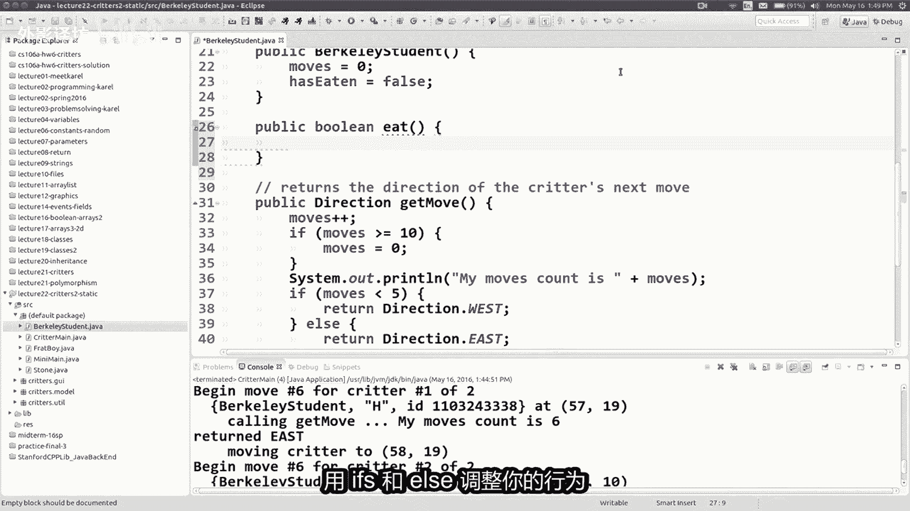

### 示例一：伯克利学生 (BerkeleyStudent)


假设我们希望 `BerkeleyStudent` 先向左移动五步，然后向右移动五步，如此循环。


**核心思路**：我们需要一个私有字段来记录已经移动了多少步。

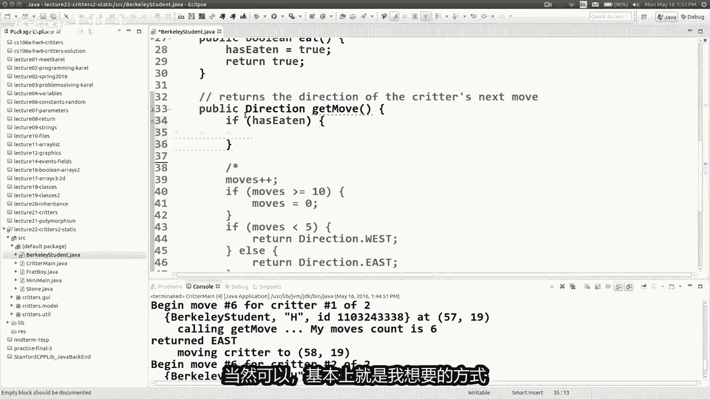

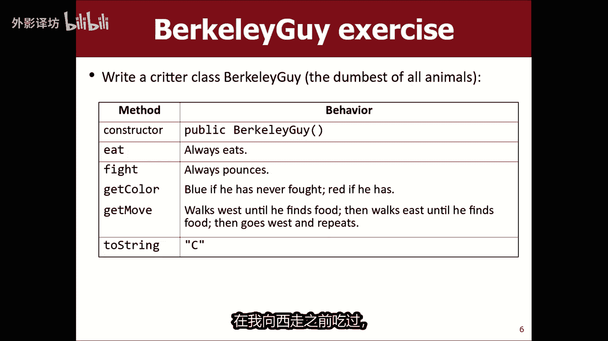

```java
import java.awt.*;
public class BerkeleyStudent extends Critter {
    // 私有字段，记录移动次数
    private int moves;

    public BerkeleyStudent() {
        moves = 0; // 初始化
    }

    public Direction getMove() {
        moves++; // 移动次数加1
        if (moves % 10 < 5) {
            return Direction.WEST; // 前5次（0-4）向左
        } else {
            return Direction.EAST; // 后5次（5-9）向右
        }
    }
}
```

**代码说明**：
1.  定义私有整型字段 `moves`。
2.  在构造函数中将其初始化为 `0`。
3.  在 `getMove()` 方法中，每次调用先将 `moves` 加1。
4.  利用取模运算 `%` 实现每10步一个循环，并决定前5步向左，后5步向右。

### 行为升级：寻找食物并转向

现在，我们希望修改行为：动物一直向左移动，直到找到并吃掉一块食物，然后改为向右移动；找到下一块食物后，再改为向左移动，如此交替。

**核心思路**：我们需要一个布尔类型的私有字段来记录“最近一次是否吃过食物”，从而决定移动方向。

```java
public class BerkeleyStudent extends Critter {
    private boolean hasEaten; // 记录是否刚吃过食物

    public BerkeleyStudent() {
        hasEaten = false; // 初始状态未吃过
    }

    public boolean eat() {
        // 无论遇到什么食物都吃
        // 吃完后，翻转 hasEaten 的状态
        hasEaten = !hasEaten;
        return true;
    }

    public Direction getMove() {
        if (!hasEaten) {
            return Direction.WEST; // 没吃过，向左找
        } else {
            return Direction.EAST; // 刚吃过，向右找
        }
    }
}
```


**关键点**：
*   `eat()` 方法在动物落到食物上时被模拟器调用。我们在这里改变内部状态 `hasEaten`。
*   `getMove()` 方法根据 `hasEaten` 的状态决定移动方向。
*   **切勿在 `getMove()` 方法内部调用 `eat()`**。行为的改变应通过修改私有字段的状态来实现，由模拟器在适当时机调用相应方法。


---

## 实现更复杂的模式：蛇 (Snake)

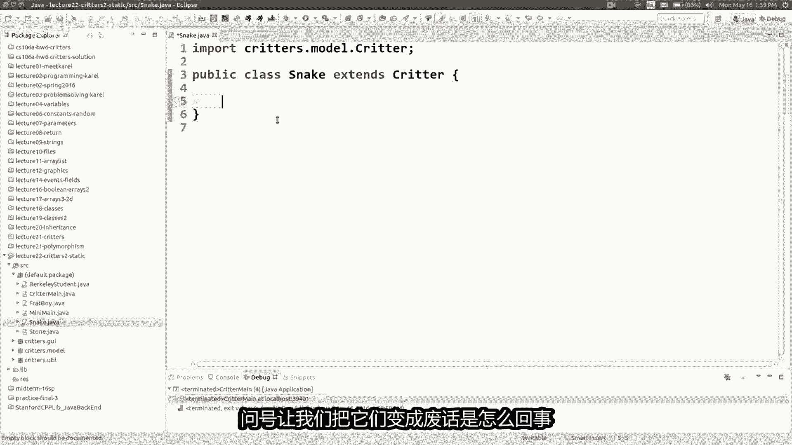


假设我们希望 `Snake` 按以下模式移动：东1，南1；西2，南2；东3，南3；西4，南4…… 即水平移动步数递增的“蛇形”路径。


**核心思路**：我们需要多个私有字段来跟踪状态：当前水平移动方向、在当前方向上已移动的步数、当前水平移动的总长度。

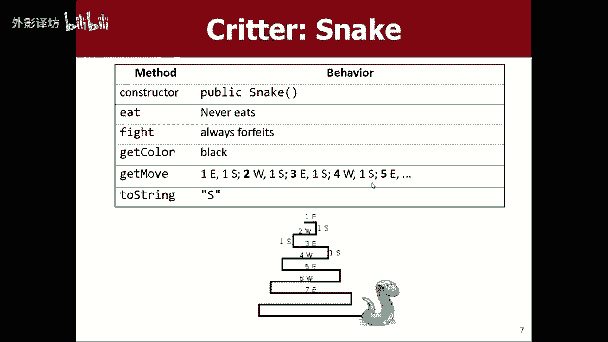

```java
public class Snake extends Critter {
    private int moves;      // 在当前水平行内已移动的步数
    private int length;     // 当前水平行需要移动的总长度
    private boolean goEast; // 当前水平移动方向是否为东

    public Snake() {
        moves = 0;
        length = 1; // 从长度为1开始
        goEast = true; // 第一步向东
    }

    public String toString() {
        return "S"; // 显示为 S
    }

    public Direction getMove() {
        moves++;
        if (moves <= length) {
            // 还在水平移动中
            return goEast ? Direction.EAST : Direction.WEST;
        } else {
            // 水平移动结束，先向下走一步
            moves = 0; // 重置步数计数器
            length++;  // 下一行的长度增加
            goEast = !goEast; // 切换水平方向
            return Direction.SOUTH;
        }
    }
}
```

**开发技巧**：这是一个迭代开发过程。可以先实现基础循环，再逐步添加向南移动和长度递增的逻辑，并通过模拟器的“单步调试”功能反复测试和调整条件判断（如 `<=` 或 `<`），直到行为符合预期。

---

## 静态数据：让对象共享信息

上一节我们实现了单个对象的复杂行为。本节中，我们来看看如何让多个对象共享信息，这就需要用到 **`static`** 关键字。

考虑一个场景：创建一种 `FraternityBoy`（兄弟会成员）动物，所有成员需要前往同一个随机生成的派对地点。

### 初始问题：各自为政

如果只在构造函数中为每个对象随机生成坐标，那么每个成员都会去往不同的地点。

```java
public class FraternityBoy extends Critter {
    private int partyX; // 派对X坐标
    private int partyY; // 派对Y坐标

    public FraternityBoy() {
        Random rand = new Random();
        partyX = rand.nextInt(60); // 每个对象独立生成
        partyY = rand.nextInt(50);
    }
    // ... getMove() 方法根据 partyX, partyY 移动
}
```


### 解决方案：使用静态变量

使用 `static` 修饰的变量属于**类本身**，而不是任何一个对象实例。所有该类的对象**共享**同一份静态变量。


```java
public class FraternityBoy extends Critter {
    // 静态变量，所有 FraternityBoy 对象共享同一份
    private static int partyX;
    private static int partyY;

    public FraternityBoy() {
        // 问题：每个新对象都会重新赋值，覆盖之前的派对地点！
        Random rand = new Random();
        partyX = rand.nextInt(60);
        partyY = rand.nextInt(50);
    }
}
```
上述代码仍有问题：后创建的对象会覆盖派对地点。更完善的写法是**只设置一次**：

```java
public class FraternityBoy extends Critter {
    private static int partyX = -1; // 初始标记值
    private static int partyY = -1;

    public FraternityBoy() {
        if (partyX == -1) { // 如果还没设置过
            Random rand = new Random();
            partyX = rand.nextInt(60);
            partyY = rand.nextInt(50);
        }
        // 如果已经设置过，则不再改变
    }

    public Direction getMove() {
        // 所有对象都根据共享的 partyX, partyY 来移动
        if (getY() != partyY) {
            return Direction.NORTH;
        } else if (getX() != partyX) {
            return Direction.EAST;
        } else {
            return Direction.CENTER; // 到达派对地点
        }
    }
}
```

现在，所有 `FraternityBoy` 对象都会前往第一个对象创建时确定的同一个地点，实现了信息共享。

---

## 总结与核心要点

本节课中我们一起学习了：

1.  **小动物模拟的核心**：通过继承 `Critter` 类并重写五个关键方法（`eat`, `fight`, `getColor`, `getMove`, `toString`）来定义生物行为。
2.  **状态管理**：使用**私有实例字段**来记录每个对象的内部状态（如计数器、方向标志），这是实现依赖历史行为的关键。
3.  **响应式编程**：你的方法是供模拟器调用的“回调函数”，切勿在方法间相互调用以实现逻辑，而应通过修改和读取私有字段来联动。
4.  **静态变量**：使用 `static` 关键字修饰的变量属于类，被该类的所有对象**共享**。常用于存储需要跨对象保持一致的信息。

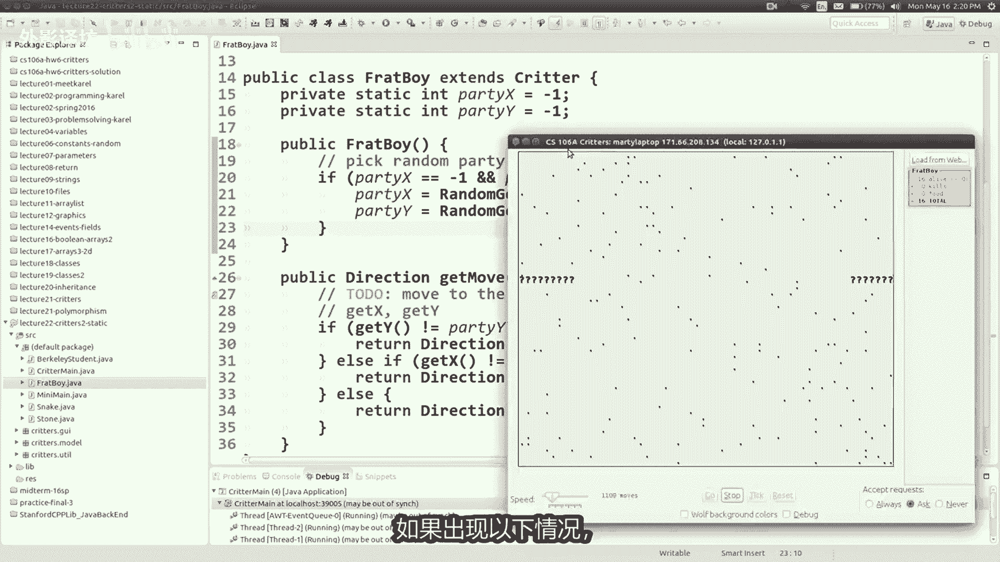

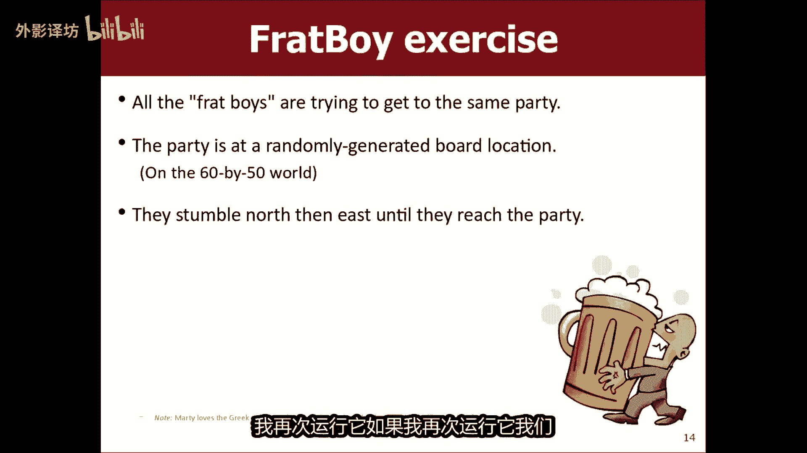


记住，编写小动物行为是一个迭代和测试的过程。充分利用模拟器的调试功能，从简单行为开始，逐步增加复杂度，并善用私有字段来存储所需的各种状态信息。