# 【中文配音】斯坦福王牌课程 CS 106a Java教程 2017年春季课程 - P23：23_ GUIs part 1 - 外影译坊 - BV14U4geNEEq

所以我打算在课堂上展示网站，但我认为他无法获得任何，这里的WIFI永远无法工作，我尝试再重新加载一次，是的没用嗯，快点在我开始之前的公告，如果你正在参加讲座，尼克最后做了一次演讲。

星期五和阿什莉做了一个讲座，星期一你知道你是否在观看，你会知道我来这里是为了那些讲座，所以你可能想知道为什么他们教他们，你在这儿吗，真的原因是，我只是想给他们一个机会去尝试在讲课时。

因为你知道艾尼克斯案件，他实际上要教这门课程，在夏天，所以让其中之一他得到了一些练习讲座，实际上在这种情况下，我们是想着也许他会教一门课，明年我们只是想给予他们练习，与大人物交谈，房间等等。

也只是为了给你们一些不同的声音可供聆听，而不必每次都和我一起作伴，无论如何，我现在回来了，今天还有一些简单的事情，在我开始介绍这方面的材料之前讲座，你为什么不知道这个星期五，你的小动物任务已经到期。

并且一个你们正在写的小动物是狼，我想提一下，我的意思是这个在作业后面提到过上野，简要提到了我们要做这只狼的网站，最后一堂课的比赛是，两周后和星期三我会带走你们所有人的狼，你写的小动物，我要写。

将它们放入模拟器中，我们就可以了，将会有一场战斗，我们要去，为了给胜利者加冕，我们要加冕，这是所有学生中最棒的狼，很有趣，看到我们都得到了很有趣，一起出去玩，看点小东西，角色们互相战斗，并且类似的东西。

如果你愿意的话，我们会很有趣，了解有关锦标赛的更多信息，以提供帮助，你写的狼写的真好，有一个有关信息的网页，如果你去做作业的话，比赛网站的部分除了小动物之外，还有一个部分说你知道这里。

因此有关该生物的信息，您对锦标赛有任何疑问，比如比赛是什么，如何进行确定电臀舞如何得分最高积分，我如何赢得比赛，稍后再看一下就知道了，另外一件事我会告诉你，如果你是试图写一只可以做到的狼。

在比赛中表现出色，然后从制作的材料，实际上我们正在教的可能对你有帮助，伙计们，因为你知道他们谈论的，而relist和HASHMAP以及很多最好的狼，保留了大量的数据，他们在哪里，他们的朋友在哪里。

他们的敌人在哪里，我有什么食物吃了我沾上的螨虫，这真是个好东西店，你可以使用大猩猩和哈希图，如果你喜欢的话，可以用在你的狼身上，确实可以帮助你的狼拥有记忆，并记住类似的事情，我会向您指出的另一个资源。

我们没有介绍的幻灯片，在我认为是最后的小动物，下周三的讲座，上周三的讲座，我做的关于小动物的讲座，有一些讲座结束时的幻灯片，我们没有做课堂上谈到的事情，一些称为静态的有趣功能。

你可以看看我有一个数据那里的例子叫做梁河，所有蜜蜂聚集在一起，是因为它们它们有一个共同的目的地，蜂拥而至，如果你看一些，你可以通过这些幻灯片学习如何操作，我在课堂上没有讲到。

他是因为你不需要这个作为主要的作业，但这可能有用，让你的狼喜欢成群狩猎或者类似的东西，所以无论如何，那些都是一些资源，如果你有兴趣，我认为比赛去看看我最后一天的课很有趣，观看所有狼群的战斗。

并看到你们在你的电脑上做的所有很酷的事情，狼小动物类还好，反正有说了，今天我们要做的一切，我们已经改变了一点点，涵盖数据中的这些集合，我们会再次看到这些结构，会更多地使用它们，但我正在转变。

今天要讲一个新的主要话题，那就是我将开始教你如何制作图形用户界面，或简称食尸鬼，这可能让你惊讶，因为也许你会说，我们已经学会了如何做到我们所做的突破。

我们做的图形，我们做了G椭圆形，在这里X我们知道如何做到这一点已经很好了，但是有点有点不同，我要区分你之前从中学到了什么，你之前学过的更像是绘画和动画，绘制形状和，所以用户界面更下按钮。

复选框和文本字段，已了解如何，你有一个邪恶的果汁吗，与你们互动，并没有真正做到，这是一个稍微不同的策略，所以对此我有足够多的话要说，现在也不会把它分开，当然这里的动机是最有趣的应用程序。

有一个他们与之交谈的用户界面，用户和他的控制台程序一直在用print in写作，并阅读线和这类东西，最程序不是那样工作的，我这意味着听起来有点原始，有一个文本框，其中包含打印消息。

例如我们在这方面经常使用它，课程只是作为一种学习工具，看起来是产生输出的最简单方法，好的领导者并征求用户的意见，但大多数程序看起来更像那样，或者某种基于网络或移动的，基于电话的辩题，很多。

我们要学习的原则是，这些不同平台上的共同之处，这就是接下来的计划，讲座的内容，还可以让我们开始吧，让我告诉你一些历史，这里的课程java是最重要的课程之一，java是革命性的事情。

为什么java valerry要使用本课程，为什么java是一种流行的编程语言有很大关系，图形和谷歌意味不好，过去你必须为之编写一个GUI，每个单独的操作系统，如果你想编写一个windows GUI。

必须使用windows g ui的程序命令和向导，那些GUI库，然后如果你想要一个Mac程序使用GUI，你必须重写整个Mac的GUI库和Mac的事情，你可以想象一个完整的GUI命令。

幼夜我不想做那个上帝禁止你想支持某事，像LINUX或其他一些shell的部分，我们要写234，java是应用程序的不同版本，19世纪中期问世，他有他的革命性的功能，你可以编写GUI代码。

就是为什么它不运行在所有不同的歌剧上，人们认为这很棒，并且所以甲巴被收养的原因很严重，通过该功能以及其他功能，反正甲八出来了，附带了一个系统，称为抽象窗口工具包AWT之所以被称为抽象。

是因为它本来是对每个人通用的操作系统，YELD很疯狂，但是AWT的问题是，如果你考虑一下每秒，如果我要做到的话，如果你可以写同样的命令，它将在windows和LINUX上制作GUI。

在Mac和烤面包机上，无论如何，如果他能在所有的地方发挥作用，那些地方只能起到支撑作用，这些平台的交集是的，如果Mac有一个特殊的挤压滑块，而窗户却没有，我不能包含命令在java中。

因为该命令将不适用于所有操作系统，java原始GUI支持的java链接，支持的最小子集的排序，适用于每个操作系统的东西，所以人们给出的初始速度，这就像工作正常真的很整洁，但没有足够的功能。

看起来不是很富有，所以他们回去了，一个人，在绘图板上创造了一个整体，名为swim的新GUI系统，更多功能更强大，无论如何，你并不需要知道，关于这一点，我不会在网上测试你或者拷问你，我只是这么做的。

原因提到的是我是否可以找到他，有点有趣，也是因为当我们编写代码时，我们将导入并使用一些来自的库，这个AWT系统和一些库来自这个秋千系统，它们有点互相混合，希望你不必考虑太多了。

但我只是提一下java的一些历史仍然存在周围，你必须与他互动，当你写的时候有点好，甚至还有一些更新的GUI库，java有一个叫做java FX的，几年前就出来了，但那也太晚了，新的我们不会学那个好吧。

所以这里有一些术语和内容，你必须考虑，当你当你编写GUI时，你会发现可变性在屏幕上弹出一个窗口，有时GUI被称为框架，偶尔如果这是非常暂时的窗口，你称之为弹出对话框，然后消失在窗口内。

你把这些小部件放在这些，人们可以与之互动的事物，按钮和复选框之类的东西有很多不同的方法，那些和与你交谈的人，取决于您在图书馆中使用的语言，有时人们使用很多同义词，有诗人们称他们为小部件，他们是互动者。

我认为是我们的教科书，很多人称他们为互动者，java喜欢这样称呼他的名字，图形组件，我称他们为我不知道的小部件，任何栏目除了事物之外的所有人像，按钮和复选框好吗，我们还有另一个概念。

周五更多的讨论的是将组建分组道称为容器，就像如果你有一组单选按钮或复选框，你可能会想把它们放在这里，然后你可能需要的单独的小部件级，放入这里的容器中，我们不会今天讨论的太多了，java中的不同组件。

大多数情况下会想到以下事情，服务JJ按钮，Dribble，Text field，当然你在画中看到了这一点，绘图部分，当然我们有G椭圆形GG线反应正确，那是因为埃里克罗伯茨教授是一种复制。

这个有GGG的命名方案，对于java的一切他都很好，GGG1切皆有可能，我认为耶稣诞生的记录是对的，无论如何，这种单身字母前缀是一种命名方案，人们有时会使用，所以图形窗口图形组件。

这是一张对地块进行调查的照片，存在的不同组件，爪哇语，我只是给你展示给你一个想法，其实远不止这些，这些是一些最常见的，当然如果这个滑动还不够，知道如何去使用所有这些东西，我们只是告诉你他们叫什么。

你知道按钮和文本字段，并且重机器，菜单和工具栏，以及桌子和所有这些东西对吧，所有这些都是从杰克开始的，到目前为止，你们的问题是否是这样，到目前为止，一切都有意义，嘿相当简单的东西。

我还没有真正深入了解代码，他会学到很多东西，今天的组件以及更多关于掠夺者的内容，好吧，让我们谈谈实际的具体代码，在这里你想吹嘘经纪人和GUI，这就是你记得的事情，我们如何编写控制台程序。

以及我们已经编写了球拍程序，除了一些其他的事情，比如卡罗尔诸如此类的事情，但如果你想用GUI编写程序，你在班上名列前茅的事情是，如果你不说扩展图形，你说的程序扩展程序为什么要这样做，你很好地扩展了计划。

很友善，一个普通类允许弹出窗口，并显示您想要的任何东西，想要在冬天里有所不同，其与控制台程序之间是控制台程序是一个程序，但带有连接到它的控制台和图形程序，是一个程序，带有一个附有用于绘画的图形画布。

对于它我们有点不想要任何东西，想要放置一个空窗口，我们可以轻松观看，这意味着我们想要扩展程序，好吧，有一些我们想要导入的包，位于我们文件顶部的，另一个更改是你制作的是你想要的代码，可能希望输入运行消息。

相反你将它移动到一个新的地方，称为INIT方法的缩写，初始化，为什么你必须移动它，原因是因为跑步有点像在窗口后运行，屏幕上出现INIT方法，在窗口出现之前运行屏幕，所以工厂你想做的事设置窗口的方式。

将所有组件到它配置所有组件，然后将窗口显示为，如果你写了它，就可以显示了，在运行中初始化窗口的代码方法会发生什么，窗口将弹出，但什么也没有在小部件中出现在我的生活中，可能会发生的和你想象的一样，快。

注意这个短暂的时刻是什么，去哪里窗口订票书，所以你想设置在你的同龄人面前打开窗户，这就是原因，我们初始化窗口打开，当我说初始化时独立好吗，窗口下怎么可以将创建一些按钮，将它们添加到屏幕上。

创建一些复选框，回到屏幕，有点类似于你的方式，将创建G椭圆，并将其添加到品牌，非常喜欢这类视频，所以这里有一个模板，图形程序，看起来像扩展程序，并将其保存在那里，编写代码来初始化您的方程好吧。

那么什么样的小部件，我们可以在程序中放入什么样的内容吗，语句将进入其中并初始化，这里的方法让我向你展示几个，这是一个名为K按钮的组件，底部什么是很好，你可以点击它们，上面有文字，诸如此类的事情。

我还没有谈过，关于点击，但我们会这里有一些不同的方法，当你构造一个J时，那个J底帽按钮，你说录制按钮，然后你把文本位于括号内，当你正在构建的按钮，是您将在按钮上看到的教科书。

屏幕上有很多不同的获取和设置，这些上的大部分方法，小部件和组件的形式，为得到一些东西，设置一些东西，或者如果它是蓝色，表示它会像is或SEIS牛顿展示的新套装等等，他削减了你不需要全部使用的东西这些。

但是马上就可以找到方法，但是如果您需要的话，他们可以提供让我给你展示一下。

真的真的，这里是最小的，演示好的，所以如果我去eclipse，我有一个程序，它的名字叫色彩缤纷，我们什么也不做，还带有颜色，但这只是一些我们正在输入的文件，所以我将在铸币场合。

这里我会说我想要一个J按钮按钮，1mug按钮表示你知道什么，好的，如果我写加一，我总是称我的按钮为黑色，意味我轻弹四岁孩子的成熟程度，所以我所有的搅拌机都需要一个，但有两个他有一个重要的信息。

我说它很大，但你知道我只是明白摆脱这个我很成熟，所以好吧，添加按钮，然后也许我有另一个按钮，但两个等于new j按钮，我是按钮二，然后你添加，但是好的，现在你让它运行，然后你选择颜色有趣。

这就是显示的内容，屏幕按钮一，我是按钮二哇，我喜欢大按钮，我不能撒谎，其他涂层，糖果九，等一下按钮很好很好，你知道很多原因，但那一秒我会做什么，我们的大号是多少有点奇怪，但是黑我做了一个窗口里面有。

当我点击按钮时，它上面的按钮什么也没发生，对我没有任何作用，还没有告诉他，当你放置时要做什么，一分钟内没有逗号的按钮，我确实想谈谈奇怪的尺寸，现在你知道我们什么时候按钮了。

我们在窗口中添加了诸如G椭圆之类的东西，我们怎么知道那里有G，如果我们添加一个G，这里就会缺少一些东西，椭圆形或G罕见，你会告诉程序把我能说的话放在哪里添加，或说出你是否愿意的位置，提供X或Y或宽度。

或你所选择的不同形状的高度，添加到右侧窗口，以便看来也许这就是我所缺少的，在这里，所以事实上你可能确实想做类似好按钮的设置，这是一个很棒的地方。

厨师会有所帮助，因为您开始打字点什么，他就会列出你所有的，你可以说设置和不同的方法，你可以学习所有的百万种方法，你可能会说这件事是对的。

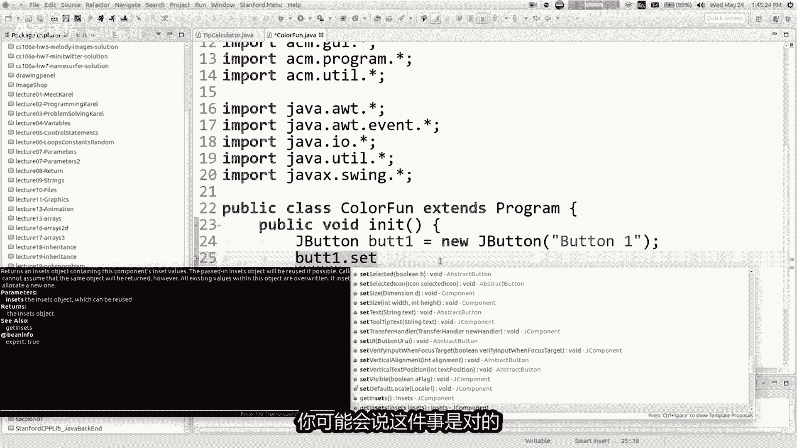

尺寸设定好，有一个设定尺寸逗号嗨，我会告诉你，这不是我真正想做的，不是我真的想做你喜欢的事，那将是一个好主意，告诉我们如何按钮太大了，所以不会像这样拉伸它，这里的哲学与你不同。

当你添加这些时，应该遵循小部件到您应该显示的屏幕上，认为窗户有这些不同地区，是北方河南部，西部和东部的中心，当然你可能有一个程序看起来比那复杂一点，但是种类这是您添加时的起点。

如果你提供一个屏幕上的东西，第二个参数表示区域写成全大写标记，它是南北的常数东西货中心，如果您提供第二个参数，将其放入有点像窗户的那部分，当他这样做时，它会调整东西的大小大小。

适合其内容，就像如果我按下这两个按钮，我正在研究并将它们添加到北方，你可能想知道北方是什么，这是程序类中的常量，如果你将鼠标悬停在它上面，它实际上是其值为字符串nose的字符串。

所以你在技术上可以通过在那里向北放映，但如果是字符串常量，所以如果我添加这两个按钮向北，然后现在他们是没有那么大，而且他们在顶部屏幕现在好了，为什么更好了，比如说设置包装位置影响和传递，为什么。

我的意思是你更模糊和抽象吗，对于为什么你可能不这样做，有什么想法，想要的包装或位置尺寸，复仇者联盟条例，如果你正在制作，如果你调整窗口大小，GUI工作室的，看看这个你觉得怎么样，X坐标在这里。

它可能是什么，我在做什么吗，我正在移动我的文件管理器哦，我刚刚破坏了我的操作系统，无论如何都喜欢啊，不回去左放，回到那里好吧，无论我们认为这个X偏移是正确的，如果我调整这个窗口的大小。

并且成功叫小按钮在移动，你看到了他有点让他们居中，如果我有的话说，我想要100个X和Y10个，或者随便什么被困在那里，也许我喜欢那样汽车事纪的行为，有点酷，你能想到其他任何事情吗。

很高兴能更模糊的了解把女巫放在哪里，以及他们的方式，独特的小部件嗯这读着，是的，它不会自动适应它们是的，自动适应是一个像你一样思考的好方法，注意这个按钮有一定的宽度，另一个按钮有一个一定的宽度。

这使得它们只是大小适合我想要的文字，放在那很好，我没有必须思考如何如何，为什么按钮应该只是一份工作，或者你弄清楚按钮应该有多宽，如果我必须决定按钮的宽度，应该是我必须喜欢设置它运行它按钮会太小。

文本会被切断，它会把它弄大一点，但现在太大了大，我可以小心的运行它一堆，让它变得恰到好处的时间尺寸，然后我就没事了，现在我完成了，但问题是事情会这样，在windows上大小不一样。

计算机就像在Mac上一样，在LINUX计算机上的位置，与在LINUX计算机上的位置相同，烤面包机就像不同的操作系统一样，不同的布料和不同的像素，不同的显示器尺寸以及所有这些，所以不说有多大按钮。

应该是我让java大小恰到好处尺寸，所以我想我使用那种自动适合的类型，自动调整它们的大小到合适的大小，然后在所有的中心阅读，这样实际上比我更好准确说出放置它们的像素，这样做的缺点是，如果你愿意的话。

把它放在某个像素上营地里，你确实失去了宠物，但是你不需要它，所以不用担心，事实上这更好，所以我想我从来没有真正回答过，为什么是那个按钮或者那两个按钮真的很大，之前如果我有第三个按钮会怎样。

我说好的按钮大弹等于新的G按钮大，我说加大，但在中心，如果你不说的话，窗口就是默认的，你想添加它的地方，它就会添加到窗口的中心，所以如果我运行它，再次大按钮还是很大，所以过去了放在哪里并不会让它变小。

我会尽快为您调查，北部东南部和西部地区是这样自动调整大小，以适合中心区域占用所有剩余空间，所以无论你放在中心的什么，放大了，你可能会说看起来愚蠢的，这个按钮看起来很可笑，谁想要一个像他看起来那样的按钮。

就像唐纳德特朗普的核导弹按钮，或任何红色大按钮，发射核武器，或者我不会的东西知道，但是为什么你想要一个按钮，说出你的答案是什么，你可能不会，但通常当你添加时，窗户中央的东西，这就是你想要做大的事情。

如果它是一个文本编辑器，那就是这个地方，如果您放置文本输入框的位置，这是一个网络浏览器中心，在哪里放置网页查看小部件，如果是游戏中心，是我们放置的地方，图形绘图画布。

这样你就可以经常希望某些东西位于中心，因为你希望它被拉大，按钮不是一个好的选择，你不这样做，真的很想把它做大，所以你可能不会把它放在中间，无论如何，这就是发生的事情，对此有任何疑问吗，到目前为止。

我们所做的一切都是有道理的，哦就想他如何决定如何制作按钮，看起来不错，有一些我的操作系统的概念，LINUX在我的情况下，我的操作系统如何，希望按钮看起来像这样，java在底层检查什么。

它运行的操作系统绘制角点和字体已匹配，基本上是可以改变的，他们想让我的程序看起来另一种方式，就是所谓的外观和感觉设置，我不会今天显示，但我不确定是什么，我开始可以做一个windows程序。

看起来更像Mac，如果您愿意，可以使用默认程序，我这里有的是这样的，试图让它看起来像你的操作系统很好，我认为这个如果程序会更有趣，当我点击时，按钮会执行某些操作，他们，所以我会在接下来让我向您展示更多。

关于这里的组件，我提到过总是通过按钮进行管理，我们谈论表演组件具有文本和属性，它有一个字体，有一个颜色，它有各种设置，所以有一个整体一堆这些方法，但我就是做不到，甚至可以快速列出他们。

因为我有很多这样的人，将提供一些课程链接，网站到包含所有内容的文档，我认为最好的方法向我向你展示的方法，只是使用eclipse，并在A中介入变量名称，医生看看那些东西出现并稍微通读一下。

但你可以设置颜色之类的东西，光谱和前景色，你可以在组件周围设置边框，如果您希望您可以启用和禁用，像你可以制作按钮之类的东西变灰，因此您无法点击通过禁用它们，一大堆不同的事情，好吧。

我不会今天探索所有这些，但他们是我想展示另一个组件，这是一个非常常见的组件，叫做dribble，dribble只是一个组件，显示文本，但你不是真的可以点击它的方式来做按钮。

这样你就可以创建一个j label，传入文本作为参数，您可以更改字体，或者您可以更改，您可以更改颜色的对齐方式，您最常排序的标签，获取和设置文本时显示信息的好方法，用户所以让我回到在这里编程。

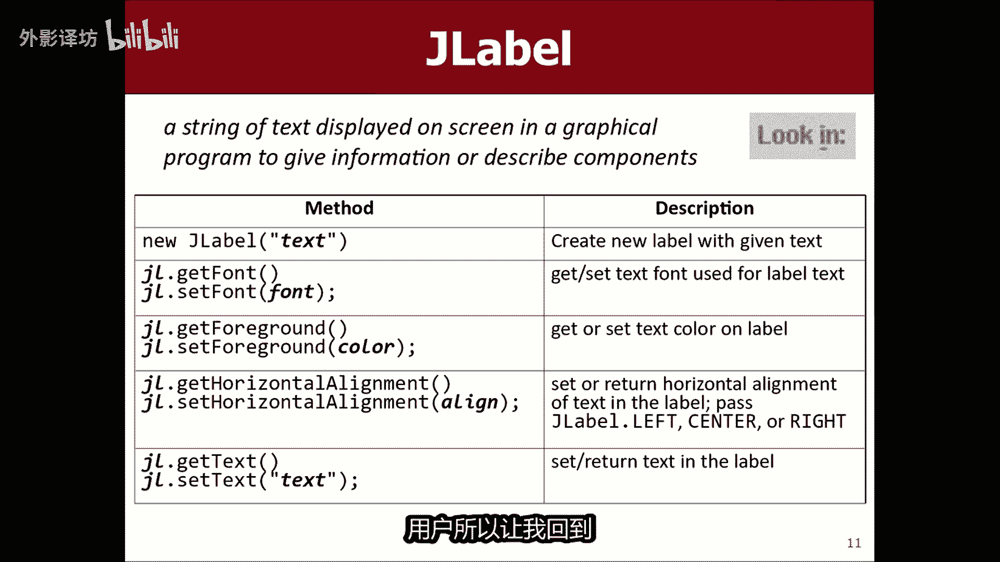

也许可以代替中间的大按钮，我会做一个j label，称为中心标签，我会说一个新的G标签，我会通过你好世界好的，我将添加中心标签到中心，如果我运行它程序说你好，世界它是那边有点难知道到底发生了什么。

但是从技术上讲，这个标签有那么大，整个块实际上是标签，但很多空间我都在做，再次哦，天哪播放还好很多，这里的空间有点空的，空间和实际文本内容标签是啊，很抱歉我有问题，实际上用我的嘴人标签。

成长到充满你的整个区域，可能会说我不喜欢他了，如果你想要的话，就在角落里，这是很常见的，你会做的事情就是你会说黑中心标签，我想设置你的水平对齐方式为常数，J标签点中心，然后如果我设置。

然后标签出现在屏幕中央，而不是屏幕上屏幕左侧。

所以这是好一点了好吧，我张贴在幻灯片上一刻水平对齐，设置CORREZON对齐即可，做我们迄今为止学到的所有事，情，在做这样的程序的过程中，你知道如果你想拥有它，这样你就可以点击这个按钮。

更改该文本字段的颜色，或你可以做类似的事情，所以你知道我们接下来会这么做，我想去参加活动，这里有一对夫妇在我做很多事情之前，先做一些快速的事情，有时你想设置字体，这意味着一直到设置文本的形状。

屏幕上的字符或大小，某个组件上的字符，您可以创建一个新的字体对象，代表您的系统上的GU的名称，字体的大小和，然后你在小部件上调用设置字体，你当然想这样做，每个人最喜欢的字体是漫画，没有ms字体。

那是上帝的完美创作。

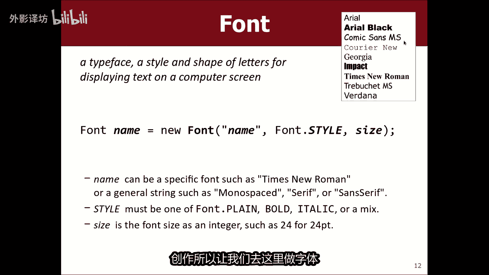

所以让我们去这里做字体，很棒的字体是一种新字体，Comic sense，多发信息化整，然后你传递的三个参数是字体名称还是样式，比如字体加粗或者其他什么，然后尺寸就像24尺寸24，无论如何。

如果你想要在您的小部件上使用该字体，无法真正设置整个字体，整个窗口，但你可以说黑按钮，我想将你的字体设置为很棒的字体，哎呀不很棒的阿姨好吧，所以你可以为按钮一做到这一点，而你可以对按钮二执行此操作。

然后你会看到现在他们正在寻找好吧，但是你可以改变字体，你可以设置这些的颜色，比如你想要这个文本，这里的按钮是绿色的，你说的好好的按钮点，你认为它会被设置的颜色，但它实际上是设置背景颜色或设置前景色。

前景是文字，背景是肉按钮的，其余部分是这样的，颜色和我们一样，然后就断了，或任何你能说的颜色，绿色，或者你可以说新颜色等等，现在我将前景设置为绿色，那个里面有绿色，所以有很多。

有时你的代码就想做一个小部件，积极设置及设置为另一个小部件级，设置为我们的方式，这样做好有意义。

我要谈谈这个本，我想是的，你们工作更有趣，已经知道你所做的事，你没有点击鼠标的时间，鼠标拖动所有这些东西，就这样，你可能会想哦，我一定要玩过，也拖到这里嗯，我们通常不这样做。

因为鼠标点击和鼠标按下鼠标拖动，与XY有很大关系，像素您点击了哪个像素，获取位于该XY位置的元素，有时谈论鼠标事件和键盘事件，如低级霍霍原始事件，你真的非常专注于像素和小小小，你所经历的事件的照片。

通常在做GUI时使用，是我们所举办的不同类型的活动，呼叫操作事件及其原因，java区别，这两者的地方就在于，你通常并不关心到底是什么像素，这些都是点击，你真的只是关心他们点击了哪个小部件。

你呢点击这个按钮或那个按钮，选中此框或取消选中该框，我们只是不关心单个像素不再，特别是因为汽车调整调整大小和居中，不知道我们刚刚的哪个像素中，有什么关心这个人点击了哪个小部件，所以如果是这样的话。

我们会使用这些动作事件来执行动作事件，仅意味着尼宇一些小部件和许多不同的行动，会让这发生在你身上，选中一个框，然后单击一个按钮，在文本框中输入内容，并按enter键。

所有这些事情都会导致动作事件现在发生，当然你可能请记住。

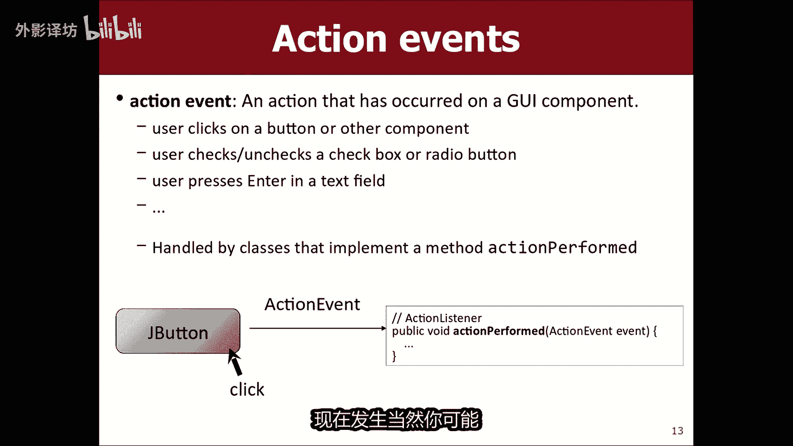

在图形程序中，我们真的很害怕你会来，在这里你会读到一篇特别的文章，方法如mouse press，鼠标移动盒，当用户将鼠标移到了那里，如果你想的话，这里有类似的想法。

监听这些动作事件，使用操作编写消息执行，还有更多内容，我要向你展示的就是这些，你做什么，还有另一个包，您需要导入的类称为java a w t事件包，所以你可以把tap开始出的导入声明，你的程序中。

你写了一个方法被称为实际执行，你想要的把你的代码我们将运行事件发生，您实际上还需要做一件事，你正在设置的INIT方法，一切都完成了，你必须添加一个特殊的到你的程序末尾的行。

这表示添加动作监听器以及何时添加，你把那一行放在你的代码中，它会导致该程序查找所有按钮，以及它附加你的程序，如果你不听这些按钮的话，把最后一件事放在这里，然后是你的事件发生时，程序不会被告知发生。

所以它非常重要，上面家庭作业中常见的对于本材料，如果学生愿意忘记编写添加动作，真听契合，然后他们点击按钮却什么也没有发生了，所以让我向你展示这一切，你一起读一秒钟，允许看起来像这样。

你在最后你说添加动作监听器，然后你写这个执行方法操作，然后每个当用户点击按钮时，它会调用这个方法，可以我在这里给你展示一下。

在编辑器最后我会说添加动作监听器，你必须这样做，最后因为他寻找所有按钮和你已经拥有的东西，如果我把这个添加到他们身上，这里的代码行不会，还没有任何按钮，所以还不行，任何事情。

所以它必须是最后和现在你写这个方法，topic void执行的动作，它需要一个动作事件参数，命名为我将其称为世界，很像房子鼠标点击方法，鼠标事件，此事件执行一项操作事件正常，所以再次调用时。

用户单击按钮，那么我可以做什么，这里有很多你可以做的事情，但也许只是一分钟，我只想看看他是否工作最简单，我可能做的就是批判性的说出系统，并记住该命令，我只会说你点击了按钮确定，然后当你说系统时。

输出打印行，这些消息出现在eclipse位于此控制台的底部区域，所以我运行程序并单击你点击按钮，确定就这么多了，到目前为止，我认为你的工作是对的，通常想做的事，这里的东西会修改屏幕上浮标的状态。

更改您调整大小的颜色，如果您用户可以正确看到的东西。

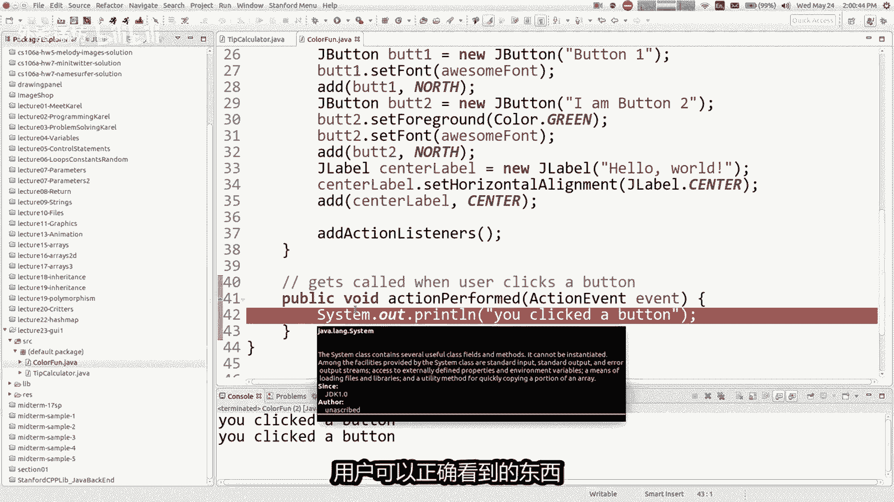

让我们谈谈这个，如果我想写一个这样的程序，你在哪里见过他的网站有时被称为，有时非常，有时被称为蓝色com，这只是整个页面全部阅读或全部蓝色，就是这样，有时每次重新加载页面时，他确实失去了被阅读的机会。

有时他用皇后蓝重写，所以你知道该网站真正的启动潜力，我我想我们要制作一个程序，这和那个一样有用，而不是我们要随机选择红色或蓝色到两个按钮，这使它变成红色，当你点击时，它会变成蓝色吗。

这些按钮将重新着色标签，屏幕中间是合适的颜色好吧，所以现在我们主要知道，我们需要知道要做的事情，右边缺少一件事，这是当用户单击按钮时，我想知道哪个按钮，他们点击是因为你知道我的代码现在很普遍。

因为你单击一个按钮，我想知道是哪个按钮向右，这样你就知道了哪个按钮，记住我们实际上是如何执行的方法，有一个参数是称为动作事件，你可以传递它参数给你一些信息，关于与哪个小部件进行交互。

你能想到的最常见的方法，您可以向活动要求结果，pop get操作命令，它返回一个字符串，该字符串的含义代表用户什么单击，因此如果您的用户单击在按钮上获取操作命令，将返回那个文本。

所以在我的程序基本上我只是做if fails，我已经检查过的声明。

屏幕上每个按钮的筛选器，如果我去看看他是哪一个，那么像回到这里，记住我们如何努力制作一个转动按钮的程序，或蓝色或绿色的标签，所以也许这里全部更改为，使其变为蓝色，此处我会把它改成红色。

认为可能是另一种方式，周围我认为它首先是红色的，红色使它变成蓝色，所以现在在这里，如果我想知道用户按的是哪个按钮单击，我会说字符串命令等于事件获取操作命令，以及我是否想知道，如果他们点击红色按钮。

我就检查操作命令是否为这段文字是对的，所以我要说点什么，就像如果命令等于，那么这意味着用户单击了红色按钮，是的，因为这是唯一的两个，我有的按钮我不需要检查，明确的将其设为蓝色，我可以采取其他，如果不是。

则将其设为红色，那么我知道用户必须有单击蓝色按钮，只有两个，他们可以点击这里的东西，特定程序它不会导致，如果他们点击标签就会发生事件，因为标签他们不被认为是你想要点击的小部件。

所以只有当你点击一个按钮时，它才会这样做，你也可能想知道图形程序，例如freak out you，有时必须寻找now作为什么，如果他们点击小山丘或其他东西，他们点击不会生成的空白区域一个事件。

所以你仍然需要担心关于那个案子。

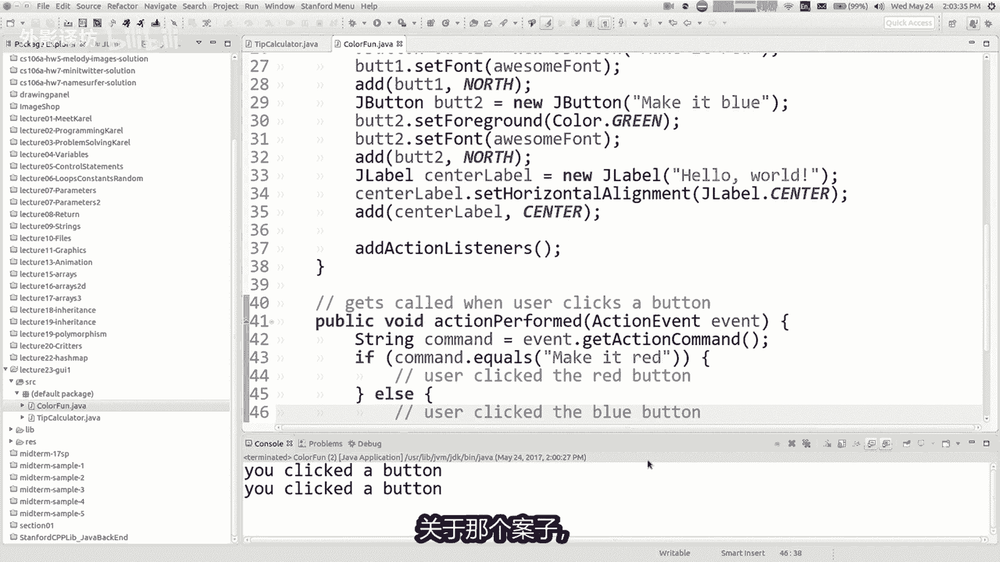

现在我需要你的帮助，我在if和else中做什么，我的代码记住目标是这里的简单，目标是使这段文字正确改变颜色，看起来就像这样。

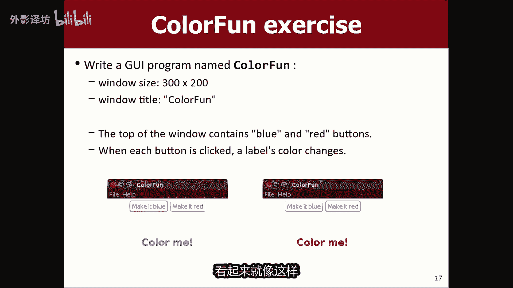

应该很简单，怎么做，我实际上告诉程序这样做，有人帮助我，好的是的中心标签点设置为地面，如果是红色的话，红色的点是什么颜色按钮，如果是蓝色按钮，我将其设置为蓝色点，好的，用红色强调发生了什么，有什么问题。

我该如何解决，你说的问题是，中心标签超出了它的范围，在这里声明我正在使用它，你们已经看到了不同的方法，问题很多次只是不是在一个GUIFL的，我们从未写过GUI之前的程序，但想法是一样的。

如果我希望它在范围内，它就超出了范围范围，即在INIT方法中，又在您的解决方案是完美，我们只需要制作那个小部件进入一个领域，所以我需要来这里并说私人j label中心标签，然后在下面的INIT方法。

我只是我不我不重写它的类型，我只是说请设置中心标签字段为该值，现在这里没有下划线，在正确的范围内不再是红色，所以让我们给出尝试一下吧，让我们尝试一下吧，读它变红，使它变蓝变成蓝色，太棒了。

我们真的有一个非常实用有用的程序，在这里我只是想向你展示这个例子，因为大多数时候一旦你开始开展活动，就是您的起点，会见这些私人领域的一些人，他们做的太过分了，按钮进入我并不真正需要的字段。

两键按钮将成为字段，你看到了吗，为什么我只指CHA按钮，在这里我实际上不需要参考这里的G按钮，我只是参考按钮上的弹簧，我并不是说这按钮本身一个私人领域已完成，所以我认为这是一个很好的做法。

这里是不要制作每一个小部件，仅进入私人领域，您将要与之交谈的人事件处理代码，例如action for，像这样的论坛可以吗，这个程序了解您的疑问，这个东西是的哦，所以一个问题是。

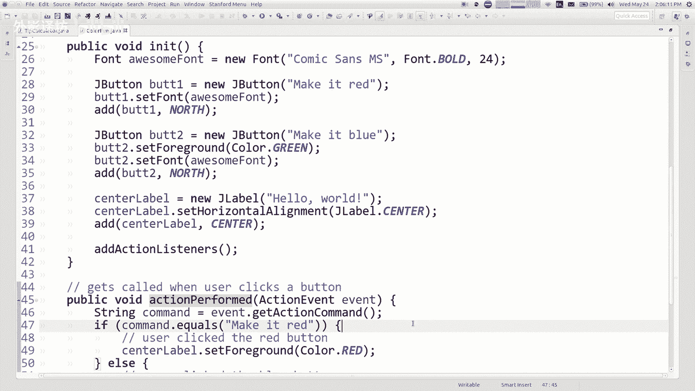

这个新方法或者他的新方法怎么样，样式是特定于按钮的，我可以吗。

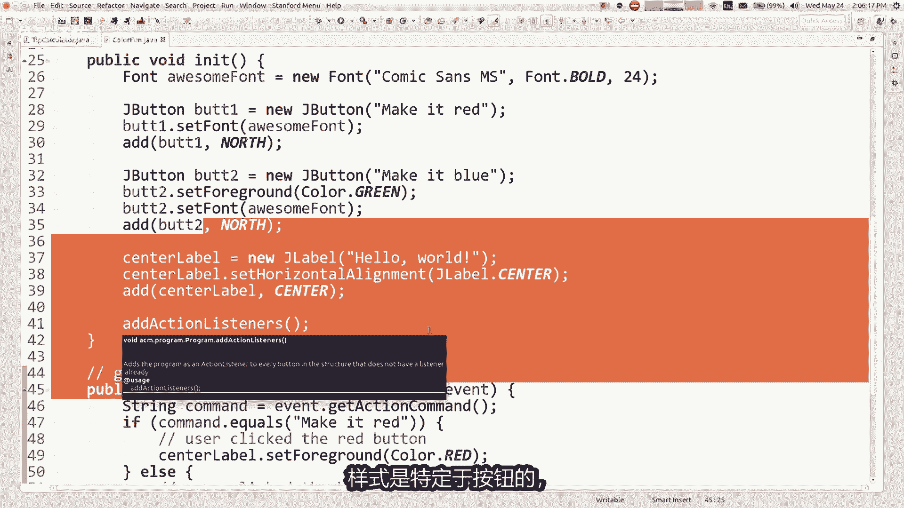

这样做，如果您单击标签，他会做某事，仅标签不接收操作事件，只是java他并没有将它们连接起来方式，所以有某些小部件，java认为说的是你会的，想要像复选框一样进行交互金额，并选中它或取消选中它们。

也许这是您单击的事件按钮，这是一个事件，所以你可以告诉你的你想听的节目事件，但这标签你基本上不如果你触摸它们，就会收到事件，打电话或者任何可能的方式，收听标签上的群众活动，或鼠标移动和鼠标重新安装。

按那种东西，但它是稍微困难一点，就会多一点，涉及到我今天不打算展示它，但可以做到这一点，但是这个是一种针对常见情况的设计师，在大多数常见情况下，您不会点击标签本身，你点击的东西像按钮和复选框一样。

无论如何，这就是优化的目的，好的到目前为止还有什么问题，是的欧式的，你可以有两个按钮吗，使用相同的命令，所以可以另一种方法来做到这一点，如果我有两个按钮都说让它变成红色，我如何区分它们。

其他所以现在在这种情况下，它不会崩溃，他允许问题是他们都会有相同的动作命令，在这里还有什么其他方法编写与我不同的代码，大部分时间都会展示，但我会现在就告诉你，如果你确实做了这些进入私有字段。

J按钮按钮易，然后你也做了同样的事情，按钮的东西，然后你现在就这样初始化它们，我们这里的田地，而不是询问动作命令，是这个字符串，因为它不再是每个按钮都是独一无二的，你可以做什么，如果事件发生。

你可以做什么，圆等于按钮已获取原从字面上返回，他们是哪个小部件，点击这个更直接，也许对一些学生来说更直观，比如他们点击了哪个按钮，把它还给我，因为我不这样做，平时都遵循这个风格，很强制吗。

你可以将几乎所有的小部件变成私人领域，我有点不喜欢这样做，所以我真的很喜欢这种风格，实际上你可能不会有两个按钮具有相同的文本，或至少你可以想出一个方法来，稍微修改其中之一的文本，以使其他们彼此独一无二。

好吧是的，到目前为止还有什么其他问题嗯好吧，你可能想知道为什么，我们如果你摆脱了摆脱运行方法的run方法，你把所有的代码，但我告诉过你，ni it代码将在窗口出现之前运行，如果我把它改为运行屏幕会怎样。

把同样的代码放进去就可以了，看起来基本一样，看起来不错，似乎没有什么问题，看起来好像没问题，没问题，对你可能会看到的一件事，就好像好吧，如果我这样写怎么办，在这里我可以暂停一下，掌声响起。

你的节目只是掌声或等待，我们已经以前见过，所以如果我跑，我就会击中跑了，但对两个人没有任何作用，很难看到延迟几秒，但他跑了，默默无视，做两秒，你没有看到窗户和我的主张，这向你证明，我认为在其中。

在窗口出现之前运行屏幕是成为窗口的暂停，如果我将其更改为，则不会出现跑，然后我再做一次哦等等，我在撒谎吗，对你来说，它应该出现在屏幕上，可能存在并发问题，如果我把它写在这里会怎么样，好吧。

让我试试好吧等等等等，等等哦，这很有趣，你看到了吗，看着这个样子，我运行它没有工具栏，然后还有一些东西，有一些奇怪的初始化发生的事情，在他和之间嗯，我什么会告诉你。

我认为这对我来说很难展示我想要展示的内容，你对这些之间的区别，我试图向你展示其中的差异，在这两种方法之间微妙，因为有时如果你只是将其重命名为另一个，他没有的名称，一个地方似乎有很大不同。

人们有时会两者兼而有之，你知道其中有哪些方法，你会跑过还是在那里不再跑步了，这是很常见的，如果你正在做一些循环，则使用run方法弹出窗口后继续，例如如果你正在做某种事情，你可能会放的动画东西。

该代码并运行，而不是在其中，因为你希望你的影像安全返回，不想让他陷入困境，无限循环，如果你想怎么办，使这个标签每秒随机改变颜色，或两个或任何你会说的东西，而真正的停顿1000ms，然后设置好我该怎么办。

得到一个随机颜色，就像我说的中心标签点设置颜色，设置前景色，记住如何获得随机颜色，记住，我可能会和什么对象交谈，如果我和兰迪谈谈，他们就会在生成器右侧是随机生成器，点获取实例，点下一个颜色哦。

他们实际上有一个JEFF下一个随机颜色，水桶非常有用，所以只需一次一秒钟，它就会在color，所以它实际上是在设置颜色，如果我确实设置了背景，并且我会怎样，将计时器更改为100，非常令人印象深刻。

我认为标签不显示背景颜色，让我把它改回前景色，我不认为是标签，有一个你知道的背景空背景，现在有标签，每种都闪烁着不同的颜色，100ms或任何代码，用那个循环和那个底部动画，最好投入运行的东西。

而不是在其中，因为你的代码会直到你完成初始化，无论如何，在他的方法中，这是一个两者分离的简单例子，我将继续向您展示的方法，在我们用完之前。

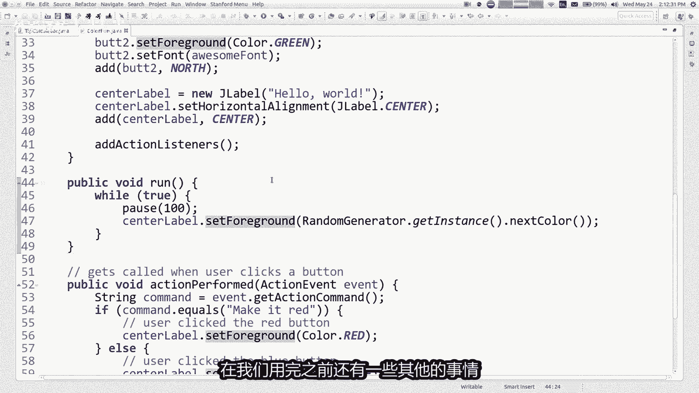

还有一些其他的事情，今天有时间，所以还有其他几个，您可以在我们的程序中使用的组件，会打电话给这棚屋里面装满了文字，你可以在框中输入一个字符串，例如输入初始化时将文本写入此字段。

我将拥有一个看起来很时髦的新麦克风标签，课后检查一下，抱歉，那本书里的文字，你可以通过输入以下文本来初始化它，你想首先出现在那里，或您可以传递字段的宽度，就其宽度而言。

你的脚也可以获取并设置该字段的文本好吧，所以我不会取便利文本的所有方法领域有，但这是迄今为止最多的，你做的常见事情是获取并设置在字段中，输入我想要的程序，如果你们让我给你们看的话，请写下来。

很快我想写一个程序，这可以帮助您计算小费，例如如果你去吃晚饭，你付了多少钱，现在当然可以了，你们可能不上核心大学学生订户，在其中输入零，不必再去跑腿给小费，我知道，但是你知道，一旦你像我一样老了。

可以给别人小费，这样你知道你可能想这样编程，有一天好吧，你想输入如何，您的餐费是多少，您选择多少获得你想要的小费，然后您就会得到护理地皮男人的智慧，所以我要去忽略一分钟，它是十五十八%。

那些被称为单选按钮的百分比，我不知道我是否有时间精加这些，以便当我回来时，Lose，如果我有时间的话，我们就试试让它出现在放映中，我想要这些小部件，说膳食小计是什么样的东西，小部件的特点是吃饭之道。

麻风病人就是那些话，是的，那就是，一个正确的基因标签，然后我就有了50。00美元，您实际输入的位置，Amount，那是什么类型的小部件，这里是G文本，那就对了，我们有那些单选按钮，我就是跳过一分钟。

我已经计算了提示，这是750的G按钮，中间的巨大文字也是J的标签，所以让我设置一个包含这些小部件的程序，然后我们将尝试编写事件代码。

我这里有一个名为tip的文件计算器，我只想写一写代码进入这个初始化区域，所以我们需要一个标签。

上面写着膳食小集合，北部地区的气温将会上升，这些小部件沿着这里走。

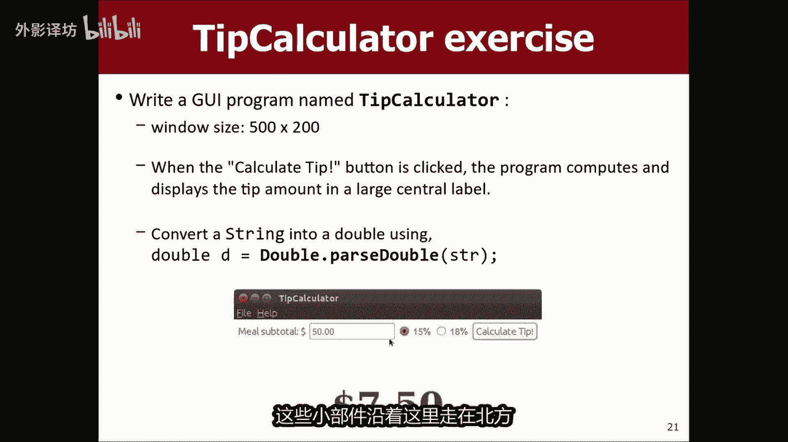

在北方窗户的一部分，你看到了吗，我想说j label标签是新的。

这标签及其上写着什么餐食小G还不错。

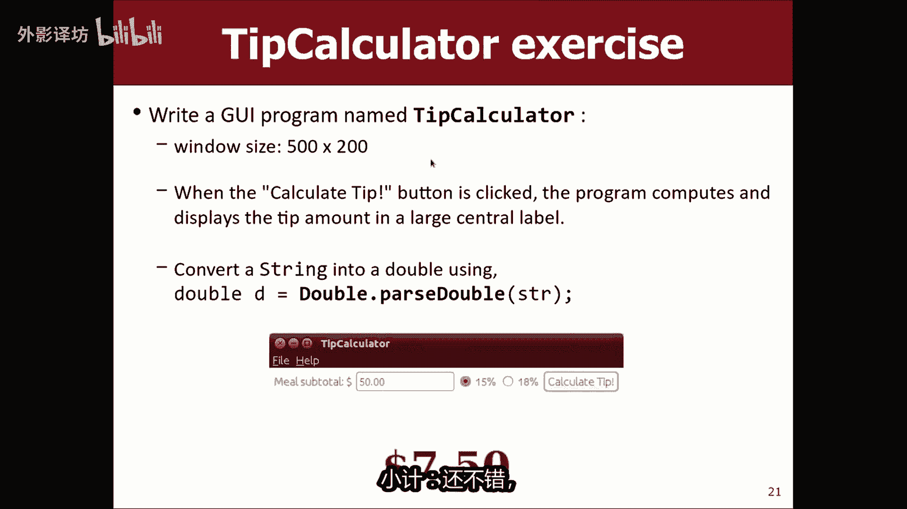

总共一美元标志，我会将该标签添加到北好的，现在我需要一些文字供他们输入金额的框。

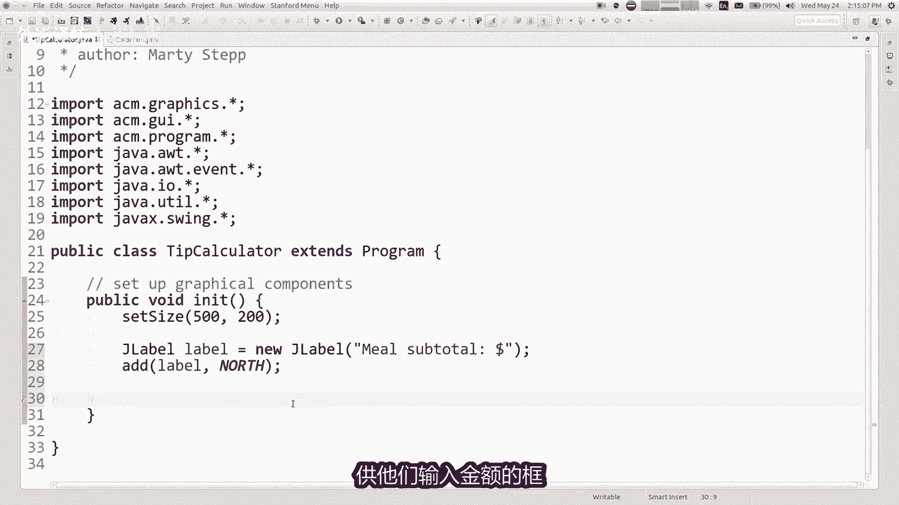

这就是这里的文本框，这是一个j text field。

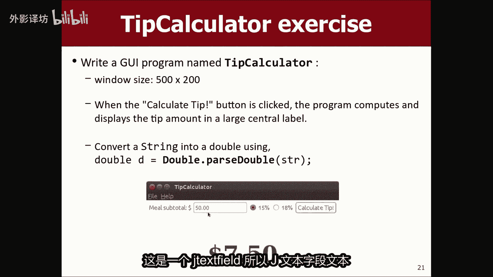

所以J文本字段，文本字段是一个新字段，我将其称为金额字段或小记字段，无论什么，这是一个新的j text field，当你构造一个文本字段，你通常提供多宽的内线，事情应该是。

也许我会说你最多可以输入您认识的六个字符，不管你的金额，然后我会将小G字段添加到北部，还有那些单选按钮，15%，18%可能一分钟，我们假设15%的人会回来，如果我们有时间的话。

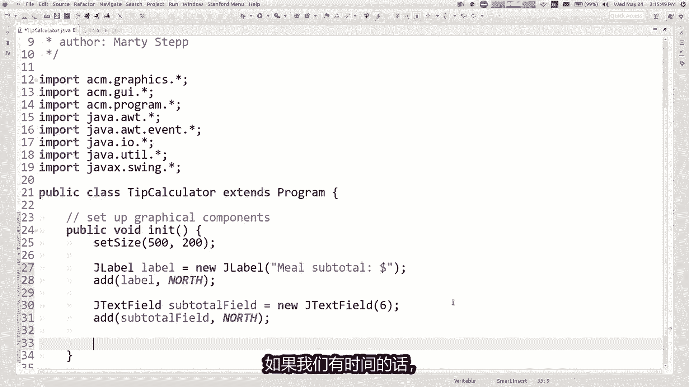

有一个按钮他们点击说我想计算提示，所以让我们这样做。

那是一个J按钮，计算提示按钮，新的J按钮计算小费，我会，将其添加到右北，然后我会去参加活动，是的，那么最后在这里添加什么行动听众，好的好的，我是将执行此操作，我还不想写，但我想写首先测试一下。

但我会在第二是的，让我们看看好吗，现在我想哎呀，我运行了整个程序，我想我也有一件事，屏幕中央我没有还添加了哪一个是我，而不是您要支付的金额，大字体右，所以量你要付钱就在这里，所以我们现在就这样做。

让我们创建一个名为amount的jay label，Label，是一个新的j label，让我们开始吧，只是说零美元，就这样里面有一些文字好吧，让我们将金额标签添加到中心，我希望标签很大。

所以也许我会设置其字体，我会说数量，标签点，将字体设置为新字体，我有一个字体称为衬线，我希望它是，粗体我想要尺寸为30，无论如何让它变大，所以现在就在那里，无论我要修复什么，他都不在中心，稍后再说。

但我希望是这样，当我在这里输入金额时，50美元，我说算算小费吧，告诉我你的总数或你的小费应该是这么多美元，好吧，你好吗，我需要做哪些改变，为了达到这一点，其中一些小部件需要是私有的。

您认为会是哪些领域值得自豪的领域，以及为什么是的金额标签，因为，我将不得不采取金额和贴上标签，说明我会的金额，必须告诉他设置要显示的文本，我认为这是个好主意，所以让我们为金额标签。

我将在此处设置那个领域，好的，我想要的任何其他小部件，私人领域，好吧，我们可以尝试编写代码，看看记住你在这里做什么，如果事件得到。

你说执行的动作，动作命令是计算小费。

然后这意味着他们点击了那个按钮，让我计算一下他们的小费，如果他们付给你15%的小费，我想要取某种金额乘以0。15，那么我从哪里得到这笔金额，我乘以0。15，哪里发生的很好，小G乘以0。15。

那是从哪里来的，是的，它来自右侧的小G字段，如果我需要与小纪字段交谈，这里的小计字段需要是在私人领域提出上诉，所以让我们我知道我正在看时钟，我快要到了，没时间开车去，那家伙在那里初始化。

它现在在这里获取文本，小G字段，将M乘以0。15，所以你说黑小G字段，我想要知道用户输入的内容进入你体内，这就是所谓的获取文本，现在我想将其作为流返回，如果我写小G则乘以0。15，被0。15。

我无法将字符串乘以双精度数不起作用，所以如果你想惩罚，如果我知道那个字符串将会如果我想要的话，大约是五十五十的两倍，你这样做的方式，就是你说双子等于双点解析。

转换字符串的双精度。

小G看起来就像一个数字变成一个数字，如果我想要小费，那就是小G乘以0。15，我想把它放在屏幕，就像你说的，我想告诉金额标签，将其文本设置为提示，但你不能将文本设置为double。

你必须将文本设置为字符串，所以我肯定会做一些字符串转双精度，双精度转字符串类型的东西，转换的最快方法，数字到屏幕就是将其连接起来，如果你只是用另一个字符串，那个美元符号加上它的两倍，将它们连接在一起。

这样就可以了，我意识到这应该是0。15倍，我的时间不多了，所以让我如果你输入50美元跑的很快，计算你是否得到七块五任意完美，但如果是艺术时间，我会让你们走吧。

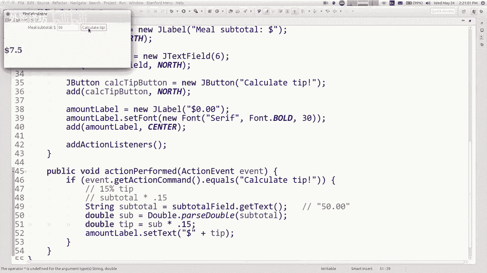