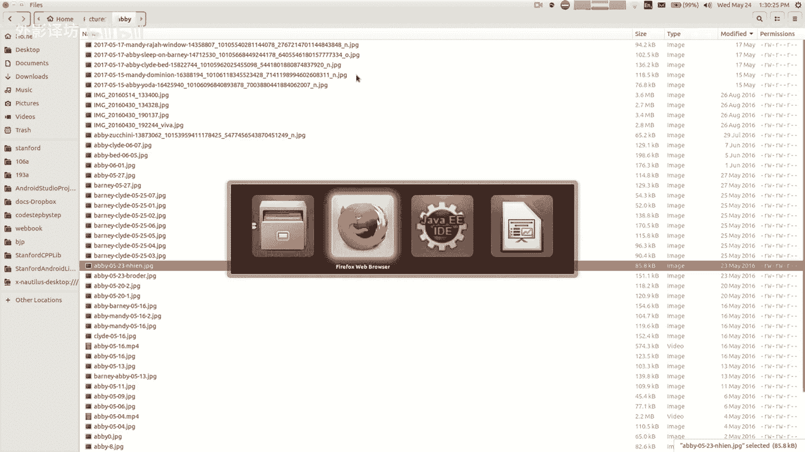

# 课程23：图形用户界面（GUI）第一部分 🖥️

在本节课中，我们将开始学习如何创建图形用户界面（GUI）。我们将了解GUI的基本概念、核心组件以及如何让它们响应用户的操作。这与之前学习的图形绘制和动画有所不同，GUI更侧重于按钮、文本框等交互式元素。

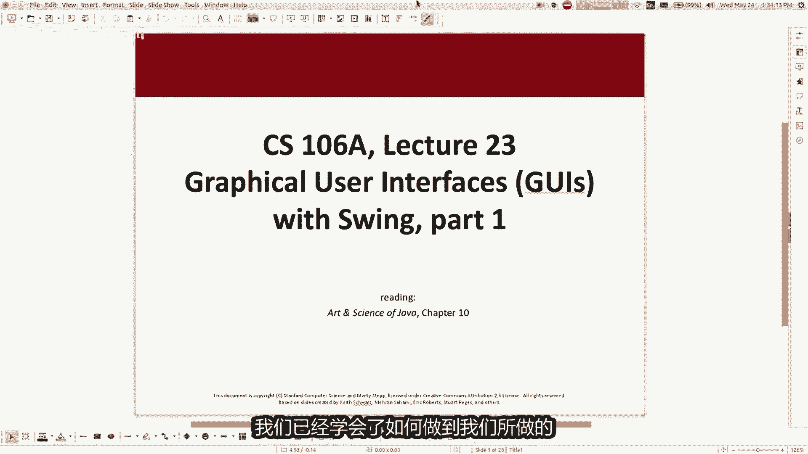

## 概述

图形用户界面是现代应用程序与用户交互的主要方式。Java通过其AWT和Swing库提供了强大的GUI开发能力。本节课我们将学习如何创建一个基本的GUI程序，添加按钮、标签等组件，并让它们响应用户的点击事件。

## GUI的历史与背景

上一节我们介绍了GUI的基本概念，本节中我们来看看Java GUI的发展背景。Java在20世纪90年代中期问世，其革命性功能之一就是可以编写能在不同操作系统上运行的GUI代码。最初的GUI系统称为抽象窗口工具包（AWT），它试图为所有操作系统提供一个通用的界面。但由于它只支持各平台功能的交集，功能有限。后来，Swing系统被创建出来，它功能更强大、更丰富。如今，我们编写代码时会混合使用来自AWT和Swing的库。

## GUI的核心术语与组件

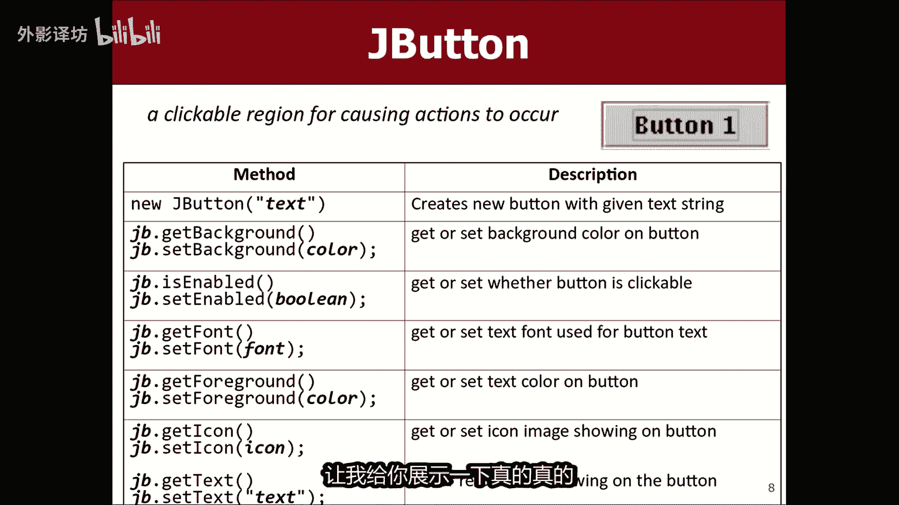

在编写GUI时，屏幕上弹出的窗口通常被称为“框架”（Frame）或“对话框”（Dialog）。窗口内放置的可交互元素被称为“组件”（Component）或“小部件”（Widget），例如按钮、复选框。Java中常见的组件包括：
*   **JButton**：按钮
*   **JLabel**：标签，用于显示文本
*   **JTextField**：文本框，用于输入文本
*   **JCheckBox**：复选框

## 创建第一个GUI程序

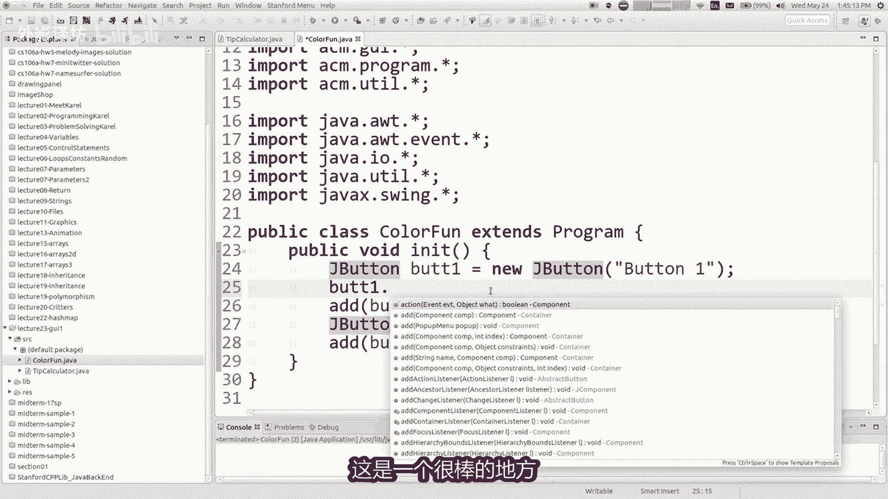


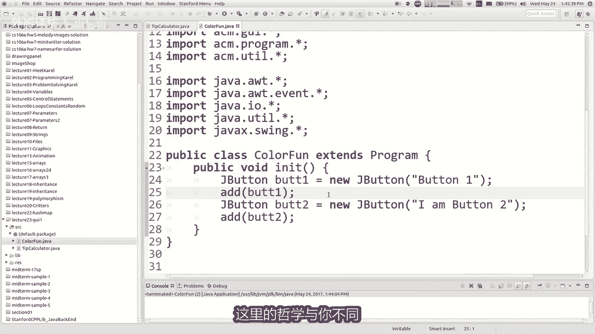

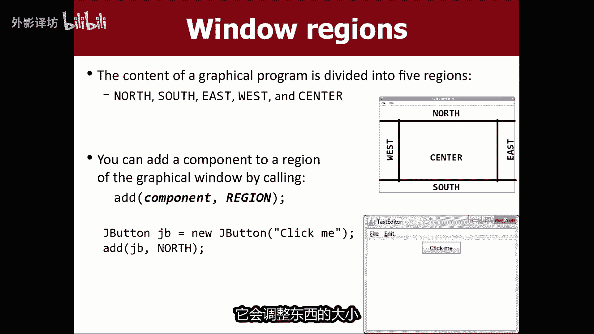

以下是创建一个基本GUI程序的模板。与之前的控制台程序或图形程序不同，GUI程序扩展自 `Program` 类，并将初始化代码放在 `init` 方法中。

```java
import acm.program.*;
import javax.swing.*;

public class MyFirstGUI extends Program {
    public void init() {
        // 在此初始化窗口并添加组件
        JButton button = new JButton("点击我");
        add(button, NORTH);
    }
}
```

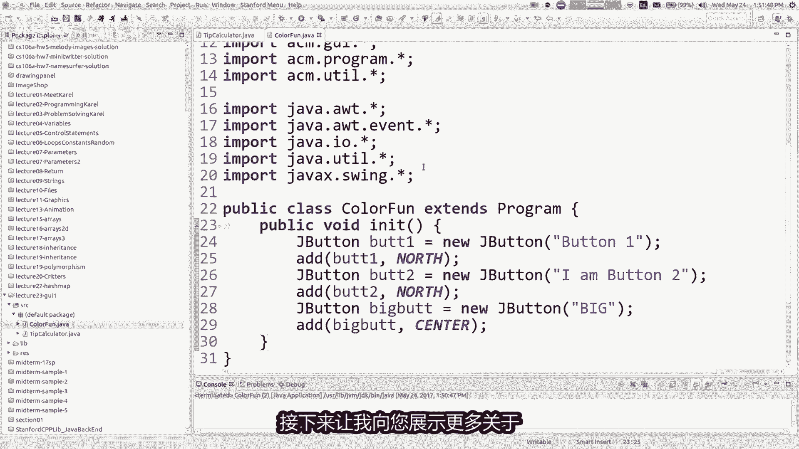

**代码解释**：
*   `extends Program`：表示这是一个GUI程序。
*   `public void init()`：此方法在窗口显示**之前**运行，用于设置窗口和添加组件。
*   `new JButton("点击我")`：创建一个显示文本为“点击我”的按钮。
*   `add(button, NORTH)`：将按钮添加到窗口的北部（上方）区域。`NORTH`、`SOUTH`、`EAST`、`WEST`、`CENTER` 是用于指定组件位置的常量。


## 组件布局与尺寸管理

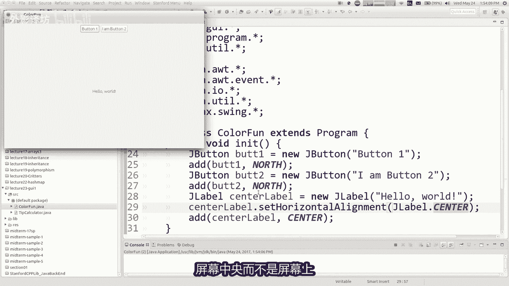


当你向窗口添加组件时，Java会自动管理它们的位置和大小，以适应不同操作系统和屏幕尺寸。这是通过将组件添加到 `NORTH`、`SOUTH`、`EAST`、`WEST`、`CENTER` 这些区域来实现的。`CENTER` 区域会占据所有剩余空间，通常用于放置需要放大的主内容区域（如画布或编辑器），而不是按钮。

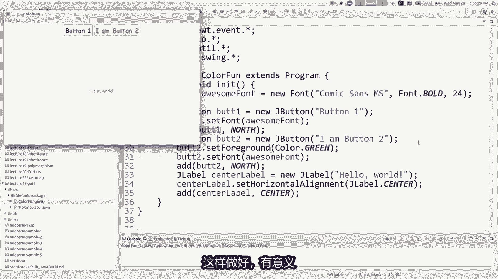

## 处理用户交互：动作事件


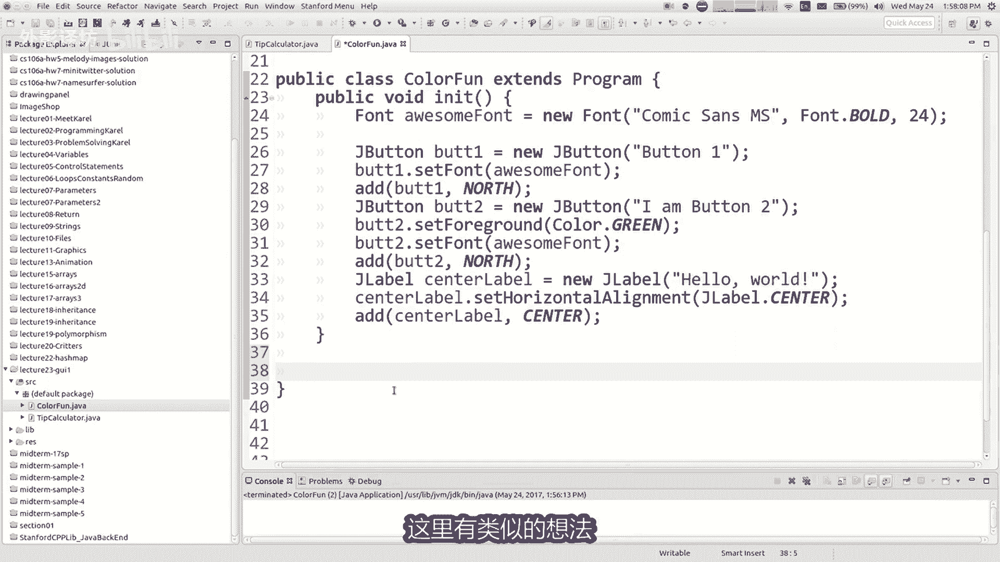

到目前为止，我们创建的按钮还不会做任何事情。为了让按钮响应用户点击，我们需要处理“动作事件”（Action Event）。

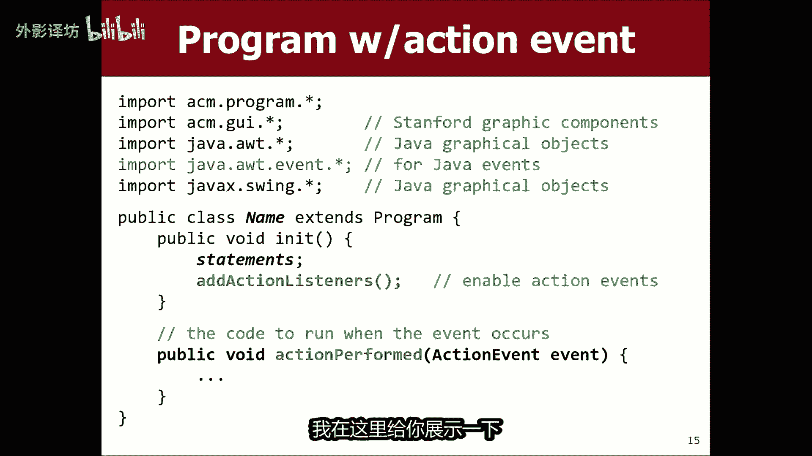

以下是让程序监听和处理按钮点击事件的步骤：


1.  **导入事件包**：在程序顶部添加 `import java.awt.event.*;`。
2.  **添加动作监听器**：在 `init` 方法的最后，调用 `addActionListeners();`。这行代码会告诉程序去监听所有按钮的点击。
3.  **编写 `actionPerformed` 方法**：当用户点击任何按钮时，这个方法会被自动调用。

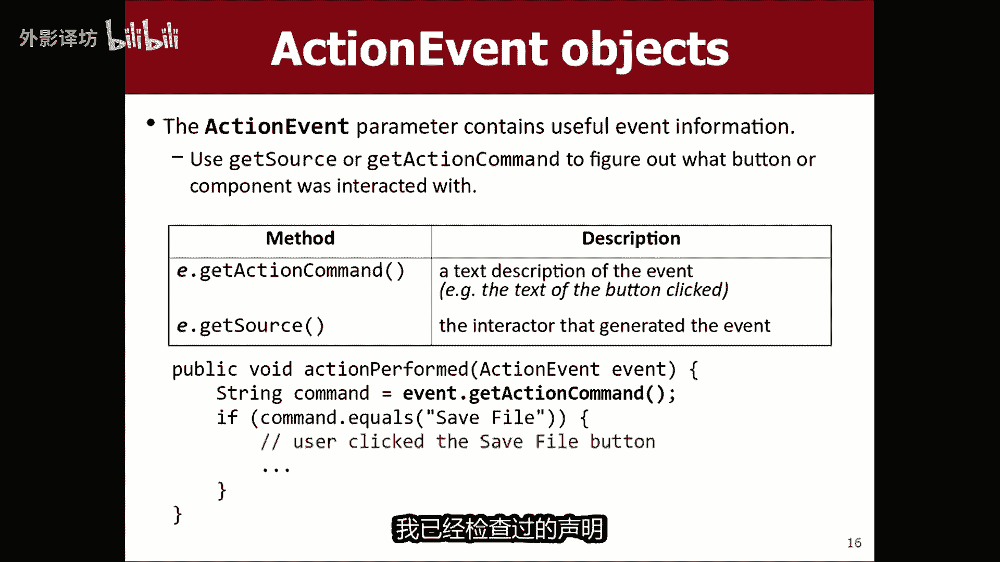

```java
import acm.program.*;
import javax.swing.*;
import java.awt.event.*;


public class InteractiveGUI extends Program {
    private JLabel statusLabel;

    public void init() {
        JButton redButton = new JButton("变红");
        JButton blueButton = new JButton("变蓝");
        statusLabel = new JLabel("你好，世界！");
        statusLabel.setHorizontalAlignment(JLabel.CENTER);

        add(redButton, NORTH);
        add(blueButton, NORTH);
        add(statusLabel, CENTER);

        addActionListeners(); // 关键步骤：添加监听器
    }

    public void actionPerformed(ActionEvent e) {
        String command = e.getActionCommand(); // 获取被点击按钮的文本
        if (command.equals("变红")) {
            statusLabel.setForeground(Color.RED);
        } else if (command.equals("变蓝")) {
            statusLabel.setForeground(Color.BLUE);
        }
    }
}
```


**核心概念解析**：
*   `addActionListeners()`：必须调用，否则程序不会监听按钮事件。
*   `actionPerformed(ActionEvent e)`：事件处理方法。
*   `e.getActionCommand()`：返回触发事件的组件（如按钮）上显示的文本，用于判断是哪个按钮被点击。
*   需要被事件代码修改的组件（如本例中的 `statusLabel`），应声明为类的**私有字段**，以便在 `init` 和 `actionPerformed` 方法中都能访问。

## 使用文本框（JTextField）

文本框（JTextField）允许用户输入文本。你可以获取其中的文本进行计算或处理。


以下是一个简单的小费计算器示例的核心思路：

```java
public void init() {
    // ... 添加标签和按钮的代码 ...
    subtotalField = new JTextField(10); // 创建一个宽度约为10个字符的文本框
    add(subtotalField, NORTH);
    addActionListeners();
}

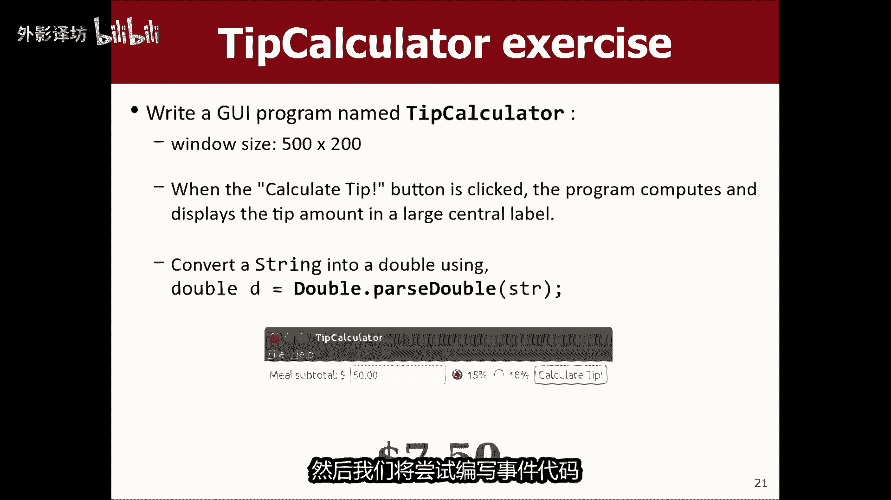

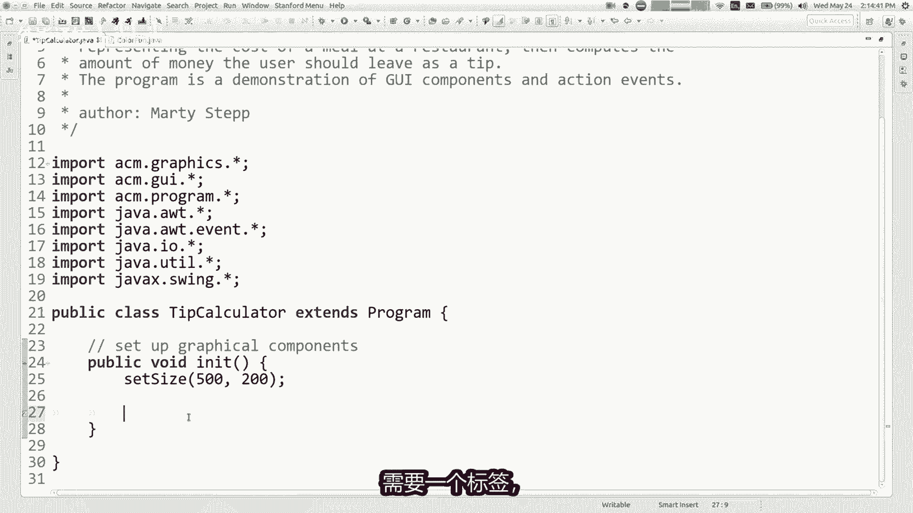


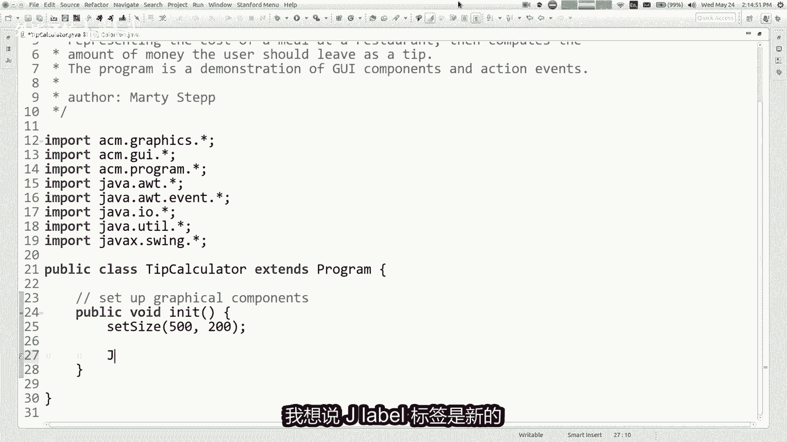


public void actionPerformed(ActionEvent e) {
    if (e.getActionCommand().equals("计算小费")) {
        // 1. 从文本框获取文本（字符串）
        String subtotalText = subtotalField.getText();
        // 2. 将字符串转换为数字（双精度浮点数）
        double subtotal = Double.parseDouble(subtotalText);
        // 3. 进行计算
        double tip = subtotal * 0.15;
        // 4. 将结果（数字）转换回字符串并显示
        amountLabel.setText("$" + tip);
    }
}
```


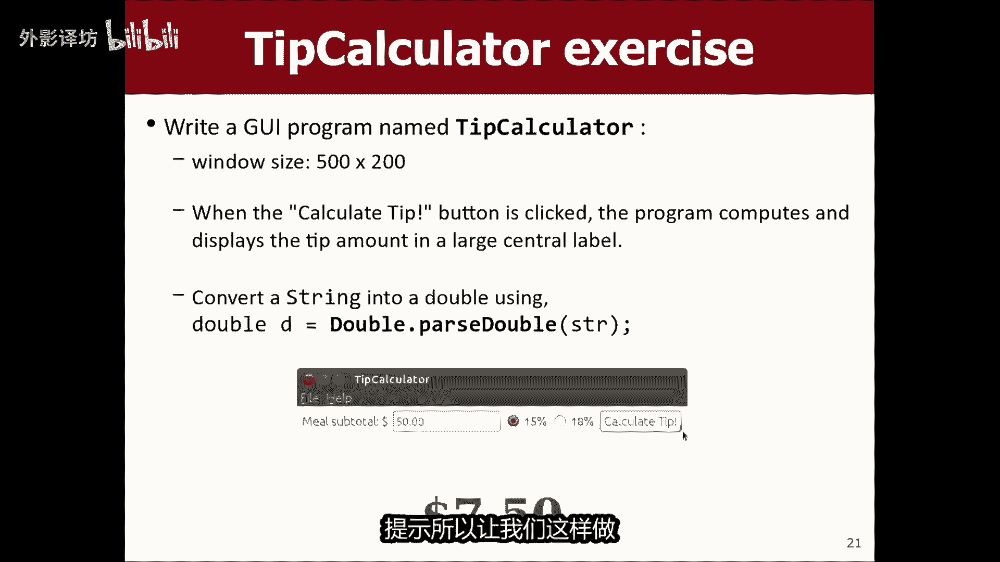

**关键方法**：
*   `JTextField.getText()`：获取文本框中的文本（返回 `String`）。
*   `Double.parseDouble(String)`：将字符串解析为 `double` 类型的数字。
*   将数字与空字符串连接（如 `"$" + tip`）是将其快速转换为字符串的简便方法。

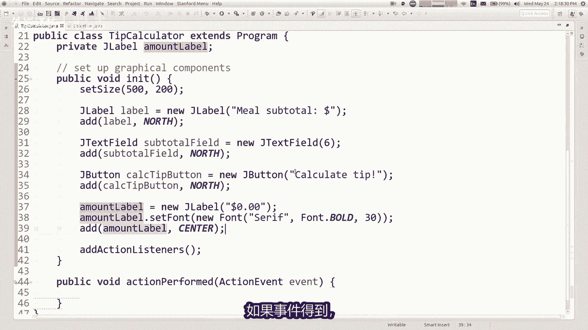

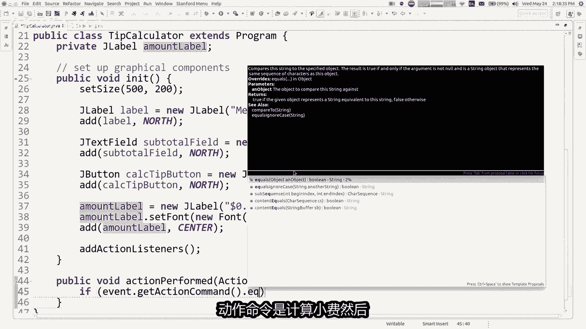

## 总结

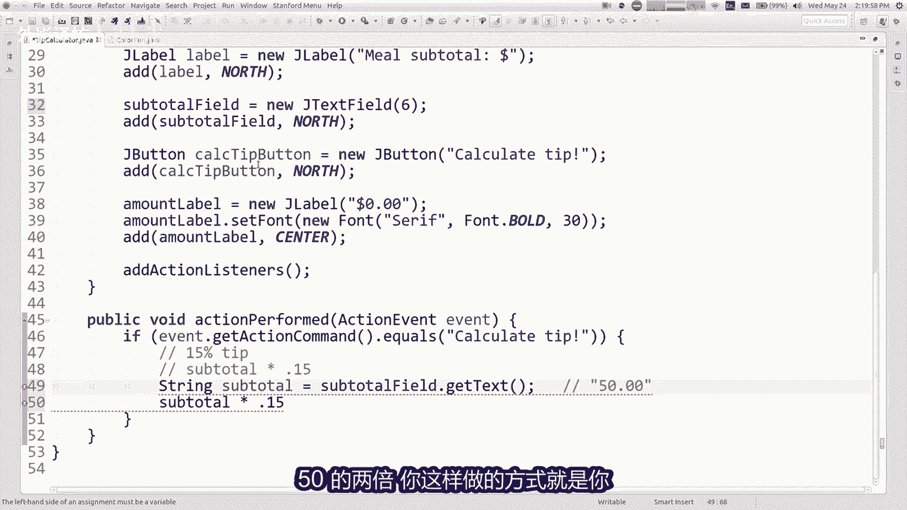

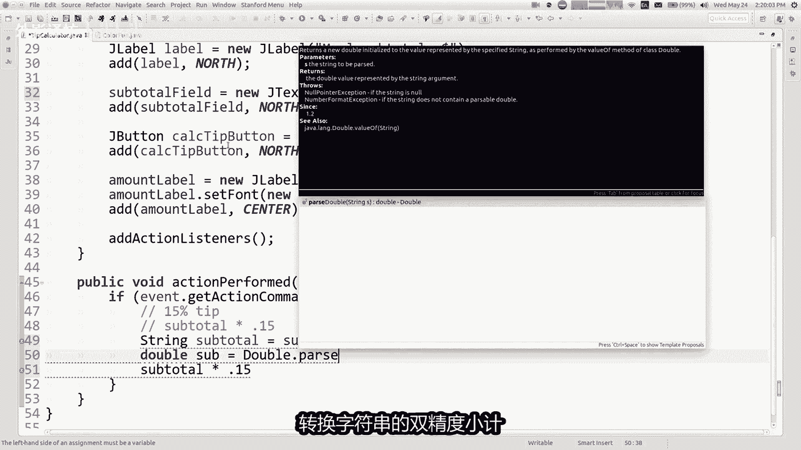


本节课中我们一起学习了Java GUI编程的基础知识。我们了解了从扩展 `Program` 类、在 `init` 方法中初始化窗口，到添加按钮、标签、文本框等基本组件的过程。最重要的是，我们学会了如何通过 `addActionListeners()` 和 `actionPerformed` 方法让程序响应用户的交互，例如处理按钮点击事件。我们还通过小费计算器的例子，演示了如何从文本框获取用户输入、进行数据处理并更新界面显示。这些是构建交互式应用程序的基石。