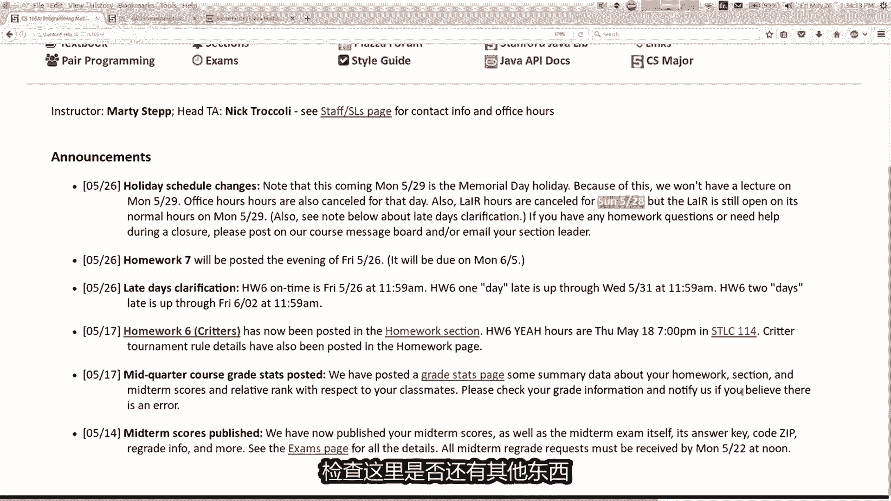

# 【中文配音】斯坦福王牌课程 CS 106a Java教程 2017年春季课程 - P24：24_ GUI part 2 - 外影译坊 - BV14U4geNEEq

我们有几则公告，正如我们提到的，从这里开始，星期一有假期，所以意味着有几个小米知道不同的事物，日程表，一是我们有一天该层是封闭的，你会认为曾将在假期关闭星期一，但是那天不营业，但是前一天关闭。

28号星期日，我想我想逻辑是他们不想做的，部门领导必须回来中间休息坐层，但就在大部分时间在周一晚上结束，那时埃德塞尔已经回到城里了，所以电影也许你们会更可能会在城里例行到五。

所以这就是我认为无论如何不的逻辑，曾周日有曾29号星期一放假，我们不上学，那个星期一我们没有讲座，所以就像你看日历一样听讲座，你会发现没有，那天上课吧，我通常有周一休息，但我不会在这里，那些被取消了。

我会添加另一个办公时间，在这里星期三来弥补这一点，如果你休息期间需要帮助，当然可以通过发帖联系我们，我们的班级留言板，或通过电子邮件发送给您，部门负责人，或给我和尼克发电子邮件，或者无论您需要做什么。

我们都很高兴来帮助你，但我们只是不会那天在场，因为假期还好，而且大学生提出的问题是嗯，还有作业要交，今天如果我不打算打开它，时间，我花了很晚的一天，通常会持续到下一节课，那么这是否意味着迟到的一天。

我一直到这里，而不是结束，这里回答是的，如果你采取较晚的一天，您还有另外五天的时间工作顺利，真是太棒了，我就是这样一个好人，所以无论如何，如果你不碰巧的话，把你的小动物搞定了，你就可以去玩了，中断。

然后再恢复之前，周三就可以完成这件事了，另一件事是你的第七件事，也是最后一件事，今天我的作业就出去了，其实之前还在编辑，所以直到大约时候我才会发布它晚餐时间一天，但没关系，它会到期的，每周一计划在这里。

以便您知道那是七点到7日，那么上周你就会有这样的经历学习，并为期末考试做好准备，这将是第十周的星期五，第九个借口，这是一个计划，我们在本季度剩下的时间里好吗，伙计们有任何问题或需要你的问题。

你可以使用最晚的日期吗，最后的作业让你不能，因为我真的想让你花钱，这周正在为期末考试学习，所以请使用他们和你在一起，上帝你不需要使用链接的辅助工具，我以前见过你编码，你指的是莫妮卡，莫妮卡。

你已经失去了所有的女士，反正好吧，这是真的，任何问题，关于我刚才的任何事情的一般性说，或其余的计划，我认为走廊或类似的东西，今天是你可以放弃的最后一天累，所以希望你们都没有机会这样做。

是因为你知道我的意思是有趣教大家，我希望你们会坚持下去，但无论如何，我认为还可以，这些是我所有的公告，让我检查这里是否还有其他东西，是的。

我想这样就可以了，我们就这样吧，一些材料，我有一些幻灯片，今天要介绍更多。

我们开始的图形用户界面，所以请记住，我们是区分2D图形和绘制形状和线条，以及动画，从图形用户界面，用户界面就像与用户使用按钮和文本框，以及复选框和类似的东西，就这样，我们上次了解到这些事情。

我想继续讲课，上次离开，所以我们有团体，我没有加载剪辑，很抱歉，我们有一个可以让你计算的小程序，你应该留下多少钱，在餐厅付小费后，我们大多数人写的是，我有点匆忙。

在上一堂课结束时，我要再次打开该程序，我想添加一些功能，那个程序可以让我教你更多的组件和图形功能，让我们回忆一下一些当你做的时候发生的事情，图形用户界面为您编程，说你扩展程序。

而不是控制台程序或括号程序或类似的事情，另一件事是你修改你的程序，说它而不是运行，你投入了很多初始化代码，在那里，它的代码你设置窗口的地方，设置图形组件，进入INIT方法，我们学到了关于一些不同的名称。

像j label这样的组件，只是画一些粘性J文本字段上的文本，但是你输入一些内容，让你输入放个G按钮就可以了，单机等等，以便我们了解一些，我们也对这些不同的事物学会了如何查看事件，用户点击这些。

实会导致你有这个添加操作的小部件，当你运行它时，监听其方法，它的制作方法很受欢迎，点击将调用此方法，调用了action perform的方法，我们我们还看到您可以看到哪些通过实际询问。

点击按钮对于事件的动作命令和查看，如果它等于各个文本按钮，会告诉我们哪个按钮被点击了，这就是我们的位置，现在如果你运行上次的那个程序，讲授您将看到的小费计算器，他有一个文本框的膳食小技，为了打字。

我花了50美元吃饭，你可以说计算小费，计算使用小费七美元，并且50美分，如果你的缴费金额，当然大多数小费计算器是15%，让你告诉他一些关于什么的事情，你想要正确的百分比，十十五十八二十%给出不同的选项。

所以我想要将其纳入其中，你可以想象有一个程序单独的文本框，你可以在其中输入，那么你想要多少百分比的小费给你，可以1。5或15%，类似的事情是对的，但你知道你必须考虑这个，我们还没有谈了很多。

如何设计用户界面，很好用，我不是真的很想谈论这个这门课程的很多内容，都有点超出了范围，语106A，但它是想想看，如果你的用户界面很糟糕，用户不喜欢你准确，所以通常你想要思考，关于您是否正在与用户交谈。

你想给予多大的灵活性，你想要输入的内容，他们想要或你想要的任何东西，让他们从一组固定的选项中进行选择，选择似乎是您知道如何操作的提示，这附近有很多餐馆，有那些IPAD的小东西，按一下按钮。

十五百%分之18，似乎他们给了你一些具体的选择，但他们不让你输入究竟有多少正确，所以我们可能想要像那套固定的东西，如果你想要这样的选择，而不是有一个像这样的文本框，圆形，任何你可能想要的东西。

像我说的那样。

给他们特定的按钮，我认为有一个很好的小部件，这叫做单选按钮，所以我们去学习如何做单选按钮，现在和其他一些组件一起，稍后在讲座中，我将谈谈你想混合GUI的时候，现在就通过吃动画来学习，就像我们分手一样。

你可以混合这些两件事放在一起，所以我会谈谈，那就是最后一件事，希望我们有时间完成这一切，在一起就是我要说的结局，一个更大的GUI程序，其中有几个不同的班级，以及那如何呢，我的程序被破坏了。

会谈论一些叫做模型和视图，稍后确定我要做的几件事，发射一些你可以的黏糊糊的东西，教你一些你自己可以放冰块，标签和按钮上的操作方法，那就是你制作一个图像图标对象，当你创建它时，你传递字符串图标。

图像文件的文件名，所以如果是你知道笑脸点PNG，你把它写为文件名引号，这样你就可以构造这个图标对象，一旦你完成了，它与您想要放置的组件对话，打开你说设置图标，然后你就通过了该图标对象的参数。

如此只是给你一个简单的例子。

在我的项目中哦等等，我把这个放进去了，是的，在小费计算器项目中，我有一个名为橡皮压点的图像，所以也许在这里这个按钮说计算小费按钮，你可以说黑计算提示按钮，我想要点击图标，他会问你传递一个图标参数。

然后我可以做到这一点，我需要一个图标参数，所以我会说图像图标图标等于新的rs斜线，橡皮鸭的图像图标，ping我会将该图标作为图标传递，右边的按钮很简单，不是现在会花很多时间在这上面，但从来没有橡皮鸭。

我不知道你为什么想要那个，但它是看起来很酷的一件事，当你创建时，我有时会提到这些这些事情，然后你就指一旦你能真正使用它们，缩短这个下，而不是将其创建为自己的变量，然后通过它。

你实际上可以抓住这部分新图像图标，你可以把在这里，所以你可以做这一切，你可以说异形将图标设置为S，其中的新图像图标文件，这样你就会看到我使用该编码，在这些GUI示例中稍微设置一下样式，好吧。

这是一个非常漂亮的图标。

不言自明的，我们想谈谈关于为小部件添加边框，知道这些小部件都有一个方法，就像设置颜色，设置字体，设置任何东西，有一种方法叫做设置边框，很简单，除了唯一的问题是，当你说设置订单时，你必须传入一个边框。

作为参数和java有一种奇怪的方式来创建border，你实际写的边框，工厂点创建线边框，创建标题边框，创建一些常见的边框，然后你传递参数，这将为你做一个边框，看起来很奇怪的语法，但事实并非如此。

一旦你看过几次就很难了，四子图视图显示一些不同的边界，可用的凸起边框，有点像，这东西，看起来像是从里面出来的，3D屏幕或类似的东西，我主要喜欢线条边框和彩色边框和这些种类。

这是一个非常简单的例子，边框可能是相同的按钮，在这里我会说黑计算小费按钮，请将您的边框设置为边框。

三点创建，让我们做一条线边框，这是一个非常简单的边框，如果你可以在这里看到剪辑，建议你可以传递一种颜色或一种颜色，厚度或厚度中的颜色，以及一个布尔值表示是否应该四舍五入，我神智不知道所有这些不同的选择。

但我通常会通过颜色和厚度，所以我会说类似颜色，蓝色厚度五五个像素，如果我运行这个，我觉得按钮有一个五个像素的边框，就像我教的很好一样，界面设计美观，今天是美丽的橡皮鸭，边框周围有蓝色的蓝色边缘。

所以无论如何，这就是你设置边界的方式，边框工厂的东西看起来有点很奇怪，但还不错，有一个一大堆其他类型的边框，我不会花太多钱，有很多时间，但如果你想学习你所有不同种类的边界，只能用于边框工厂点创建。

然后查看所有这些你可以做的事情，你了解你可以做一个有虚线边框的地方，你通过了，我不知道所有这些疯狂，所以我想我不会打扰玩太多，但是有很多不同的选择，如果您愿意，可以联系记者看看他们好吧。

所以这是我的枪和边界，他试图保持快速通过所有这些东西哦。

如果你想阅读更多内容，有关这些不同之处的文档功能工作，java拥有所有这些很棒的网页，描述所有不同的组件可用的以及所有方法，他们让你看到，我可以看到一些eclipse中的方法列表，这很适合找到名字。

但它不太适合阅读有关他的内容，他是做什么的。

如果你想要你想要的它有用吗，应该做的是访问我们班级的网站，然后在链接栏中我们有这个链接，说java API API代表应用程序的文档，程序员接口，基本上意味着有关如何使用库的文档，已提供给您的代码。

因此如果您单击该链接，我认为是我的WIFI在这里永远不会起作用，但如果你点击它有一个所有不同的列表，java附带的类，您可以导入，您只需搜索一个，一旦你通过名字寻找找到它，会弹出一个文档页面，像这样。

所以你想要有关的信息，边境工厂这里一切都不同，方法和你告诉我仪表板或工作，如何让我点击这个，然后他有一堆信息，并告诉您可以做什么，不管怎样按照参数做。

这就是人们学习所有这些的方式方法，以及它们如何工作，无论如何保持搬家，继续搬到这里，所以我想谈论我们的XP了，继任信息技术人员多少钱，该人花在吃饭上的钱好吧，那是一个j text file的对象。

我的客户还有一匹小马之类的，很好好吧，这是一个预执行，但是什么，我想谈谈的是这文本字段与事件混合在一起，所以让我澄清一下，我的意思是，如果你去那个小费计算器，如果您输入一个我们编写的程序。

金额如45美元，您可以计算提示他确实可以，但是很多人都这么做，希望能够做的是输入数字如100，然后按enter，你知道如果你没有计算小费的话，当我按ENTER键时，我什么也没做，在java中确实如此。

就像您输入文本时的默认设置一样，字段或在文本字段上按enter键，它不会让事件发生，但你可以让它引发一个事件，如果你想要它，你只需要知道如何做，你这样做的方式是，你必须在文本上调用一个方法字段对象。

我们现在添加动作监听器，我们刚刚看到一条消息，或者昨天或某一天，或无论是什么或者星期三，我不知道是哪一天，他处于搁置状态，我们看到了一个名为ADD的方法，实际上是听众或所有这些方法目的是去寻找。

也在屏幕上听他们说这事，你的目标略有不同，一个特定的组件，你说话你我想听你说话等等，该广告实际上是的原因，我们周三做的书呆子方法并没有活到文本字段，是因为设计他的人决定，他应该默认情况下只监听按钮。

但是如果你想听一个文本字段。

必须具体说明该文本场，所以在这里我们有一个叫小G字段，这样我就可以说黑小G，我想添加一个动作监听器字段，你必须通过的是谁想听事件等等，我的程序想要监听事件，我们已经了解了这个词。

这有点意味着我的班级反对，我现在写的意味着我的程序想要听这些事件，所以现在我将收到，当他们在子文本上按ENTE2时发生事件，现场好吧，现在记住我们是如何在这里的，由我们使用的get action命令。

看看是谁导致了事件的发生，使用它我们检查不同的字符串，是它等于这个字符串或那个流或那个字符串，这样我们就知道什么按钮，单击这些会引发最梦幻的java发展方向的问题，如果他们在文本上按enter键。

则通过，你可能认为它会过去的领域，他们输入的字符串，文本字段也许不是它的作用，但如果他确实这么做了，你不会知道在这里检查什么，他们都有帮助，如果他们可以输入任何内容，那里太难了。

预测一下你能做的就在这里，当您添加此事件侦听器时，你可以告诉他你想要什么屏幕，喜欢它，稍后在实际进行时执行的称为你所做的事，你说黑小计自断，我想将您的操作命令设置为类似文本字段，类似的东西。

你可以将它设置为任何你想要的字符串，基本上你正在做的就是我想要的，你将这个屏幕传递给行动，如果他们再次按ENTER键则执行，如果你说的好，那么下面的家伙知道事件是否采取行动，命令就是这个。

然后你就知道了，这就是如何告诉他要传递什么，下面现在明白了这个程序，我想我想要的是您按下计算提示按钮，或当您在小G按上按ENTER键时，想要这些事情中的任何一个，导致程序执行相同的结果，计算小费。

所以我猜你是什么，实际上你可以做的事，这家伙的动作命令是一样的，该按钮上的字符串已变，如果其中任何一个都会导致相同的结果，语句在这里执行，我不需要做任何其他事情理解，所以这实际上没问题，特定的程序。

但这个程序是很简单，没有太多事情发生，所以我想现在我所拥有的事，如果我输入100美元，然后五按ENTER，它会计算小费，这是更好的用户界面，好的嗯，嗯无论如何，没有这些行，在这里添加动作监听器和设置。

它不会执行的操作命令，当我按ENTER键时，有任何事情，谢谢。

所以如果这不是超级令人兴奋的话，我我想继续前进，到目前为止，有关推进的问题，文本字段有意义吗，我将讨论更多功能，编辑好的海报，再次出发，为什么他只计算一次，你的意思是，为什么他会计算更多。

比一个希望他做一次或保持，做得好，我认为这个想法是，如果我按回车键，如果我改变了，然后再次按ENTER等待50，美元等等，我想我正在看旧的window好吧。

有时你会发疯，我想我刚才的那扇窗户看似从讲座开始，在我添加新代码之前，你也是如此，曾经这样做过，你有大约十份副本，你的程序正在运行，你会转到搞错了又出问题了，你是就像我可以解决，我知道我所做的那样。

然后就像稍后你再次运行它一样，我的代码里有什么妖精，直到我曾经告诉过你，你有时知道当我得到课程结束时，学生的评价会写的像我真的很喜欢马蒂一样，假装在课堂上犯错误，让我觉得他是个人类。

我和我就像我假装说的很清楚，但是是的没错，我们就这样吧，无论如何好吧，让我们努力做好，这样我就有了十美元，小费高于50，但如果我有50美元，如果超过这个也没关系，所以你的问题是怎么样。

他这样做过不止一次吗，基本上是它运行的触发器，执行操作的代码是如果我按ENTER键，所以我将值更改为五，到目前为止没有重新计算任何东西，但如果我按ENTER实际上执行再次运行。

所以这是一种触发可能性的因素，运行频率如何，如果您经常他会重新计算，希望他重新计算每一个，当你按下一个单独的键时，可以做到，但你必须学习关于其他成为钥匙的东西，听众你很难听。

每一个你们所有人都按下一个单独的按键，我今天不打算讨论这个问题，但是无论如何，这当然是可行的。

所以我想教你更多的小部件，这将使我们的计算器程序成为更强大的复选框，和我提到的不同的单选按钮，缴费金额十五十八%，我认为这些都是不错的选择，用于向用户展示该选项复选框，就像布尔值true false。

打开关闭选中取消选中是注释，单选按钮也有点类似，有一种圆形按钮，单选按钮的区别在于，通常复选框是独立的，而单选按钮连接到彼此的单选按钮可能是哪个，每三个选择你都可以只选其一，它们是相辅相成的。

独占复选框，可能像这里有几件事，你可以选择，你可以选择他们的任意组合，一个或多个或全部或没有或某事，就像这样，所以我有时需要一个类比，就像你订购的门一样，您正在网上订购食物，您可能只需要选择的餐厅。

你想要鸡肉还是一种肉，牛肉或猪肉或蔬菜或什么都没有，或无论你必须选择什么，这些选择之一，但当它到来时，你想要什么附加组件，生菜番茄已制到gen底部，奥列格盐或任何你可以检查的东西很多。

这样的盒子配料就像额外的东西一样，是复选框，而肉类选项将是一个单选按钮列表，这样你就可以将复选框设为单选按钮，很简单，你只需构建它们，你传递你想要的文本出现在他们旁边，而你是主要的。

你会和他们一起做的事情，就是你可以设置是否选择他们，意味着他们是否被检查，而你可以询问是否选择了给定的一个，这就是如何使用它们。

让我用小费计算器演示一下，如果你想做15%的计划，18%，无论如何，让我们到这里来吧，为此制作一些按钮，所以在这里当你设置窗口时，你的程序也许你会缩，让我们把这些选项放在来，让我们说吧。

让我们做一个G广播按钮，15按钮是新的G收音机，按中你说15%，然后我们添加，窗户南边的那个，让我们做几个吧，做15和18，事实上我想我想啊，我可以像一大群人一样做就足够了，但我想你会明白的，余二。

所以如果我这样做，并且围绕现在再次编程，下面有我想留下多少小费的选择正确的几件事，他们都没有选择正确，现在你通常希望有有点像初始或默认的选择，正确的方式，就像你会做的那样。

那就是在你添加之前可能有15个，你可能会说它到屏幕上15按钮点击选择为true，所以只需检查默认情况下，15是星星好吧，所以让我们用它来运行程序好吧，现在已经检查过你了，说好吧，不，实际上我想要18%。

你点击一下，现在他们都是两个都选择了等待，你不应该这样做，能够选择他们，所以我刚才说那个单选按钮，这必须在视觉上是独一无二的，但是java不知道，除非你告诉我，这就是如果让我这样做的原因。

这是因为你可能有不同的成组的单选按钮，都在同时显示他不想要的，假设它们都是相互的，与您所有其他人独占，必须告诉他哪些是区域性的排他性，这是你告诉java的方式。

还有你必须使用的另一个类称为按钮组，您可以制作一个按钮组对象，并添加单选按钮按钮，不要混淆这是不是图形组件，它不是出现在屏幕上，它只是一种管理排他性的容器，这些按钮，所以如果我只想要一个一次。

选择其中的一个按钮组。

并向其中添加按钮，这就是你需要做的全部，如果我想要18上的15按钮，按钮是排他的，我会说按钮group组是一个新的按钮组，并且我会说组点添加15按钮，和组点添加18按钮，现在，如果我重新运行该程序。

如果我单击18取消，点击15，反之亦然，我会可以有任意数量的按钮组还可以，但是缺少一块，它实际上并没有使用这些按钮吗，做任何不影响的事情，还没有进行计算，所以也许就是这样，我需要你的帮助。

我想要15和18按钮影响小费获得的金额，计算出来有哪些变化，你认为我需要编写这段代码吗，让这件事发生，下面我正在计算吉普，我该怎么做，知道是用15还是十八百分比和客户还好，乘以15或18。

具体取决于检查哪一个或者其他什么，但是我怎么知道哪一个被检查了，我觉得这是一个好的开始，我怎么知道先生你有吗，是的，我想，你在里面，你在右边，我需要为此字段，因为如果我在INIT中创建它们方法。

我的意思是也使用它们在行动中执行方法，电量可以存在足够长的时间以供使用它们，在这两个地方，然后它需要成为一个练习场，所以你你说的对，所以我们就这样吧，到这里的顶部，让我们说私人周杰伦单选按钮。

15个按钮，实际上你让我给你看一些东西很酷，我知道很多忍者魔法，你知道我可能是个笨手笨脚的白痴，有时会来这里，但我实际上知道一个，我们分享很多很酷的黑魔法，我的黑魔法无人能挡，让我告诉你看到这个。

就像你知道那应该是一个字段，如果你右键单击它，并说重构提取，我将转换为字段，看看名为private的那个15按钮，好吧，就这样吧，砰来吧来吧，有点酷，你不觉得吗，如果我们输入任何内容。

我们会因式转换进入现场，做baa m的下一个版本，eclipse将只有一个名为，就像做作业六去，他就会你想发表评论吗，是的好吧，我转为你而来，我希望黑我可以取代我们所有人，所以现在那些已经填满了。

就像你告诉我的那样，让他们现在就在这里，我可以为你做sad被选中，所以听起来也不错，我可以做一些类似双小费的事情，分号，然后我可以说如果选择15按钮，然后提示回来了，否则小贝是八之类的，就这样。

我现在可以使用那些变量，我可以问哪一个是选择了，我想我只是说等于零，所以它会编译，但正确等等，你为什么不高兴，你为什么不高兴不高兴，为什么下划线是双小废，我，明白这里有我没有，任何错误。

但可能在100以下，只要运行就可以了，现在让我们做50块钱，15%的小费，就这么多，切换到18就可以了，这样就可以了，这些是单选按钮，有点跳跃，绕了一圈，走的有点快。

但你知道很多这些图形组件不是这样的复杂，我认为关键是步组件本身，但如何让所有这些部分互相对话，正确的，我们一直在做的事情，整个季度都在建立管理范围和私有字段，以及你知道所有这些不同的事情。

关于这个想法的正确问题。

我确信还有其他一些事情让我们谈论，混合图形和形状以及动画和我们现有的东西，这周学到了关于浮标的知识，但我没有会花很多时间在这上面，因为这并没有那么重要，但是让我们看一下，有一个我们库中名为G的类画布。

距画布是您可以选择的区域，可以在上面绘制形状和图形，以为突破而做的程序，有人构建了图形程序程序，这只是一个常规程序，其中心部分有一个计画布，所以程序加G画布等于图形程序，所以如果你想写一个具有带按钮的。

GUI的程序，这周我们学到的所有这些东西，按钮也有图形和形状和动画，在某种程度上是相同的，编程你所做的就是画出所有的动画和形状，在一类中你写扩展句话，不然后你写了一个整体程序，单独上课，两个人谈话。

他们彼此之间并且有点在一起，形成你的总体计划写下来，所以我要尝试演示一下，刚才对你来说，事情是这样的，我想做我想做的事，这个汽车程序我们写了很长时间，在我们的其他讲座之前。

我写了一篇叫做汽车的课程，让我为你打开它，这就是我今天的项目，他叫汽车压爪哇，那是我们写了这个汽车程序，但不是那样的，特别的是它只是弹出一辆车，有一个车对了，所以我不只是偷那辆车代码，并将其放入画布中。

然后演示这是如何工作的，所以我我有一些代码，首先我有一个名为cad的文件GUI，一个汽车GUI，我做了一点点，在这里为我们设置，我所做的是我做的两个按钮，一个说左边，一个说布莱斯把它们放在北方。

我说我想听动作事件，我如果他们点击，则有一个if files语句，如果他们点击右键，什么也没有留下，所以我填写了其中一些内容，让我们继续前进，然后我专注于其余的事情，现在我要做什么。

如果我想添加到这个程序中，现在就这样运行，你会发现这只是从左到右的按钮，没有其他事情发生，我想把车放在中间窗户，我希望能够移动，通过点击这些来向左和向右移动汽车，快好吧，我该怎么做。

起点是让我们做与该类不同的另一类，这将处理中的分页图形和动画的东西，和该类将被称为car画布，这样你就可以编写一个扩展的类，哎呀画布，这个画布类不是完整的程序，就像一个程序的一部分。

图形窗口将出现在程序，所以现在在这里你设置所有现在的形状，我想这可能是对于像这样的学生来说，有点迷失方向，这个关键的画布东西是什么，但我是什么，对你说的是，你使用过的所有命令要在图形程序中使用。

您可以基本上使用所有相同的程序，这里的命令如果我去的话，他的GPS就下，这是一辆旧车，只是一辆，如果我有一辆汽车的图形程序。

偷一堆这些东西，如果我只是基本上窃取了所有这些代码。

我像这样粘贴在这里，所以这是一个画布的构造函数，当画布正在创建，我要设置它背景颜色，我要做一个汽车和绘制汽车的相同代码，所以我只是把它粘贴在那里，现在回到整个汽车GUI卧室。

会说一些像汽车帆布之类的东西，画布等于新车画布，然后我要说的是将该画布添加到我自己在中心，将其添加到这个程序的中心，好吧，现在我汽车GUI基本上有那个吗，相当于那个的中心部分，整个程序。

但现在我也有一个整体，GUI周围有按钮可供查看，没关系，现在缺少的部分就是当我点击左右的时候，没有做任何事情，所以让我们想想出去，我怎样才能让这些按钮实际上左右移动汽车，你有什么想法吗，是的是的。

他说我可以写一些吗，在画布中移动汽车的方法，我们正在构建的课程式的，所以一个你可能没有意识到的是，这些都是你的课程写作，你可以放任何你想要的东西在他们里面，所以这就是让我们有点经历这个并陷入困境。

有那么一瞬间，我就像在这整体汽车GUI，我有一个事件，他们点击左键或点击，是的，我想告诉汽车向右走，就在那里，但是画汽车的人不是这个文件，是汽车的另一名飞行员画布跟随。

所以他就想这是一个你们可能遇到的情况，当你在这些中编码时会投入很多，你就像我有一些作业，我想要的信息就在这里，以某种方式去那里的信息，它需要符合条件的信息，需要文件含义的信息，信息立即传到你的大脑。

GSL参数，我需要喜欢发送该信息作为参数提供给他们，是的，那么我该如何提供该信息，到画不黑画布点转到，对你知道，直到我需要告诉画布将汽车移过来，因为画布是有车的，那些怎么打扰车还可以。

但是没有没有办法向右走，我们找到你，然后写一个方法转到代码的右侧，这样这就是你说要做的正确的思考方式，对于这个汽车帆布课，我有一个绘制汽车的方法。

让我们制作一个称为public ford go right的方法，或我怎样才能让车子正确行驶，好吧，我这里有所有这些形状，所以我只需要移动我认为的所有东西，你可以为HG做类似的事情。

此窗口中的对象移动20，像素或你知道的东西，可以写一个名为go left的方法，同样的事情向左移动，并经过-20类似的东西，所以现在我有这些方法很重要，他们是公开的，那是因为公共方法是允许其他类调用。

对我来说私人的就是只有我自己的，我可以打电话给我，所以GUI如果他们点击右键，然后他画布去等待哦，哦你知道为什么我不能发送任何东西吗，对于画布的命令，我遇到了一个错误。

对了为什么我不能和画布位于第39行，是的不是，私人领域，这和我们是一样的，那些单选按钮，有一些几分钟前你就会看到这些，一遍又一遍相同的主题，关于优，如果我在两个地方需要，它，应该对这张画布提出上诉。

我要去的非常重要的物体与他交谈，这个程序运行很多，让我们把它变成一个让我们使用的字段，那个很酷的功能，重构转转换，使其成为私人画布好吗，如果我说画布的话，现在就在这里，医生说的对，太有效。

如果我说画布点向左走好吧，让我们看看这是否有效，现在我有一个，机车我有一个用于控制的GUI车，我知道你在想什么，这个程序中有一个启动项，我知道的某个地方我们可以制作cooper2。0。

但没有所有你知道的，骑士的事情很棒，但无论如何，这就是如何编写程序的基本思想，与动画图形混合与GUI，如果你本来打算做一个动画循环，汽车想要行驶的地方或问题，可能是你知道的，通常会记住，当你做某事时。

如何动画循环通常会暂停，并然后将事情向右移动，这样循环的，也许你会想知道我应该把那个循环放在哪里，通常该循环会出现在您的整体中程序，所以你会说类似的话，我有一个INIT方法，并且我有一个run。

你并不总是需要跑步的方法，GUI程序中的方法，但如果GUI计划即将发生，Mission mookie经常把它放在乱方法，所以你会说类似的话，虽然是真的，你知道可能暂停了100ms。

然后告诉画布向右走或者类似的东西，无论你的动画目标是什么，你会在那里做，所以现在卡不回去，我知道你面前有一个球，看看那里有柴油藕好吧，程序大约是1/4英里，所以无论如何，关于混合的问题。

你的画布与我们做的程序继续做这项工作，让我确定一下，做到了，记得我认为关键要点，如果你有信息的话，在此文件中您需要获取它，在那个文件的右边有一个方法，让您可以将信息发送过来，就像你有能力做到那样。

你的文件就是这样做的，所以只要记住这一点，这个想法是我们的洞察力，应该写这些方法好吧，记住我最不想做的事，在我们有的时候教你离开，并希望我们能完成，这就是我想谈谈一个叫做模型。

试图分离这更多概念性的，但我会为此付出代价，当你也有一些特定的代码，谈谈编写图形程序，你经常谈论这些概念，并且在所有的计划和观点中，程序和模型不像特定类型的工作对象，或特定的类或方法。

或者是否是一个想法，这是一个评论，如果模型有点像原始的好程序，代表数据的核心，你所代表的，如果你是编写一个注册系统，斯坦福大学的模型，就像有关学生姓名和AD的数据，以及他们正在学习什么课程。

以及谁是教学，是否有此数据的屏幕，它们是真实的，无论谁存储它，任何物体都抓住它，这就像你的模型部分程序，然后有一个单独的称为视图的概念，就像你如何获取所有这些数据，并向用户展示，以便他们可以看到它。

以便他们可以搜索它，以便他们可以寻找任何东西，以便他们能够与该数据交互，当然模型和视图协同工作，有时是完整的，程序模型和视图分离，模型由某些类代表，并且试图中的对象表示为某些类和对象计划。

那些规模较小的公司，所以也许这一切都只在一堂课中，所以不是始终是一个单独的对象或单独的文件，或不管怎样，但从概念上讲，这是两个你通常在图形中看到的东西，程序没问题，现在处于典型的图形流程中。

程序有一个视图，用户看起来像GUI或其他东西，或你的可能是像所有控制台一样的控制台，你仍然驱动控制台的程序算作一次试图，因为您可以显示通过打印清洁为用户提供帮助，他们是对的。

所以风景正在等待用户执行用户单机的操作，或类型或其他东西，那就是活动正常，因此他们将信息发送至风景和风景说哦，你是正在搜索一些数据，或者你需要我更新一些数据或其他好的东西，你想再次注册自己。

你想从斯坦福退学的课程，因为马蒂的课太难了，但是不管怎样，你想改变数据或以某种方式查看数据好吗，我去问问模特，我去查找您要询问的数据，或去更新你所要求的数据，关于黑模型，你能给我吗。

这个数据模型表明它确实在这里发回数据，或发回改变或其他什么，然后是视图回复你，嘿这就是什么发生在这里的事，显示你所做的改变或其他任何改变，无论如何，他们只是合同好吧，但是有时这些概念是当你写一篇文章时。

最好考虑一下计划，因为它可以帮助你取得好成绩，关于什么文件盒的设计，选择标语牌方法和对象应该没问题，所以看看这个有点愚蠢的程序，但我可以说我几乎所有的演讲都是如此，程序或任何你想要的东西。

编写一个图形化程序来管理银行账户，记住有多少去银行账户类别好吧，让我们管理所有富国银行，或其他银行的银行账户，放置一些信用合作社，无论如何，如果你我们将把它作为图形程序。

你可能有一些代码关于管理存储的账户，账户可能正在搜索账户，你有那个银行账户牌匾，我没写过，也许你会开一家银行数据库类或银行数据类，管理所有虚假账户对象，那些人是节目的典范。

但GUI或任何类型的画布或事物，是通过用户绘制的，这些就是观点，所以我想喜欢快速编写一些代码，看看每个中会发生什么。

这些文件没问题，就像那样，汽车计划，我其实有一点一些代码已经写好了，因为我真的很想得到好东西，所以我有什么，你知道我总是每当我有很多代码时就道歉，已经写了，但我不会翻阅第二个系统。

我有很多我只是平放在屏幕上的小部件，我在北边有一个文本字段，我在南方有一些标签让我让我运行这个，我想看到他会帮助你，所以他看起来像这样，这是我提供的内容，您可以输入账户id号并查找他。

但是并且然后他会在此处显示该账户，然后一旦你完成了，你就可以说我想存五美元，想提取十美元就可以，当您这么说时，对账户执行此操作好吧，这就是主意，所以这些东西都完成了。

您输入的id字段以北您的账户id和此查找按钮，这就是北方的一切中心是显示的标签，您的账户现在没有账户显示，所以显示一个问号，约翰在南方，我要一个金额钱，如果你愿意的话，你可以点击存入或取出那么多钱。

好的，这就是我们学到的所有东西，周三我在这里等你，如果单击查找，则执行操作事件，如果您点击存款，如果您点击，现在退出，我们填补我们应该做的在那里好吗，所以我要开始了，从那里出于时间目的，现在好吧。

我还带来了银行账户类，几周前我们一起写了银行账户类，有一个名称，一个余额和一个1D这种东西好吧，你可以建造它，你可以存钱，以及我们写的所有这些东西，很久以前我们就在那里，当程序加载时启动。

可能有一些账户我想要存入银行，好好管理这里那些在哪里，账户可能在文件中，我有银行数据点text，这是一堆账户账号名称，它们之间有什么平衡，所以我要去编写一些打开此代码的代码文件，并用扫描仪读取。

然后你问自己该代码应该在哪里，该代码应该放在哪里，它应该放在哪个文件中，GUI文件是否应该记录账户点，java文件，我认为有一个缺少类，我们应该添加到此，这是所有的经理账户，是经理的一种。

我认为我们应该调用的数据模型，那个银行数据库，所以这个人的将所有账户存储在某种形式集合，并从文件中读取它们，他会查找他们以及所有这些，所以我要写一个方法，这里叫public void，读取一个文件。

告诉我文件名，我会读一个该文件中的一堆银行账户，好吧，这是扫描仪的东西，我要去，你尝试着去冲破它，并制作一个可以读取的扫描仪，从该文件中，然后我们读取每个从右边开始的线，我们说流线。

等于输入点下一行和该行，将会像你知道的那样，这对就像1234马蒂五块钱，三个代币就行，ID名为平衡，我们之前已经完成了这一切，所以在IDO我需要另一个扫描仪，就这一行。

所以扫描一令牌是一个读取死刑id的新扫描仪，下一个int右边是tokens点，并且，人名的字符串是标记点下一个单词，然后余额是一个双等于令牌。

所以可以，停止下一个双倍好吧。

所以现在我已经那里有所有信息，我该怎么办，做这三件事，我很好用的双精度字符串，是的，但这些可以作为银行存储账户对象，是这三个将进入银行的数据片段账户对象，谢谢，所以我会说银行账户账户是一个新的银行账户。

使用该id，该名称和该余额好的，但还有一点我需要弄清楚哪个在哪里，我需要喜欢那个账户吗，以某种方式正确存储该账户，到一个数组或一些集合，好的，让我们稍等一下，让我们倒过来看看，你还记得吗。

这个程序应该是什么样子，你输入一个身份证号码，然后我就可以去查一下那个账户，什么样的收藏适合查找，什么是哈希图，非常适合查找东西，所以是的，我是试图向你展示。

我们应该使用哈希映射，所以我想我们应该做什么，该一行数据库设为私有哈希映射，如果你给我一个整数索要账户id号，我会给您拥有该id的银行账户，九个键值对，id账户对，所以这将被称为数据或银行构造函数。

中的某些内容，当数据库正在运行时，创建后，我会将数据设置为新的，这是一个新的哈希映射对吧，然后当你读到这里的时候，文件我会说嘿数据请放入该id与该账户关联，因此现在我有那些语，彼此在哈希映射中好吧。

这是有道理的，所以这里的文件是在你的导入文件的基础上，所以这是好吧，我要去抓住，我必须抓住，在这里捕获异常，类似的事情好吧，所以我正在阅读文件来存储这些账户，并等待第四次开始，还能做什么，现在好。

我将拥有一个完整的数据库数据，但数据库当然是除非有人能够获取数据，否则毫无用处，离开这里，所以你可能想要一些其他类型的方法，称为类似公共银行账户查找您的账户，可以给我一个int id，我会给你。

现在你可能拥有该id的账户，认为这个方法有点愚蠢，因为这将是一个非常短的时间方法，你只会说黑数据，请获取您的id号码的账户，也许你为什么要写这些一行方法，只需转发一些集合需要解决的问题。

但是这已经做了很多很多对象了，只是包装其他东西，所以这就像一个非常常见的事情，你会做，我允许用户看在数据库深处增加账户，以便这就是这个类读取数据的全部内容，从文件中输入。

然后让你得到一个向我提供id号盒，这是基于现金的，好吧，这里的代码是模型的一部分，这个程序，所以现在在这个GUI中，记住这里有一个好东西，所以如果也要查找账户，我可能需要使该数据库成为该剧UI的一部分。

我可能需要一个私人数据库，银行，数据库称为数据库，然后什么时候该程序正在自行设置，我已经完成创建一个窗口，或在我猜我不确定是否真的之前，事情我应该将其初始化为新的银行数据库。

然后我应该告诉他读取所有账户文件，所以也许我会说数据库点读取，将我的名为rise斜线银行数据的文件，归档点文本好吧，现在我有了一个数据库，使它成为一个私人领域，因为我当有的时候会在这里使用它。

如果您说查找命令等于则发生事件，查找意味着您输入了id号码，你想让我去查一下有关的数据，账户与身权利好吧，记住GUI。

我们有一个iv文本，他们在我需要的字段中输入了数字，知道他们输入的数字，所以我可以去查一下会计师的id是这个数字对，所以这样做文本字段称为id字段。

我需要它，当他们有活动的时候，就在那里，让我们把它变成一个私有字段吧，现在我可以在这里索要身份证件，说黑id字段给我，你的文字文字实际上是一个整数，我希望它是一个整数，但java将其视为字符串。

因此您可能会做类似字符串的事情，id text等于int，id等于整数，解析int id文本，现在我已经将字符串转换为整数，如果我愿意的话，可以得到id的本能类型，我真正想要的银行账户。

具有该id的银行账户，接下来会发生什么，是的，在哈西图中查找，黑数据库，请查一下具有此id的账户可返回银行账户，我正在看时钟，所以没有就在一秒钟之内，所以出去具有该id的账户。

将其显示在screen，我如何将其显示在屏幕上，我有件事带问号就在那里。

这就是所谓的账户标签，我需要它下面把它变成一个私人领域，现在说嘿，账户标签设置您的文本成为该账户点字符串，所以让我运行这个，然后我们就回家长，周末我输入账户1234，我看到了账户，工作的很好。

我会顶住他，所以充分享受自己的周末，代码左边差不多七就起来了，今晚晚些时候，谢谢大家。

