# 课程 24：图形用户界面 (GUI) 第二部分 🖥️

在本节课中，我们将继续学习图形用户界面编程。我们将探索更多实用的GUI组件，学习如何响应用户在文本框中的操作，并了解如何将图形动画与GUI控件结合起来。最后，我们会接触一个重要的编程概念：模型-视图分离。

---


## 公告与课程安排 📅


有几则关于课程安排的公告需要说明。

*   周一有假期，因此当天没有课程。
*   斯坦福大学计算机科学系大楼将在周日（28号）关闭，周一（29号）放假。
*   由于假期，原定周一的讲座将被取消。我会在周三额外增加一次办公时间来弥补。
*   如果你在假期期间需要帮助，可以通过班级留言板发帖，或给助教和我发送电子邮件。
*   关于作业提交：如果你使用了“延迟提交”功能，截止日期将顺延至假期后的下一个上课日（周三）。这意味着你将有额外的时间来完成作业。
*   第七次也是最后一次作业将于今天晚餐时间前后发布。它计划在第七周的周一截止，以便大家有时间为第十周周五的期末考试做准备。
*   请合理利用作业的延迟提交机会，以便将本周时间用于期末复习。
*   今天是退课的最后一天。

以上就是所有的公告。

---

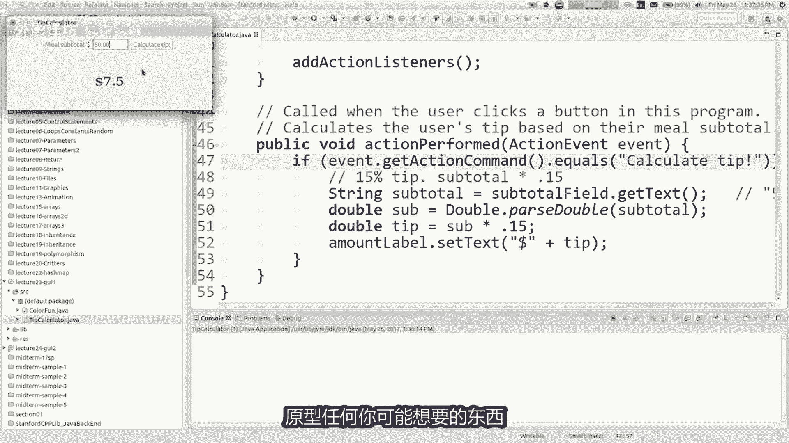

## 回顾与引言 🔄


上一节我们介绍了GUI的基础知识，并与2D图形绘制进行了区分。本节中我们来看看如何增强GUI程序的功能。

我们上次创建了一个计算餐厅小费的程序。它包含一个用于输入餐费的文本框和一个“计算小费”按钮。程序会计算并显示15%的小费金额。


现在，我想为这个程序添加新功能：让用户可以选择不同的小费百分比（例如15%、18%、20%），而不是固定使用15%。

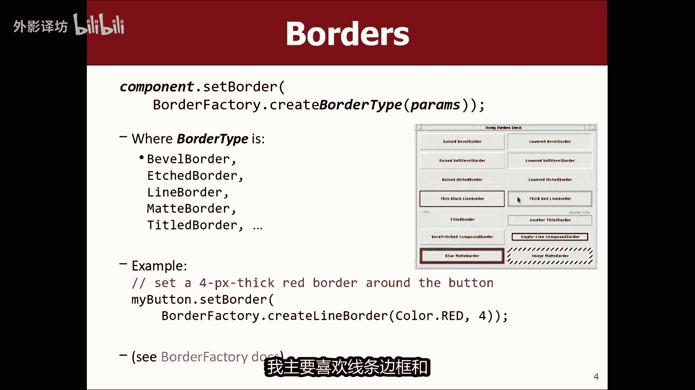

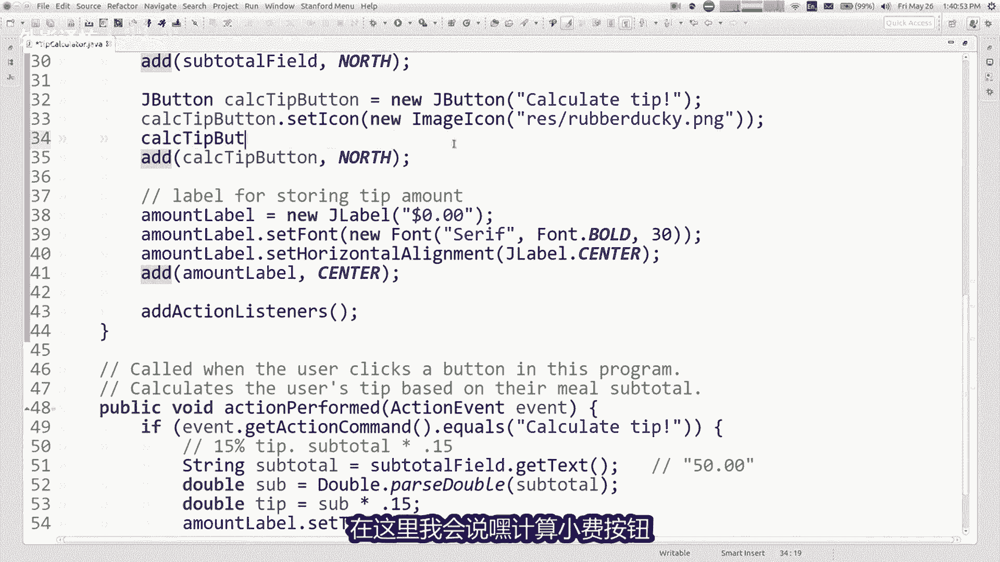

为了实现选择功能，我们通常不会使用另一个让用户自由输入百分比的文本框。更好的用户体验是提供一组固定的选项供用户选择。这引出了我们将要学习的新组件：**单选按钮**。


此外，我还会讲解如何为组件添加图标和边框，如何让文本框响应回车键事件，以及如何将GUI与图形动画混合编程。


---


## 为组件添加图标与边框 🎨


在深入新组件之前，我们先学习两个美化界面的小技巧：添加图标和边框。

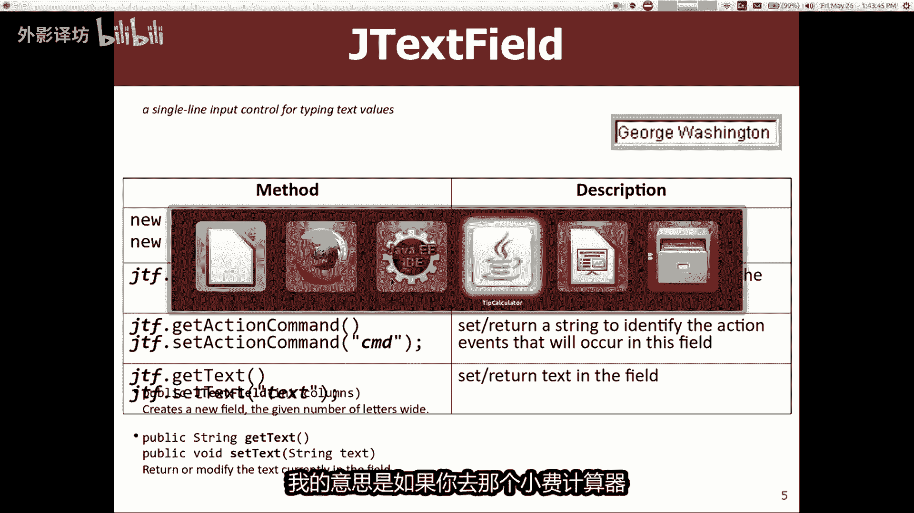

### 添加图标

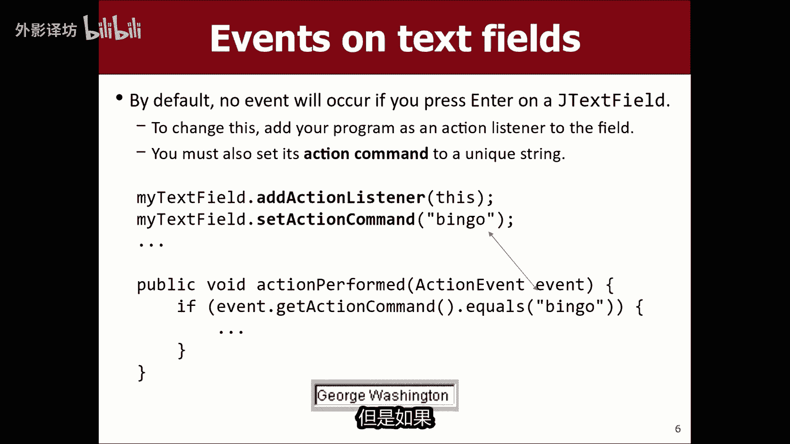

你可以为按钮或标签等组件设置图标。方法是创建一个 `ImageIcon` 对象，然后将其设置给组件。

**代码示例：为按钮设置图标**
```java
// 假设项目里有一个图片文件 "rubberduck.png"
ImageIcon icon = new ImageIcon("images/rubberduck.png");
JButton calculateButton = new JButton("Calculate Tip");
calculateButton.setIcon(icon);
```
更简洁的写法是直接将创建 `ImageIcon` 的代码放入 `setIcon` 方法中：
```java
calculateButton.setIcon(new ImageIcon("images/rubberduck.png"));
```

### 添加边框

组件都有一个 `setBorder` 方法，用于设置边框。Java通过 `BorderFactory` 类来创建各种边框。

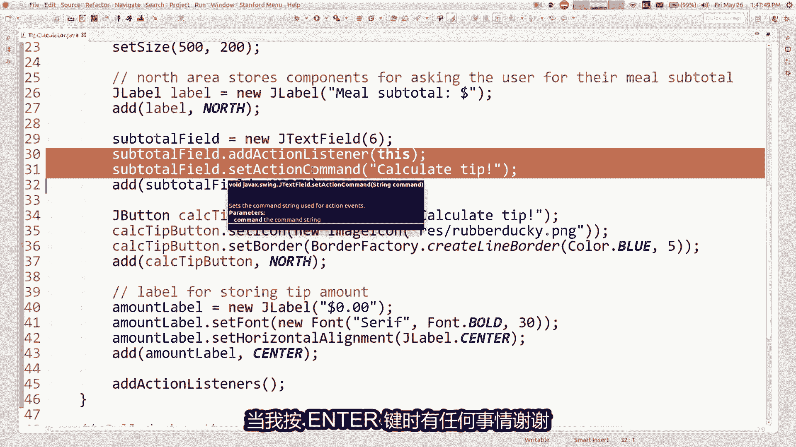


**代码示例：为按钮设置蓝色实线边框**
```java
calculateButton.setBorder(BorderFactory.createLineBorder(Color.BLUE, 5));
```
`BorderFactory.createLineBorder` 方法可以接受颜色和边框厚度（像素）作为参数。`BorderFactory` 还提供了创建其他样式边框的方法，如凸起边框、标题边框等。如果你想了解更多，可以查阅Java官方API文档。

---

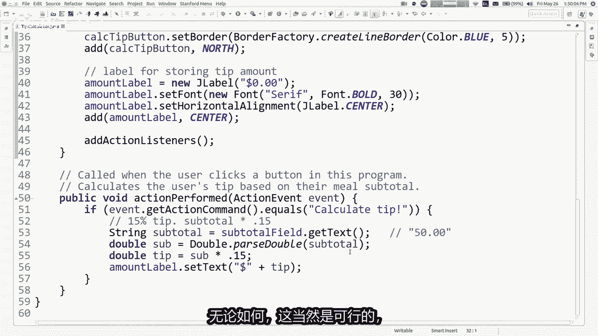

## 响应用户在文本框中的操作 ⌨️

回到我们的小费计算器。目前，用户必须点击“计算小费”按钮才能得到结果。一个更便捷的设计是：当用户在餐费文本框中输入数字后，直接按下回车键就能触发计算。


默认情况下，`JTextField` 不会响应回车键事件。我们需要手动为其添加事件监听器。

**实现步骤：**
1.  获取文本框对象（例如 `subtotalField`）。
2.  调用其 `addActionListener` 方法，并传入监听器（通常是程序本身 `this`）。
3.  为了在事件触发后能区分是按钮点击还是文本框回车，我们可以为文本框设置一个“动作命令”字符串。
4.  在 `actionPerformed` 方法中，检查事件的动作命令。如果它等于我们为文本框设置的命令或按钮的文本，则执行计算逻辑。

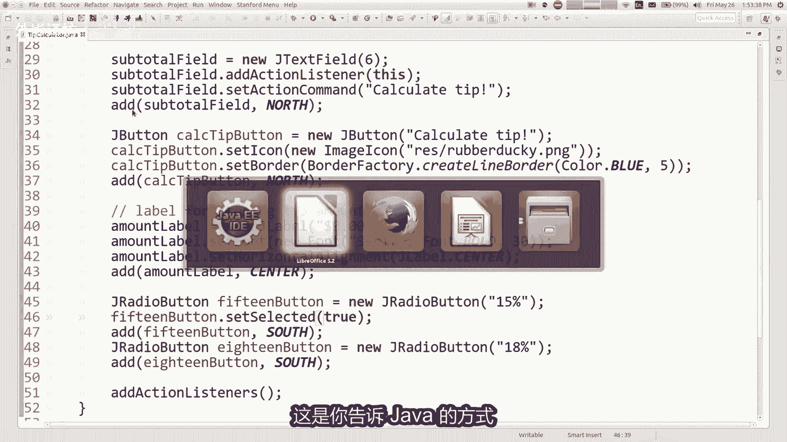

**代码示例：让文本框响应回车键**
```java
// 在初始化方法中
subtotalField.addActionListener(this); // 添加监听器
subtotalField.setActionCommand("Calculate from Field"); // 设置动作命令


// 在 actionPerformed 方法中
public void actionPerformed(ActionEvent e) {
    if (e.getActionCommand().equals("Calculate Tip") ||
        e.getActionCommand().equals("Calculate from Field")) {
        // 执行计算小费的代码
        calculateTip();
    }
}
```
这样，无论是点击按钮还是在文本框中按回车，都会调用相同的 `calculateTip()` 方法。

---

## 使用复选框与单选按钮 ☑️⚪

现在，我们来为小费计算器添加百分比选择功能。这涉及到两种新组件：复选框和单选按钮。


### 复选框 (`JCheckBox`)
*   **用途**：代表独立的“是/否”、“开/关”选项，用户可以同时选择多个或不选。
*   **类比**：就像在线订餐时选择配料（生菜、番茄、芝士），可以多选。

### 单选按钮 (`JRadioButton`)
*   **用途**：代表一组互斥的选项，用户只能从中选择一个。
*   **类比**：就像选择主菜类型（鸡肉、牛肉、素食），只能选一个。
*   **关键**：必须将互斥的单选按钮添加到一个 `ButtonGroup` 对象中，Java才会确保它们互斥。

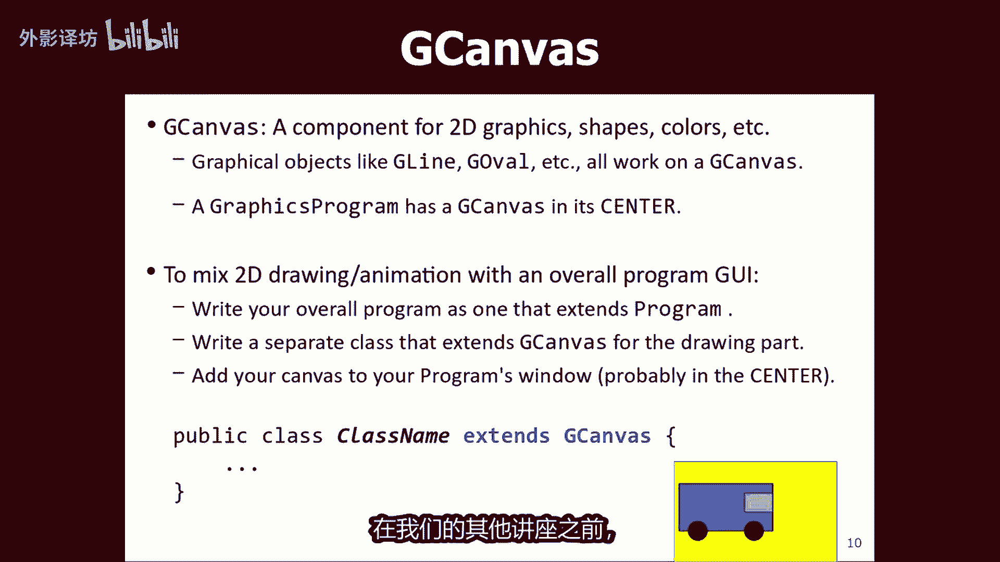

### 实现小费百分比选择
我们希望15%、18%、20%这三个选项是互斥的，所以使用单选按钮。

**代码示例：创建互斥的单选按钮组**
```java
// 1. 创建单选按钮（作为私有字段，以便在actionPerformed方法中访问）
private JRadioButton fifteenPercentButton = new JRadioButton("15%");
private JRadioButton eighteenPercentButton = new JRadioButton("18%");

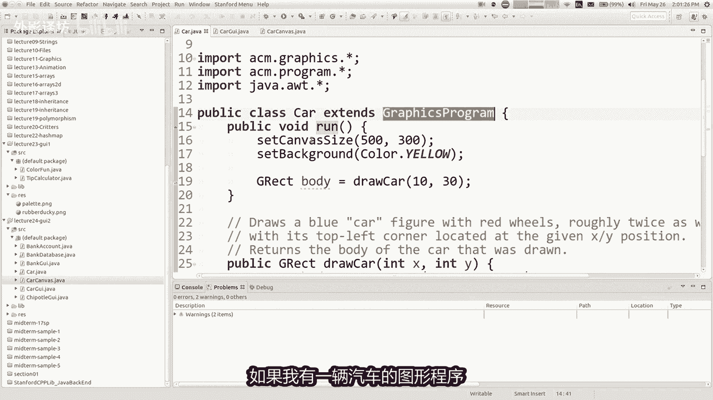


// 2. 创建按钮组并添加按钮，实现互斥
ButtonGroup tipGroup = new ButtonGroup();
tipGroup.add(fifteenPercentButton);
tipGroup.add(eighteenPercentButton);

// 3. 将按钮添加到窗口的某个区域（如南部）
add(fifteenPercentButton, SOUTH);
add(eighteenPercentButton, SOUTH);

// 4. 设置一个默认选中的按钮
fifteenPercentButton.setSelected(true);
```
现在，界面上的单选按钮可以正常工作且互斥了。接下来，我们需要在计算小费时，判断哪个按钮被选中。

**代码示例：根据选中按钮计算小费**
```java
private void calculateTip() {
    // ... 获取餐费 subtotal ...
    double tipPercent;
    if (fifteenPercentButton.isSelected()) {
        tipPercent = 0.15;
    } else { // 假设只有两个按钮，选中另一个
        tipPercent = 0.18;
    }
    double tip = subtotal * tipPercent;
    // ... 显示结果 ...
}
```
通过调用单选按钮的 `isSelected()` 方法，我们可以知道用户选择了哪个百分比。

---

## 混合GUI与图形动画 🚗

有时，我们希望在同一个程序中既包含按钮等GUI控件，又包含动态的图形和动画。例如，一个程序，左边和右边有按钮，中间有一辆可以左右移动的汽车。

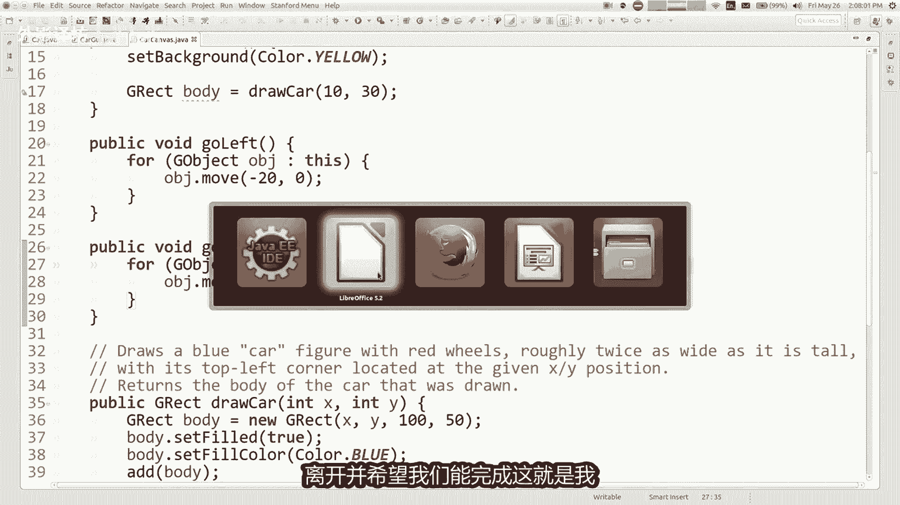

### 核心思路：使用 `GCanvas`
我们的图形库中有一个 `GCanvas` 类。它不是一个完整的程序，而是一个可以在GUI程序中嵌入的“画布”区域，专门用于绘制图形和动画。

### 实现步骤
1.  **创建主GUI程序**：像往常一样，创建一个扩展 `Program` 的类，添加按钮等控件，并设置事件监听。
2.  **创建画布类**：创建一个新的类（如 `CarCanvas`），让它扩展 `GCanvas`。在这个类的构造函数中，绘制你需要的所有图形（例如一辆汽车）。你还可以在这个类中编写控制图形移动的方法（如 `goLeft()`, `goRight()`）。
3.  **在主程序中嵌入画布**：在主GUI程序中，创建画布类的实例，并将其添加到窗口的中心区域。
4.  **连接事件与画布动作**：当按钮被点击时，在主GUI程序的 `actionPerformed` 方法中，调用画布对象的移动方法（如 `canvas.goRight()`）。

**关键点**：为了让主GUI程序能调用画布的方法，画布对象必须是一个**私有字段**，而不能只是初始化方法中的局部变量。同时，画布类中控制移动的方法必须是 `public` 的，以便其他类调用。

这种设计将图形逻辑（画布类）与用户交互逻辑（主GUI类）分离，使代码结构更清晰。


---

## 模型-视图概念 🧱

在编写图形程序时，一个重要的设计概念是**模型-视图分离**。

*   **模型**：代表程序的核心数据和业务逻辑。它不关心数据如何显示。例如，在一个银行管理程序中，模型就是管理银行账户数据的类（存储账户、查找账户、存取款计算）。
*   **视图**：代表数据的呈现方式，即用户界面。它负责从用户那里接收输入，并将模型处理后的结果显示给用户。GUI、控制台输出都可以是视图。


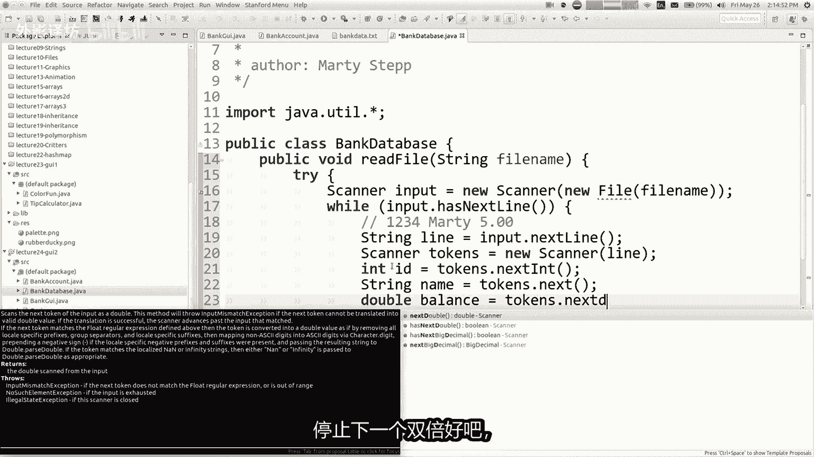

### 工作流程
1.  视图接收用户操作（点击、输入）。
2.  视图将用户意图告知模型（例如，“查找ID为1234的账户”）。
3.  模型执行核心逻辑，更新数据或返回查询结果。
4.  模型将结果返回给视图。
5.  视图更新显示，向用户反馈结果。

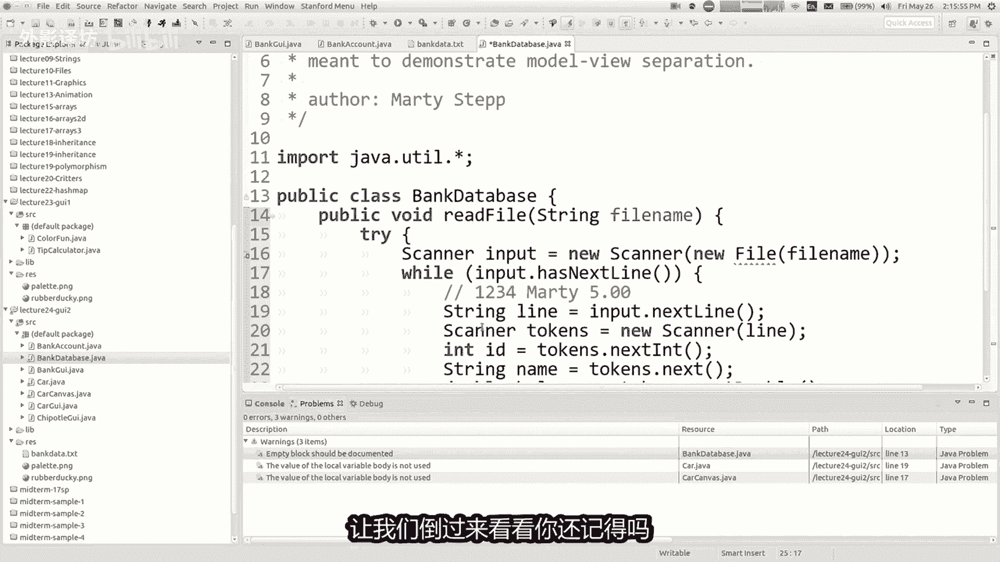


### 实践示例：银行账户GUI
假设我们要构建一个银行账户管理GUI，功能包括通过ID查找账户、存款、取款。

1.  **模型类 (`BankDatabase`)**：
    *   包含一个 `HashMap<Integer, BankAccount>` 来存储账户数据。
    *   提供 `readFromFile` 方法从文件加载账户。
    *   提供 `findAccount` 方法根据ID查找并返回账户对象。
    *   提供 `deposit`, `withdraw` 方法来修改账户余额。
2.  **视图类 (主GUI程序)**：
    *   包含文本框用于输入ID和金额，包含“查找”、“存款”、“取款”按钮，包含标签用于显示账户信息。
    *   持有一个 `BankDatabase` 模型对象的引用（作为私有字段）。
    *   在按钮的事件处理中，调用模型对象的方法（如 `database.findAccount(id)`），并根据返回结果更新界面显示。

这种分离使代码更易于维护和测试。你可以修改视图（如将GUI改为网页）而不影响模型逻辑，也可以修改模型（如更换数据存储方式）而不影响视图。

---


## 总结 📝

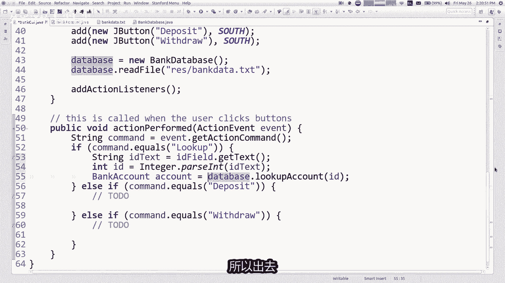

本节课中我们一起学习了：
1.  **美化组件**：如何使用 `ImageIcon` 为按钮添加图标，以及如何使用 `BorderFactory` 为组件添加边框。
2.  **增强交互**：如何通过 `addActionListener` 让 `JTextField` 响应回车键事件。
3.  **新组件**：了解了 `JCheckBox`（复选框）和 `JRadioButton`（单选按钮）的用途与区别，并掌握了使用 `ButtonGroup` 实现单选按钮互斥的方法。
4.  **混合编程**：学习了如何通过创建扩展 `GCanvas` 的类，将图形动画嵌入到GUI程序中，并通过在主程序中调用画布的方法来实现交互控制。
5.  **设计概念**：初步了解了**模型-视图分离**的设计思想，认识到将程序的数据逻辑与显示逻辑分离的重要性，并通过银行账户程序的例子看到了其基本实现方式。

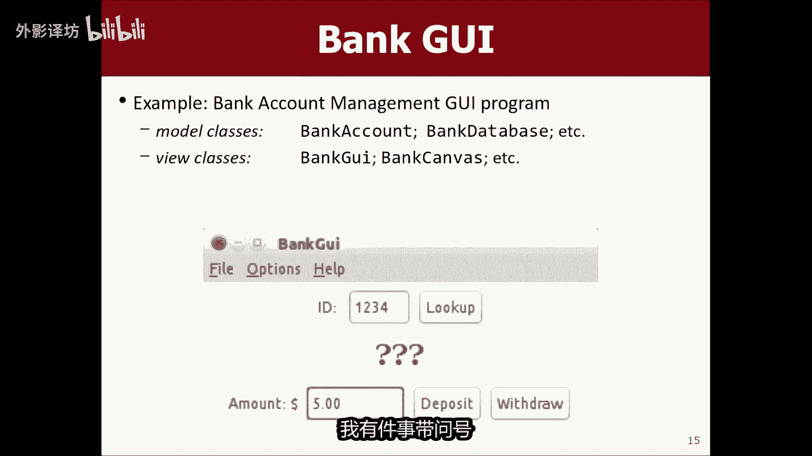


掌握这些知识后，你将能够构建出功能更丰富、交互更友好、结构更清晰的图形用户界面程序。