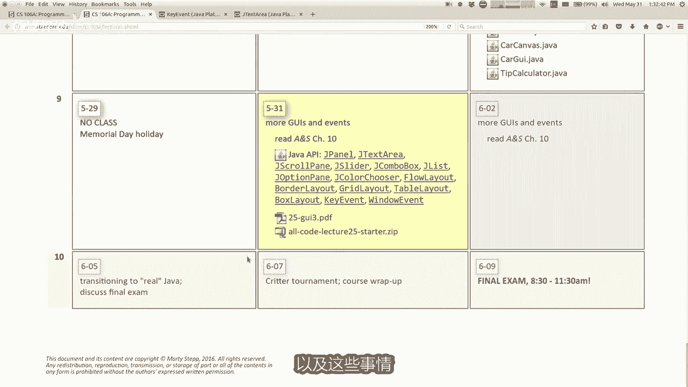
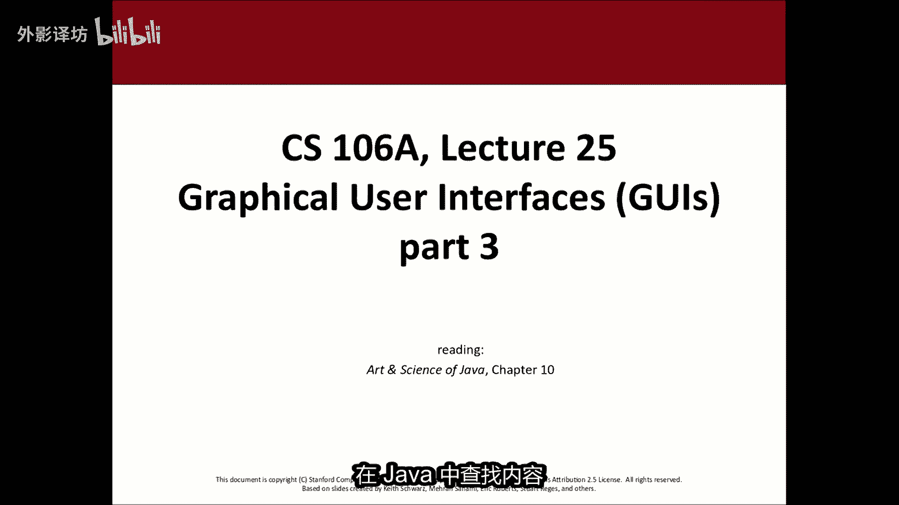
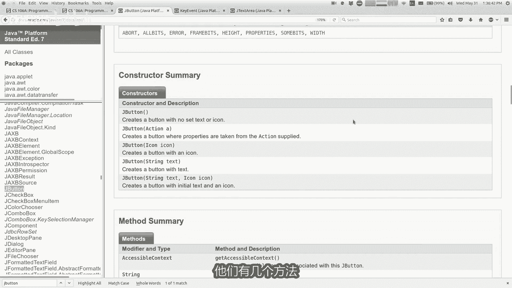
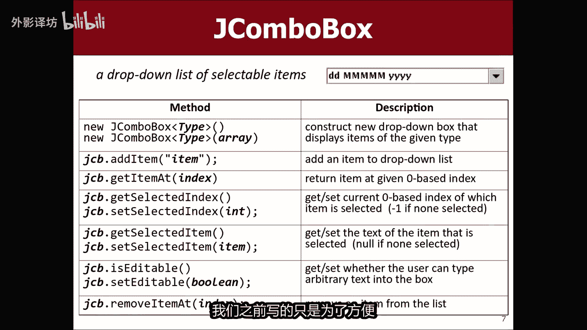
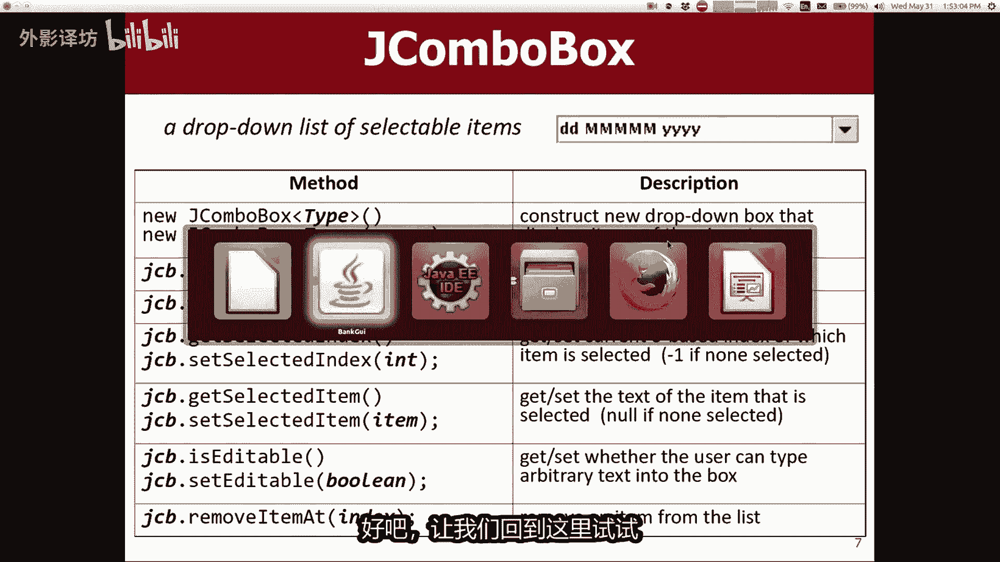
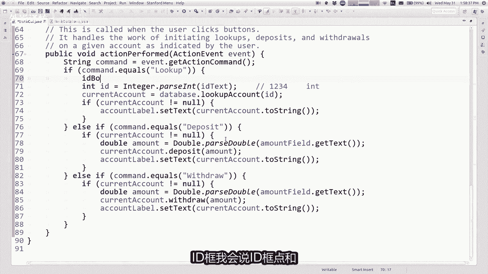
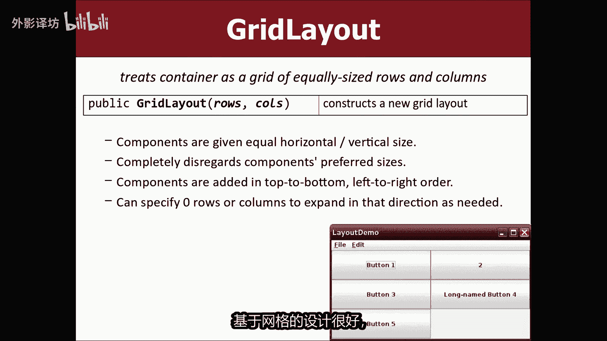
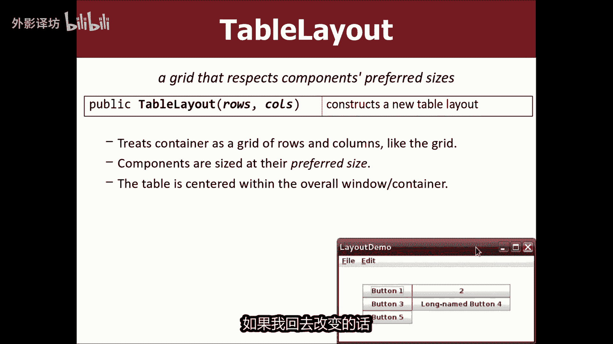
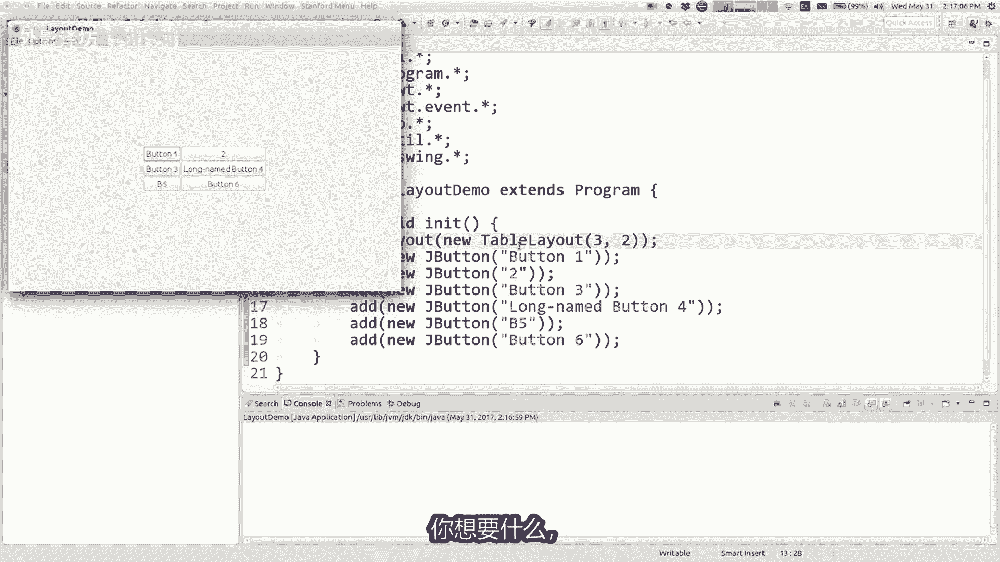

# 课程25：GUI组件与布局管理 🖥️

在本节课中，我们将学习更多关于Java图形用户界面（GUI）的知识，包括各种组件（如文本框、滑块、下拉框等）的使用，以及如何通过布局管理器来组织这些组件在窗口中的位置。我们还将探讨如何设计良好的程序结构，让数据模型与用户界面清晰分离。



---

## 公告与课程目标 📢

首先，有几个课程相关的公告。本季度已接近尾声，作业提交政策有所调整。每位同学现在拥有五个额外的“晚提交”额度，可用于追溯性地免除之前作业的迟交扣分，也可用于未来的作业（如作业六或七）。此外，作业七的截止日期也略有放宽。



期末考试安排在下周五上午，相关信息已发布在课程网站上。虽然现在无需过度担心，但建议提前查看学习材料。

今天，我们将专注于GUI编程。与往常详细讲解每个类和方法不同，本节课的目标是让大家了解有哪些组件可用、何时使用它们，以及如何设计用户界面。重点是学会如何查找和使用这些组件，而非死记硬背。



---

## 如何查找Java文档 🔍

在编写Java GUI程序时，你不需要记住所有组件和方法。关键在于知道如何查找信息。

Java提供了完整的API文档。你可以访问课程网站上的Java API文档链接。该页面列出了所有Java自带的类库，内容非常庞大。

**查找特定组件（如JButton）的方法：**
1.  在API文档页面使用 `Ctrl+F` 或 `Command+F` 进行搜索。
2.  输入“JButton”并跳转到相应条目。
3.  查看该类的构造方法、常用方法等详细信息。

**公式/代码示例：查找文档是解决问题的关键。**
```java
// 例如，如果你想知道如何改变标签的对齐方式，可以：
// 1. 在API文档中搜索JLabel。
// 2. 查找 setHorizontalAlignment 方法。
```

此外，像谷歌搜索“如何改变JLabel对齐方式”并参考Stack Overflow等社区答案，也是完全合理且高效的学习手段。

记住，我们的目标是学会如何解决问题和构建程序，而不是记忆所有细节。

---

## 常用GUI组件介绍 🧩

上一节我们介绍了如何查找组件信息，本节中我们来看看一些常用的GUI组件及其用途。

### JTextArea（文本区域）
`JTextField` 是单行文本框，而 `JTextArea` 是多行文本框，适用于输入较长文本，如邮件正文或聊天信息。

**代码示例：创建文本区域**
```java
// 创建一个20行、30列的文本区域
JTextArea textArea = new JTextArea(20, 30);
// 设置自动换行
textArea.setLineWrap(true);
// 获取用户输入的文本
String userInput = textArea.getText();
```
要为 `JTextArea` 添加滚动条，需要使用 `JScrollPane` 组件：
```java
JScrollPane scrollPane = new JScrollPane(textArea);
add(scrollPane); // 将带滚动条的面板添加到窗口
```

### JSlider（滑块）
滑块允许用户通过拖动在一个范围内选择数值。

**代码示例：创建滑块**
```java
// 创建一个范围从0到100，初始值为10的滑块
JSlider slider = new JSlider(0, 100, 10);
// 设置主刻度间隔（每10个单位一个长刻度）
slider.setMajorTickSpacing(10);
// 设置次刻度间隔（每5个单位一个短刻度）
slider.setMinorTickSpacing(5);
// 显示刻度
slider.setPaintTicks(true);
// 显示刻度标签
slider.setPaintLabels(true);
```

### JComboBox（下拉框）与 JList（列表）
`JComboBox` 是下拉列表，节省空间。`JList` 是平铺列表，同时显示多项。

**如何选择？**
*   当屏幕空间有限或选项很多时，使用 `JComboBox`。
*   当选项较少，且你希望用户能同时看到所有选项时，使用 `JList`。
*   `JList` 还支持选择多个项目。

**代码示例：创建下拉框**
```java
// 创建一个字符串类型的下拉框
JComboBox<String> comboBox = new JComboBox<>();
// 添加选项
comboBox.addItem("选项一");
comboBox.addItem("选项二");
// 获取当前选中的项目
String selected = (String) comboBox.getSelectedItem();
```



### 弹出对话框：JOptionPane
用于快速弹出提示、确认或输入对话框。

**代码示例：使用对话框**
```java
// 1. 显示消息对话框
JOptionPane.showMessageDialog(frame, "操作已完成！");




// 2. 显示确认对话框 (返回用户点击的选项，如 YES_OPTION)
int choice = JOptionPane.showConfirmDialog(frame, "确定要删除吗？");
if (choice == JOptionPane.YES_OPTION) {
    // 执行删除操作
}

// 3. 显示输入对话框
String name = JOptionPane.showInputDialog(frame, "请输入您的名字：");
```

### 其他实用对话框
*   **JColorChooser**：颜色选择器。
    ```java
    Color selectedColor = JColorChooser.showDialog(frame, "选择颜色", Color.WHITE);
    ```
*   **JFileChooser**：文件选择器。
    ```java
    JFileChooser chooser = new JFileChooser();
    int result = chooser.showOpenDialog(frame);
    if (result == JFileChooser.APPROVE_OPTION) {
        File selectedFile = chooser.getSelectedFile();
        // 处理文件
    }
    ```

---

## 实战：改进银行账户GUI程序 💳

前面我们介绍了一系列组件，现在通过一个实战例子来看看如何将它们整合到一个程序中，并思考良好的程序设计。




我们有一个之前编写的银行账户管理程序 `BankGUI`。它目前使用 `JTextField` 让用户输入账户ID来查询。现在我们想将其改为使用 `JComboBox` 下拉框，让用户直接从已有账户ID中选择。


### 初始思路：直接传递组件
一种直接的方法是修改 `BankDatabase`（数据模型）类的读文件方法，将 `JComboBox` 作为参数传入，并在读取数据时直接向其中添加ID。

**代码示例（不推荐的设计）：**
```java
// 在BankGUI中
database.readFile("bankdata.txt", idBox); // 传递下拉框组件

// 在BankDatabase的readFile方法中
public void readFile(String filename, JComboBox<Integer> box) {
    // ... 读取文件
    while (scanner.hasNextInt()) {
        int id = scanner.nextInt();
        box.addItem(id); // 直接操作GUI组件
        // ... 存储数据
    }
}
```
这种方法虽然功能上可行，但将GUI组件（视图）直接传递给了数据处理类（模型），破坏了模型与视图的分离原则。这使得 `BankDatabase` 类依赖于GUI库，难以独立测试或重用于控制台程序。

### 改进设计：模型返回数据，视图负责显示
更好的设计是让模型专注于数据管理，并提供获取数据的方法。视图则调用这些方法，并负责更新GUI组件。

**步骤：**
1.  **在模型中添加获取数据的方法**：在 `BankDatabase` 类中添加一个方法，返回所有账户ID的列表。
    ```java
    public ArrayList<Integer> getAllIds() {
        ArrayList<Integer> idList = new ArrayList<>();
        for (int id : accounts.keySet()) { // 假设数据存储在Map中
            idList.add(id);
        }
        return idList;
    }
    ```
2.  **在视图中调用并更新组件**：在 `BankGUI` 的初始化方法中，调用上述方法，并手动将ID添加到下拉框。
    ```java
    // 在BankGUI的init方法中
    ArrayList<Integer> allIds = database.getAllIds();
    for (int id : allIds) {
        idBox.addItem(id);
    }
    ```
3.  **修改事件处理**：将查找按钮的事件处理代码，从读取 `JTextField` 改为读取 `JComboBox` 的选中值。
    ```java
    // 之前：String idText = idField.getText();
    // 之后：
    int selectedId = (int) idBox.getSelectedItem();
    ```

**这种设计的好处：**
*   **清晰的责任分离**：`BankDatabase` 只处理数据，不知道也不关心GUI。
*   **可重用性高**：`BankDatabase` 类可以轻松地被其他类型的用户界面（如控制台界面）使用。
*   **易于维护**：修改GUI或数据逻辑时，影响范围更小。

---

## 布局管理 📐

当我们向窗口添加多个组件时，需要决定它们的位置和大小。Java使用**布局管理器**（Layout Manager）来自动处理这些事宜，以适应不同的窗口大小和操作系统。


### 布局管理器简介
使用 `setLayout` 方法可以为容器（如窗口、面板）设置布局策略。

**核心概念：** 布局管理器决定组件的**位置**和**尺寸**。每个组件有自己**首选的尺寸**，但布局管理器可能会拉伸或压缩它们。


### 常用布局策略
以下是几种常见的布局管理器：

1.  **FlowLayout（流式布局）**
    *   将组件从左到右排列，像段落中的文字。
    *   如果一行放不下，会自动换到下一行。
    *   组件保持其首选大小。
    ```java
    setLayout(new FlowLayout());
    ```

2.  **BorderLayout（边框布局）**
    *   将容器分为五个区域：北（NORTH）、南（SOUTH）、东（EAST）、西（WEST）、中（CENTER）。
    *   这是 `Program` 类默认的布局。
    *   边缘的组件会沿一个方向拉伸，中心的组件会填充剩余空间。
    ```java
    setLayout(new BorderLayout());
    add(new JButton("North"), BorderLayout.NORTH);
    add(new JButton("Center"), BorderLayout.CENTER);
    ```


3.  **GridLayout（网格布局）**
    *   将容器划分为固定行数和列数的网格。
    *   每个单元格大小相同，组件会被拉伸以填满单元格。
    ```java
    // 创建一个3行2列的网格布局
    setLayout(new GridLayout(3, 2));
    ```


4.  **TableLayout（表格布局 - 斯坦福库提供）**
    *   与 `GridLayout` 类似，但组件不会拉伸，保持其首选大小，外观更自然。


### 复合布局
复杂的界面通常需要组合使用多种布局。这可以通过 `JPanel`（面板）来实现。


`JPanel` 本身是一个不可见的容器，可以设置自己的布局管理器，并添加组件。然后，可以将这个 `JPanel` 作为一个整体组件添加到另一个使用不同布局的容器（如主窗口）中。



**设计思路示例：**
假设你想设计一个界面，顶部是一排按钮（流式布局），底部是状态栏（边框布局的南部），中间是主要内容区域。
1.  创建一个 `JPanel`（称为topPanel），为其设置 `FlowLayout`，并将顶部按钮添加进去。
2.  主窗口使用 `BorderLayout`。
3.  将 `topPanel` 添加到主窗口的 `BorderLayout.NORTH`。
4.  将状态栏组件添加到 `BorderLayout.SOUTH`。
5.  将主要内容组件添加到 `BorderLayout.CENTER`。

通过这种“容器嵌套”的方式，你可以构建出任意复杂的界面布局。




---



## 总结 🎯

本节课我们一起深入学习了Java GUI编程的两个核心方面：

1.  **GUI组件**：我们了解了 `JTextArea`、`JSlider`、`JComboBox`、`JList`、`JOptionPane` 等常用组件的用途和基本用法。关键在于学会在需要时通过API文档查找具体信息，而不是记忆所有细节。
2.  **程序设计与布局**：
    *   我们通过银行账户程序的案例，实践了**模型-视图分离**的良好设计原则，让数据处理逻辑与用户界面逻辑各司其职，提高代码的可维护性和可重用性。
    *   我们学习了**布局管理器**的概念，包括 `FlowLayout`、`BorderLayout`、`GridLayout` 等，并了解了如何通过 `JPanel` 组合使用它们来构建复杂的窗口布局。


记住，GUI编程是实践性很强的技能。多动手编写代码，尝试组合不同的组件和布局，并查阅官方文档，是掌握它的最佳途径。