# 【中文配音】斯坦福王牌课程 CS 106a Java教程 2017年春季课程 - P26：26_ Polymorphism and Interfaces - 外影译坊 - BV14U4geNEEq

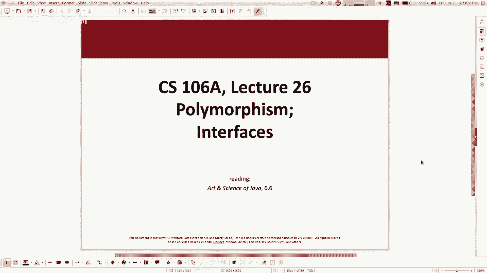

所以我们已经接近尾声了，如果你看一下这里的记录日历，今天是第九周的星期五，只剩下几节课了，然后就到了期末考试的时间，我知道你们一定会得到进入关键时刻，并获得一切，你的项目和家庭作业已经完成。

并且准备考试，诸如此类的事情，就这样而言，我们留下的你们需要得到的，希望你的作业六和七已上交，作业六现已提交，您可以正在做作业七，截止日期是星期一，尽管记住你现在可以，如果你有的话。

请在周三晚些时候提交，你想利用当天晚些时候或迟到的时间罚球，终于是周五早上了，从今天开始的一周练习，决赛和有关决赛及所有其他信息，好东西已经很难了，你可以走了，希望周末看看那里的任何材料。

都不会太令人震惊或令人惊讶，应该是我们一直在学习和研究的东西，以及其他方面的经济秩序，讲座的内容，我们要做什么，那么今天我要好好的教你，最后的官方新内容，将在最后的决赛中进行测试。

我认为的内容课程材料的适当一部分，下周我们有两场讲座，将于周一和周三进行，那些会有点特别，周一的讲座将是关于，有点像从斯坦福大学转过来的java版本，到常规工作，让我们做。

你知道我没用过这些106A中的所有库，都可以帮助我们编写我们的程序，但是你如何编写一个真正的程序，java程序没有库，我该怎么办，打包我的java程序，这样我就可以把她交给奶奶，这样他就可以运行它。

它也可以查到他宝宝的名字，不管怎样，我会也谈谈决赛周一的考试材料，这样就可以了，下次然后是最后一次星期三官方讲座，我要主持所有狼队都参加的火山口锦标赛，将战斗至死，我认为这是一个很多乐趣。

我会带来一些不是很，我最好的狼将获得丰厚的奖品，我认为你绝对应该出现，看着你一定很有趣，在这里参加，如果您的规则是太棒了，但你不笑你被取消资格了，所以有有一些理由出现似的啧，这就是我们剩下的，无论如何。

记住今天的主题是我想要真正回到继承，这是我们正在报道的内容，回到课程的小动物部分，所以你真的知道今天的讲座可能应该是，他们回来两周前就在那里，但原因是今天是一位刚刚给出日历。

我们不得不把俄格达和马州的东西放进去。

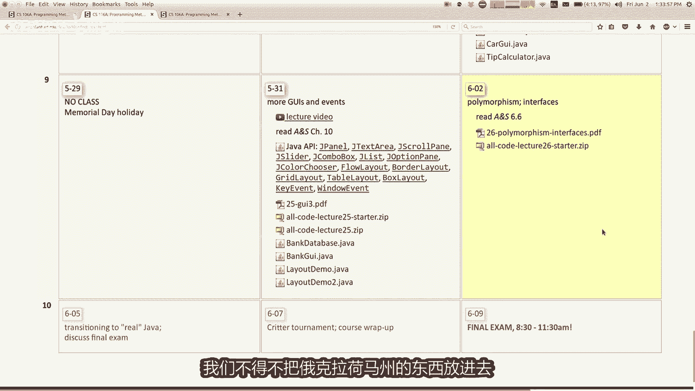

直到今天他就在这里，我想要谈论两件具体的事情，首先是它的单词多态性，另一个是接口的价值，我们开始谈论多态性，几周前，但我并没有真正做到完成和多肽是相同的时候。

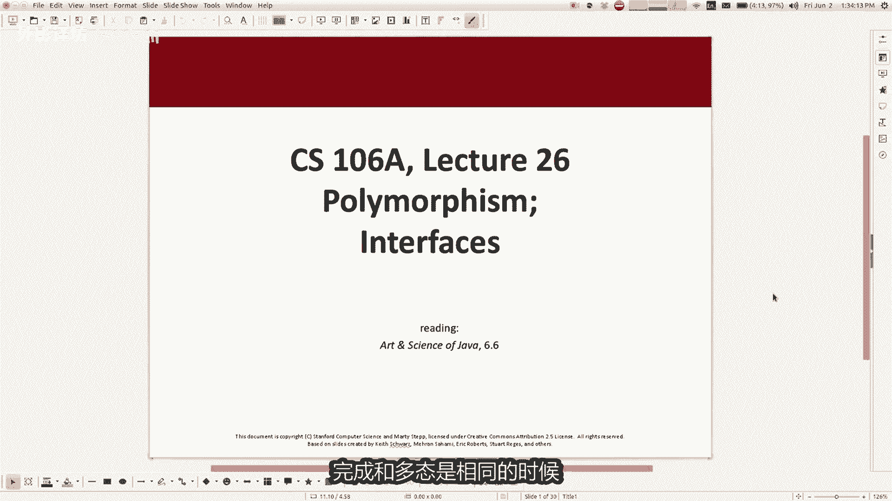

一段代码可以有不同的行为方式，当你给他不同类型的对象工作，所以一些例子，多态性是你可以致电柯克兰，你可以通过任何类型打印行的职工，作财产的价值，或您可以添加多种类型的图形，图形程序及其对象。

将绘制所有这些不同的对象，这个这个原则很重要，我想谈论这个的原因，是因为了解如何继承层次结构，将会行为方式有很多不同，正在互相交谈的班级，所以我想跳过几个滑到这里，并到达这种我想要完成的练习。

和你在一起，所以让我前进一点，有点在这里，所以这就是我想要的看看，事实上这就是为什么你应该关心，因为我喜欢问这些测试中的各种问题，所以真正的动机就是这样的东西，可能会出现在决赛中，所以我喜欢让你知道。

我喜欢如何给予你这些神秘的问题，我给你你一些代码，我请你写，我会引用代码的行为，那么类似的类型是什么，涉及继承的练习以及什么，我会做的事，我会给你几个不同的类相互扩展，他们制作了一棵继承树，你可能会说。

然后我会问你什么，当我让这些变得不同时，就会发生对象，当我称这些不同的方法，他会做什么，这就是我想了解一下，我该如何回答像这样的问题，所以我通常在这里做，你知道的这些我通常没有的神秘问题。

意味着非常具有描述性意味，我真的想让你追踪代码，所以我将使用这些类愚蠢的名字，就像食物，所以类名food还有一个方法名称method，1A消息名称，方法二和方法一要用两个流，所以如果我打印。

我们将直接打印出谁的形，现在一般的行为好了，这些方法并不是为了欺骗你，愚弄方法亦为其一，for方法打印已接种翻转，他只是为了欺骗你，使-13feel to或其他东西那样这不是重点，嗯好的。

这些是方法full类，现在我还有更多的类，有一个名为bar的类，Bar extends fo，他有一个打印bar off的方法，你当然知道，因为它延伸了食物，他也继承了所有其他的。

从食物中获取正确的方法，现在它有一个圆顶动量取代方法，从食品类右边我们有一个一种名为时尚的类，它扩展了食物的范围，低音类已提交，有一个第四类名为mumbles，可扩展不好，它也有一些代码好吧。

所以我会给你一些这样的课程，只是愚蠢的小课程，然后我会说说这段代码现在不做什么，太迷失在代码中了，基本上问的是我是否使用它们一个数组，所以代码优点较短，但不是很重要的是，我制作了一个存储AB的数组。

作为一个酒吧或GU弄和一个五循环，我将它们称为两个字符串，方法一和方法二，基本上就是这个的要点，问题是我是否调用两个字符串，方法一和方法二，在我们的贝斯上咕哝和一个副会发生什么，我只想问雷只是一个短片。

我回信的方式仅此而已，与费率无关，好吧，那么你怎么样很好的解决这个问题，我认为这里的出发点是要有一个心理，对关系的理解，这里不同班级之间，所以如果你回到我展示全部的部分，不同的阶级。

你可以给自己画一张小图，也许我会在上面画点东西，这里的白板我不喜欢在其中工作，我录制了这个视频，但你已经有了某种适合繁荣阶层的盒子，某种盒子什么都没关系，确实没有什么特别的方法，你必须把它画下来。

而不是去上课，然后你还有其他课程，就像酒吧延长食物一样，在繁荣之下，也许好吧吧好吧，还有一个你也不好的延长食物，所以也许可以，我们继续，盒子上写着第四个，说故弄眼神不好，所以就这样像妈妈一样。

你可能会说，如果你用谷歌搜索付这些名字是不是很傻，酒吧你会发现一个叫做黑客词典这些事，旧时的胡言乱语，黑客用你的名字表示不是太可怕了，所以他只是胡言乱语，无论如何，有些类似的东西。

所以正如你所记得的那样，谁扩展了繁荣好吧，现在一旦你有了你想要的，经常做我认为的图片正义陪伴你，不必画画一张照片，但如果你想要更多，您可以选择图片中的细节，写下其中包含哪些方法类。

所以也许食品类有一个方法一，它有一个方法和一个天堂串起来，让我让我们写，这与一些像树皮一样的东西有关哦，抱歉我想抱歉，没有在屏幕上，但这些是内容，今天的实务课还不错吧，我正在做酒吧类，他有一个方法。

所以我现在就写一首我的曲子啊，当然我们很聪明，我们知道继承，我们知道这个类，如果还有一个适合并提前流式传输的方法，他们来自你，我想我可以写方法一和方法二搁浅，如果我想的话，就在这里，但如果你想尝试的话。

输入这个询问方法的代码，九合串在这就在这，所以我只是用了一些方法，实际上在盒子里的那个类中好吧，那我的课很糟糕，他写了一个方法，一激进的串法对了，然后我有一个咕弄客，我在这里有办法，写得好。

所以现在当你实际上试图得到某事的答案，就像这样哦，顺便你看到我的了吗，糟糕的笑话，在幻灯片中看到我如何称呼他们时，可惜，因为就像我可怜你的食物一样，知道你这个年纪的人会做什么吗，无论如何。

我觉得这很有趣，但我不觉得关心你，是否觉得我这样做很有趣，这是给我的，如果你愿意的话，有照片这些东西只是看看代码正在做什么，代码创建一个坏的，然后他创建一个条，然后，他创造了一种咕哝。

并创造了一个食物权以及每件物品，他首先调用三个方法，我正在看的是监狱for循环题，首先更喜欢该对象，以便该列string，那么他接下来要做的就是它调用方法一，然后下次调用你没有默认方法。

所以也许实际上问题的输出更大，你可能有某种桌子过像这样的事情，所以我真的只是需要知道您是否做出差评，string输出是什么，这样你就可以查找你所做的任何特定操作，你首先去那个机翼看看该方法是否在其中类。

如果他只是去查找它，现在如果它不存在，怎么办好吧，在这种情况下，我可以找到好的袋子，他呼唤着尖叫，那就是尖叫，这是不好的，要正确思考好吧，那么接下来的事情意味，如果这都是糟糕的方法一，这也是就在那里。

低音时钟向右摆动，所以成为一条V线，回到没有法力的地方，到这里就像图片一样，如果我想弄清楚什么，我该怎么做，关于这两个人要去哪里，我该做什么，跟着你右边的图片走，所以你去上课吧，如果树更高或更大。

你就保留一直上升，直到你摆脱困境，孟菲斯你能停在黑色那吗，你说的浪漫不是吗，一直往上走，直到你最终迈出一步，没什么，所以让两个当两个不在这里，如果他在上面，如果在腹中食物上的类方法，但这很酷。

提示这样你就可以对所有的人都这样做，这些不同的方法并得到回答，第一个例子不是超级很难，但他给了你这样的想法，没有用于串绳的酒吧，所以他是来这里串串美食，朋友好吧，酒吧里的每个人，没有我想要我去吃食物。

没有人M2在那里，大概打印吧都是如此，对了，有人故弄着做什么吗，让我做那些看起来全部三个的，他们用于咕弄口袋，所以咕哝通常不会变坏，对方应自言自语，不好好吧好吧，对于方法一是的mono员到A。

防尘帽有不同的简陋至几乎正确的妈妈，只是为了简短的说是的戴方，然后是拉克兰SP在顶级的表现相当出色数，所以这只是一个人会移动，还好将会对你进行测试，我们会这么做好吧，看起来是这样。

第一个变成黑色33标记，因为你想让我妈妈做，我只是开玩笑，到目前为止还不喜欢嗯，好问题是的，哦是的，好问题，这是怎么回事，为什么，这不就像传承之谜，我为何费心谈论他作为多肽之谜。

基本上这个数组的代码是使用多态性，因为它有一个负对象数组，但事实上我巴兹商店，酒吧和食物咕哝在原等级的不同位置和，然后当我调用这些方法时，个别元素的行为我得到的是特定的子类，如果它是一系列提子。

那么他的行为是什么，这实际上意味着一系列食物或食物子类型对象，的此类对象实物，以及我储存它们的事实，因为通过数组不会以某种方式弯曲他们，所有的行为都是负行为，它保留了原来的行为，我存储在数组中的类。

这里的多态性是相同的，徐怀说，这里的国王非常取决于哪个索引而不同，我称这些事项为适用马库斯似的，谢谢你澄清，我应该说得更清楚，但是你说的对，继承就是为我们提供的车辆，这个例子中的多态性。

还可以到目前为止的另一个问题，好的，所以我谈论了这张画图，画一张我们讨论过的图画，制作一张桌子，制作一张桌子，制作一个桌子，还好很好，所以现在当然是你伙计们做的很好，我必须付出你的房间稍微硬一点对吧。

只是我不太好，我喜欢做事情，有点更具挑战性，所以这是一件新的，我要走了，向此添加一些新功能，但我向你保证，如果可以的话，解决这个问题，你可以做一个我会给你的一个测试。

所以让我们弄清楚这个我在这里做了什么，一件事，打乱了课程的顺序，所以就像我没有把超级类放在第一位一样，所以如果你真的没来过教室里，我的野餐之类的东西，但是可能不是另一件事，是有些代码有点多。

最复杂的方法是简单，就像蓝比王子的B方法是安比王子的方法，但看看这个方法，现在正在调用B方法，因此打电话给visa有一点点方法调用方法，在这里我会离开代码上升了一分钟，然后这里有一个东西。

我有一个叫做超级点，偶哦，就是这样很奇怪，所以我添加了一些新的，这里的功能不属于整体粒子还可以，但没关系，我们可以弄清楚，所以我想我们要做的第一件事，就是想做的就是画，那张小图有点像这样。

但对于其他问题好吧，我从来没有用过这些白板，但用滑板就很酷了，所以我知道我很容易被感动，好吧，我永远不会忘记，我正在服用这个我大学时的社会学科，他们有开销，而不是白板，但头顶上的滚滚东西，你知道老师。

我真的认为这个老师是个白痴，他他总是把事情搞砸吗，他拿走了这个永久性记号笔，然后他就头顶上写着，但没有里面有卷状塑料，所以它只是用一个在头顶设备上书写，永久记好笔，然后就像从来没有一样。

所以今年剩下的时间，他关于社会学的愚蠢笔记，第五周的动作就下冻结了我这么大的投影仪，无论如何一直都很低，我不知道他为什么要那样做，但我在哪里好的，但是我们可以解决这个问题，与我们解决问题的方式非常相似。

最后一个问题，我认为你想要什么，从图片开始，并按顺序画出，我认为你想要的图画从上到下，所以是什么，这张照片的顶部是他，无法扩展英格兰的那一个，正确的，这意味着这是顶部数，所以它只是盒子或手摁。

然后我们有羊肉费用帕姆，所以我，可以把羊肉放在这里吗，然后我们现在看看另一个，然后把他们和芬恩的混在一起，腿，所以我们这里有山药，UNWORSE山药，然后第四个是垃圾邮件再次延伸，这样看起来就不完全了。

垂直其中一些是猪肉，一些是他们没有什么不同，我希望能够做到这一点，他在工作台上，如果你看不太清楚，但无论如何，看起来只是我只是想写下来，不知何故，这就是这里的树，这样做的主要目的是让我可以环顾四周。

看看方法在哪里，被发现五天吧，然后我也许想要写下什么方法，锤子类有一个方法A，修改B和A已取消临级，只有一个发明了山药类，有一个，A和A字符串和垃圾邮件类别有只有一颗钻石，但这还不错。

现在就我们的实际行为而言，我们有同样的东西，他们在其中创建四个中的每一个的数组，他们循环遍历它的类型，并调用它们调用的方法，有两个字符串调用方法A，并且他们调用MEMPHISB事物的种类，事物的种类。

事物的种类，事物的种类，问题是我们遵循的大部分内容完全相同的过程，除了我得到我们应该这样做的顺序是锤子架，是的好吧，让我们我想我所做的就是说话，不谈具体方法，和他们在这里输出左翼。

我的职务觉得土地很有趣，所以让我们演练lamb方法A和方法B每秒二五，好的，那么我们该怎么做，看看我怎么知道那些会是什么，如果我想查一下那里有这里没有A，所以我向上。

直到有A这就是我串好的那个好的pm方法，给他做了两件事，给帕姆带来了一个和一个现在闪步，有他们的衣服或塑料，每个人接下来要做的就是它调用方法，好的，等一下让我连接一下，任何V领都是LAN类的。

如果你打电话给我，则采用B方法打印LAMBDB的灯已变，当前的羔羊将被筛选，高扬他没有，所以他上升到这里，他会打印火腿串，这只是让平移正确，所以我认为问题是这部分就在这里，我们正在调用方法A我们是什么。

那因为你可以直接看代码，这里是火腿，你会说好，火腿打来电话，必从这里跳下来，并呼唤他是对的，但这是棘手的问题之一，关于继承的事情，让我们来看看日食只是一秒钟，我不会去。

今天花了很多时间在eclipse上。

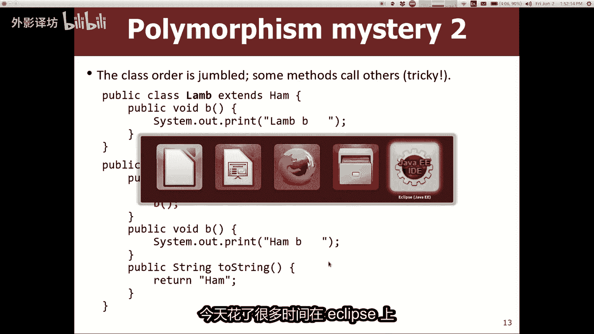

但我认为这可能有助于说明发生了什么事，好吧，让我过去，这里是这些文件，今天就是我们展示的火腿，在幻灯片上，这是一只羔羊，好吧，我想弄清楚什么是羊肉，A确实记得继承是如何工作的，当你说我延长某人的时间时。

几乎就像我得到了他们所有的副本，正确粘贴到我身上的方法，除非我重写这些方法，在这种情况下，我如果我保留自己的，请不要复制他们的版本正确，我们知道，所以让我们在这里明确的做一下，只是为了说明。

如果我延长火腿，我去火腿，我把所有这些东西都拿走，我复制它们，然后我来到这里，我把它们粘贴正确，唯一的问题是，我有我们知道的方法，B的两个副本，我扔掉了继承的一个，我用我自己的权利，这就是我所做的。

所以现在如果我问你高扬做什么，当你调用方法A时，你会做什么，你会说哦，他打印开背，然后他调用BB就是这个羔羊，所以方法输出为，这就是和高扬AI的区别，爱，我想我想说的是，如果你只是天真的看着这个代码。

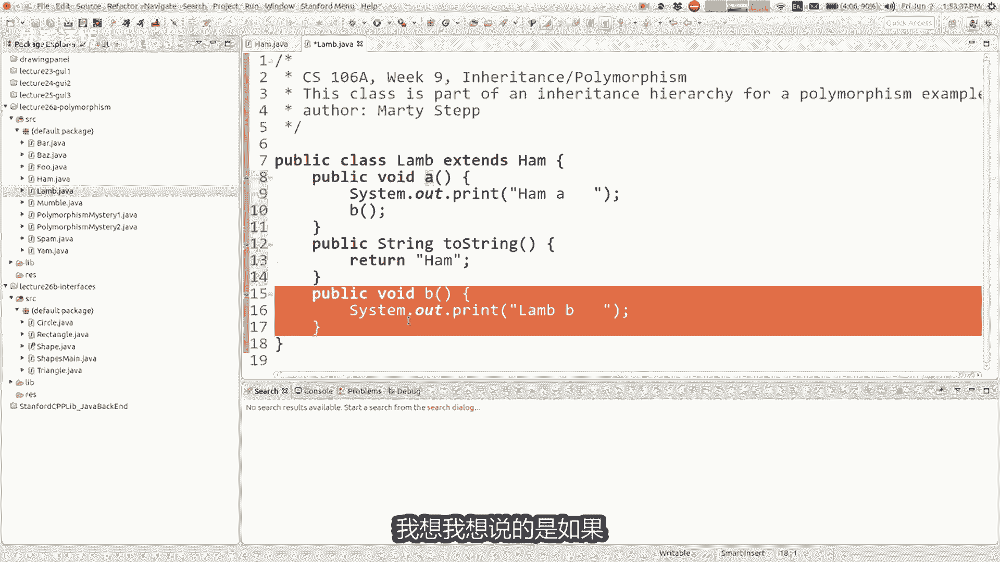

他说哦公羊是做什么的，当你打电话时，你说没有A，所以他放在这里，他去竞选火腿黑做什么，然后你就开始了，看着火腿你就可以做ob了，是真正的家人，所以你我认为诱人的错误答案是，认为他的桥可以很方便。

但它是我把灯替换成男人，你呢理解这一点，所以有点困难解释一下，但这就是代码，实际上这有意义吗，人们就是这样回来的，但他们却没有回来，知道，哦格特，所以你的问题是他是否愿意，重点是他打印的像两个。

比如这是第二件事，欲晒黑，因为土地没有他自己钓鱼，但没有担心他会打印土地，哦是的，基本上我猜我是尝试做，就像当你看到一个调用另一个方法的方法，必须记住它会调用该方法的版本，当前对象实际上会有这样的。

就像如果我实际上是一块土地，我的币就是B的土地外科医生，所以他是调局运行，所以有点混乱，但一旦你明白了，这一点又与多态性有关，一旦你明白了，就是这样，你会开始养成正确的行为习惯，当我写作时。

实际上是这样回答的，向下记得我们有几张桌子，几分钟前对于另一个例子，你可以制作这样的表格，但是当你正在填写的内容，我喜欢填写的表格式，写这样的东西，Print m8，然后它调用B我不写B的输出。

我只是写它调用B，所以当我到了这里，我就走牢好吧，然后我打电话给币，这样就可以了，打印蓝笔，这样对我有帮助，记得我把它写在正确的方式，它会变得更多，有趣的是，如果你看看山药，让我们在我走之前。

让我们保持良好的状态，你有什么问题吗，到目前为止这方面有意义吗，就像一种方法，要用另一种方法，你必须小心这种子类替换它的问题，意思是好的好吧，我们来谈谈，山药一会，那么山药丽贝卡在哪里，山药是树上的。

第三个，第三个下来让我们弄清楚是什么，这是球吗，是的，或者他首先打印YMYM，然后他把超级点称为什么，超级点日期那是什么，是他被发现的累，所以他会看看羊肉，但那里没有一只，所以他会找到一个可以这样的。

这意味着发生了，并且A将打印好吧，火腿是什么，可以打印吗，右边跟着一个，如果你调用它，它会做什么，在一口山药井上，山药里没有一个，类，所以他会在哪里查找他，你会在陆地类别中找到一个打印植物猪。

所以我是对的，所以，在宝石上跟住三，剩下三是啊，一个营地，一只羔羊，好吧好吧，慢点，如果你叫阿姨怎么办，萨姆那有什么作用，如果你正在寻找一种方法，在这里没有，所以他会向上查找，发现它就在这里。

所以他打印出的第一件事是先生，如果这东西基本上是冰的话，奶油香槟，然后打电话给超级同性恋，超级点A是汉堡模仿A克里斯和一个，然后是第三个，这就是所谓的正确吗，B对SAM发来的垃圾邮件做了什么。

嘿小鹿斑比的妈妈被枪杀了，我很难过，在大家都没关系的互联网上复合的，像我猜的最这个例子中有趣的农民是A方法，所以如果你看看这里的表，A方法最多，他们的复杂输出，都是因为他改变三者中每一个的事情。

课程稍微少一点，所以很友善，这个废话中最棘手的部分好吧，无论如何，如果你能做到这一点，你就可以有些不是决赛中的难点，如果你像我一样不懂平静，现在不用担心他们是这样的，问题出在练习决赛上。

当你做了其中一两个之后，他就会开始点击，你就会像哦好的，然后你就会变得很棒，实施保证，或者如果你不是，你应该问我一个昵称和你的部门，稍后我们会帮助您到达那里，对于这些如何进行，还有其他疑问吗。

我们的反馈，好吧，让我们来看看层压板货，山药A又说我不喜欢绿鸡蛋，我不喜欢他们，SAMM没关系，饿好吧，白色一个骗局做什么确实如此，所以让我们再次追踪它，是的，也许他做的第一件事就是打印YAMA。

所以这真是太好了抱歉，那么它被称为超级文档，超级点A是火腿版的，所以好吧，让我在我粘贴的地方做同样的技巧代码，我们谈论他是因为我认为这会帮助我们理解。

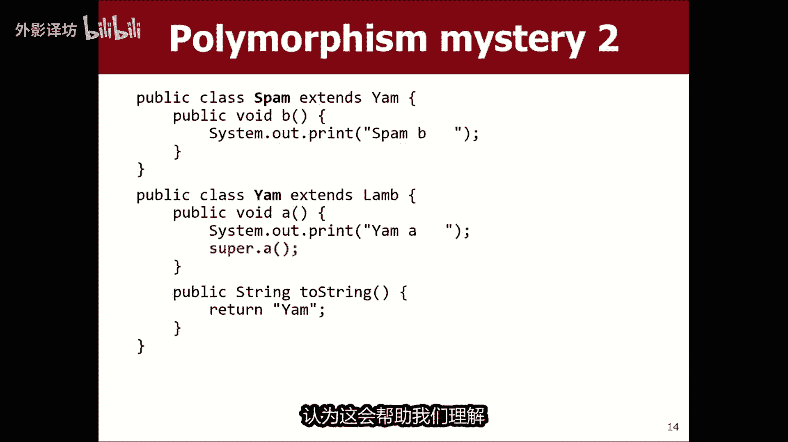

是的，我们去山药课吧，第三节课在这里，是的好吧，我有一个A，我有一个两弦，所以当我扩展时，我基本上继承了只有B方法正确，但唯一的方法我失踪了，所以这是唯一的一个，我直接收到了一个新方法。

所以如果我只是去吃羊肉并复制他的币，我把它粘贴到这里，做我的恶魔吧，这是有道理的，如果我需要弄清楚的话，现在就可以了，这是做什么的，我有一个妈妈，我有一个超级日，什么是超级日。

那么超级点一个意味着调用另一个，我被替换的A版本，堪称超经典版的soul，我该如何将其融入其中，就像这个心理模型的图片一样，我写在这里，我会去火腿和我抓住它，我会过来，在这里我将其粘贴并调用它。

像super a这样的东西，然后我就干了超级好，所以这几乎就像我一样，现在有一个名为超级模糊的方法存在，所以现在如果我想弄清楚A打印EMA，然后它调用什么，this跳转到此处。

打印ham a然后调用B跳转到这里打印羊肉，牛肉是这样做的，这就是为什么我现在得到这个输出，最后一个只是为了完成它，垃圾邮件人和垃圾邮件有弊权利。

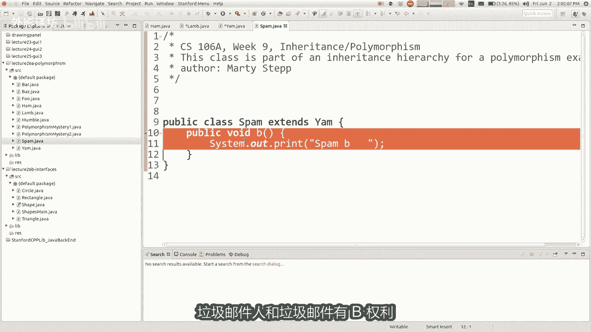

所以我想我可以来这里吃山药，我可以再次复制这一切，我可以像这样将其粘贴到垃圾邮件中。

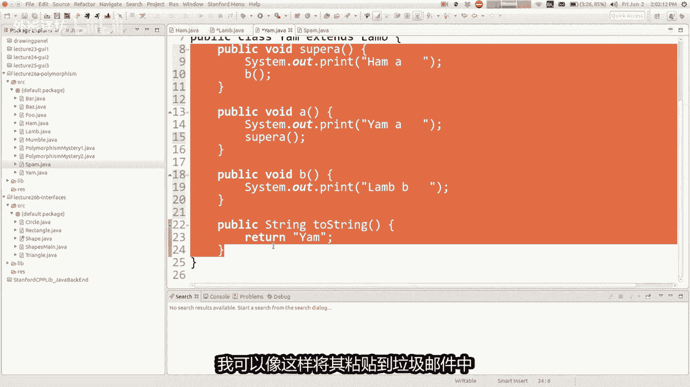

除了我有自己的B，我替换了高扬，所以我把这个贴在那个上面，现在如果我问A是什么意思，方法他会给你带来，然后它会跳跃到super打印HAI，然后它跳转到B打印垃圾邮件，因为这是我的google版本。

另一个问题，好的好的是的，所以嗯，好吧，当我粘贴这些方法时，这里并不是真正的java美丽的工作，真正做的事更像是我们看时所做的，这张照片上写着你想打电话A在我身上，我没看到他在哪里，我上去直到找到他们。

每当我发现我运行该版本时，据了解，如果被称为我必须调用他们的任何其他方法，从这里开始，所以这样我真的在做，但是如果你曾经保持超级超级，总是意味着去该方法之前的先前版本，该床的当前版本，所以如果我在这里。

我拉了一个，就是这个，如果我在这里或其他任何地方，我打电话超级点A他将寻找上面一个，所以前一个A之前那个A就是那个A，所以我想像我剪切粘贴的那个，我一直在做一个地方，这有点误导。

就想如果你说好山药有这个，然后他叫超级A，但是如果这个人叫super a，那不是会跑吗，这基本上就是你问的刺激，就像我实际上并没有复制这个经理，这里只是一群失业者，从这里找到这个方法，所以不有两种方法。

如果这个可以找到这个，所以画画是我唯一的犹豫，关于患者的切割式，如果你粘贴了相同的方法在堆栈中，这可能意味着有是他的多个副本，每个副本都调用其他，那不是真的，不管怎样，有点令人困惑。

但我是我想大部分时间只是想粘贴，可以帮助人们看到到底发生了什么事，太好了，我为什么这么做，好吧，这些都是我的技巧，如果我如果你能做到这一点，你就能做到，接下来我会实际问你的，星期五是我的观点。

其他的都可以，关于他们解决这些问题的问题，问题或如何再次做，如果你调用超级点撤销一些，如果你打电话给超级A这个东西就在那里，超类中的A必须是公共事的一些规则，公共和私人是一种复杂。

但项目确实意味着只有你安静，他甚至不是你的孩子，连你自己都不能回来，你可以看到他可能有点奇怪，我可以在这里开个关于不显示的笑话，你的私处给你的孩子什么的，就像那样，我不这样做，但也许我不这样做。

已经做了，但是是的，这是一种方法，超一流的私人工作，你不会允许调用它，我不会考验你，我会拥有一切这些公共方法，试图打电话给对方，我不会给你循环索引错误或非法的东西。

这并不是我想测试任何其他关于这件事的问题，是的，如果我在的话，基本上你就回来了，我说超级医生他会消失查找，直到找到另一个if柠檬水，从那往上看，如果它会上涨，我根本不想去，如果没有钉子，就按需要。

根本不，他们不会，所以我不会给你一个不会编译，或者至少如果我给你一些无法编译的东西，我搞砸了，我不是故意的，你还是晚安吧，有什么问题，我只是想其中一些准备有效问题的练习，就像我们为什么相信有什么意义。

我认为这是一种胡言乱语，我所在的地方是蜡，上蜡之类的东西，制作小指栅栏，但我真的教你如何空手道砍货，不管这里发生了什么，你永远不会写出愚蠢的东西，像这样的代码，但你会写相互扩展并调用的类彼此的方法。

你应该了解当你这样做时会发生什么，所以我可能可以选择更多现实的，引人入胜的例子，但我只是希望你专注于机械原理，并且这些机制是你无论如何，确实会在你的程序中使用，无论我想再教你什么。

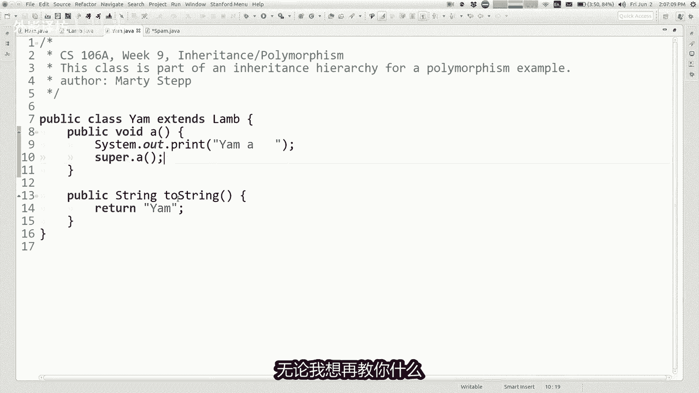

我认为我们应该有时间的事情，因为在我们剩下的讲座中，我想要谈论一些叫做并让我跳到最后我会说话，关于一个叫做接口的东西，看过一点，但我还没有向你解释，所以我想要稍微填补一下这个空白。

我想用一个例子来激励这个部分讲座，假设你正在写作，你曾经做过不同类型的代码形状，您可能正在考虑og rage和看哪里知道，但也许是为了图形，但你可能没有这样做，您只想存储的图形，由于某种原因。

你正在做的一些形状，某种几何形状，所以你有圆形和三角形等类，肯定感觉像你的举行，应该使用继承权，因为他们都是形状的，所以你也许有就像形状客，或者也许你有举行，这就是他们的地方继承彼此，感觉就像公民。

当你继承类型的事情时，有类别和此类别，但你想的越多，你意识到这些课程是相关的，他们肯定是相关的，但是他们并没有太多你需要的代码，想要在代码共享之间共享，当你有两节课时，很好。

想要在同样的地方做同样的事情，我们都有办法让你知道，计算您的X与Y坐标条或类似的东西，但想象您在工作表上执行的操作，就像计算形状的面积一样，计算形状周围的周长，你计算的方式圆与方式超级不同。

你计算出一个正方形或矩形，也不同于你会这样做的方式，三角形，那么为什么我们要使用继承，再次没有我想要的代码，不想让你的三角代码出现在我的矩形代码，或任何正确的代码，这是一个有趣的情况。

我们由于每个相关的类其它，但它们真的不想互相分享任何代码，我该怎么办，在这种情况下，你使用称为一个接口和一个接口，它是这样的，就像一个没有编码的超类，并且而不是编写您的方法，此类将继承，而不是继承。

你声明了你只注销的方法，标题和名称以及方法的参数，而不是这些方法被继承到你的孩子们，你要求你的儿童权利，这些方法，而不是就像捐赠代码一样，就像对代码的需求有点像一种奇怪的方式，它有点相反继承。

所以如果你有界面，你可以说，我要求我的子类有这个方法和这个方法，在那个方法中，你为什么想要要做好这件事，有点像认证或类似的东西，如果你想称自己为律师，能够做这个这个那个并且必须有这些凭证。

熟练等界面就下认证，以及你可以说我保证我是一个形状，我是一个圆圈类，我保证我是一个形状，这意味着我保证我有一个周界法，答应我有一个面积方法和等等，你好吗，你好吗，这好吧，你写的一些东西。

你说你自己制作公共接口java文件，所以一个例子是我制作它称为形状的界面，我声明我写出方法的名称，例如public双倍面积或公共双倍总数周边，这些是方法，但相反写出括号并运行实现这些方法的代码。

我只是把他们留空，然后我把分号代替那些被称为抽象方法，和我正在做的事情，我是说如果你是一个形状，你必须同时拥有这两种方法，而我没有会说他们是如何实施的，这里是因为社会如何实施，这与举行不同补充了等等。

但是他是如果你这样做，你必须有办法做到这一点，你说我正在创造这个的起点名为shake的界面，再次是其目的是作为现在这些其他类的超类，我有那个界面，我可以访问所有内容，课程和我在实施中写道背面界面。

以及我所想的实现我所说的，我的承诺，我是举行班，我保证我将编写所有这些方法，在该界面中列出，我保证我想要那些你见过的方法，这在我们的一些之前，实践入门代码的危险和东西等等，那是因为。

我认为刽子手可能是我第一次把它放进你的，即使代码，我认为刽子手说，他像一个人或什么东西一样实现，就像那样，我这样做的原因是我想确保你有一定的，我期待你拥有的方法等等。

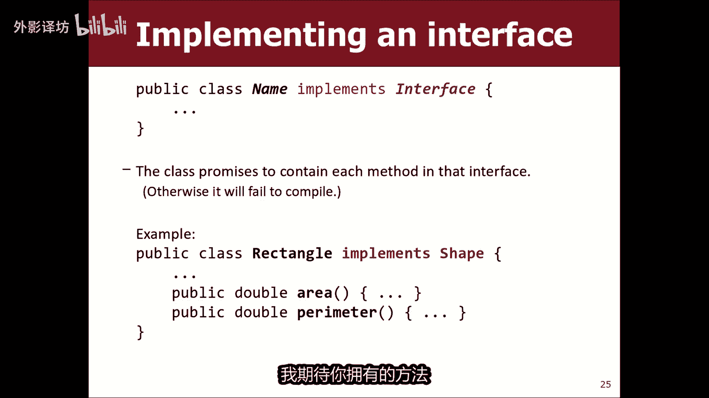

让我给你看一个简单的例子，在这里我有这些情报，我的项目中允许我关闭的文件，所有这些都形成圆形矩形，好的看看这些课程圈矩形三角形我有，界面形状还可以，现在你可以做什么，一旦你写完就可以走了，到不同的班级。

你可以说嘿我是一个圆圈，我实现现在的形状界面意味着一次，我说这意味着我保证我有一个返回A的area方法，双倍，我保证我有一个返回双精度数的周界方法，如果我不这样做。

如果这被称为margin方法或者其他什么，然后我的类现在会出现编译器错误，K你的类型圈必须实施一块区域店，意为他答应过你无法编译，所以我会把它放回去，将我的名字输出删除回区域好吗。

所以如果我把它给这三个人类圆形和矩形，以及，三角形，或任何我必须编码的东西及作用的具体代码，不管谁在乎三角形计算面积如何，矩形计算面积及其宽度乘以高度，圆如何计算它的面积，pi r平方。

无论什么细节并不重要，但是好的，这就是基本原理，设置界面以及如何实现一个你可能的接口，想知道或询问，就像什么一样，这样做的好处是为什么我的代码现在更好了，我能得到什么，这么说，所以我想你也有。

当你以正确的方式理解他时，使用继承，然后你说扩展好处是对象对象免费代码，如果我说只要一延伸小动物就延伸，我要扩展的那个人有继承，我获得代码的所有权利免费，所以我认为这很容易让你们看到，这很有用。

当我认为实现形状时就对了，我没有免费获得任何代码，我没有得到任何东西，事实上更像是现在我受到了限制，我有实事后要遵循一些规则，我必须兑现承诺的方法，我刚刚做了，所以不太明显，什么好处就在这里。

答案就在那里，确实对人没有任何好处，谁在写圆圈类，但是这不是这样做的好处，受益者就是受益者，可能会使用客户的圆圈类，如果我有一个叫做这个类的东西，就像形状，主要这只是一些，我想在其中使用一些控制台程序。

在那里塑造群体，我跑步方法你可以创建像圆圈C这样的变量，等于一个心圆半径为任意五个矩形，R等于new，大小为C的矩形表示37或无论什么计划，你都可以使用所有这些类，我们可以在我们之前做到这一点。

不需要形状界面来做，但是如果我有一大堆怎么办，形状我想把它们全部放在屏幕，我想存储所有这些想要全部使用，我该如何放置全部他们在一起，现在好了，有了一个形状界面。

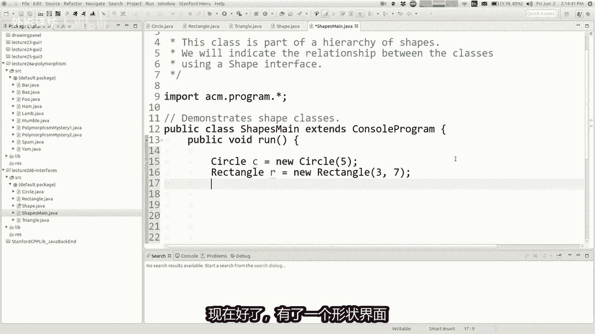

现在这些类都实现了，我们可以将其视为该接口，有一个名为shape的公共超类，那么如何在代码中使用它。

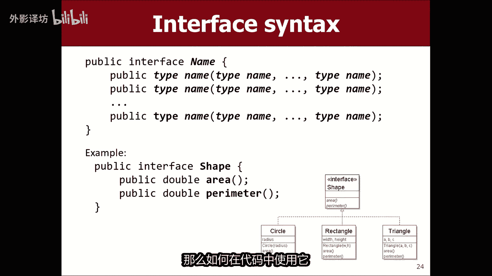

正如你可以说的那样，形状支架括号，我的形状等于新形状，我的形状零中大小为二的数组是圆圈，C和我的形状，一个是矩形二，所以现在你可以把这些人放在一起对待，可以把圆圈VIN放进去。

我们就在同一数组中的所有目录或r release，或哈希映射或其他，因为他们有一个共同的超类，这实际上是一个非常有用的能够做的事情，或者我可以做的事情，像公共空间这样的东西可以做我的事情。

可以要求一个类型为sheet的参数，以及如何允许我调用该方法，我可以通过做事，我可以通过圈费，或者我可以通过矩形二或任何其他类，实现了我的形状接口，允许将其作为参数传递，dis方法。

他将接受任何事件作为参数，所以这非常有用，像这样把所有这些人放在一起好吧，如果我在这里使用这个形状，我说布里克林地区是加号点，他知道他有一个面积方法，因为无论他们包装什么参数，承诺它实现形状接口。

所以它知道它有那个方法，所以我可以说S点面积，我可以说打印line周长加S，点周长正确，然后我认为这里的要点是，如果我运行它，它会，来吧，他会打印出那是什么，做的很好哦，对不起，让我让我做。

我很快就会做一件事，原则是IM加S，然后我会做一个空白打印里之后，所以我只需打印S和的两个字符串，面积法和周长法，我得到了什么，我得到了，我是一个圆圈半径无我的区域，就是我的，周长是我是一个矩形。

这个宽度和高度是我的区，周长就是这么愚蠢，如果你是的话，东西又变成了幻影之地，有点可笑，但基本上就是这样，这段代码是什么，稍微少一点，荒谬的是，你可能想要一个数组，你可能想要打印的形状。

有关你可能的形状的信息，想要调用屏幕和一些方法，第一个和第二个方法，每一种不同的形状和这里的多态性，是当我调用区域，还将使用区域方法，我神智通过了那种形状，尽管类型的参数塑造了它将使用矩形面积方法。

比例三角区麦克白多态性只是为了带来这一切，都回到了共同点主题，欧好吧，所有这些例子多态性的业务特征，一段代码可以做某事，取决于什么类型对象正在与我交互，与圆形物体交互，计算面积由pi r组成。

我正在与矩形交互的东西，对象计算一个区域，包括长度乘以宽度，所以之间的联系，继承和接口是继承给了你两件事，使您可以在之间共享代码类，他给你多态性，因为他们有一个共同点，就是超级类型。

你可以参考所有这些通过代码共享多态性，继承接口，没有代码，与多态性共享，我不这样做，想分享我的代码，但我想成为能够将这些视为相关的彼此，就是这些所在，好吧，我认为学生有更多对有用性的怀疑接口。

但我想说的是，稍后接口会更有用，你正在编写更大的系统，说服学生比较困难，欣赏他们，因为既成事如此明显。

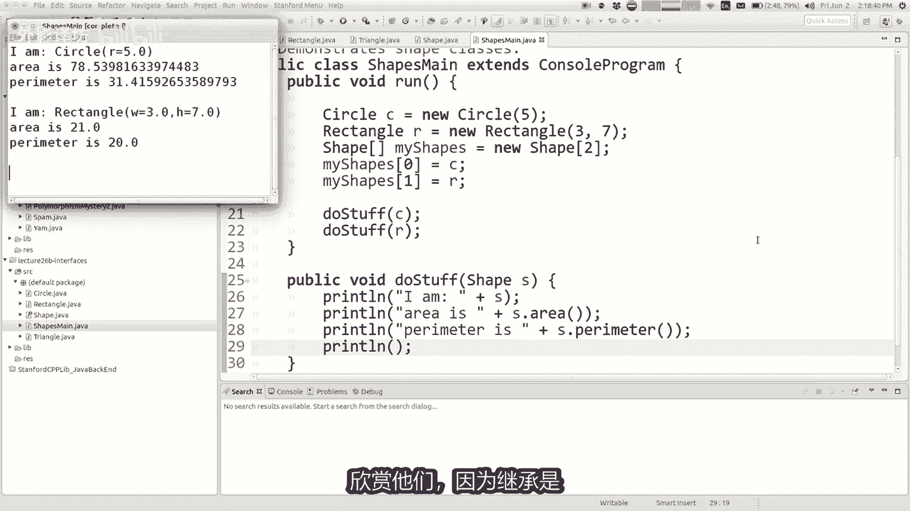

以至于您想要分享像这样的代码，我要做的最后一件事，在我们一周结束之前告诉你，我是想谈谈一个想法，内部有常亮的接口，事实上，如果你看一下启动器名称，冲浪者分配的代码，有一个试验叫冲浪或常量java。

它是一个接口，如果你打开它唯一的东西，里面有一堆公共静态最终变量，所以基本上它是你使用界面的技巧，在其中存储一堆常量寻找，然后你能做的事，如果你实现那个接口，基本上带来了所有这些常数到您的代码中。

以便您可以参考，对他们来说，这是一顶帽子，意为通常接口是关于你的方法承诺写，但在这种情况下，什么你要做的就是编写一个接口，没有任何方法可以不做任何事情就实现它，一旦你实施了所有其中的常量。

有点像吸收到你的文件中，所以我只是说该接口不会给你任何代码分享，他们确实会给你带来常数，但是他们没有给你方法，所以就是有点奇怪，但人们使用用于获取常量的接口，我们在他们的程序中这样做。

给你们的家庭作业七起始代码好吧，我还没到时候，现在就是了，周五我们的讲座就结束了，请周末愉快。

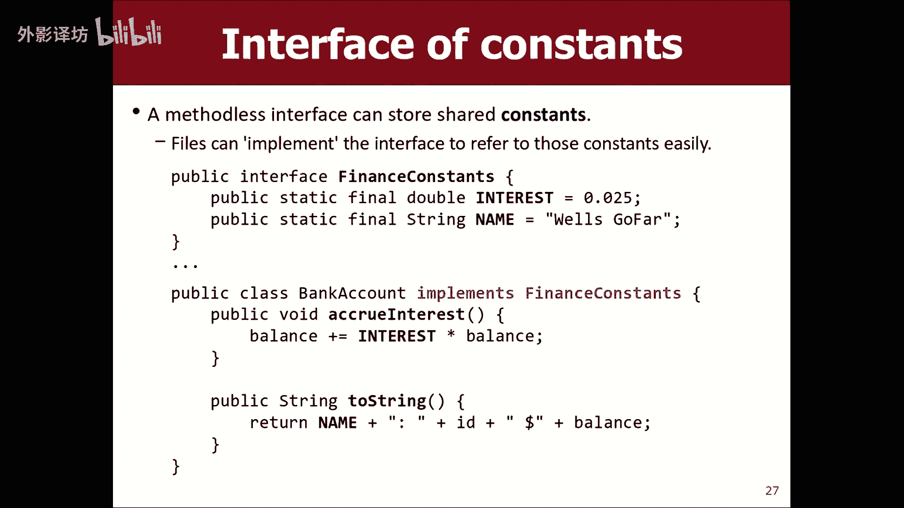