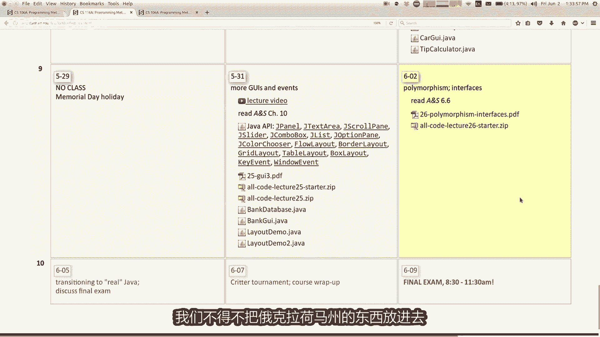
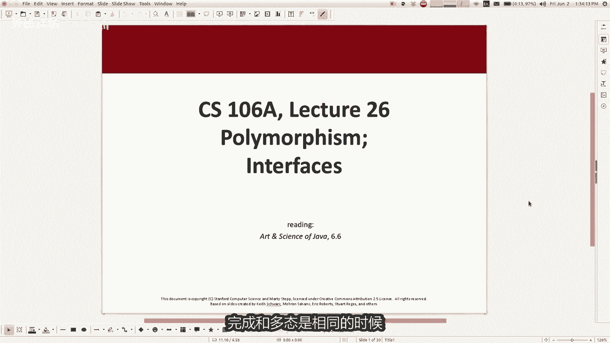
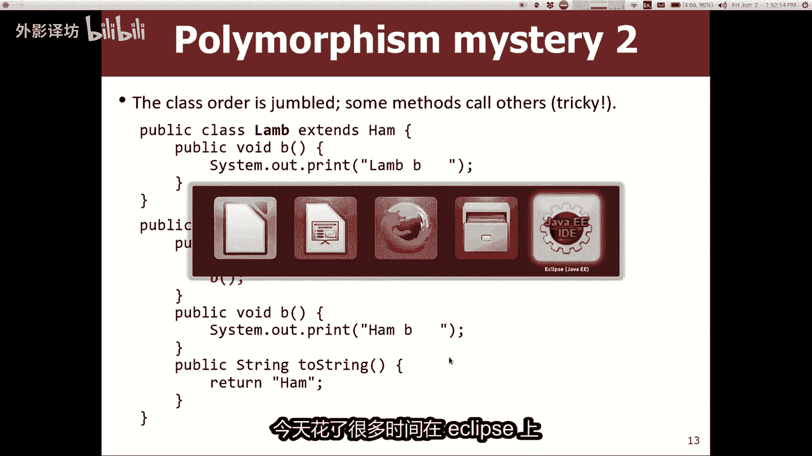
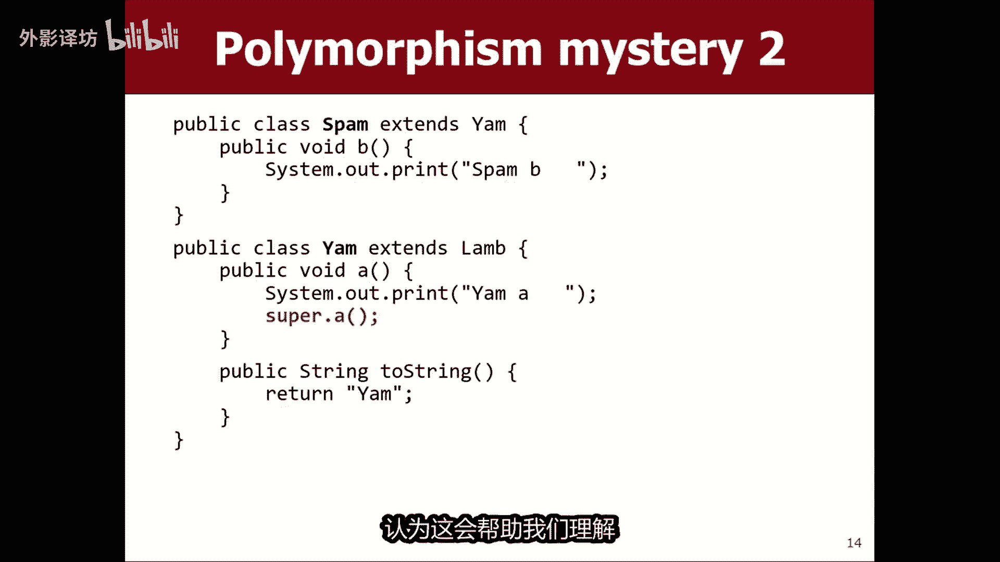
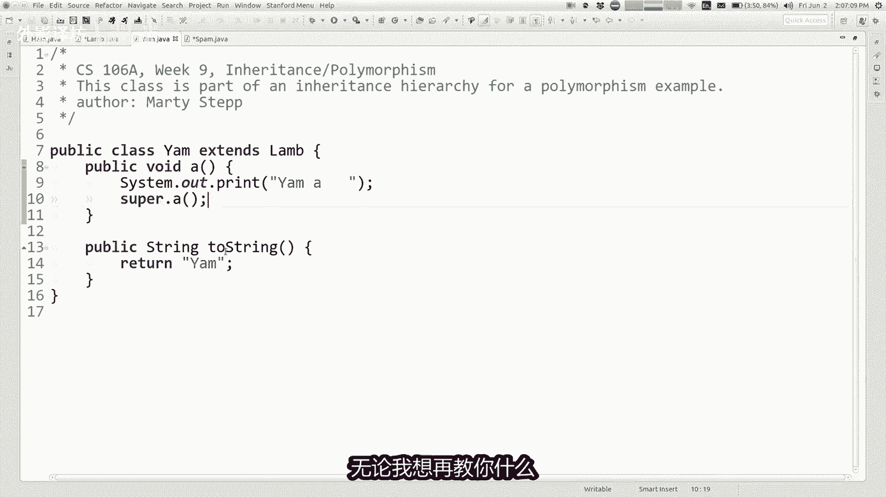
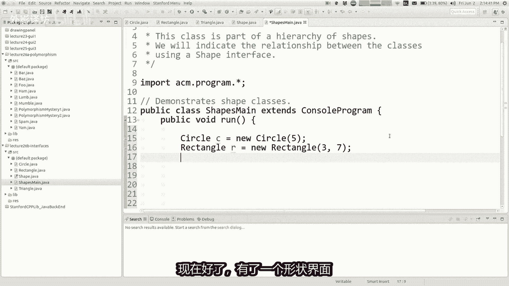
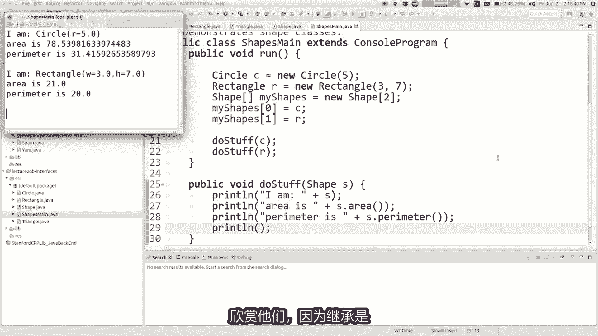

# 课程26：多态性与接口 🧬

在本节课中，我们将学习面向对象编程中两个核心且强大的概念：**多态性**和**接口**。我们将通过具体的代码示例来理解它们如何工作，以及它们如何使我们的程序更加灵活和可扩展。

---

## 概述



我们已经接近课程尾声。今天是第九周的星期五，只剩下几节课和期末考试。希望大家已经完成了作业六，并且正在处理作业七。今天，我们将讲解课程材料中最后一部分新的、将在期末考试中测试的官方内容。下周的讲座将有所不同，周一会讨论从斯坦福Java库过渡到实际工作环境，周三则会举办一个有趣的“火山口锦标赛”活动。



今天的主题将回到**继承**，并深入探讨两个具体概念：**多态性**和**接口**的价值。

---

## 多态性回顾

上一节我们介绍了继承的基本概念。本节中，我们来看看**多态性**。简单来说，多态性是指**一段代码可以根据所处理对象类型的不同，而表现出不同的行为**。

例如：
*   你可以调用 `println` 来打印任何类型的对象，它会自动调用该对象的 `toString` 方法。
*   在图形程序中，你可以向窗口添加多种类型的图形对象（如圆形、矩形），它们都会以自己的方式被绘制出来。

理解继承层次结构中的类如何交互，对于掌握多态性至关重要。

### 多态性练习

为了理解多态性在继承中如何运作，我们通过一个练习来探讨。这类问题在考试中很常见：给你一组相互继承的类，然后询问当调用某些方法时，代码的具体行为是什么。

以下是练习中使用的类：

```java
class Food {
    public void method1() {
        System.out.println("Food 1");
    }
    public void method2() {
        System.out.println("Food 2");
    }
}

class Bar extends Food {
    public void method2() {
        System.out.println("Bar 2");
    }
}

class Baz extends Food {
    public void method1() {
        System.out.println("Baz 1");
    }
    public String toString() {
        return "Baz";
    }
}

class Mumble extends Baz {
    public void method2() {
        System.out.println("Mumble 2");
    }
}
```

现在，考虑以下测试代码：

```java
Food[] foods = {new Food(), new Bar(), new Baz(), new Mumble()};
for (Food item : foods) {
    System.out.println(item);
    item.method1();
    item.method2();
}
```

**问题**：这段代码的输出是什么？

**解决方法**：
要解决此类问题，可以遵循以下步骤：

1.  **画出继承关系图**：理清类之间的层次结构。
    ```
        Food
       /    \
     Bar    Baz
              \
             Mumble
    ```
2.  **列出每个类拥有的方法**：包括自己定义的和继承来的。
    *   `Food`: `method1`, `method2`
    *   `Bar`: 继承 `method1`, 重写 `method2`
    *   `Baz`: 重写 `method1`, 继承 `method2`, 重写 `toString`
    *   `Mumble`: 继承 `method1` (来自 `Baz`)， 重写 `method2`， 继承 `toString` (来自 `Baz`)
3.  **动态查找方法**：当调用 `item.methodX()` 时，Java 虚拟机会从对象的**实际类型**开始查找该方法。如果当前类没有定义，则沿着继承链向上查找，直到找到为止。
    *   对于 `new Bar()` 调用 `method2`：在 `Bar` 类中找到，输出 “Bar 2”。
    *   对于 `new Mumble()` 调用 `method1`：在 `Mumble` 中未找到，向上到 `Baz` 中找到，输出 “Baz 1”。

这个例子中的多态性体现在：数组 `foods` 的声明类型是 `Food[]`，但它可以存放任何 `Food` 的子类对象。当循环中调用方法时，执行的是对象**实际类型**（如 `Bar`, `Baz`, `Mumble`）中定义的方法，而不是数组声明的 `Food` 类型中的方法。这就是“一段代码，多种行为”的体现。

---

## 深入多态性：`super` 关键字与链式调用

理解了基础的多态性后，我们来看一个更复杂的例子，它涉及方法内部调用其他方法（包括使用 `super` 关键字）。



考虑以下类结构：

```java
class Ham {
    public void a() {
        System.out.print("Ham a ");
    }
    public void b() {
        System.out.print("Ham b ");
    }
    public String toString() {
        return "Ham";
    }
}


class Lamb extends Ham {
    public void b() {
        System.out.print("Lamb b ");
    }
}

class Yam extends Lamb {
    public void a() {
        System.out.print("Yam a ");
        super.a();
    }
    public String toString() {
        return "Yam";
    }
}

class Spam extends Yam {
    public void b() {
        System.out.print("Spam b ");
    }
}
```

测试代码：
```java
Ham[] food = {new Ham(), new Lamb(), new Yam(), new Spam()};
for (Ham item : food) {
    System.out.println(item);
    item.a();
    item.b();
    System.out.println();
}
```

**关键点分析**：
这里的难点在于 `Yam` 类的 `a()` 方法中调用了 `super.a()`。需要记住的原则是：**`super` 关键字指向的是当前类在继承链上的直接父类版本的方法**。

*   当 `item` 是 `Yam` 对象时，调用 `item.a()`：
    1.  执行 `Yam.a()`，打印 “Yam a “。
    2.  遇到 `super.a()`，跳转到其父类 `Lamb` 中查找 `a()` 方法。
    3.  `Lamb` 没有定义 `a()`，继续向上到 `Ham` 中找到，执行 `Ham.a()`，打印 “Ham a “。
    4.  `Ham.a()` 方法执行完毕，返回 `Yam.a()`。
    5.  `Yam.a()` 执行完毕。
*   接着调用 `item.b()`：
    1.  `Yam` 没有重写 `b()`，向上查找。
    2.  在 `Lamb` 中找到重写的 `b()`，执行 `Lamb.b()`，打印 “Lamb b “。

**重要提示**：当方法中调用另一个方法（如 `b()`）时，它调用的是**当前对象实际类型**中的那个方法版本，而不是当前方法所在类中定义的那个版本。这同样是多态性的体现。



通过这类练习，你可以掌握分析复杂继承和多态行为的能力，这对理解和设计面向对象系统至关重要。

---


## 接口

上一节我们探讨了通过继承实现的多态性。本节中，我们来看看另一种实现多态性和定义契约的强大工具：**接口**。

### 为什么需要接口？

假设你正在编写一个处理几何形状（如圆形、矩形、三角形）的程序。这些类似乎是相关的，你可能会考虑使用继承，创建一个公共的 `Shape` 父类。

但问题来了：不同形状计算面积和周长的方法完全不同。圆的面积公式是 `π * r²`，矩形是 `width * height`，三角形则是 `0.5 * base * height`。它们之间几乎没有可以共享的具体实现代码。在这种情况下，使用传统的继承来共享代码就不太合适。

我们需要的是一种方式来声明：“所有这些类都是‘形状’，因此它们**必须能够**计算面积和周长”，但我们并不关心（也无法统一）它们**如何**计算。这就是**接口**的用武之地。

### 接口的定义与实现



接口就像一个**只有方法声明而没有方法体（实现）的契约**。它定义了一组方法，任何类如果“实现”（`implements`）了这个接口，就必须为这些方法提供具体的实现。

定义一个 `Shape` 接口：
```java
public interface Shape {
    double getArea();
    double getPerimeter();
}
```

实现 `Shape` 接口：
```java
public class Circle implements Shape {
    private double radius;

    public Circle(double radius) { this.radius = radius; }

    // 必须实现接口中声明的所有方法
    @Override
    public double getArea() {
        return Math.PI * radius * radius;
    }

    @Override
    public double getPerimeter() {
        return 2 * Math.PI * radius;
    }
}

public class Rectangle implements Shape {
    private double width, height;
    // ... 构造函数和其他代码 ...

    @Override
    public double getArea() {
        return width * height;
    }

    @Override
    public double getPerimeter() {
        return 2 * (width + height);
    }
}
```

**注意**：如果一个类声明 `implements` 了某个接口，但没有实现接口中的所有方法，编译器将会报错。

### 接口的好处：实现多态


接口的核心优势在于它**实现了多态性，而无需共享实现代码**。

现在，我们可以编写处理通用“形状”的代码：

```java
public class ShapeTest {
    public static void printInfo(Shape s) {
        // 因为s是Shape类型，我们知道它一定有getArea和getPerimeter方法
        System.out.println("Area: " + s.getArea());
        System.out.println("Perimeter: " + s.getPerimeter());
    }

    public static void main(String[] args) {
        Shape[] shapes = new Shape[3];
        shapes[0] = new Circle(5.0);
        shapes[1] = new Rectangle(4.0, 6.0);
        shapes[2] = new Triangle(3.0, 4.0, 5.0);

        for (Shape shape : shapes) {
            printInfo(shape); // 多态：同一个调用，不同行为
            System.out.println("---");
        }
    }
}
```

**好处**：
1.  **代码复用与灵活性**：`printInfo` 方法可以接受**任何**实现了 `Shape` 接口的对象。未来添加新的形状（如 `Ellipse`），也无需修改 `printInfo` 方法。
2.  **统一处理**：我们可以创建 `Shape` 类型的数组或集合，将不同的形状对象放在一起管理。
3.  **定义契约**：接口明确规定了类必须提供哪些功能，使得代码设计更清晰，协作更规范。

### 接口的其他用途：定义常量




接口还有一个常见的用法是定义常量。你可以在接口中声明 `public static final` 的变量（这些修饰符通常可以省略），然后通过实现该接口或直接通过接口名来使用这些常量。

```java
public interface PhysicsConstants {
    double GRAVITY = 9.81;
    double SPEED_OF_LIGHT = 299792458;
    // ... 其他常量
}

// 使用方式
public class Calculator implements PhysicsConstants {
    public double calculateForce(double mass) {
        return mass * GRAVITY; // 直接使用常量
    }
}
// 或者
double c = PhysicsConstants.SPEED_OF_LIGHT;
```

---

## 总结



本节课中，我们一起深入学习了面向对象编程的两个高级概念。

*   **多态性**：我们通过具体的继承示例，分析了方法调用的动态查找过程，理解了“一段代码，多种行为”的精髓。关键在于掌握对象**实际类型**决定方法执行版本这一原则。
*   **接口**：我们探讨了接口作为“契约”的角色，它定义了一组方法而不提供实现。类通过 `implements` 关键字来实现接口，并承诺完成这些方法。接口的主要价值在于**实现多态性和定义规范**，它允许我们编写更通用、更灵活的代码，将“做什么”（接口定义）与“怎么做”（类实现）分离开来。


继承和接口是构建复杂、可扩展Java程序的基石。继承侧重于代码的复用和“是一个（is-a）”关系的建模，而接口侧重于行为的规范和“能做什么（can-do）”能力的声明。结合使用它们，可以设计出强大而清晰的面向对象系统。