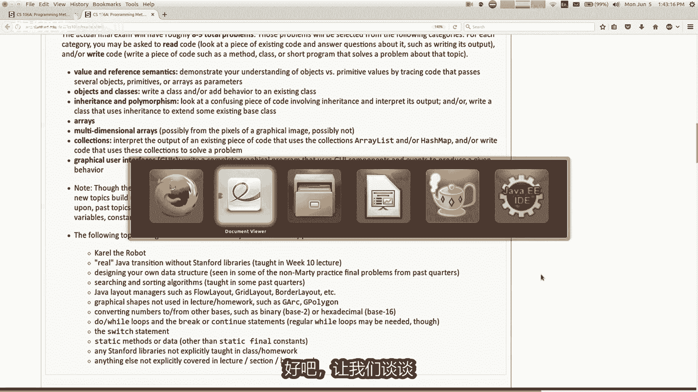
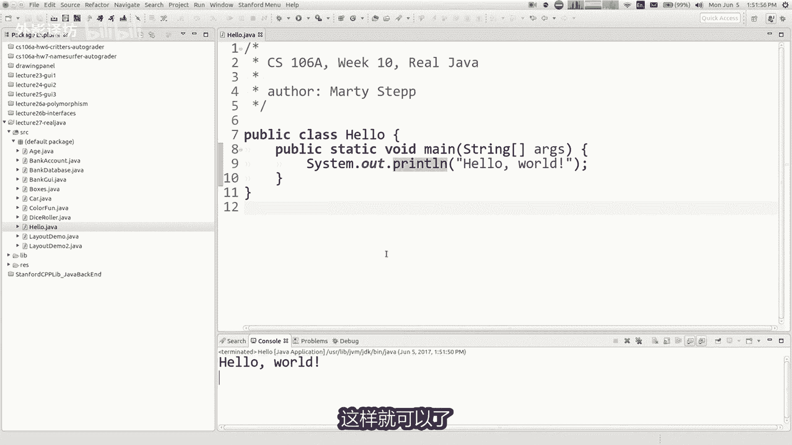
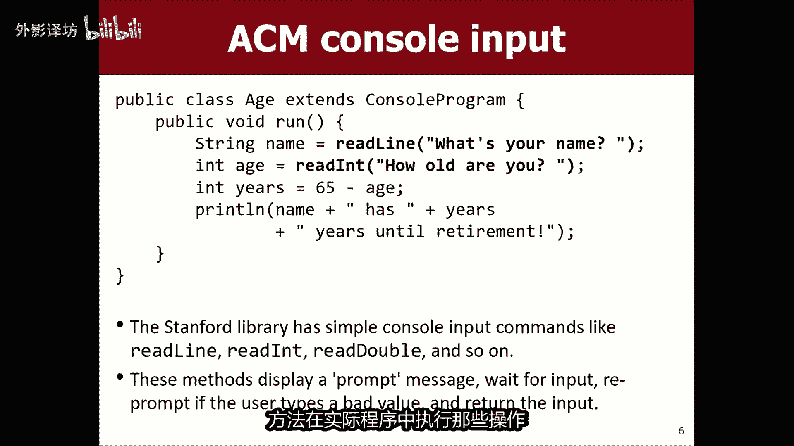
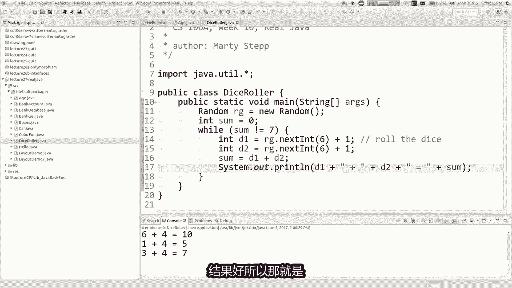
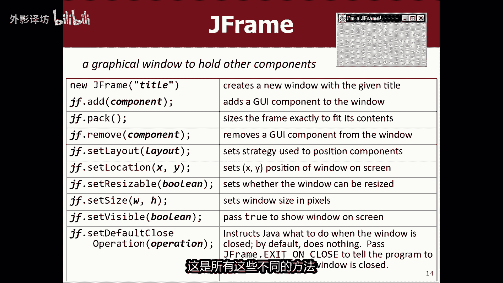
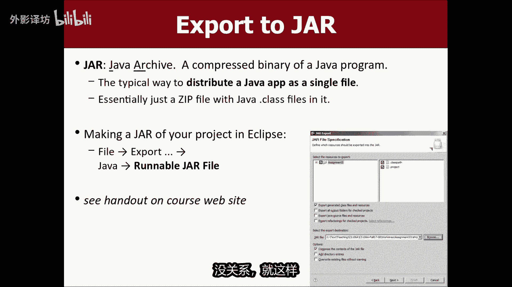
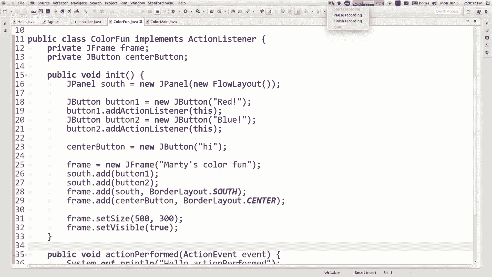

# 【中文配音】斯坦福王牌课程 CS 106a Java教程 2017年春季课程 - P27：27_ Real Java - 外影译坊 - BV14U4geNEEq

好的，我们将讨论如何在没有斯坦福大学的情况下，编写java程序，今天在我开始之前，图书馆讲一些简短的事情，尼克要我快点做一对，公告之一是我们正在发布期末考试的，考试复习是这个星期三的晚上或者下午。

我们仍然得到房间保留，所以我会将其发布在网站，我会联系你们一次，我们知道另一个的细节，事情是尼克有办公时间，明天但是有一点变化，有点他会让我们在两个小时开始，明天三三十到五三十，好的，现在就在。

就我们在班级中的位置而言。

这是我们的最后一周，就是你了，小伙伴们都期待着结局，春季季度，这算作这张图的反应，雷鸣般的好，我也很棒，好吧，我们只剩下这周了，有了它们，你就和我完蛋了，知道你可能正在努力工作。

很多项目和论文以及期末考试，一切都让你知道什么，我们今天要做，这周我要去简单谈谈期末考试合，然后谈谈这个真正的工作，没有那些斯坦福图书馆，星期三你不想错过我们正在做什么，我们的小动物锦标赛会很有趣。

所以我希望你会出现这个内容，周不在决赛，所以我知道这导致一些人不予理睬，但是我还是觉得很有趣，尽管如此，然后星期五这个星期五早上八三时，我们有期末考试上午，所以一定要在截止日期这些种类的条款。

记住你知道的事情，家庭作业7mm surfer只需要一个，不久前的今天，你仍然可以截止至周三十一五十九，但就是这样，所以请注意周三回家的硬截止时间，就决赛而言，我不认为是七分，我的互联网可以正常工作。

但我会尝试一下，无论如何哦，没关系，所以就最后如果你说到重点的话，你想从哪里开始思考，我之前说过，我们的材料已发布，我们的练习材料是发布一遍，你可以查看这些，每当你准备好时，这就是我们所拥有的。

我们有一个参考表格，列出了你所知道的所有不同的方法，你可以看看，那将附加到你的考试提前看看，如果你就像亲戚发布的练习考试一样，以及答案键和所有问题也出在代码中，如果你想尝试输入步骤网站。

他们进来并测试你的答案，看看是否不管它是否有效，我们有几个过去几个季度考试的其他链接，如果您还需要任何其他问题，或者如果您还想要更多问题，你可以看看你的部分讲义，尤其是来自过去三四个星期。

可能那里有一些额外的问题，你在部分期间没有到达，所以希望你有足够的问题，我大概知道主要的稀缺资源，这里还有更多时间，有足够的时间学习，有足够的时间看所有，这些都是合同中的一般内容，我想和你们一起做的事。

我不想让你感到惊讶，期末考试我要你打开考试，并说哦，是的，这些就是这样的，我所期待的问题，因为我看了练习材料，这些就像那些，所以希望你知道我想挑战你，但我不想欺骗你或给你惊喜。

所以如果你看看这些模拟考试，如果你觉得你已经准备好回答你这类问题，周五应该没问题，另一位将军，我要评论的是，你知道我知道在期中考试时，有些人感觉如果价格时间压力，两小时内解决所有问题。

是的我明白我是同情我们的决赛三个小时，但我不会给你一个小时，只出五倍的问题，所以希望三个小时足够的时间让人们完成事情，他们需要为决赛写下考试，我知道总有人无论如何都想要更多的时间，除了你。

我知道我的希望是，你会觉得你有足够的时间来回答，全部都写在纸上，所以就这样，就我所提出的问题而言，可能会问你，我的意思是，我认为一般而言，你想去看看那些练习考试，以获得想法吧。

打开其中一份试卷并翻阅真的很快，只是谈论一些它所存在的问题，我的意思是他是累积性的吗，他是累积的，因为我们所做的事情，在课程的前半部分是基础性的，并且是必要的了解我们约会的事情，然而课程的后半部分。

我不会在某个问题上考验你，专注于期中前的，我只是要测试你的新东西，所以它只是累积的，因为旧的需要一些东西来理解新事物，比如我不会问你，地球上的卡罗尔对机器人的问题，因为我们已经这么做了，我知道我是抱歉。

我知道你听到这个消息很难过，但是无论如何，这是我的一些事情，会问你，我可能会写一点具有参数和的神秘问题，返回值还涉及参考语义，这个想法原始值作为副本传递和参考值，如对象和当您将数组传递为参数。

因此如果您将数组作为参数并更改它，然后你会看到也可以在呼叫方进行更改，所以无论如何，我可能会要求你解决一个像这样的问题，另一种我可能会要求你做的问题是，现在写一个涉及速率的方法，有一些这样的问题。

也练习期中考试，但我没有实际上让你用数组编写代码，在中期我让你阅读一些带有数组的代码，但由于加薪更多的是一项家庭作业，我决定让你写的五个主题带有数组的代码，但最后我只是一个被宠坏。

或在最后你必须写的地方，一些涉及数组的代码，所以有你采用需要费率的方法，参数或返回数组做某事，另一种操作数组我可能会问你的问题，是具有多维数组的东西，一个二维数组，我认为如果我更有可能问你这样的问题。

但他会可能是一个多维数组，我可能会显示的图像的像素，你给我一张照片，我给你一张，之前和之后，我会说你应该编写代码来转动这组像素，到那组像素，我不知道这个练习测试是否需要等待，让我走。

让我去寻找我想的练习测试，二有类似的东西让我打开，它是的，在哪里。

像这样的东西，你知道写一个方法称为宽翻转，拍摄图像，并翻转它颠倒过来，并且也使它更宽，所以你必须查看二维数组像素，使其看起来像这样，所以如果我做多维度的事情，数组更有可能是这样的，好的。

我也可能会问你其中之一，这些遗传多态之谜，从上次开始就很烦恼的问题，周五的讲座，这些事那些困难和令人沮丧的起初，但我想在你做了一些之后练习你会遇到的问题，你可以很好的解决他们的地方。

可靠的这些也可以成为很好的，如果您是请在PASA论坛上询问，尝试解决其中之一，并且你会得到不同的答案，只需发布你的信息，直到我在恶作剧PM3问题期，对于这个我得到了，为什么我得到了。

我们很乐意提供不同的答案，和你一起经历并交谈，你对此感兴趣，所以就去练习一个货，其中两个确保您掌握窍门好吧，那么我很可能会问你要写某种生物，具有特定运动的生物，或是发现的东西或任何种类的东西。

参考表的行为，包括所有不同的生物方法，所以如果你忘记了那些是什么，你可以查一下名字，但可能让你写一整个小动物类，好的，我还要测试你什么集合，array list和HASHMAP。

我们在作业七中使用的那些，所以我可能会让你读和或写一些，涉及集合的代码，这是我读过一些代码的事例，我有一个需要哈希图的方法参数，和我操纵或制作新的哈希图，我将其打印出来，然后我如果你明白的话。

想让我看看哈希映射如何正常工作，以及术语编写使用哈希映射的代码，像这样的东西，你知道这是一个我传递地图作为参数的方法，我应该检查是否有一个地图，是另一个地图的子集，当我写出哈希映射I的内容。

有时以这种格式写他们，我说你知道关键等于价值，就像见是MARTI和值视该号码正在通话，并且直视这个数字，所以如果我写以这种格式，这就是我想要的，说这些是属于我要传入该集合的地图，还有什么方法哦。

我会非常可能会要求您在其中编写一些代码，你必须做一点点图形，用户界面小部件，几个按钮或其他东西，你必须实现一些GUI，一些与我们所做的相匹配的行为，作业期名字叫冲浪者，大概是将更多的关注小部件组建动作。

执行的那种，谷歌上的东西和更少，这些东西可能有霸王龙短暂露面，但我的目标是不要在那幅画上做很多测试，绘制形状的东西，因为那更重要，喜欢其中内容，好吧，就这样，我认为这就是整套事情，我可能忘记了一些事情。

这里的页面有一个要学习的主题列表，所以你可以看一下，还有一个列表，不会参加考试，如果您对您的需求有任何疑问，学习或不需要学习的东西，当然我们应该让我尼克知道，并且我们很乐意回答。

但剩下的就是你们有什么将军吗，关于决赛的问题，我们可能会被问到的问题，我们对如何学习的期望，学习什么，任何东西，任何东西问题，是的，像漫画一样好问题，重新分配，一般难度范围是多少，该生物可能处于高端。

就他而言更像河马货，我会说螃蟹比它像蚂蚁，当然如果你看看实践那些练习题都是问题，我真实提出的问题之前进行过测试，如果你能做那些你可以做的事情，可以做，我给你的那个实测保护问题还相当相当接近。

我想要的考虑一下合适的难度级别好吧，其他问题是的决赛在哪里哦，这是个好问题好吧，一开始我以为你的意思是，文件或其他东西在哪里，在我的硬盘上看，你无法拥有，它，已经过去了，你要去哪里。

最后我们被告知我们要在古巴200和201，不是这个吗，200这个我会把他们搞混的，对于即将到来的救人，我们将会在这座大楼里，但我们排除两个房间，所以我们有足够每个人使用的椅子。

我会确保该信息是发布在网站上，我想我们必须完成你们所有的工作，一点字母，所以我会确定每个人都会收到，关于去哪里的消息，去什么时候去那里，我们会确定每个人都知道去哪里，发生什么事去吧，谢谢你询问这个问题。

我尝试过的其他期末考试问题嗯，随时跟住，但他没有夹住，他正在做的手已经退出了，搂着女孩，我拜访了他，我拜访了他，你的中间扔了我的同性恋男人，我的比赛受到了伤害，我曾经经历过，我开始我去了奇迹。

昨天和我妻子一起看女人电影，我的岳母正在看这部电影，并且喜欢剧中唯一的男性角色，电影里这只热辣的猴子不现实，期待家伙，克里斯泰恩，然后他们就像把她扔进这个无缘无故的裸体，它就像洗澡的场景，然后他站起来。

全身都湿透了，赤裸裸的迎接所有人，我就像是这样，当流行媒体客观化时很烦人，他的性别是这样，你就知道了，对此很生气，我们谈到后来max时感动我的妻子，他很兴奋，喜欢他回来，伙计他是如此坚强。

他确实是拳打脚踢，电影里的我很喜欢他，就像我爱的那样，与bang bang和我的合作，就像我明白一样，我明白你不明白，实际上必须让我脑震荡，描述一下你有多喜欢我的电影，虽然我服用了一些edible。

但已经康复了好吧，我以为没什么，去看看吧，奇迹罗马人很棒，非常棒好吧，我想我已经谈论完了考试，剩下的就看你了，去学习吧，如果您的问题请在pr赛上询问我们，或在办公时间前来，我们很乐意谈论它。

可以帮助你解决你的问题，通过你的学习过程，我知道这是一个压力很大的一周，所以希望我们能得到通过太极剑好吧，让我们谈谈关于这里的一些新内容。

我要打开今天的幻灯片，这就是真正的java，保持真实，今天我所说的真正的java是指编写一个不实用，斯坦福图书馆，你们认识的甚至可能不知道是什么，斯坦福图书馆，我在其中编写了代码。

所写的是使用那些幸运的编码，今天我将尝试澄清这一点，也许还不完全清楚，为什么我为什么要关心代码来自什么，鸟类图书馆，我会尽力激励，那也是如此，我们有一套内裤在这里，我们创办的大学埃里克罗伯茨教授。

今年退休的，谁是真正的我们的有影响力和重要的成员，不仅写了这本书的教师，这门课的书，但也写了所有这些库文件，并创建了很多你们做的家庭作业，就像他做的突破任务一样，他是我们非常有影响力的成员。

帮助建立这门课程的教师，他目前从头开始教授我们的106，这班另一个戈尔曼入门课程，无论如何，我们正在努力创造，那又怎么样，这些图书馆建的好吗，帮助让事情变得更容易，通过拿走一些东西来学习编程。

java可能提供的几首部分，这些部件的更简单的替代品，列出了特定库的在那里，虽然这不是全部，就像卡罗尔一样，一切都与carol是斯坦福大学编写的一个库控制台，对随机生成器进行编程。

这些是斯坦福大学的图形程序，所有图形内容只有MULTIDIRECT，所有这些东西都是斯坦福大学，所以主要目标就像我说的，目标之一是为了让java的编写变得更简单，代码意味它很难学如何编程。

但也许是java语言也有一些粗糙的边缘，让他变得不必要的困难，所以他尝试稍微平滑一点，这些库的目标是有某些类型的程序太难写了，我们希望学生能够做到我说的图书馆，开馆的时候，我不在这里。

但我同意所有的限制，所以我说话的时候会说周关于这些事情，我认为这里的想法做图形很有趣，动画和游戏和突破盒这种东西，但是在普通的java中写起来有点困难，所以我们希望能够布置家庭作业。

像这样的程序供你们编写，所以这些库帮助我们做到了，我们认为合适的地方足够简单，我们可以要求您写吧，不用多说，我们来谈谈斯坦福大学的一个项目，和一个常规的java程序，所以这里是我们很早就做过的事情。

我没有会一直回到卡罗尔身边，因为并没有真正的工作模拟卡罗尔，我认为从正确的地方开始，这是我们所做的控制台程序，第二周，这是斯坦福控制台程序，减少了这个控制台程序。

现在我们扩展的襟翼到达我们知道的路线终点，这意味着我们正在使用继承，所以其他人写了这个控制台，我们正在添加功能的程序，具有此运行方法的库，使用print line命令打印消息。

这是您的第一个真正的java，程序检查那个阶段，那很酷，等等我会再做一次，我只是太为自己骄傲了，太棒了，你知道在矩阵我们都是真，为什么，我的眼睛是你从未使用过的，疼痛和更剧烈的身体，他们就是现在伙计。

现在为什么嗯，我的手指和你的手指是不同类型的，而IA程序这是一个真正的java程序，你会发现它没有扩展任何东西，只是一个名为hello的类，而不是run方法，你写一个main方法，同样的想法。

这是特殊的方法，实际上代表了程序的运行，说明为什么会改变，我在常规java中运行，斯坦福图书馆很好，我认为埃里克罗伯茨想要一个不同的名字，以便人们能够区分它们彼此的真实姓名。

这个方法在实际中被称为main，它在java中的版本，你必须传递一个该方法的参数，你必须声明一个名为spring的参数，括号括号艺术，它不必被称为艺术，但你必须有，我不想要字符串数组作为参数。

谈论那个参数太多了吧，有它它是一个叫做命令的东西，形参数数组，这是你的位置，操作系统可以通过额外的影响程序的参数，它是如何运行的，我们不会使用它，你知道的，如果我给你上这门课，如果没有斯坦福图书馆。

我们不会用它，那就是这个我们有一些不必要的参数，已经看到斯坦福图书馆，普林斯顿的命令实际上是真实命令的缩写形式，称为系统点出点打印，所以你知道打印，而不是写借给你，好世界。

我们写出完整的system out print line，HELLOW命令，世界最后的改变是我写的静力学这个词，在这里我没有说课堂上对静态这个词非常了解，但我的意思是尽可能短。

静态一词的定义意味着不关于物体，所以它有点像暗示，如果你省略这个词静态，那么你正在谈论对象等，例如当你写一个你不说的银行账户类，该文件中的任何地方都是静态的，但如果你只是编写运行的方法。

常规java你经常说这个词静态的，因为这些方法不是特别是任何物体的一部分，所以这是一个真正的java程序，你知道的可能会说，如果你的话，那也没有那么糟糕，说话就像我从这个那里走出来一样。

我不得不复制的一堆乱码，并写下另一件事，有不同的胡言乱语，但两者都去合法，所以为什么要改变所有这些东西，好吧，我想当然会更多，当你有一个更大的东西时，很有趣计划，但这只是一个开始点。

所以很多老师只是为了给你的背景，很多老师都讨厌他，因为我们都做的标准事情，那我们教学生如何程序是我们的第一个程序，ever show you是一个显示的程序，屏幕上显示hello world消息。

现在我们不这样做，我想说，因为我们写的第一个程序是坎雷尔，但这就像一个非常非常，人们一直在做的标准事情，几十年来，我们将学习课堂上的程序，这是一个程序，上面写着你好，世界是你写的吗。

因此一些老师认为这是一个很好的试金石，编程语言有多垃圾，你必须写才能打印，Hello，如果你正在写一个世界，在屏幕上使用Python语言编写的程序。

你打印hello world的方式是你说打印hello world就是这样，如果你保存的话，这就是整个程序到一个以点配结尾的文件中，然后你在print hello world中运行，没有进口。

没有阶级和混乱，没有什么是完整的程序，Python和java，如果你想要打印你好，世界必须写下所有这些，我想很多老师不喜欢，因为这当然会导致学生要好好问所有这些问题，什么是阶级，什么是公众。

跟我一起来的是什么，与公众相反，不用担心，就现在什么是public static void main，什么是禁欲主义，静态是什么意思，正在发生什么，与回报有关，回报是什么，现在不用担心什么春天。

括号括号艺术，它是一个数组字符串，好吧，我明白这个词，但是什么是数组以及什么是写好，我从来都不好，system out print型系统输出什么警系统是一个类，并且作为一个变量和打印型是一个方法。

等待这两个到底是什么，作为一名老师令人沮丧，我确信一个学生应该拥有所有这些善良的东西，如果你不这样做的话，就会漂浮，当你只是想尝试时，明白开始学习，所以我想了很多老师不喜欢这些东西。

java无论如何，看起来我想只是为了展示你，我没有骗你，我可以打开那个hello文件和那个标志，你正在使用斯坦福图书馆时，如果您导入任何标有AACM的内容，这些是斯坦福图书馆。

为什么他们说APM而不是其他什么，像斯坦福大学或任何你认识的人，可能会认为是斯坦福点程序点心，他是AACM的原因，是因为实际上罗伯茨教授来自我们大学，有一个特别工作组，来自各行各业的教授，大学一起出现。

与这些图书馆一起，他们在其他几所学校使用，他们好吧，这就是为什么他们被称为ACM图书馆，代替斯坦福大学库，所以如果我删除它，找不到控制台程序。

所以我会删除那个我将更改run into public static void，主要你必须写字符串，括号括号ARX此处然后为打印行，你必须说系统点输出，点打印线，然后你如果我运行的话。

基本上有相同的程序，这件事你好，唯一的区别是它打印出来，将所有剪辑放在这里，这样就可以了。

另一个关于什么的小事，斯坦福图书馆确实让我谈论，这里的控制台程序是什么，控制台程序类很好，如果你NO提供了这些方法，例如print并打印图D，它提供了一种使用方式，这个run方法来执行程序。

但它也提供了一个图形窗口，像默认一样包含控制台程序，控制台不是逻辑的引擎，所以那是另一回事，让学生感到困惑的是，你的程序的控制台，就像无论如何，在eclipse内部，这些都是图书馆可以做的事情。

到目前为止。

有关图书馆的任何问题，或关于这个小程序在这里或任何事物。

很简单，我的意思是，到目前为止，我只是用一个命令替换另一个命令命令，所以让我们看看其他一些命令，当你想要实际使用时的例子，要输入你说的内容，请阅读我的或你的说呼吸我们的方法，当我打电话给控制台程序时。

我正在从以下位置调用这些方法库，那么这些方法是做什么的，让我们记住你传递的一个字符串，并且这就像出现在首先是控制台，然后是用户类型程序，以任意类型等待的值值，然后如果用户介入错误的值，就像我说的那样是。

但他们没有输入，他说的是进入类型盘的零目标，让我再次输入，这就是全部方法，在实际程序中执行那些操作方法不存在。

所以你知道如何有这个系统点出点打印line，这是一个可变系统，弹出是一个用于递增输出的变量，有一个类似的变量叫做系统，如果您想询问用户，请点入so，让我们看看什么，不是有一个叫做年龄之类的程序。

你叫什么名字，你多大了，然后我会打印你有多少年，直到退休，让我们改变这一点，很快让我们摆脱这些导入，让我们把它变成常规的public static void main，像这样。

并且然后让我们做一下系统吧，林所以我们可能希望的是系统点，N点读取型什么的，就像那样，但不幸的是，人们java的设计者真的搞砸了，系统点是您阅读的方式来自用户的输入，但他没有任何有用的方法，我都做不到。

相信这是他唯一的方法，读取单个字符，想要关心，所以如果你想读一行，你已经喜欢读读读读读读读读取字符，直到看到斜杠，然后你停下来，这太荒谬了，所以当然这不是任何人的想法，真正做的是人们真正做的事情。

他们利用我们之前的朋友扫描扫描仪，这就是他们的内容，扫描仪来自java utidot星扫描仪，无视斯坦福大学的东西，这是一项真正的工作，所以你要做什么，你要做的就是让扫描仪调用键盘什么的。

等于一个新的扫描仪，你知道如何，这里的括号通常表示新文件，或因为你说的是，放在这里的东西，是你说系统点，你基本上说我想读东西，键盘输入来自控制台输入，现在在这里，而不是说系统并独醒你叫什么名字。

再次记住独行方法，它提示困难的事情，然后他读取结果，你必须分开这两件事的提示，就是你说系统输出打印或打印lo，不管怎样，然后你说你的名称，现在如果你想阅读你说的名字，键盘点读或不读读行。

但记住下一行键盘是我们扫描仪的名称，我们刚刚声明的变量没问题，然后如果你想阅读如何老了，你又要分开了吗，这个出来就不得不说一个系统点出点，打印拟合几岁，那么你必须说int age等于键盘点下一个int。

所以应该和，那么这是强调，因为我应该说点关闭，但我只是留下他，让我尝试一下，让我试试这个年龄计划，你叫什么名字，马蒂你几岁了，不推断眼镜，不告诉36年，直到退休了，所以现在我基本上已经有了相同的程序。

但组合没有就像我们谈论过的那样，弹出不太等同于斯坦福大学版本意味，如果我再次运行它，并且我说你叫什么名字，马蒂怎么样，你老了不关你的事吗，崩溃，并且输入不匹配例外，因为他会考验你们，当你在的时候。

可能已经看过这个，当你写一个需求时，播放冲浪者或旋律或类似的东西，如果您尝试读取扫描仪，错误输入一个单词，并尝试阅读它，作为一个int，他不喜欢这样，并且它崩溃，所以这仍然不完全是和斯坦福版本一样好。

因为它需要让用户在低音格式化，我将如何做到这一点，现在不会在课堂上这样做，但我要做的是阅读该人输入的内容，随着他们的年龄，然后我必须检查是否是INT，如果不是，我会必须再次打印。

我必须写一个一会儿循环来做到这一点，否则我会编写一个辅助方法来执行此操作，或无论如何这种性质的东西，这是一个程序，所以只是为了上下文，如果你有兴趣，你知道我很性感，java在我们所在的另一所大学。

不要失去这些图书馆，大学华盛顿以及我们分配时所做的事情，我们的作业是我们说好，我会用扫描仪读取键盘和其他东西，但我们只是告诉他们，你可以假设用户不会输入任何不好的内容。

他们不会输入不属于数字或其他任何东西，因为我们只是想让学生工作人员写下所有这些，一会儿循环到各处，检查其中是否有效，这使得程序太长，所以优点很有趣，就像在斯坦福大学一样，不必你知道放松一下的假设。

因为我们的方法将，无论如何都会自动为你阅读提示，这是一个有键盘输入的程序和控制台输出，好吧，所以你可以看到很多这样的改进，好像没什么改进，但是这个每周每堂课的时间开始增加。

我们可以变得更快的地方，进一步了解这些库，您就会知道，还有一点是的，这就是程序，你多大了，我们刚刚这么做了，所以跟随机数，这只是另一个随机的小图书馆发电机，试雨ACM，所以你可以说。

我想要下一个从一英寸到六英寸或类似的值，这很有趣，因为原始的java就像旧的java1。01样。

他们为你提供的方式，随机数是他们有方法调用math random，并返回一个从零点O到1。0的随机数，就是这样，如果你想要一个随机的怎么办，从1~10的数字你怎么做，任何想法，随机整数从1~10使用。

只有这个东西，乘以十是的，如果你说数学点随机乘以十，将返回零偶2。10点欧，我们从技术上讲是9。999，然后已将其转换为int bean，如果你得到一个从0~9的整数，想要一个体弱的1~10。

你都做加一，然后将其移过来，从1~10，你知道你能做到这些事情，但有点烦人，后来他们说这是废话，我们应该做一些更好的事情，然后他们做了一个叫做random的类，这就是java，就像我不知道一点一样。

不久前如果你想做的话，可以你可能真实的随机数，想要将这个随机类语义写，打开这个名为投资尺I的程序，保证我会停止转换所有这些一分钟内的程序，但无效ma字符串，括号括号参数，所以这是一个程序，只是掷骰子。

直到我们求和为期，我想我们写的，在我们不久前的一次讲座中，你不能导入这些AACM东西，如果你想要真正的随机数字生成器，位于java u t i l中包，它不叫随机生成器，它被称为随机，并且你没有说随机。

Get instance，你说新的随机数它有下一英寸的方法，但它只需要一个参数，即最大值，并从零返回到一小于该最大值，所以如果你想要一个1~6的数字，你必须问他对于0~5之间的数字，然后加一。

因为这会给你一个将其移过的数字，使其成为从1~6的数字，现在我会说system out print型，所以我认为随机生成器库不一样，和其他一些一样有用，但它确实提供了一点点功能，所以如果我运行骰子。

我想你会看到的是，如果我们掷骰子，直到我得到七，结果好，所以那就是我们现在可以使用的另一个库。

真正的java版本，OK让我们保留嗯，是的好吧，这就像一个完整的程序，我不会去编辑这个一个，但这是打印I的事例，我认为我们做到了我们谈论过的这件事，我们做的参数就像小盒子一样，星线和被动参数。

当你编写程序时，那些已经破碎的，你大多会使用这样的方法，将方法放入这些静态方法中，如果你不是的话，你为什么说静态好，从一个类继承更多你的代码与系统分离，java中的类和对象以及核实。

这就是你通常说的静态的情况，更多时候，我真的不想去深入了解其运作方式的，每一个细节，但你知道你把一切弄得一团糟，它是静态的，你创建了一个main方法，更改所有打印的内容。

system out print镜头，那就是基本上是等效的版本，相同的程序不同的是突出显示，好吧，没那么不同，但是你知道有点不同好吗，让我们继续讨论图形一分钟，因为我认为这个图形可能是最大的。

这个图书馆的单一动机，我提到我们希望能够分配诸如突破之类的东西，它只是有点太难了，与标准java，所以我想分开，你知道我们谈论过两件事，绘制G椭圆形等形状，我们谈论了像J这样的食尸鬼。

按钮和动作监听契合那种东西好吧，那么让我们来谈谈那些黏糊糊的东西，我们先学什么东西，然后然后我们稍后再回到geo mos，这是一个有GUI的程序扩展程序，它有添加操作。

真正可以表演我们的听众学到了所有这些东西，这是一种任务，其中有些是新的，有些事这是真正的java，所以让我尝试一下，当你在这里解释图书馆时，扩展程序，它使您的程序进入弹出的图形窗口，在真正的java中。

你看不到屏幕，除非你把一个窗户作为唯一的窗户，windows是我们为自己制造的，称为j frame对象，你必须创建一个新的JEFFERSON对象，然后你告诉他是可见的，他将看来你可以放任何。

你想要的东西在那扇窗户里面，窗口的创建和显示是有点隐式的处，理为程序的扩展，另一件事是，如果你有一个图形程序，它可以制作为你绘制画布，我稍后会讨论这个，以及其他的斯坦福大学图书馆的第三件事。

他们在这里做的是简化一些事件是如何连接的，所以如果你看看这里的代码，我们思考这是斯坦福大学图书馆，我们仍然说添加动作监听器和那一行，找到所有的小按钮，并开始监听所有按钮，当我们点击它们时，它会调用动作。

正确，很可爱，在真实的java世界中添加动作，听众方法不存在，你你必须做的是，你必须单独与按钮交谈，并说黑按钮，I想将自己添加为您的听众，黑其他按钮，我想听你说话。

所以你必须单独添加你的程序来听这些按钮，不世界上最难的事，除了你如果我提到的话，就必须在这里这样做，java中的windows被称为JE框架，如果你想制作一个j frame，这就是你要做的。

你只需制作一个新的JEFFERY对象，你可以向其中添加内容，就像我们将东西添加到程序，让它们出现在屏幕右侧，您可以设置我们的布局，谈论了莱亚所有这些布局经理们，我教给你们，我们真正的工作。

事实上所有的小部件都像这按钮，没任何以J开头的东西都是真正的java，所以这是个好消息，不要重新学习这些和想法，动作监听器动作事件是真正的java，你不必重新学习，那些实际上只是一个程序类。

将它们全部放在一起，是新的一步，我们必须忘记并重新学习，这是所有这些不同的方法。

JEFRAME可以有，所以我只是想拿一个非常小的java图形，在这里编程，并向您展示它是如何实现的有效，所以这里有一个名为color的程序，有趣，我想我们有这个计划，说有时是红色。

有时是蓝色或类似的东西，所以就想等一下让我运行这个。

然后把它放在屏幕上，所以这是这个程序中，我们说红色或蓝色或我认为这是倒退等等。

如果它是红色的，为什么它会倒退，将其设置为红色，我将其设置为蓝色，无论如何，如果这真的是我想转换的简单小程序，这就是真正的java，所以让我来展示一下，你可以在这里快速执行一些步骤，这样就可以了。

首先我们不需要扩展程序，我们需要扔掉任何ACM在这里导入，请记住，真正的java程序有这个主要方法，public static void main字符串方括号方，括号2X和A等一下我要提出问题标记。

我不知道这里会发生什么，因为当你扩展程序时，你知道你有设置的印度代码窗户之类的东西，但是然后实际上还有另一个步骤，无需你这么说就发生，就像现在我已经初始化了我的窗户，使这里的窗户把窗口放在屏幕上。

你可能根本没有想到，认为这是某人的事情需要做，但图书馆正在做，对我们来说，无论我们是否知道，这就是我需要做的事情，这个主页，但让我来看看APE中的一些一点点，所以这按钮仍然很好，J按钮仍然没问题。

这件事说添加到南部，我无法添加到，我添加意味着添加到这个对象，我不是程序不再存在，所以我无法添加到，你能做的就是你可以做一个jj frame，等于一个新的j frame，那是一扇窗户。

我可以把你放在这里，知道马蒂的色彩很有趣，现在在这个框架，我可以说点添加按钮，一自己还好，框架点也添加按钮，所以他不明白自我是什么，因为男方使得对一种布局的感觉是边框，布局点难。

所以像什么斯坦福大学图书馆正在做的事，有点拉近这些常数，将它们导入程序库，所以你可以只说salt，而不是waterlayout dog step，但现在我添加了，如果我愿意的话，把那些东西放到窗户上。

将窗口设置在屏幕上，我想说的是，Framed set visible true，所以框架将出现，使其自身显示本身在屏幕上，这个添加操作听众不再工作了，你必须做什么，就像我说的那样。

以前你必须和每个人交谈，单独的小部件，假设我想要听你说，我想要你们，所以你们说黑按钮E我想添加一个动作监听者，以及谁将要执行听这个对象将要听，我会用按钮做同样的事情，到按钮添加动作监听器。

所以这个现在我们已经看到了，这个这里的东西消失了，在此个人之前添加操作听众，我们在哪里看到了重述的内容等等，你和一个特定的人交谈，小不见，是的，当我们想听时，谢谢，你到一个文本框，我们说黑那个文本。

现在当你按下时框点H监听器，在文本框中输入ENTE2即可，同样的想法只是那个广告，实际上listener是带有S的复数，找到所有按钮并调用操作，每一个都有单一的神经按钮，所以我们用这种替换它。

这里的代码设置visible true，好吧，唯一的事情就是有几件事我仍然需要修复，只需添加X这个动作，执行仍然是方法，我们需要这里说设置背景读取，设置背景蓝色不起作用，你觉得应该是什么。

相反让我一步步了解背景仍然是F方法的目标，但是我这样称呼他在某些方面是错误的方式，是的，是的，这是一个完美的答案，他说我需要说一下框架点部背景，因为现在窗户的框架很友善，他自己的小部件。

他自己的对象必须与框架点击对话背景，框架点设置支持者和你给了我这个的另一部分，该变量将超出此处的范围，我无法与该变量交谈，所以我需要使该变量如您所说，变成像这样的私人领域。

现在在这里我不会说这框架框架就说框架好吧，现在我们快到了，最后一部分是这个添加动作监听器不起作用，因为我必须做一件小事，我们并没有真正谈论过类，如果你有这个方法，并且您希望能够添加到听你必须写的按钮。

你的班级标题上有一些东西，你所说的实现动作侦听器的地方，你知道正确执行什么，这与它的接口有关，有一个名为解释的侦听器，该接口调用的动作监听器，有动作的动作监听器执行方法，如果你实现了接口。

然后你就可以附加你自己作为按钮的监听者，但是如果你不，你可以，为什么我们不必在ACM库里说，这个原因是因为程序类实现了动作监听器，所以我们不必说，因为超类这么说，无论如何，这些都是改变我们需要做的。

最后一件事是，这里主要我们需要弄清楚要做什么，放在main方法中，因为没有下面的其他代码将运行，除非main delta2，所以你知道你可能有想想，也许我应该把这个进入main，但我的意思是。

我不认为我可以涵盖每一个小细节讲座，但是这里的代码与这些私有字段和这个INIT，和这个执行代码必须执行的所有操作，对于对象，这些是一个字段对象，这些是对象的方法，这是一个不属于对象。

是一个令人困惑的概念，我只是挥挥手，但基本上我必须从中得到我不处理物体的世界，到我所在的世界和桥梁，这样做就是说颜色有趣，有趣等于新的色彩乐趣，然后说有趣，我认为这个对于一些学生来说有点令人困惑。

我认为拥有一个更有意义单独的文件，例如哎呀，我不想要新项目或名为color的新类main，如果我做了一个颜色主类，有一个主要方法说创建一个新的color fn，然后调用它的INIT，会跳到这里的方法。

并开始运行这段代码，这样我就不会再次知道，就像我认为这有点有点令人困惑，但这不是一些物体，但我必须制作一个物体，并告诉他按顺序开始工作，让所有其它方法就像我说的那样，再次激活自己。

认为这可能有点令人困惑，但这是我们需要的最后一小块，所以现在如果我运行color man，你看到了吗，该计划，这里，他就在那儿，你看到了吗，他在那到底是什么，你为什么有，知道为什么。

这就是为什么我那么小，他，猜测或者他是否知道原因或如何解决，他或探头，因为java讨厌我们所有的人，简单的答案好吧，我的意思是看看是否有一件事，今年春天我们可能已经了解到，如果计算机真的很擅长告诉。

完全按照我们告诉他们的去做，仅此而已，就像有时他们所做的那样，我们写的，但不是我们的意思，当你创建一个java时，默认情况下是正确的，window或j frame，并且你让它出现屏幕上不知道尺寸是多少。

你想要窗口，除非你说，所以现在在斯坦福大学图书馆认为这太混乱了，所以他们制作了一种默认的矩形尺码，如果你不告诉我你的尺码，我想要给你这个特定的尺寸，我不知道具体有多少像素，是否存在某种默认值。

真正的java中的默认值是很小的，没用，所以你可能会说这不是非常好的默认值，但无论如何，如果你希望窗口具有一定的尺寸，应该说框架点设置大小为I，不知道500X300，所以这样可能有一点帮助，哎呀让我跑。

这个家伙在这里跑，颜色主要好吧，接在窗口弹出了万岁，看起来更好，我按蓝色哦，好吧嗯，你可能会注意到的另一件事，这不太正确是在哪里，红色按钮你还记得这个程序吗，有一个红色按钮和一个蓝色按钮，所以。

java GUI的另一个愚蠢的事情是，你知道窗口使用边框布局，以便您可以将内容添加到北中南溪河中心，旦默认意味着，如果你添加两件事到同一地区的，最后一个比前一个崩溃，所以这不是他的工作原理。

斯坦福图书馆，但那是因为斯坦福图书馆秘密的有镇面板，位于北南东西河中心，附有布局管理器，以便可以在其中包含多个小部件，如果你想要多个小部件，则每个区域在这个程序的南部里，你能做的事。

你可以说记得我们做了一个上周的一点点，你说J面板难等于新G面板，让我们给他一个新的流程布局，使事物从左到右流动的那个好的，让我们在这里使用这些按钮，而不是直接将它们添加到框架。

让我们在自我添加时做自我点，让我们让我们把这些按钮放在南边面板，然后到框架我就添加南方好吧，现在如果我运行这个，那么我想你会看到的是，这两个按钮出现了万岁哦，但为什么男方在上面，因为我没说把他加到男方。

抱歉，天下难道难，我以为会是从名字就可以看出，但java却没有听我说好吧，让我们来龙吧，再来一个吧，现在他们在南方红南黑到底不起作用，所以他不是实际上改变背景颜色，所以我相信他叫这个方法，让我仔细检查。

让我只要确保它就在这里，我可以说system out print比你好，其实，表现的好好吧，让我做，确保当我们运行程序，所以它正在调用行动，但我没有看到背景颜色，为什么，因为好中心实际上什么都没有。

框架的背景颜色没有显示出来，所以我想办法，你必须解决这个问题，必须在中制作某种小部件，像卷面板或其他东西一样居中，但是我会做一个这按钮，出于说明目的，所以我会说卷按钮，中心按钮，我会说中心。

按钮是新的J按钮，Hi，然后在这里我将添加该中心按钮，到边框布局中心，窗户，然后到这里，而不是框架设置背景，我会做一个中心按钮点设置背景，我只是想告诉你，你无法设置，一般只是一个框架的背景。

因为那里没什么可看的，所以你必须在那里放一些东西，放一个J面板或J按钮，或这是中心按钮，现在它变成红色，现在它变成蓝色，所以无论如何，我不认为这个程序这里不可能写货明白，但仅此而已，小事情开始增加。

是的，你就像以前一样，一个只是稍微容易一点，无论如何，我只剩下几分钟了。

所以我只提几个，然后我们就离开这里，我想向你提及的最后一件事，当你画出像这样的东西时，这是汽车这个图形程序在哪里，我们需要保留雷克斯和地理洞，所有这些我认为这是可能是整体中最好的部分，图书馆的最大影响。

库氏这些图形形状和对象，有一种绘制图形的方法，在常规java中它看起来有点像这样，我不会真的解释清楚，我只是要展示对你来说，看起来你必须这样做，使用称为图形记的对象，就像一支笔。

你说黑G填充这个REACCORD填充是椭圆形的，这就是你绘制形状的方式，你可能说它看起来差不多，很简单，我的意思是如果你看的话，这里颜色为红色，然后我画这两个轮子和我很好的传递了坐标。

在这里我有g to原型，并且我设置了红色，我添加了轮子，实际上如果你看看这个大约需要八行代码，然后这里需要三行代码，画同一个轮子，那么天真的你，我知道观众会说我喜欢常规java更好更简单。

实际上真正的java方式在哪里，开始成为真正的痛苦的地方，你有很多不同的动画形状，彼此相互作用，同时美丽的ACM酷似这些形状是对象，你可以和黑举行改变交谈，你的颜色，汽车移动你的身体。

你知道周围的树木会变色，改变位置就更难了，使用标准java，你基本上必须跟踪所有协调所有形状，您自己使用屏幕上的所有内容，您自己的类或使用数组列表或某件事，这真的很痛苦，更新屏幕。

特别是如果你正在做一些像动画这样的事情，这种面向对象的图形图书馆，确实允许很多不同的易于处理的程序类型，即使对于入门学生也可写，就像突破是绝对的，让你看到真正的java，相信我。

无论你在突破时遇到什么困难，他们会非常放大了，用老式的方式做事，所以无论如何，总之有一个拥有酷和实用的权衡，图书馆肯定有一些有益于，使其中一些代码更容易写流畅了，语言或语言的粗糙边缘，很酷的语言库。

允许我们写出我们无法写出的烧伤，否则我会说缺点，图书馆的一个特点就是有些学生感觉很好，我没有学到真正的工作，我不知道如何编写真正的程序，不知道这个技能会不会转移去另一所大学，或工作或另一个地方。

因为我学到了定制斯坦福大学的东西，我认为这里的思考过程是这样的，现在你已经学会了我们的java了，如果你愿意的话，不会花你太长时间学习真正的java，主要是我们本来的样子，试图教你。

不是特别是非常社区范围和概念的原则，参数事件和图形以及所有这些不同的事情，我们了解了如何在比赛中存储数据，虽然这些事情并不特定于斯坦福大学，所以这就是这里的思考过程，但是有点无论如何。

最后一件事是有利有弊，在我们离开之前，我会说的是，这个与斯坦福图书馆无关，与非图书馆相比，但我有过学生常见的问题是，你知道我写过这些程序，才要向某人展示我想要发送的内容，对我妈妈或我兄弟或其他什么。

我该怎么做，如果有的话，你感兴趣的有一个课堂网页上的讲义，关于制作jr档案的讲义区，我会引导你去看那份讲义，我不会真的去经历它，今天课堂上有完整的细节，但你可以如果你看过我，请制作这个小文件。

将这些内容与您可以运行的演示一起发布，对于家庭作业，但你可以在ECONNECT中也可以这样做，有一个命令采取你的整个项目盒，将其捆绑到一个文件中，并将该文件输出到您的硬盘，一次你有一个叫做JVA的文件。

并且有一次你可以将其发送至任何人，以及他们是否安装了java，他们可以运行该程序，所以看一下，如果你对此感兴趣，请看一下，在网页上的讲义上回答您的任何问题，没关系，就这样。

谢谢你的到来。

