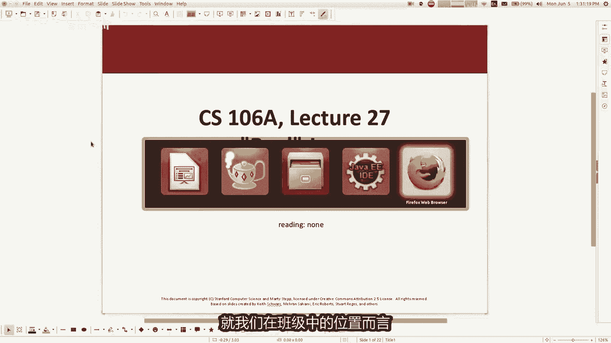

# 📚 课程名称：CS 106a Java教程 - P27：脱离斯坦福库的“真实”Java编程

## 📖 概述
在本节课中，我们将学习如何在不依赖斯坦福大学提供的便捷库（如`acm.program`、`acm.graphics`等）的情况下，编写标准的Java程序。我们将对比两种编程方式，理解库为我们简化了什么，并学习如何用“真实”的Java语法实现相同的功能，包括控制台输入输出、图形用户界面（GUI）和事件处理。

---

## 🗓️ 期末考试安排与复习
在开始新内容之前，先简要说明期末考试的相关安排。期末考试复习会安排在周三晚上或下午。具体细节和房间安排会发布在课程网站上。

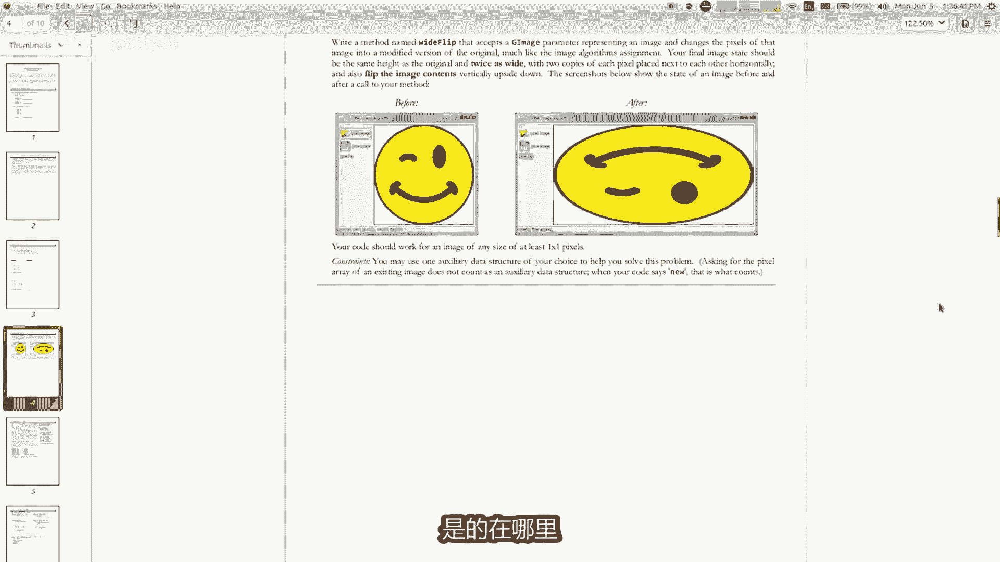

本学期是最后一周，希望大家在忙于项目、论文和期末考试的同时，能坚持完成课程。本周三将举行有趣的“小动物锦标赛”，希望大家能参与。期末考试将在周五上午进行。

关于期末考试：
*   考试是累积性的，但重点考察课程后半部分的新内容。
*   考试形式为开卷，会提供参考表格。
*   考试时长3小时，旨在让大家有充足时间作答。
*   已发布模拟试题和答案，供大家复习。

**可能考察的核心概念包括：**
1.  **参数传递与引用语义**：理解基本类型（传值）和对象/数组（传引用）的区别。
    ```java
    // 基本类型传递副本
    void modify(int x) { x = 10; }
    // 对象传递引用
    void modifyArray(int[] arr) { arr[0] = 10; }
    ```
2.  **数组操作**：编写操作一维或多维数组的方法。
    ```java
    // 例如：图像处理（二维数组）
    void flipImage(int[][] pixels) { ... }
    ```
3.  **继承与多态**：解决涉及类继承和方法的谜题。
4.  **集合框架**：使用`ArrayList`和`HashMap`读写数据。
    ```java
    HashMap<String, Integer> map = new HashMap<>();
    map.put("Alice", 30);
    ```
5.  **图形用户界面（GUI）**：实现包含按钮等组件的简单GUI程序。

建议大家通过练习模拟试题来备考，如有疑问可在课程论坛或办公时间提问。

---

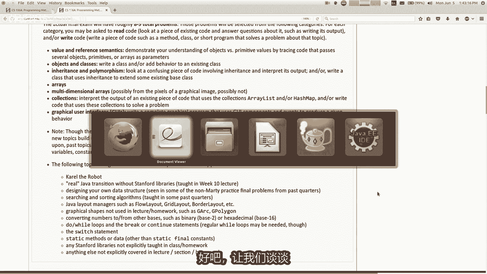

## 🔍 斯坦福库 vs. 标准Java
上一节我们介绍了期末安排，本节中我们来看看课程中一直使用的斯坦福库与标准Java的区别。

课程中使用的库（如`acm.program`, `acm.graphics`）由斯坦福大学的教授（如Eric Roberts）创建，主要目的是简化Java编程的学习曲线，平滑Java语言中一些对初学者不必要的复杂部分，并让学生能够编写图形、动画等有趣程序。

### 控制台程序的对比
以下是使用斯坦福库和标准Java编写“Hello World”程序的对比。

**使用斯坦福库 (`acm.program`)：**
```java
import acm.program.*;
public class Hello extends ConsoleProgram {
    public void run() {
        println("Hello, world!");
    }
}
```

**使用标准Java：**
```java
public class Hello {
    public static void main(String[] args) {
        System.out.println("Hello, world!");
    }
}
```
**核心变化：**
1.  类不再`extends`特定库类。
2.  入口方法名为`main`，而非`run`。
3.  `main`方法必须声明为`public static void`，并接受一个`String[]`参数。
4.  输出使用完整的`System.out.println`。

许多教师认为标准Java的“Hello World”程序包含了太多初学者暂时不需要理解的复杂概念（如`public`、`static`、`void`、`String[] args`），而斯坦福库将其简化了。

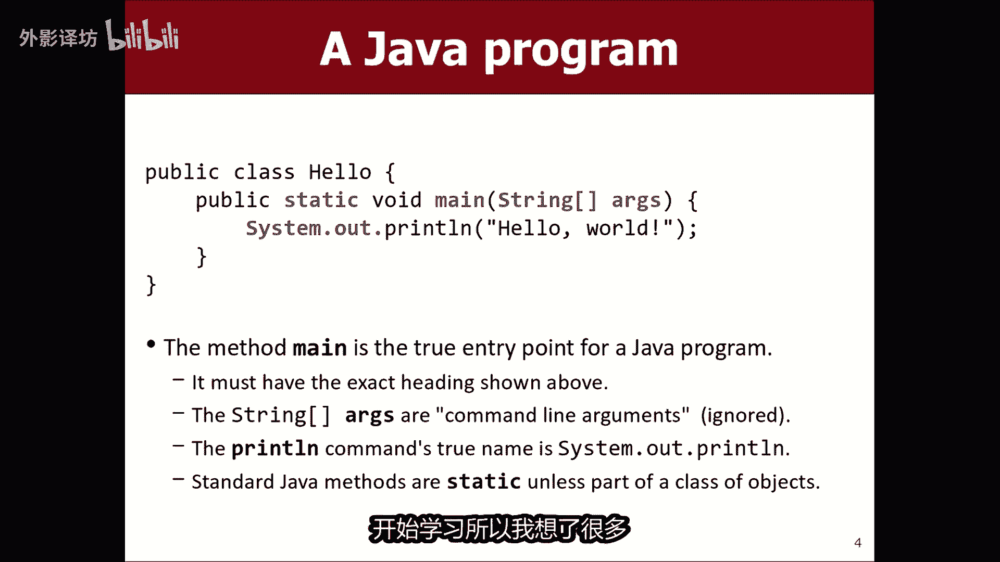

---

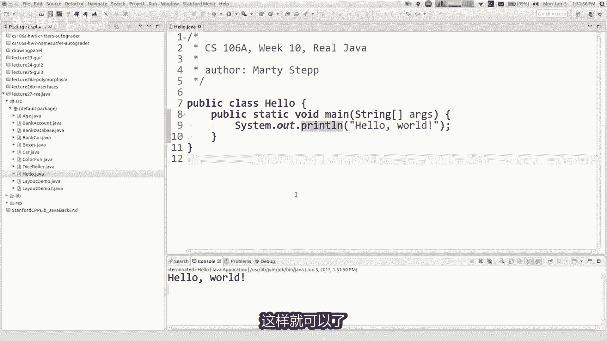

## ⌨️ 控制台输入的处理
在控制台程序中，我们经常需要读取用户输入。下面我们看看两种方式如何处理。

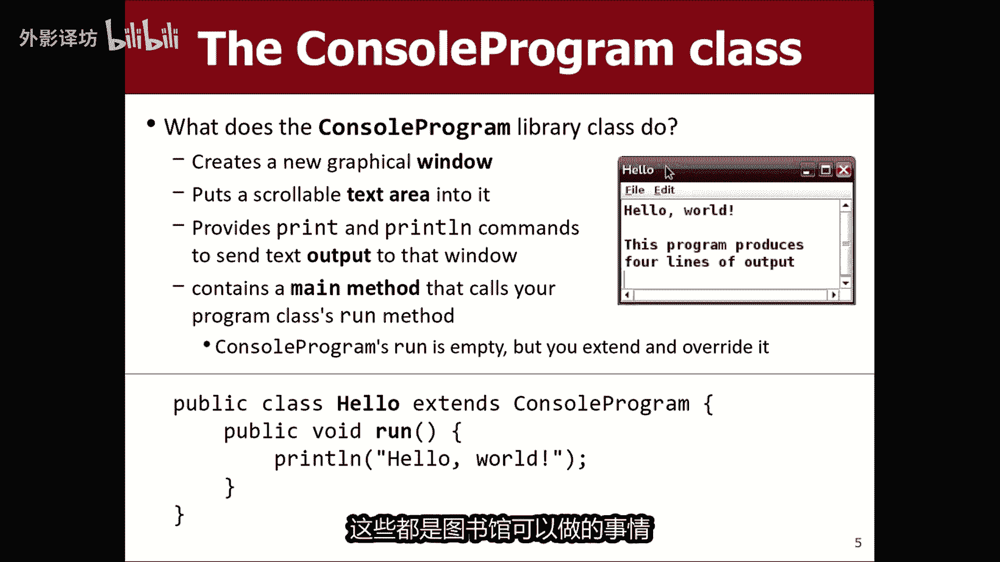

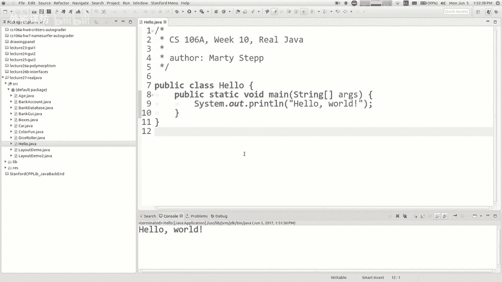

**使用斯坦福库 (`ConsoleProgram`)：**
库提供了`readLine(String prompt)`等方法，能自动提示用户并处理输入。
```java
String name = readLine("What is your name? ");
int age = readInt("How old are you? ");
```

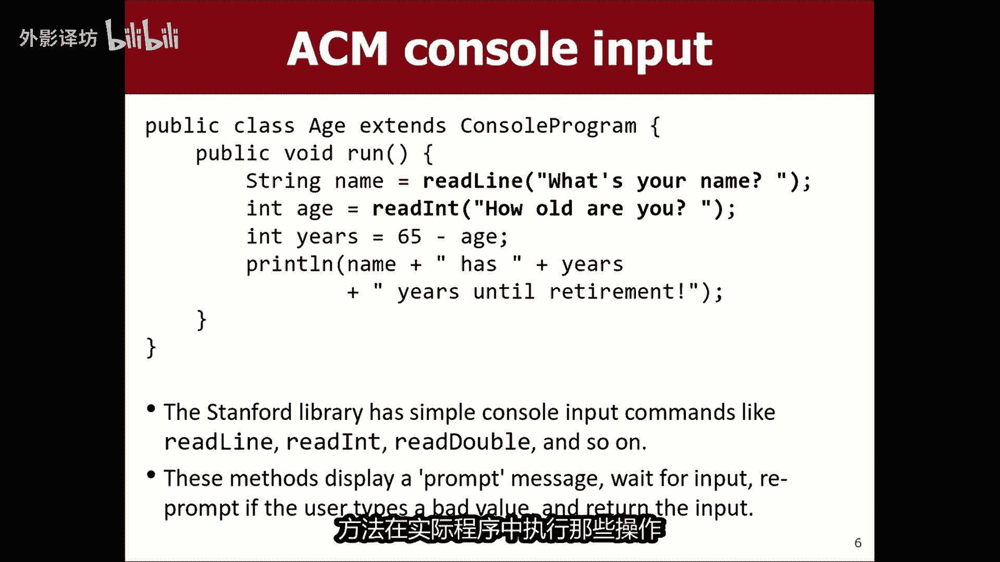

**使用标准Java：**
在标准Java中，需要用到`Scanner`类，并且提示和读取是分开的步骤。
```java
import java.util.Scanner; // 需要导入Scanner

public class AgeProgram {
    public static void main(String[] args) {
        Scanner keyboard = new Scanner(System.in);
        System.out.print("What is your name? ");
        String name = keyboard.nextLine();
        System.out.print("How old are you? ");
        int age = keyboard.nextInt();
        // ... 后续计算
        keyboard.close(); // 记得关闭Scanner
    }
}
```
**注意：** 标准Java的`Scanner`不会自动验证输入格式。如果用户输入非数字时调用`nextInt()`，程序会崩溃（抛出`InputMismatchException`），而斯坦福库的`readInt()`会持续提示直到输入有效。这使得斯坦福库对初学者更友好。

---

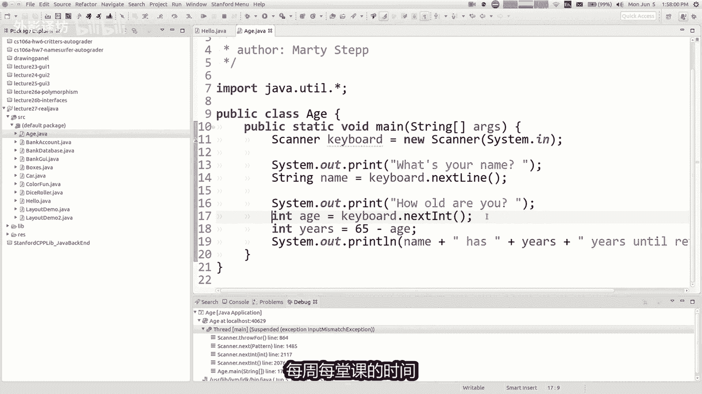

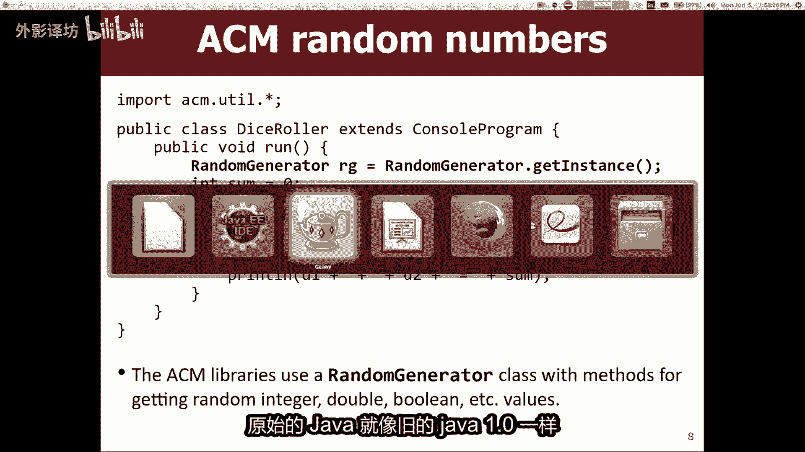

## 🎲 随机数生成
生成随机数是另一个常见操作，两种方式也有所不同。

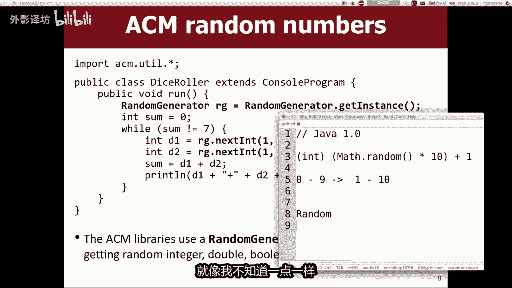

**使用斯坦福库 (`RandomGenerator`)：**
```java
import acm.util.*;
RandomGenerator rg = RandomGenerator.getInstance();
int dieRoll = rg.nextInt(1, 6); // 生成1到6之间的整数
```

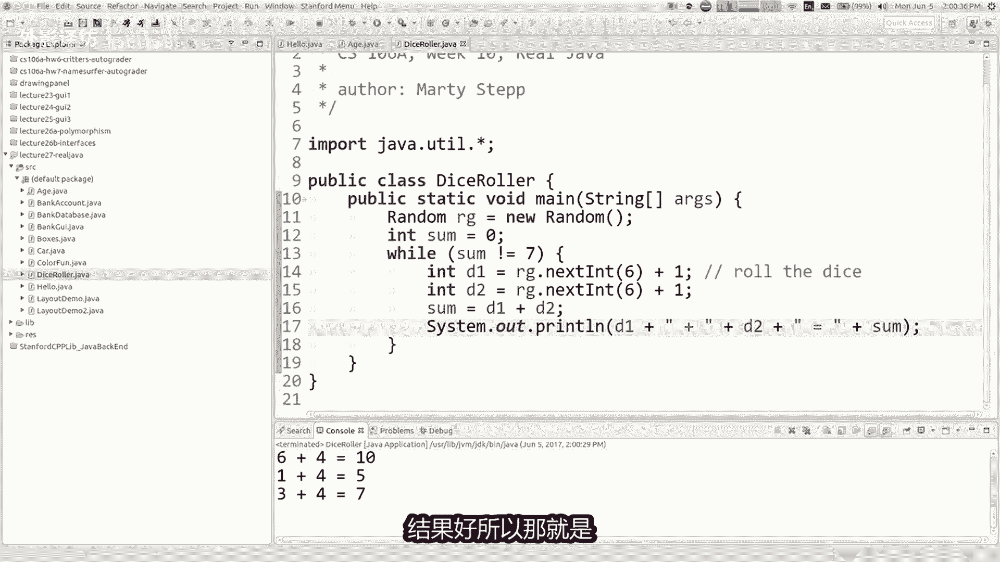

**使用标准Java (`java.util.Random`)：**
```java
import java.util.Random;

public class DiceRoll {
    public static void main(String[] args) {
        Random rand = new Random();
        // nextInt(n) 生成 [0, n) 的整数
        int dieRoll = rand.nextInt(6) + 1; // 转换为1到6
        System.out.println("You rolled: " + dieRoll);
    }
}
```
标准Java的`Random`类需要手动进行范围偏移来获得特定区间的值。

---

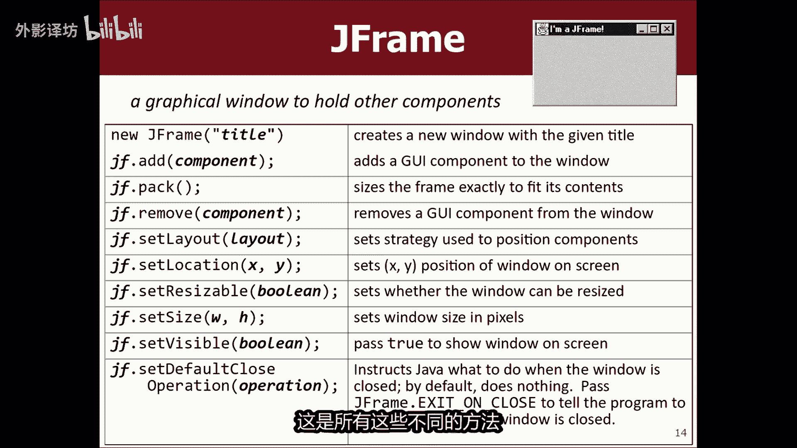

## 🖼️ 图形用户界面（GUI）编程
图形界面是斯坦福库简化最多的部分。我们以一个简单的变色窗口程序为例。

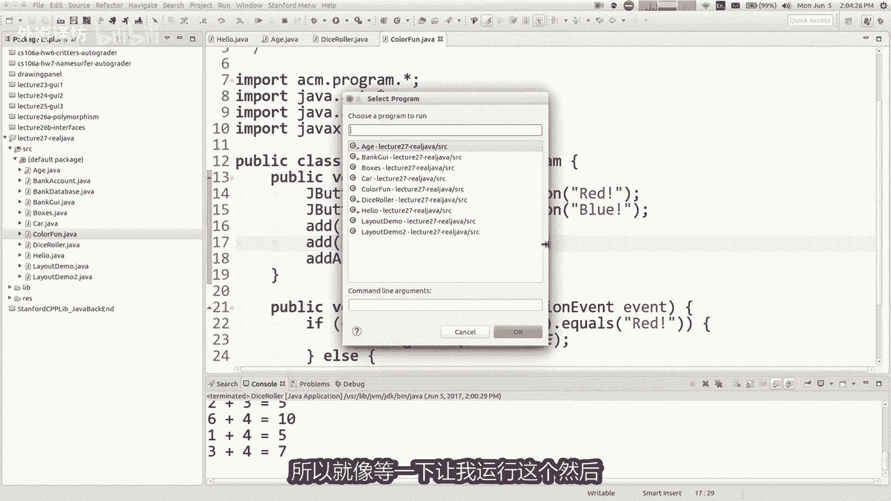

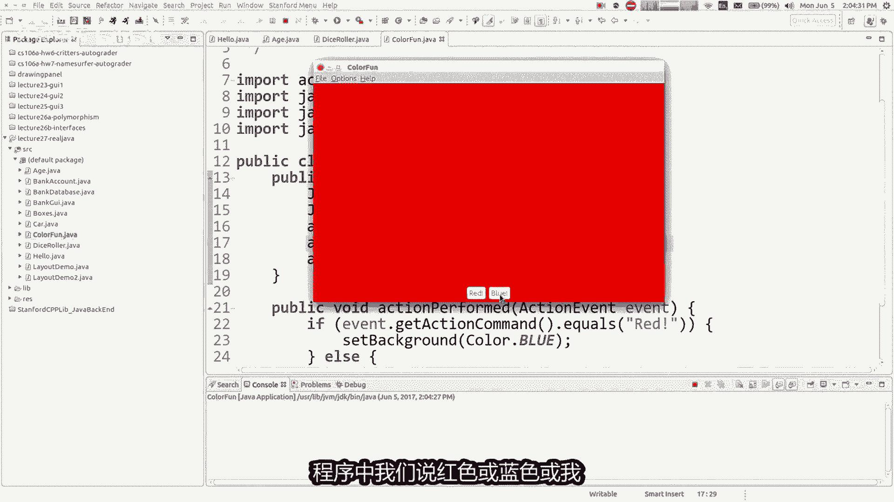

**使用斯坦福库 (`Program`)：**
```java
import acm.program.*;
import java.awt.*;
import javax.swing.*;
public class ColorFun extends Program {
    public void init() {
        add(new JButton("Red"), SOUTH);
        add(new JButton("Blue"), SOUTH);
        addActionListeners();
    }
    public void actionPerformed(ActionEvent e) {
        String cmd = e.getActionCommand();
        if (cmd.equals("Red")) {
            setBackground(Color.RED);
        } else if (cmd.equals("Blue")) {
            setBackground(Color.BLUE);
        }
    }
}
```

**使用标准Java (`JFrame`, `JButton`)：**
转换为标准Java需要更多步骤：
```java
import java.awt.*;
import java.awt.event.*;
import javax.swing.*;

public class ColorFunReal implements ActionListener {
    private JFrame frame;
    private JButton centerButton; // 用于演示背景色变化

    public void init() {
        frame = new JFrame("Color Fun");
        frame.setDefaultCloseOperation(JFrame.EXIT_ON_CLOSE);
        frame.setSize(500, 300);

        // 创建按钮并添加监听器
        JButton redButton = new JButton("Red");
        redButton.addActionListener(this);
        JButton blueButton = new JButton("Blue");
        blueButton.addActionListener(this);

        // 使用面板容纳多个按钮
        JPanel southPanel = new JPanel(new FlowLayout());
        southPanel.add(redButton);
        southPanel.add(blueButton);

        centerButton = new JButton("Hi");
        frame.add(centerButton, BorderLayout.CENTER);
        frame.add(southPanel, BorderLayout.SOUTH);

        frame.setVisible(true);
    }

    public void actionPerformed(ActionEvent e) {
        String cmd = e.getActionCommand();
        if (cmd.equals("Red")) {
            centerButton.setBackground(Color.RED);
        } else if (cmd.equals("Blue")) {
            centerButton.setBackground(Color.BLUE);
        }
    }

    public static void main(String[] args) {
        // 需要创建对象并调用初始化方法
        ColorFunReal gui = new ColorFunReal();
        gui.init();
    }
}
```
**关键区别：**
1.  **窗口管理**：必须显式创建`JFrame`，设置大小(`setSize`)，并使其可见(`setVisible(true)`)。
2.  **布局管理**：直接向`JFrame`添加多个组件到同一区域会覆盖，通常需要中间容器（如`JPanel`）。
3.  **事件监听**：必须让主类`implements ActionListener`，并显式地为每个按钮调用`addActionListener(this)`。
4.  **程序入口**：必须有`main`方法，并在其中创建GUI对象来启动程序。
5.  **背景设置**：不能直接设置`JFrame`的背景，通常需要设置其中某个组件的背景。

---

## 🎨 图形绘制
斯坦福库的`acm.graphics`包提供了面向对象的图形模型（如`GRect`, `GOval`等对象），可以轻松地移动和修改图形。这在标准Java中实现起来更为复杂。

**标准Java绘图方式：**
在标准Java中，绘图通常通过重写`paintComponent`方法，使用`Graphics`对象（像一支笔）直接绘制像素。
```java
public class Drawing extends JPanel {
    @Override
    protected void paintComponent(Graphics g) {
        super.paintComponent(g);
        g.setColor(Color.RED);
        g.fillOval(50, 50, 100, 100); // 绘制一个实心圆
    }
}
```
如果需要制作动画或管理多个可交互的图形对象，标准Java需要开发者自行维护所有图形状态（坐标、颜色等），复杂度大大增加。斯坦福库的面向对象图形模型在此优势明显。

---

## ⚖️ 总结：利弊权衡
本节课中我们一起学习了如何脱离斯坦福库编写标准Java程序，并对比了两种方式的差异。

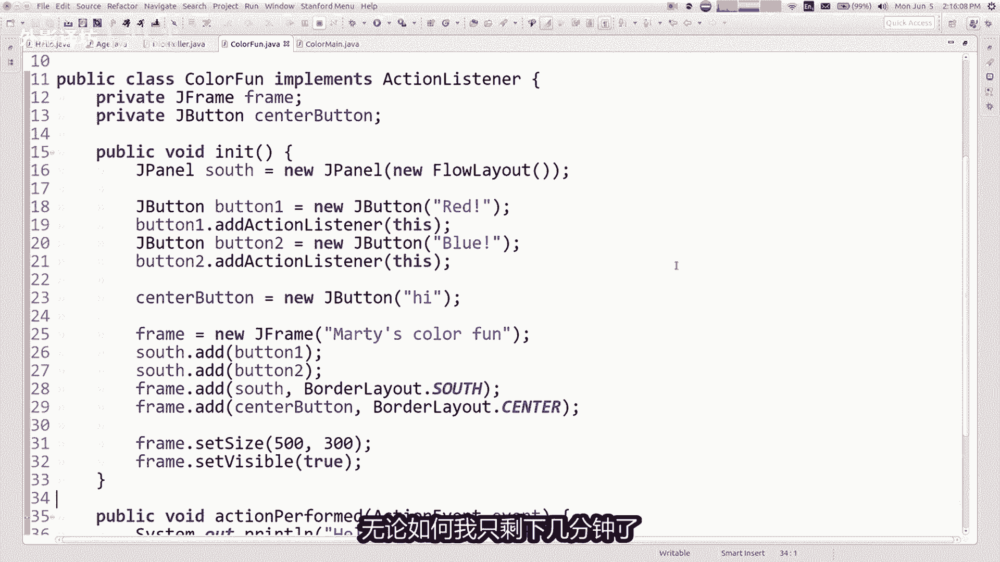

**使用斯坦福库的优点：**
*   **简化学习**：隐藏了`public static void main`等初始复杂度。
*   **友好输入**：`readInt`等方法内置输入验证和提示。
*   **强大图形**：`GObject`体系让图形编程和动画更直观。
*   **快速上手**：能让学生更快地编写出有趣的图形程序（如“突破”游戏）。

**使用斯坦福库的潜在顾虑：**
*   **技能迁移**：学生可能担心所学知识不能直接用于其他环境。
*   **理解底层**：库可能掩盖了Java标准API的工作原理。

**最终思考：**
本课程的核心目标是教授编程的基本概念（变量、循环、方法、对象、事件处理等），这些概念是通用的，不依赖于特定库。在掌握了这些概念和基于库的编程后，过渡到标准Java主要是学习新的API和少量不同的语法模式，这个过程会相对快速。

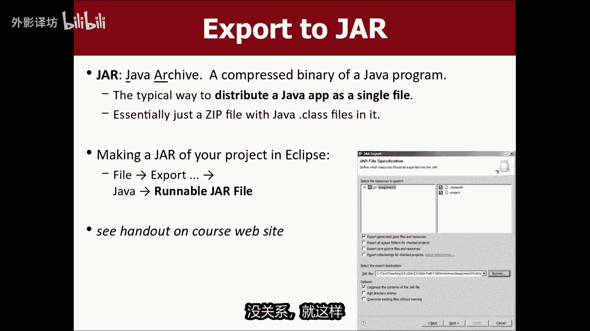

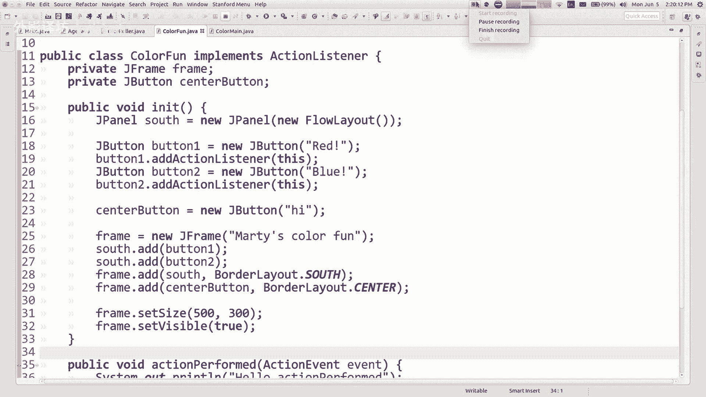

对于希望分发自己程序的同学，可以查阅课程网站上关于创建可执行JAR文件的讲义，以便将程序分享给他人运行。