# 课程 03：与 Karel 一起解决问题 🧩

在本节课中，我们将学习如何利用方法、循环和条件语句来解决更复杂的 Karel 机器人问题。我们将通过编写一个“扫地”程序来实践，并深入理解 `while` 循环和“栅栏柱”问题等核心概念。

---


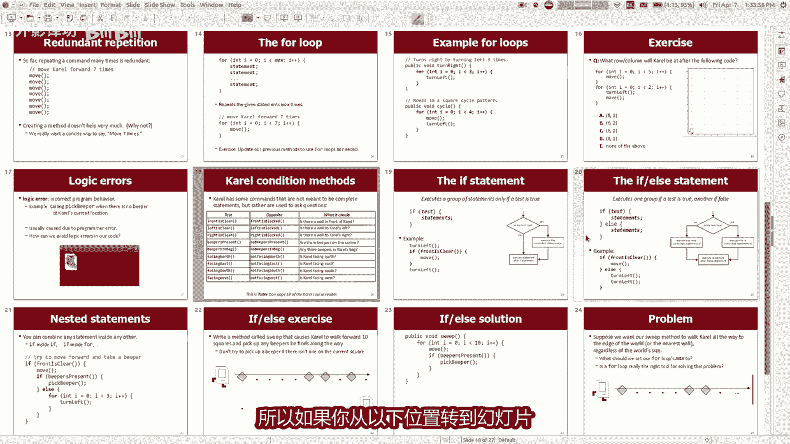

## 课程公告与作业说明

以下是本课程相关的几则简短公告。

第一，关于讨论部分的注册。请在周日晚上五点前完成注册，并告知我们你有空的时间。我会在今晚或明天发送提醒邮件。请尽快使用你的手机或电脑提交注册信息。下周初，我们会通知你被分配到的讨论部分。如果你忘记在周日之前提交，很可能无法获得你的第一选择。

第二，我已经发布了第一份家庭作业。这是一套 Karel 机器人问题，我希望你们尝试解决。下课时我会再详细说明。作业包含了所有必需的材料。本周末，你们可以开始处理这门课的大部分作业。

对于第一份作业，允许两人一组合作完成。虽然我希望你们能与朋友交流想法、代码和课程材料，但我不希望你们直接分享解决方案或一起解决问题。因此，请不要结对完成第一个作业。

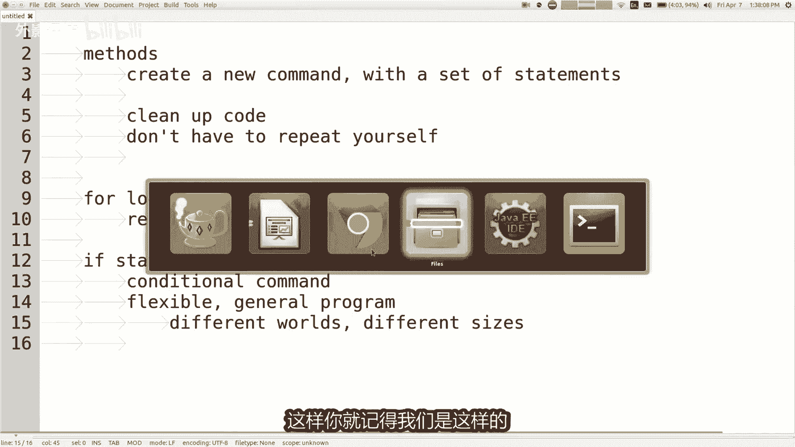

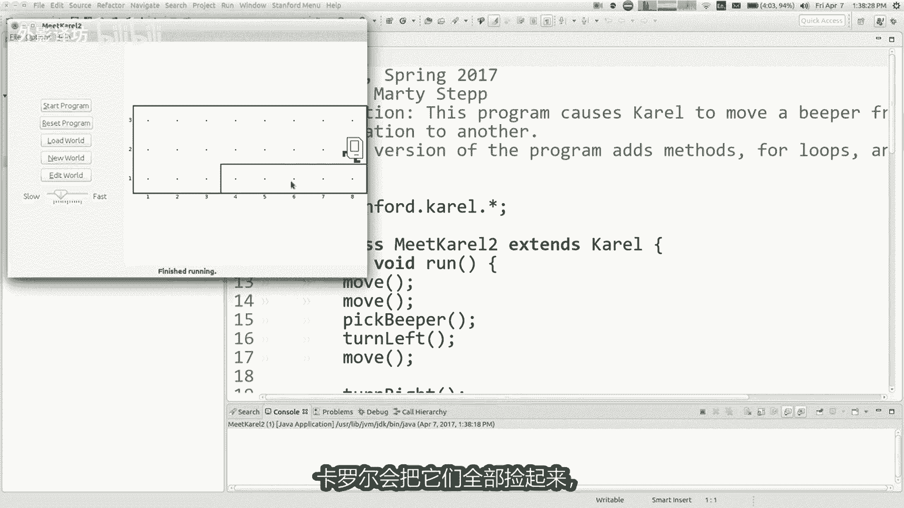

总的来说，我给你们的成功建议是：不要等到最后一刻才开始。我知道这听起来像是老生常谈，但这些作业往往具有一定挑战性，这门课程本身也具有挑战性。如果你提早开始，遇到困难时可以从周日或周一开始来我们的实验室寻求帮助。你等待的时间越长，实验室里的人就会越多。如果你想成功，我建议尽早开始作业。


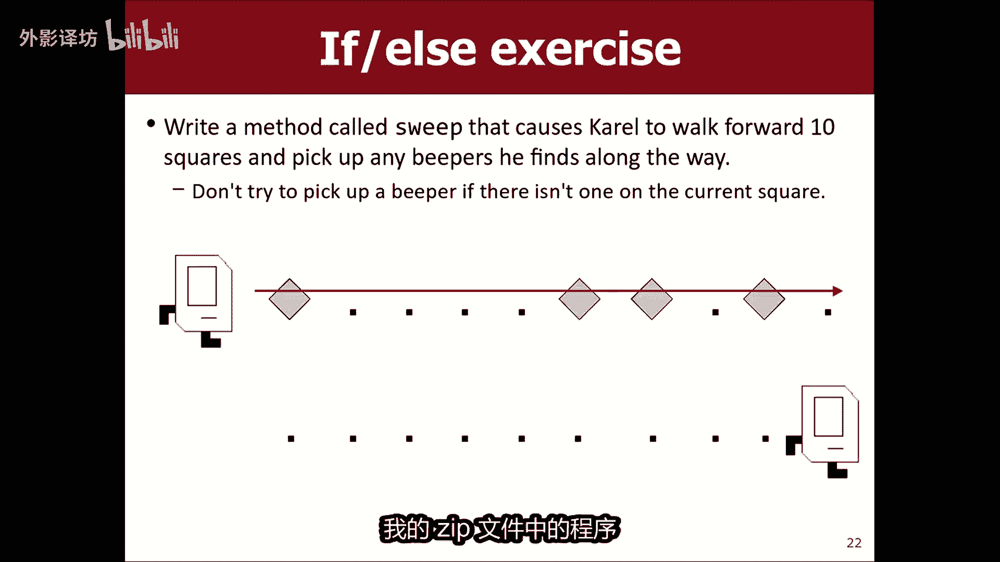

每项作业都基于讲座材料。下周要交的作业不需要用到今天之后的内容。理论上，凭借今天教授的知识，你已经可以开始并完成整个作业。作业已经发布，我稍后会详细讨论。

---

## 回顾核心编程概念

上一节课我们介绍了一些编程基础。本节中，我们来快速总结一下方法、`for` 循环和 `if` 语句。

### 方法 (Methods)


**方法**是什么？它有什么用？为什么要在程序中使用方法？


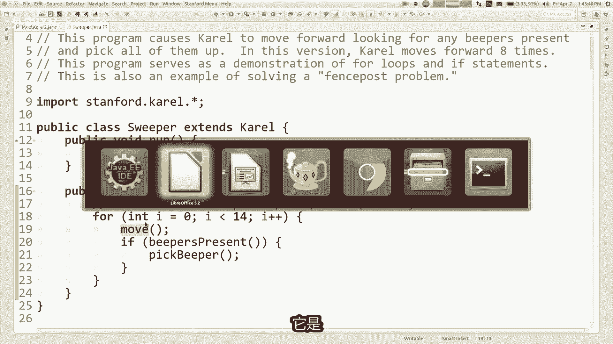

方法可以将一系列现有命令组合成一个新命令。它有助于清理代码，避免重复编写相同的语句组。如果你需要反复做同一组操作，只需写下新方法的名称并反复调用它，这样代码会更简短、更清晰。


### For 循环

**`for` 循环**用于将一个命令或一组命令重复执行给定的次数。虽然其初始语法可能看起来有些复杂，但它功能强大。例如，如果你想做某件事 1000 次，使用 `for` 循环比粘贴代码行 1000 次要好得多。

方法和 `for` 循环都有助于避免冗余，但它们的用途略有不同。方法适合将相关事物分组，而 `for` 循环适合重复执行固定次数的操作。

### If 语句

**`if` 语句**使程序更加灵活。它检查当前世界中某个条件是否为真（例如，Karel 所站的位置有蜂鸣器吗？前面有墙吗？），然后根据结果决定是否执行一段代码。这允许你的程序对不同情况做出反应，从而编写出能在多种不同世界上成功运行的通用程序。

---

## 实践：编写扫地程序


现在，让我们应用这些概念来编写一个程序。我们将写一个“扫地”程序，让 Karel 向前走并捡起所有蜂鸣器。


我们之前写过一个程序，让 Karel 走五步，并在每一步检查并捡起蜂鸣器。代码如下：


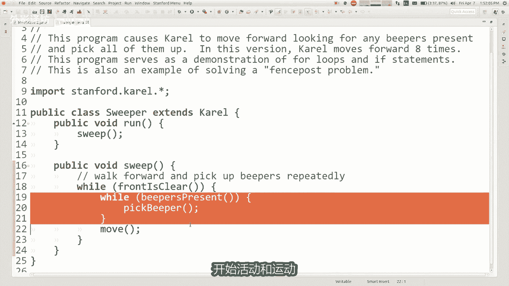

```java
for (int i = 0; i < 5; i++) {
    move();
    if (beepersPresent()) {
        pickBeeper();
    }
}
```

但这个世界有九个方格。如果 Karel 从位置 1 开始，走到位置 9 需要移动 8 次。所以，我应该将循环改为 8 次。


然而，如果世界的大小不同呢？例如，一个更大的世界有 15 个方格，我需要移动 14 次。但如果我把循环改为 14 次，然后在原来的小世界上运行，Karel 会在尝试第 9 次移动时撞墙并报错。

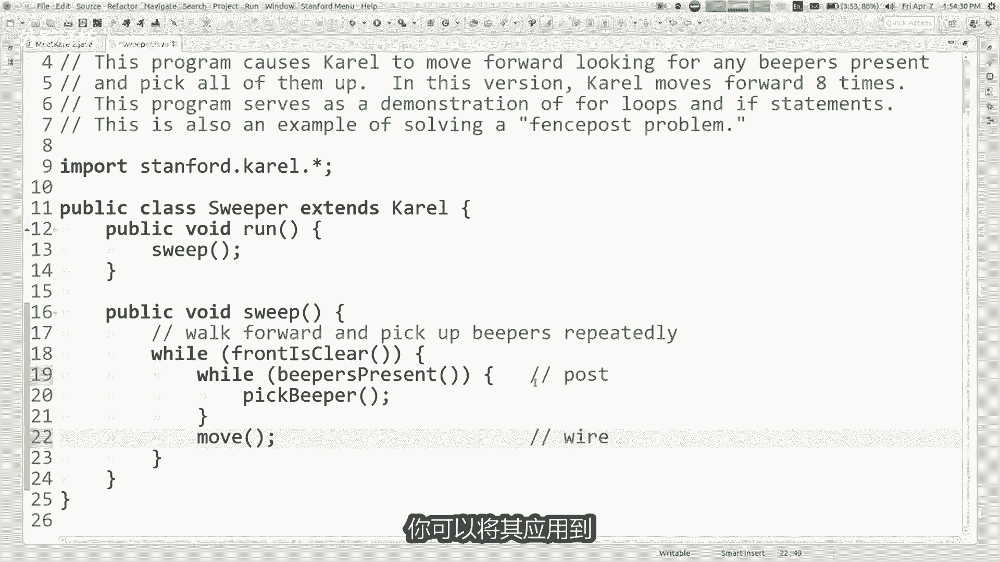


我们希望 Karel 一直走，直到无法前进为止。`for` 循环并不适合这种情况，因为它要求确切知道循环次数。

---

## 引入 While 循环

当我们想重复执行某操作，但不知道具体需要多少次，只要某个条件为真就继续时，我们需要另一种结构：**`while` 循环**。

`while` 循环的语法与 `if` 语句相似：
```java
while (condition) {
    // 要重复执行的代码
}
```
区别在于：`if` 语句检查条件，如果为真就执行一次代码块；`while` 循环则会反复检查条件，只要条件为真，就重复执行代码块。

对于扫地程序，我们可以这样写：
```java
while (frontIsClear()) {
    move();
    if (beepersPresent()) {
        pickBeeper();
    }
}
```
这样，Karel 就会一直向前走并捡起蜂鸣器，直到前面被挡住为止。

---

## 解决“栅栏柱”问题

但上面的代码还有一个问题：它假设每个方格最多只有一个蜂鸣器。如果一个方格有多个蜂鸣器（显示为数字），Karel 每次执行 `pickBeeper()` 只会捡起一个。

我们需要修改代码，确保捡起一个方格上的所有蜂鸣器。我们可以将 `if` 语句改为 `while` 循环：
```java
while (frontIsClear()) {
    move();
    while (beepersPresent()) {
        pickBeeper();
    }
}
```
现在，对于每个方格，只要上面有蜂鸣器，Karel 就会一直捡，直到捡完为止。

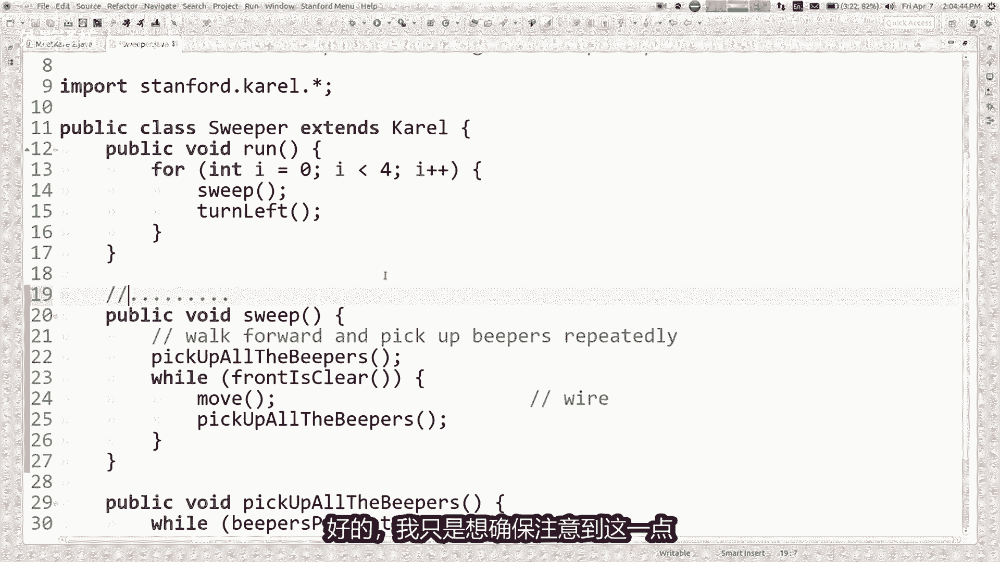

然而，这又引入了另一个经典问题——“栅栏柱”问题。在这个比喻中，“柱子”是“捡蜂鸣器”操作，“电线”是“移动”操作。在一个有 N 个方格的世界里，我们需要 N 次“捡蜂鸣器”（从起点方格开始），但只需要 N-1 次“移动”（在方格之间）。

我们当前的算法将“移动”和“捡蜂鸣器”配对在一起，这永远无法正确处理起点方格的蜂鸣器，因为 Karel 总是先移动再检查。

解决方案是调整顺序，在循环外先处理第一个“柱子”（起点方格的蜂鸣器），然后在循环内执行“电线-柱子”对（移动，然后处理新方格的蜂鸣器）。修改后的代码如下：
```java
// 处理起点方格（第一个“柱子”）
while (beepersPresent()) {
    pickBeeper();
}
while (frontIsClear()) {
    move(); // “电线”
    // 处理新方格的蜂鸣器（下一个“柱子”）
    while (beepersPresent()) {
        pickBeeper();
    }
}
```
这样，Karel 就能正确捡起所有方格（包括起点）的所有蜂鸣器了。

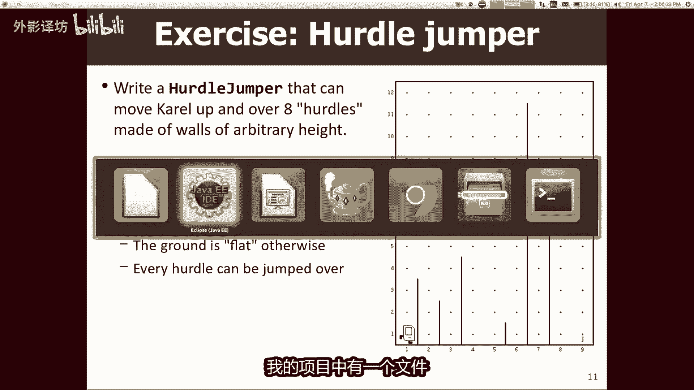

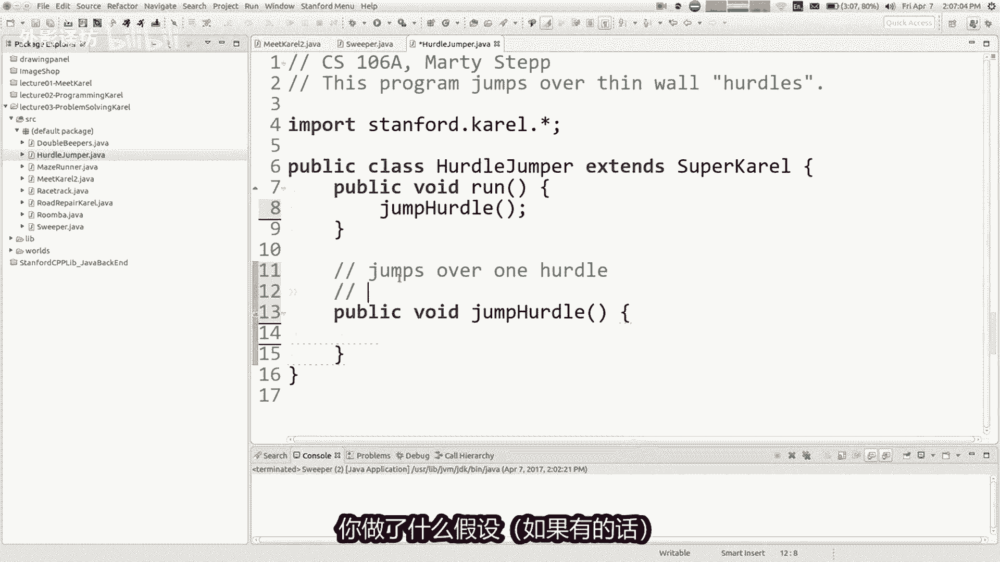

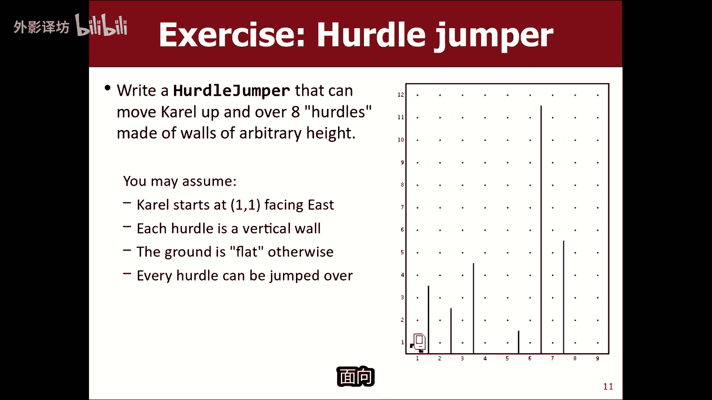

---

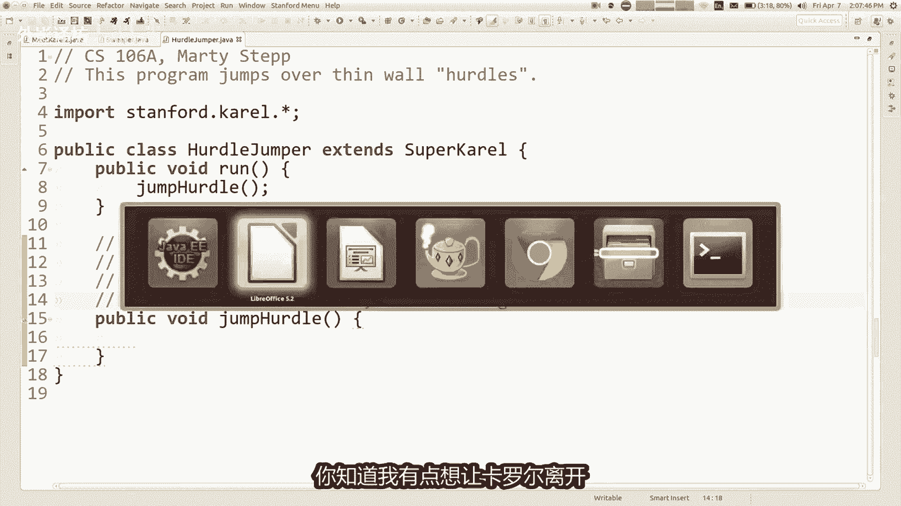

## 扩展挑战：清理矩形世界

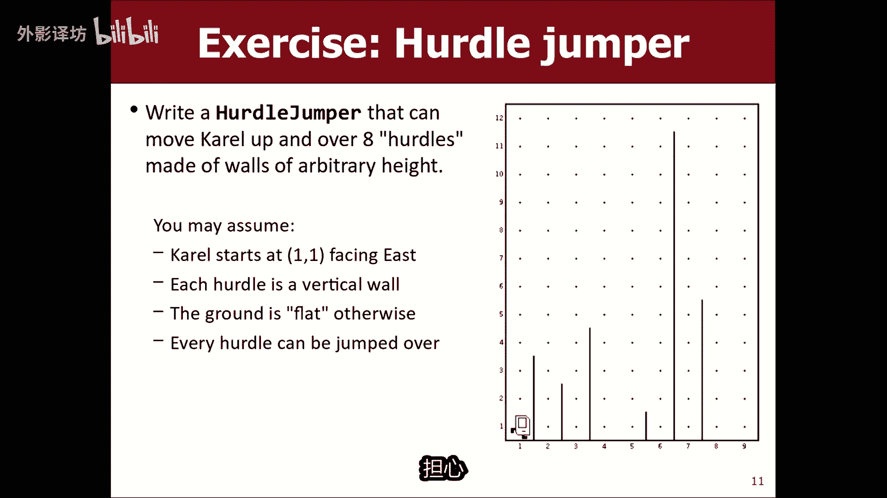


假设我们想让 Karel 清理一个矩形世界的所有四条边。我们可以利用刚才写好的 `sweep` 方法（它清理一行直到墙边），然后重复四次：清扫一行，右转。


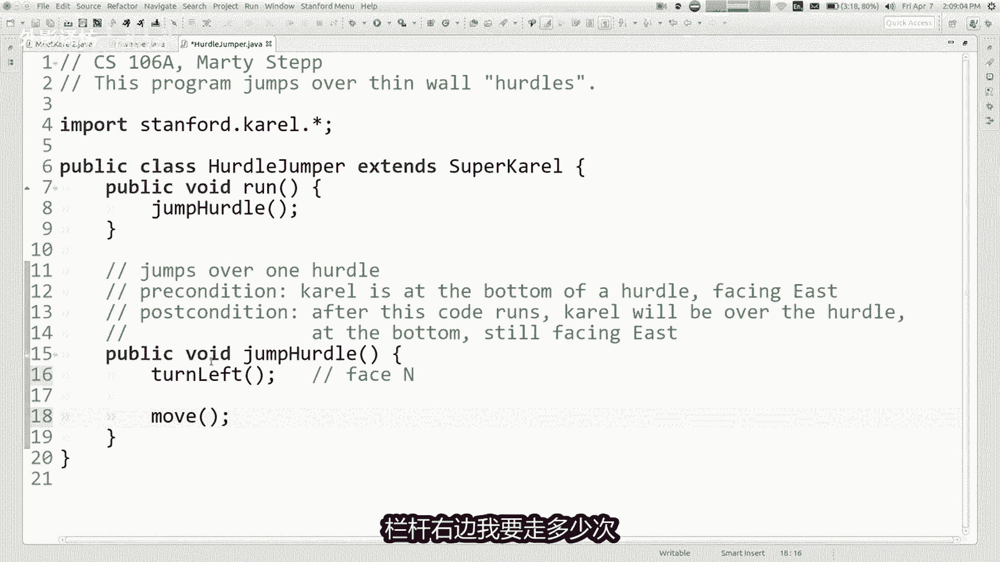


代码如下：
```java
for (int i = 0; i < 4; i++) {
    sweep(); // 假设 sweep() 是我们封装好的清扫一行的方法
    turnRight();
}
```
这里我们使用了 `for` 循环，因为我们确切地知道需要清扫四条边。将 `sweep` 定义为独立方法，使得主程序逻辑非常清晰。


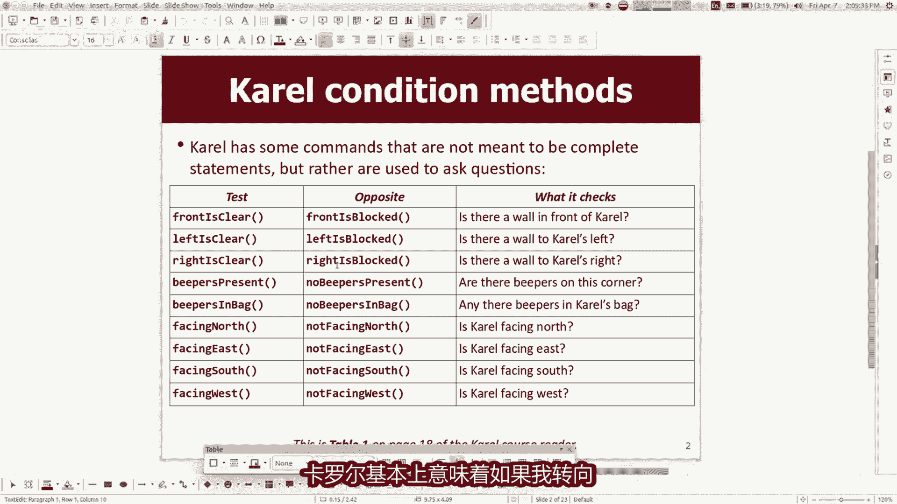

---

## 另一个例子：跨栏

现在来看一个更难的问题：让 Karel 跳过一系列高度未知的栅栏。我们首先将大问题分解：先编写一个跳过单个栅栏的方法 `jumpHurdle`。

编写方法时，明确**前置条件**和**后置条件**是很好的实践：
*   **前置条件**：假设 Karel 在栅栏底部，面朝东。
*   **后置条件**：代码运行后，Karel 将跳过栅栏，并仍然面朝东。

这样，我们就可以在 `run` 方法中简单地多次调用 `jumpHurdle` 来跳过所有栅栏。一个跳过单个栅栏的 `jumpHurdle` 方法可能如下所示：
```java
public void jumpHurdle() {
    turnLeft();
    while (rightIsBlocked()) {
        move();
    }
    turnRight();
    move();
    turnRight();
    while (frontIsClear()) {
        move();
    }
    turnLeft();
}
```
然后，跳过 8 个栅栏的主程序就是：
```java
for (int i = 0; i < 8; i++) {
    jumpHurdle();
}
```

---


## 作业概览

最后，我来简要介绍下已发布的第一份作业。你们需要下载作业包并导入 Eclipse。作业包含以下几个 Karel 问题：
1.  **收集报纸**：让 Karel 去某个方格取回报纸。
2.  **石匠**：查找缺失的砖块并用石头填充，以建造石柱。
3.  **棋盘**：在世界上填充棋盘图案。
4.  **终点线**：将 Karel 移动到世界的正中间并放置一个蜂鸣器（这可能具有欺骗性）。
5.  **双重蜂鸣器**（可选）：一个可以自由发挥创意的附加问题。


作业截止日期是下周五晚上。请愉快地开始吧！

---

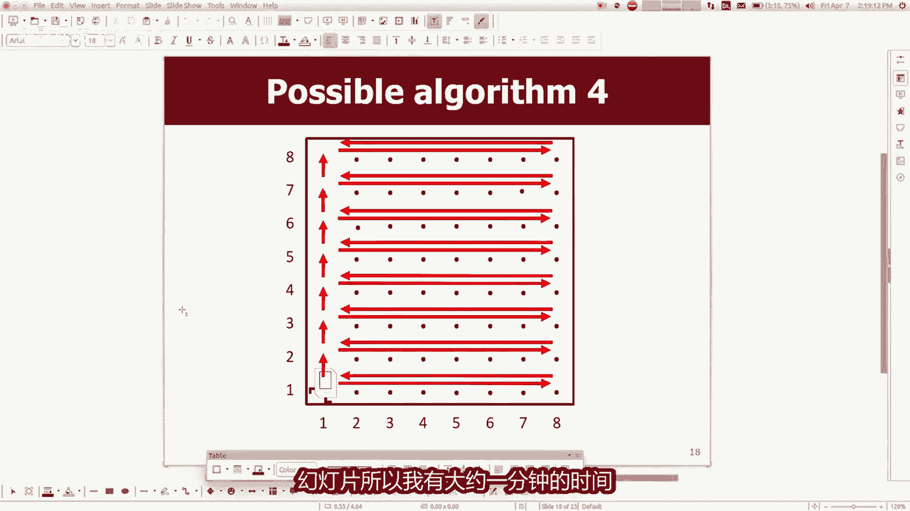

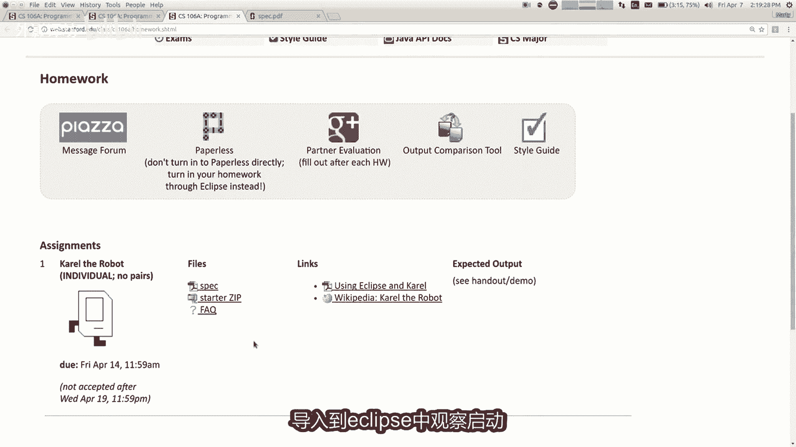

## 总结


本节课中，我们一起学习了：
*   回顾了**方法**、**`for` 循环**和**`if` 语句**的核心概念。
*   引入了 **`while` 循环**，用于在条件为真时重复执行代码。
*   通过编写“扫地”程序，实践了循环和条件判断。
*   理解并解决了经典的“**栅栏柱**”问题。
*   学习了通过定义方法（如 `jumpHurdle`）来**分解复杂问题**的策略。
*   了解了第一份作业的内容和要求。

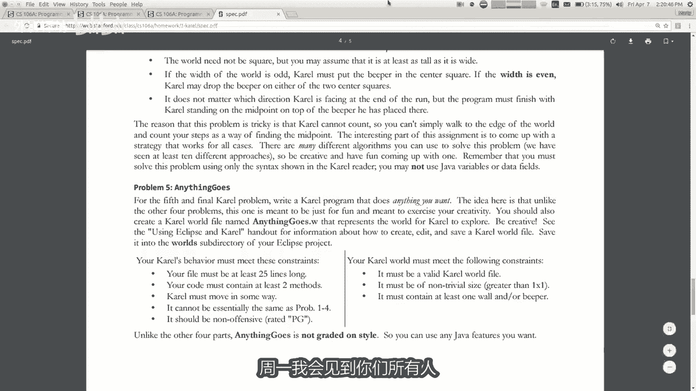

记住，编程的关键在于将大问题分解为小步骤，并经常测试你的代码。祝你们作业顺利！