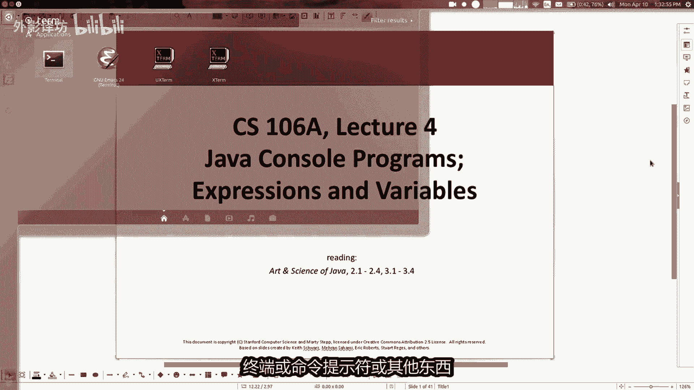
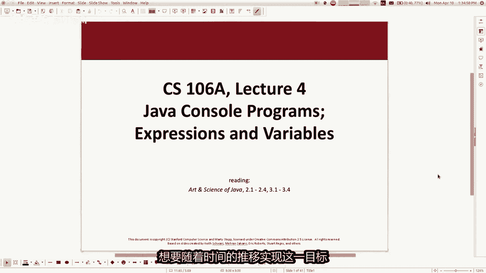
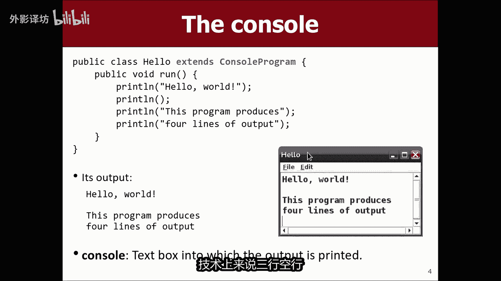
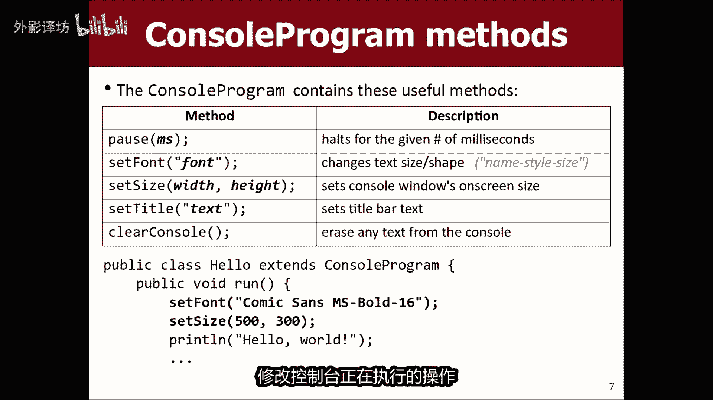
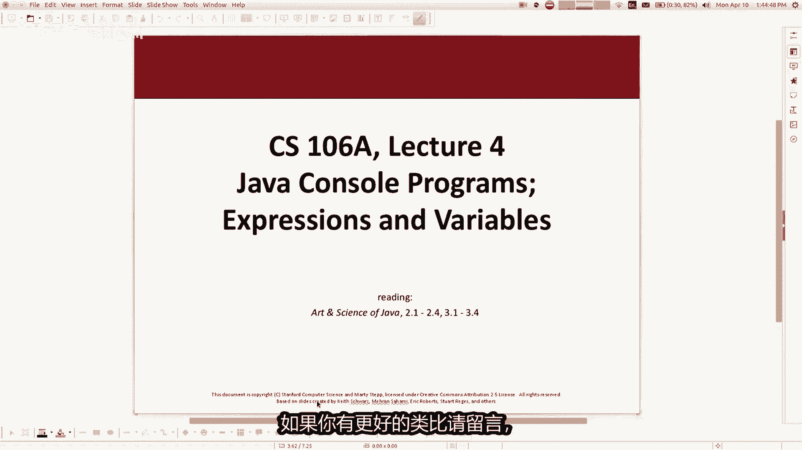
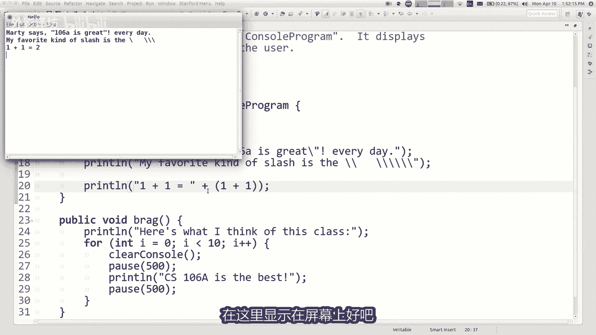
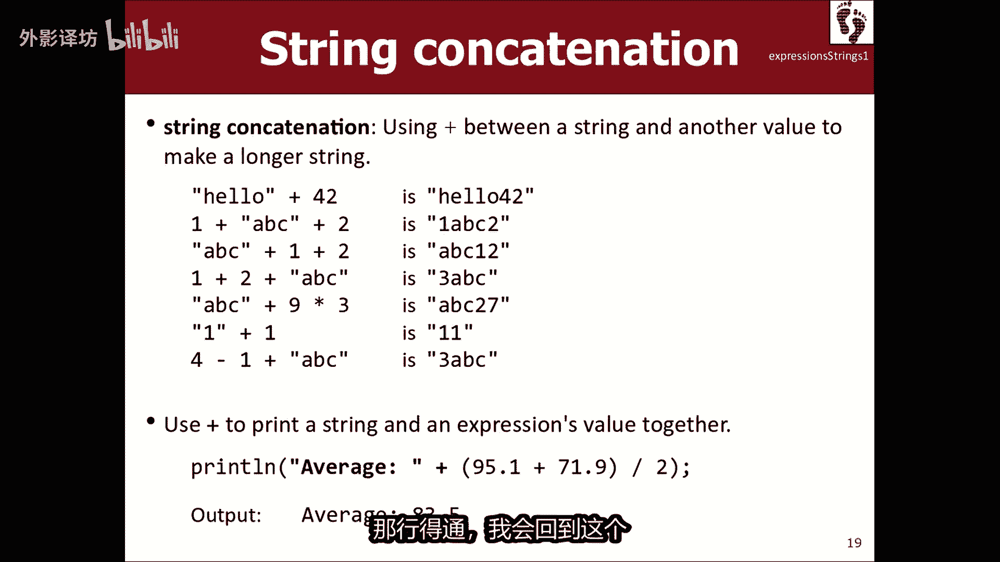
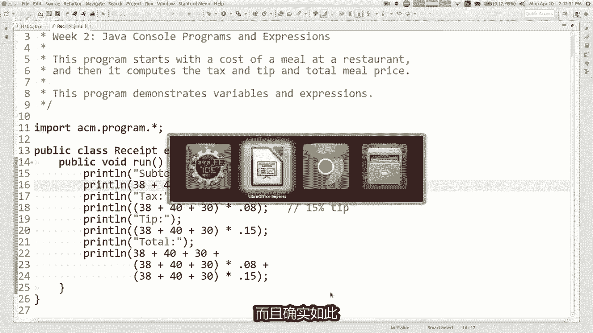
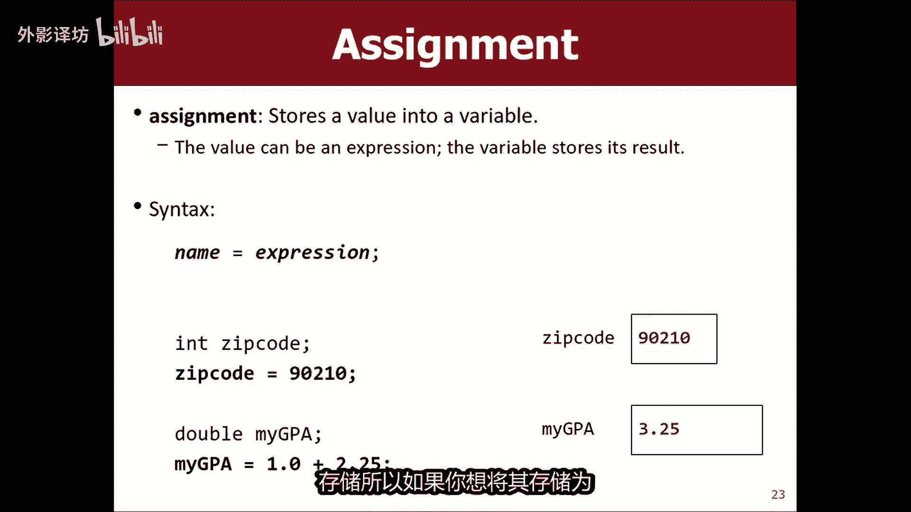

# 课程04：控制台与表达式 📟

在本节课中，我们将要学习控制台编程的基础知识，以及如何使用表达式进行数学计算。我们将从图形化的Karel世界转向更通用的Java程序，学习如何通过简单的文本与控制台与用户交互。

---




## 概述


上一节我们介绍了Karel机器人编程，本节中我们来看看如何编写更通用的Java程序。我们将学习一种称为“控制台程序”的简单程序类型，它通过文本与用户交互。同时，我们将深入理解Java中的基本数据类型和表达式，学习如何让计算机进行计算。



---

## 什么是控制台程序？ 🖥️



控制台程序是一种非常简单的程序，它通过一个纯文本的矩形窗口（称为控制台或终端）与用户交互。这个窗口可以显示文本信息，并接收用户输入的文本命令。


虽然它没有华丽的图形界面，但它是学习编程基础、理解程序逻辑和计算过程的绝佳起点。


**控制台程序的基本结构**：
```java
public class MyProgram extends ConsoleProgram {
    public void run() {
        // 你的代码写在这里
    }
}
```
与之前扩展 `Karel` 不同，现在我们扩展 `ConsoleProgram`。

---

## 输出信息：`println` 语句

在控制台上显示信息是程序与用户沟通的主要方式。我们可以使用 `println` 语句（意为“打印一行”）来输出文本。


**语法**：
```java
println("你想要显示的消息");
```
消息必须用双引号 `" "` 包围，这被称为**字符串**。


**示例**：
```java
println("CS106A是最棒的！");
```
运行程序后，控制台窗口会弹出并显示这行文字。



---



### 转义序列

有时我们需要在字符串中包含一些特殊字符，例如引号本身或反斜杠。这时就需要使用**转义序列**，即在特殊字符前加上反斜杠 `\`。

以下是常见的转义序列：
*   `\"`：在字符串中表示一个双引号。
*   `\\`：在字符串中表示一个反斜杠。
*   `\n`：在字符串中表示换行。

**示例**：
```java
println("Marty说：\"CS106A每天都很棒！\""); // 输出包含引号
println("我最喜欢的符号是：\\"); // 输出一个反斜杠
```

---

## 进行计算：表达式与数据类型 🧮


计算机的核心功能之一是计算。在Java中，我们使用**表达式**来进行计算。表达式由**值**（字面量或变量）和**运算符**（如 `+`, `-`, `*`, `/`）组成。

### 基本数据类型



为了有效地处理数据，Java将数据分为不同的类型。我们首先关注两种用于数字的类型：

1.  **`int`**：表示**整数**（没有小数部分的数字），例如：`42`, `-7`, `0`。
2.  **`double`**：表示**实数**（带有小数部分的数字），例如：`3.14`, `-0.5`, `2.0`。

**为什么有两种数字类型？**
这与计算机底层处理整数和实数的方式不同有关。`int` 运算效率高，且能明确表示“只能是整数”的场景（如人数）。`double` 则可以表示更精确的小数计算结果。

### 算术运算符

以下是用于 `int` 和 `double` 的基本算术运算符：
*   `+`：加法
*   `-`：减法
*   `*`：乘法
*   `/`：除法
*   `%`：取模（求余数）

**整数除法 (`int / int`)** 有一个重要特点：结果会**丢弃小数部分**，直接向下取整。
```java
println(7 / 2); // 输出 3，而不是 3.5
println(14 / 4); // 输出 3
```

**取模运算符 (`%`)** 可以获取除法运算后的余数，非常实用。
```java
println(14 % 4); // 输出 2，因为 14 ÷ 4 = 3...2
println(8 % 2);  // 输出 0，用于判断偶数
```

### 运算符优先级

和数学中一样，表达式中的运算有先后顺序（优先级）：
1.  括号 `()` 拥有最高优先级。
2.  然后是乘法 `*`、除法 `/` 和取模 `%`。
3.  最后是加法 `+` 和减法 `-`。

**示例**：
```java
int result = 6 + 8 / 2 * 3;
// 计算顺序：8 / 2 = 4 -> 4 * 3 = 12 -> 6 + 12 = 18
println(result); // 输出 18
```

---



## 混合类型计算与字符串连接

### 类型混合运算

当表达式中同时出现 `int` 和 `double` 时，Java会将 `int` 自动提升为 `double`，然后进行 `double` 类型的运算。
```java
double result = 7 / 2 * 1.2 + 3 / 2;
// 计算顺序：7/2=3 (int) -> 3*1.2=3.6 (double) -> 3/2=1 (int) -> 3.6+1=4.6 (double)
println(result); // 输出 4.6
```

### 字符串连接


我们可以使用 `+` 号将字符串与表达式的计算结果连接起来。
```java
println("1 + 1 = " + (1 + 1)); // 输出：1 + 1 = 2
```
**注意**：由于 `+` 对于字符串是“连接”操作，对于数字是“加法”操作，优先级和结合顺序可能导致意外结果。使用括号可以确保先进行数学计算。
```java
println("结果是： " + 3 * 5); // 输出：结果是： 15 (乘法优先)
println("结果是： " + 1 + 1); // 输出：结果是： 11 (从左到右连接)
println("结果是： " + (1 + 1)); // 输出：结果是： 2 (括号优先)
```


---

## 避免冗余：使用变量 💾

在程序中，我们经常需要重复使用某个计算结果。反复书写相同的表达式不仅麻烦，而且容易出错。这时，我们可以使用**变量**。

变量就像是一个有名字的存储盒子，可以用来保存一个值（如表达式的结果），之后在程序中通过名字来引用这个值。



**使用变量的步骤**：
1.  **声明变量**：指定变量的**类型**和**名字**。
2.  **赋值**：将一个值存储到变量中。

**语法**：
```java
// 分开写
int total; // 1. 声明一个名为total的整数变量
total = 38 + 40 + 30; // 2. 将计算结果赋值给total


// 合并为一行（更常见）
int total = 38 + 40 + 30; // 声明并立即赋值
double taxRate = 0.08;
```



**示例：改进的账单程序**
```java
public class Receipt extends ConsoleProgram {
    public void run() {
        // 使用变量存储中间结果
        int subtotal = 38 + 40 + 30;
        double tax = subtotal * 0.08;
        double tip = subtotal * 0.15;
        double total = subtotal + tax + tip;

        // 输出清晰的账单
        println("小计：$" + subtotal);
        println("税费：$" + tax);
        println("小费：$" + tip);
        println("总计：$" + total);
    }
}
```
这样，如果需要修改菜品价格，只需更新 `subtotal` 的计算一处即可，程序更易维护。

**关于变量的重要规则**：
*   变量必须先声明，后使用。
*   变量通常只在声明它的 `{ }` 代码块内有效（例如，在某个方法内部）。我们将在后续课程详细讨论。

---

## 总结

本节课中我们一起学习了控制台编程的基础。我们了解了如何通过 `println` 语句在控制台输出信息，如何使用转义序列处理特殊字符。更重要的是，我们深入探讨了如何使用 `int` 和 `double` 数据类型进行数学计算，理解了运算符优先级、整数除法和取模运算的特点。最后，我们引入了**变量**的概念，它帮助我们存储和复用计算结果，让程序变得更加简洁和健壮。


通过控制台程序，我们掌握了程序与用户交互、处理数据的基本模式，这是学习所有更复杂编程概念的重要基石。