# 课程 05：控制语句 🎮

在本节课中，我们将学习如何让程序变得更加灵活和智能。我们将重点介绍如何从用户那里获取输入，以及如何使用条件判断（if/else）和循环（for）来控制程序的执行流程。这些是构建交互式程序的基础。

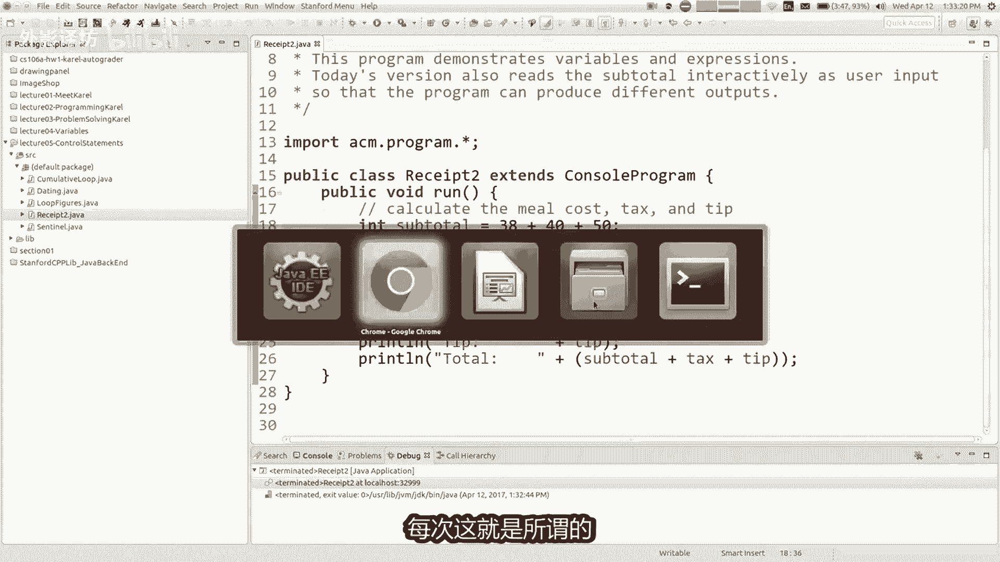

---

## 交互式程序与用户输入 💬

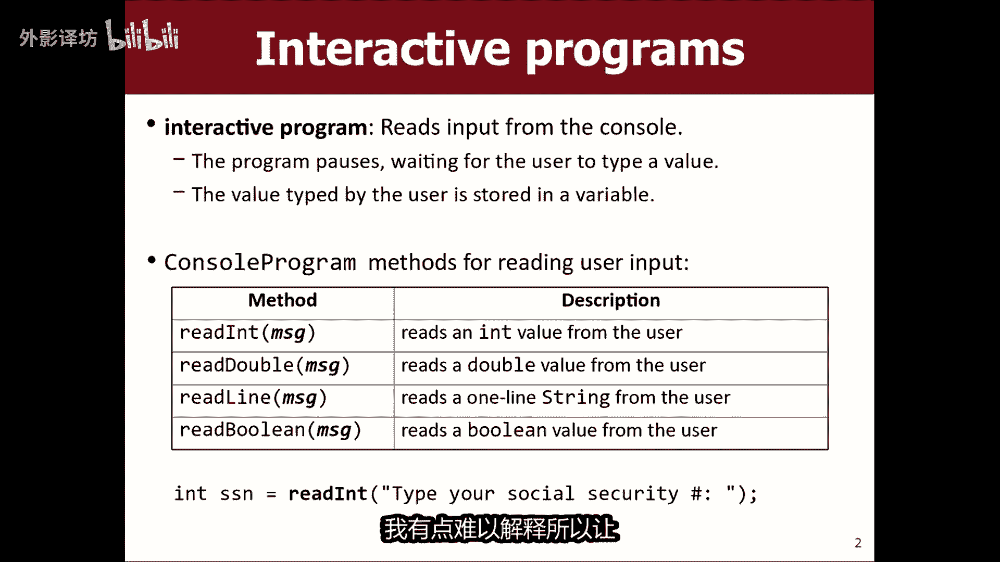

上一节我们介绍了变量，它们用于存储数据。但一个每次运行都做同样事情的程序并不实用。本节中，我们来看看如何让程序根据用户的输入做出不同的反应。

一个**交互式程序**会向用户提问，等待用户输入信息（例如一个数字），然后将这个值存储到变量中供程序后续使用。这避免了每次都需要修改源代码的麻烦。

在Java中，我们可以使用 `readInt`、`readDouble`、`readBoolean` 等命令来获取用户输入。它们的语法有些特别。

```java
int subtotal = readInt("小计是多少？");
```

当程序执行到 `readInt` 这一行时，它会暂停，在控制台显示提示信息，并等待用户输入一个整数。用户输入的数字会被“粘贴”到代码中，相当于直接给变量 `subtotal` 赋值。之后，程序的剩余部分就会使用这个新值来运行。

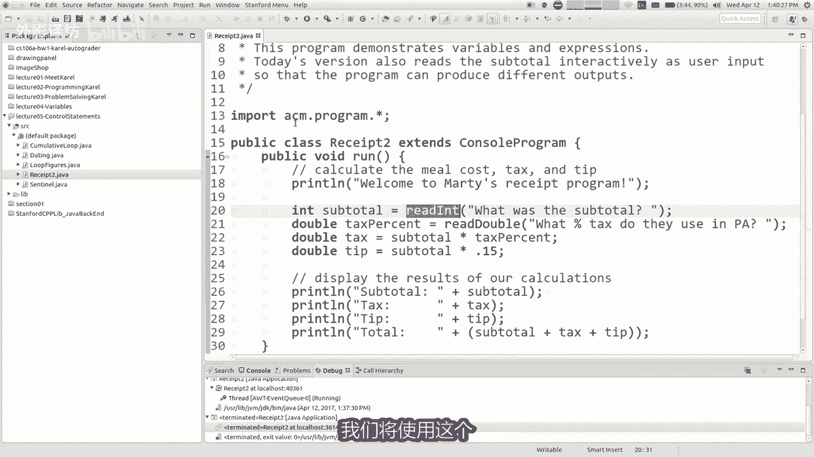

**核心概念**：`readInt("提示信息")` 会暂停程序，等待用户输入一个整数，并将该值返回。

---

## 关系运算符与条件判断 ⚖️

我们已经见过 `if` 语句，它让程序可以根据条件选择执行不同的代码块。现在，我们来更深入地了解可以放在 `if` 条件里的各种测试。

我们经常需要根据变量的值来提问。例如，询问用户年龄后，根据年龄打印不同的消息。这需要使用**关系（比较）运算符**。

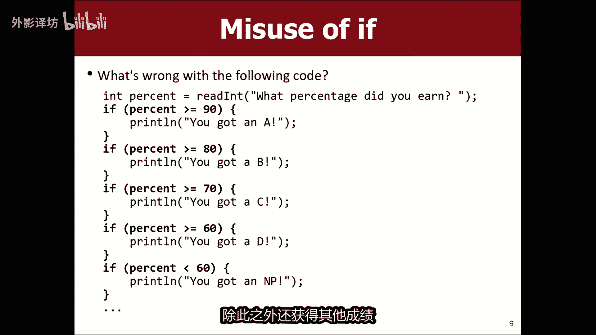

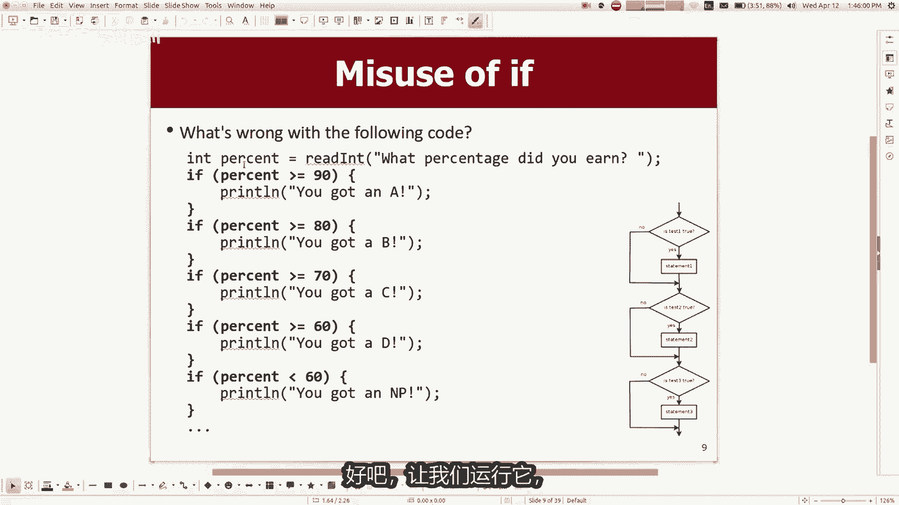

以下是常用的关系运算符：
*   **`<`** (小于)：`10 < 5` 的结果是 `false`。
*   **`>`** (大于)：`10 > 5` 的结果是 `true`。
*   **`<=`** (小于或等于)：`5 <= 5` 的结果是 `true`。
*   **`>=`** (大于或等于)：`10 >= 5` 的结果是 `true`。
*   **`==`** (等于)：`10 == 5` 的结果是 `false`。注意，比较相等需要使用**两个**等号。
*   **`!=`** (不等于)：`10 != 5` 的结果是 `true`。

> **注意**：单个等号 `=` 用于给变量赋值，所以比较相等必须用双等号 `==`。

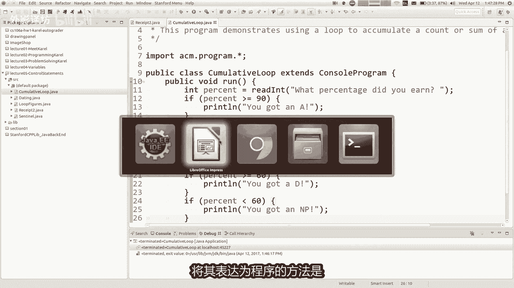

这些运算符的结果是 `true`（真）或 `false`（假），这被称为**布尔值**。`if` 语句会根据这个布尔值来决定是否执行其代码块。


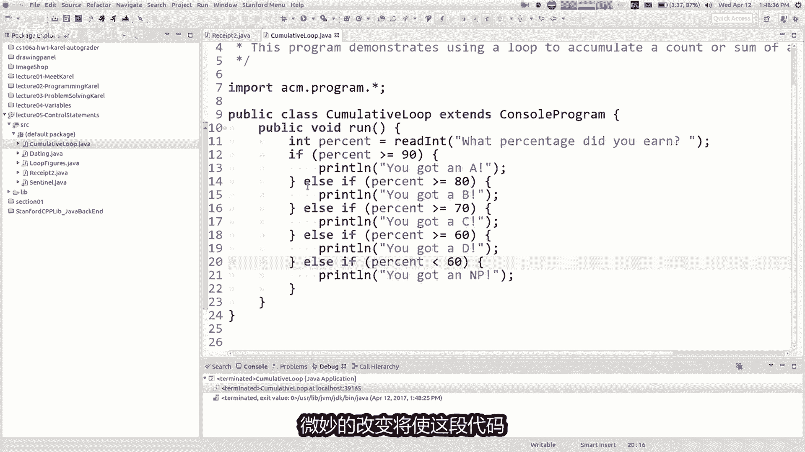

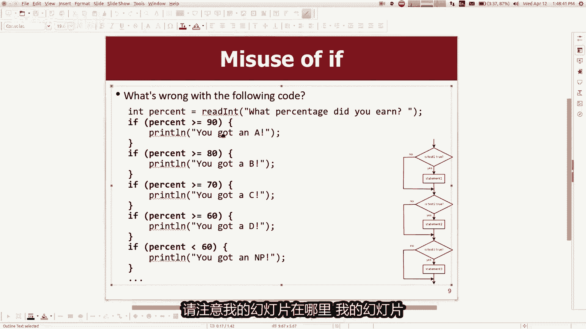

---

## 嵌套的 if/else 结构 🌳

有时我们需要进行一系列互斥的测试（例如成绩评级）。如果简单地连续使用多个 `if` 语句，可能会导致程序打印出多条消息，因为每个条件都会被独立检查。


以下是实现互斥测试的正确结构——**嵌套的 if/else**：


```java
if (score >= 90) {
    println("A");
} else if (score >= 80) {
    println("B");
} else if (score >= 70) {
    println("C");
} else {
    println("D");
}
```

这种结构的执行逻辑是：从上到下依次检查条件，只执行**第一个**为 `true` 的条件所对应的代码块，然后直接跳到整个结构结束。`else` 块用于处理所有前面条件都不满足的情况。

**重要区别**：
*   以 `else` 结尾：保证会执行其中一个分支。
*   以 `else if` 结尾：有可能所有条件都不满足，从而不执行任何分支。

---

## 逻辑运算符：与、或、非 🔗

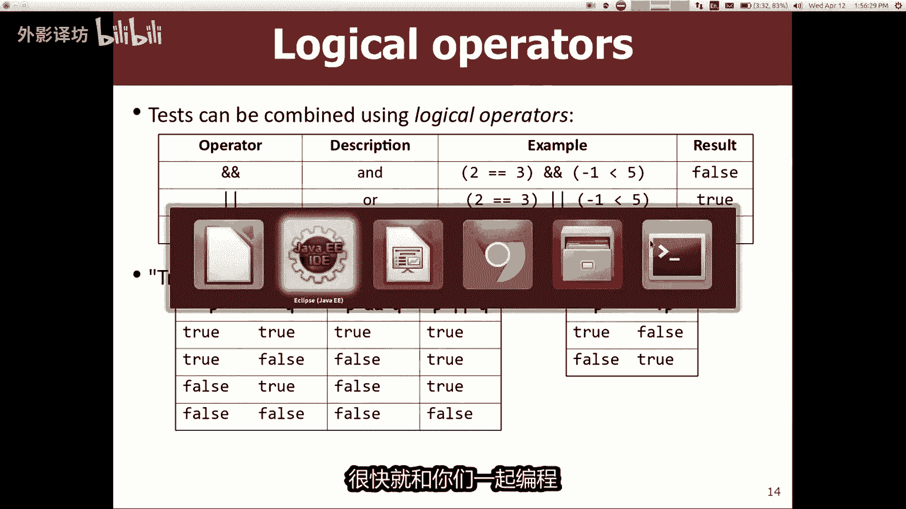

我们可以在条件测试中组合多个问题，这就需要用到**逻辑运算符**。

以下是三种基本逻辑运算符：
*   **`&&`** (逻辑与)：要求**两边**条件都为 `true`，结果才为 `true`。例如：`(2 == 3) && (1 < 5)` 结果为 `false`。
*   **`||`** (逻辑或)：要求**至少一边**条件为 `true`，结果就为 `true`。例如：`(2 == 3) || (1 < 5)` 结果为 `true`。
*   **`!`** (逻辑非)：将布尔值反转。`true` 变 `false`，`false` 变 `true`。例如：`!(2 == 3)` 结果为 `true`。

这些运算符可以帮你构建更复杂的条件。例如，一个“约会决策程序”可能要求对方同时满足多个条件（使用 `&&`），或者至少满足一个关键条件（使用 `||`）。

---

## 深入 for 循环与增量运算符 🔄

之前我们学习了 `for` 循环来重复执行代码。现在，我们来仔细看看它的工作原理以及循环内部变量的变化。

一个 `for` 循环的头部由三部分组成：
1.  **初始化**：在循环开始时执行一次（例如 `int i = 0`）。
2.  **测试条件**：每次循环开始前检查，如果为 `true` 则执行循环体（例如 `i < 5`）。
3.  **更新**：每次循环体执行完毕后运行（例如 `i++`）。

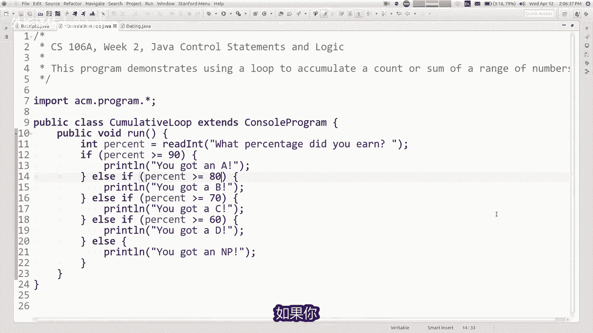

**增量运算符 `++`** 是一个常见更新操作。`i++` 等价于 `i = i + 1`，意思是将变量 `i` 的值增加 1。同样，还有 `+=`、`-=` 等简便写法。

```java
for (int i = 0; i < 5; i++) {
    println(i + "...");
}
// 输出：0... 1... 2... 3... 4...
```

在循环体内，我们可以使用循环变量 `i` 的值。循环变量就像其他变量一样，可以被读取和用于计算。

---

## 累积循环模式 📊

一个非常实用的编程模式是**累积循环**，用于计算一系列值的总和（或其他累积结果）。

其关键在于：将存储结果的变量（如 `sum`）声明在循环**之外**，在循环**内部**不断修改它的值。

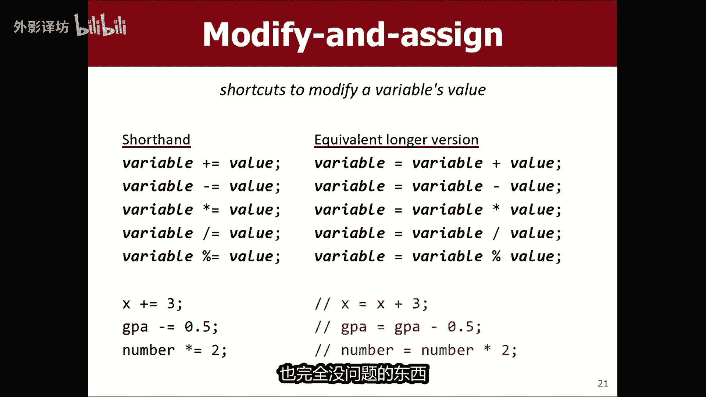

```java
int sum = 0; // 在循环外声明并初始化
for (int i = 1; i <= 1000; i++) {
    sum += i; // 在循环内不断累加
}
println("总和是：" + sum);
```

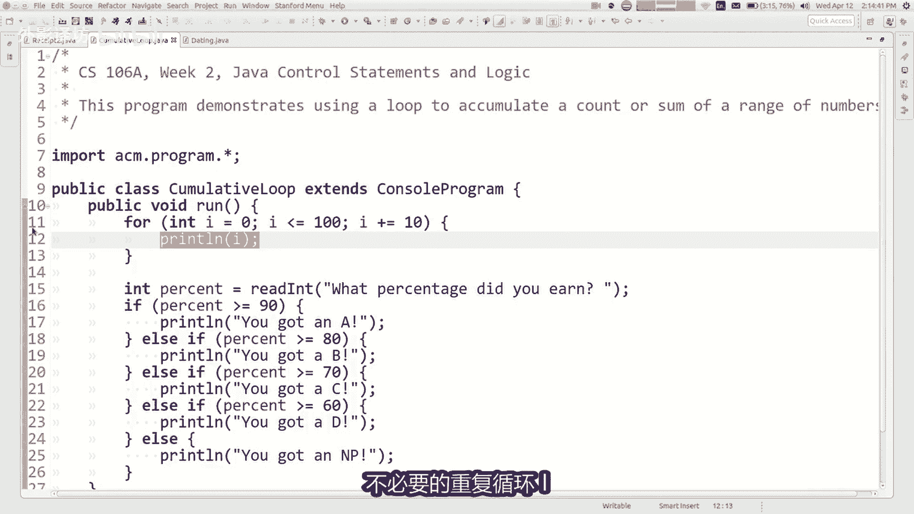

> **为什么要在循环外声明？** 如果在循环内声明 `sum = 0`，那么每次循环都会将 `sum` 重置为 0，无法实现累积效果。

这个模式可以用于解决很多问题，例如：求一个数的所有因数之和。思路是循环遍历所有可能的因数，如果整除（余数为0），则将该数加到累积总和中。

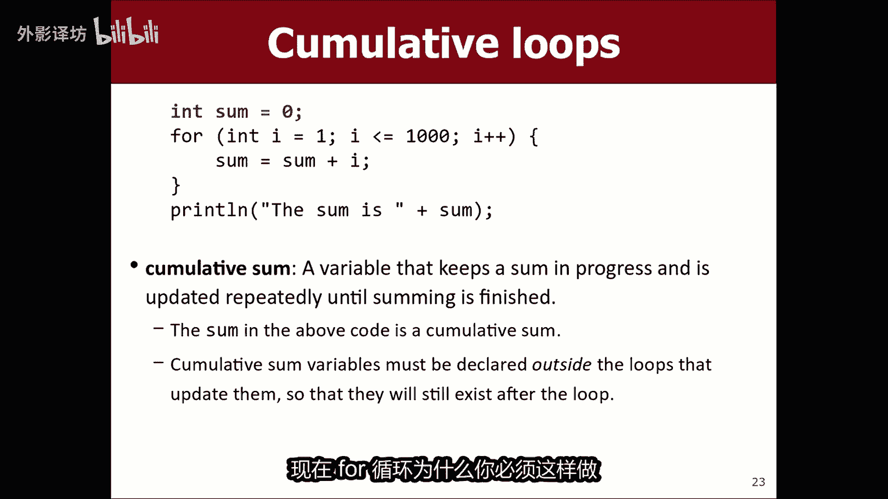

---

## 总结 🎯

本节课中我们一起学习了：
1.  使用 `readInt` 等命令创建**交互式程序**，从用户获取输入。
2.  利用**关系运算符**（`<`, `>`, `==` 等）在条件语句中进行比较。
3.  使用**嵌套的 if/else** 结构来实现一系列互斥的选择。
4.  用**逻辑运算符**（`&&`, `||`, `!`）组合多个条件。
5.  剖析了 **`for` 循环**的执行步骤和**增量运算符** `++` 的作用。
6.  掌握了**累积循环**这一常见模式，用于计算总和等任务。

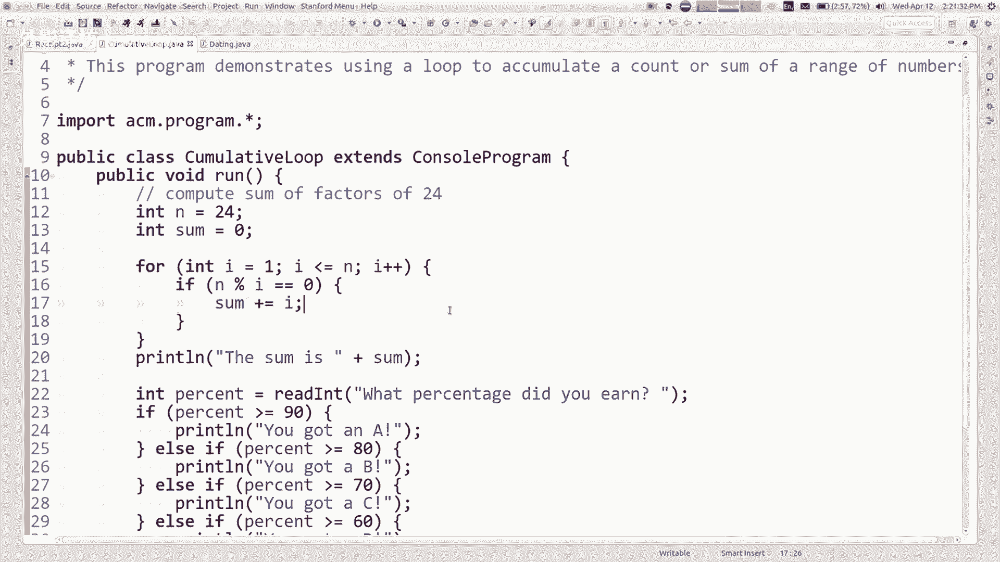

这些控制语句是编程的核心，它们让程序能够做出决策、重复任务并处理动态的输入，从而变得真正有用和强大。