# 课程06：更多循环、常量与随机数 🎯

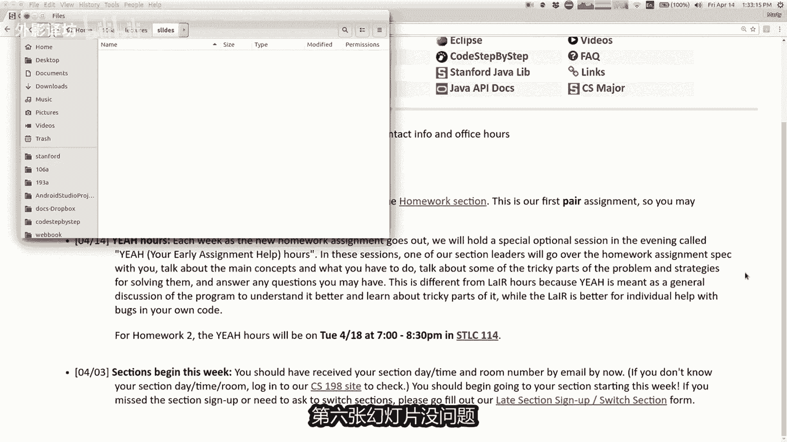


在本节课中，我们将深入学习循环的更多用法，并介绍常量与随机数的概念。我们将通过具体的代码示例，帮助你理解如何在实际编程中应用这些知识。

## 概述


本节课将涵盖以下核心内容：哨兵循环、嵌套循环、变量的作用域、类常量以及如何在Java中生成随机数。我们将通过编写和修改代码来巩固这些概念。

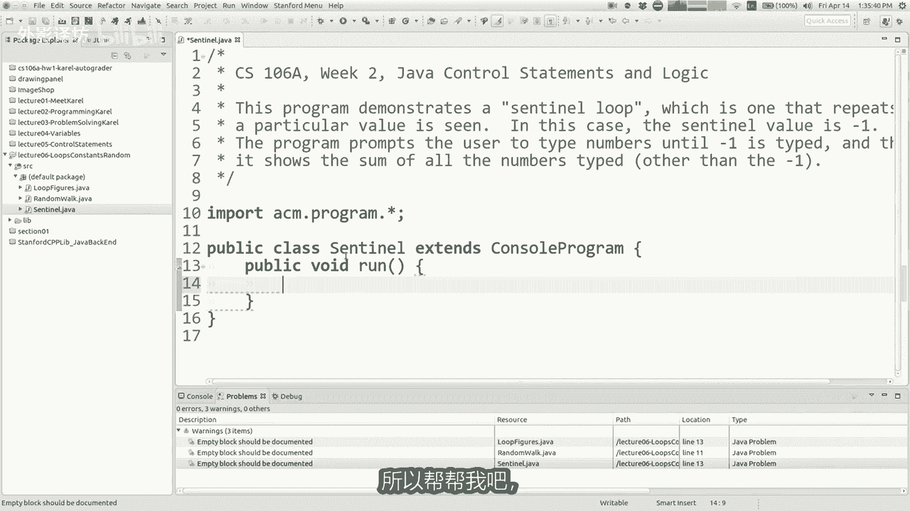

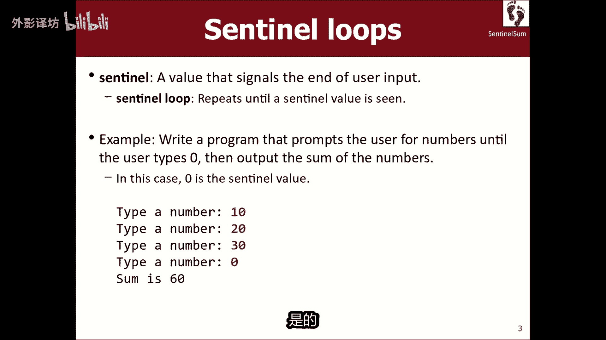

---

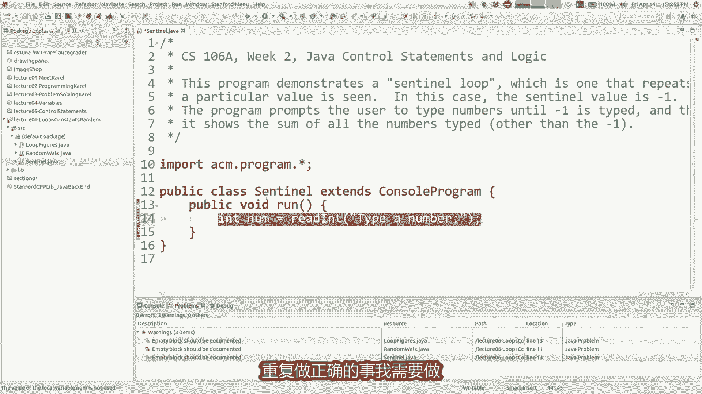


## 哨兵循环 🚩

上一节我们介绍了基础的累积循环。本节中，我们来看看一种特殊的循环模式——哨兵循环。哨兵循环会持续运行，直到用户输入一个特定的“哨兵值”来终止循环。

以下是一个示例程序，它要求用户输入一系列数字，当输入数字0时，程序停止并计算所有已输入数字的总和。

```java
import acm.program.*;

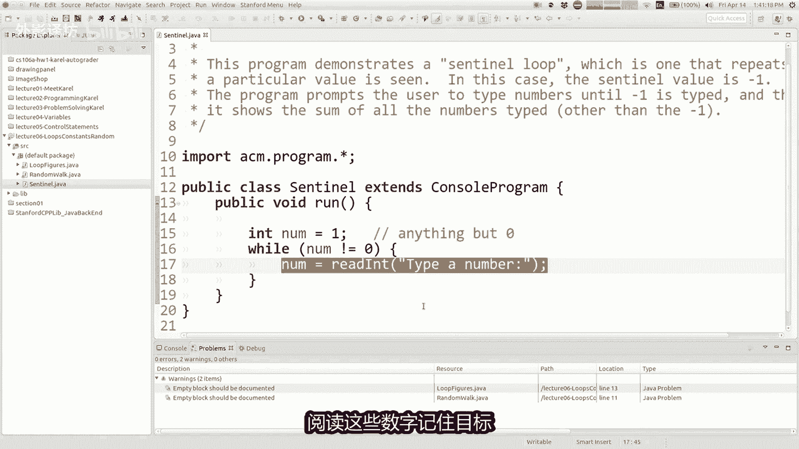

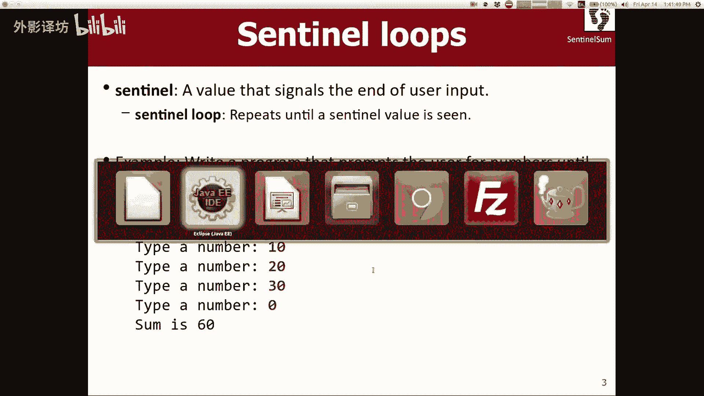


public class Sentinel extends ConsoleProgram {
    public void run() {
        println("This program adds a list of numbers.");
        println("Enter values, one per line, using " + SENTINEL);
        println("to signal the end of the list.");
        int total = 0;
        int value = readInt(" ? ");
        while (value != SENTINEL) {
            total += value;
            value = readInt(" ? ");
        }
        println("The total is " + total + ".");
    }
    private static final int SENTINEL = 0;
}
```

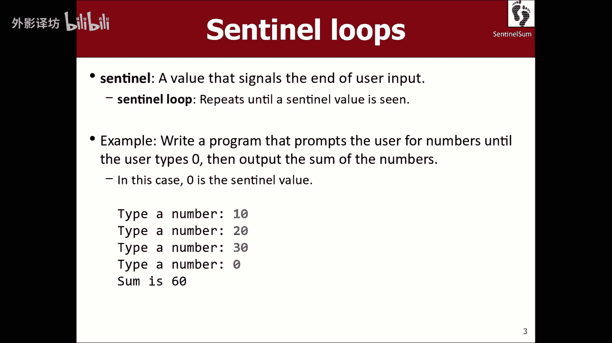


**关键点分析：**
1.  我们使用 `while (value != SENTINEL)` 作为循环条件。
2.  在循环开始前，我们需要先读取一次用户输入来初始化 `value` 变量。
3.  在循环体内，我们累加总和，并再次读取用户输入以更新 `value`，为下一次条件判断做准备。
4.  这种“先读取一次，再在循环内读取”的模式，是解决“栅栏柱问题”的常见策略。

---

## 嵌套循环 🔄

理解了单层循环后，我们来看看循环的嵌套使用。嵌套循环是指在一个循环体内包含另一个完整的循环结构。

以下代码演示了如何使用嵌套循环打印一个矩形星号图案。

```java
for (int i = 1; i <= 5; i++) {
    for (int j = 1; j <= 10; j++) {
        print("*");
    }
    println();
}
```

**执行流程：**
1.  外层循环（`i` 循环）控制行数，这里会执行5次。
2.  对于外层循环的每一次迭代，内层循环（`j` 循环）都会完整地执行10次，打印10个星号。
3.  内层循环结束后，执行 `println()` 换行，然后开始外层循环的下一次迭代。

通过修改内层循环的边界条件，我们可以打印出不同的形状，例如三角形：


```java
// 打印直角三角形
for (int i = 1; i <= 5; i++) {
    for (int j = 1; j <= i; j++) { // 内循环次数与行号 i 相关
        print("*");
    }
    println();
}
```


---


## 变量的作用域 🏷️

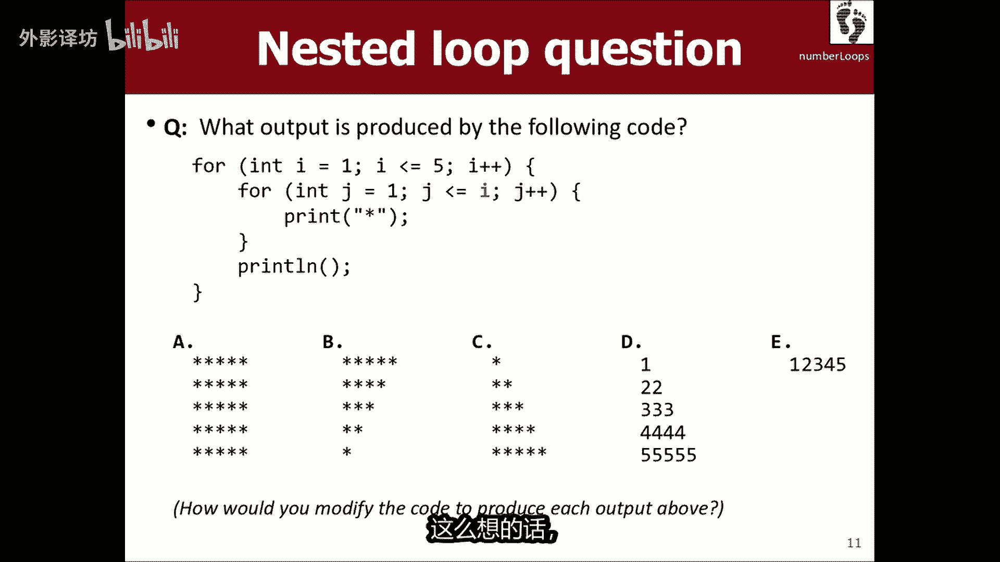

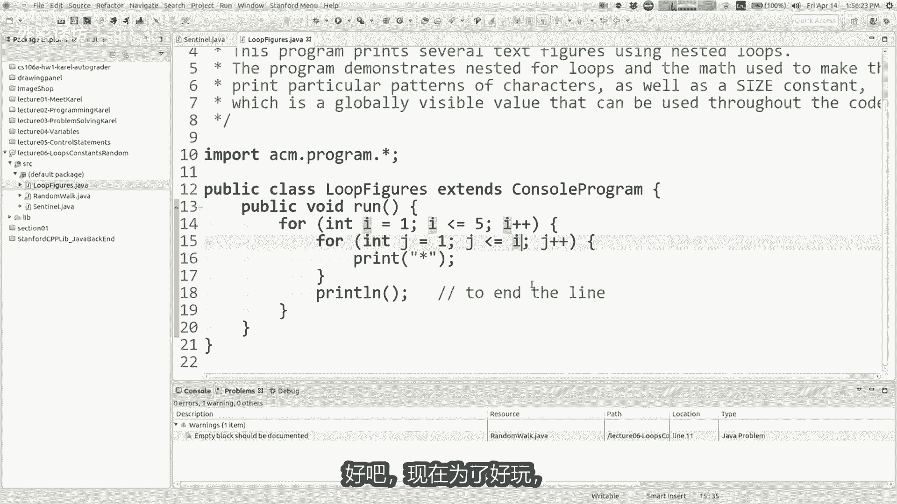

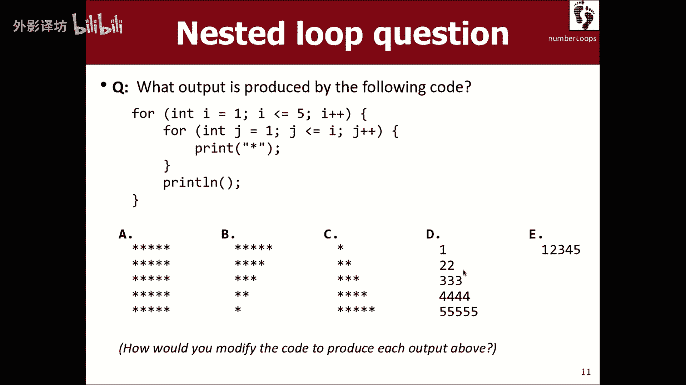

在编写包含多个方法或复杂循环的程序时，理解变量的作用域至关重要。作用域决定了变量在程序的哪些部分可以被访问。

**核心规则：** 在Java中，变量的作用域通常被限定在声明它的那一对花括号 `{}` 内。

以下是需要注意的几种情况：
*   **方法内声明的变量：** 只能在该方法内部使用。
*   **循环内声明的变量：** 只能在该循环内部使用。
*   **非重叠作用域：** 在不同且不嵌套的作用域内，可以使用相同的变量名。

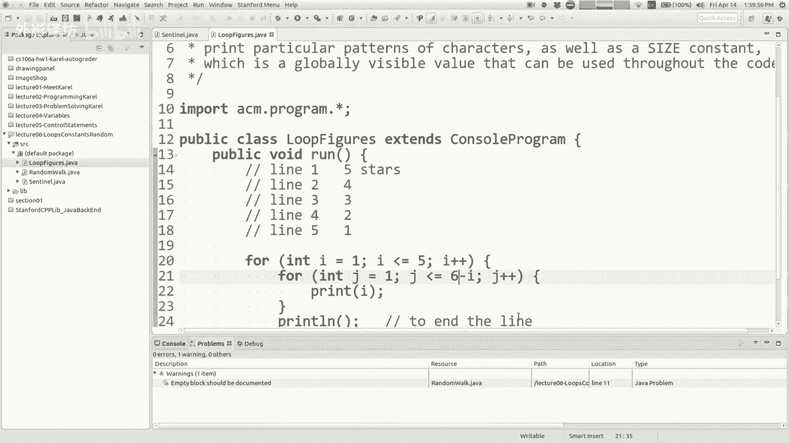

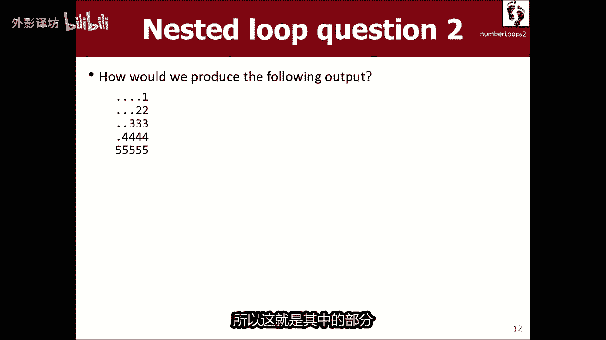

```java
public void run() {
    // 变量`count`的作用域开始
    int count = 0;
    for (int i = 0; i < 10; i++) { // 变量`i`的作用域仅限于这个for循环
        count++;
    }
    // 这里可以访问`count`，但不能访问`i`
    // 变量`count`的作用域结束
}
```

限制作用域有助于保持代码模块化，防止不同部分的代码意外干扰。

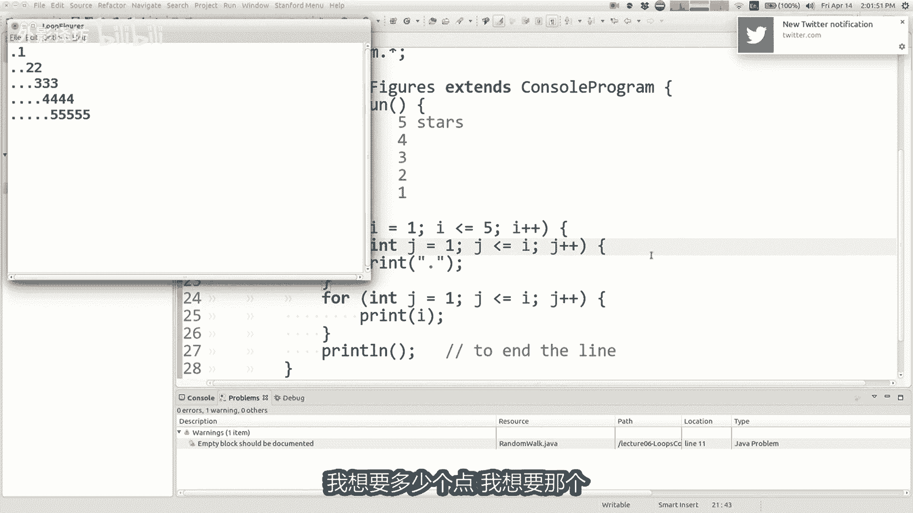

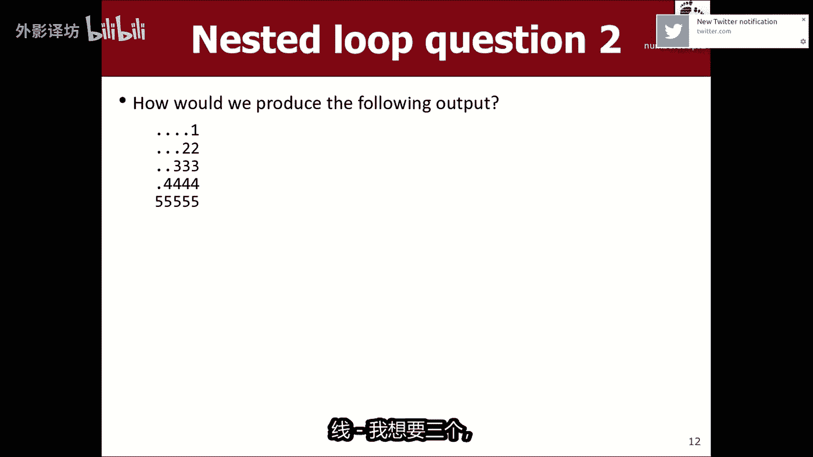


---

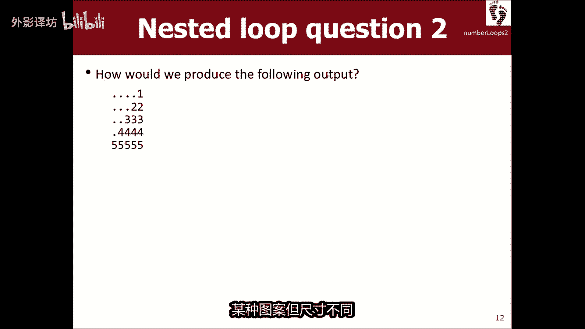

## 类常量 📏

有时，我们希望一个值在程序的多个地方都能被使用，但又不想使用风格不佳的“全局变量”。这时，可以使用**类常量**。


类常量使用 `private static final` 关键字声明。`final` 意味着它的值一旦被赋予就永不可更改，这保证了程序其他部分不会被意外修改。

```java
public class Pattern extends GraphicsProgram {
    // 声明一个类常量
    private static final int SIZE = 8;

    public void run() {
        drawUpperPart();
        drawLowerPart();
        // 两个方法都可以安全地使用SIZE
    }

    private void drawUpperPart() {
        for (int i = 0; i < SIZE; i++) {
            // 使用SIZE绘制图案...
        }
    }
    private void drawLowerPart() {
        for (int i = 0; i < SIZE; i++) {
            // 使用SIZE绘制图案...
        }
    }
}
```

**命名约定：** 类常量的名称通常全部使用大写字母，并用下划线分隔单词（例如：`MAX_VALUE`），以便在代码中清晰识别。

---

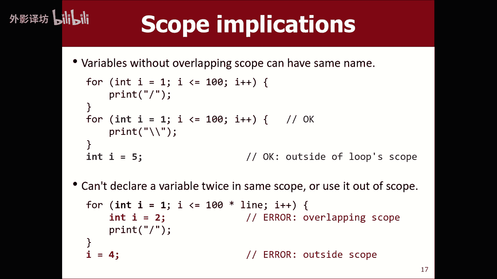

## 生成随机数 🎲

让程序产生随机行为可以增加趣味性。在Java中，我们可以使用ACM库中的 `RandomGenerator` 类来轻松获取随机数。

基本语法如下：
```java
RandomGenerator rg = RandomGenerator.getInstance();
int randomNum = rg.nextInt(min, max); // 生成一个在[min, max]区间内的随机整数
```

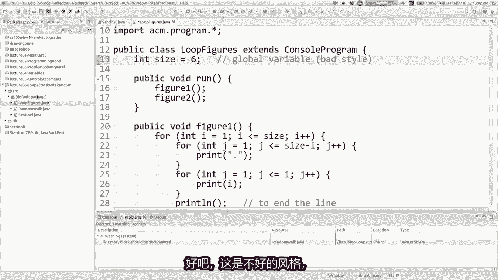

**应用示例：** 模拟掷两个骰子，直到点数和达到目标值。


```java
import acm.program.*;
import acm.util.*;

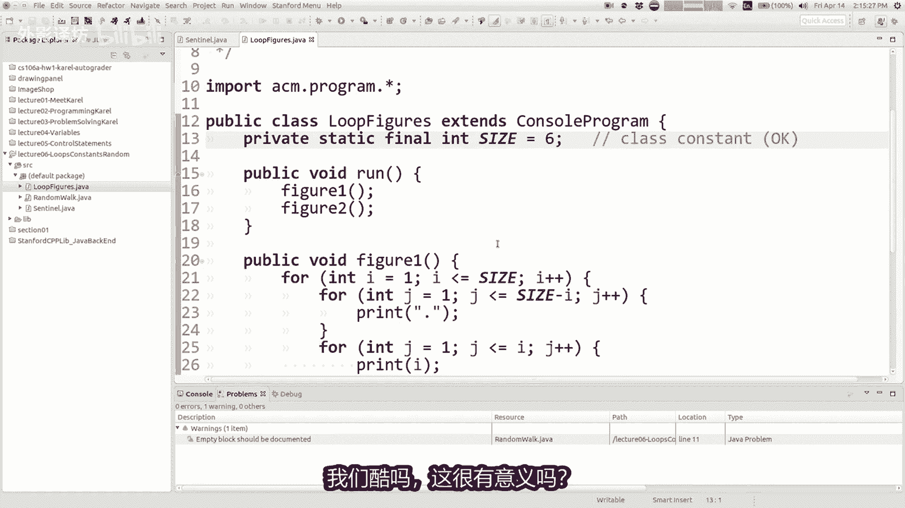

public class RollTwoDice extends ConsoleProgram {
    public void run() {
        int targetSum = readInt("What sum do you want to roll? ");
        RandomGenerator rg = RandomGenerator.getInstance();

        int die1, die2, sum;
        do {
            die1 = rg.nextInt(1, 6);
            die2 = rg.nextInt(1, 6);
            sum = die1 + die2;
            println("Rolled: " + die1 + " and " + die2 + " = " + sum);
        } while (sum != targetSum);

        println("Got it!");
    }
}
```

**代码说明：**
1.  `import acm.util.*;` 引入了包含 `RandomGenerator` 的包。
2.  `RandomGenerator.getInstance()` 获取随机数生成器的实例。
3.  `rg.nextInt(1, 6)` 模拟了掷出1到6点的情况。
4.  使用 `do...while` 循环确保至少掷一次骰子，并持续进行直到点数和等于目标值。

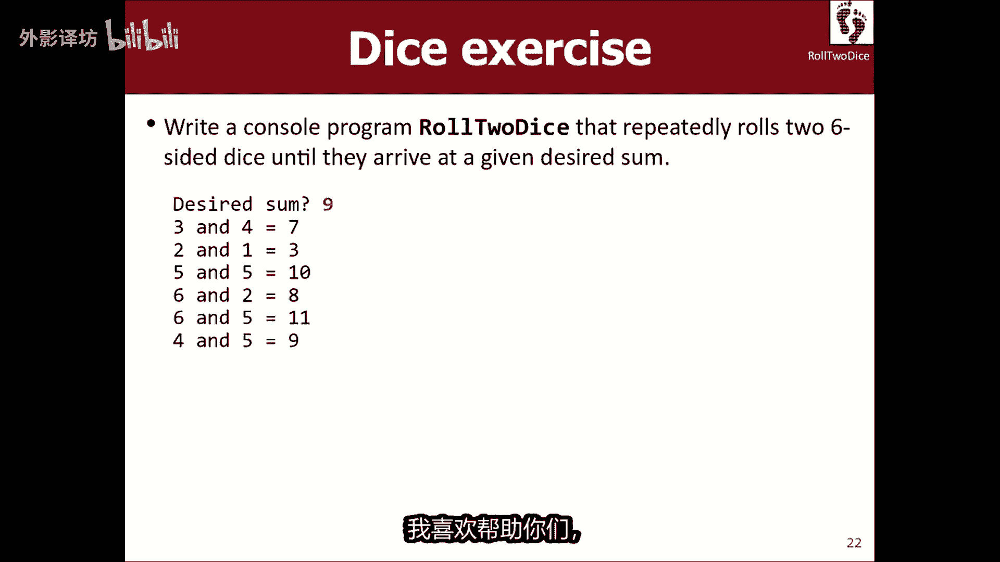

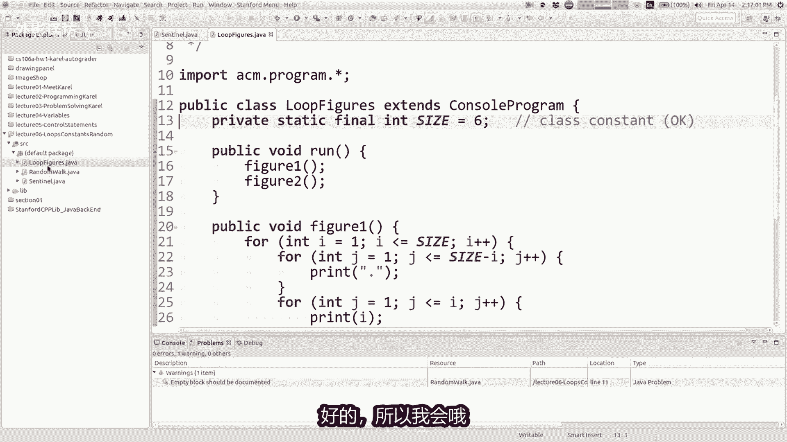


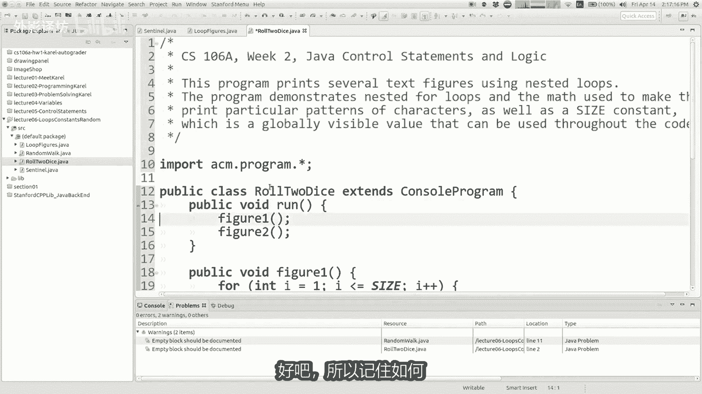

---


## 总结


本节课中我们一起学习了：
1.  **哨兵循环**：通过特定输入值控制循环终止。
2.  **嵌套循环**：在循环内部使用循环，常用于处理多维数据或打印复杂图案。
3.  **变量作用域**：理解了变量在程序中的可见性范围，这是编写清晰、健壮代码的基础。
4.  **类常量**：使用 `private static final` 定义全局可访问且不可更改的值，提升了代码的可维护性和安全性。
5.  **随机数**：利用 `RandomGenerator` 类为程序引入随机性，并应用于模拟掷骰子等场景。

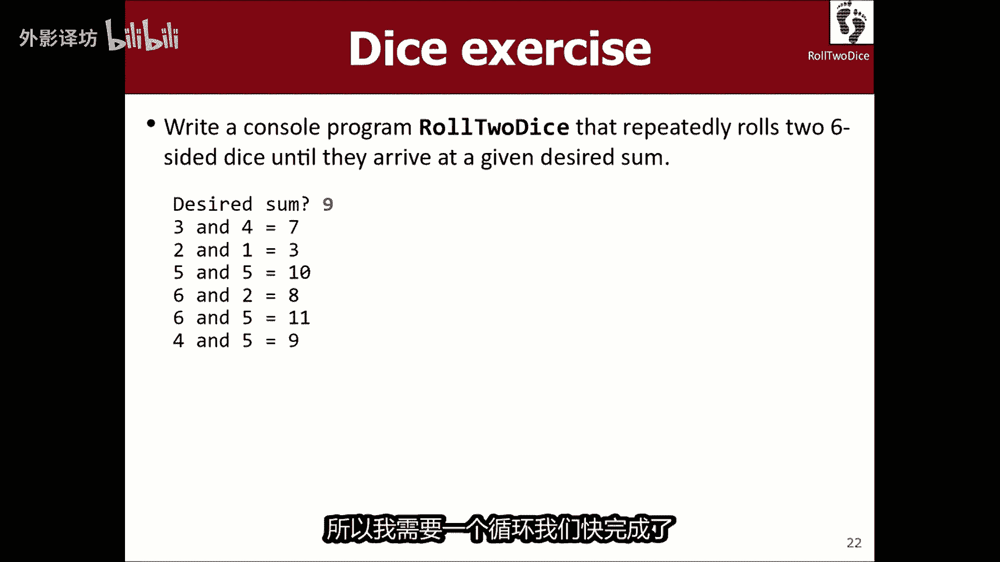


掌握这些概念将极大地增强你解决复杂编程问题的能力。请务必通过课后练习和作业来巩固这些知识。