# 【中文配音】斯坦福王牌课程 CS 106a Java教程 2017年春季课程 - P7：07_ Parameters - 外影译坊 - BV14U4geNEEq

好吧，现在是第三周，星期一，我就像当前的下一段课程的一两周，意为对我来说很难做，没有内容的讲座，只是关于一个主题和很多上两堂课，我们一直在跳，围绕很多快速主题，所以每个讲座有三四个关注不同的事情。

接下来的几个改变一点，我们有个别的讲座，我喜欢其中大多数的主题，作为一名老师，你知道他仍然更好，具有挑战性和棘手的一切，就当前事件而言，如果你刚刚开始我们的作业，明天有一节课夜晚叫我们早起。

由我们管理的分配健康时间，明天晚上晚上七点在STLP大楼中检查一下，我们在外预计下周一到期，从今天开始的一周，我忘记了我自己的预产期，有时还可以，所以今天我们要谈论一个叫做参数，这是一个棘手的话题。

真正了解我们要去的细节，在整个过程中使用这个概念，其余当然，但它非常强大，这是非常基本的概念。

好的，让我来打开今天的幻灯片，让我开始，宇飞编程类比第二，想象一下你喜欢做饭，知道食谱，所以这是如何构建完美的构建，我正在为你做一个蛋糕，这是如何为你制作20块饼干，你混合四杯面粉，无论我做什么。

完全由这些成分组成的事，可能是荒谬的错误，混合物如何，这些成分中的大部分都是，使用时不要遵循这个食谱，但是不管怎样，有一个制作20个的食谱饼干好吧，然后如果你想要怎么办，僵尸补翻倍。

我们可以做40个饼干很好，你可以把这个加倍，然后你加倍，你仍然烘烤它们10分钟，但你把很多成分加倍等等，如果你要想象一下，这是你可能的代码，有一些烹饪20块饼干的代码，你可能有一些烹饪代码。

40cookie，你会发现的是两段代码非常相似，彼此右边除了小数字会有所不同，所以当然我们不喜欢计算机那样的冗余程序员，所以我们可能会尝试，通过创建一个方法来消除冗余。

这里做一个制作cookies的方法，问题是代码不是代码，正是相似的，但这些数字从一变为cookie的数量给对方，所以方法很棘手，因为你知道方法有一种，有一组您想要执行的语句。

您程序中的多个位置是一群非常相似，但又不完全相同的人，同样的陈述对，所以米真的希望你能做的事，有一些更一般的东西可以说好，这里是如何面对和进入你使用N次的cookie，几杯面粉和N倍的鸡蛋等等。

这样你就可以概括食谱，取决于你有多少饼干，想要这再次显示出一个可悲的，因为你对烹饪的误解不只是完全同意，意味着加倍任何好厨师都知道的食谱，李娜有点棘手，但是不管怎样，暂时原谅我吧，推广算法的想法。

并把其中的部分分离出来，如果你想改变，就需要改变关于算法的一些事情，称为参数编写算法，然后在这种情况下，参数文饼干的数量很忙，所以你知道我们正试图将这个联系起来，回到java，回到编程。

让我们看一个具体的例子，假设我想画盒子，我想画一个小正方形或长方形的星星，中间有空格，所以我想打印屏幕上的这些框，你知道我可以直接打印in print和打印长度，但无想化这些使用循环好吧。

所以这是一个这个，我相信第一个盒子是10X4盒子，十宽四高，让我们画出那个盒子，现在使用循环，让我们看一下剪辑。

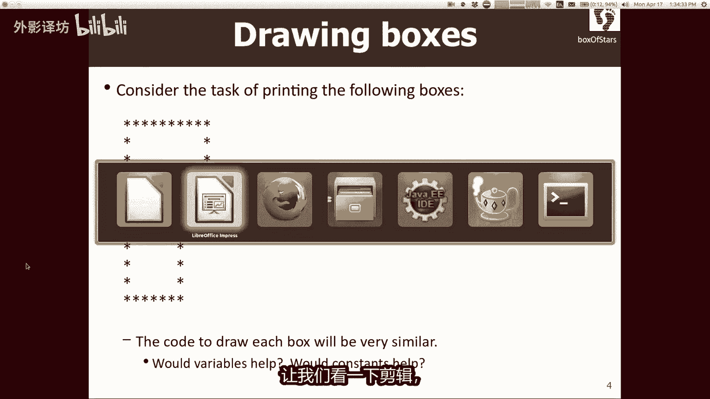

我有一个这里的程序成为盒子，我想要画一个10X4的盒子，所以帮我一下，我想要，使用循环绘制所有内容，我该怎么做，画出盒子的顶部，我知道你们和我一样，感觉。

SPINNET女孩昨天真的只是有很多东西需要吸收，所以很难获得，仅仅一天后我就回到了java，我知道我知道，但是让我们尝试一下，一起为婴儿下的汉娜做这件事，画出盒子的顶部，有人来了，该怎么办，是的好的。

四循环，去了多少次，可以，你怎么办，想在里面为他们画画，如果我这样做十次，那么明星就是明星，汽车排十星看起来不错，谢谢就是这样，现在我们为什么不画出盒子的顶部，盒子的中间部分。

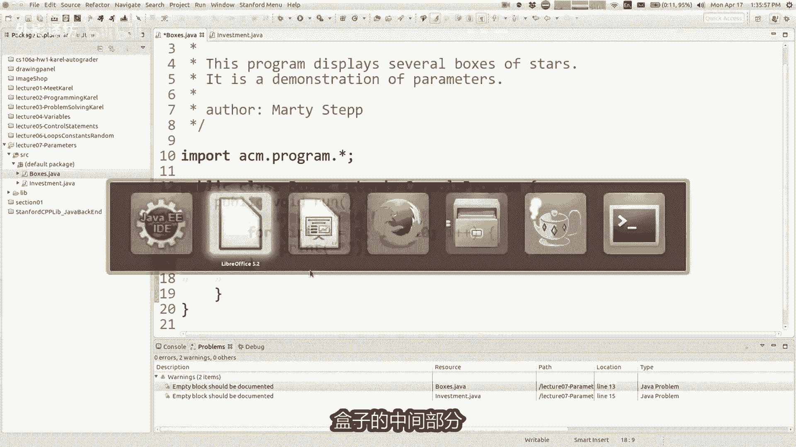

中间部分是这样的，线条垂直走，没有办法做，在控制台中垂直运行的循环，你只需要从左上到左下向右，所以基本上让我们画出所有这些形，让我们有空白，中间我有多少行，很好，我有两个。

因为这是一个像四个盒子一样的东西，很多时候如果你正在做台词和里面的东西，每行都有两个循环，每条垂直线一个循环，然后你有另一个循环来重复水平字符。

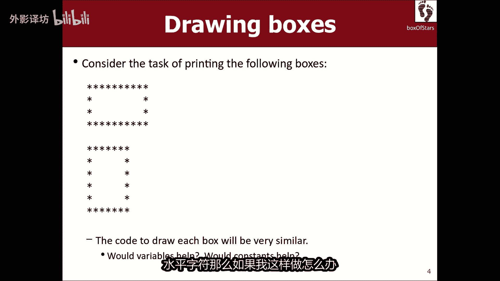

那么如果我这样做怎么办，这部分在这里是顶部，然后从技术上讲，应该说print in two结束，您知道的行已转到下一行行，因为星星星星星早，现在下降了很多，让我们坐中间的盒子，中间的盒子就是你知道的。

星星之间有空格的两条线空间，所以我会做困难的部分，如果我们有两条这样的线，然后我会做一个for循环，最多可达二是那里有笔，里面有什么。

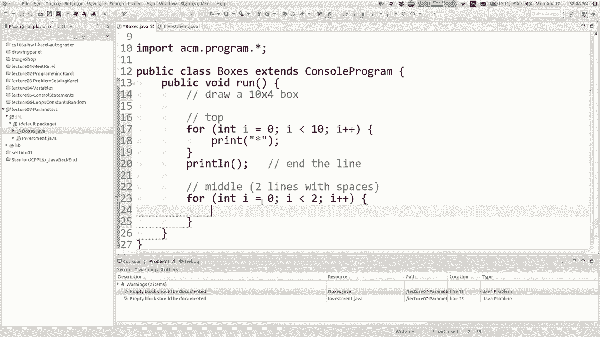

我再次将这部分画的远远超出了。

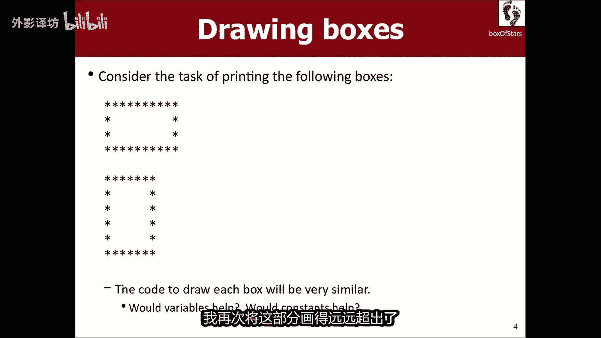

里面有什么星八个空格，然后另一颗星好吧，打印星号循环J到八，打印空间，然后打印，另一颗星，然后也结束该行，你可以直接说print ln明星，所以他们会在决赛后倒下星星，好的好的，那是中间的。

然后是盒子的底部，盒子底部看起来和顶部一模一样，盒子的上面有一排星星，我们已经为此编写了代码，以便适合只需复制并粘贴即可，一般我可能已经对你说了这句话，一般来说，如果您复制并粘贴一段代码。

可能表明你被冗余的投入到你的程序，好吧，这确实是真的，您在代码中粘贴了两次，所以这可能是多余的，但那是好吧，让我们回到这个话题，这样我们就有了10×4的盒子，对吧，我想我没有运行它，但我已经结束了。

对自己有信心，所以我想会的工作室的，我有一个十微型盒子很棒，我们做的很好。

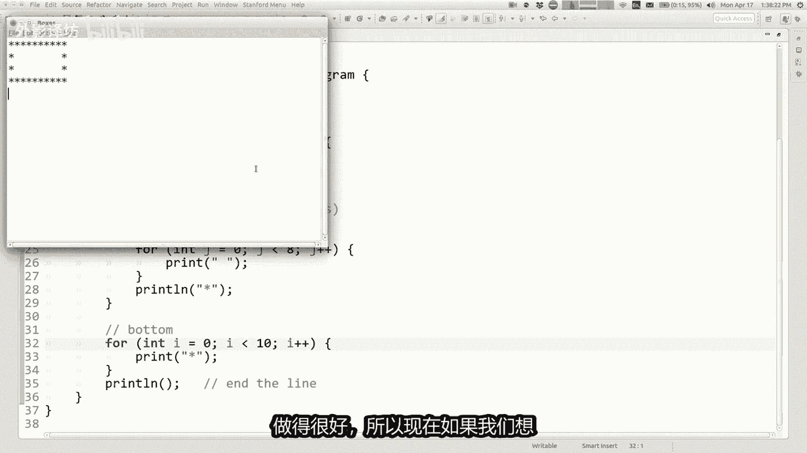

所以现在如果我们想在上面画出另一个有多大，滑动一个7×6的盒子，我想那是那是什么，所以现在我们要放弃七胜六的盒子。

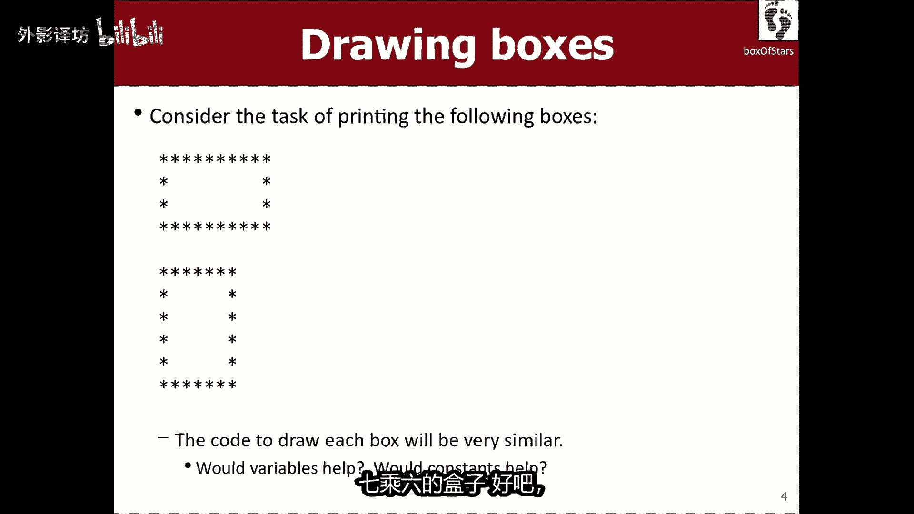

好吧，我们开始吧，嗯它可能看起来有点像这段代码是正确的，所以让我们复制所有的这段代码，让我们说话，一个七六个框，我们将所有这些代码粘贴到这里，我要再换行一次，只是这样之间有一个空行两个盒子。

但是可以告诉我零件我需要改变它，以使其成为七胜六的盒子，符号学没有改变，十位数进入第七，好吧好吧，还有其他我需要改变的事情吗，是的，先生将八改为四，好吧我们试试吧，这也怎么样，敬请期待。

所以他是七宽成六高，如果你，希望这个是五，因为他是不到期，我这个怎么样转到两个，那应该在这里做什么，因为它就像所有的线，除了顶部的一个和底部的一个在哪里。

我得到这些数字了吗，我的意思是，如果无论你是否看到它，但就像四个意味着有四行中间部分在这里，右边四行中间部分还有五个空格在中心。

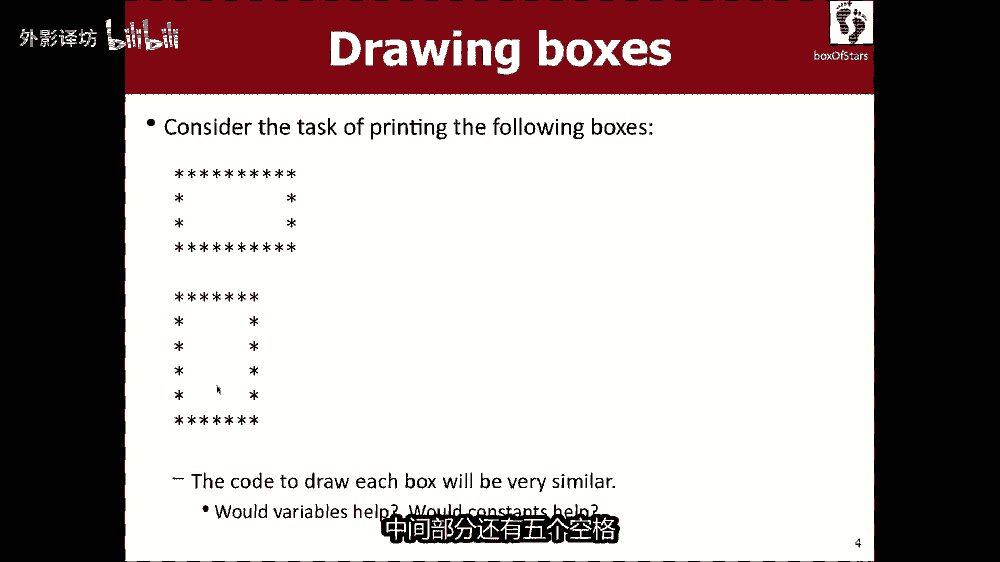

从左到右，所以四行五空格可以吗，我们来试试吧，嘿很酷，我们有一个7×6的盒子，它是太棒了，所以我正在烘烤十个饼干的代码，我正在做20块饼干，非常相似的节拍方法，明智的是不完全相同的代码。

但是这和你非常相似，可能注意到的是这些数字与以下密切相关，盒子的宽度和高度，好吧好吧，我们为什么不考虑一下那一秒钟，如果我到这里来话，10X4盒子我去这里好吧，如果我表示高度等于十的int等于四。

使用这些画一个该大小的盒子指导你的变量，所以告诉我一些，我应该对此代码进行更改，10X4框代码，以便它将使用这些变量，我想目标是，那么如果我稍后更改变量，10X4盒子将完全变成新尺寸价值观好吧。

那么我该怎么做呢，我该改变什么事的哦，我可以使用，常量的private static final只是true，有一个特定的，我不想在这里这样做的原因。

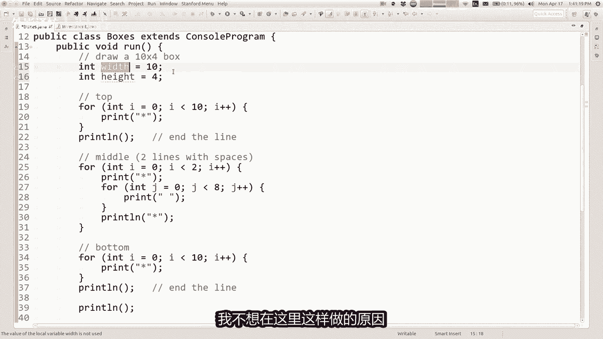

因为我想做的是运行用十和四编码，然后向下。

在这里我想说等于七，高度等于六，然后我想重新运行相同的代码，希望如此，相同类型的代码将运行在7×6的盒子，如果我做一个私人的静态最终常量，我不被允许将值更改为第二个值。

例如但如果我不打算做两个何似四人静态，最终会很有趣，所以帮助我改变什么，所以这个代码将使用这些变量式的肯定，其中写着十的地方是宽度，无论盒子的宽度如何，顶部和顶部有那么多星星，底线好吧，他们很棒。

告诉我其他一些东西，我是你改变了似的，原因是有两行空间是因为他是为了高，但是上面一张和下面一张是画出来的，在B上，所以中间就像如果如果是100高，它将是一，并且然后是98，然后是一，这就是高度。

线路也是如此，这就是那里有多少星位于盒子的中间部分，你明白，所以这应该是高度二好吧，还有什么我们需要改变的吗，是的，巴语正确的原因。

余是，因为如果你看这些行中的两个字符是SARS，其余都是空格，所以无论宽度是什么，都是两个字符。

小于这个数，就是你有多少个空格需要很大，所以这是一种该算法的通用版本，是的，我想我们还没有尝试过，但是我想现在如果你使用这个确切的代码，没有任何修改，你就下去了，这是7×6的盒子。

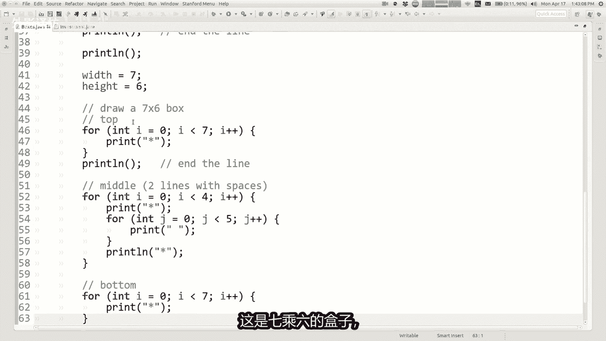

我是只是要抢7×6版本，我将完全粘贴。

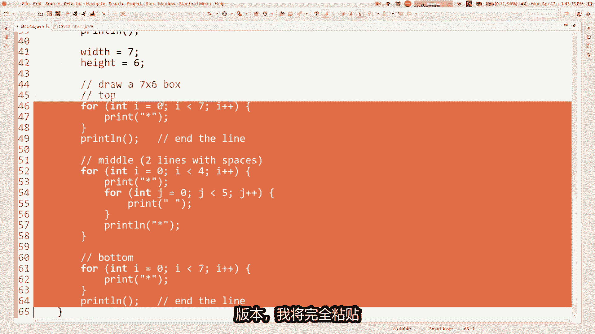

用那个通用版本来代替它，我们把它改成上面的好吧，那又怎么样，我希望这里是确切的同一段代码，现在绘制了盒子，两种不同的尺寸，可以我会证明，对你来说它有效，因为如果我做宽度为17，高度为9I。

应该得到一个17X9的球，很酷，所以这太棒了，看起来就像能够画盒子一样，是一个超级视觉化的东西，程序员需要这样，你知道我的感受，也许我应该制定一个方法画盒子。

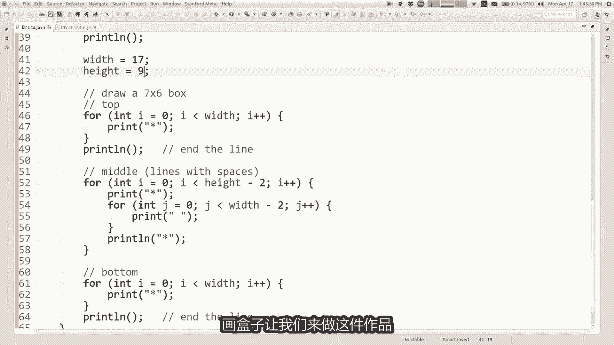

让我们来做这件作品，这里的代码你知道它总是好的，分解我们的程序并制作方法和事务。

所以让我们做一个调用public word的方法，画一个盒子粘贴和他让我生气的事情说很奇怪，但不知道身高是未知，且底层显示为红色，是的，这不太好，所以如果我是的话，就在这里将绘制尺寸为10X4的盒子。

也许我会说，而不是所有这些代码绘制boss print ln，并设置高度，再次到那个抽奖箱，明白那是这就是我的程序想要画的东西，10X4合抽7X6和获17X9盒子，或者任何可能合适的东西。

你明白我想要做什么，在这里作者看起来更好，如果你看着我程序的版本，它更短，读起来更好，但是这个版本无法编译，为什么程序无法看到宽度和下面的高度，这只鸟被宣布为外面的消息，是的，我们有一个很奇特的词。

该运动员或保持其范围变量的方法，是艾米声明性的，而不是任何其他方法，所以与run方法中存在的种类，它们不存在于绘图和方法中，太好了，如果我们可以做到这一点，我想我们有放弃，但等待还有很多曲折。

是一种做类似我所做的事情的方法，到了这里，正在使用这个功能称为参数，所以让我向您展示如何要做到这一点。

一个参数是当你发送一个，当您调用时，将值放入方法中，方法就像你在烘焙一样，饼干就像给我发送你的东西，想要N的值，如果你写成你要烘烤，所以你可以写一个称为box或抓box的方法，画一个任意大小的盒子。

按你的样子要用该方法，你可以指定什么你想要的尺寸，并说我想要10X4，我想要7×6的盒子，如果你是的话，将要使用此功能，子参数特点有两件事，你需要做的一件事是当你写作时，该方法的代码。

就像你是实际编写抽奖代码合适方法，你不得不说这个方法意味着以下参数是给予它，以便运行或指定需要什么参数，这是你需要做的第一件事，你需要做的第二件事是每次执行该方法的时间。

time run调用您拥有的方法，告诉他这些值使用了什么值参数，所以这两件事必须匹配，我需要这些参数，它们在这里，这是两件事，所以画一个14合抽7X5美元，我的幻灯片看起来不正确，我不知道为什么。

没关系，这是你声明的方式，当参数在括号内时，你正在编写你声明的方法变量，你声明一个变量，它是技术上称为参数变量，如果有的话，这是四边形上的角度类型的单个参数很友善，我给你看了一个傻瓜简短的例子。

这样我就可以放一些东西插入这里的代码，所说的是写在消息密码和他X或参数名称，代码以及运行时，打印密码的方法是阿门多拉打印机代码，评论掌声，所以这是第一步告诉他什么，你的方法需要第二个参数。

步骤是当你执行该方法时，你运行你必须提供的方法该真的值，所以如果你说密码42，这意味着您正在运行密码int代码设置为42，如果您说出密码12345，这意味着您使用int运行密码方法。

代码参数设置为12345，然后它导致这两个输出密码，是因为它不是什么编译，如果这两部分程序彼此不匹配，如果您要求参数和颜色不提供一，他不适用它，老实说，如果你愿意让我回来。

如果你想通过超过您可以指定一个参数，然后指定逗号分开，然后当你执行您可以提供所有值的方法，想要存储逗号分隔，所以如果你回到这个盒子程序。

让我我认为展示这种想法，如果我回到这里是例，会很有帮助，你看看这个DROPBOX方法，基本上我想做的是我想做，说我会送你想要的任何尺寸，但你必须告诉我你的尺码想要像你说的那样，就在括号里。

你用逗号写int的方法高度，如果你告诉我你的宽度是多少，想要什么类型，你告诉我你想要什么类型，我会画一个那个尺寸的盒子，你呢请注意，所有红色下划线都消失了，那些在底部的不是吗，那些消失了。

所以现在这个方法是好吧，破损的部分就是这个部分执行，我们现在必须执行的方法，写出我们想要的值，括号内的宽度和高度，在run方法中，所以不要说inflate等于十，高度等于四，你只需在这里写十逗号四。

而不是说17和九，听你说说DROPBOX时期逗号不是，所以它只是赛，我该如何阅读这篇文章，哎呀基本上还是这样说，我想跳下来，然后跑这个方法，但是当你在这里写实时，java将使存储到其中。

当你在这里写四个时，java就会出现将四存储到其中，然后运行所有这些代码与这些值这些变量，然后当方法完成后，它会返回运行，并且继续，然后到达这里，这个调用将该变量设置为17，并将该变量设置为九。

重新运行相同的代码，因此它会执行，如果你的电话取决于因为参数提供什么值，并且命令就像任何东西一样施加，你在这里先写的就变成了值第一个参数，无论你为你的第二次写作成为价值，第二真的，所以她很漂亮。

强大的语言功能，真的一次你会掌握窍门，就像我跑步一样，再次这个程序我确实得到了两个框，但就像现在一样，这个方法是概括化了，所以我可以画任何东西尺寸，我可以说我想要一盒15号的，三点之前，我想要一盒8。

5个或者什么，我应该买盒子，这就是我可以运行的尺寸方法，任意多次34A米，我希望他能做正确的事，问题是的哦，是的，而不是一个数字，还不错的问题，他说的是，而不是写一个这里的数字。

我可以在这里放一个变量吗，是的，所以所以就像你会做的事，如果你说int a等于15，你知道int b等于四，inc等于你知道B减一，所以就是三，我可以写一个逗号C效果是一样的。

传递15和三等等A的值会转到这里，C的值会转到这里，所以它会画出十五三个盒子或者I呀，我可以写一个这里的表达式，我可以写成乘以21和C减去B上的四，就可以了，进行计算并找出结果价值及其结果。

它会经过这里，他会做计算任何值，它会在那里传递这个值，所以是的，当然可以，你可以做到这些一些事情，有时还有你绝对想做一点，如果你只是了解除了你之外，还有哪些参数绝对可以做某事，就像另一个问题似的。

你可以在这里定义一个int宽度吗，等于高度等于九，事实上，如果黄色下划线的话，肯定是这样，因为我还没有使用过它们，如果不使用变量，则加下划线，是的，你可以写一个员工，然后绑起来在这里。

但他们与下面的那些是我们的事情之一，上周我们简要讨论过，了解范围是你无法拥有的，他们需要的两个变量，只要他们做不同的部分，我认为一般来说这事有时会让学生感到困惑，好吧等等，上面有一个宽度。

下面有一个宽度是我不知道的宽度，所以我不知道并不总是喜欢这样做，因为我想要把事情分开，但是是的，这让我想起了我的麦克风爷爷，叔叔和我的勇敢者爷爷，所有他们叫的名字都像罗伯特女孩坚持第一个，第二个，第三。

他们永远无法保持自己的丁之，你就知道不同人们有不同的名字，但他们是他们的生命跨度重叠，所以它是令人困惑，所以我想你知道，我不是会给我的任何一个孩子命名为马丁，所以我保持简单，你知道一些事情。

就像这里发生的那样，其他问题我想我看到了一些别人的手，是的，很好的问题我会重复一遍，比如你问如何做的问题，我知道什么时候，我想用这个简化我的代码或分解我的代码，而不是询问用户。

我确实认为他们得到的参数最有趣，也是最棘手的是，当你开始尝试思考时，关于他们如何与所有的碰撞，我们一直在了解的其他功能，到目前为止特征之一，我们一直在询问输入的用户，会读入这种你知道的事情，你在哪里。

问用户为您输入值，这个功能有点不同，但你可以同时使用它们一起使用，或者你可以使用其中之一，这取决于具体需求，现在我们来比较一下程序要求用户输入一个值，有点像参数化，你的代码除了他被参数化为。

当用户输入时，程序会运行什么那个数字，该版本被参数化为，正在编写代码和值，写在这里的事，如果我总是一样的，想要混合的好处，这两种方法我都可以做，像这样的东西，我可以画两个已知尺寸的盒子。

那么我可以说int w等于RINT盒子退出，并且H等于读取盒子类型，问号，然后我可以说我想要画一个那个大小的盒子，所以现在我会说画一个盒子WH，所以无论他们输入什么，我将把这些值传递到这里。

作为宽度和高度，他会做到这一点，我希望如此，让我们证明，前两个盒子只是已知的固定尺寸尺寸，但现在我说我想要一个盒子20X7，这就是我得到的，所以你可以，如果你同时使用这两个东西，想你，我见过学生。

你知道我想参数看似很难了解，他们在以下方面是第一的，就像他们所有不同的微妙之处等等，但我见过学生，你知道很难区分读音质版本的区别参数，这又是关于我这个程序员是否愿意提供一个值。

或者用户想要提供一个程序运行时的值，是两个不同的东西，当然当我使用时，它很混乱，我自己的计划，因为我是程序员，我是苏打水的使用者，这很棘手，但并不总是如此，那两个人怎么会是同一个人，到目前为止。

我们还有其他问题吗，就目前我向您展示的内容而言，我告诉你一些细节，比如如何它确实有效，因为我认为他是真正了解你，很重要，我知道我一直在谈论某种逐行浏览程序，当它运行时，我想确定你当你这样做时。

伙计们明白该怎么做，查看参数，所以我实际上学了备份一秒钟，参数的传递方式是带参数的方法，运行是当java到达这一行时，会说OU想要念诵三遍，所以他说唱两次做一个for循环，java打印的次数是伟大的。

所以好吧，当你说三遍java跳到这里去念诵方法吧，获取这三个并将其存储到就像有一小段记忆，你知道一小部分可变的内存，因此它将该数字存储到那块内存，然后他执行到这段代码，与存储在那里的代码一样。

它循环三遍，你知道什么时候方法完成后，它会返回运行，并且他会继续下一个，所以现在我们有七个，所以现在七个就结束了，这里它存储在该块中内存，并且它运行代码A杠，所以这些值被传递，并且它通过早期的某种联系。

这位先生有类似的问题，我可以传递另一个变量的魔音，或者一个表达式或类似的东西，该表达式的值被放入那段记忆，然后程序运行正常，所以我们写了这个框绘图程序，我想谈谈你，你的方法中可以有不止一种方法。

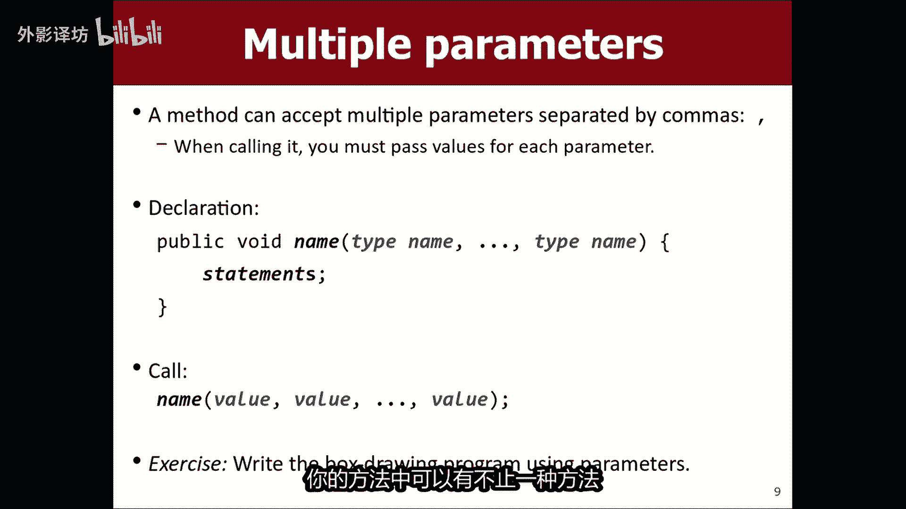

使用参数的程序，因此如果您看看我们的代码，看看抽屉的方法，有一个这段代码中有一点冗余，正确的，如果你的话，这些碎片是做什么的，记性很好，我神智还复制了它，粘贴它，这样你就知道它正在返回。

顶部和底部是相同的代码好吧，这些是什么代码，他们画一条星星线吗，天哪我不想拥有那部手机两次，所以让我们对其进行削减，让我们到这里来，让我们说公开虚空星星线，让我们粘贴它，太棒了。

所以现在这里的顶部仍然是星星线，凉爽下来，在这里合围，底部我不需要重复星星们说话的那段代码，关于伟大的I压，现在LISTAR无法编译它，这里在说什么，这是怎么回事，我需要做什么。

是的星星线需要知道有多少星星喜欢宽度线，所以基本上意味着这个等等，再次像我想的那样令人困惑，有些学生是他们喜欢宽度就在这里，然后我打电话明星，所以他不能有点喜欢看宽度，因为那个叫他的人宽度不就像范围。

事情取决于方法，如果我愿意的话，他们没有其他方法与他分享这个宽度，然后我做什么，我会说我需要你告诉我什么宽度，应该是我想要的孩子，我的宽度和我一样，他的百叶窗怎么和我的盒子一样，宽在他的妻子身上。

所以我会给她我的宽度作为他自我管理的价值，所以现在在这里，你就像我一样知道一件事，我想澄清一下，我正在谈论如何过多使用同名，可能会令人困惑，所以让我来吧，澄清一下，就像下面这个事称为长度线的长度星星。

然后我将其更改为长度，就像你在这里仍然说宽度一样，希望这条线的长度相等到盒子的宽度，即使我是这么想的，如果你可能会说命名很重要，如果我在这里称之为长度，那为什么不呢，我在这里写长度，不不不。

原因那不起作用，是因为我应该指定A的长度，我想要这条线，我想要多长菜单，我如何在这里写宽度，我不知道，也许我让你感到困惑更多，但我只是想指出，就像你执行该方法时一样，你必须提供多少东西。

想要并且描述为我在这里的变量，就我所拥有的变量而言的方法，在投递箱中，我一直说投递箱而不是投递箱，因为那非常就像我有我的投递箱一样，当我们在我的电脑上运行时，随便写个绘图框函数，好的。

你可以有多种方法接受参数，就像你想要像这里一样追踪这个，当我说让我看看，我可以穿上这个吗，那里的屏幕必须缩小字体一点点，如果我在这里说15，那么变成这个奇才，如果我说星线宽度意味着50D。

所以同样的15号也放在这里，变得舔那个上下文一小段代码，所以无论如何，只具有一部分的名称宽度，我的程序的名称长度，我的计划的另一部分，还有什么认为那是，我认为那是我想用这段代码做的，所有事情都可以。

这个中间部分怎么样编程的好，他肯定不是这样，就像这些星线一样，多余顶部你会注意到我正在这样做，在我的代码中多次出现，我有一个for循环，然后再缝内部循环，我打印一些字符。

所以他很友善的重复数量的副本性格，所以有办法改变他嗯嗯进入一种方法，但我不知道我不是确定我是否想展示他，因为这有点像黑魔法类型，但你认为你们可能是准备好了，我想我可以告诉你，如果你不明白这很酷。

如果我想要的不仅仅是一排星星，能够画出任意一条线性格，所以我只说台词等等，无论如何，你必须说出你想说的话，画一条线，然后是多少，你不会在其中看到这些人引指定的位置，用引号引起来字符和文本之类的东西。

这些被称为字符串，我们是将更详细地了解他们，星期五，但你可以把屏幕变成一个参数，你也可以实际去在这里，你可以将字符串S写入长度，然后你在这里说，无论你给我什么屏幕，我都会打印重复他的副本。

然后在这里当已将该方法成为我想要的字符串，print是星号字符串，所以字符串是有点奇怪，因为他们有一个大写的S代表他们的名字，它漂浮在他们周围，我们还没有谈论过他们，再次这有点黑色，这个程序的神奇版本。

但是有该方法能够打印任何字符反复，我们现在可以删除一点，在其他地方可以多一点冗余，我用虽然它不叫阵容，是的，这个底座是对的，我想画一个空间很多次，所以相反，对于for循环，我会说空格型逗号宽度减二。

就是有多少个是我想要的，所以我会删除它，循环那里不是看起来更好吗，绘制框代码看起来是不是有点像现在很酷，画一条线性卫星，然后有两条星线的高度线，接下来是那么多空格，然后是一颗星，然后底部是一条线。

喜欢这样的明星，看起来更多，就像你会如何描述它，英语不是吗，我一直认为这是一个，如果你的程序读起来像这样，这是个好兆头，几乎像英语，意思是可能写的好不响啦，肌肉在这里表扬自己哦，这是一个有趣的事情。

虽然看起来并不完全正确，哎呀你知道为什么他看起来不对吗，微妙的，正在画一个大字母，现在停止或者发生了一些事情，所以我猜猜公园的部分是实际上损坏的，是在底部，该程序可能出了什么问题似的。

第二颗星印在第二颗星上，如果你仔细看代码的话，对于这条线方法，它实际上结束了这行，就像我们告诉他打印的那样，这些空间，然后哎呀它下降了到下一行，然后结束星星被打印在那里，所以它是只是对于很多人来说。

这是一个微妙的错误，如果你去写你的火箭，给你两个任务运送东西，可能会遇到类似的事情，如果我猜你不小心打理哎呀，也许那么长的线，也许我之后我不想换行，也许希望这更具有普遍性，顶部和底部需要换行之后。

但这里没有，所以也许这会让盒子看起来就在那里，所以盒子有15X6的外观相当不错，所以这部分语字符串稍微高级一点，我要回斯普林斯了，后来我就不太想进去了，今天太多了，但我想可能会让程序有点更酷。

我只是想向你展示如何强大的参数，真的可以让你编写的代码完全是不同级别，你注意到了吗，我曾经有嵌套的for循环，我甚至没有任何嵌套的for循环，我已经让程序员这么多了，更精解，我不需要他们。

所以这就是我们的力量，谈论一旦你擅长使用，如果你真的想要参数，可以弄清楚你是否擅长参数，你可以去看看这些恶魔。

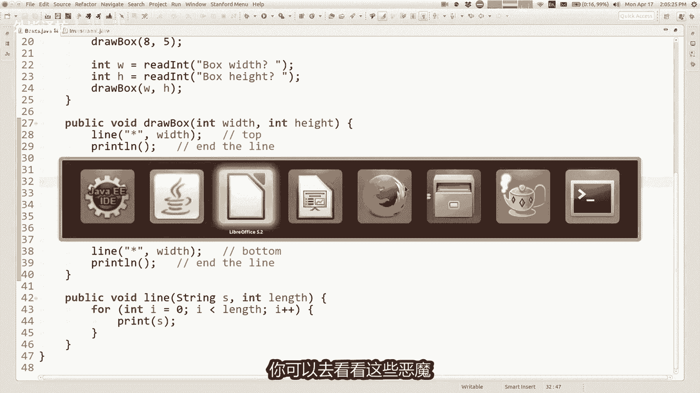

我喜欢让你解决的问题，这里称之为参数之谜，你会讨厌这些，但他们会建造，特点就像豹子甘蓝，那么怎么你能算出A的输出吗，像这样的程序，当然我已经使用令人困惑的名称，以便没有直觉，伯杰会做，如果你看。

你会看到这样的代码，我重复使用相同的变量名，就像我说的，也许你不应该这样做，几分钟前，我已经走出了我的世界，在这里做到这一点的方法。

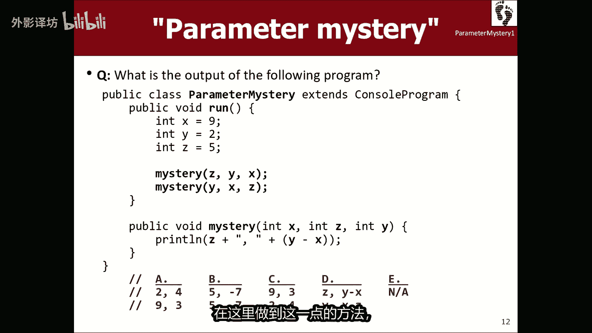

只是作为一种方法理解这个程序，让我指出哎呀抱歉，让我指出有一个X和一个这里的Z和Y，那些不是与这里的XY与Z相同，他们只是碰巧与那里有一个，所以如果你想的话，解释这个程序如何运行，看到这个第一次打电话。

上面写着mr easy y x为此存储什么值，第一次运行该方法这样，你应该考虑一下，这是顺序是最重要的事情，我总是试图填补你的空虚，使用相同的字母，并且你认为你可能会说字母很重要哦，X好吧，X是九。

所以这个东西就在这里是九，这里错了，我说C是第一个参数，表示这些值转到这里，所以对于第一次运行神秘方法，第一个参数收到值五，你会看到，并且那么第二个参数Y就下来了，在这里对于这个值它收到Y直是二。

然后这个东西X是第三个参数，它就过去了，这里它的值是九，所以对于这个第一次运行代码X是五，Z是二，Y是九，这与写在这里要小心这一点，那我该怎么处理它们呢，print ln z逗号Y减去XI。

print c2逗号Y减去X9-5，表示P2逗号四，所以这就是你的方式，走过这个这种类型的代码，是的，他是这样写的，最大限度地增加挫败感，所以我认为实际上你做了一些这样的事情，掌握它们的窍门。

对你思考问题更有意义，是的，就像多项选择一样，问题对了，是第一个吗，第二个是对的，所以也许是这样，马内斯看起来很混乱，我只是想说是其中之一吗，是这个还是这个货，是这个吗。

结果是我先得到这个刑部与任何一个都不匹配，另一种也许你已经可以了，结论是这是一个，但是是的，我不会给你，他是多项选择，如果他就像在参加考试或其他什么事情好吧，让我们看一下更大的计划。

我想这会发生什么具有挑战性的事，如果我只给你一个问题，我请你解决它，我说你应该在这里使用参数，但我并没有真正告诉你哪些在哪里，或者只是你应该分解问题，就好像当你做卡罗尔，或者当你做的时候。

家庭作业你应该分解，把问题归结为方法，但是什么乱七八糟的。

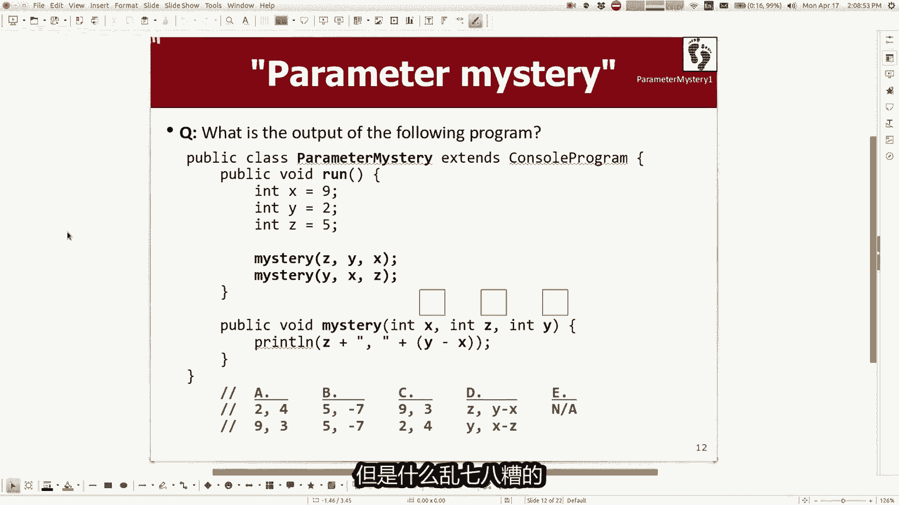

这是设计的一部分程序，让我们看看是否可以这样做，让我们这样做吧，我这里有一个程序想写的叫投资计算复利，你知道复利是如何运作的，就像你知道的，你可以从本金额，然后每隔一段时间，也许每月在那里。

我们你会得到一些兴趣，然后当他到达时，它在你嘴里变大，然后下个月的利息是新的，较大数额的复利时间，就像100块钱，3%的利息，五个月额外的93每分，从技术上讲，现在来自该化合物，这有点假。

因为组件并没有真正花掉，我正在做的那一年，每月一次用于化合物干事，不管谁在乎，所以她看起来很漂亮，公式在这里，我的意思是，这并不难，有点像不管怎样，您添加的月份或期间那么多到金额，然后你继续增长它。

布朗每次让我们尝试写一个成为投资的计划，算了，这天有些没得到，太担心地图了，不想让我们只是获得基本的外壳程序，首先运行我们需要询问用户，获取所有这些数字，然后计算一些事情好吧。

所以我想我可以帮助我们一点点开始有了这个。

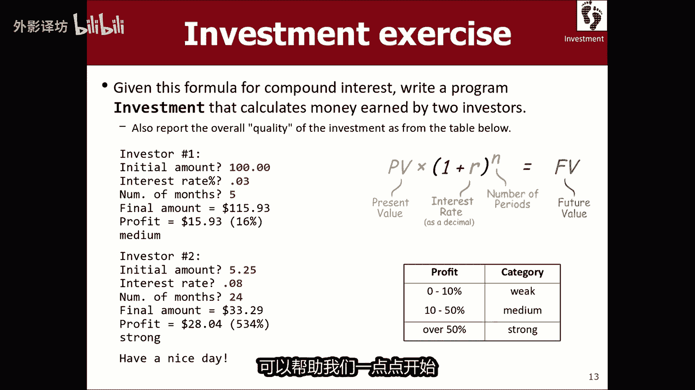

所以我这里有这个东西，一号投资者说我已经这里的另一件事是投资者，2号，当然也是我所希望的，你看到的是所有这两个部分，看起来真的很相似对吧，所以可能有一些冗余，那里我现在可能需要修复。

让我们编写一个仅适用于一位投资者，然后我们可以考虑两个投资者方面都还好，所以让我抓住所有这些，让我去看我的剪辑，我这里有一个名为投资的文件，java让我们粘贴并打印，L引用类似又王牌的东西。

让我们来看看，那样那样那样，还有你和一个，还可以，所以不太对劲，因为我们需要向用户询问一些集中向他打字的，这个我要求用户支付100美元，输入号码，我该如何询问用户需要这样的实数，记得说加倍。

记得这样好吧，双倍初始金额等于补两遍好吧，在评论中我会只需写下测试中的数字，在幻灯片上，以便我可以从事相同的操作数字，然后是利率，用户也可以输入该内容，这是另一个毒，双双利息等于三倍。

然后默认值为3%几个月，那是另一个，那是可能你可能有一个完整的一个月，所以也许需要八个小时才能读完个月，等于六个月等于REDI好吧，五然后这些东西就全部了，计算了一下，我想好吧，让我们开始吧。

让我们尝试计算一下最终的金额，所以如果你想看看这个公式。

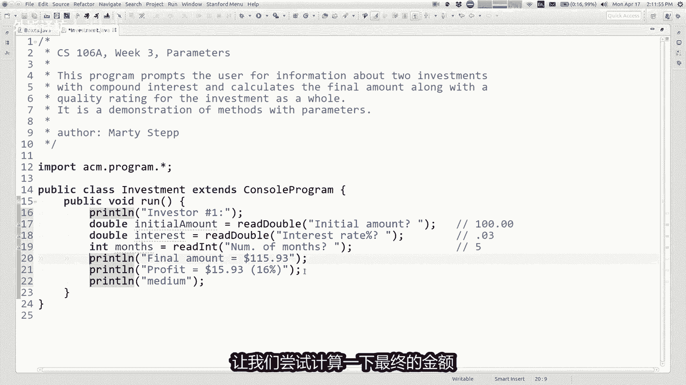

在这里你可以从，初始值乘以一加利率提高到，如果他们总是喜欢一个周期的数量指数，马蒂，你没有教我怎么做，作为一个指数，但我被困住了，有一种方法可以做指数，我是仍然不会教你，他是什么，因为我是一个可怕的人。

但可以你用你的东西做幂运算，总本课程中已经知道无需使用其他任何东西，是的进行四次乘法循环，又3~5之式循环乘以三五次，对这样的事情，所以我们不会需要一些指数乘法，这就是我们所需要的，我们甚至不需要乘法。

我们可以只添加多个等等，这太简单了，让我们不这样做，但正确，所以只需添加反复利率，让我们这样做。

计算最终金额双倍最终金额，所以如果你要计算一些东西，通过不断的增加兴趣，我们正在累积最终的值，我们在这里了解到的投资价值，关于累积算法，对一些在关键想法中，您声明了一个变量，首先在你们中的任何一个之外。

并且那么你想知道如何评估它的价值，循环内的变量就是该代码的一般结构，所以我们宣布一些最终金额，为什么要最终金额开始。

我的意思是，如果你看在这个等式中，你有点从一个地方的钱到另一个地方钱，那两个地方是什么，是的，所以从现值到未来，所以从现值开始。

所以从我认为我所说的开始，这里的初始值可以开始初始金额，我该如何获得你说的最后一个循环一下好吗，for循环我应该执行多少次，就像我在这个等式中所想的那样，重复在这里你多次想要这个权利。

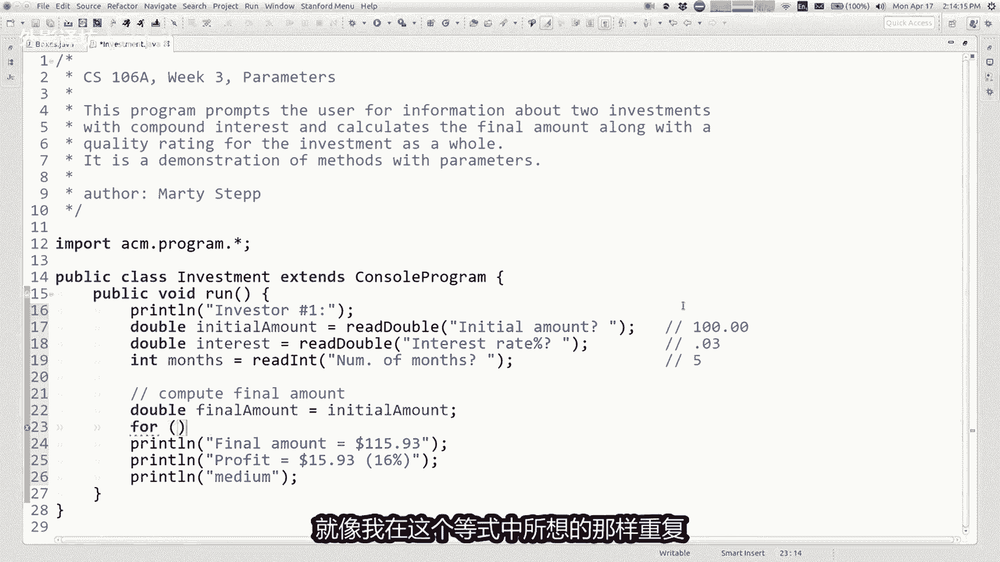

在我的代码中它是什么，不管多少月，有几个月，我会反复多次应用利息，因此for循环从零到几个月，上面那个变量是我读过的吗，然后我在那里做什么，我想将利率添加到数量正确，所以我想说最后，我要添加一些东西。

我应该说加等于利息增加，对这不完全的兴趣，这始终是我们面临的挑战，我们吟诵并将英语翻译成鸭马，或翻译数学或会计金融，对java式的感兴趣。

X个月X，我认为这几个月是通过这里的月份进入。

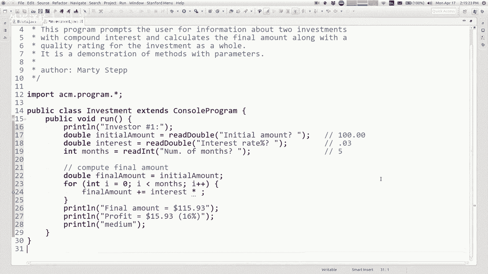

等式为作为这个指数。

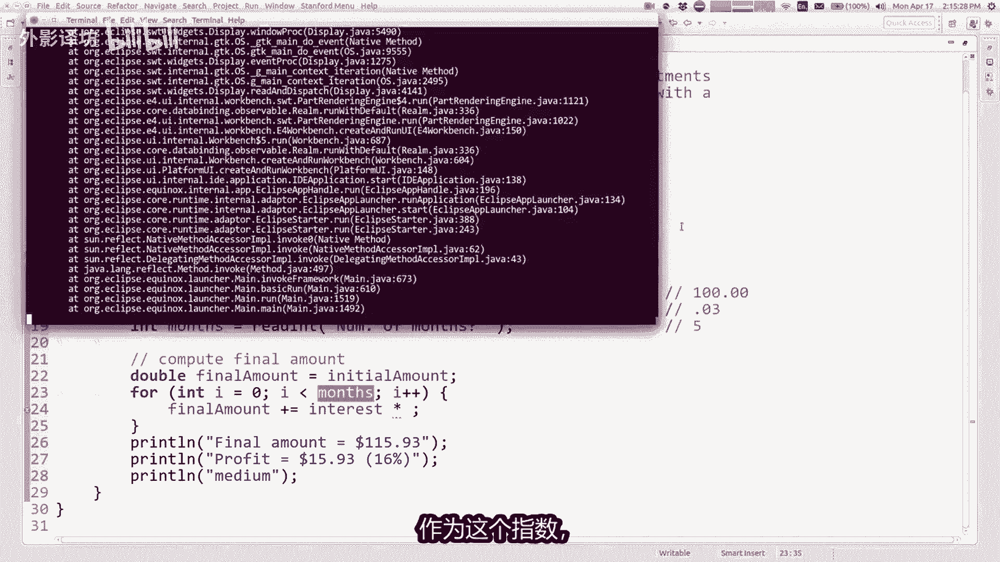

所以我认为几个月就是这样，我们计算了一部分，但我认为你说的对兴趣需要延长一些时间，以便这就是我们的方式，是的乘以初始值的限制数量好吧，让我们尝试一下，就像这样，你赚到的100美元的3%。

3%乘以你的100美元，让我们看看最终金额等于会发生什么，美元符号加上最终利润金额，让我们在另一个下做利润，接下来的事情复选框不，我不想要，我想运行另一个完美的盒子，初始金额100块三5%个月。

他说一百一百一十五美元，应该是115美元，93美分有点小，这不是舍入错误，只是我们没有计算清楚，正确的说，你知道出了什么问题，是的，但他需要是一加是的，我想我认为加号等于一。

另外因为我是那个他是那个休息一下，你知道我的意思，就像我想的那样，这里真正的问题是你需要说成以最终金额，因为上个月的利息现已成为我的期末考试，我需要用它作为一部分，下个月易维纳作为一部分。

下个月的最终金额正在增长，适用的兴趣应该适用于所有成长的数字，你知道我的意思，所以无论如何，我认为这给了我正确计算35%分钟，92每分，接下来我们可以讨论舍录一分钟内的数字，但这是正确的。

基本上数量好的，我有一号投资者，我有2号投资者。

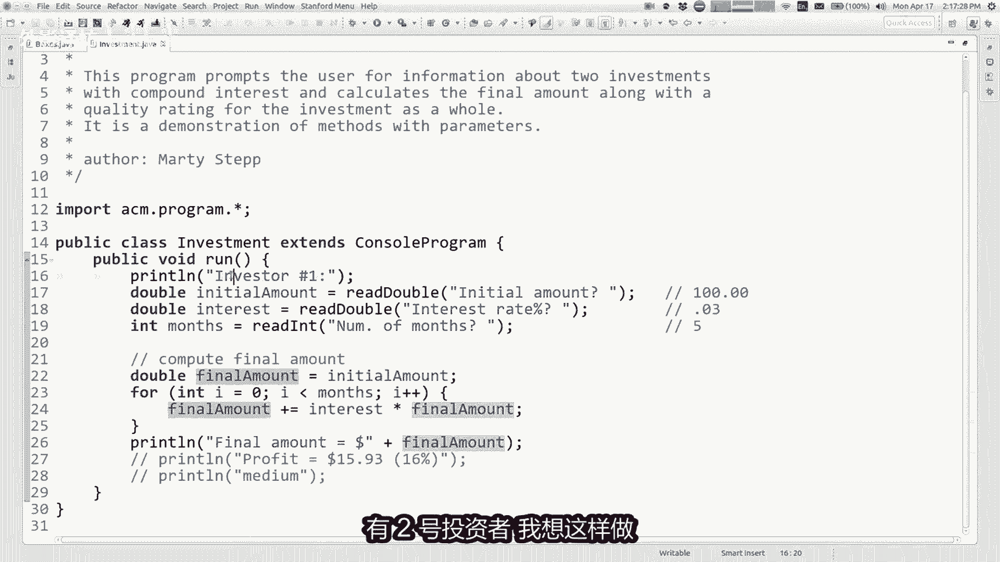

我想这样做代码两次，你可以将其作为for循环来执行，我宁愿把它作为一种方法。

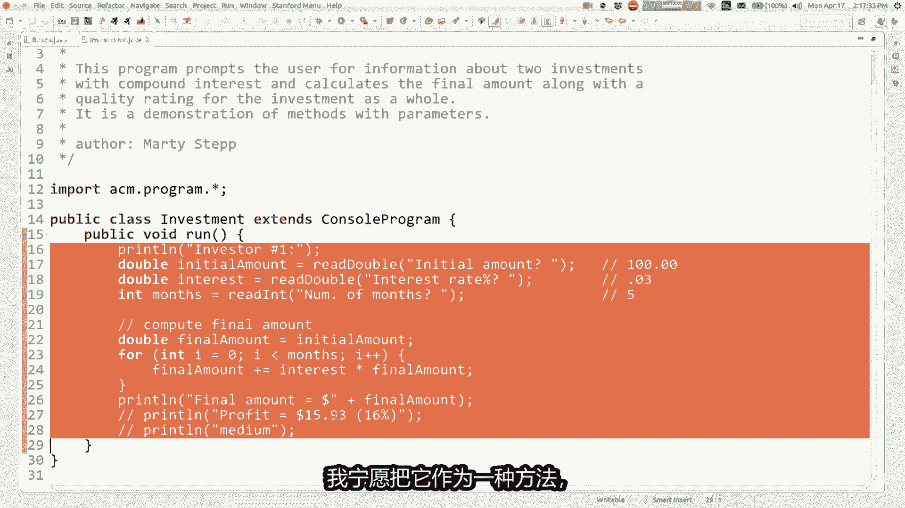

所以我而是有一些叫做公共的东西无效投资者，然后你在这里说一号投资者，你说投资者二，我怎样才能让他说的不同，适合不同投资者的东西，比如up，在这里，如果我说投资者，然后是投资者，再次，是的。

你有什么样的投资者number，他是一个参数修正，它只用在一小部分地方，暂时就像我在数字中所说的那样，怎么样，你是多少号投资者number，加这个变量，加那个，所以现在我说注意这怎么不突然编译。

以为他是说黑，你没告诉我什么投资者编号，这是这个怎么样，一个是最好跑的，那个是投资者，太棒了好吧，现在我只剩下一点时间了，在这里我想做一件事，这是我想打印的有多好，一项投资是基于多少你赚到的利润。

所以如果你赚了，我该怎么办，本周利润为10%或更少。

10~15，中等和50以上，强烈的对漂亮的费成数自我选择了，但无论如何，所以我想打印，这是一项多么好的投资。

类似公共无效打印质量，像你这样的投资，知道利润是否低于十百分比，然后打印LN5la弱中或强弱，否则如果利润不到50中等，否则如果不止于此，我会打印一行，它很强大，所以我刚刚创建了这个名为利润的变量。

不知道利润是多少，这个方法知道利润是多少吗，我可以使用参数来获取利润，如果你告诉我他赚了多少利润，我会告诉你一项投资有多好，当我计算出的时候就是这样，最终金额我要打印的质量，但我需要知道投资。

要传递什么利润，你知道如何传递，你赚了多少利润，是的，你赚了多少，结束于您开始时的金额，说双倍利润等于最终金额，初始金额及利润美元，一旦利润百分比，所以这将是就像你知道的，19。53或其他什么。

我该怎么办，知道将计算的利润百分比，然后我们就离开这里，当时的现货，所以利润百分比可以，你快回来，利润除以初始金额，如果你100块钱赚了五块钱，你赚了5%的钱，只是为了使它成为一个整数。

你可以说鼠标打印的利润百倍质量百分比利润，让我们真正尝试一下快点，如果有效的话，我们就回家，所以100块钱3%利息五，几个月我们赚了15美元和92美元每分，所以我们有中等投资，我没时间了。

所以我得停下来，更多参数，周三见，然后去我们的西蒙那，谢谢，我真的很喜欢很多人不喜欢的，实际上做一些你有的事情，投资办公室有点酷，性格，是的，我想钱是的，充满了我的轮胎和冠石，特许经营警告，他们肯定有。

我的目标是人，很多，我认为有一家更大的公司，这里还有很多其他课程没有，嗯他们问我们尊贵的会员费纳塔西亚，我的室友，接下来就像喂食那些早上做事的人，像这样荒谬的边界，事情真的攀登，你应该只接受他高尔。

我不知道知识东区，所以我说好吧，我真的很享受，这太棒了，我很高兴，我认为到最后他们什么都不是，这个班级会有很多像我们需要的小程序，摘录你能够崛起的，我认为科技的东西真的很有用，有点像插入包机，是的。

正如你所知，我已经成为了一名导师，我之一，我认为只要一两杯，其余的有两个孩子，我很喜欢，谢谢你的观看，是的，很酷的人，谢谢有人知道吗，也许，殷承包上的文物音乐书，但他喜欢没有部分较小。

为他们的快乐管理工作，我不希望你在中分享书籍考试，因为基本上如果你的专利给其他学生的论文，这很友善，喜欢喜欢基本上还好，荣幸代码，当然你应该工作，每个人都知道坚果是其他学生的副本，以及当然在房间里。

如果你看到有人针对这种虐待或言论采取行动，我认为对某人来说，这是正确的，老师，我不想创建一个不可能的情况，其他学生告诉学生，是否做我们推荐和我推荐的事情，觉得可以打包我们的周围的资源去做。

而不去很难理解他们正在弥补，我知道你不会那样做，但让我给你一些可以做到的，任何人都不可能有任何时刻有点刺激，所以现在我当然不想告诉你，潜在后正确妥协，我这里有几份副本，当我把他们带到测试时。

另一个我们把它们放在这里，它正在下降，所以我来这里是因为我就像这样，他们并不总是在玩整个测试的代理，但后来我得到了，这是我会一直关注的大事，我就在那里，你可以过来给我冰敷吧，古德温兽不是的。

就像我把它拿出来一整年一样，肯定不会令人惊奇，但我们正在做你的，如果你有的话，你想分享一个吗，无论如何，我不会说他是让他同意，你可以，我可以让任何人告诉他吗，对该法案投票，我真的明白了。

这是一个说明循环中的任何个人原因都会出现，来自艾比的机床，好的，所以有并不是让他返回的真正方法顶上，但他们正在为你让路，以某种方式添加一个循环，也许是这样，我想过把这个喜欢他的开始。

但然后开始玩游戏的时候，对你说，4月10日再一次吧，所以也许你走在正确的道路上，好吧我的没错，好的好的，是的，太棒了，谢谢好吧。

我想我们要开始了，弄清楚提交的内容哦。

酷。

少一点自己的削减。

