# 课程07：参数 📊

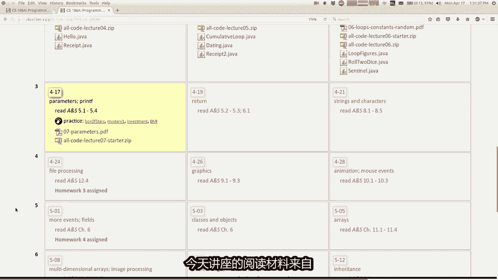

在本节课中，我们将要学习Java编程中一个非常核心且强大的概念——**参数**。参数允许我们编写更通用、更灵活、可重复使用的代码，从而消除冗余。我们将通过绘制不同尺寸的方框和计算复利投资等具体例子，来理解参数的工作原理和实际应用。

---

## 概述：从具体到通用

在之前的课程中，我们学习了如何编写执行特定任务的代码。例如，编写一段代码来绘制一个10x4的方框。然而，如果我们想绘制一个7x6的方框，就需要编写另一段非常相似但数字不同的代码。这种重复不仅低效，也使得代码难以维护。


参数的概念就是为了解决这个问题。它允许我们将代码中可变的部分（如方框的宽度和高度）提取出来，作为“输入”传递给一个通用的方法。这样，同一段代码就可以处理多种不同的情况。


接下来，我们将通过一个绘制方框的例子，逐步引入参数的概念。


---


## 绘制方框：冗余代码的问题

假设我们想用星号`*`在控制台绘制一个方框。首先，我们编写绘制一个10x4方框的代码。


绘制方框的逻辑可以分为三部分：
1.  绘制顶部的一行星号。
2.  绘制中间部分（星号、空格、星号）。
3.  绘制底部的一行星号（与顶部相同）。

以下是绘制10x4方框的代码示例：

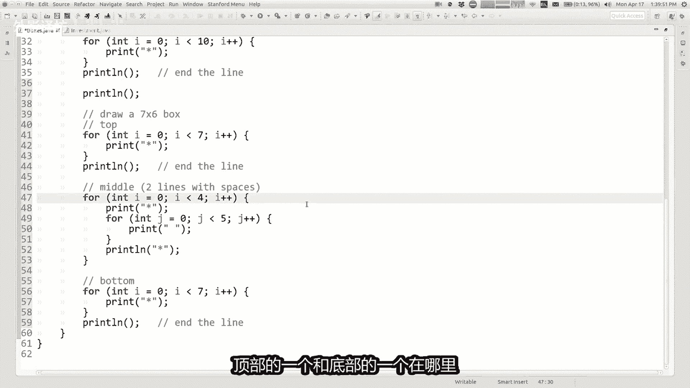


```java
// 绘制顶部
for (int i = 0; i < 10; i++) {
    System.out.print("*");
}
System.out.println();

// 绘制中间部分 (高度为4，所以有2行中间行)
for (int i = 0; i < 2; i++) {
    System.out.print("*");
    for (int j = 0; j < 8; j++) { // 10 - 2 = 8个空格
        System.out.print(" ");
    }
    System.out.println("*");
}


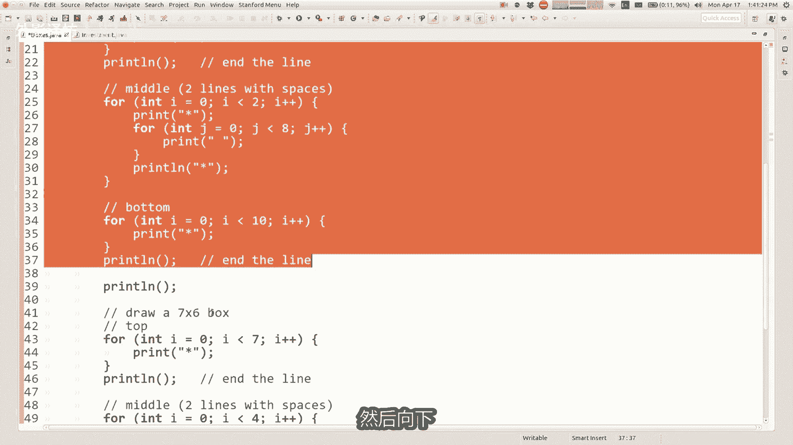

// 绘制底部 (与顶部相同)
for (int i = 0; i < 10; i++) {
    System.out.print("*");
}
System.out.println();
```

现在，如果我们需要绘制一个7x6的方框，我们可能会复制上面的代码，然后手动修改其中的数字（如将循环的10改为7，将8改为5，将中间行循环的2改为4）。这导致了代码的冗余。

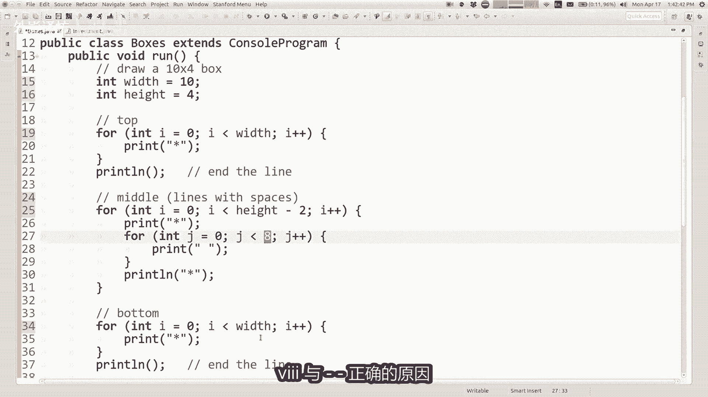

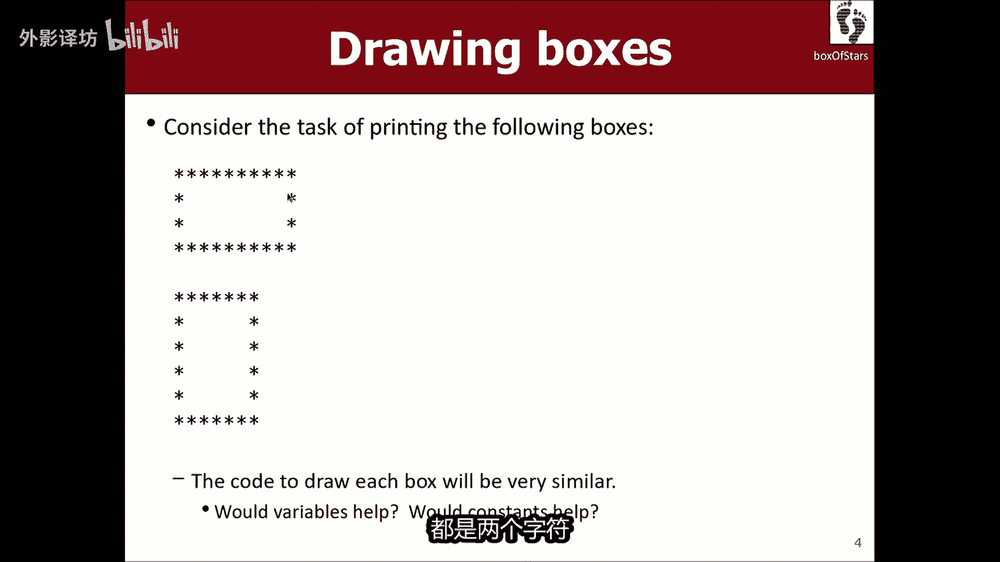

上一节我们看到了编写具体功能代码的局限性，本节中我们来看看如何通过变量来初步实现通用性。


---


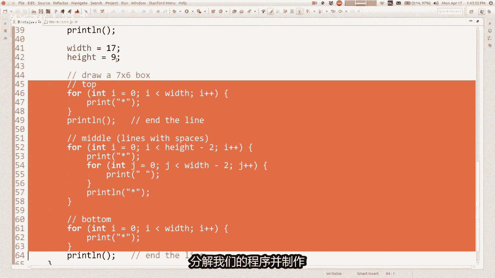

## 使用变量实现初步通用化

我们可以使用变量来代表方框的宽度和高度，从而让同一段代码能够绘制不同尺寸的方框。

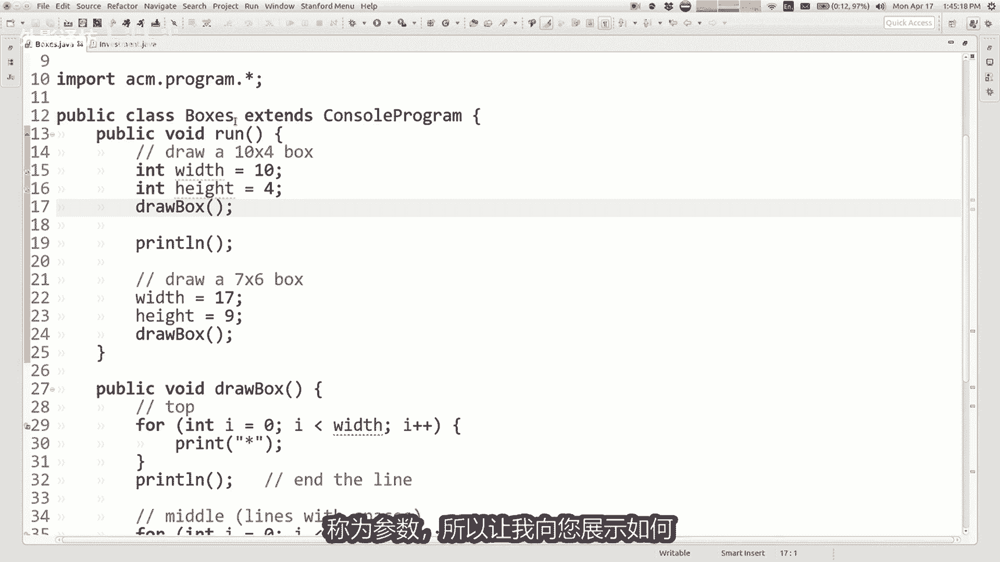

以下是使用变量`width`和`height`的通用版本：

```java
int width = 10;
int height = 4;

// 绘制顶部
for (int i = 0; i < width; i++) {
    System.out.print("*");
}
System.out.println();

// 绘制中间部分
for (int i = 0; i < height - 2; i++) { // 中间行数 = 总高度 - 2 (顶部和底部)
    System.out.print("*");
    for (int j = 0; j < width - 2; j++) { // 中间空格数 = 总宽度 - 2 (两边的星号)
        System.out.print(" ");
    }
    System.out.println("*");
}

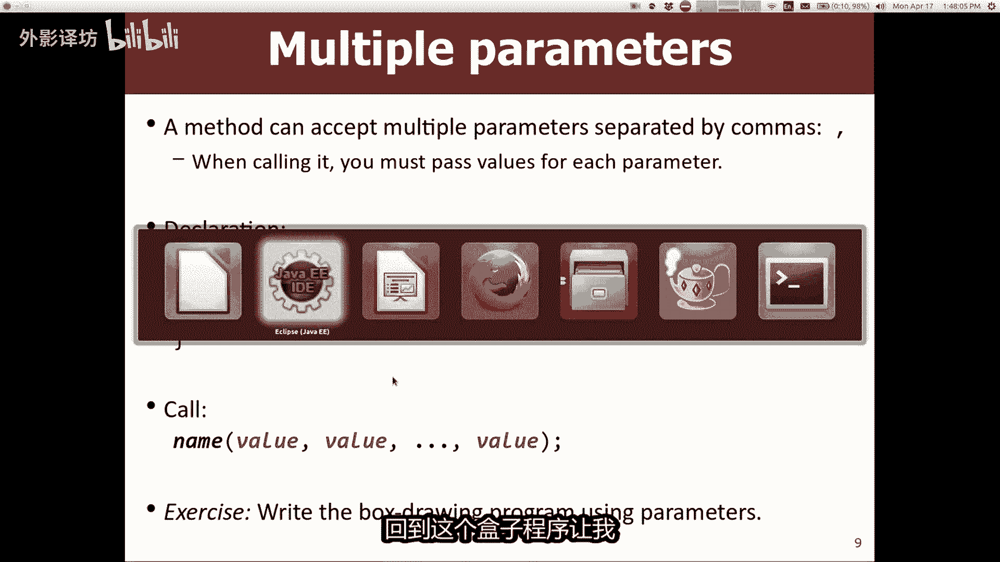

// 绘制底部
for (int i = 0; i < width; i++) {
    System.out.print("*");
}
System.out.println();
```

通过更改变量`width`和`height`的值（例如改为7和6），同一段代码就可以绘制不同尺寸的方框。这比复制粘贴代码前进了一大步。

然而，这段绘制方框的代码仍然直接写在主程序（如`run`方法）里。如果我们想在程序的不同位置绘制多个不同尺寸的方框，或者想清晰地组织代码，最好的方式是将绘制方框的逻辑封装成一个独立的方法。

---

## 引入方法：封装功能

我们希望创建一个名为`drawBox`的方法，专门负责绘制方框。这样，主程序只需要调用这个方法即可。

我们最初的尝试可能是这样的：

```java
public void drawBox() {
    // ... (将上面使用变量的绘制代码放在这里)
}

public void run() {
    drawBox(); // 希望绘制一个方框
}
```

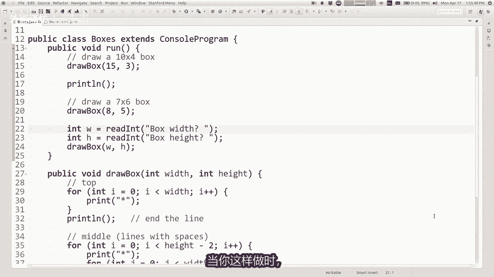

但这里遇到了一个问题：`drawBox`方法内部的代码需要知道`width`和`height`的值，而这些变量是在`run`方法中声明和赋值的。在Java中，一个方法内部不能直接访问另一个方法中声明的变量（这涉及到变量的“作用域”概念）。

为了解决这个问题，我们需要一种机制，让`run`方法在调用`drawBox`时，能够把`width`和`height`的值“告诉”它。这种机制就是**参数**。


---

## 参数：向方法传递信息

参数允许我们在调用方法时，向方法内部传递数据。定义和使用参数需要两个匹配的步骤：

1.  **声明方法时**：在方法名后的括号内，声明需要接收的参数变量及其类型。这就像是告诉Java：“我这个方法工作需要这些信息，请调用者提供。”
2.  **调用方法时**：在方法名后的括号内，提供具体的值或表达式。这些值会按照顺序传递给方法内部声明的参数变量。

以下是使用参数改造后的`drawBox`方法：

```java
// 1. 声明方法时定义参数
public void drawBox(int width, int height) {
    // 方法内部可以直接使用参数变量 width 和 height
    // ... (绘制方框的通用代码，使用width和height变量)
}

public void run() {
    // 2. 调用方法时传递参数值
    drawBox(10, 4); // 绘制10x4的方框
    drawBox(7, 6);  // 绘制7x6的方框

    // 也可以传递变量或表达式
    int w = 15;
    int h = 3;
    drawBox(w, h);
    drawBox(w * 2, h + 1);
}
```

**执行过程**：当程序执行到`drawBox(10, 4);`时，Java会跳转到`drawBox`方法，并将数值`10`赋值给参数变量`width`，将数值`4`赋值给参数变量`height`，然后执行方法体内的代码。执行完毕后，返回到`run`方法继续执行下一行。

通过参数，我们成功创建了一个高度通用化的`drawBox`方法，可以在任何需要的地方调用它来绘制任意尺寸的方框。

---


## 深入理解：参数与用户输入


参数和之前学过的用户输入（如`readInt`）都是为程序提供数据的方式，但它们的来源和用途不同：
*   **参数**：通常由程序员在编写代码时决定传递什么值。它用于在程序内部的不同方法之间传递数据，使方法变得通用。
*   **用户输入**：在程序运行时由用户决定输入什么值。它用于让程序与外部用户交互。

两者可以结合使用，创造出更灵活的程序。例如，我们可以先通过用户输入获取尺寸，再将这个值作为参数传递给绘制方法：

```java
public void run() {
    int w = readInt("请输入宽度: ");
    int h = readInt("请输入高度: ");
    drawBox(w, h); // 将用户输入的值作为参数传递
}
```


---

## 实践案例：投资利润计算器


为了巩固对参数的理解，我们来看一个更复杂的例子：编写一个计算复利投资利润的程序。

首先，我们编写处理单个投资者的代码流程：
1.  获取初始金额、利率和月份数。
2.  通过循环计算复利后的最终金额。
3.  计算利润百分比。
4.  根据利润百分比打印投资评价（如“弱”、“中”、“强”）。


以下是计算最终金额的核心循环逻辑：

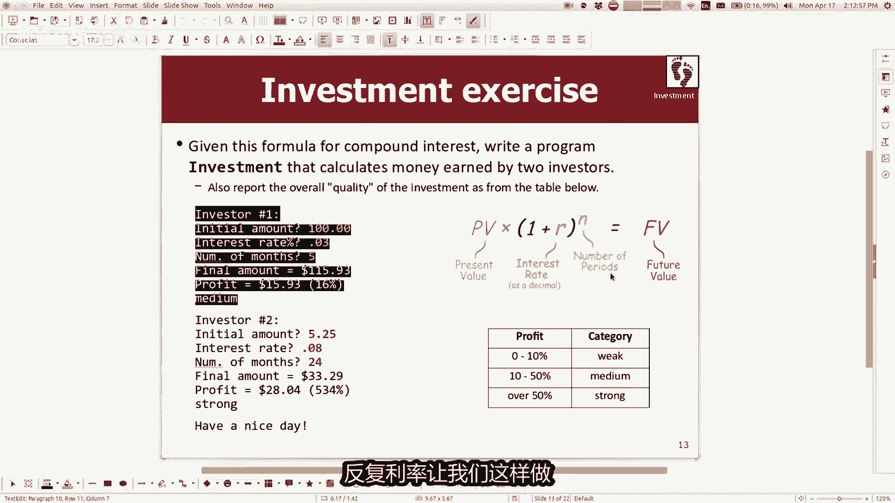

```java
double finalAmount = initialAmount; // 从初始金额开始
for (int i = 0; i < months; i++) {
    // 每月增加当月利息：当前金额 * 月利率
    finalAmount += finalAmount * (interestRate / 100);
}
double profit = finalAmount - initialAmount;
double profitPercentage = (profit / initialAmount) * 100;
```

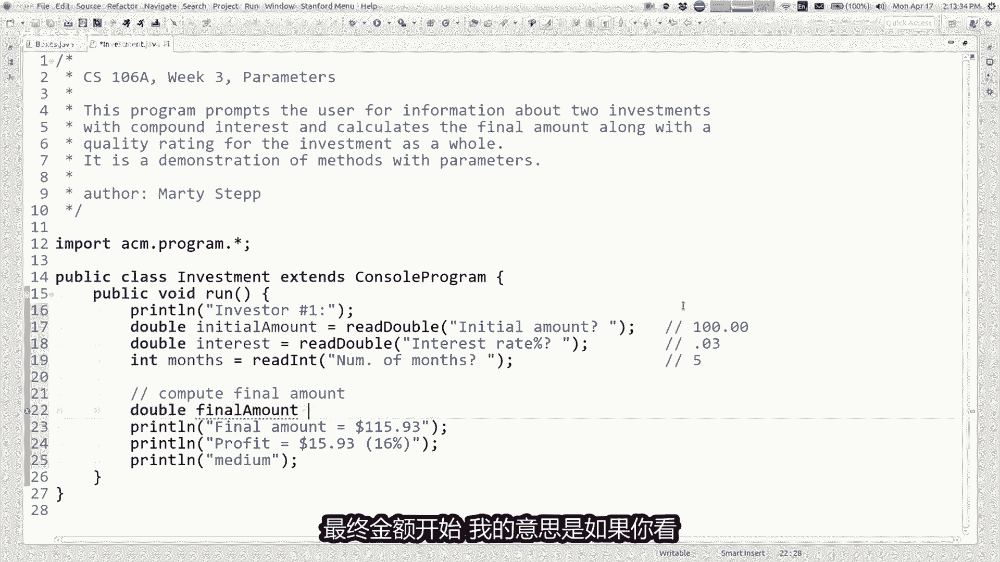

现在，如果程序需要处理多个投资者，我们不应该复制粘贴整段代码。相反，我们应该创建一个通用的`processInvestor`方法。

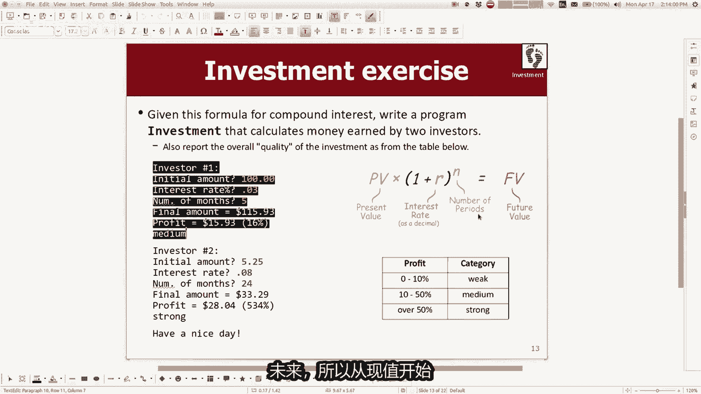


以下是需要传递给该方法的信息（参数）：
*   投资者编号（用于提示用户）
*   不需要传递初始金额等，因为它们可以通过方法内的`readDouble`获取，但利润计算和评价逻辑可以独立成方法。


我们可以创建两个方法：
1.  `processInvestor(int investorNumber)`: 处理单个投资者的完整流程，包括输入和计算。
2.  `printInvestmentQuality(double profitPercentage)`: 根据利润百分比打印评价。这个方法接收一个`profitPercentage`参数。


```java
public void printInvestmentQuality(double profitPercentage) {
    if (profitPercentage < 10) {
        System.out.println("投资评价: 弱");
    } else if (profitPercentage < 50) {
        System.out.println("投资评价: 中");
    } else {
        System.out.println("投资评价: 强");
    }
}

public void processInvestor(int investorNumber) {
    System.out.println("--- 投资者 " + investorNumber + " ---");
    double initialAmount = readDouble("请输入初始金额: ");
    double interestRate = readDouble("请输入年利率 (%): ");
    int months = readInt("请输入月份数: ");

    // 计算复利
    double finalAmount = initialAmount;
    for (int i = 0; i < months; i++) {
        finalAmount += finalAmount * (interestRate / 100 / 12); // 将年利率转为月利率
    }

    double profitPercentage = ((finalAmount - initialAmount) / initialAmount) * 100;
    System.out.printf("最终金额: $%.2f\n", finalAmount);
    System.out.printf("利润百分比: %.2f%%\n", profitPercentage);

    // 调用方法，传递利润百分比作为参数
    printInvestmentQuality(profitPercentage);
}


public void run() {
    processInvestor(1);
    processInvestor(2);
}
```

通过这个例子，我们可以看到参数如何帮助我们将一个复杂程序分解成多个逻辑清晰、职责单一的小方法，并通过参数在这些方法之间传递必要的数据，从而大大提高了代码的可读性和可维护性。

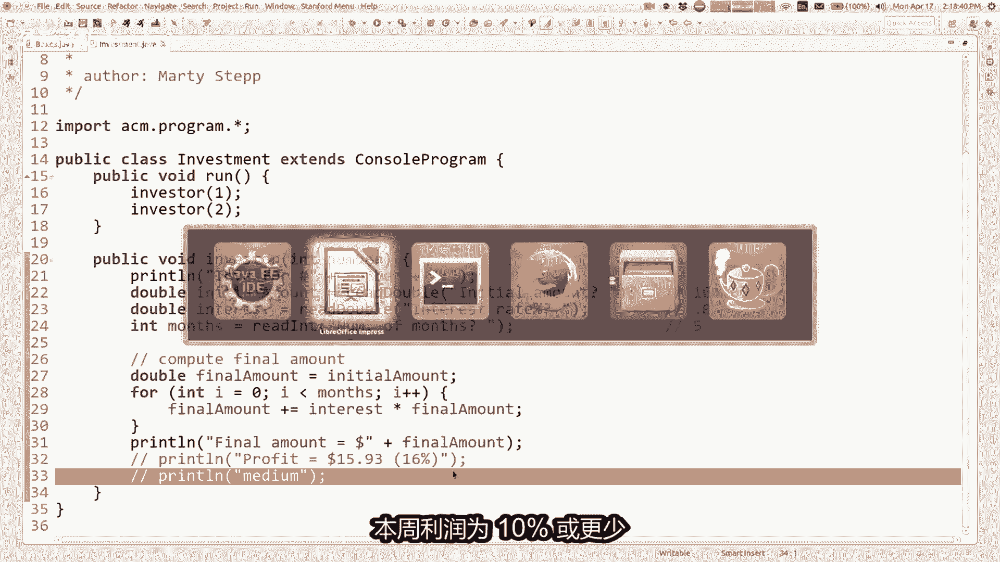

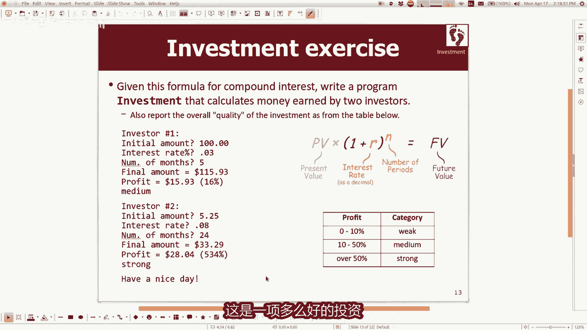

---

## 总结

在本节课中，我们一起学习了Java中**参数**的核心概念与应用。

我们首先从绘制特定尺寸方框的冗余代码出发，认识到编写通用代码的必要性。接着，通过引入变量，我们初步实现了代码的通用化。然后，为了更好地组织代码和实现功能复用，我们学习了如何将功能封装成**方法**。

为了解决方法间数据传递的问题，我们深入探讨了**参数**机制。我们了解到：
*   参数在**方法声明时**定义，指定需要接收的数据类型和变量名。
*   参数在**方法调用时**传递，提供具体的值，这些值会被赋值给对应的参数变量。
*   参数使得方法变得灵活和通用，同一段代码可以处理不同的输入数据。

最后，通过投资计算器的综合案例，我们实践了如何使用参数来分解复杂问题、在方法间传递数据，并区分了参数与用户输入的不同角色。

掌握参数是成为高效Java程序员的关键一步，它将帮助你从编写单一功能的脚本，转向构建结构良好、易于扩展的复杂程序。

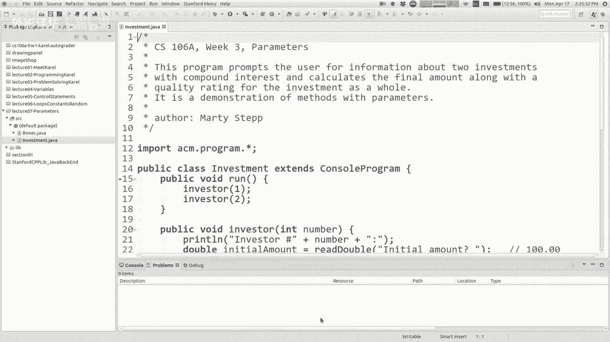

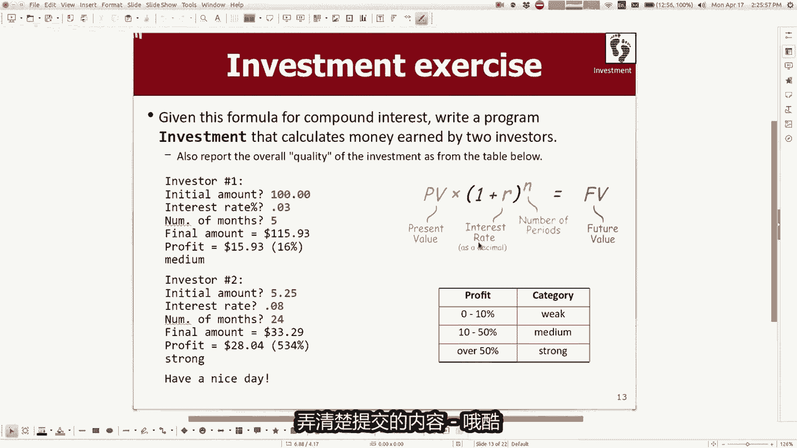

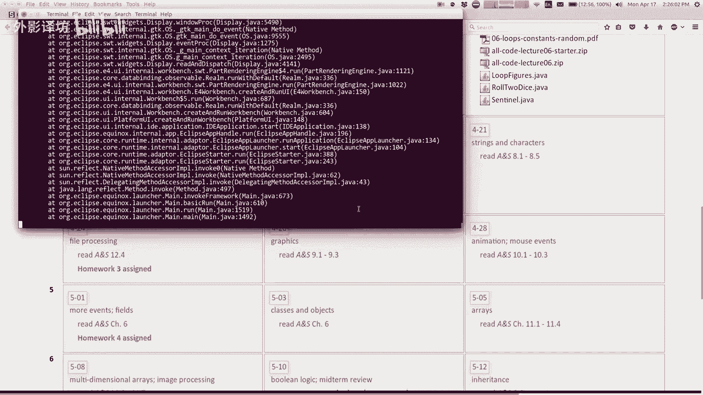


---