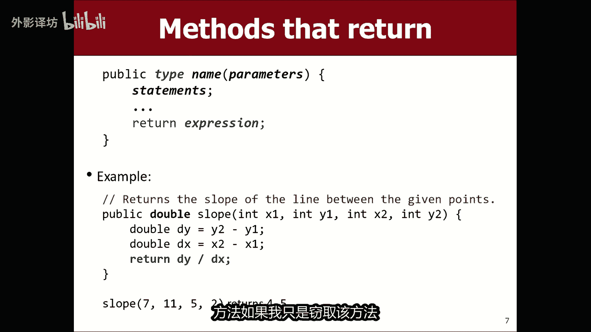

# 课程08：返回值与布尔逻辑 🔄


在本节课中，我们将学习两个核心概念：**返回值**和**布尔逻辑**。返回值允许方法将计算结果发送回调用它的地方，而布尔逻辑则用于处理真/假判断。掌握这两个概念对于编写灵活、强大的程序至关重要。

---


## 返回值：从方法中“带回”结果


上一节我们介绍了参数，它允许我们将信息“发送”给方法。本节中我们来看看返回值，它恰恰相反，允许方法将信息“发送回”调用它的地方。


### 什么是返回值？


返回值是指一个方法执行完毕后，将一个计算结果“带回”到调用它的代码位置。这与我们之前使用的`void`方法不同，`void`方法只执行操作，不返回任何结果。


### 为什么需要返回值？

想象一下，你有一个计算数学公式的方法。如果它只是将结果打印到屏幕上，那么这个结果就无法被程序的其他部分再次使用。但如果它返回这个结果，你就可以将其存储在变量里，用于后续的计算、比较或任何其他操作，这使得代码更加模块化和灵活。

### 如何使用返回值？


要编写一个返回值的方法，需要在方法声明时指定返回的数据类型（如`int`、`double`、`boolean`），而不是`void`。在方法内部，使用`return`语句来发送回结果。

**代码示例：计算斜率**
```java
public double slope(int x1, int y1, int x2, int y2) {
    double dy = y2 - y1;
    double dx = x2 - x1;
    double result = dy / dx;
    return result; // 将计算结果返回
}
```
调用这个方法时，可以这样使用：
```java
double s = slope(1, 2, 8, 4); // s 将存储计算出的斜率值
```




### 重要注意事项

以下是关于返回值需要理解的几个关键点：

*   **返回值是“值”，不是“变量名”**：`return result;` 返回的是`result`变量中存储的数值（例如`0.33`），而不是`result`这个名字本身。调用处的代码需要自己决定如何接收和使用这个值。
*   **一个方法只能返回一个值**：这与参数不同，参数可以有多个，但返回值只能有一个。如果需要返回多个相关数据，可以考虑将它们组合成一个对象再返回。
*   **`return`是方法的出口**：执行`return`语句后，方法会立即结束，其后的代码不会被执行。
*   **你已经用过返回值**：例如，`readInt(“Enter a number: “)` 和 `rg.nextInt(1, 10)` 这些库方法都会返回一个值，你将其存储在变量中（如`int n = readInt(...)`），这正是在使用返回值。


---

## 实践：改造投资利润计算程序

让我们运用返回值来解决一个实际问题。假设我们有一个计算投资利润的程序，现在需要比较两项投资的利润差。


**问题**：原程序中的`investor`方法直接打印利润，导致主程序无法获取利润数值来进行比较。
**解决方案**：修改`investor`方法，使其从`void`改为返回`double`类型，并在方法末尾`return profit;`。这样，主程序就可以调用该方法并获得利润值。

**修改后的核心逻辑**：
```java
// 在run方法中
double profit1 = investor(); // 调用第一个投资者的计算，并接收返回的利润值
double profit2 = investor(); // 调用第二个投资者的计算
double difference = Math.abs(profit1 - profit2); // 使用Math.abs()确保差值为正
println(“利润差额为：$” + difference);
```

通过这个改造，我们成功地将计算逻辑（`investor`方法）与结果的使用逻辑（比较和打印）分离开，程序结构更清晰，功能也更强大。

---


## 布尔逻辑与布尔类型 ⚖️


接下来，我们学习布尔逻辑。布尔逻辑是程序进行判断和决策的基础。

### 布尔数据类型

Java中有一个名为`boolean`的基本数据类型。它只有两个可能的值：`true`（真） 和 `false`（假）。它的主要用途是存储逻辑测试的结果。


### 布尔变量


你可以将逻辑表达式的结果存储在一个布尔变量中。这样做的好处是让代码更易读，尤其是当某个逻辑条件很复杂或需要多次使用时。

**代码示例**：
```java
boolean isMinor = (age < 21);
boolean isFull = (students >= capacity);
// 后续可以清晰地在if语句中使用
if (isMinor || isProfessor || !likesCS) {
    println(“不能进入俱乐部。”);
}
```

### 返回布尔值的方法

一个非常常见的模式是编写一个进行某种测试并返回布尔结果的方法。这类方法的名字通常像`isEven`（是偶数吗）、`isPrime`（是质数吗）。

**代码示例：判断奇偶**
```java
public boolean isEven(int n) {
    return (n % 2 == 0); // 如果n除以2余0，返回true，否则返回false
}
```
使用这个方法可以让主代码非常清晰：
```java
if (isEven(number)) {
    println(“这个数是偶数。”);
}
```
你已经在库方法中见过这种模式，例如`frontIsBlocked()`方法就返回一个`boolean`值。


### 布尔方法的简洁写法


对于返回布尔值的方法，可以利用逻辑表达式直接返回结果，使代码非常简洁。

**示例：检查三个数是否均为奇数**
```java
// 详细写法
public boolean allOdd(int a, int b, int c) {
    boolean test = (a % 2 == 1) && (b % 2 == 1) && (c % 2 == 1);
    if (test == true) {
        return true;
    } else {
        return false;
    }
}
// 简洁的“禅意”写法
public boolean allOdd(int a, int b, int c) {
    return (a % 2 == 1) && (b % 2 == 1) && (c % 2 == 1);
}
```

### 实践：判断质数

让我们尝试编写一个`isPrime`方法来判断一个数是否为质数（只能被1和自身整除）。

**思路**：
1.  质数必须大于1。
2.  对于大于1的数`n`，检查从2到`n-1`的所有整数。
3.  如果发现任何一个数`i`能整除`n`（`n % i == 0`），则`n`不是质数，立即返回`false`。
4.  如果循环结束都没有找到能整除的数，则`n`是质数，返回`true`。

**代码框架**：
```java
public boolean isPrime(int n) {
    if (n <= 1) {
        return false; // 1及以下的数不是质数
    }
    for (int i = 2; i < n; i++) {
        if (n % i == 0) {
            return false; // 发现因子，不是质数
        }
    }
    return true; // 循环完毕未发现因子，是质数
}
```
请注意`return false;`在循环内部的位置，它允许我们一旦确定不是质数就立刻结束方法。循环后的`return true;`只有在所有可能因子都检查过后才会执行。

---


## 总结 🎯

本节课中我们一起学习了：
1.  **返回值**：允许方法将计算结果送回调用处。通过将方法声明中的`void`替换为具体类型（如`double`），并使用`return`语句，我们可以创建能嵌入表达式中的有用方法。
2.  **布尔逻辑**：`boolean`类型用于表示`true`或`false`。我们可以创建布尔变量来存储逻辑测试结果，也可以编写返回布尔值的方法（如`isEven`, `isPrime`），这能让我们的条件判断代码读起来更清晰、更接近自然语言。


返回值和布尔逻辑是构建复杂程序逻辑的基石。理解它们需要一些练习，当你开始在自己的程序中主动使用它们时，你会发现代码的控制能力和表达能力都得到了显著提升。