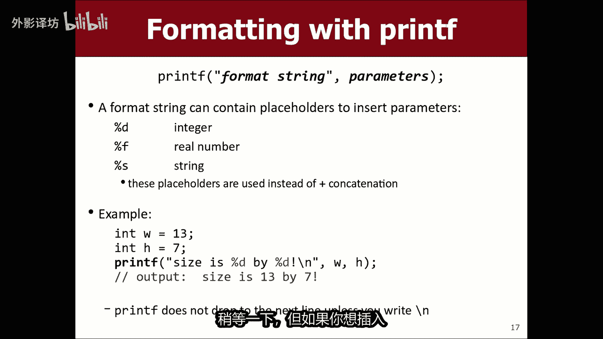

# 【中文配音】斯坦福王牌课程 CS 106a Java教程 2017年春季课程 - P9：09_ Strings - 外影译坊 - BV14U4geNEEq

现在是第三周了，星期五以及我想教你的，今天要讲的是一个叫做字符串的东西，你知道周五的最后几个有一个新任务，这周出去了，我们没有新的，今天发出的作业将会有周一讲座结束后出去的，所以你知道记住。

那就是我们这个周末的日程安排，你仍然会做作业，两个也许在我之前和你的伴侣开始，我想要的新话题，提到一个我没有时间的话题，本周早些时候刚刚得到时间紧迫，所以我要去参观一下。

现在他的命令叫做print tyt，和它是一个有用的命令，可以帮助你以自定义方式格式化数字，一直回到幻灯片。

星期一，所以我要跳到那些幻灯片，现在这里是周一的幻灯片时期。

现在讲座你们已经看到了命令print line，甚至打印到在控制台上显示输出，另一个命令叫print f，代表具有特定格式的打印，这个命令的格式有点奇怪，它有很多不同的，你知道的可以使用它的方式。

而我却没有，我认为会涵盖所有这些，我想使用这个命令的主要方式是，限制A之后的位数，当我们打印双精度数值的小数点，我想向你展示一些关于用于该目的的命令语法，print f f是你写的字符串输出。

你想要打印的内容，然后你放了一个逗号，然后放了一些附加参数和我已经描述过的，现在这些，所以print have，你知道如果你想要显示一行输出，具有该行中变量的值。

你可以做对，所以让我展示一下，你举个例子，如果你去日食，我市只是要去这个文件，这只是一些空文件，如果你有像INTEX的文件等于四，且Y等于17，如果你愿意打印，你可以做的两个值，像这样。

你知道打印行X是X右边加上Y是Y右边，上周我们一直在这样做一周，所以就是这样一种注入变量的值，进入控制台的输出，对了，还有另一种方法可以做到这一点，相反如果你使用冰箱F命令print f。

你仍然把引号括起来，你想要的输出，但相反结束字符串的排序和插入变量，然后开始再次使用这种引用的字符串，加上语法，在这里你只需写像这样的，X是空白，Y是空白，然后你把实际上写一个空白，你写什么。

这里称为格式占位符，基本上是说我想插入一个变量值，就在那里，你有以你想要的方式告诉他。

插入它以及你的值类型，尝试插入等值，你实际上写的是，你可以将十进制整数写成百分号D，百分比F代表A所谓的A小数或浮点数，又名一个实数，我们将讨论的字符串的IKS，今天我将回到这张幻灯片，稍等一下。

但如果你想插入X和Y的值。

你可以说百分比D对于整数和百分比D，对于整数，然后是你告诉的方式，你要放什么整数，用逗号分隔，你说第一个百分比D应该是X，第二个百分比D应该是Y，所以这个的读数是当java要打印这条消息时。

他会在消息中查找这些内容，百分比代码，然后映射第一个第一个变量get it的百分比代码，将第二个百分比代码映射到第二个变量，这只是一个插入变量的替代语法，变成EQU，好吧，那就是这样是为了开始。

但好处是，print f是否还允许您格式化，这些数字的显示方式，我觉得他变得更有趣了，当你有gg pa之类的东西时，等于你进入的任何东西，学校的某种平均绩点GPA，我想要打印我的GPA。

所以如果你打印拎GPA加GPA加，你知道是的，或者类似的，你会看到所写的数字，你可以用print type做同样的事情，你可以说打印FGPA是，你不说百分号D代表你所说的整数。

百分号F代表小数或实数逗号，这逗号GPI还可以，所以看起来就像从技术上讲，离印刷是这样的，向下到下一行，然后打印F除非你愿意，否则不会您指定要去的地方，下一行是插入斜杠，在这里的标记中就像放下线一样。

很多人在斜杠后写print，最后所以基本上这是一样的，因为这个和这个和这个是一样的，好的，但不会很有趣，如果print type只是一个替代品，print ln它有一个很好的功能。

比如我说你可以控制数量，小数点后的数字和你这样做的方式。

就是你在F之前你写一个点，然后写一个数字，然后这个数字将告诉你有多少位数字，如果你说派是点2F，你是说小数点后两位点，所以我的意思是让我告诉你。

如果我回到代码，并且如果我说百分号，而不是百分比F，然后当我运行这个OS10。2F，当我运行这个时，它被称为弦乐练习，看第一个，打印GPA的所有数字，因为我刚刚为此打印了L就在这里，第二个打印它3。

14，实际上将其四舍五入到两位数，不将其四舍五入到位数，你要求好的，那就是非常有用的命令，这是迄今为止最常见的，我使用print half的原因是它的小数点，你也可以拥有像你一样的东西。

知道MARTIGPA双倍等于4。0或任何，你可以说你知道马蒂的，但我不知道获得4。0GPA，但不管我说什么点，你知道3F是的，如果我改变这个马蒂的GPA等于什么马蒂GPA，然后是马蒂GPA。

如果我的话运行这两个，你会看到的是马蒂说GPA4。0，所以我希望你了解零的位数，我在这里写的，他不会打印，他们这里基本上只是输入一和零，这就是它的格式，这是使用时的默认格式，Brt in。

你得到的默认值是显示它的所有相关数字有问，但是下面我说百分号点三，F是说给我三位数字小数点后，不管是什么，在变量声明中有这样，这对于sc fix类型很有用，你想要那些零的东西成为他们的好的。

作为一个简单的例子，你可能会用这个，你记得我们写了这个投资计划，打印这个人赚了多少钱，关于他们的投资和我们一直以来的事情，这周看看，有一个我们在这里有很多不同的地方印钱，所以我忘了具体是什么。

我们在这里输入的数字，但和你一样，知道你是否说出示金额100美元，八个月3%利息就出来了，看起来像这样凌乱，那就是羞耻吧，所以如果我想解决这个问题，我只要转到输出的那一行，我改一下吧，那最后那个在哪里。

金额就在这里，所以我只需更改为说打印F而不是加上金额，你用逗号这里写什么，百分号while，百分号DOTA2F，通过浮点或后面有两位数的固定数字小数，我想我会在里面加一个斜杠，这样就可以了。

让我运行一下，看看100块钱八个月，3%的利息，看起来很糟糕吧，好的还有另外一件事。

我在幻灯片上没有提到，您可以在前面输入另一个数字，我在这里称之为W的点以及什么，另一个数字的含义是你想要的数字的总宽度，占据屏幕，如果你想要对齐可能的东西不同的位数，所以我会显示，如果你回到在这里编程。

也许是你想要的数量，这是为了与其他东西对齐，或者不管你怎么说。

12%f这只是意味着打印数字，计算该数字占用的总空间为十个字符，但输入两个小数点后的字符，这样你就可以比如说100美元，3%利息八几个月了，在这个例子中，我认为看起来不太好，因为他很友善。

与美元符号分开，但如果这里还有另外的金额，钱也会在这里排队，小数点就在那里，并且那里的两位数字代表每分，每个数字都会排列起来，这样会使这些数字有点正确，彼此对齐，这可能是很好，所以我不经常使用该语法。

我主要想要百分点F，所以你知道我想让你这么做，了解该语法，因为您可能将在未来的任务中使用它，或者一些事情，但我不会详细讨论关于print的详细信息，因为有一个数百万种不同的格式和方式。

你可以太多地使用print type，今天讨论的问题是关于相当不错，是的，是的，如果只是这样，请提出一个好问题，这样4。0是一个零，五写百分号point3F现在会加零吗，宣言中没有的，答案是肯定的。

他会让号码后面有三位数字小数，因为这就是你问的，为了所以4。000，是的是的，我认为没有什么优势，这里有一些案例，其中一些我只是压住，因为他有点外面界限，但如果你给的太小宽度，并且东西比哪个更大。

它只是超出了宽度，所以如果我说2。2，那是不可能的，为了让它适合，因为只是为了拥有两位数，和它已经存在的点三个，所以它会忽略，在这种情况下，点之前有两个不喜欢像我说的那样砍数字，4。2。

你可能会想象有一个数字大约，然后还有两个以前，但他不喜欢切片数字关闭，它永远不会修改的数字，这样就像如果我运行它，并且我投资了两次，我说180个月内降价三个百分点，仍然是它，只是它溢出了四个。

这四个被忽略了，基本上还好，事实上由于这个原因，我经常录喜欢在点之前加点东西，因为它的作用有点奇怪，在某些情况下是对的，所以很漂亮，我没什么可说的，我想把它塞进去，在开始今天的主题之前。

这是字符串，所以让我跳到那些幻灯片这些事讲座幻灯片。

今天那不是这里，而是这里。

好的，这是从第八章开始的，我们跳来跳去的书，这里不过要讲一个新的数据类型，称为流，也许你知道什么是，刘氏你可能听说过这个词，在这堂课之前一点，当你有一个字符序列时，我们用引号读取流。

他们周围是我想教书的原因，你关于他们的原因是流，有趣的是，因为有很多数据，您可能想阅读，编程和检查和处理和用as s在文本中计算事物，格式化单词，段落和事物，这将被操纵为字符串，由您的代码组成。

所以这是一个非常基本数据类型，几乎任何你将要使用的编程语言，知道里面会有钱，你会很好的操纵字符串，重要的事情有一些相关的，我们还将教给您相关知识，或java特定的其他数据类型，叫做关心性格，我会说话。

稍后可以，所以字符串序列，字符零个或多个字符可以声明一个变量应变，你可以存储一个值，一旦你完成了，就会出现一条用引号引起来的消息，制作了这个字符串，你可以做很多事情，与它不同的东西。

你可以通过它作为参数，你可以打印出来，稍后使用print，有一大堆你可以做的事情，这是一个例子，我说的是显点，但我没有说，只需将其设置为是I中的字符串即可，说它等于加号一些东西，加一些东西。

所以我建立了一个消息，我将所有内容存储在那里有，所以我认为它会存储流括号，三个逗号空格，五个括号，好的，你可以存储所有这些所有这些连接的结果，存储到留点，OK并且我承认今天的幻灯片。

我使用了很多说唱歌手的名字，和我不知道的东西，知道为什么，我感觉像你包括各种说唱和嘻哈艺术家，今天的街道，但无论如何，如果你制作一个字符串，它有一个序列，我们想到的角色拥有与之相关的数字。

有一件事有点奇怪，关于第一个字符有数字，零和下一个字符有数字1234偏离一，你可能会期待什么，我可能很久以前就提到过这个，当我们数东西或数字时，我们经常从计算机中的东西开始零，你知道这通常对应于四个。

以I开头的循环等于零，有很多这样的东西，事情就是这样，作品第一个字符是字符数字零，他们为什么要这样做，我的意思是，我猜想另一种思考方式是有点像，距离有多少个地方，星星是这个角色，这是第一个字符。

巨星号的偏移量，距离起点已经没有什么地方了，我们如何编号，所以总是这样，由具有的一种关系给出令人尖叫的长度，是七七个字符，我们包括空格，标点符号中全部有空格，最后有七个字符，字符比那个数字少一个。

最后一个有七个字符是数字两个或六个，好吧，就是这样，字符串是M我有点告诉你，稍微了解一下它是怎样的，存储在内存中，就像这些小东西存储单个字符的盒子，对此有何深思熟虑，字符串是具有方法的实体。

你可以对他们执行，这有点奇怪，这与什么有关，我要调用对象或对象，以我们要学习的意义为导向，稍后再谈，但如果你想了解一些关于string，你可以询问一个字符串信息，你可以说出你有多少个字符。

你的文字会是什么样子，都是大写等等，所以这样做的语法有点奇怪，帮助您解读这张幻灯片，写一个字符串的名称，然后写一个点，然后写下名称，你想要执行的操作，所以我想要谈谈这个如果我转到此处的eclipse。

我得到了这个这里有一些东西的空白文件，我只是将此称为公共无效打印，打印F我不想真正看的东西，那个代码不再消失，打印F的东西，所以如果你说字符串名称等于马蒂步骤，我也是一个说唱艺术家，如果你不知道。

如果你想做的话，你可以说一些带有你名字的东西，打印黎恩的名字，你知道打印马蒂踩在控制台上，你甚至可以将其与更多消息结合起来说，证明林恩，你知道你知道有史以来最好的家伙，食加上名字或其他什么。

他会说有史以来最好的家伙，马蒂的步骤正确吗，所以你知道你可以在代码中使用该字符串变量，我刚刚向您展示的那些命令，幻灯片是内部的方法，你通常知道的那个字符串，如果你音乐运行你输的方法，FO个括号。

它将执行一个方法，用这个名字，这是一个非常有趣的字符串本身的语法类型，这个变量有一些存活的方法，里面有点奇怪，但是你可以说类似print l名字有加号，名字点长度加号。

字符合此语法点，长度基本上意味着进入这个绳子，并问他有多长，他有很多角色，所以这是一个我们必须使用新的语法，但这是你的一些方式，解锁内部的一些行为，这些字符串对象，如果我继续并且运行这个程序。

我认为这种行为不太奇怪，上面说马蒂是有史以来最好的家伙，马蒂步骤，马蒂步骤有11各角色，所以他说11，因为当然是包括马丁和之间的空间，斯蒂芬认为空间也算作性格对了，所以那些论文我的意思是。

你可以调用四种方法。

你可以用作很多不同的事情，我可以说他们喜欢，而不只是名字，将名称改为大写。

现在他会说，有史以来最好的家伙是马尼斯蒂芬大喊说，你知道我在喊我的名字吗，现在这些都不同了，你可以执行的操作，好吧嗯。

这里还有一个命令叫做子字符串方法，这很有趣，这是对，由你在其中分离出一个基于特定范围的字符，您传递索引一和索引二的索引，它会给你的部分从该索引到的字符串。

但不包括结束索引索引，例如如果我在这里访问这个程序，我说字符串名字等于，如果我执行零，则命名从0~5的点子字符串，到五没关系，我不会打印他变量，所以你看不到它任何有效的地方都强调黄色。

和他说变量没有被使用，那么如何关于我是否只写名字好的，然后你就会看到有史以来最好的家伙马蒂，现在你可能会说好吧等等，为什么它是0~5，因为如果你真的在看这些索引，你会说这是索引，0123456789十。

如果我想要马蒂，那就是这样，索引是0~4，所以你可能会说好的子字符串0~4，如果你运行它，这样就说明了有史以来最好的家伙标记，我大三时有一个好朋友高，你认识的人有麻烦念出我的名字，然后他就叫我mart。

后来我还是那个人和我女朋友的朋友，就像他为什么叫你马克一样，我好像我不知道，所以他就像好吧，它就像你的前半部分名字，我会叫你的另一半你的名字，所以他叫我希，因为我的名字被标记在我的实际名字正确。

所以直到今天他仍然叫我希，这有点奇怪，但是不管怎样，这样你就可以切片不同的，我不知道的人名的某些部分，认为这个故事非常相关，我们正在谈论的是，虽然想起了他，但感觉就像我应该说嗯。

你可以把这些切掉字符串的不同范围，SUBSTRING方法，第二个参数，你通过的不是直观的学生，因为你想说，因为你从0~4，但你有实际上说五，你必须上升一，比你想象的更远，去让他做正确的事。

我无法给你一个很好的答案，我认为这是为什么，推理是你写下第一个要包含的字符，然后你写按下第一个字符已排除您，这就是这个项目的方式，所以无论如何，你的程序似乎与你的程序不符。

第二个参数需要比你想象的更重要，你需要这样，到目前为止，关于字符串的问题，用这些这些方法或者是的，是啊是啊，好问题，他说的好，但我们所做的是随机数，和你通过最小值和最大值，包括第二个端点号码。

这个号码是独一无二的，所以你的你的问题让我回答你问题，然后是另一个问题，最重要的是你说这是关闭的，其中之一是特定于子的，在这里我想说的是，它是全球性的，适用于整个字符串，当你使用这个子字符串方法。

这时他总是如何表现，但事实并非如此，与此特定有关的任何事情程序，所以这就是它的工作原理，带有子字符串分中的流，为什么会这样，由于随机的不同之处在于某种相关的问题，或者也许是也是你问的原因。

随机的不同是因为我们的教师编写的随机数库，他们认为包容性，排他性界限令人困惑，所以他们做到了，所以它包括两者端点，所以你可以说那是更容易理解，你也可以认为它应该保持一致，如果其中一个排除。

另一个应该排除，这样你就知道他不是，这确实是我的选择，但无论如何，我认为这属于工作保障范围，就像麻瓜一样的类别，无法弄清楚这些东西，但你将成为训练有素的巫师，可以处理这种奇怪的事情好吗，无论如何。

这些都是字符串和方法。

让我跳回这张幻灯片，这里是我不会再举一些例子，在这张幻灯片上花了很多时间，但是你知道你可以询问A的长度，像S1这样的字符串，有十个字符搜索字母的方法，索引在or或另一个字串内字符串。

所以黑S1你的索引是多少，他找到他的第一次出现，第一个总是在or f旁边说，你通过了狗的索引是多少，会说从六开始或返回在六处，你可以说S1子串六九从六开始，但不包括九，所以这是狗作G等等。

如果你愿意的话，可以科学这个词来自艺术和科学java的，你只需将六子串到，我想这就是你想要的好的，我讲过的那些方法，about就像子字符串导大写的小写的一件事，可能是对他们来说不直观的是。

他们没有修改您执行他们的字符串，所以如果你说spring s等于小，哇哇，这张幻灯片已经过测试版了，不相信，然后你说不，仅从语言的角度来看，发生这种情况的原因是。

因为这个to operate方法不修改exit，只需创建并返回一个新字符串，这是S的修改版本等等，只是从实际的角度来看，你需要吗，你必须接受那个调用，并将其结果存储在某处，或如果您的目的是修改原始内容。

您应该将其存储回变量，您调用它的变量，您应该说S等于S点大写。

然后如果你打印S你会看到变化，你就知道你是否不管我是否意识到我的行为，幻灯片上描述的情况发生在这个程序，意味我先打印名字大写，或者之前我是将let's say name打印为大写LET。

我再次重新运行该程序，将点命名为大写，它表示聪明的东西大喊大叫，但现在再下一行，我再次打印它，它不是大写的不在，所以你看调用该方法不是修改名字，只是暂时的，如果我将其作为该行的资本。

真的希望名字是大写的计划的其余部分，然后我可以说，名字之类的东西等于其自身的大写版本，将名称更改为大写，相当于这样的方式，如果我说谁是最好的，请立即阅读，伙计他会大喊大叫，在这条线上。

他当我打印时也应该是大写长度，它是大写的长度线也是这样，很常见很常见bug，很多学生们他们只会写，然后他不喜欢这样做，任何你不知道的事情，如果你只是说他实际上并没有修改屏幕，还是基本还好一点，嗯不直观。

但这就是他的工作原理，现在有趣的是，要求用户输入你们学过的字符串，读入已加倍，要求用户输入，你可以要求用户提供的号码，还有一个字符串和命令，这样做称为读取型，就像你有中位数，我们不读你的线。

说出你最喜欢的词是什么或什么，你的名字或类似的东西，该方法会等待你做的事情进入，直到按ENTER键，然后他们输入的任何内容都会被返回，你可以将其存储为字符串，以便在我的代码在这里，我说字符串单词等于和。

现在我有了它们输入的那个词，我可以像使用其他字符串一样使用它，所以我打印了一个defrustration has14字符，并且以D开头，所以实际上是很有趣的，我问字符串以D开头，对于从0~1的子字符串。

因为它从零开始，但它排除一切都从一开始，这样你就可以得到一个角色，在街道的起点我不知道，这就是读取字符串的方法来自用户，我想做一个练习，你们的名字有问题游戏，所以你要求用户输入他们的姓名和书籍。

他们的名字和你分别打印他们的姓氏，香蕉法，纳敌人或任何有关的歌曲，这两根弦现在还好，我会像往常一样，我想帮助你们，所以我已经做到了，这个计划对你来说最困难的部分。

你只需要帮我做简单的事，我做了我询问用户的部分，为了他们的名字，现在你需要做其余的部分，是的，所以现在记住，如果你愿意的话，查看应该打印的输出。

看起来是这样，看看效果如何，它有50个，并且分别在做，就像代码中那样发送的单词。

这个变量会像你一样存储，知道0。50美元，所以为右侧，但我们不知道到底有多少他们要打的字母，我们不知道他们要放什么，我们可以假设他们会输入名字和空格和姓氏，这就是我们应该假设第一个任务可能是。

如果我们可以隔离这两部分，那么我们就可以做点什么，对他们每个人来说都是正确的，你能帮我做到这一点，我该怎么做这个字符串，并将其变成第一个，你认为名字和姓氏，好的寻找的是调用方法。

一个特定的字符并寻找空间，你要问的方法是，所以如果我说第一个和最后一个点，将返回给我的空间索引，该空间位于哪里，好的，我可以，如果你想要的话，将其保存为变量空间等于现在好吧，所以他会。

告诉我就像在例子中一样，50每分，那么太空将返回五，因为所以五处有一个空格，现在我如何获得50并发送分离，是的，你的羁绊还好，我确定我是流媒体，名字等于我要取从中取出子字符串。

这样这个点从名字开始的子字符串，从流的开头开始，所以他从零开始一直到哪里，就像空间在哪里，就是空间一是空间加一，所以当然第二个直觉是什么，这里的参数应该是什么，你要排除的第一个字符。

我认为我们的第一个角色要排除的是空间，本身是的，所以我认为你接下来的五个是第一个，我们想省略一个，所以我认为只有零空间还可以很棒，然后姓氏就是名字，从空格开始的最后一个子字符串，加上一个很棒的小技巧。

如果第二个参数是，我想要从这里到字符串的末尾，你实际上可以省略第二个参数，你隐式的走到最后，如果你确实想走到最后，可以说第一个和最后一个有长度，直到好的长度，所以现在在这里姓氏中的名字以及我的名字。

想做的只是你知道的一位方法，在实践中是好的方法，我想写一个方法名，你给我50分，然后我会打印的歌曲，一首大约50的歌，如果你超过我分，我会播放关于美分的歌曲，所以我有点想要像歌曲的名字一样。

歌曲的姓氏将会过去，每个字符串作为参数记录该方法，这样他就会在歌曲中运行，那根绳子就一分钟，确保我们到目前为止一切顺利，可以说print ln字符串是加上名字，所以只需说打印他们的内容。

让我们尝试命名游戏并，好的准备好绳子是马蒂，我认为我们正在做的一系列步骤，好的，到目前为止代码还好，所以现在我想要你基本上知道这首歌，所以我的意思是，如果你需要的话，我可以打印这些文字。

但还有一点比没错，我需要什么样的东西在这里做，就像如果你通过snoop，那么我需要一个打印snoop，Snoop booboo，就下好吧，Snooke，SNO部分还不错，我可以写print命名空间名称。

ball就是这样，再次命名将打印snoop，不窥探是对的，我想实际上我不知道想让这笔更复杂，这必须是我认为我更愿意的做的，只是省略第一个字母，所以它是像马蒂马蒂博巴迪香蕉哦，哦不就像创伤性的闪回。

重新上小学，你最好相信我被称为放屁马蒂在操场上，但我表现出了我从他们身上开始，感觉就像，我今天有点过度分享了好吗，抱歉，这部分错了，正确的是他的公民称他数据打印，马蒂马蒂工马蒂，我想要弓八蒂。

我如何获得八蒂，子串式的投影的好方法，子屏幕可以，所以命名为点子字符串，什么指数有很多，从一开始的索引去哪里好吧，我一路走下去，到最后所以就不要写了，还有什么吗，是的。

我想我会用名称中除的部分之外的部分，没有第一个字母我要使用好几次了，为什么我不保存呢，就像他自己的变量一样，比重新计算的流，让我们称之为在名称末尾加上后缀，这样就更像后缀。

这样会打印MARIMARIBARD，让我们一起节奏吧，bot加RT没错，这就是我的想法，我们在这里，然后再做第二次，歌曲名称banana fina f o f加右后缀。

这是FOFTYFRANKLINV5mom加后缀，最后一个是，我喊出这个名字，就像这样，该权利命名为大写家感叹词，类似这样，好的准备好了，让我们试试吧，让我们做50，每分5050BO5是P5泡沫。

如果踢分中央弯曲的香蕉扇发泄，我感觉凉爽，就像我们在一起度过了真正的时刻，不管它看起来怎么样，我们都在工作，做到了马蒂步骤完全不起作用，就像他那样，但点击点击任何东西，那我不想陷入这样的境地。

识别辅音促或某些就像我们可以那样做，但是这很难，我不想真正想要弄清楚，但只是想玩使用字符串并使用参数进行演奏，并使用这些方法进行游戏，例如这有道理吗，字符串基本操作术语以及变量和参数。

所以任何关于这个程序的问题。

好的，那么我们来谈谈我们之前学过的关于累计算法，例如where1搬家，并计算一个夏天或某物积累A的价值变量，你也可以累积一个字符串，有点不太明显，你可以这样做，或者你为什么想要要做到这一点。

你可以连接字符串，他们用这个加号运算符，你可以连接到现有的末尾，使用加等于的流变量，运营上你基本上是在设置这个绿色，等于它本身，再加上一些角色，让你成长，这个梦想你正在连接到该变量。

就像我在这里的例子一样，不会真的这么做，但你可以从一个空字符串开始，错科指示意味着没有字符，什么都没有，你可以说加H加E加Y就可以了，现在慢慢的将它们添加到字符串中，你不会真的这么做。

但更多通常你可能会从蓝色开始一根弦统一，然后任何移动，你将字母连接到字符串上，以便是的，你可以连接字符串，现在在一起，这里有几个例子，我们可能想写的方法，接受一个字符串作为参数，它返回一个新字符串。

所以我被称为结结巴巴的说，你每份都放了两份，字符串中的另一个字符称为反向，您返回，现在字符按倒序排列，这又回到了我们的返回值，上次了解到我想参加字符串作为参数，我想要返回一个新字符串作为结果。

让我们看看一个叫做口吃的东西，如果我去练习弦乐的话，在这里，如果我写一个名为的字符串方法口吃，它需要一个字符串参数，返回一个新字符串作为其结果，目标是如果他们通过我你好，我想要，返回，好吧。

那么现在你该怎么做呢，你用它用了像我一样的积累，一秒钟前，在幻灯片上向您展示了，您为你的结果启动一个流，可以将其称为任何流，结果一开始是空的，但后来你慢慢添加内容，你有吗，关于我如何无法转弯的任何建议。

将该结果字符串转换为HH，是的，好的，所以从索引零开始原始字符串S并获取值，如果你说H之类的话，然后是H成为X0和索引一处的结果，两次这样，是的，所以我想我基本上认为每个都有英文描述，字符串S中的字母。

我想添加两个给接到的那封信的副本，结果，这就是我想做的，所以如果你对其中的每个字母说，字符串的标准做法，就是在所有的上写一个循环字符串的索引，所以索引去从零到字符串的长度，右边小于长度表示向上到。

但不包括该长度索引，所以如果长度是十，你会去从0~9循环的长度，这就是你想要的，每个我想隔离的那些索引字符串的单个字符，就在那个索引处，我可以做到，如果我想要的话，使用子字符串方法，索引处的字符。

我只知道如何询问那个点子屏幕是什么，是的，我想从I到I加一，是的，这可能很难理解，但是基本上从I开始，并在I之前结束，我加一，所以基本上我只是那是这样写，有点奇怪，但是你就是这么说的，那如果我说又怎样。

就像字符串字母等于那是该所引出的一个字母，因此对于每个信将该信拉出来，作为自己的信小串，一个字母串心在我需要，正如他所说，我需要做两个结果中的那些B那么我该怎么办，那，哦是的。

结果加字母表示加字母到结果的末尾执行两次，是的，我觉得这听起来很棒，最后缺少的是这个方法已承诺将返回字符串，所以在这段代码的末尾，我将说返回结果就是那个值被发送出，我们谈论的这个方法。

关于上次你让我进去时的返回，你好，我会回复你，你好，所有字符串的双份副本字符，所以如果你想看看是否它正在工作，你可以说字符串名称等于MARI，然后你可以说极端的名字等于口吃的名字等等，我不能叫他的名字。

我已经有一个变量，公共教师和教师等于我们的老师，然后我就可以打印，结果是加上老师或两个好吧，如果我运行的话，你的整洁是什么等等，我下午跑错了，我想进行流练习的程序，他说结果是madam a RT，并且。

我们仍在了解退货的运作方式，你知道这是一点点，就像这个变量一样，这里发生了魔法，随着时间的推移慢慢变大，然后当我们完成这个循环一次时，我们已经把变量变大了，将其值返回给调用者。

并在这种情况下呼叫者在这里，所以就像他构建了一串ma我们的PTY，我喜欢那个，然后那个值就得到了发送回这里，并得到某种粘贴代替它，所以它有点就像字符串老师二等于这个，并且然后程序从那里继续进行。

你知道那是一种我们上次谈到的回报，我们还在适应的时候，好的，我们如何对该方法提出问题，或关于字符串或传输参数，累积字符串算法。

好吧还有其他几个，你可以像那个相反的那样，稍后你自己考虑一下，但是有时出现的一件事，就是你想测试一下您的筛选值，你知道我们已经做了这些测试吗，如果等级更大，则X等于30英寸，超过60，任何你想做的事。

如果您输入的名称带有字符串，等于马蒂，你知道，如果你知道的话，您输入的密码正确等等，如果你尝试用java来做到这一点，不会表现的正常，这是一个看起来像的代码示例，好像应该可以，但效果不太好。

工作离别的毒对你不起作用，如果您的名字是，请输入您的名字库里欧，然后我会打印一些库里欧之后的歌词，永远不会打印，不幸的是，歌词最好是不能读书，是我们的巨大损失，那些歌词但它没有的原因。

工作是因为坦白说这只是java中愚蠢的java，不允许这些操作员可以正常工作字符串，他们基本上只是返回false太多了，如果你想比较字符串到另一个字符串，你实际上必须以不同的方式写。

它必须问他们是否平等两个，所以这有点令人困惑。

但让我举个例子在这里，就像如果你回到名字，我们正在开发的游戏程序，在这里让你知道游戏歌曲的名字，我不喜欢那样，因为他放了个屁，拿我的名字开玩笑，所以我决定稍微修改一下程序，如果你输入我的名字。

我不会打印那首歌，我只是要打印一些东西，否则我要打印有关的信息，我自己，所以如果我去这里，这里就是哪里，你输入的名字正确，所以我会说你知道如果名字和姓氏会怎样，是马蒂，那么我会做什么。

我要打印一些不同的东西很好，否则如果还没有的话，步骤我会在那里做这些事情，所以现在我修补了它，我不必阅读尴尬的歌，不再有再次编程，并已经步骤黑，印出这首歌并没有做我想做的事，我想要我的意思是。

我正在向你展示一个症状上提到的这个错误，在这里幻灯片你必须把它写成点EQUALS，如果现在等于market，步骤测试将正常工作，所以再试一次马蒂步骤，它很棒，所以当然这是正确的，所以我们就保留它。

但这正是你必须做的，你想将一个字符串语，另一些语言没有，这个像Python或你的东西这样的问题，可以在字符串上说，等于等于可以说equals等于int，并且他们两者都工作的很好，java搞错了。

不幸的是，只是说他们不同，祝福你，这个我有一些变化，在这里结等于一件好事，是你可以问一些事情。

你可以问的不仅仅是严格平等，它们是否相等，忽略大小写，if你可以问大写字符串是否以某误开头，或以某事结束或继续，太好了，这些都是可以用作测试的方法，if if语句或循环一个简单的问题。

如果你可以使用一种方法作为测试，该方法返回什么类型的return，这些方法都返回一个布尔值，布尔值是我们所知道的所有材料，学习所有的混合不同讲座的其他材料。

所以如果我想说的话，你知道吗，这不只是关于我，而是关于所有人，马蒂一家必须承受这个痛苦侮辱，所以我真的只想说，如果这个名字从MARI开始，然后所有MARI都是，太好了，他们不必听到自己的声音。

被称为放屁，所以马蒂琼斯他很棒，你知道，马蒂麦克弗莱，我有很多这样的经历，对于每个人来说都是一件事，嘿马蒂，这是利比亚人，这事利比亚人似的，你们最糟糕的时候是什么时候，情景喜剧马丁播出了。

人们就像在喊主题曲，这意味着我得到的每个人，这就是我在这里接受治疗的方式，告诉你们这一切，所以这些测试有关事物的方法，询问街道确实很有用，一个字符串是否以以下开头或结尾。

与另一个字符串可以是非常强大的操作。

好吧，所以继续前进一点点，这里我只有一些最后一分钟还剩几分钟，但我想告诉你另一种数据类型，你花几分钟在上面称为照顾，是character的缩写，并且它与字符串密切相关，当你制作一个像牛一样的字符串。

并且续集全部，例如单个字母里面存储着这个数据，输入名为运营商，您实际上可以创建护理类型变量和两个商店，正好还剩一个药商店，很多字母和字符很长等等，java区分这两者出于各种原因，但如果你说关怀信等于P。

你可以打印care，你可以将care与A连接起来，绳子它将把两者粘在一起，有些编程语言没有区分这两件事，但是java确实有一些语计算机存储数据的方式，记忆有些与历史原因，语言的出现在java之前。

可以有一个只有一个字母长的字符串，可能你可以有一个字符串，十个字母或100万个字母或零字母，或任意长度的一个字母会付钱，但必须小心，以及声明护理的语法，是你在它周围加上撇号，不在他周围加双引号。

就是这样，java区分它两个字符，真是相关的，你可以询问流对于给定的字符索引，所以这有点像那样，我们在说字串的地方做了把戏，从I到I加一存在差异，在这两者之间，这又是微妙。

所以我认为有些学生有如果你要求的话，就会遇到麻烦，从I到I加一个子串，你得到一个恰好有一个字母的字符串，如果您需要护理应用程序，所以我你会收到一封关怀单信，关心变量，而不是，所以我想什么。

你可能认为天哪，这似乎不必要的复杂，为什么java有这两件事吗，似乎彼此相同，什么那口井的要点，有一些你可以用角色做的事情，你不能用，像这样的字符串等于运算符，确实对护理值起作用，所以这很清楚。

你也可以做小于和大于比较关于护理价值，所以这是一个非常均匀的精英，for循环，你真的很酷，可以从字母A开始一个字符循环，直到它到达我那里，你可以打印一个打印行，该字符打印update以及打印所有字符。

A到Z你不能这样做字符串，因为你不能说小于或大于字符串，所以N是什么，那里真正发生的事，字符具有这些数值，技术上称为ASCII值，无论如何，计算机都只是数字，实际上这只是二进制代码。

想要通过访问字符有关键代码或唯一代码，其中它们被视为整数程序，有点有趣，因为你实际上可以移动所有字母，字符串的一定量，所以让我给你展示这么快，我没有是时候真正使用所有内容编写程序了。

但让我向你展示一个非常简单的，如果我有的话，就像把字符串弄乱一样，类似字符串秘密消息的消息，等于一个黎明时分的伯克利，类似的事情，也许我会把它全部改成小写字母，就像那样，如果我想把它混入一条消息。

对于天才来说很难在伯克利阅读，我可以说字符串编码等于空字符串，然后for秘密消息中的每个字母，我会把这封信移一位，我会，说护理CH等于pi处的秘密消息，点字符获取索引处的字符，我将其向上移动。

按一个CH加加转到下一个字符，然后我会说编码加等于字符，所以如果它是一个，我会如果我要的是X则存储B存储Y等等，然后如果我说fruit line编码，然后我想我会看到咯，这就是游戏的名字。

抱歉当我运行这个时，我会看到它时，就像一条秘密信息和人们，伯克利永远无法解开这段代码，这对他们来说太复杂了，可以通过以下方式取回原始消息，每个字符减一，并且这实际上是一种叫做旋转密码。

您只需滑动所有字母翻过来，并弄乱了一条消息，布鲁克仍在研究，那个不要告诉他们，这需要他们20多年才弄清楚，这是一个安全的保护，我们的沟通渠道，有来吧，除非你们感受到节奏了，我要停在那里，但周末愉快。

