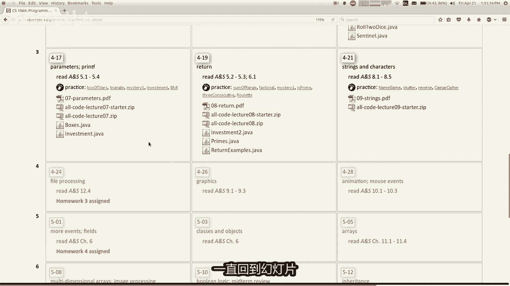

# 课程09：字符串（Strings）📝


在本节课中，我们将要学习一种新的数据类型——字符串。字符串是编程中用于表示和处理文本的基础。我们将学习如何创建、操作字符串，以及如何使用`printf`命令来格式化输出。

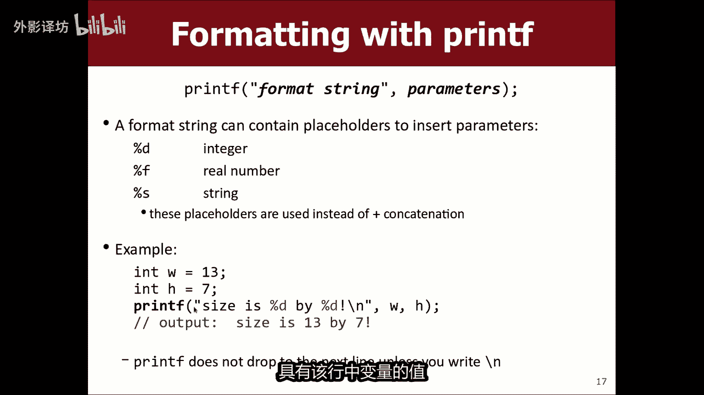

---

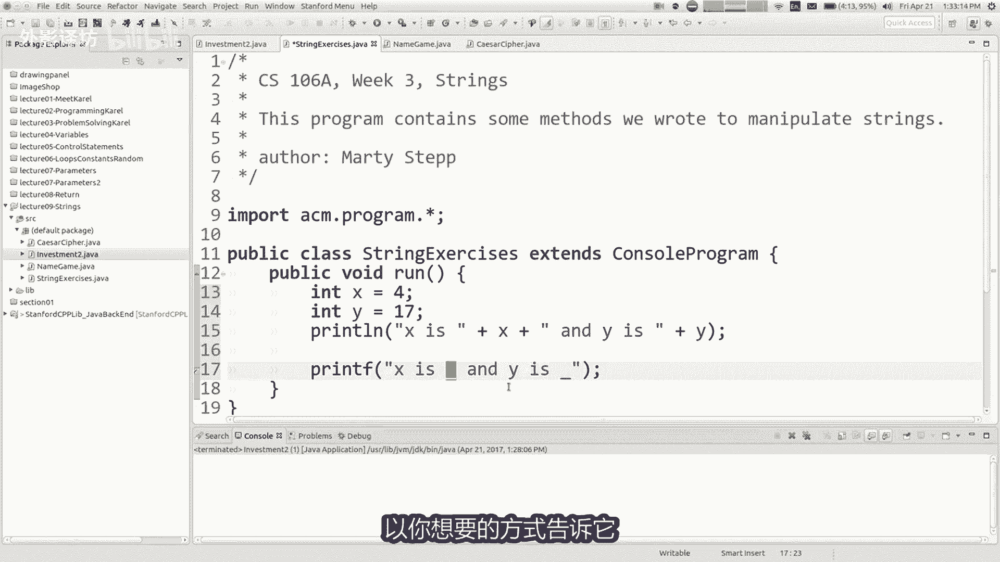


## 格式化输出：`printf`命令

上一节我们介绍了基本的输出方法，本节中我们来看看一个更强大的格式化输出命令：`printf`。


`printf`命令允许你以自定义的格式输出文本和数字，特别是控制小数点后的位数。其基本语法如下：

```java
printf("格式化字符串", 变量1, 变量2, ...);
```

在格式化字符串中，使用占位符来指定插入变量的位置和格式。例如：
*   `%d` 用于整数。
*   `%f` 用于浮点数（小数）。

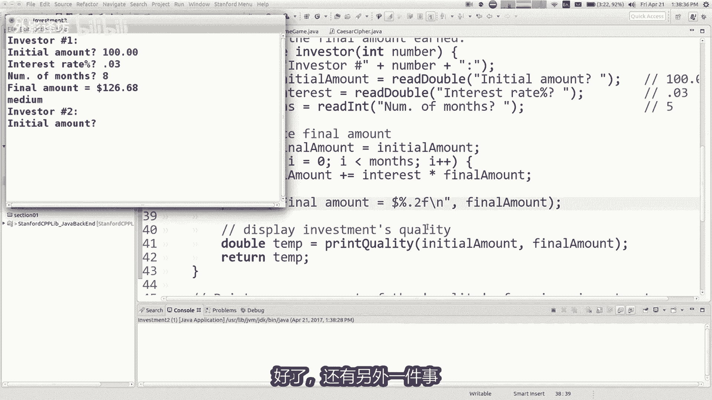

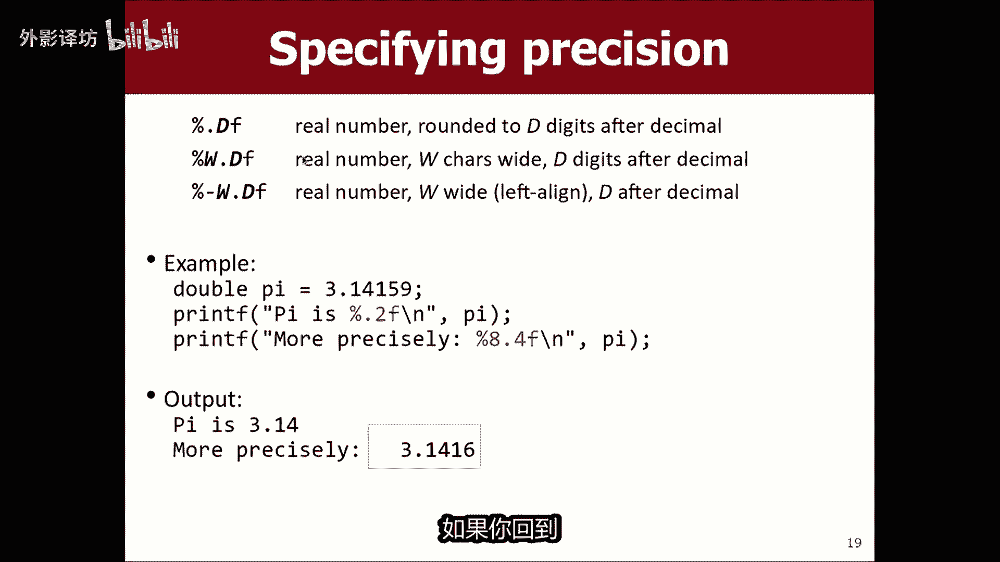

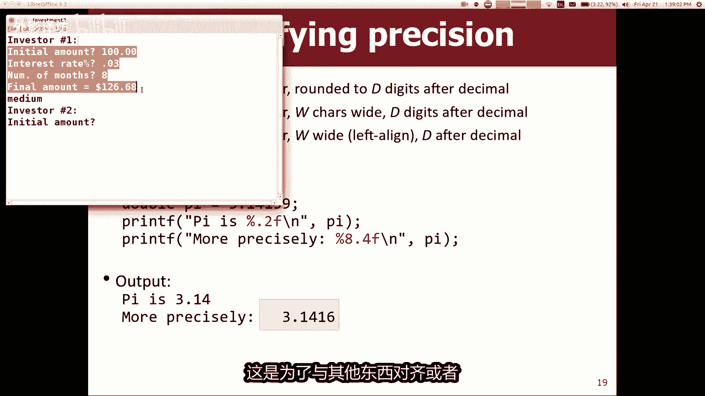

如果你想控制浮点数显示的小数位数，可以在`%f`中间加入`.数字`。例如，`%.2f`表示保留两位小数。

以下是一个使用`printf`格式化数字的例子：

```java
double gpa = 3.14159;
System.out.printf("GPA 是：%.2f", gpa); // 输出：GPA 是：3.14
```

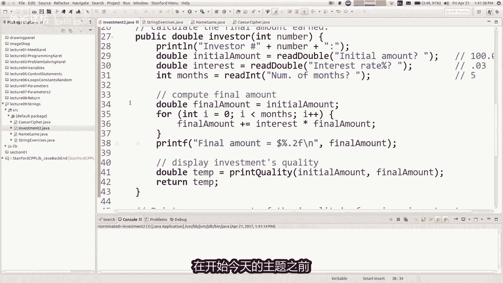


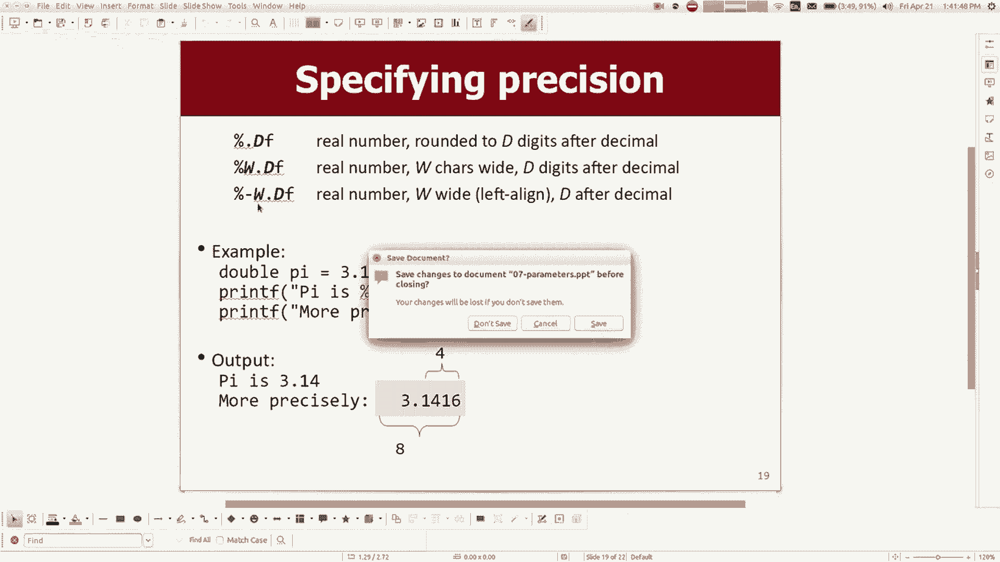

你还可以指定输出内容的总宽度，用于对齐文本。例如，`%10.2f`表示总宽度为10个字符，其中包含两位小数。

---

## 字符串基础

字符串是由零个或多个字符组成的序列，用双引号括起来。在Java中，字符串是一种对象，拥有许多内置的方法供我们调用。


你可以声明一个字符串变量并赋值：


```java
String message = "Hello, World!";
```

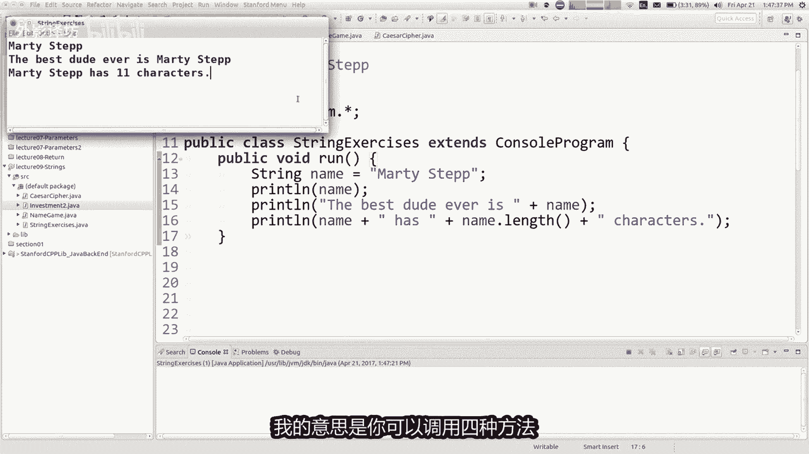

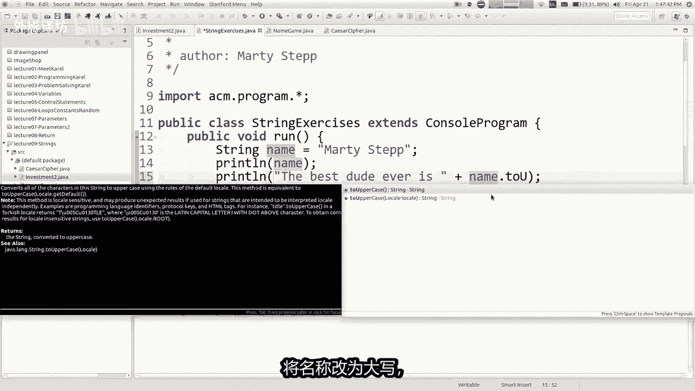

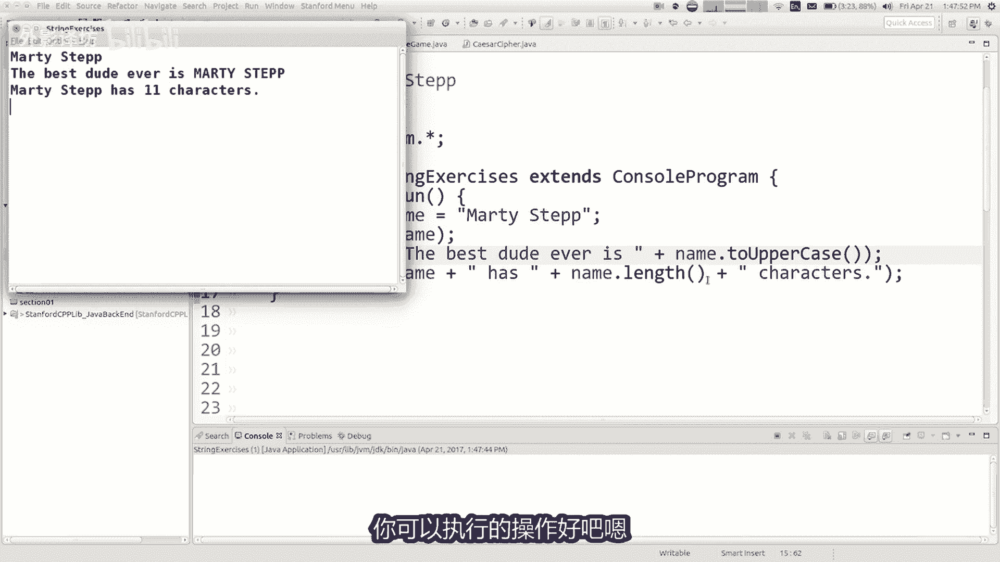

字符串中的每个字符都有一个索引位置，**索引从0开始**。例如，在字符串`"Hello"`中，`'H'`的索引是0，`'o'`的索引是4。


---

## 字符串的常用方法

字符串对象可以通过“点”操作符调用各种方法。以下是几个最常用的方法：


*   **`.length()`**：返回字符串的字符个数。
*   **`.toUpperCase()` / `.toLowerCase()`**：将字符串转换为全大写或全小写。
*   **`.substring(start, end)`**：提取从索引`start`开始，到索引`end`（不包括`end`）之间的子字符串。
*   **`.indexOf(str)`**：返回指定子字符串`str`首次出现的索引位置。
*   **`.equals(str)`**：比较两个字符串的内容是否完全相同。**注意**：在Java中比较字符串内容是否相等必须使用`.equals()`，而不是`==`。

需要特别注意：像`.toUpperCase()`这样的方法**不会修改**原始字符串，而是**返回一个新的字符串**。如果你想改变原变量，需要将结果赋值给它：

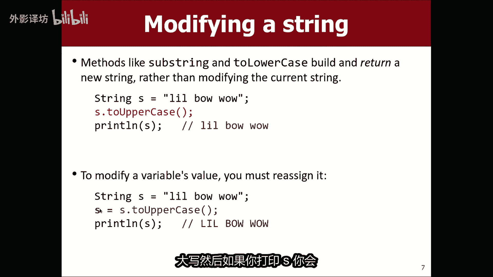

```java
String name = "martin";
name = name.toUpperCase(); // 现在 name 的值是 "MARTIN"
```


---


## 读取用户输入的字符串

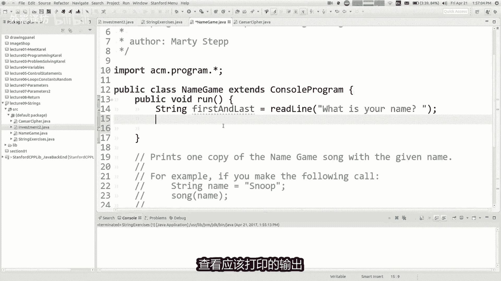

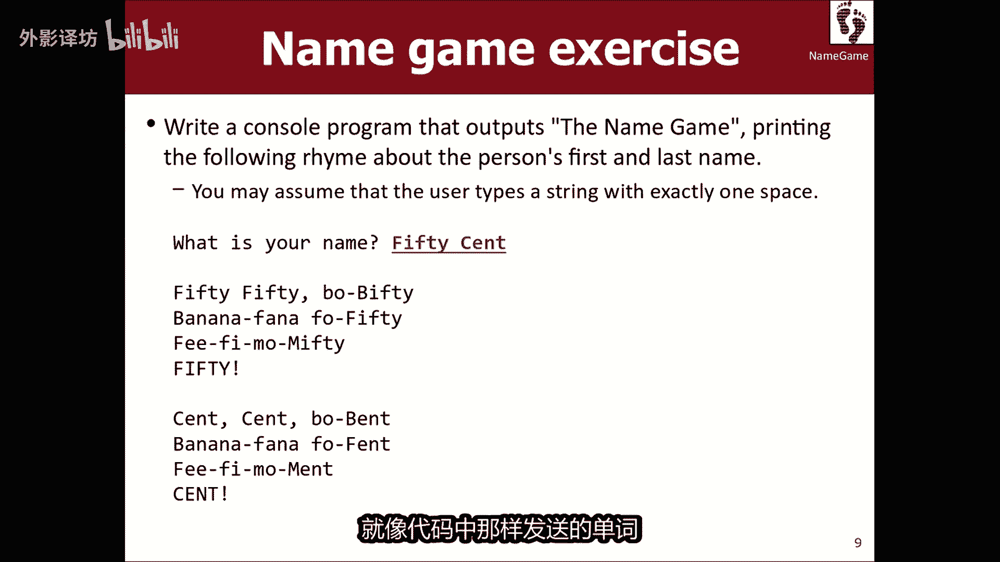

我们可以使用`readLine`方法从控制台读取用户输入的一整行文本，并将其存储为字符串。

```java
String userName = readLine("请输入你的名字：");
```

---

## 字符串累积算法

我们可以像累积数字一样，通过循环来构建或修改一个字符串。通常从一个空字符串`""`开始，然后使用`+=`运算符在循环中不断连接新的内容。


例如，以下方法将一个字符串中的每个字符重复一次：

```java
String stutter(String s) {
    String result = ""; // 初始化一个空字符串用于累积结果
    for (int i = 0; i < s.length(); i++) {
        String letter = s.substring(i, i + 1); // 获取当前索引的字符
        result += letter + letter; // 将该字符连接两次到结果中
    }
    return result; // 返回累积完成的新字符串
}
```


---

## 字符（`char`）类型

Java中还有一个与字符串密切相关的原始数据类型：`char`（字符）。它用于表示**单个**字符，使用单引号括起来。


```java
char grade = 'A';
```

字符串和字符的主要区别在于：
1.  字符用单引号，字符串用双引号。
2.  字符是基本类型，字符串是对象类型。
3.  可以对字符使用`==`、`<`、`>`等比较运算符，这对字符串无效。

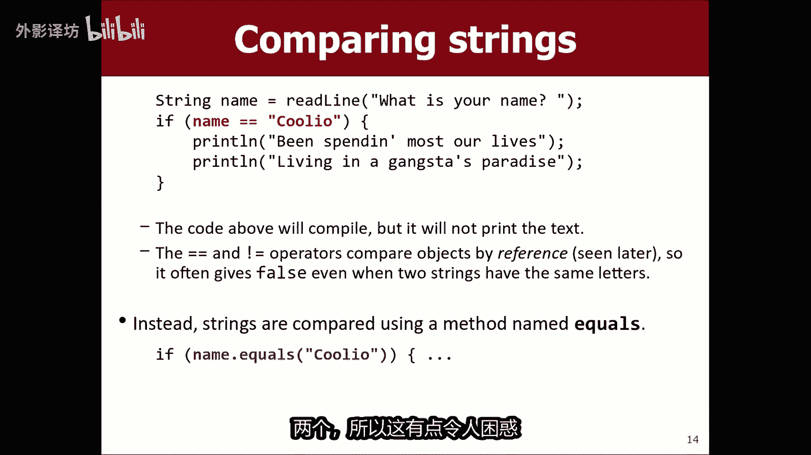

你可以从字符串中获取指定位置的字符：


```java
String str = "Hello";
char firstChar = str.charAt(0); // firstChar 的值为 'H'
```


由于字符在计算机内部对应着数字（ASCII码），你可以对其进行算术运算。一个简单的应用是凯撒密码（位移加密）：

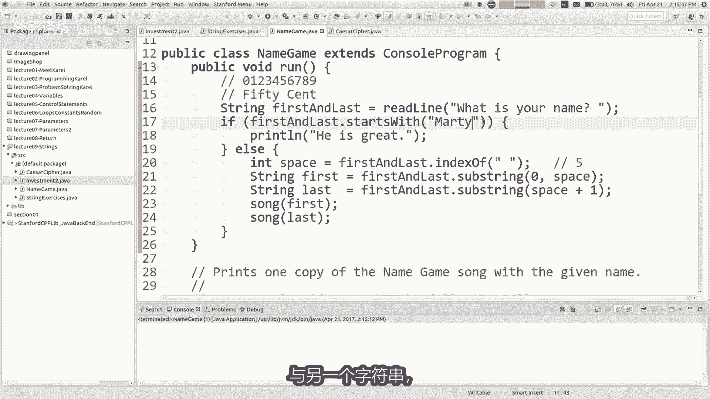

```java
String message = "hello";
String encoded = "";
for (int i = 0; i < message.length(); i++) {
    char ch = message.charAt(i);
    ch++; // 将字符向后移动一位（例如 ‘a’ 变成 ‘b’）
    encoded += ch;
}
System.out.println(encoded); // 输出：ifmmp
```

---

## 总结

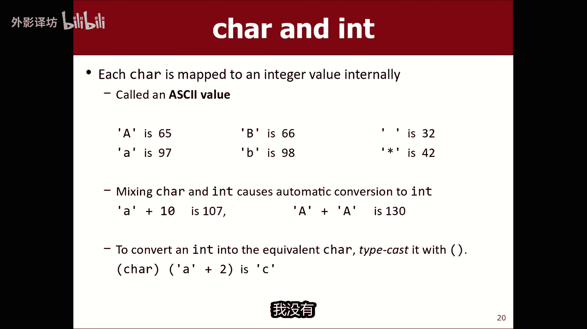

本节课中我们一起学习了：
1.  使用`printf`命令进行格式化输出，特别是控制浮点数的小数位数。
2.  字符串的基本概念、创建和索引规则。
3.  调用字符串的常用方法，如获取长度、转换大小写、提取子串和比较内容。
4.  从控制台读取字符串输入。
5.  实现字符串累积算法来构建新的字符串。
6.  了解了`char`字符类型及其与字符串的区别，并看到了字符运算的一个简单应用——凯撒密码。


掌握字符串的操作是处理文本数据的关键，在未来的编程任务中会经常用到。