# 课程01：CS106B C++抽象编程入门 🚀


在本节课中，我们将学习CS106B课程的基本信息、课程政策以及C++编程语言的初步介绍。课程将涵盖从课程结构到编写第一个简单C++程序的所有内容。

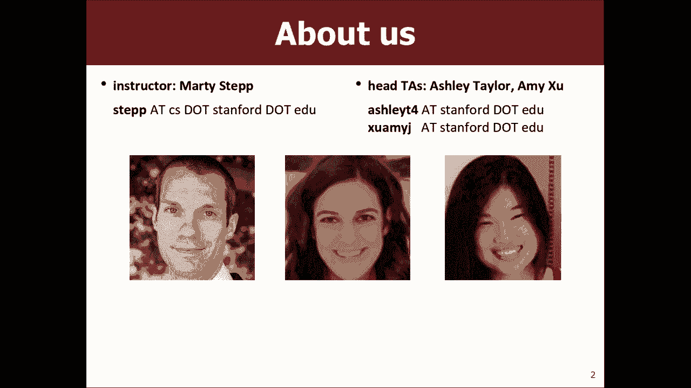


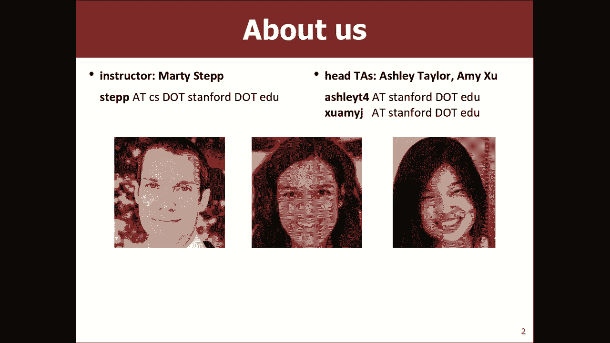

## 课程概述与政策 📋


上一节我们介绍了课程的基本框架，本节中我们来看看具体的课程安排和需要遵守的规则。


课程网站是 CS106B.stanford.edu。所有课程资料，包括讲义、作业和程序，都会在课后发布在该网站上。

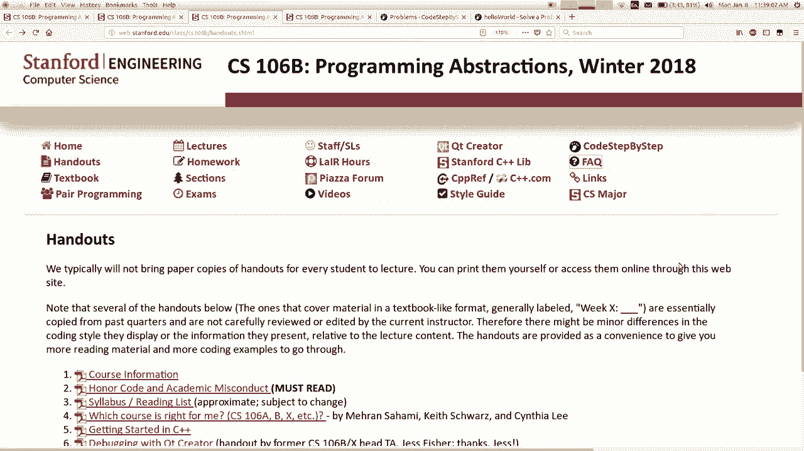

讲师的名字是Martita，联系邮箱是 step@cs.stanford.edu。课程有两位助教：Amy和Ashley，他们将负责主持讨论环节。

课程讨论部分由课程负责人（Section Leaders）组织，他们是上过106课程的本科生。每周他们会组织一次50分钟的讨论课，学生以10-12人为一组进行练习。参与讨论课可以获得分数。

以下是关于课程选择的一些要点：
*   如果你已经上过106A，那么106B可能是适合你的课程。
*   106B假设学生具备变量、数据类型、if语句、循环、方法、参数、返回、数组等基础知识。
*   106B使用C++语言，而106A使用Java。
*   106X是106B的进阶版本，适合已有丰富编程经验的学生。
*   还有一门1学分的实验课程106L，专注于深入讲解C++语言本身。

课程教材是《Programming Abstractions in C++》，由Eric Roberts教授编写。教材的PDF版本可在课程网站免费获取。考试是闭卷考试，但允许携带教材纸质版进入考场。

本季度共有7次作业，每次作业大约有一周或一周半的完成时间。大多数作业允许与一名伙伴合作完成。

作业评分采用“检查制”（Check System）：
*   一个完全正确的程序会获得“Check”。
*   一个良好但仍有改进空间的程序会获得“Check +”。
*   一个需要大量工作的程序会获得“Check -”。

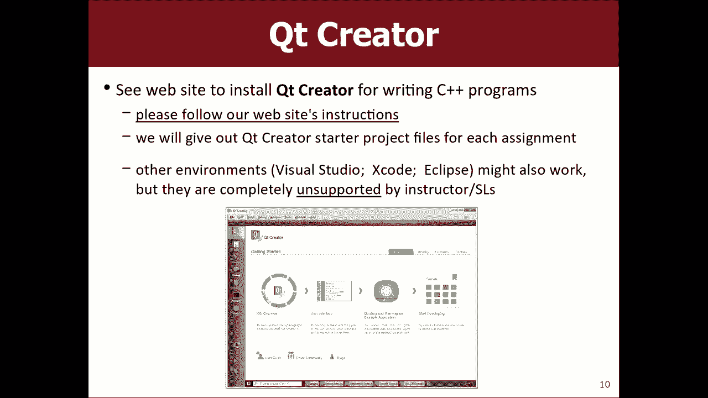

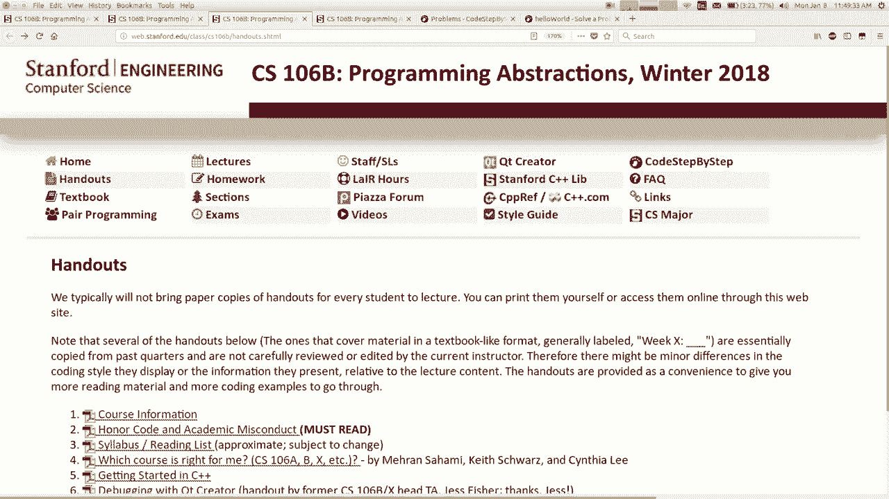

整个季度学生共有4个“迟到单元”可以使用，用于免除作业迟交的处罚。一个“迟到单元”相当于一次课（约两天）的延期。

课程成绩由作业/参与度（占50%）和考试（占50%）共同决定。期末成绩会映射到A、B、C等等级，评分曲线相对宽松。

编程作业将使用名为“Qt Creator”的集成开发环境（IDE）。学生需要按照课程网站上的指引安装此软件。

学生可以通过多种渠道获得帮助：课程负责人会在“The Nest”实验室提供帮助、课程论坛（Piazza）、教师的办公时间以及助教的办公时间。

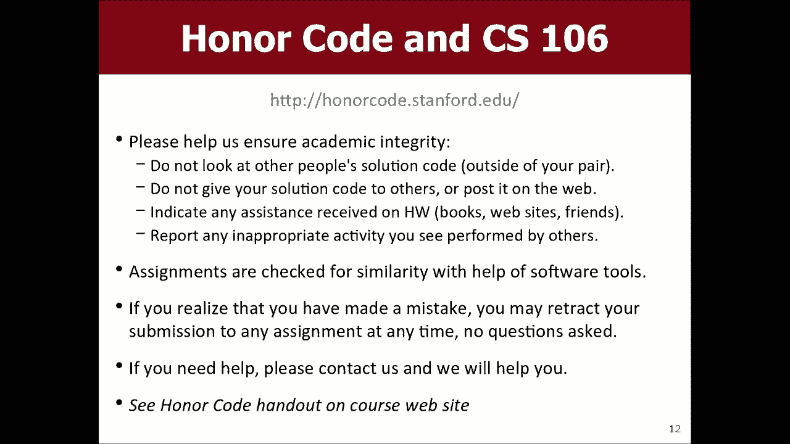


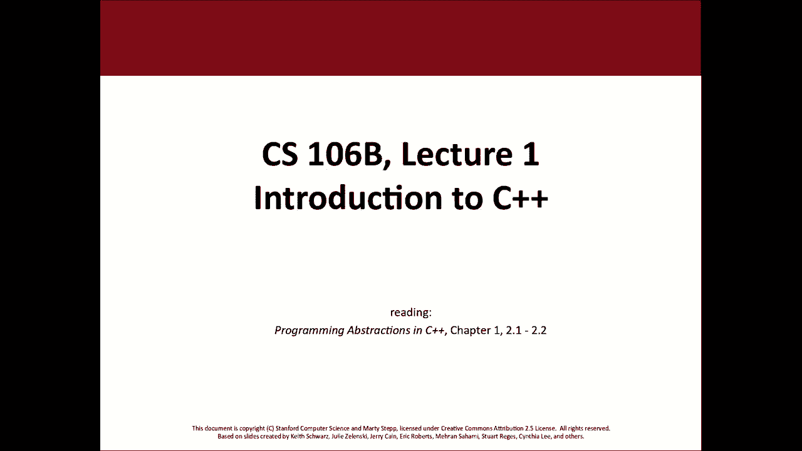

课程严格遵守荣誉准则（Honor Code）。这意味着学生必须独立完成作业，不得抄袭他人代码或从互联网上复制解决方案。课程会使用软件检测代码相似度。如果学生不慎提交了包含非原创代码的作业，可以立即联系课程负责人要求撤回该次提交，但这会导致该次作业得零分。


## C++编程初体验 💻

上一节我们了解了课程的各项规定，本节中我们来看看如何开始编写C++程序。

C++语言诞生于1983年，是一种接近硬件的系统编程语言，广泛应用于操作系统、游戏开发等领域。它与Java在语法上有很多相似之处。

一个基本的C++程序结构如下：
```cpp
// 注释语法与Java/JavaScript相同
#include <iostream>
using namespace std;

int main() {
    cout << "Hello, world!" << endl;
    return 0;
}
```
*   `#include` 语句类似于Java的`import`，用于引入库。尖括号`<>`用于引入系统库，引号`""`用于引入项目本地库。
*   `using namespace std;` 使得我们可以直接使用标准库中的名称（如`cout`），而不必每次都写`std::cout`。
*   `int main()` 是程序的入口函数。
*   `cout` 是用于向控制台输出的对象。`<<` 是输出操作符，用于连接要输出的内容。
*   `endl` 表示换行。
*   `return 0;` 是主函数的返回语句，向操作系统返回一个状态码。

程序文件通常以`.cpp`为扩展名。C++代码需要先编译成机器码（在Windows上生成`.exe`文件，在Mac/Linux上生成无扩展名的可执行文件），然后才能运行。


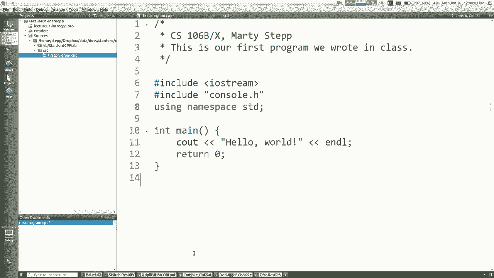

在C++中，变量声明必须指定类型，例如：
```cpp
int age = 29;       // 整数
double price = 19.99; // 浮点数
bool isReady = true; // 布尔值
```

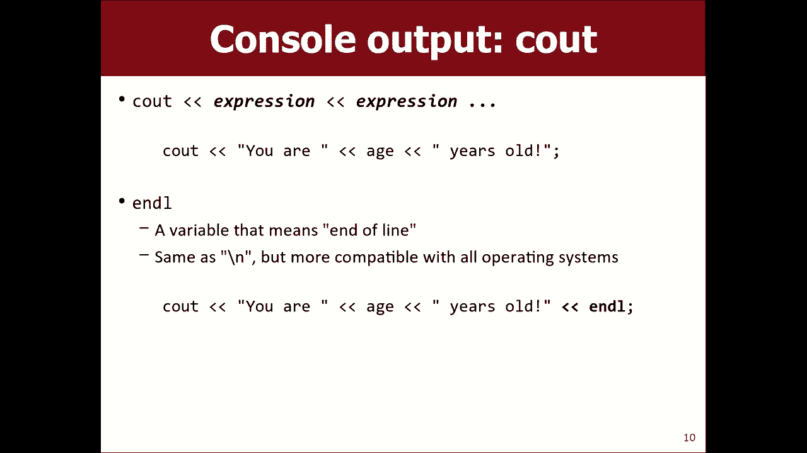

控制流语句（如`if`、`while`、`for`循环）的语法与Java/JavaScript非常相似。


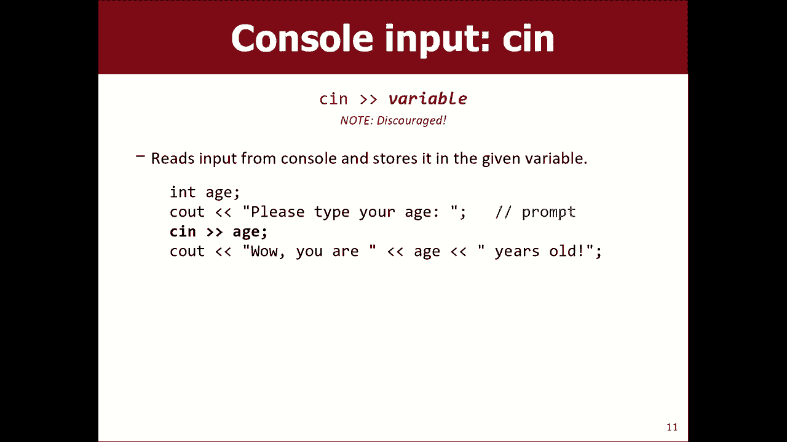

为了简化输入操作并使其更健壮，课程提供了斯坦福C++库。例如，使用`getInteger`函数可以确保用户输入的是一个有效的整数：
```cpp
#include “simpio.h” // 引入斯坦福输入输出库
#include <iostream>
using namespace std;


int main() {
    int age = getInteger(“How old are you? “);
    cout << “Marty wishes he were “ << age << “!” << endl;
    return 0;
}
```
`getInteger`函数会持续提示用户，直到输入合法的整数为止。


函数用于组织代码、避免冗余和提高可读性。在C++中定义函数的方式如下：
```cpp
void printSong() {
    cout << “Now this is the story all about how” << endl;
    cout << “My life got flipped turned upside down” << endl;
}
```
然后可以在`main`函数中调用它：`printSong();`。需要注意的是，在C++中，函数需要在使用前声明或定义。


关于Qt Creator编辑器，它提供了一些便捷功能，例如：
*   按 `Ctrl+R` 可以编译并运行程序。
*   右键点击函数名，选择“Follow Symbol Under Cursor”可以跳转到该函数的定义处查看源代码。

## 总结 📝

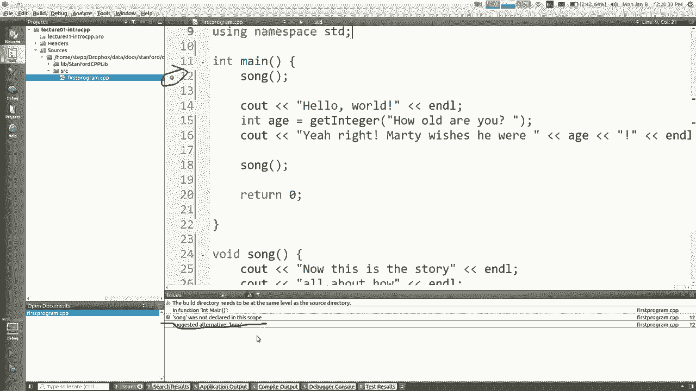

本节课中我们一起学习了CS106B课程的基本信息和政策，包括课程网站、评分标准、作业规范和荣誉准则。同时，我们也初步接触了C++编程，学习了程序的基本结构、输入输出方法以及如何使用斯坦福库来简化编程。请务必在下次课前安装好Qt Creator，为接下来的编程实践做好准备。