# 【斯坦福大学】CS106B C++中的抽象编程 · 2018年冬（完结·中英字幕·机翻） - P10：【Lecture 10】CS106B Programming Abstractions in C++ Win 2018 - 鬼谷良师 - BV1G7411k7jG

好吧，我只是在上课之前注意到很棒，实际上除了，今天我们要谈论的不是对不起，我会在一分钟内修正选举日历，只是今天我们不打算讨论类和对象，谈论递归回溯，但我想简单介绍几件事，在我们开始之前。

有一件事我想提醒大家我不知道，喜欢经常提起这个，因为我不想让你认识吓人的人或，随便什么，但我确实想提醒大家，我们确实像，相似性检查程序，以尝试在我们的系统中查找违反荣誉代码的行为，家庭作业。

我认为有99％的人没有参加工作的风险，麻烦，但我只是想提醒大家，那是，我们所做的事情，并且您知道是否有人从事的工作不是，他们自己的工作很容易让我们注意到，然后这常常导致，最终会给犯错的人带来糟糕的结果。

现在我不想吓到没有做错任何事情的人，好吧，你知道和朋友聊天可以和其他人分享一些想法，我不希望无辜的人成为，害怕你知道他们担心这对他们是一个问题，我说的像是在搜索答案，或者将其复制并粘贴到您的。

文件我说的是你的朋友去年上课了，他们给你发电子邮件，他们的解决方案，任何Turnitin我都在谈论像你这样的东西，知道，你知道，我只是想提醒你，那是不对的， ，如果您坚持执行任务，我们想为您提供帮助。

而我也不想让您感到，你需要做这样的事情，只是想像一下我不知道，如果这有助于显示或不显示，但我想像我一样向您显示，拥有我们运行的软件看起来并不完全是这样，但是，这就是它向我展示程序错误的样子。

通过代码向我展示了它们的相似程度，这实际上不是，该课程的屏幕截图就像是它突出显示了，类似，我可以仔细检查一下，看看是否有错，它或任何不适合它的东西或任何东西，智能软件。

我的意思是即使您有点四处移动和更改，一些事物的名称，并更改一些仍然引起注意的评论，它仍然为我和其他东西突显了它们，不仅如此，程序不好，或者您的程序看起来像她的程序，而您，会惹上麻烦不是这里的主意。

主意是如果他们真的，相似，然后打开它们，然后以可疑的方式相似，他们是相同的，或者您将重点放在确切的注释上，或者您有确切的注释，相同的奇怪代码，然后在一大堆不同的地方，似乎不太可能是巧合，然后开始。

无论如何，都非常重要，这很重要，您知道可以找到的外观，作业解决方案，如果您打开Goog​​le，就很容易知道，您只需输入您知道CS 106 B的字梯子，我的意思是，一大堆发布答案的人都非常容易，所以。

在那里，我无法让这些人把所有这些都记下来，我不能是对的，他们也不想这样做，而网站github也不是，愿意根据我的请求删除文件，因为我没有任何合法权利，强迫任何人这样做，所以它就在那里。

但是像我和我的人民一样，我们去了，也在所有这些站点中进行搜索，因此我们知道所有这些，您也知道，我们知道如何使用by我们知道如何使用Torrent我们知道如何使用很多，不同的网站。

所以我并不是说我们非常适合在线查找答案，但是我是说如果您知道这样做，我可能已经看过您， google for，如果您复制该程序，我将看到该程序，再一次，我想我是在跟一大堆无辜的人说话，就像一个或多个。

两个人，就像哎呀，您可能知道这可能与，我们在这里谈论的数字，但我确实想确保，提醒您，这对我很重要，对我们班级也很重要，我想带走的正面信息就像是一项作业，或类似的东西，那么我想我会鼓励你，寻求帮助。

我很乐意为您服务， TAC部门的领导层我们很乐意为您提供许多帮助，我希望您或您认识的人以不同的方式，可能会完成并做错某些事情，例如复制某人的作品， ，我们在课程中选择的选项称为作业撤消。

与您的部门负责人联系，您可以说我想收回我的解决方案，分配两个或任何东西，这意味着我们把它扔在那里，而你，没有得到任何积分，得到零，但是没有人运行，通过这个，如果你做了什么，你后悔自己不是。

曾经或现在说我不想让所有人退缩50％ ，您在本堂课后的作业是因为机会只是一个或，两个人做错了什么，您知道它需要，只有在您真正，真正实现了像哎呀，我复制并粘贴了别人的作品， 。

 that窃我不想被Snooper停职的人，他们是，只要没有处理数据，我可能会怎么做，并指控您有任何事情，您仍然可以撤消提交，问题还可以，所以就像我说的那样，很多话刚开始四分之一，好吧，但我想再次提出。

因为我认为最好的最好的方法是，如果您不这样做，或者如果，您犯了一个错误，您将其撤消了，然后您知道II不喜欢，处理这些东西对我来说不是一件好事，对我们也不是，我想大多数，像这样的事情发生的时候。

只是一个人犯了一个错误，做出错误的决定是因为他们感到恐慌，压力重重，而且，由于一个小时之内，他们该怎么做，然后自己做出一个错误的决定呢，有人对此又有任何疑问我不是想吓到你，伙计们，但我想提醒您。

这对我很重要，不好，如果您以后再做，请让我知道，我很乐意回答您的问题，知道我们在课程中允许成对的事实与，荣誉代码，但我确实认为，如果您正在与合作伙伴共同努力，可以，您和您的伴侣可以在哪里寻求帮助。

而不必与Google会面， ，一起工作以免被卡住，如果这是您可以做的另一件事，你在挣扎中，你被困在任务上，好吧，我要继续前进，你们知道我要发送的消息是什么，我要去。

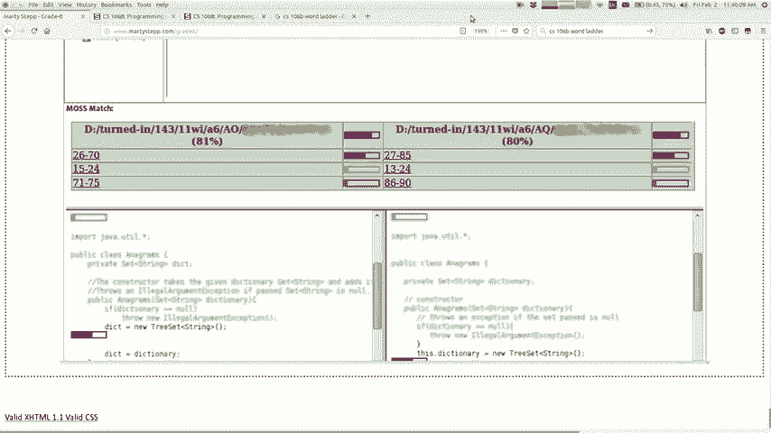

回到一些讲座内容，我们将学习更多关于递归的知识，回溯mm-hm告诉我通常已经看起来像什么，您通常会在递归回溯算法中看到有人提出的内容，你的手是的，您会看到确定可以使用的选项的确可以使用。

选择资源管理器选择词汇你说的基本上是相同的，我认为，我听说有些人也想窃窃私语，是的，通常，想法，所以我今天要看更多的问题，我们要看看，我们可以先递归地回溯解决它们， ，我想谈一谈新的问题。

这涉及很多方面，递归，我认为我过去已经展示过一些，但我没有，认为我已经非常强调它了，所以我想现在谈论它，想谈谈一个称为“臂长递归”的术语，不好的编程风格，人们在编写递归代码。

这给他们增加了不必要的复杂性，他们进行不必要的测试的代码通常意味着如果，不需要的语句，通常是添加的测试，不必要的测试避免了进行递归调用，您知道递归的另一个层次，但如果学生愿意，用略有不同的方式重写代码。

他们不需要，之所以称其为“臂长递归”，有点像您，保持下一个通话的距离，就像我不想拨打，除非我测试是否下一个递归调用，否则我将进行下一个递归调用，通常还有另一种结构化代码的方式，例如图表或房屋。

这是什么的一般概念，但我认为它不会真正使，直到我给你展示一个具体的例子好了，我们做了迷宫逃避，函数在星期三，我们为此编写的代码看起来像什么，有点像我们说的很好，如果你不能，那么你就逃脱了。

如果您所在的广场是一堵墙或已经被访问过，则无法打开，或一些瀑布，我无法从这里离开，选择资源管理器取消选择我要标记的内容，然后尝试转义，然后未标记，还是十几岁以后就可以了，这就是你所说的所有不同。

我将要选择的选项探索运行选择这些选项中的每一个，相比之下，这是编写此代码的好方法，让我向您展示，手臂的长度与手臂的长度方式将只是试图去所有四个，那些蓝色的妓女陈述正确的方向，如果我，如果我不应该走。

如果那边有一堵墙，那该不该走，那就是你知道已经去过，如果这些指示导致我可能不应该进行那些递归调用，不好的事情是很多学生通过的心态，所以他们在代码中要做的是，如果，写作看起来不错。

然后我将尝试探索似乎超级出色的作品，理性的超级理解对于学生想要编写代码，正确的方法，但是所有这些的真正范围只是去做，谁在乎写作，就用墙不在乎我右边是一个，弹跳之类的东西，让我们在那儿进行递归调用。

如果我右边的那个地方回来了，这位厨师会怎么做？ ，做饭，什么，就像我的生意是这个错误的代码，因为我正在进行递归调用，可能会去不好的地方，您认为它将错过您的递归调用，我们将看到的蝙蝠的设计将立即被允许。

回来就回来，跌倒就回来了，这只是非常快速的检查， ，回来没有什么可以做真正的快速检查，然后回来是的，如果您在飞跃之前先看一下，结果会显得更加优雅，递归调用代码，代码看起来像这样，好吧。

我会标记我为您理解的，所以我的意思是运行这个，我什至不认为，确实有效，但是像这样是代码开始看起来的一种方式，不要这样做，您是否知道为什么不好，我是说我重复了一堆，测试容易。

而林登·约翰逊（Lyndon Johnson） ，其中您不需要这样做，只需检查您当前的正方形是否在，平衡我在这里的基本情况，您是否看到这段代码是，害怕碰到一个基础案例，我害怕去一个我不得不，停下来转弯。

我担心会遇到那种情况，不只是去做就可以了，您的代码会正确，回来，所以如果您听说过这个术语，那么这就是独立交易的想法，知道我在试图澄清那种方式，我认为这个例子，很好地说明了这个概念，因为很明显，您必须。

重复这种风格的很多测试，这就是手臂长度递归的作用，你们对此有任何疑问，就是说有一个，是的，立竿见影与积极主动，好吧，我在这里拍摄就像这段代码的缺点是，知道您应该关心您，您的通话应该关注。

您正在处理我的电话的问题的一部分将要处理我的电话，广场，所以如果我的经历发现我的广场没有打开，我会对此做出回应，另一所大学应该处理他们的广场，所以如果我叫对与对，不好，你应该担心我可能留在罪魁祸首中。

关于这一点，这就是原理，本示例还介绍了很多，通过仅解决某些武器（例如解决方案）而不必解决冗余问题，如此冗长，但即使比这个小一点，这仍然是您应该做的事情的原则。

问题下一个选项处理您应该已经解决的问题的下一部分，帮助您尽早决定他们的工作， ，他们是否应该被称为你知道我的意思知道这似乎，与我之前告诉过你的事情有冲突，当您进行任何回溯时，您都不希望拨打不必要的电话。

甚至，编写了一个程序，该程序的邪恶全局变量计算了，称我们做对了，但是您可能会说这个版本很好，会打很多额外的电话，因为它会打入这些死胡同， ，马上回来那些电话不是那种哭泣。

不用担心我们100打的电话会导致，一本甚至不值得我们去研究的东西，首先探索，所以我现在谈论的是，与将搜索范围限制为合理搜索的概念相矛盾，空间还可以设计关于臂长递归还有其他问题吗，感谢您的等待。

所以我看到他们把它交给其他任何人，与我有点相关的问题，我认为过去有种不同的语言，那么容易掷骰子的数目是多少？ ，可以很容易地看出这是回文之类的东西，而且通常学生会给。

我说一种情况他们会说一个死很容易滚我会说哦你们，不够懒惰，还有更轻松的自行车数量，而不是掷骰子你知道卖零骰子我知道那种模型，就像让递归一直走到一个基本案例，不需要做任何会退出的事情，就像那样。

如果您可以看一下类似的概念和设计策略，就可以了，如果以后有更多疑问，请联系我。 ，问题这个被称为子列表，所以我们，传递了一个字符串向量，如果您要打印，则基本上要设置功率，知道这个术语。

向量的所有可能的不同子集都有，您想要的几乎任何订单，但我想在控制台上每个看到一个，现在，这看起来像某种矢量，处理将问题拉进和拉出问题的矢量类型的过程，因此可能，有助于查看我们所做的最后一个问题。

与我们所做的类似，上次的排列问题，请记住，我们重新排列了所有。

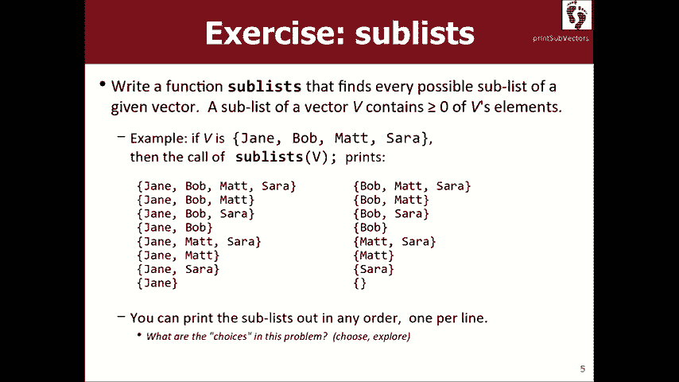

元素的顺序不同，所以也许我应该打开它，我可以打开，上次的讲课代码来自您的位置，看起来像这样。

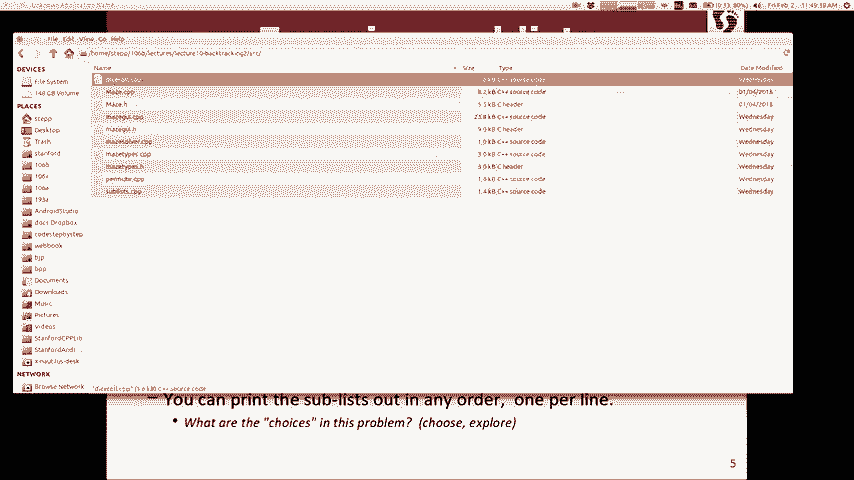

所以这个保留了我们打印的所有东西的一套，这样做，但基本上我们可以记住这一点，我们将处理我们选择的向量，找出一个元素并将其放入选定的集合中，然后我们进行探索，然后将其放入，我们取消选择正确的代码后。

将其返回，这就是排列的代码，现在，我们，必须做子集，所以我们去写我可爱的创作者项目，此功能在此称为子列表子集，可以为我提供建议，当我写一个书的时候，我应该首先考虑什么？ ，回溯算法的基本情况是的。

这绝对是我要做的事情之一，需要考虑一下，我认为这也可能会取代，这些解决方案通常看起来如何我们通常会开始一些要素，根据您所说的内容进行正确的选择，我该如何知道，跟踪那个抱歉，好吧，例如。

在这里让我将其缩小一点，所以有置换，这就是我们的代码，所以我认为您完全正确，跟踪我只是想从你身上抽出更多的东西，就像你在做什么，我必须知道我所选择的意思是什么意思，所以你有你，好吧。

所以将我选择的东西添加到某种向量中，这样我就可以保持，跟踪它们以及如何运行的机制，认为我们可能想要这样构造，因为没有地方放置一些，我们必须编写的现有函数中的其他向量，所以我认为。

可能意味着我们可能想要反映具有辅助功能的想法，是的，这就是我想您可能想要的第一件事，回溯问题是弄清楚我选择的是什么我，猜猜我正在从这个向量中选择要在这个子集中的元素，我得。

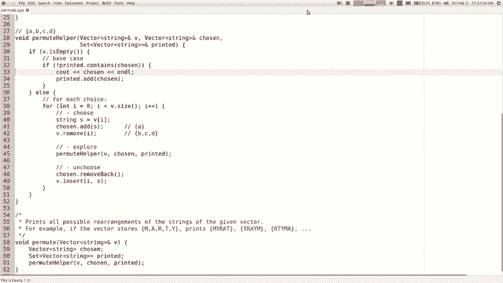

跟踪所有这些，就像您说的那样，好像我可以把，我选择的向量中的东西，让我们做一个叫做void的辅助函数。

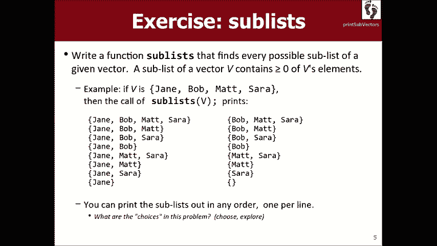

子列表助手，它将使用与原始助手相同的参数，功能，但您说我想保留我选择的另一个向量，似乎是个好主意，所以现在在我们需要编写的实函数中，我将，声明选择的事物的向量，我将称其为子列表。

 Komets显示和转租助手，因为最初我没有选择任何东西，是的，为什么这样加下划线，我们有某种哦，我不知道，这里有一个右括号，很好，所以这是一个好的开始，谁说基本案例我很高兴现在考虑这些案例什么是向量。

这很容易做一个空向量的子列表，所以如果B为空，这是一个基本案例，我们将在一分钟内弄清楚该怎么做，否则现在这通常是递归的情况，我们需要为每个，我们需要选择和探索的可能选择，而选择正确的选择和。

现在就进行探索和发现，有时候回溯问题是，弄清楚可能性是什么，选择是棘手的，每个函数调用要处理的工作单元是什么，工作单元很明显的一些问题，例如从迷宫中逃脱，一个正方形，或者如果是一个应变。

则可能是一个字符，这类事情对于矢量来说似乎很好，它将是其中的一种，向量的元素或类似的东西。

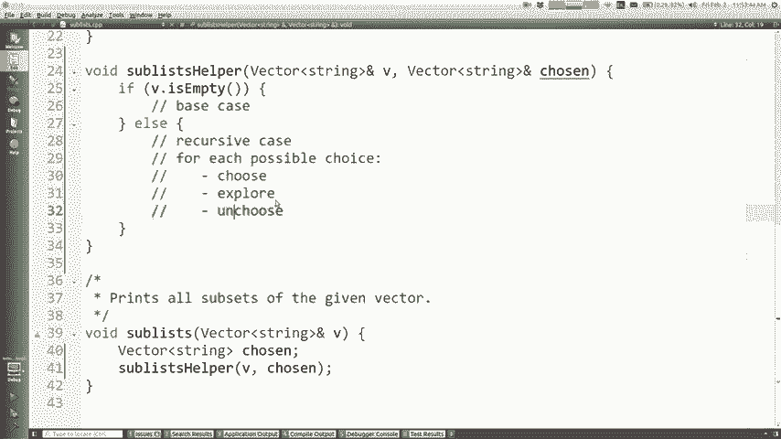

这是您提到的使用for循环的输出，所以我认为。

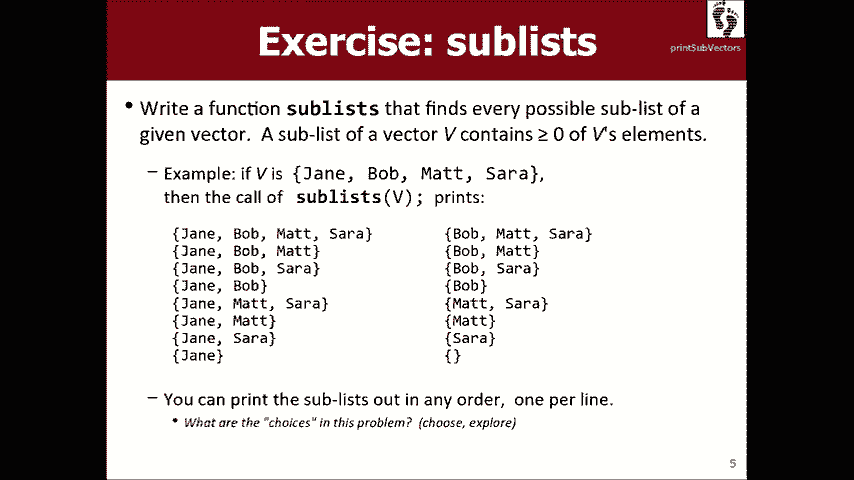

可以做的是，我可以对每个选项说好吧，这意味着每个元素， VI中每个元素的正确V点大小可以编写一些代码，以供选择，探索选择该元素，我有点担心此代码看起来，很像排列代码，几乎就像我在重复，该代码。

我的意思是，如果我重写该代码，我将获得排列而不是子，列出正确，所以有一些区别，我需要更加注意的两个之间让我们再来看一看。

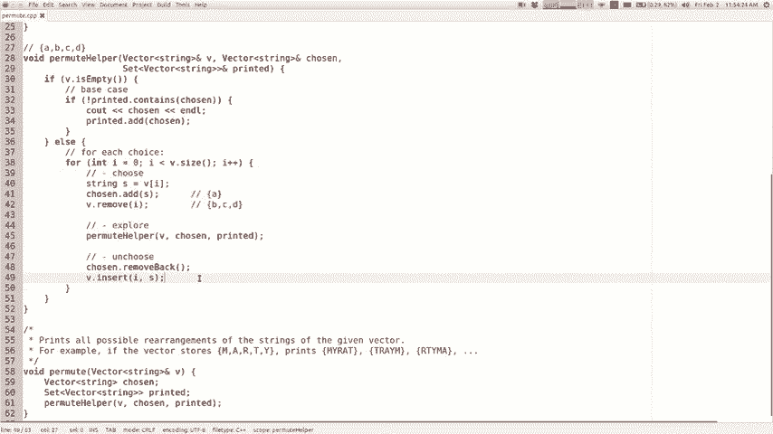

不用了，我的下一个链接是什么？可以遍历元素并抓取每个元素，一个人咀嚼和探索者，选择不了，我想如果我们这样做，那就是我们最终得到看起来像是，像这样，选择它们并探索它们，然后像​​我这样弄虚作假。

需要允许导致收益，鲍勃和鲍勃获得的收益是我想要的元素的顺序，它所有可能的组合都回到了什么是，如果我要处理此列表中的元素，该选择是什么，选择像排列就是选择元素在哪里，他决定探索不同的转租。

让我们来看一个人，是的，继续，需要摆脱的是一种有趣的思考方式，如果您看一下这两个电话，我的意思是说我像小时候一样把输出，有点暗示，这两列之间有什么区别，关于在左边保持冷静有JT，在右边保持冷静没有变化。

对吧，想象我对你说过嘿函数调用你的函数调用，您现在是人机界面调用人员您在珍妮警长中，可能发生改变的事情这样做的事情是什么，可能与我们找到的答案有关，但我们发现您说我们，决定扔给谁。

所以如果您正在处理基因，我认为这意味着，您正在确定是否在输出中Jays您正在确定是否，珍妮（Janie）在子集中还是不在子集中，我们将要探索，这两个东西现在让我们打印所有确实具有基因的东西，包括在内。

让我们带入所有没有包含基因的东西，所以，我想在这里告诉您的是，这个问题的选择不是，关于遍历所有元素的长度，将它们添加到另一个向量，因为这与Porter有更多关系，相反，每个调用都应确定包含。

或排除每个函数调用的责任是是或否，不知道如何打印一堆子列表，但我可以管理，詹姆斯，我会决定她是否在互动，下一个电话说我不知道​​该怎么做，既可以打印子列表，也可以处理Bob的所有内容，以便与Bob互动。

以此类推，直到我们一起选择所有这些东西，这样决定，我认为树不应该看起来像这样，而是应该看起来更像，这可能甚至看不到每秒的差异，但叉子，这棵树不是四种可能性，它是杰米在伊拉克和下一个波兰人。

爸爸文化差异很大，决策树两个分支不是四个，这样做有意义吗，因为那是我们真正选择的，我们正在选择放弃的会员资格，我们可以尝试翻译一下吗，到C ++代码中，这是解决此问题的正确整体算法或想法。

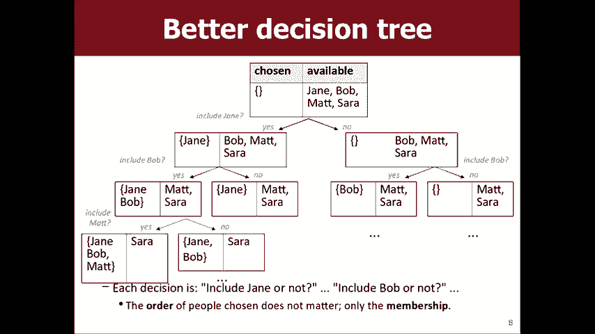

问题，有哪些可能的选择，让我们牢记，我要解决的问题是向量V是否由您组成，您知道Jane是什么，像您这样的人认为我会记住这一点Bob Jane Bob Matt ，萨拉（Sarah），如果我是第一个电话。

我的工作是处理Jane（如果我是第二个，我的工作） ，是要处理鲍勃，所以我通话的每个可能选择都意味着每个可能，我可以用Jane做的事情，或者我可以用Bob做的每件事，所以我，不要在这里给你一些代码。

我该怎么做，实施我们正在谈论的这些想法，我该如何向其他通话指示嘿，我得到了简，我会，照顾好T以便他们不要照顾Jake我该如何锁定，明确地说，这是我的责任，您认为是什么，删除听起来不错的好行。

所以字符串s等于我想我们可以，只是把第一个人拿出来，或者是矢量点，我认为，一个神话般的战场，得到了零，我以为我可以说V零， V为零，现在就把她拉出来，我们会把她放回去，但是，一分钟，让我们将她拉出V点。

删除零，不，我知道，当我说删除我或for循环到我知道我没有时，我们编写的算法，认为实际上我们需要这样做，这将使第一人称视角和，将处理它们，所以现在我们已经讨论过的可能选择是什么。

选择是字符串s应该在输出或字符串中，从输出中排除这是两个选择，所以我们不需要for循环，现在我们真正想要做的是尝试使用s然后尝试不使用s，那么我该怎么办，表示我想将此人保留在子列表中，我们对他们说。

所以您说了加他们回我，认为那意味着将它们放回V，但我想将它们放到其他，选择供应商，因为那是我要放置我的子清单的地方，我正在建立，我明白了你的意思，就像你可以离开一样，他们以他们的原始向量。

但我只是从概念上讲， ，就像让我把所有我留住的人放到这里，那就是如果你可以的话那就是我想做的那怎么办，选择点加s，所以将Jane放在子列表中，现在我必须探索如何做，你探索不要说基本情况不是基本情况。

是的，但是红色检查还没有进行递归调用，是的，子列表，助手，并且都通过了相同的V，并且选择了相同的对象，但是它们正在改变，他们的状态，所以下一次通话将看到与我不同的状态，好吧。

现在还记得我该如何尝试使用s以及如何不使用s进行尝试，尝试没有我们，是的，继续谢谢，哦，我们可以这样做，所以您要说的是先尝试不使用s，然后再尝试，一定要尝试，所以您要做的就是探索。

没有s的递归内容首先只是因为cuz可能会为我们节省一行， Kohinoor-好的，所以我只浏览了一些不会删除人员的列表，从考虑中，我没有将它们放在子列表中，我探索可以，遵循该选择，然后递归调用进行探索。

然后返回，现在我该怎么办，我应该将它们放在子列表中，然后，什么，再次给助手打电话，所以我的意思是也许这个结构看起来像我在做，这个问题的原因是因为代码的结构方式。

看起来与到目前为止我们已经完成的许多其他问题不同，我认为，选择就像我如何将其纳入我的选择探索心理模型，不选择，我想我会说的是选择和探索而无需s和，然后这就像选择并与您一起探索，您知道我的意思是选择。

探索选择，我确定他们正在做Q的Explorer曲调是我拥有的Explorer ，做选择部分我该如何选择，当然，是的，将值s放回向量V中，我们将其拉出，基本上将我们的玩具放回我们发现将玩具放回地毯的地方。

放下cookie，不要紧um插入元素我放回字符串s ，进入向量，我们快完成了，我认为我们有一些非常好的东西，这里有一个重要的部分缺失，是的，对不起，没有定义什么哦，反，我们没有定义嗨，你说的对。

所以这不是我要说的，但是你完全正确，那应该是零，我们从零删除，所以我们应该完全插入零，还有另一个，丢失的东西，因为您知道我们将做所有这些工作，这些递归调用正在构建一些非常重要的东西，基本上是基本情况。

在基本情况下，我们需要打印，我们做出的所有选择都达到最高点，看看最终选择是否可以，这可能有用，哎呀，我发明了太多，某种形式的人类克隆实际上，这看起来像是一个小错误，像是在做有趣的事情，但是嗯。

需要做些什么来解决这个问题，打印出来的向量越来越大，所以这，选择的载体逐渐失去控制，你看到需要做什么吗，好吧，所以选择的东西在这里是空的，但是当我添加人一次，我已经完成了这种可能性的探索。

我不想他们再呆在那里，希望它是空的，或者至少我希望它没有那个人，基本上在这里，当我取消选择时，我需要说选定的dari移回删除，向量中的最后一个元素，所以现在如果我们再次尝试运行它，我们该怎么办。

没有人萨拉正在工作，我认为输出的顺序与幻灯片上的顺序相反，但我没有，关心顺序不是关键概念，我相信这是所有的子集，向量，所以我们还是这样做了，主要要点是，有几个要点，其中一个是您并不总是有循环。

您会发现这就像您的递归回溯代码可能没有循环，它有助于理解为什么矢量代码可能会产生循环，可能没有循环，这与哪些不同的选择有关，我们正在研究迷宫问题，它是否也踩过踏板，因为，描述四个选择。

我们只会打四个电话上去下去左去，对，没有一种简单的方法来描述使用Elute的支持电话，所以我们只是将它们全部写在这里，我们需要打两个电话，使人被排斥在外，没有简单的循环方法，做这两个事情。

所以我们只说将其删除并打电话给他们， in并进行呼叫不需要表达为循环，它在任何地方都是fork ，是的， Y放回V放回去，这是个好问题，嗯，让我们不要看看，发生正确，所以我认为发生的事情是我们将无法。

如果这样做，则将该人包括在树的多个分支中，有分支有莎拉和这些人，或莎拉和那些人，我想我是说我想我的建议是放弃一些，稍后在这里声明，并通过不同的调用进行跟踪，基本上是这样的，这禁止从树的两个分支。

在他们中拥有相同的人将是我对此的评论，所以无论如何，子列表问题，您会发现自己是否拥有它，大多数人已经成为，部分，但我认为在部分讲义中，您会看到类似的内容，这些部分中的问题有循环，而有些则没有。

我认为一个关键，我认为灯泡的瞬间适合正在练习递归的学生，回溯就像我能找出我是否需要循环处理此问题还是，这似乎不是一件小事，但实际上是一件大事，因为它，表示您正在查看代码需要做出的选择以及是否。

没有正在尝试的正确选择集，您将无法获得，首先要尝试探索的答案，所以这很重要，嗯，还有一个问题，是的，继续，哦，我可以清除我可以选择的向量吗？ ，总的来说，我们有点类似于我之前提到的原理。

您的电话负责您的工作，而不是其他人，我认为，如果您，清楚会发生什么，有一些我以前没有选择的东西，想要放弃做出的几个选择，然后得到需要，并且，我要尝试分开自己，然后我要挖掘我所要放的东西。

回到我发现他们全都退出的状态，迈克·霍尔（Mike Hall）刚开始的时候，在我之前，他们不希望我这样做，然后他们的电话就是，上班了Mike用户陷入困境，我会这样做只是为了说明，我会说选择的点清晰。

我很确定我们会，会看到一些看起来不正确的输出，所以我的意思是不是，建立完整的向量，因为先前的呼叫清除了下一个呼叫，正在清除对我之前的通话很重要的内容，这就是发生的事情，好吧，这是个很好的问题，我知道。

这就是我们如何尝试解决这些问题的方式，为什么不这样做，版本工作还是该版本工作这些都是其他大问题，关于这个问题的问题好吧，我想再做一个问题，我得到大约10 。

还剩几分钟，我想我们可以做到，我想和你们一起解决一个问题， 8 Queens问题，这意味着您有一个棋盘，你们大概知道，如果在棋盘上放一个女王，它可以向左或向右以及四个对角线向上或向下移动8个方向，方向。

所以这个问题的目标是我可以把每个，船上的不同部分，以至于他们之间都看不到彼此，进攻意味着他们不能完全对角地保持精确的侧向或，现在彼此上下，答案不是一个谜，就像我可以编写一个程序一样。

如果我不知道答案就找到它，如果我能找到答案也可能很有趣，一般的回答是，如果是九乘九棋盘或五乘九棋盘，五个国际象棋棋盘是否有解决N到n的最终皇后问题的方法，棋盘好吧，我想通过递归回溯与你们一起做。

好选择在鞋子上探索你认为选择是什么，你会互相攻击，如果那没用，她就是，在哪里放置一个Queen，以便您可以想象此代码的版本哦，好，不管你看过什么政府动画，你都可以想象这段代码的版本，就像每个正方形一样。

选择在其中放置一个女王，然后探索，然后如果它不起作用，请选择并尝试其他人，但是，看起来这不是最有效的方法，因为有一堆，之前我们谈论的是减少搜索空间的空间，不必要的梦想和呼吁这不是做到这一点的方法。

我们需要一点点，如果比在合理的时间内运行的算法要有效的话，因此，如果您有一些简单的观察，我们可以做，在这里查看解决方案关于此解决方案有哪些正确的事情，对于可能是正确的任何解决方案，这可能都是正确的。

你怎么说每一行都干净，您可能会称其为“鸽洞原则”，例如每个必须有一个，他们彼此之间是安全的，所以每一行都有一个女王，每个专栏中都有一位女王，我们可以利用这一优势，而不是，搜索每个正方形，我们可以说很好。

我知道一个，第一栏中有一个皇后，第二栏中有一个皇后，在第三列中，让我们探讨将这些元素放在其中的位置，较小的搜索空间，而是让我们做更多这样的事情， ，可以使算法以合理的数量运行的优化，时间。

问题就变得没事了，我会做为专栏，这只是轻微的平局，但完全可以向侧面移动，我们可以，下移我要说每一列都有一个皇后每次调用每个函数调用，决定把那个女王放在哪里，所以我想和你们一起写这个。

没有很多时间，我想我们可以完成它，我有一堂课叫做董事会，就像棋盘一样，我将为您传递棋盘参数，您可以，问问如果我放置一个女王，你需要在哪里坐，女王的所有，能够互相攻击，也可以在广场上放置一个女王。

您可以从正方形上移除女王，然后可以将木板打印出来以查看，或通过调用string来完成，这将有助于我们解决一些棘手的问题，皇后区的细节对角地互相攻击和东西，所以我想写。

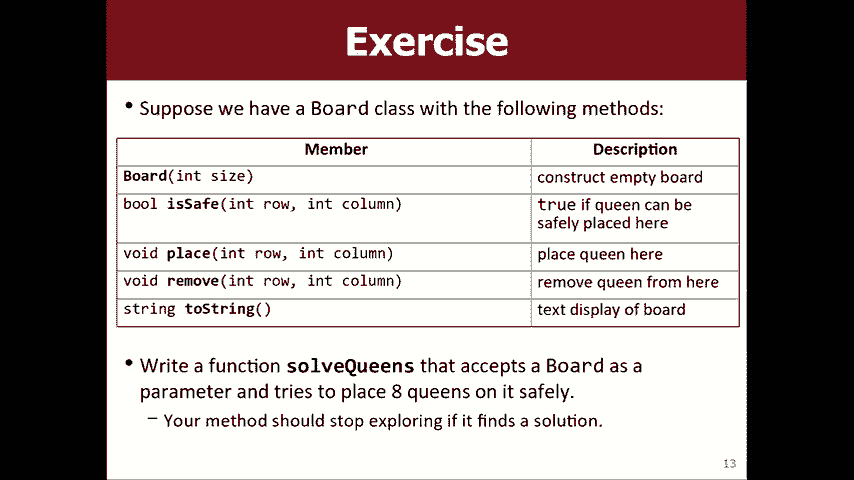

与你们一起使用的功能称为解决皇后区并正确打开它，现在在这里求解皇后区，并且将此棋盘作为国际象棋棋盘作为参数，所以帮我每个电话应该决定放女王的位置。

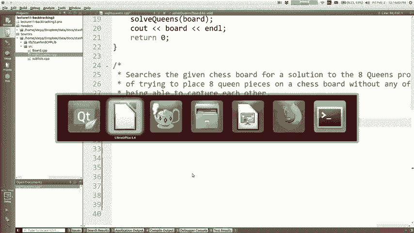

在给定的列中，在第三列中调用的第一个函数是。

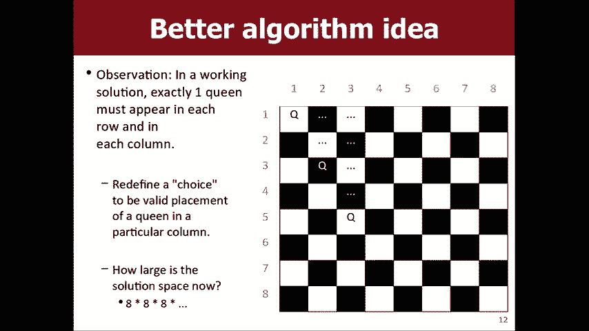

称这些为第二栏，以此类推。 ，我如何告诉这些函数调用每个函数的职责，人们需要知道它的价值应该是正确的，有什么想法我该如何开始解决这个问题，您认为董事会准备好了什么，我猜这里已经有董事会了，说五。

但我的意思是我们可能希望将其设置为八乘四十，是的，准备出发了，所以他们正在通过我们一个空的棋盘，准备与之一起玩，每个被调用的函数如何知道其职责是什么，第一列是，应该是第一个功能厅，第二列应该是。

第二个函数调用调用如何知道它们对什么负责，你说的还好吗，所以你说我们目前的电话不知道他们是什么，应该这样做是因为我们没有足够的信息，所以我们说您说的是辅助函数，我认为这很棒，写空解决皇后区的帮手。

通常帮手拿相同的，参数作为原始功能，以及，函数调用需要您提供什么额外的信息，这个函数调用应该处理哪一列，所以当您第一次使用时，开始，您打电话解决，但是您必须，一切顺利。

因此您将第一个函数调用列传递给了董事会，老实说，现在负责第一个我不记得是零基础吗，或一个基地，我必须去偷看一秒钟，因为我以为我有，这个内存可能是基于一个的，不，它是零，零，好吧，没关系，对不起，我。

我只是想确保当我们希望它为1时没有零。 ，我认为幻灯片说一到八，我应该解决这个问题，但无论如何，嗯，所以第一个函数调用现在负责零列，记住我们为每种选择选择的算法正确探索拳法。

我可以对给定的函数调用进行哪些​​选择，我在沙迦的专栏有哪些选择，与选项，在问候中我继续。

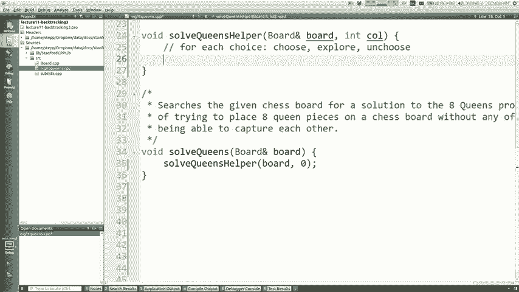

好吧，这很少涉及像对角线这样的女王的进攻方向，红色箭头更像是我可以把女王放在哪里，那会使她，能够攻击，我认为这个想法是，如果我正在处理此专栏，我可以，在八行中的任何一行中添加女王，然后在下一列中。

八列中的任一列中的女王，在下一个女王中，我可以将其放在88列中，这些行中的一些是坏的，将无法正常工作，但那是八行，可以理解的选项，因此每个选项的选择。

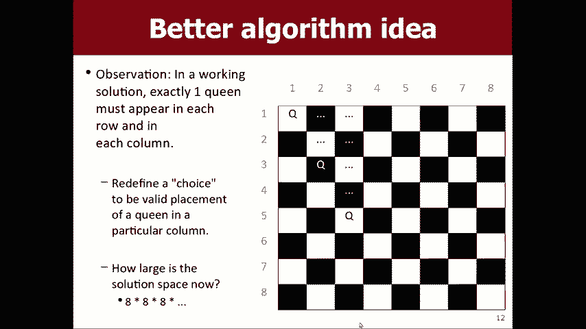

超过的是从零到板子尺寸的每一行的八列，会比八行少八列，再加上那些是选择，很好地探索鞋子我该如何选择，将皇后放在右边或点将皇后放在这一行和此列，探索如何探索我正确进行了递归调用，所以我说解决。

皇后区帮助委员会该怎么办？ ，我后面的那列，如果我是第三列，那是第四列，等等，当，回来的时候选择你告诉董事会我不希望女王在那里，不再板点删除行列，我们不是，确实完成了，有些重要的东西丢失了，有些东西。

我的递归算法中缺少什么是基础情况，什么时候停止停止执行所有这些递归E东西是一个好的基本案例，当所有皇后定价后，一旦我越过最后一列，该怎么办，向下是的，所以如果我到达的列超过了板子的大小，那么。

这是什么意思，我在这里应该做什么？ ，在板上正确，所以我可能应该向董事会展示，我应该查看电路板的空闲状态，但是我不想打印那些，皇后可以互相殴打和正确摆放是无效的，那我该怎么办。

避免在棋盘上注明女王可以互相殴打的状态。

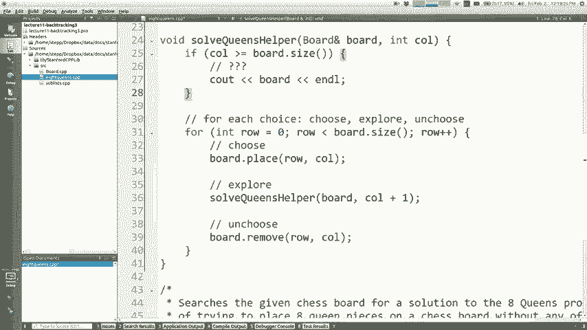

董事会课程是安全的，将女王放置在某个地方是否安全，我该如何做？ 。

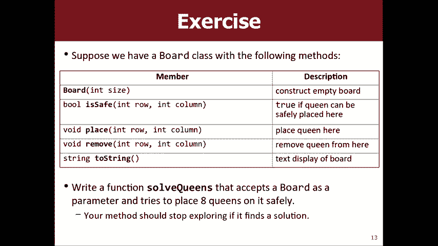

将其合并到此杯子中，以确保我不会探索虚假结果，是的，继续，因此，在我们打电话之前，请确保在该行放女王/王后是否安全，冷静，鲍勃（Bob）和马特（Matt）和萨拉（Sara Wow）给我20秒。

我知道是时候了，一秒钟去，哦，我做了什么，我认为应该是这样，哦，对不起，你知道我做了什么，对不起，我把整个东西包裹错了，如果可以安全地放置一个女王，然后将其放置然后无法放置，则可以放心。

让我们再次尝试一堆答案，最后，我将向您展示所有解决问题的方法，我们去周末的一天是，如果您想查看代码动画，在这里，我有一个名为set delay的函数，每次您放置一个女王时，它会暂停一秒钟。

您可以观看算法，因此请看一下，看看它在做什么，这有点困难，因为我们的库很友好，便便，但它正在尝试所有可能的选择以及您会注意到的内容，当您离开时，离左侧更远的地方会放更长的时间，因为我们探索。

所有可能发生的事情，这就是为什么代码最终看起来像，我现在必须停在那里的方式，周末愉快，谢谢您的作业4是您想要看的东西，星期一我再见。

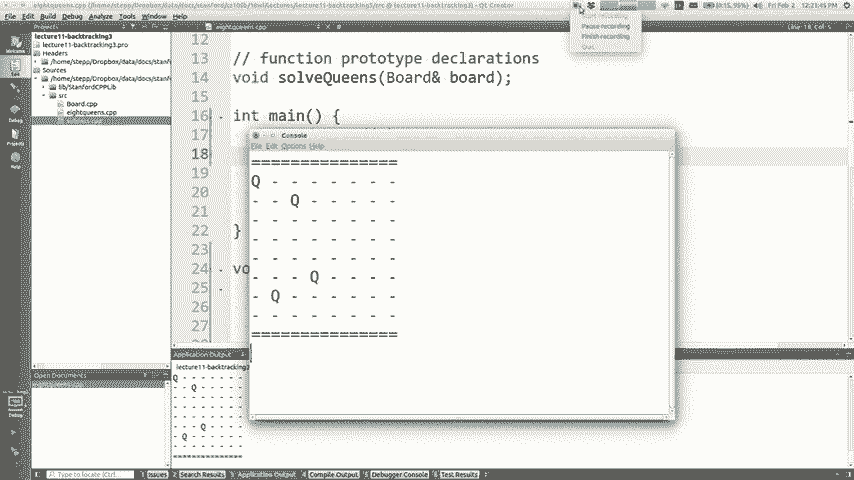