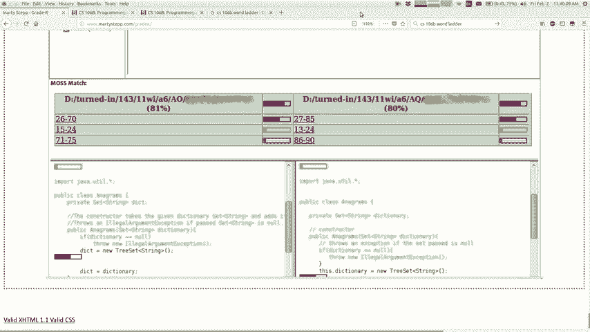
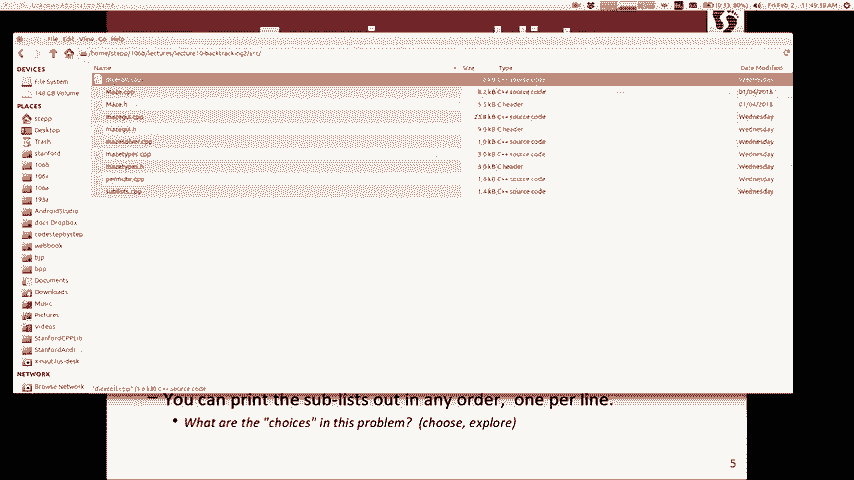
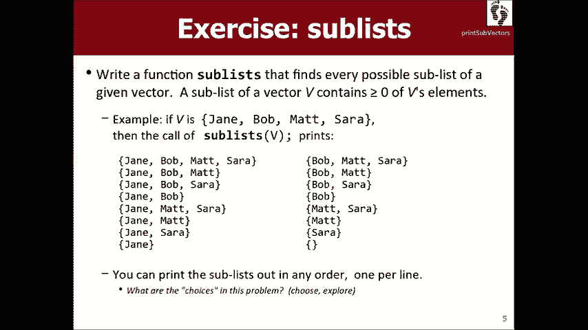
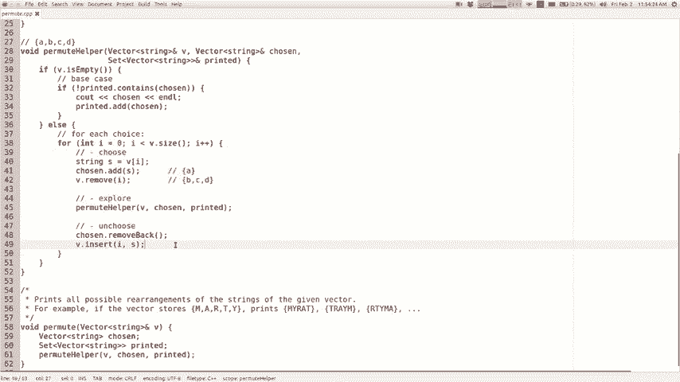
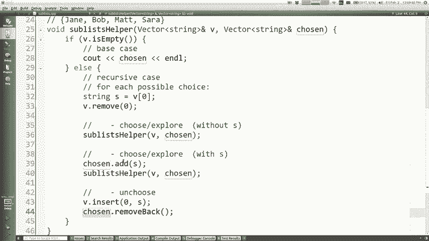
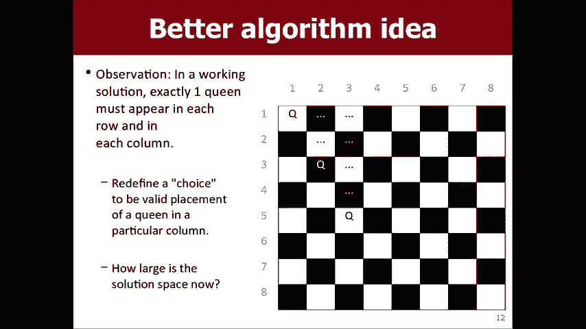
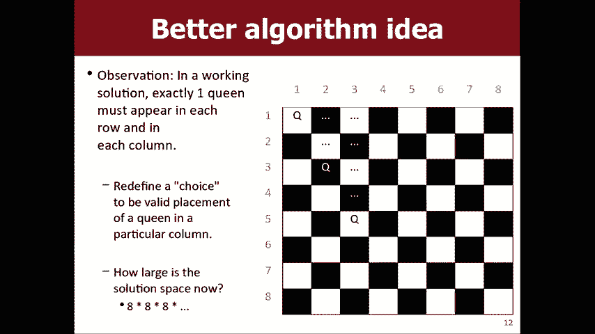
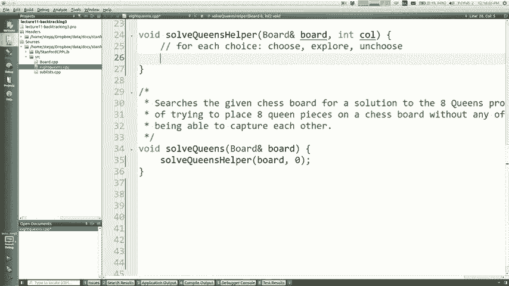
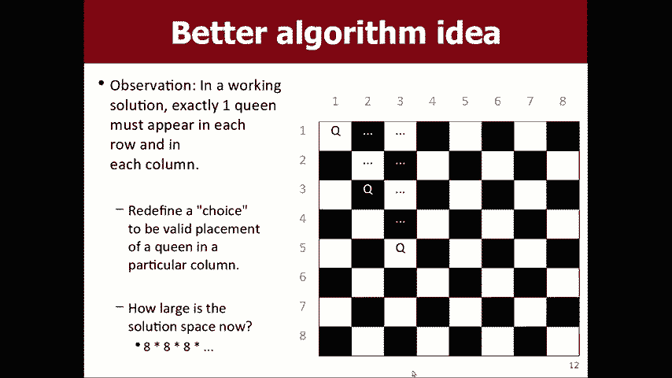
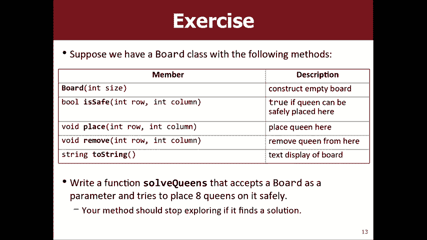

# 课程10：递归回溯与八皇后问题 👑

在本节课中，我们将深入学习递归回溯算法，并通过解决“子集生成”和经典的“八皇后”问题来实践这一概念。我们将重点关注如何构建递归解决方案，并避免一种称为“臂长递归”的不良编程风格。

## 概述 📋

递归回溯是一种强大的算法设计范式，它通过尝试所有可能的选择来寻找问题的解决方案。当一条路径失败时，算法会“回溯”到上一个决策点，尝试其他选项。本节课我们将通过具体例子来掌握其核心思想。

## 关于学术诚信的提醒 ⚠️

在开始课程内容之前，需要提醒关于学术诚信的重要性。课程使用相似性检查系统来查找违反荣誉准则的行为。绝大多数同学没有风险，但需要明确：分享、复制或粘贴他人的作业解决方案（包括来自网络或往届学生）是不被允许的。如果你在作业中遇到困难，我们鼓励你向助教或讲师寻求帮助。如果你已经提交了非独立完成的作业，可以选择“作业撤销”选项，这将导致该作业得零分，但不会面临更严重的纪律处分。与伙伴合作应在规定范围内进行，共同讨论思路，而非直接分享代码。

---



## 臂长递归：一种应避免的风格 🚫

上一节我们介绍了递归的基本概念，本节中我们来看看一种需要避免的递归实现风格——“臂长递归”。

这是一种低效的编程风格，程序员因为担心进行不必要的递归调用，而在调用前添加了大量冗余的条件检查。这通常导致代码复杂、重复且不优雅。

### 迷宫问题的对比

以我们之前实现的迷宫逃脱函数为例。良好的递归实现会先进行递归调用，然后在函数开头集中处理所有“失败”的基础情况（如碰到墙或已访问过的格子）。

相比之下，臂长递归的实现方式则会在**每次**递归调用前，都重复检查目标方向是否有效。代码如下所示（请勿模仿）：

```cpp
// 臂长递归的糟糕示例 - 在每次递归调用前都进行检查
if (right is within bounds && grid[right] is not a wall && !visited[right]) {
    explore(right);
}
if (left is within bounds && grid[left] is not a wall && !visited[left]) {
    explore(left);
}
// ... 对其他方向重复类似检查
```

**核心问题**：这段代码的缺点是重复了多次相同的条件判断。每个递归调用应该只关心自己当前所处的状态，而不是替它的“子调用”操心。基础情况的检查应该集中在函数开头，让无效的调用自己快速返回。




**正确理念**：你的递归函数应该勇敢地进行调用，让被调用的函数自己去处理它那一部分问题（包括判断自身是否处于无效状态）。这种设计更加清晰，减少了代码冗余。

---


## 子集生成问题 🔄



现在，让我们应用递归回溯来解决一个新的问题：生成一个集合的所有可能子集。


给定一个字符串向量（例如 `{"Jane", "Bob", "Matt", "Sara"}`），目标是打印出该向量所有可能的子集。注意，子集的顺序不重要。




### 从排列问题中获得启发

回想我们之前解决的排列问题，其代码结构是：选择一个元素，放入“已选”集合，递归处理剩余元素，然后取消选择。

然而，子集问题与排列问题有本质区别。排列关注元素的**顺序**，而子集关注元素的**成员资格**（是否在集合中）。


### 设计思路

对于子集问题，每个递归调用的责任是处理当前索引的一个特定元素，并决定**包含**或**排除**它。

以下是实现的关键步骤：

1.  **定义辅助函数**：我们需要一个辅助函数来跟踪原始列表、当前处理索引以及当前已构建的子集。
2.  **基本情况**：当处理完所有元素（当前索引越界）时，打印当前已构建的子集。
3.  **递归情况**：对于当前元素，我们有两个选择：
    *   **选择一：包含当前元素**。将其加入“已选”列表，然后递归处理下一个元素。
    *   **选择二：排除当前元素**。直接递归处理下一个元素，不修改“已选”列表。
4.  **回溯**：在“包含”分支的递归调用返回后，需要将当前元素从“已选”列表中移除，以恢复到之前的状态，从而尝试“排除”分支。

### 代码框架

```cpp
void sublistHelper(Vector<string>& v, int index, Vector<string>& chosen) {
    // 基本情况：处理完所有元素
    if (index == v.size()) {
        cout << chosen << endl;
        return;
    }
    // 递归情况
    string element = v[index];
    // 选择1：包含 element
    chosen.add(element);               // 选择
    sublistHelper(v, index + 1, chosen); // 探索
    chosen.removeBack();               // 取消选择（回溯）
    // 选择2：排除 element
    sublistHelper(v, index + 1, chosen); // 直接探索（不包含）
}
```

**要点**：注意这个问题的递归结构中没有`for`循环。这是因为在每个决策点，我们只有两个固定的选择（包含/排除），而不是在一组动态选项中进行迭代。理解何时需要循环，何时不需要，是掌握递归回溯的关键。

---

## 八皇后问题 ♟️

最后，我们来挑战经典的“八皇后问题”：在一个8x8的国际象棋棋盘上放置8个皇后，使得它们彼此之间无法相互攻击（即不能处于同一行、同一列或同一对角线上）。



### 优化搜索策略

最朴素的回溯法是尝试在棋盘的64个格子中逐一放置皇后，但这样搜索空间太大。我们可以利用一个关键观察进行优化：由于每一列最终必须有一个皇后，我们可以**按列来放置皇后**。

这样，每个递归调用的责任就是：在指定的某一列中，找到一个安全的位置（行）来放置皇后。

### 算法设计




1.  **函数定义**：`solveQueens(Board& board, int col)`
    *   `board`：表示当前棋盘状态的对象，应能放置皇后、移除皇后、检查某个位置是否安全。
    *   `col`：当前函数调用需要处理的列号。
2.  **基本情况**：如果`col`超过了棋盘的最大列数（例如 >= 8），说明所有皇后都已成功放置，打印或记录当前棋盘解决方案。
3.  **递归情况**：在当前列`col`中，遍历所有可能的行（0到7）。
    *   对于每一行`row`，检查位置`(row, col)`是否安全（即不与已放置的任何皇后冲突）。
    *   如果安全，则在该位置放置一个皇后（做出选择）。
    *   然后递归调用`solveQueens(board, col + 1)`，尝试在下一列放置皇后（进行探索）。
    *   递归调用返回后，移除刚才在`(row, col)`放置的皇后（取消选择，回溯），以尝试当前列的其他行。




### 代码框架

```cpp
bool solveQueens(Board& board, int col) {
    // 基本情况：所有皇后都已放置
    if (col >= board.size()) {
        cout << board.toString() << endl; // 找到一个解
        return true; // 如果只找一个解就返回true
    }
    // 尝试当前列的每一行
    for (int row = 0; row < board.size(); row++) {
        if (board.isSafe(row, col)) { // 检查是否安全
            board.placeQueen(row, col); // 选择
            if (solveQueens(board, col + 1)) { // 探索
                return true; // 如果找到解，提前返回
            }
            board.removeQueen(row, col); // 取消选择（回溯）
        }
    }
    return false; // 当前列的所有行都尝试过，未找到解
}
```



通过这种按列放置的策略，我们极大地缩减了搜索空间，使得算法可以在合理的时间内找到解决方案。



---


## 总结 🎯



本节课我们一起深入学习了递归回溯算法：
1.  我们首先了解了应避免的“臂长递归”风格，它通过添加不必要的预检查使代码变得冗余。
2.  接着，我们解决了**子集生成问题**，学习了当每个决策点只有固定几个选择（如包含/排除）时，递归代码可能不需要循环。
3.  最后，我们探讨了经典的**八皇后问题**，实践了如何通过优化搜索策略（按列放置）来高效地应用回溯法，并理解了选择、探索、取消选择（回溯）这一完整流程在复杂问题中的应用。


递归回溯的核心在于系统地枚举所有可能性，并在遇到死胡同时优雅地退回上一步。掌握这一技巧，你将能解决许多复杂的组合搜索问题。