# 【斯坦福大学】CS106B C++中的抽象编程 · 2018年冬（完结·中英字幕·机翻） - P12：【Lecture 12】CS106B Programming Abstractions in C++ Win 2018 - 鬼谷良师 - BV1G7411k7jG

好吧，这是星期三甜蜜的五点，你知道记得期中是一个星期，明天晚上确保按您的时间表安排，这样您就不会忘记我会给，提醒您很多，下周初我将详细讨论期中考试，我将要进行一次复习，我想下周初。

你知道我知道日期和时间，房间学习材料就可以了，只要觉得合适就看一下，好吧，我今天想谈什么，时候我们谈论对象和类，谈论我想提高的，您知道的传统，我们仍然在谈论实施馆藏，但是。

我想在本周花费大部分单元和材料来谈论，所谓的实施举升机，这与另一个相关，这个题目叫做指针，所以我想如果你问问参加过这堂课的人，而且您说该课程的难点是什么，他们会说这是递归， ，指针是两个大指针。

我想您会听到很多人会，会提到两个最难的话题，因为这是一个挑战，我们将花费大量时间在该主题上，其余所有时间，这个星期我们会在下个星期花很多钱，稍后我们会，实际上将两者混合在一起。

我们将在同一代码中使用递归和指针， ，称它为二叉树，我想我以后无论如何都会看到所有，给您与我谈论递归时相同的免责声明，我认为有些学生需要一段时间才能达到，完全理解这种材料。

对您来说可能并不容易且显而易见，在今天的演讲之后，我们将在本节中进行练习，在接下来的几天里，我们将做更多的事情来练习这种内容，前进吧，好吧，让我们谈谈它， 。

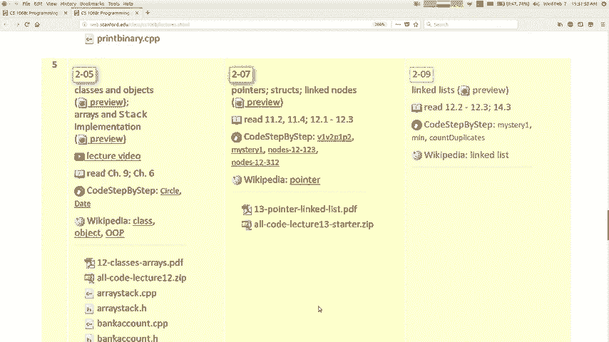

我们谈论这个话题的原因是这里的动机是，您可以用来实施集合的一般策略，称为，链接结构现在，就在前几天，我们看到了如何实现集合，使用一个或多个数组只是一块积木，所有这些在一起，内存是实现集合的一种方法。

它可以很好地工作，还有另一种策略是，您将一堆小块的，相互连接的内存几乎就像链中的链接，所以描述的一种方式是您现在可以调用该精英列表， ，结构有一些好处，我在后面很简单地谈到了这个东西，第二周，我告诉你。

有一个向量类，没有叶子，课堂上，我向您展示了可以支持相同操作的事物，添加和删​​除，这些东西正确获取和设置元素，我使用，作为讨论ADT抽象数据类型的工具，我说过，可以用两种不同的方式来实现这两组操作。

每种方式可能都有相对的利弊，因此，向量实现是寻找随机数的最快方法，元素，您可以很快跳到索引中的任何位置，但速度很慢，某些操作，例如是否要在，向量，您必须将所有人运送到您的身边，并记住所有正确的存储。

数据以这种链接方式具有不同的优缺点，特别是如果您想在列表的开头插入一些内容，更快，您不需要移动任何东西，我会告诉您为什么我会显示，稍后您会看到一些有关此概念的图片，但这是您可能想要的一种方式。

以结构形式实施它，这就是我们要学习它的原因，好吧，如果我们想了解有关如何实施，通过这种方式收集，我们需要谈论一种潜在的概念，首先，这是特定于C ++语言的，这个概念是，叫做指针，所以让我谈一会儿。

想像一下，如果您要很好地实现这一点，您将如何表示这些？ ，小盒子，这些小小的独立的存储器，用于存储，它们内部的数据很好，您可以为此使用一种称为结构的东西，一个结构，一个结构就像一个小小的班级。

我们正在谈论班级，基本上是一个类，但是结构通常只是一些小东西，里面通常只有一两个信息，有很多行为，主要是数据，就像这样一个非常简单的结构，类型用于存储一天中一个月的日期，现在声明一种新类型，因此。

现在您可以使对象的日期结构像类一样，除了，成员变量是公共的，而不是私有的，好的，所以struct就像是轻量级的类好的，如果记得的话，我正在尝试构建这样的东西，所以我想做这些小节点。

每个都在其中存储一块数据，然后它们也有某种，链接到另一个节点，那我该怎么做，好吧，我可以制作一个名为列表节点的结构，也许我想要这样，每个节点都在其中存储了一英寸的数据，但是我如何存储得很好呢？ 。

认为带有问号的类型应该有听众可以，存储一个下一个知道的列表节点，但是那不会有任何作用，有道理，因为这就像说列表节点在列表的一侧有一个列表，它的内部有一个列表节点，这是一个内部的列表节点。

我们开始了这种无限递归描述的结构，它不会使，任何意义上，实际上是行不通的，所以在C ++中，这个概念称为指针，让我来谈谈，偷猎者与新的内存有关，我认为你们，大概有一点内存的概念，例如如果您创建变量。

做一个向量，你做一个诠释它进入计算机的内存吧，我们将非常谈论内存，但是所有内容都存储在，记忆良好C ++是一种有趣的语言，因为对于您拥有的任何变量，您实际上都可以询问该变量在哪里。

存储在计算机的内存中我还不太清楚为什么，想问一下，但您可以先从您可以做到的方式开始，准备好在变量“＆”名称前面的“＆”号称为，操作内存地址的地址是整数， ，计算机的内存作为一个巨大的阵列，您可以访问。

内存，如果您有e混合或要获取该数据的地址，那么，就像我们在某处声明了这条称为233变量2指令的指令一样，记忆所有三个变体，一些虚构的数字，即该变量的内存地址，而不是，如果你运行一个程序。

我可以弥补的数目很多，地址，您可以看到它们，但它们可能不是这些确切的数字，尽管确实存在相对值，但您确实有所不同， ，现在通常情况下，它占用四个字节的内存，中间是，内存地址现在可能相差四倍。

为什么我要扩展，请注意，这一切都很酷，被称为，该生物让步，我们学会了一些高记忆力，两种方法，如果每个数字的值从零变到15，则等于16 ，该值等于9的0，然后等于15，这样您就不会太害怕了。

关于这些看起来很奇怪的数字，这只是一个数字，但我已经准备好加入，我们在不同情况下拥有的不同界面肯定是因为，需求会更紧凑一些，并且扩展数量会更长，而且，主要是因为大多数存储器的功能是您希望对，程序。

因为大多数东西是4或8或32的倍数，所以这，只是倾向于人们如何写地址记忆，尽管我把，如你所知万，不管怎样，你可以要求任何值的内存地址，等于加博物馆，它是“＆”号和操作编辑器，所以如果您可以退出。

支持人员，如果我看到这就是为什么我看到您有足够的供应量可以打印，在拉伸材料上的地址，您还可以打印个人的地址，结构内部的变量结构的第一个变量具有相同的，记忆力很好，那么我该如何处理这些信息呢？ 。

在这里告诉你其他东西，我们可以做一些，称为指针的指针是一个变量，该变量通常是或总结，当您声明一个指针时，您说该指针指向某个值，价格，因此这里的蓝线是创建指针的示例。

您可能会读到这是您可能会说int指针P存储了X的地址，所以现在，这是一个变量，好吧，这样您就可以在变量中记住其他人的内存地址，那就是所谓的指针了，我猜没有双关语的目的是什么。

您可以使用指针来访问和修改它指向的对象，因此，如果您使用星号运算符，我可以估算出X是一半的地址，这意味着跟随指针转到它所指向的东西，然后您便会看到，死了什么。

所以如果你说我要证明要给P出演星光意味着我想，打印P指出的操作，这意味着我要创建文本，打印x的值，以便打印42好的，您还可以使用指针，修改存储的内容，确定要说的内容转到P所在的位置。

指向并在该位置存储99，所以现在X存储99，所以PE是一种，到达X并且星号P是X的别名，好吧，这很酷，我们还曾在其他地方看到过这个概念吗？ ，修改或影响其他变量的值，是的，通过引用是的。

很多学生都有这样的问题，就像指针与通过引用传递一样， hyegyo指针是第一个引用小组的发明人，后来才制定了语法，较容易的参考书并不是那么难学，因为您说的是哦，我加了＆符，在我的参数中。

然后进行某种工作，然后修改一元份额，不用你想太多，服务员基本上是卑鄙的引用，某种程度上可能是，考虑到这一点，但这是一个类似的想法，即该变量确实是主要目的，是谈论该变量或查看该变量或更改其值，或者。

像那颗PE等于99的星星，如果我说P，你认为这意味着什么，等于99如果没有星星，那将意味着什么？ ，以为我会做的，是的，更多的是关于多余的小数，例如内存和种族，这基本上是什么。

 P等于99意味着和平或解决任何问题，好，这意味着基本上甚至可以将其指向垃圾场，甚至不知道那里是什么我的意思是有很多类比，以后保留有用的指针，有点像存储某人的电话，手机中的电话号码。

您知道是否喜欢我知道您的电话号码，存储在那里，我可以跟随该指针，我可以称之为机会，可以和我说话，但是如果我更改电话号码可以拿到电话，得了99分，我保存了该值，不会改变您的真实电话号码，生活。

它对您无济于事，即使我尝试也无济于事Kali I ，达不到该值，您可以将其设置为99，然后就可以遵循它了，将不再留下您编辑X的位置，还有其他一些地方，因此，如果我们要说没有星星，那是一种意思。

这不是一件有意义的事情，我们不想这么做，这是一个很好的问题，如果我将指针设置到诸如，操作系统核心，我跳到指针和一个很棒的操作系统或，基本上可能发生的最坏的情况是，您将使程序崩溃或。

您正在运行时会临时破坏自己的程序数据，您不能因为这个系统而破坏操作系统，您可能会了解任何称为“虚拟内存”的107或更高版本， ，每个程序都有一个可以使用的单独地址空间， 。

一个程序可能弄乱另一个程序的内容，运行，如果您不必担心，但它可能会使程序崩溃，最坏的部分可能会发生，所以无论如何您都可以拥有指针，按照指针指针将您带回到其他一些变量的值，知道你必须忍受我几分钟。

因为你可能会说我以为，我们试图建立一个链表，这与建立有什么关系，一个链表，你知道我正在教你打蜡和汽车，但是如果我正在，实际教你梳理食物，所以我们到那儿给我一点时间，好吧。

这是您可以拥有的指针的其他几种变体，一种叫做空指针的东西，您可能听说过不，但没有，非常具体的意思是C ++ no是一个指向，内存地址0，它是一个值为0的内存地址，基本上什么都不是，存储在内存地址0。

但这基本上意味着什么都不要指向，如果您尝试读出该指针，则可以这样做，您可以打印出一个指针，引用p1它将桥接到0让我们找到更漂亮的东西，普利兹是人，这意味着去内存地址0抢他们，留下印记，不会起作用。

将导致程序崩溃，分段错误或安全良好，程序将崩溃，无法正常工作，我在同一张幻灯片上还有另一件事，说是星际p2，我，甚至不给它一个值，我只用分号和，在C ++中开始看到的是，如果您不初始化事情。

那就不会结束，对你来说好，如果你不给你p2，就需要给事物值，这只是一种随机垃圾，我不知道您是否要跟着我走- ，它很可能会使您的程序崩溃，因为它可能会跳到具有有效数据的某个地方，因此可能会给您，该数据。

但它不会有用或您期望如此，您可能不想做任何指针，并且知道垃圾指针，关于它并不总是一个错误，如果您有一个空指针，您可能想要一个空，指针，因为此时您没有任何要指出的内容，及时在您的程序中。

但是您知道您必须了解什么是空指针，是，这意味着什么，我认为有些学生过分担心，例如，这不是一个程序，请确保您要小心空指针，但我想让您了解一下，您可以问一个指针是否不是全部，如果指针为null。

则崩溃此if语句将为true，并且它将，如果指针不正常，则返回false，您可以询问那是一件烂东西，同一测试有一个较短的版本，如果想保存几个字符，可以选择一个，说，如果你想要那意味着如果你想侮辱。

所以这些都是空的和垃圾，指针挂一个问题去哦，这是一个有趣的问题，例如我是否回来了，在这里，P指向X我能以某种方式找出P指向X的名称X ，不幸的是，使用该名称时，没有C ++不会存储它，只是存储。

如果我有一组GPS坐标，它的内存地址类似于，原来那里有塔可钟，但只有这些坐标我，可能不知道我敢打赌那是Taco Bell我只知道如果我去那里我，可以去那个地方，所以我可以看到那里的东西，但是我不知道。

就它而言，这是一个名字或其他东西，现在你饿了，不是吗，你想去吃一些塔可钟，并引起严重的消化不良，不要那样做吧，所以我们开始接近链接列表，几乎可以，您可以使用一个指针指出这个看起来不多。

就像Java或其他d16一样，糖果穿过我，我让机器人Carol和，颜色和东西都很好，然后是的，所以我想谈一谈，分钟，我实际上删除了我在此Cuz上的幻灯片，我只是想和你谈谈。

关于它在记事本上，这里有两种方法来声明一个对象，一种是我所说的非指针方式，就像日期d1 ，然后您可以说D一个月等于7 D一天等于13或，不管声明对象的第二种方法是什么，您都将其声明为，指针。

看起来像这八个指针d2等于新日期d2 ，箭月等于7 d2箭日等于13为什么有区别，我们同时拥有这两者，哪一个更好呢？ ，声明任何类型的任何值，并且如果您在函数内部，它将无效，声明一个变量。

最终您到达Foo函数的末尾，到任何作用域的末尾，尤其是它清除并抛出的功能作用域，列出您在该函数中创建的所有值，因此此时，我们击中了这个右括号d1被扔掉了，它从计算机的，内存被清理，您知道这一点。

因为就像您创建变量一样，退出该函数，那么就无法再像您所知道的那样引用该变量，这个概念以不同的方式在您到达时抛出了变量，它们范围的末尾好吧，所以我在第二个语法的底部，幻灯片，如果您在一个对象内部执行操作。

则将其创建为指针，函数，所以我有空foo-像这样，如果您未结束此功能，则不丢弃d2，这是一个真正的，我们要利用的重要功能我们将要制造一些东西，称为链表，我们在其中制造小物件，然后将它们连接起来。

一起建立一个青少年活动，问题是我们不希望这些话题，我会被我们想要我们的代码的人自动清理或丢弃，管理内存和分配，因此，我们必须使用第二个，我在这里的幻灯片上写的语法，我将教你更多，在我们继续讲课的过程中。

到底发生了什么，当然，但简短的答案只是第二种风格表明，指示您希望该对象寿命更长的语言，管理它以记忆自己，这对我们的工作很重要，哦，这个问题要回答，你就像一个全局变量，我不会说。

我的意思是不是不是这个变量D的范围-是某种原因，现在，它已成为全球性的东西，而不仅仅是存储的内存和所有值，只要我想着，这个故事就会保留原样，非常好的名称和变量，我们不能在一分钟之内谈完，但是，实际上。

我上下都充满了所有这些小物件， ，将它们连接在一起，我希望仅说明一下，以便在遇到一些，那边的那些小物件我不想让这些功能变得无聊和清洁，以我的名字命名的作品对我来说很美味，我希望领导者能留在原地，然后。

我已经完成了对内存和其他内容的液体盐析工作，这就是，从可能依赖该系统的系统中分离出来，我们的大部分蛋白质是，课程支持我想如果您考虑一下这是一个自然的问题，一秒钟，你去等等，我之前从未用过这个签名。

这是一张额外的地图，其他婴儿等着这是一个重要的群体，我们真的开始扩大规模，我必须在考虑答案之前先考虑一下，在那些结构内部，内部代码正在做的那些结构，为您准备的东西，您无需了解它，因为，联盟。

因此您无需学习即可利用此概念，在此课程之前，您无法考虑这个问题，是的，变量d2是，类似领导功能的大图，我只想从此开始，因为我希望我们，做得好好吧，是的，这个时代，这个箭头是什么意思，所以想象一下。

如果是上面语法之上的，那么sadi 2。月，是的，但是那不是很有效，因为，如果您的变量是日期，则不是有效，这不是日期，而是日期指针，那么，我们真正想要的是我们要去d2指向日期的东西。

 d2指向然后转到该点的月份，箭头的意思是，也许也许首先，当我学习C ++时，我实际上总是，我在这里强调的第一种方式写了它，因为这使更多，对我来说很有意义，但我现在想我更，我喜欢这种语言，是的。

我不想写所有这些，括号只是按照语言告诉我的方式进行，那就是我认识的这个语法花花公子有点奇怪，这些是我必须承认的，这有点怪异，当然，我不是C ++的忠实拥护者，其中一些概念，对我来说更容易教你。

也使你更容易学习另一种语言，像Java之类的东西，如Python之类的东西，如JavaScript， ，另一种语言的MUC较少，但是我们在这里，因此，无论我如何弯曲课程，都不要担心，这会没事的，是的。

没关系哦，嘿，你知道我如何奖励你们的小狗，我也喜欢通过在考试时间附近投下一点来奖励人们，暗示将要或不会进行测试的东西，因此在将来的演讲之前，期中，我会给你至少一点建议，我认为你应该，专注于您的学习。

所以如果您出现提示，我想奖励您，如果您不在课程开始时不在视频中，您将获得提示，所以无论如何谢谢我们的计划，小费不会与动物有关或与小狗有关，相关好吧反正看二道歉我知道这有点怪，但是我们必须做到这一点。

我们必须使用这种语法，所以这就是。

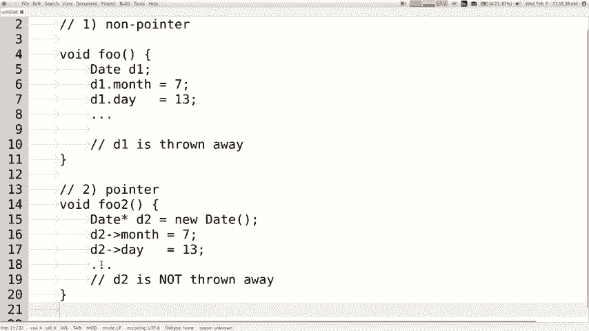

声明将其存储为指针的结构，然后引用其数据，所有这些都建立在我们将这些链接列表放在，不到一分钟，您滑动了我没有遮盖的幻灯片，您可以做出两个指示，我在这里说D 2等于D的蓝线，这意味着我希望d2指向。

 D点所在的地方或他们可能谈论过的地方，引用变量引用语义引用的是完全相同的概念，这两个别名指向同一对象的同一地方，除了现在，只是一点点更具体，我们说的是两个，指向相同存储位置的指针，只是用于。

相同的内容，对不起，没有D，我的坏事你想在哪里啊，是的，没有D。 。

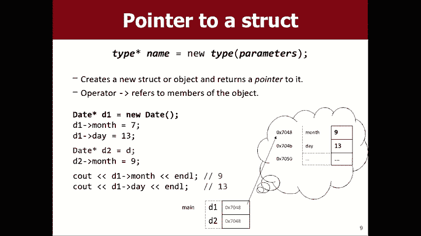

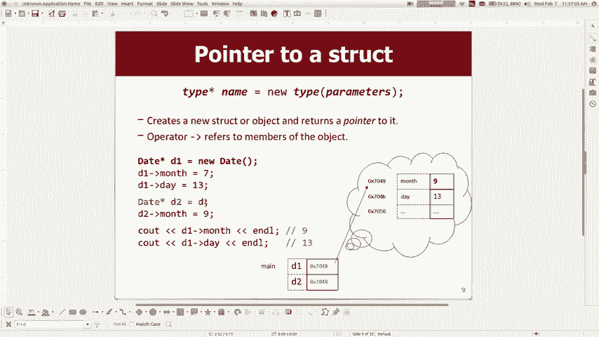

先说D，然后将其更改为D，因为我只是以为会，更容易阅读，但我错过了最新版，是的，一切，是的，那条蓝线的字面意思是我要我存储相同的，内存地址，但我想存储，所以无论他，想要重播清单作为代理囊袋的埃及人。

现在无论何时，您说D个箭头或失谐箭头表示以这种方式表示学校，记忆，然后你看那个月，看那一天，所以在那一刻，是的，如果我说D 2等于，他们将进入同一内存，其他的东西或其他一些内存地址，例如它们的语义。

不相信丽贝卡，他们只是软弱，他们说平等的意思是一堆，例子，是的，是的，这就是我想说的月份等于九时的意思，它使两者都指向的一个唯一对象将9存储为，如果明天我教D1后的面霜，我会看到九个好吧，好吧，我们。

到达那里，tad链表列表节点存储的是一条数据，例如，如果我要列出鸡蛋，它将把它存储到数据中的下一个节点中，链条，所以对此稍加模糊后，我的意思是看你不能唱出这个音符X ，因为那样就很有意义了。

但这就是链表节点，商店，所以让我展示给您看，如果您刚刚拥有这个，就拥有所有，你能做得很好吗，你可以大致代表一个链表，跟着你说一个新节点，我在这里有很多疯狂的色彩，我只是想将代码从代码映射到此处的轮廓。

笔记，男人，这是一个前沿，没有Brent是一个变量指针，它指向一个，对象，这是一个注释，现在我说他要遵循数据的前端和后端，存储42，以便今年放好，然后我说使下一个指向新音符。

然后记下戴维斯的负数或负三并记下这些，光学将它们粘合在一起，他是混合指针，也是最后一个，生产线现在完全承认，只是第一次看，反应正确我明白了我明白了，但是一旦你习惯了这个。

你会发现是看看我是否选择以这种方式建立清单，快速在前面或中间插入数据，只需重新布线，其中一些指针，现在列表中有新内容，那就是，功能强大，这就是为什么我们要学习这一重要的通用概念，学得好。

所以如果我们有这些事情，让我们谈谈你什么时候，有指针，并且您可以进行赋值语句，那些臭鼬会做什么，他们需要什么，如果我说是美国运通卡，练习学习很重要，等于下一个，我想转到下一个可变指针的东西。

我想要一个城市人，如果我想使其指向下一个变量所指向的位置，所以让我解释一下，这是绿松石盒的下一步，好吧，让盒子指向同一个地方，然后再回到下一个，换句话说就是。

现在很多学生在这里做的是他们认为如果你说x等于B ，接下来要做的就是让这个人在这里指出，这可能是某些人希望这样做的结果，但事实并非如此，我的意思是说让菲尼克斯变成凤凰城吗？ 。

认为这是因为它正在存储一些数字，一些地址存储在这里， ，正在存储攻击性记忆，我在想让这个成为这个，一个发生在这里，所以现在我想要这个存储相同的地址，这就是，就指针的力学而言，这种含义的含义。

这就是它正在做的事情的记忆，您需要能够理解，这些陈述意味着什么，因为您将拥有类似的图片，您将拥有一张前照和一张后照，然后您会说我该如何，把它变成那个，否则您将有一些编写的代码，然后您会说。

为什么它不起作用，您将需要追溯您的陈述，你写了做，所以你必须有这个概念，好吧，如果相反，我。

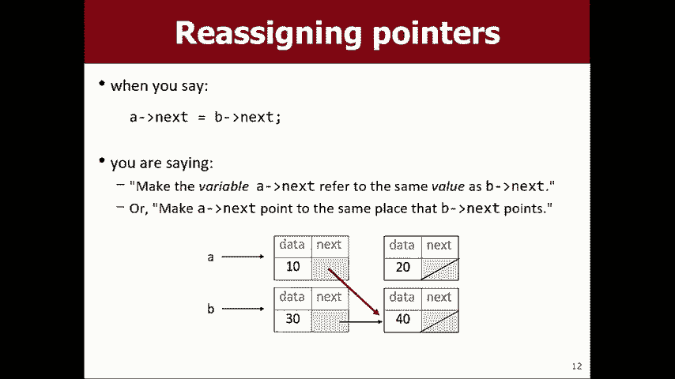

刚才说我也要删除这个红色箭头，所以我可以播放，刚等了B接下来你怎么看，所以写a将不再指向这十个音符，而是将指向这40个音符，请注意，然后如果我说aro数据，它会说40，如果我说下一步， 。

它不会说10和20井发生了什么，没有什么不同，从这个概念来看，如果我说过等于B怎么办？ ，再次，我希望您以我希望您说这些作业的方式来思考它们，大声陈述是要点，要点是要听的点，所以要，指向听到那样的声音。

不要再将其指向下方，这不会，像这样指向它并不指向我所指向的事物，猜想另一种说法是您不指向指针，对象想这样想如果我说下一个下一个等于B怎么办，那做，有人想帮助我，是的，你已经上课了，是的，在20点以后。

如果我从a开始，我会去那里，向前走，我将在概念上看到10 20 30 40 ， J是一个链表，其中包含四个元素，您可以在其中输入，不同的站点或您知道的不同问题的工作原理，如果您开始使用相同的列表。

则无法遵循以下方法导致， 10您知道或该计划只能遵循一个正确的指示是，这就是您到达其他音符的​​方式，因此您没有任何外部，指向每个单独音符的变量，您只有一个指向，前注。

然后按照下一个注解进入其他基础知识，所以我认为，女巫担心的是，我有一堆外部指针指向，到各个地方，这些指针没有用，我们基本上没有，做出那些指示，如果我们不需要它们，好吧，让我看看我有一个。

这段代码我想将这段代码复制到提示创建器中。

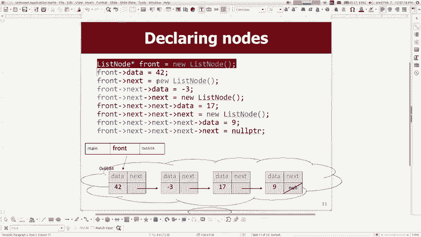

因为我想再谈一谈，所以在这里好吧，所以我有一个链接列表，其中存储了一些值，现在记住，如果我们的目标是实现一个集合， ，您可以对他们执行的操作请记住，前几天​​我们堆叠了，我们会努力推动流行。

因此我们正在从中收集一个，废话，我们应该有类似的方法或一些我们应该拥有的东西，对集合进行操作，您应该有办法像那样进行操作，应该是一种添加方法，并删除我应该有这样的东西，所以，那就是我们想要去的地方。

但是我想从一些非常简单的开始，想要像我要打印链接列表的元素一样开始，所以想象一下我会说无效打印，所以你知道打印给定的链表，好吧，您要传递什么参数就知道我是否要打印此东西，说版画你知道我的意思是什么。

你认为会去这里吗，我的意思是有四个小笔记，新列表，没有新升降机，好像我，需要正确地将所有参数作为参数传递，但是非常安全，前面，然后在这里您说类似列表节点star前面的内容，您想调用它，我将其称为节点。

也许在上面给它起一个不同的名字，目的是为了很明显这是分开的，因此，如果您想打印存储在第一个节点中的数据， ，您说ville的C out节点就是这样说，如果我想看到，存储在那里的数字，我怎么说呢。

是说节点数据，因为，小对象内部有一个数据变量，它们还有一个下一个变量，在右边里面，所以如果我打印节点，如果我刚刚祈祷会怎样做，顺便说一句，你会怎么做，你认为会发生什么，安慰，我知道您在想什么。

您为什么无法完成本次讲座，在降落日期之前，所以他不知道会变成这样，不不不，让我们不要想想我要保存所有讨厌的东西，直到之后，删除日期就是我们滚动的方式，呵呵，如果我抓狂了会怎么办。

知道某种内存地址0 X 7 fb3不管什么内存，那个音符住的地方我真的不在乎那个不是，有趣的是，我想知道里面的整数，所以，您所说的是打印便笺数据的，这样就可以打印出，列表的第一个元素很好。

我还需要打印第二个元素，正确的列表，以便将作为第二个元素的下一个数据存储为节点，右边，第三个元素是节点下一个下一个数据右边，然后是第四个元素，是下一个下一个下一个下一个数据这有点傻不是吗，如果。

我跑得真快，那会做什么， 42负数3我的意思是我认为这是在打印我输入的值，所以我，正确打印了链接列表，但是这个代码不是很普通，如果只传递3个节点，我希望能够打印任何长度的列表，如果我通过场景5音符。

它仍然可以正常工作，避开那是我们可以添加第二个参数，我们可以传入，列表的长度或类似的内容，因此，让我们回到此打印方法上来，我如何打印整个内容，长度列表通常在我们想要重复做某事时，我们做一个循环，对。

因此这里的通用模型用于处理链表的元素，是说先查看前面的数据，然后说Front等于Front next，所以在，换句话说，您正在做的是移到下一个节点，现在使我的前指针，指向下一个节点，如果继续这样做。

您将进行打印和移动，前进打印并前进前进打印并前进转到下一个节点转到，下一个节点转到下一个节点打印打印打印我应该做多长时间，将其包装在某种循环中for循环while循环现在我们碰巧，知道我们有四个节点。

所以我可以写一个多达四个的for循环，但我不想利用这一点，我宁愿循环只要，还有更多的数据要打印，那么什么时候应该停止打印？ ，这是什么，一旦front变为null，Wow front就不是null指针。

指针最终与我们的下一个下一个下一个让我到达该null，然后，这意味着没有更多的节点，所以我们应该停止让我们运行，我们将看到会发生什么，它将所有节点打印得太大，所以等等，但是那是我之前的输出。

让我确保它能正常工作，让我使其成为另一个新的列表节点，该节点存储八八八，并且，让我们让wait等待新列表节点，然后我不得不说他的数据是，八八八，他的下一个等于空指针，我刚刚又增加了一个节点，到列表中。

我只想确保它现在是否可以打印所有五个节点，好的，您知道我敢打赌，您可能希望能够打印链接列表，不止一次，所以让我们看看这里是清单， indle，然后再做一次。在这里再做一次清单，看看，那确实，任何重量。

为什么我没有打印任何东西，不是，它没有做，第二次为什么没有这项工作，有人知道这里发生了什么，是的，它已经到达列表的末尾，所以当我尝试再次打印时，是的，如果不是很明显，我已经知道了，我认为。

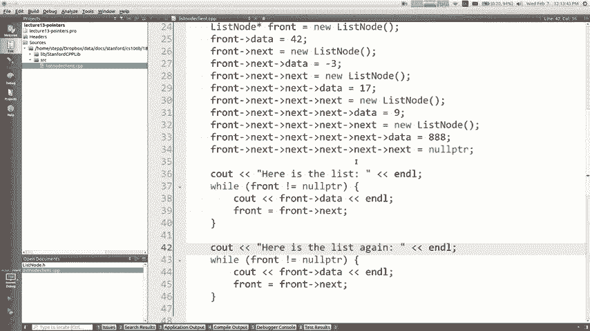

可能还有很多人还在努力弄清楚这一点， ，看到让我展示一张可能有帮助的图片，那么这在哪里，这个种族主义者，因为我们基本上是在做名单或我。

认为我们的阵线很冷，但是阵线是我的数据，我说打印数据，它会打印10，然后我说转到下一个好吧，我将转到下一个打印数据， 20转到下一个，您会看到像我们不再有人指向。

我们失去威胁的10和20是我们拥有的唯一方法，到达所有这些音符，然后我们将其更改，这有意义吗？ ，这里发生了什么我们为什么会丢失数据？您有什么想法吗？ ，我们能不会丢失数据你怎么说在前面保存备份是的。

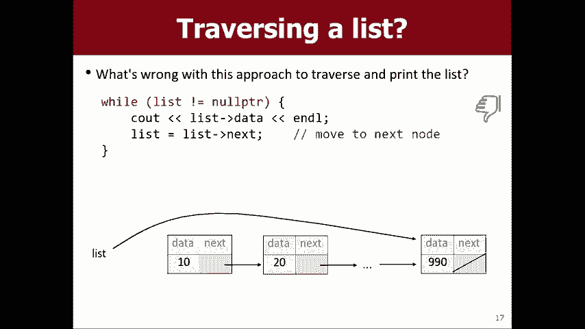

那是个好主意，我会做的是说我不会。

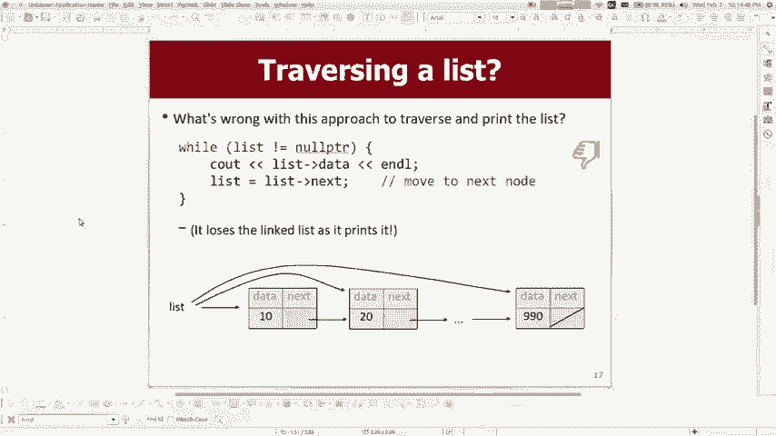

我会说像列表节点temp等于front的东西，所以使temp ，指向与front相同的位置，使其指向第一个节点，现在， temp不是没有打印温度数据将温度移动到下一个等等，现在，如果我想要的话。

再次进行相同的打印我可以再次执行此操作现在可以再次打印列表，可以打印两次清单，现在，如果您想查看一张图片，这是我想在幻灯片上显示的图片， 。

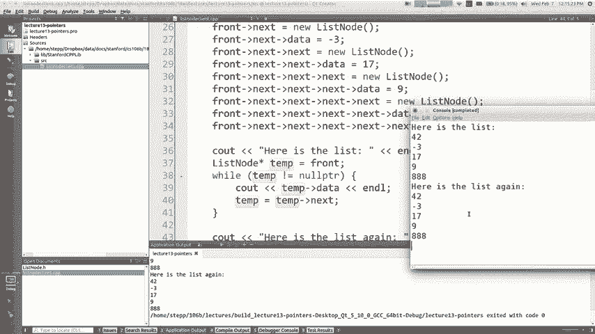

称它为最新，但这与我第二次说过的相同，因此，当前是一个新指针，该指针指向列出的同一位置，点或那个前沿点，所以看起来像现在，如果我说当前，等于正确，接下来它将移动该底部箭头，但不会弄乱顶部箭头，箭头。

这是重要的概念，如果您想遍历盖子， ，遍历链接列表，您需要以不会爆炸的方式进行操作，这是一个很好的问题，如果这是您从技术上讲不需要临时使用的方法，变量，因为参数本身是指针的副本，它是临时的，变量本身。

所以实际上让我回到该方法中。

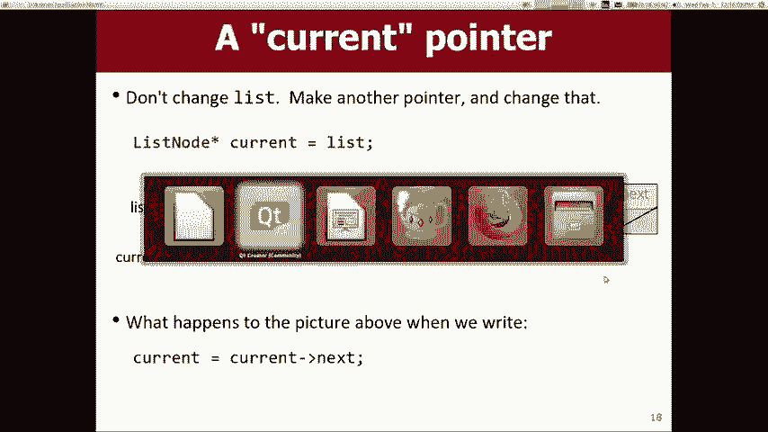

第二，所以如果我抓住这个，我就上去，我说嘿，让我们回到那个，打印方法看起来有点像那样，但我想我会说，注意而不是前面，这样相同的代码将起作用，但我认为您是对的，出于这个原因，我在这里不需要相同的临时变量。

但是现在在这里，可以只说正面印刷，我可以再说一次正面印刷， ，清单两次，所以我在屏幕上得到清单的两个副本，从正面开始并走到尽头的打印功能，后面的问题是指向同一地点，为什么不改变其中一个改变另一个。

这是一个很好的问题，如果我说temp equals和temp data equals之间有很大的差异， temp等于某事物，这意味着指向其他地方，无论如何，你指出我是否是你的副本，我们俩都指向某个地方。

我决定，想要指向其他不会改变的地方，你指的是什么，但是如果我说到我们都指向并改变的地方，在那里找到的数据会影响您及其操作，会影响我，所以前者首先是我在做什么，并且不会造成伤害。

后者将是如果我说临时数据等于999，那么我认为那将是一团糟，原始链接列表的元素，最后一件事我想告诉你，如果你想插入，在链表的最前面，所以在最前面添加， ，你知道42和所有这些不同的东西，我想在。

列表的最前面我该怎么做，所以我得到了这个前端变量，假设我想添加您知道的值8 8 8 8 ，在列表的最前面，我可以创建一个新的笔记列表节点，新的节点等于一个新的。

列出节点我可以将数据等于8 8 8 8好的，该节点，我希望您能理解该注释未与其他节点连接，节点，但是它们不是链的一部分，但是如果我希望它们位于，列表的最前面谁的下一个应该是新节点下一步谁的下一个应该是。

你是什​​么，如果您正确地指出列表的当前位置，那么我来之前，现在在我前面的想法是什么，如果我们做得很好， ，然后我们在打印列表时，前面是否应该有888 ，好吧，让我们看看等待，等待，等待，等待。

我认为我有一个88好的选择，呃，我们放七个，这是新值，好吧，对不起，我想我放了一个， 88还有其他原因，但这又是列表，没有7 7 ， 7 7就在任何地方，所以发生了什么，我仍然需要在这里做什么。

你有个建议，我以为你很笨，也许有人还没打电话，任何缺少的想法都会使我成为新节点，因为，在他们后面的是看起来很不错的前台，对不起，我的意思是。

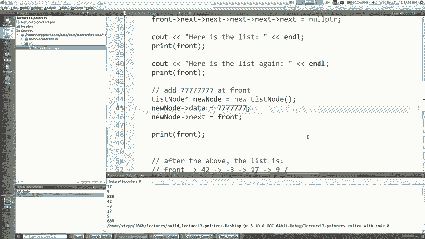

图片基本上看起来像是我制作了新节点，然后我将其指向下一个节点，这是什么问题，你怎么说，所以我可以从这里开始打印，我的简短答案是，指针指向此处而不是指向10使其指向这个新。

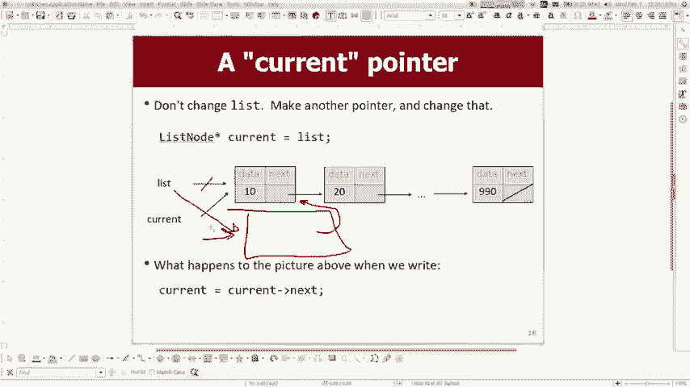

我添加的前端节点，所以我想我想说的是，前面等于新节点，使该对象的前端指向旧节点，而不是旧节点，前面他是这个新人，是链表的新前面，所以当我运行它时， ，现在打印列表，它将77077作为第一个出现的值打印。

我一直都知道这是一个令人困惑的话题，我们将做更多的事情。

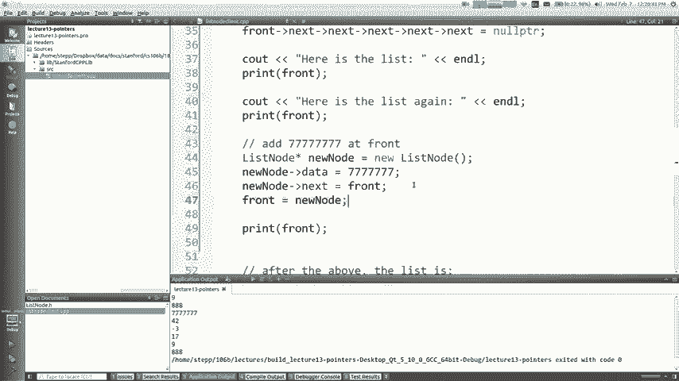