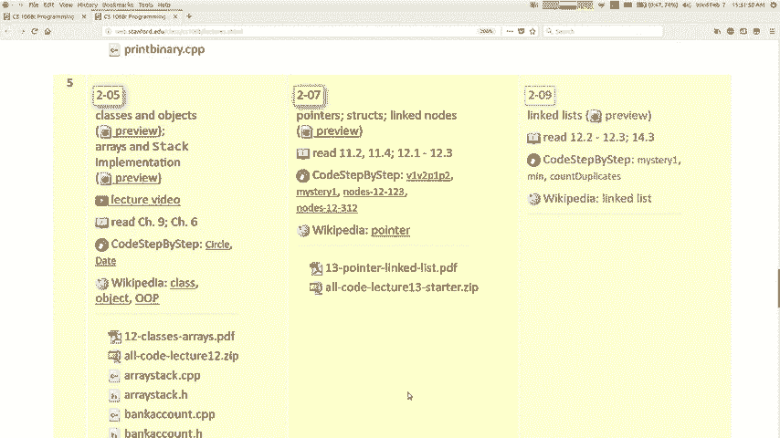
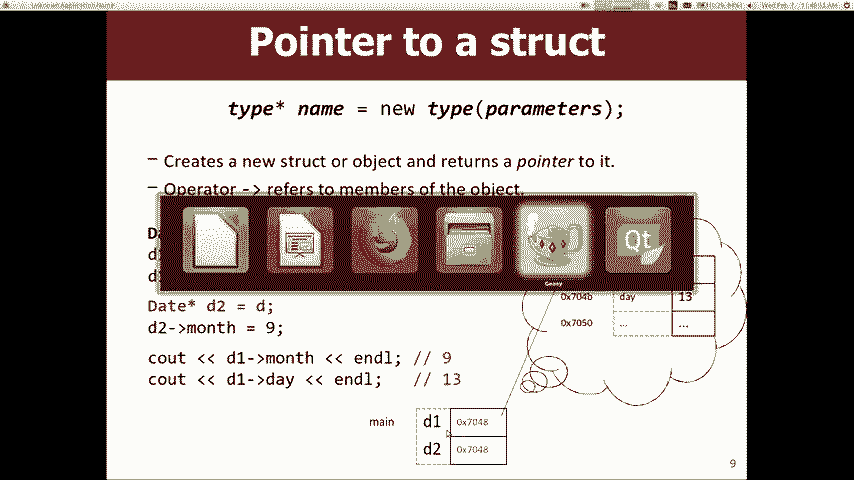
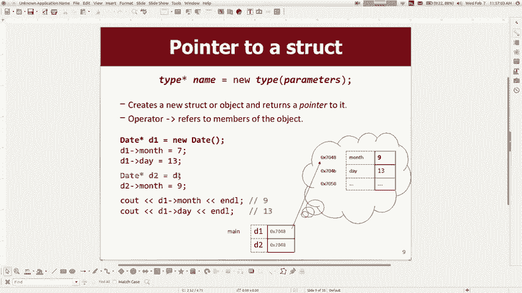
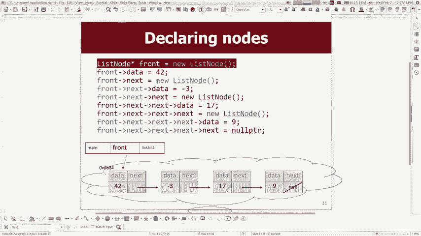
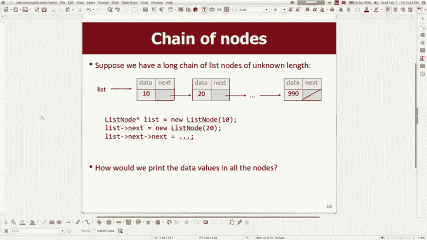
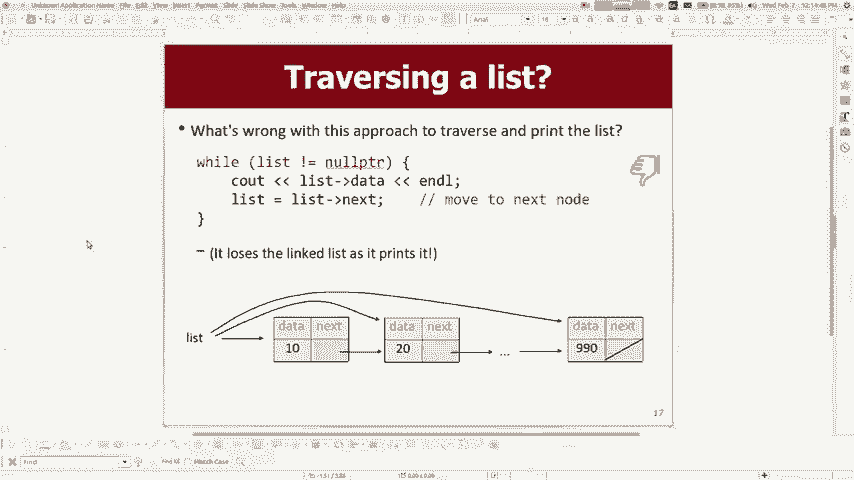
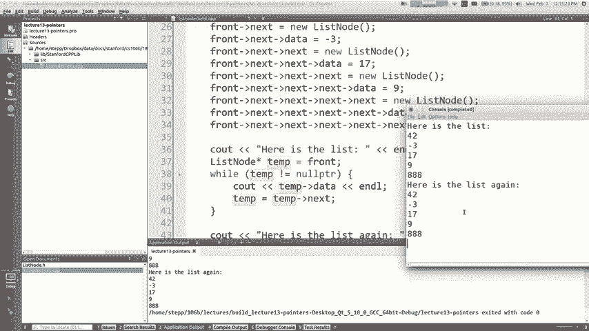
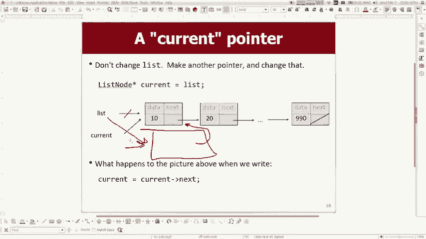

# 课程12：指针与链表基础 🧠

在本节课中，我们将学习C++中一个核心且强大的概念——指针，并了解如何利用指针来实现一种称为“链表”的数据结构。理解指针是掌握C++内存管理和构建复杂数据结构的关键一步。



## 概述：为何学习指针？

上一节我们介绍了使用数组来实现集合。本节中，我们来看看另一种实现策略：**链表**。链表由一系列通过指针相互连接的独立“节点”组成。为了理解并构建链表，我们必须首先掌握**指针**这一基础概念。

## 指针：内存地址的导航员

指针是一个变量，其存储的值是另一个变量的**内存地址**。你可以把它想象成一张存储着朋友家地址的纸条，而不是朋友本人。

### 获取地址与声明指针

在C++中，你可以使用取地址运算符 `&` 来获取任何变量的内存地址。

```cpp
int x = 42;
cout << &x; // 输出变量x的内存地址，例如 0x7ffee2b5c5c8
```

要声明一个指针，你需要指定它所指向的数据类型，并在类型后加上星号 `*`。

```cpp
int* p; // 声明一个指向整数的指针p
p = &x; // 让指针p存储变量x的地址
```

现在，指针 `p` “指向”变量 `x`。

### 解引用：访问指针指向的值

使用解引用运算符 `*`，你可以访问或修改指针所指向位置的值。

```cpp
cout << *p; // 输出 42，即x的值
*p = 99;    // 将x的值修改为99
cout << x;  // 输出 99
```

这里，`*p` 就像是变量 `x` 的一个别名。



### 空指针与未初始化指针

*   **空指针 (`nullptr`)**：这是一个不指向任何有效内存地址的指针。在尝试使用指针前，检查它是否为空是一个好习惯。
    ```cpp
    int* p1 = nullptr;
    if (p1 == nullptr) { /* 安全处理 */ }
    // 或者更简洁的写法
    if (!p1) { /* p1是空指针 */ }
    ```
*   **未初始化指针**：声明后未赋值的指针包含随机垃圾值，跟随它会导致不可预知的行为（通常是程序崩溃）。
    ```cpp
    int* p2; // 危险！p2指向一个随机内存地址
    ```

## 动态内存分配：创建持久对象

当我们构建链表时，需要创建许多独立的小节点，并希望它们在函数调用结束后依然存在。这就需要用到 `new` 运算符进行**动态内存分配**。

以下是两种创建对象的方式：

```cpp
// 方式一：自动存储期（栈内存）
void foo() {
    Date d1; // d1在函数foo结束时被自动销毁
    d1.month = 7;
}


// 方式二：动态存储期（堆内存）
void foo() {
    Date* d2 = new Date; // d2指向一个在堆上创建的Date对象
    d2->month = 7;       // 使用箭头运算符 `->` 访问成员
    // 对象会一直存在，直到我们使用 `delete` 手动释放它
}
```




对于链表节点，我们必须使用第二种方式（`new`），以确保节点在连接成链后不会被自动清理。

**箭头运算符 `->`** 是解引用和成员访问的组合。`d2->month` 等价于 `(*d2).month`。

## 构建链表：连接节点

理解了指针和 `new` 之后，我们就可以构建链表了。链表的基本单元是**节点**，每个节点包含两部分：
1.  **数据**：存储的实际信息。
2.  **下一个指针**：指向链表中下一个节点的指针。

我们可以用一个结构体来定义节点：


```cpp
struct ListNode {
    int data;          // 节点存储的数据
    ListNode* next;    // 指向下一个节点的指针
};
```

### 链表可视化



假设我们想创建一个存储 `{42, -3, 17}` 的链表，其内存结构大致如下：
```
[front] -> [data:42 | next:] -> [data:-3 | next:] -> [data:17 | next:nullptr]
```
`front` 是一个 `ListNode*` 类型的指针，指向链表的第一个节点。最后一个节点的 `next` 指针是 `nullptr`，标志着链表的结束。

## 遍历链表：访问每个元素

要对链表进行操作（如打印），我们需要遍历它。关键技巧是使用一个临时指针 `current` 来遍历，而不移动原始的 `front` 指针。

以下是遍历并打印链表的函数：

```cpp
void printList(ListNode* front) {
    ListNode* current = front; // 用current从头开始，保护front指针
    while (current != nullptr) {
        cout << current->data << endl; // 打印当前节点数据
        current = current->next;       // current移动到下一个节点
    }
}
```

**循环逻辑**：
1.  检查 `current` 是否已到达链表末尾（`nullptr`）。
2.  打印当前节点数据。
3.  将 `current` 更新为当前节点的 `next` 指针，即指向下一个节点。




## 在链表头部插入节点




在链表头部插入新节点非常高效，只需调整几个指针。



步骤如下：
1.  使用 `new` 创建新节点。
2.  将新节点的 `next` 指针指向原来的第一个节点（即 `front` 当前指向的节点）。
3.  将 `front` 指针更新为指向这个新节点。


```cpp
void insertAtFront(ListNode*& front, int value) {
    ListNode* newNode = new ListNode; // 1. 创建新节点
    newNode->data = value;
    newNode->next = front;            // 2. 新节点指向原头节点
    front = newNode;                  // 3. front指向新节点
}
```

**注意**：函数参数 `ListNode*& front` 是一个**指针的引用**，这允许我们修改调用者传入的 `front` 指针本身。如果只是 `ListNode* front`，我们只能修改指针的副本，调用者的指针不会改变。

## 总结


本节课我们一起学习了C++编程中的两个核心概念：
1.  **指针**：存储内存地址的变量，通过 `&` 取址，通过 `*` 解引用。`nullptr` 表示空指针。
2.  **动态内存**：使用 `new` 在堆上分配内存，创建生命周期由我们控制的对象。
3.  **链表基础**：利用指针将独立的节点连接起来，形成链表。我们掌握了如何遍历链表以及在链表头部插入新节点的方法。




指针和链表是理解更复杂数据结构（如树、图）的基石。虽然初学可能有些挑战，但通过后续的练习和实际编码，你会逐渐熟悉并掌握它们。下一节，我们将深入探讨更多链表的操作，例如在特定位置插入或删除节点。