# 【斯坦福大学】CS106B C++中的抽象编程 · 2018年冬（完结·中英字幕·机翻） - P13：【Lecture 13】CS106B Programming Abstractions in C++ Win 2018 - 鬼谷良师 - BV1G7411k7jG

好吧，我想在这里谈一会儿，这是凯莉（Kylie）之一， ，我们的部门领导计划的协调员，她会告诉您有关，有关如何申请成为部门负责人（如果您对此感兴趣的话） 。

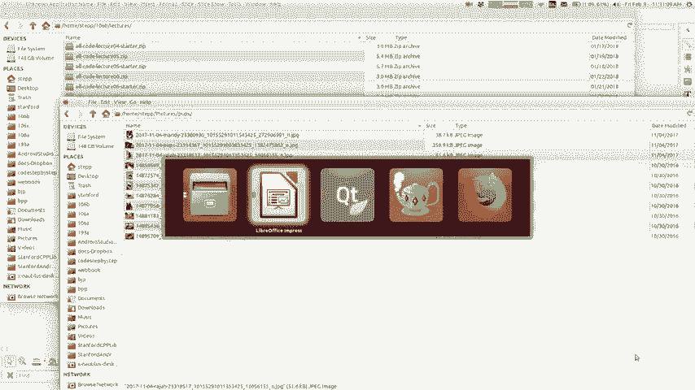

在这里取走凯莉（Kylie），就像马蒂（Marty）所说的，我叫凯莉（Kylie），我是其中一员， CS 198虚拟会议计划的协调员，所以什么是PS 。

 198 PS 198是设置您每个人的所有部门负责人的程序，当提供这些时，具有的PHA为106a至106X和106a为PHA ，应该特别针对这一轮应用程序，我们正在寻找。

对于当前的106 P和6x学生之一，那就是您，因此我们正在寻找，来自各个背景的第四节负责人，无论您的专业是什么，无论您在这里是什么，只是对以下内容感兴趣的学生。

帮助其他人解释概念以及与106中的人一起工作，类，那么通勤者做什么呢？我不会花很多钱，在这张幻灯片上的时间，因为你们所有人都有性需求，它不会与，你的性爱计，但要记住的要点是，这是一份有薪工作。

在第一季度以每小时17美元的价格在校园内学习，这也是一件非常有趣的工作，您可以与学生互动，在时间上是定期的，需要第二名，要求是您至少有四分之二有性需求，并且您，第一季将需要198，您将变成三到四个单位。

发生的所有会议都在星期一的4：30至6：00 pm进行，您，将在周一，周三晚上参加前四个研讨会，第一季度的几周，您将在那里完成所有教学和评分，责任，这就是说每周大约15个小时的发展，刚开始的第一季度。

为什么要分段，李我们要说的是学教教学是学习的好方法，除了直接与之合作之外，还更熟悉这些概念，您可以参加我们员工活动的学生，令人惊叹的一群人，同时在圣诞节留下您的印记，所以我们。

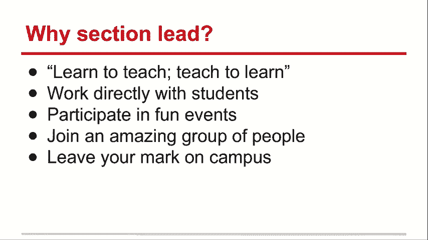

他们在每个季度结束时的正式宴会，我们欢迎您享用新的早餐。

早餐在耳朵之间，我们也有很多活动，赞助商和公司合作伙伴，所以我们在Google和，随着Microsoft的积累，您也将加入一个令人惊叹的四人联盟，人们建立了奇妙的校友网络，包括我在内。

现在已为接下来要交的六个PNX学生之一打开了应用程序， 2月16日，星期五，该职业可以作为该URL，如果您有，您收到问题后可以随时与我联系以及其他提示，该电子邮件地址的坐标，如果有以下情况。

我可以快速回答一些问题，任何人都有任何问题，嘿，大家都忽略了提及另一个人，这就是，您我不是这里的科长，因为我没有在这里上学，但我，是其他地方的部门负责人，他们有与我相同的计划，认为这很有趣。

确实让我感到很高兴能帮助学生和，这也许就是为什么我今天站在这里令我兴奋于教学和，你知道这对我来说是一次奇妙的经历，所以我想如果你们中的一些人，从106 B中的编码中获得了很多乐趣， 。

您可能想考虑的事情，我们很乐意让您加入我们的团队，所以，谢谢您的帮助，如果您有任何疑问，请给他们发送电子邮件，您也可以随时问我是否也有关于科长的问题，很高兴与您讨论这个问题，所以让我们做一些C ++吧！

 ，谈论链接列表和指针，您知道这是一个棘手的概念，因此，我敢肯定，这似乎仍然很难理解，我敢打赌，这周有点棘手，没关系，这完全是，正常情况下，我们今天将继续努力，并在其中获得更多实践。

星期五我们给您新的作业，但好消息是我们没有，今天要去做新的作业，因为你要到星期一，完成第四项作业，下个作业下周下课， ，不用担心，谢谢小恩，那将和我见过你们一样好，所以好快回顾一下我们写的。

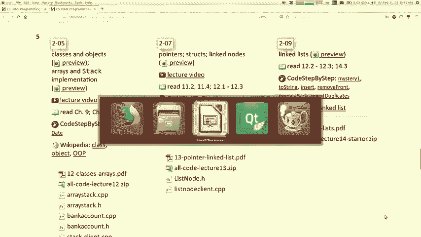

这些具有指向彼此的指针的节点，我们将它们链接在一起，一起制作一个链表，我们编写了可以跨链表的代码，可以遍历列表以检查所有元素或打印列表的列表，元素之类的东西以及我上次向您展示的关键概念。

时间是你经常需要做的，就像我经常会做的临时变量一样，称其为勇气或类似之类的称呼为勇气，因为这就像，我现在正在查看的当前节点，您可以使用此变量遍历，查看元素的列表以及使用该元素而不是。

现有列表的前指针或其他原因，因为如果移动前指针，您将鼠标指针移到列表的开头，则无法查看，列出元素就可以了，所以这是我们上次看到的重要信息。

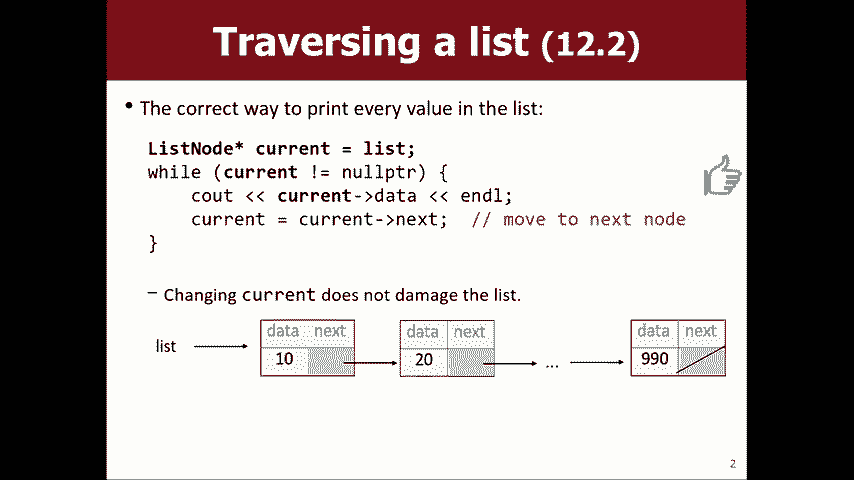

时间，因此我们正在处理此文件，因此我们可以，列出数据元素，然后我们可以制作像print这样的方法，然后，打印方法将采用列表开头的参数，然后，会祝福你它会打印出类似的内容，从，循环直到我到达null为止。

记住列表的末尾如何存储， null并移至下一电流等于当前下一电流将其移至下一电流，是的，所以我画了这些指针图片，我认为，当你说电流等于完美时，理解这样的代码行是做什么的，接下来。

您要说的是我希望当前指针指向当前下一个指针的位置，指针指向，因此使此箭头指向该对象所做的操作并移动，它到下一个前进，我们必须能够重新分配指针进行操作，链接列表起初有点棘手，所以我接下来要谈什么。

如果我们要为问题添加一个元素，这就是我们的友善，在星期三结束时在前面插入一个新节点，这样，在存储呼叫之前，我不知道20和30，而您知道我不想，遍历所有节点并更改数据，那不是我想做的事，而是花了很长时间。

我只是想做一个，新笔记，然后呼吸一下新笔记，然后将新笔记指向，其余的音符，它将更快，这将是恒定的时间量，而不是遍历n个所有大音符的循环，所以这是一个，我现在想做的一般事情是。

我们上次编写了代码来完成此操作。

主要功能这就是我们所做的事情，上面写着做一个新的音符集，将数据设置为新值，然后将其设置为下一个，然后设置为新值，让前端再次成为新的节点，我认为能够，查看现有代码并了解它的作用，如果我回到。

幻灯片，我可以在这里画出这些线条的输出，让我们回头，你知道我。

通常在我自己的讲座中不要看我的手机，但我必须像，现在有一天我要生一个孩子，就像我每次手机在嗡嗡声中，上课，我得看一眼，因为我的妻子喜欢你，如果我打电话给我更好的回答，我不在乎是否在上课时。

所以我们可能会在视频中捕获所有这些，我们会看到我就像但亲爱的，如果我在，在一个非常酷的无链接演示中，她就像你回答的那样，所以，那个是的，我在哪里哦，所以想像你，在链接列表的前面添加一些内容，好吧。

让我们用这些代码行进行跟踪哦，新节点等于新列表节点，好吧，那是我说新节点我将新列表节点设为新节点，之所以称其为新的，是因为我在这里不能写得很干净，所以new是一个指针，指向这个。

然后我说新的节点数据等于七七七，所以我把，值进入节点，这个东西有两个病盒，然后我说新节点，下一个等于front，这意味着使该指针成为我的光标所在的指针，摆动那是新节点，下一个指针使其指向同一位置。

那个前沿，所以这意味着把这个指向右边，那样的话，我星期三对你说了，我再说一遍，不是，正确地说它像那样或不指向指针，它指向其他指针指出的东西意味着，指向与此相同的东西，这就是那行代码意味着好的，所以它。

意味着将新节点的下一个指向此处，现在我刚执行完第43行，我想让您了解我，还没有完成，如果我在第43行之后停下来，我将没有，成功地向Billy添加了任何东西，原因是，因为坚持此链接的人列出了他们的方式。

通过从头开始访问其所有元素，然后再继续，下一个下一个右，你知道，如果坚持的人在前面，这个清单，我不知道这是什么比喻，但就像我知道这是事实的144 ，当我说front等于新节点时，此代码非常重要。

这意味着make ，新节点指向的前端，这意味着不要指向二十个，在这里指出第二点，现在列出所有意图和目的的列表，代码确实在列表的前面插入了所有这些行，那个原因好吗，这能让你们理解这段代码吗？ 。

关于那里的代码和那里的图片以及这两个如何匹配的问题，彼此，是的，哦，通过参考传递便条，我会在第二次谈论它，是的，我，没，我还没有，呃，还没有到那儿，基本上，我会那样做的。 ，好的。

这就是将代码添加到列表开头的代码， ，似乎是一种有用的方法，所以我们为什么不把它变成一种方法呢？ ，您可以想象我们将编写一个名为add front的方法，因此，添加前端，我们是否添加前端。

所以这里添加前端好吧，如果我，刚拿了这段代码，我刚刚将其粘贴在这里，这是相同的代码，你告诉我什么是前沿，你告诉我你想增加的价值， ，我会做所有这些事情似乎就像我们所做的那样是合理的事情，通过打印列表。

我们最初将其写在缅因州，然后我们将其拉出，进入功能很酷，好的问题是，这将无法正常工作，它为什么不起作用的原因我将向您证明它不起作用，首先，然后我将讨论如何解决它，也许您已经知道了，进行修复。

但我先向您介绍，让我们去缅因州，而不是，这个清单有42，而我认为我在这里可以做的是，说这个节点前端等于空指针，只是我还没有任何数据，但是我，可以说添加前逗号，这里的值是什么42你知道我应该是。

现在可以通过调用此方法来构建列表42或我想是，反序，所以它实际上应该是9然后是17然后是负3 ，然后40我想如果我按此顺序将它们添加到前面，然后在结尾，在我要列出的所有清单中，我要42个负数。

你知道我的意思吧，好吧，我的清单是这样，让我们​​来看看它的作用，我的清单又是清单，这是什么都没有，它是空的，它是空的，没有做任何事情，我只是测试了这段代码，它起作用了，但是我将其移到了，方法。

现在不起作用了，所以我想尝试解释一下，表示这与您有问题有关，传递一个指针作为参考，并且与此相关，所以我想，在这里解释一下，所以为什么不能很好地工作，这就是我们的代码。

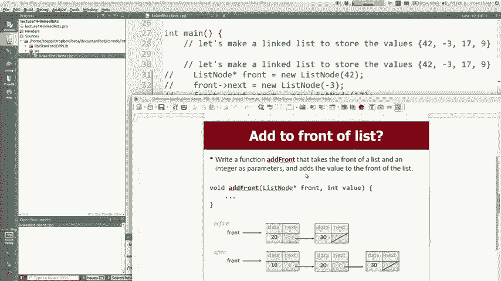

基本上我正在尝试将前面插入右10 ，这正是我们输入的代码，可以使您知道得足够接近，放到下一个，然后放那个节点的前脚踝，所以让我，描述当此代码正确并在，当我将列表指针作为参数传递时，它的前面。

功能内部的向上和邪教前沿，但实际上，意思是使前面的参数指向这些列表所在的相同位置，这里有可变点，所以我在主目录中有两个指针一个盐列表，在学生的广告中发挥所谓的前台作用。

他们俩都存储看到寻址他们他们都指向同一个，放置所以我该说列表节点temp等于一个新节点，它存储了这个值，所以可以使一个新节点在其中存储值10， ，有这个指向它的温度临时变量，这就是第一件事。

现在我是否说temp next等于front，所以next应该指向front ，这是正确的，这一切看起来都不错，所以现在我说，前面等于温度，这意味着使这个人指向那个人指向的位置，正确地做。

这是所有非常好的东西，除了列表前指针，这里没有更新此参数前面已更新，但它们是分开的，如果我将其中之一更改为，则它们是指向同一位置的两个指针，指向其他地方不会影响其他地方，再次指出。

如果我说front等于10可以，但不会改变， main是main的变量，所以无论如何这就是错误的原因，不起作用，很久以前，我们就生活解决了这个问题。 ，希望能够以我们的方式直接更改它的功能是。

通过返回值或通过记录测试事物，这是一个，这样做有点奇怪，但是如果您传递了一个，则可以通过引用传递一个指针，通过引用的指针，这意味着您只是在共享，来自main的另一个函数的指针，该函数修改指针。

改变也将在主要方面看到，这就是参考，参数你已经知道做参考有点奇怪，带有指针的参数，但这就是引用参数始终会执行的操作，无论是向量还是int还是这个东西，所以实际上并没有什么不同，因此。

如果我们注意命令的顺序，只需在此处添加此与号即可，它是一个指针“＆”，而不是“＆”指针（如果您正在执行，错误的命令是行不通的，只是简单地进行更改，我就会看到你，我会，一秒钟内打电话给您。

我只是简单地进行了更改，现在的图片如下，所以这完全相同的代码，但我所做的只是在上午，现在，当我说添加前十名时，这里不是％ ，指向与list相同的位置front是list的别名，它们都是。

您知道相同的指针，这就是现在的引用参数，相同的代码做了非常不同的事情，我将列表注释设为临时，将下一个温度设置为与前一个相同的位置，以便它指向，现在，当我说front等于temp时。

它将front和list指向两个，它应该如果这个箭头应该消失在这里或其他什么，但对不起，图应该在这里划掉这个黑色箭头，但即使现在，更新我的邮件，这就是为什么此版本现在有效的原因，我正试图吸引您。

这些图片，看看发生了什么这些图片对我每个人都不起作用，想想这里的简短版本，如果您遇到一些麻烦，请说，看你是否正在编写一个函数，通过添加您知道的内容（而不是指向）来修改链接列表的文章。

领导商人事物的新节点，那么您必须，函数将紧缩指针作为参考点，因此如果要更改，您在调用列表参考点时不需要这样做，打印功能我们没有通过引用传递那个原因是因为我，我没有修改要点，但我没有更改列表，所以谁在看。

读取列表的列表与搜索列表不符的列表只是一个，常规的旧计划，如果您要修改列表，轩change将列表更改为对某点的引用，因此实际上，您需要记住在功能中始终遵循的规则，现在是冬季部分。

如果您在阅读列表时遇到问题，可以通过，本节中的常规指针（如果您对此进行了修改）会将其统一到一个点，因此如果我，挂断电话，你知道还是很急吗，对不起亲爱的，哦好吧，所以你的问题是，为什么漂亮。

为什么不打印原件。

列出正确的代码，没问题的原因是因为我关闭了，建立了清单，我认为如果我们的ad front方法可以正常工作，我可以使用它来，建立清单，让我让我将其更改为您可能期望的样子，要做的是返回此代码。

因此它应该打印该列表，现在，但是当我尝试添加时，添加前，该值前面的逗号777我希望该值出现在前面，所以让我们，看看它是否意味着我不会，所以我得到了清单，只是我没有告诉过它，添加一个值。

但并没有做到这一点，但是这里的魔术解决方法是添加前端，应该引用一个指针，然后哦，我做了吗，我打破了它，哦，我认为是因为我有一个原型，我有一个身体，他们，必须彼此匹配，所以我想在这里我声明在此添加前面。

如果他们不匹配，也需要作为参考，你们会感到骄傲吗，这本书我就像是家庭作业1或2或其他正确的东西，所以嗯，看起来它添加了，现在在前面的东西，所以现在工作了，哦，在这张幻灯片中他有两个好名字吗？ 。

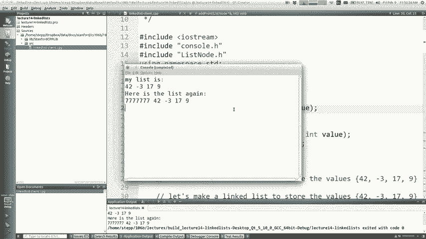

不同的名称，因为我想清楚地表明名称不是，没关系，在此代码中，如前面的列表所示， ，该持续时间有两个名称，但是一旦返回就返回到正好，有一个列表名称。

但是我认为在某些代码中您可以在main中将其命名为front ，而且您也可以在这里称其为正面，就像您有两个前沿，是彼此相同的别名，所以可以有两个名称或，无论如何，两个变量仍然引用它，我知道这很难。

我知道这是，令人困惑的是，我想你只是知道自己是否正在，麻烦暂时要记住的是，如果我要修改，列表通过参考问题传递到前面。

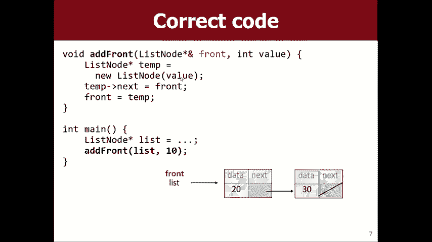

为什么每次都不能增加7-7，我想我所做的就是增加4 ，通过连接Nexus来评估老式方法，然后在这里我只是，一次添加了七个七七，所以这就是我，基本上是在缅因州做的，所以现在我进行了更改，我想也许我可以。

将其关闭，我可以将其打开，然后整个列表将，正确构建好糟糕，我想发生的事情是，如果您添加，前面我们将值设置为每次但它们传递值，他们想要我们使用的可能就是您要的内容，也许是。

放在笔记中的价值今天不一定总是七七七，这是一个很好的问题，请问如果我编写的方法不是，修改过的朋友不会修改最后一个或，中间还是我仍然需要通过引用传递一些东西，这很棒，问题，我认为答案是“否” ，是的。

如果您不确定，那么“是”是一个不错的选择，所以让我们。

我想和你们一起写一个方法的地址，称为广告，基本上是添加到后面，所以不再是前面，正确，这样我就可以解决您在此处提出的问题，现在我已经写了一个＆符号，但是也许我们可以尝试选择，但是如果我们，是否需要。

所以这就是您知道将向量添加到向量的末尾很容易的方法，只需将其放在最后一个索引中，然后在向量的末尾添加一个好方法，好的情况下，快速案例的结果是无叶的，与之相反，前面是个好案例，因为您就在那儿。

只需添加东西即可， ，最后，您实际上必须喜欢说到最后一路跳，下一个下一个下一循环进入最新的结尾，您理解像，如果我想像这里一样捐赠图片，我想补充一下，也许你们可以帮助我编写该代码，我是说我有一个主观的。

循环以走到列表中的正确位置进行插入，所以我猜，问题是我是否有一个作为指针的当前变量，我猜，必然的结果就是循环测试应该是什么使我前进到，正确的地方你怎么看。

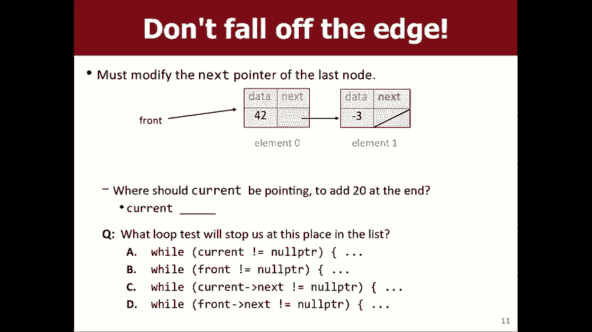

好吧，我现在想写Kerr吗，因为那更容易拼写，如果您认为电流应该指向此处，则希望电流指向此处举手，这里没有人举手好吗，我想让电流指向这里举起你的手吗，如果您认为我想要当前点，那有些手可以完全坐在那里。

如果你想让我放屁鼓励你，那么冷漠，就像千禧一代的参与，你们不是，您应该是Z世代的千禧一代，如果我要指出的话，如果，你现在喜欢那只，你不知道举起你的手，只是不知道，你现在好吗，我们需要在这里添加新人吧。

如果要在此处添加节点，则按比例绘制，这意味着您需要，在与节点进行对话之前，您需要先看一下，当前的最后一个节点应该是执行此操作的最后一个节点，有人敢于你怎么看，是的，你说你看到我想你是对的。

曲柄应该在看Evan哦，下一个不对吗，所以我想现在的next正确为空，但是我猜我在说你的原因，可能会说很好，发现很明显，或者我不知道， ，但是很多学生都想选一个，他们走的很好，不断循环直到我看到。

 null保持循环，直到current是null右，但是如果这样做，不起作用，因为让我尝试跟踪您会说些什么，您会说像在这里开始电流一样在前面开始电流，然后您会，说好是当前的null否，然后转到下一个。

因此转到此处，然后，你会说是当前下一个是当前null不行，转到下一个井下一个，为null，因此使current也变钝，因此使current为null，null ，就像这样的斜杠。

null不会指向任何这些注释，如果您，如果你一直走到电流为零，你就会跌倒，链接列表，现在您的指针没有指向其任何注释，所以循环直到current为null一直走到最后，它不会，对于开始添加内容很有用。

您需要在元素1上方停止，图，所以在链表的末尾添加看起来像，接下来，如果我们要在后面添加，该怎么称呼我在这里，的添加，让我们让一个列表节点当前开始，当前之后有一个下一个节点我会说当前应该转到下一个，现在。

在这一点上，当前指向最后一个音符，因为她说那是，我们想停止，所以如果您想同时在两个节点之间插入一个新节点，我想我可以同时在屏幕上同时显示这些片段，当前的位置，所以现在我要编写哪些代码行来添加新节点。

之后，您说什么很棒，使一个新节点放入我们要添加的值，进入该节点，然后当前指向该新节点，完美正是我想要的，因此使列表节点为新节点等于，新列表节点（如果需要），可以将该值放入该节点的数据中，像构造括号一样。

将值存储为数据， ，现在，新节点接下来应该否，因为这个家伙将在，列表的末尾没有人在后面，但是现在你说的是， current。next是新节点，将他放在最后一个音符之后的流之后，好吧，现在有些人会做的是。

他们会说我可以，当前等于新否，如果我要我做什么，我想追踪这个，和你一起看看如果我说电流等于新节点怎么办，所以我试图在同一时间在屏幕上显示，好吧，所以现在，在这里指出是的，这就是我们所做的。

现在我做一个新的音符，所以我称他为， e：w中的new指向一个新节点，其数据存储了所有内容， ，下一个什么都不是null，现在，如果我看到current等于说make的新节点。

该指针指向新节点指向的位置，因此不再指向该位置，而是指出这是什么，这是什么工作，是的，我的意思是说您不会在列表中添加任何内容，使用此列表的人创建此列表的人，谁在照顾它主要取决于他们知道里面有什么的方式。

列表是他们从最前面开始，然后是下一个，它真的被隐藏了，正确的是，如果您从以下位置开始，就他们而言，这就是列表中的内容，前面，您走到下一个，下一个，下一个，您从未看过这个新音符，但是。

知道依附在任何人身上，只有两种方法可以让某人去，退出或者将其放置在列表的最前面，或者您可以重新创建一个，在列表中的现有节点之后可能不存在下一个，这是仅有的两个，修改链接的方式，这就是为什么它对于。

说current。next等于新节点，不同之处在于，在这里指出当前点，说嘿当前跟随您的指针，然后，设置该对象的下一个变量以指向该新节点，因此使下一个，东西指向新节点，使下一件事指向新节点，例如。

现在新节点已成为列表的一部分，我的意思是我想我应该遵循一般规则，如果您发现自己说当前的漏洞，那将会给您，就main而言，这不会改变链接列表，关注它总是必须是当前的下一个等于或必须是前面的等于。

而front等于工作的原因是因为我们通过引用传递front ，这就是为什么它起作用，这基本上是在链接末尾添加内容的算法，列表，但缺少重要情况，所以您知道是否，算法确实有效，无论如何我都应该能够使用它。

主要是如果我真的想能够创建一个包含42个和，负3和所有其他东西，我应该可以使用add方法，完成这项权利，所以我应该能够对发生的事情进行分组，可以说这样的广告我应该可以加上42和负数3和17 。

 9我应该能够一无所有列出东西，正确，如果我尝试这样做，则会收到错误提示，欢迎您使用细分错误，不会在上次遇到细分错误时基本上是，指针错误，您遵循了不应该遵循的指针，因为指针为否或指针为垃圾之类的东西。

通常意味着您走出了链表的末尾并尝试访问数据，在此处找到或者您尝试遵循空指针并尝试将其用作，尽管如果它们的概念称为空指针，则它是Java中的对象，例外，大多数语言都有某种类似于我们的错误。

它说发生在第135行的add函数中的行号，功能行135在这里，为什么您认为此代码崩溃了，因此，仔细了解main的主要调用方式可能会有所帮助，说我有一个空列表，我想加42，所以我基本上是说我要42 。

成为列表中唯一的元素，他曾经是null现在我希望它成为一个，在此代码中不起作用的一个元素列表，如果front为null，此代码将做什么？ ，当战线为零时，这是怎么回事，你说那是对的，所以他说。

它将当前电流设置为null，然后说“嘿null”是什么，知道不能跟随空指针之后的下一个，并查看那里的数据或发现的下一个没有对象的数据，在那里交谈以了解您的意思，所以当前面的，该列表为null可以。

我们可以修复它。 ，我只是想让您看到这是一个错误，所以才是，现在崩溃的一般原理是，您可以从该错误中提取出，我们发现大多数链表代码必须考虑不同的，情况不同，则说明该列表可能位于大多数链接的列表代码中。

应该自己考虑，如果列表为空或为空，如果列表为空，该怎么办，列表中只有一个元素如果列表中有很多元素怎么办，您可能要问的另一件事是，如果我在，前面，如果我在中间做什么，或者如果我在中间做什么。

几分钟前您问的最后一个问题是思考的好方法，关于这一点，请考虑不同的大小并思考，关于您可能在此代码上操作的不同索引或位置，对于一般情况，我的工作非常出色，我认为如果我回到主要领域并恢复我的。

原始代码生成一个列表，然后从那里尝试添加一些内容，认为代码会起作用oops，抱歉，我有一个重复的变量，我认为，代码看到它确实添加了我尝试添加的内容，因此广告可以正常工作，不适用于null列表。

所以您要做的就是这么说，如果前端是空指针，让我们以不同的方式处理这种情况，我们之前编写的这段代码是针对非空列表的，我们通常会想到的一般情况，但这是一个，空列表（如果要在空列表的末尾添加内容） 。

你是怎样做的，戴着眼镜，是的，继续。

使前端指向正确的新节点，前端当前没有变化，它从null变为指向我正在创建的新笔记的指针，因此，我们正在描述的情况看起来不是这样，而是使它成为现实，指向一个新的音符。

所以我不需要做任何循环我不需要做任何循环，接下来，我必须有一个当前变量，如果您需要这些， ，需要在列表中走得更远我不需要这样做，因为有，没有更深的距离，如果没有列表，那是空的，没有让它变得未知。

通过创建一个新节点，并使其成为该新节点的前端， ，结束我们之前写的内容吧，我认为广告应该在所有，不同的情况下，如果我跳回主菜单，我希望也许我可以使用，我在这里使用的这种旧方法从null开始。

我只是添加东西，它在起作用，嘿，所以现在要添加注释，为什么不让我回到，我们可以看看它，为什么我要说其他，好吧，我猜如果我给你那总是柠檬碰到的精灵皮肤，然后，会将其添加到步入式编辑器的最前面。

您也知道我需要，所以我只想做我误会的两件事之一，提问者，我的意思是，基本上，如果列表为空，则执行那一行，如果是，不是空的，我可以走到尽头，这很奇怪，所以我应该选择，这些分支之一是我不想剥夺的小说。

我不想做，我之所以走到最后，是因为没有部门负责人，野外的缺陷哇，哦哦，所以我可以代替一下，例如将这段代码修补到某种程度上，与前台为空的情况下工作，可以肯定的是，但我，建议会是这变得越来越容易。

并且效果更好，也更容易，调试，我想尝试使一大堆代码像小心处理一百万，不同的情况下容易出错，我认为这很干净，就像，那里什么也没有记下来，如果那里有东西走到尽头，并把它放在最后。

但这恰好与我的心理模型更接近，发生了什么，我认为如果您遵循此模板，我认为您可以解决几乎所有链表问题的模板，哦，是的，问题哦，这是一个好问题，因为之后没有任何内容。

我应该说这个新节点代码在技术上应该等于null指针，因为如果不这样做，则列表节点类将自身初始化为下一个null ，设置下一个，但这也很好，只是非常明确，我不，希望在那之后有任何下一步，是的。

我的意思是您可以将其写在。

您可以说很多步骤，例如列表节点，新节点等于新列表，节点，然后您可以说新的节点数据等于此值，接下来添加新节点等于没人前置好吧，我希望您成为新节点，可以将所有这些作为单独的步骤完成。

我们为您提供的列表节点类，可以将数据放在这里，甚至可以将下一个放在这里，也可以，在创建节点时初始化一些东西，如果不提供的话，他们的默认数据是0，默认的下一个是null，所以你不，不得不说。

但这就是它在暗中做你的事情，还有什么，好吧，怎么样，所以你说我们不在前面重置，我的意思是记住，这段代码的重点是要添加到列表的末尾，所以我只想，如果前面是末尾，则设置前面，例如，如果没有列表，您知道吗。

如果我，已经有一个包含一堆节点的列表，我实际上并不想设置，前面还会影响当您跟随后面的下一个指针链时我们将看到的内容，前面也是如此，所以列表基本上是这样改变的，所以我。

从最前面开始，我走了很多，然后设置了该节点的下一个，因为我从最前面开始，我们都指向相同的对象，也可以修改链接列表，这就是共享。

看起来很难，这是很难的东西，你必须练习，你必须画一个，我们正在练习很多图片，这就是我们想要做的很好，谈论撤离几分钟我这里还有几分钟的课程，让我们谈谈我不想做的事我想做的事我不想做的事，我想要删除的那个。

所以实际上这就像一个将军，删除需要一个索引，但实际上我想我想做的是，如果我们有时间的话，想删除前面，删除后面，我们可以写更多，但是让我们，移开前面，然后通过前面，您如何处理？ 。

标题，如果你想在这里我会说什么删除我没有标题，为此，但是我现在就选择添加前面，在这里删除前面，并且，它应该是参考，因此删除前面，从列表中删除第一个值我该怎么做，这听起来很棒，所以因为我要更改列表的开头。

所以我希望成为前面，是另一回事，我应该说front等于现在，您可能会说是front ，等于还是等于前面等于下一个，我的意思是你所说的变成前面等于，如果您说前下一个等于我该怎么做，我认为这是正确的。

想要将front设置为等于front next next应该指向的位置。

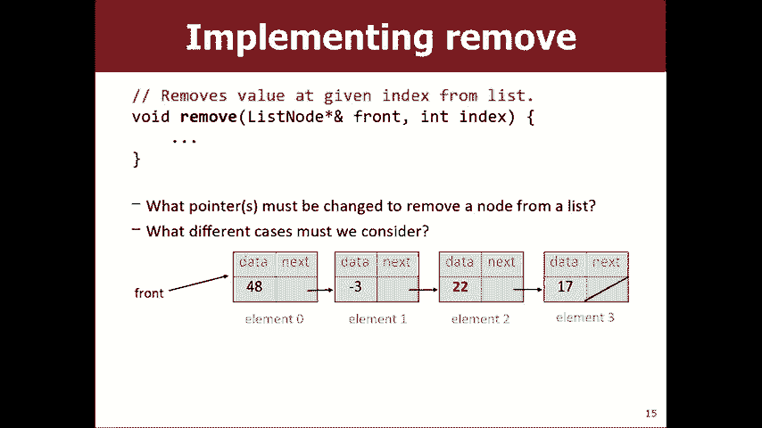

这就是我要在这里做的事，所以前面等于前面好，那不是很辛苦，我想我们早就解决了，也许我们，只是去吃午饭，或者我们还不太了解那边有一个，还是有一些需要影响的事情，所以你问了一下，内存和垃圾之类的东西。

你说对了，这很糟糕，它有一个称为内存泄漏的错误，我不知道是否有幻灯片。 。

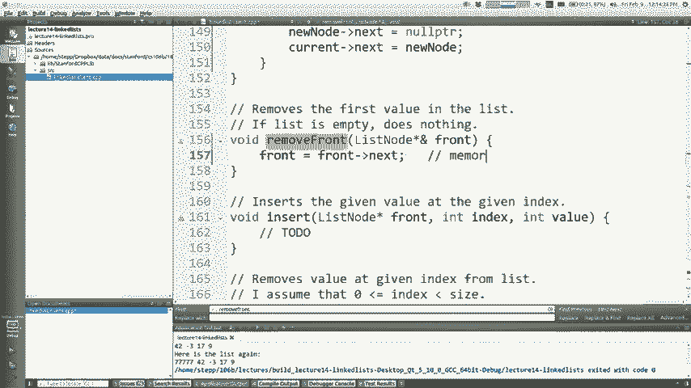

想我是我的意思是我想和你谈谈它在哪里让我看到真实的。

快速，是的，好的，我不知道我是否有轻微的动作，但是看是否删除节点。

您删除前面的节点在这里，您说我要前面指向前面，接下来像这样，那么您实际上没有指向该家伙的指针，没事了，但他仍然坐在，不幸的是，计算机mm-hm C ++会放弃这一点，程序生命周期内的内存。

它将不再可用于，任何东西都将成为无法再利用的死垃圾内存，不会，破坏您的计算机或其他东西不会破坏您的计算机，直到您，程序退出，内存将无法用于其他任何事情，因此很糟糕， Java称为内存泄漏，自动机制出现。

我的意思是你不能退出那些死掉的记忆，不被使用，他们会为您清理它们，然后以某种方式将其回收为C ++ ，我们在C ++中回收此内存的地方是存在一个名为delete的命令，如果。

您说删除它会告诉C ++您不再使用该内存，告诉C ++我不再使用该节点，将其取回，但我仍然有一个，指向它的指针，它等于我们在函数中，写作将是我们想要删除前面，但是您必须。

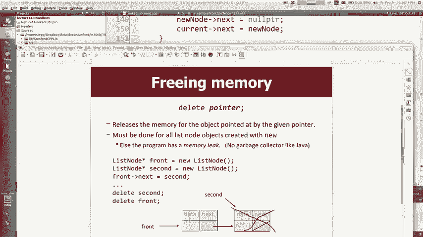

小心，因为您不能说先删除前，然后前等于前下，因为这就像我删除他后使用的是front，你知道。

我的意思是如果我想说我想去这里的第二个节点，删除前端，然后完全摆脱该节点和所有，如果我尝试说现在转到下一个，则它现在包含的信息，是我扔出去的东西，你知道吗，所以我不能删除它，然后转到下一个。

但我也无法反转顺序，因为如果我做front等于front next然后删除它会像这样移动，然后会说删除您的下一个，这将删除此人，所以，那两个是对的，所以很明显我不能选择前面的酒杯，我没关系。

这是公主的骄傲，知道那部电影如果你去洗你的公主新娘，从来没有像现在这样离开过，甚至都不听其余的，演讲，现在就去看吧，很棒，反正巨人安德烈（Andre）表现最好的表演之一，这两个订单行都不起作用。

但我们需要清理，该内存，以便我喜欢使用的模式是我喜欢保持，指向旧节点的临时指针，然后移至下一个节点，然后删除旧节点，通过使用该复制指针的节点，所以我通常只是为了真正的清晰度。

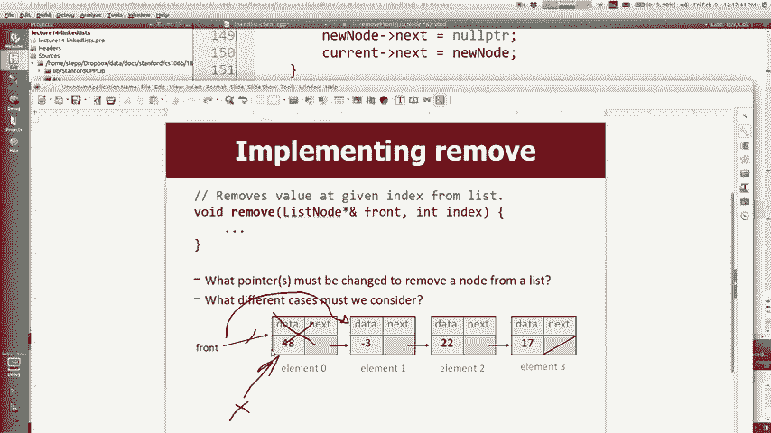

要说列表节点的垃圾等于前面，所以这是我的临时指针，我要删除的人现在将前移到下一个并删除，取出垃圾，删除垃圾，所以如果你看，部分解决方案，或者让您的示例成为您经常看到的模式，删除垃圾，以便删除主要的前端。

删除前端错误的地方是它没有在清理内存后，本身还有另一个问题，删除前面有一个列表的情况，这样做做不正确，您将了解如果，我尝试在梅丽莎（Melissa）坠毁时做坏事，所以让我们处理一下，我的意思是说。

如果front不为null，那么就不怎么做了，而是，考虑不同情况总是有用的，所以您可能会问，我想，关于零模式情况，如果只有一个节点总是情况，想一想，我想我的意思是，我只会在前面写F点。

里面有某种数据的盒子，下一个是null，所以front不是，空指针，所以它将输入此内容，所以现在我要说垃圾等于前面，所以我将，如果没有下一个，则称这里的T垃圾点等于前一个。 ，节点那行代码是什么意思。

它让人们知道的是，我想要的是我想要的，正确使front为null使前端指向那个指向哪个，什么都不是空的，现在删除垃圾，所以摆脱这个家伙，所以基本上，像这样正确地扔掉它，当我完成时，我的前锋为零。

想要正确，以便一个音符大小写已经可以使用if语句将零固定，注意大小写和if的主体是否修复is处理多个节点，主要情况一般情况现在好了，如果我们要撤回，但是您，没有时间。

因为我们会在当前的情况下使用相同的方法，会走到最后，使废料指针指向当前的脖子，围绕它并删除垃圾，这将是相同的方法，当我将所有这些代码发布在网站上时，您可以在。

