# 课程14：C++中的集合实现与优先级队列 🧩

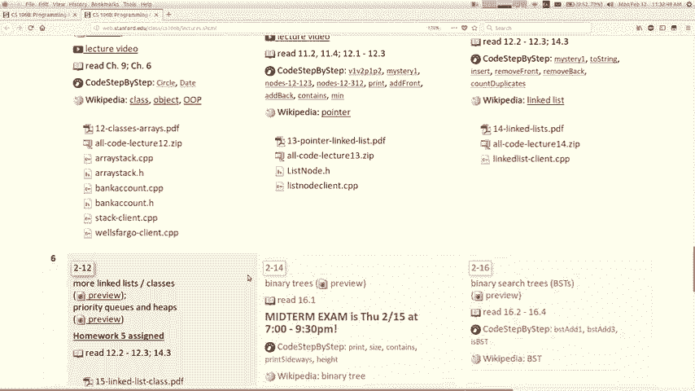

在本节课中，我们将学习如何将集合（如栈和链表）实现为C++类，并初步了解一种称为“优先级队列”的特殊数据结构。我们将探讨使用数组和链表作为内部存储的实现方式，并介绍一些关键的C++概念，如`const`关键字、运算符重载和析构函数。

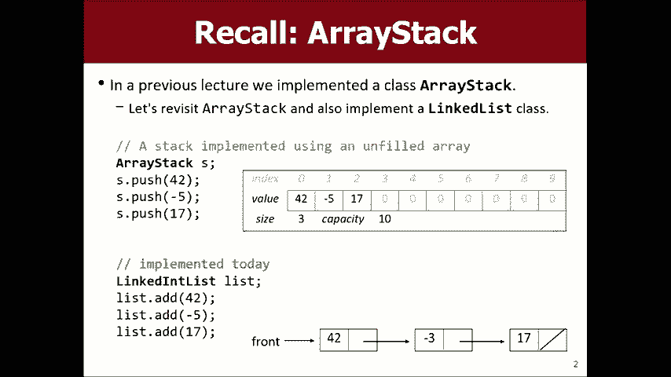

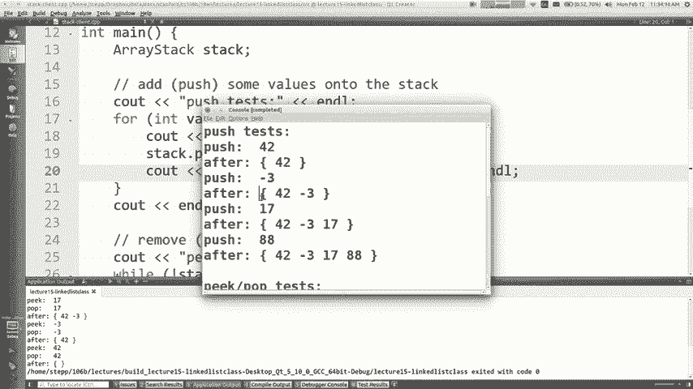

---

## 常量（Const）关键字的使用 🔒

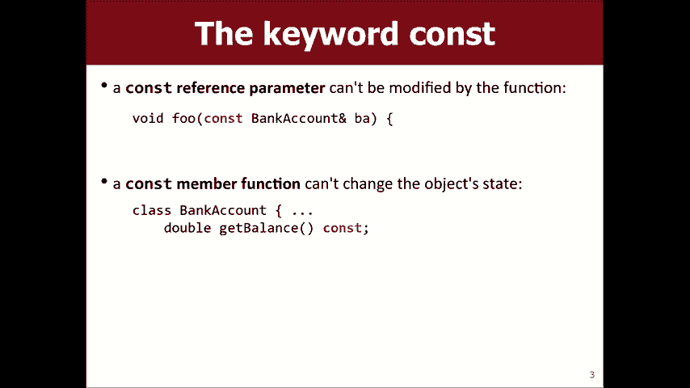

上一节我们介绍了集合的基本概念，本节中我们来看看如何通过`const`关键字来提高代码的安全性和清晰度。`const`意味着“常量”，即不可更改。在C++中，它有多种用途。

首先，可以声明常量变量或参数。例如：
```cpp
void printStack(const ArrayStack& stack);
```
这表示`printStack`函数承诺不会修改传入的`stack`对象。

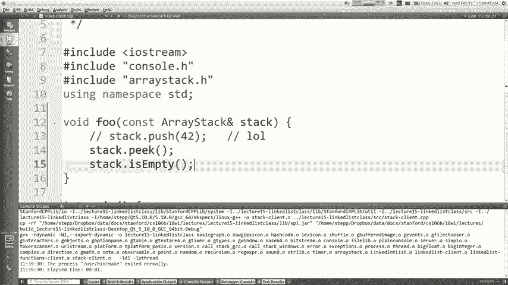

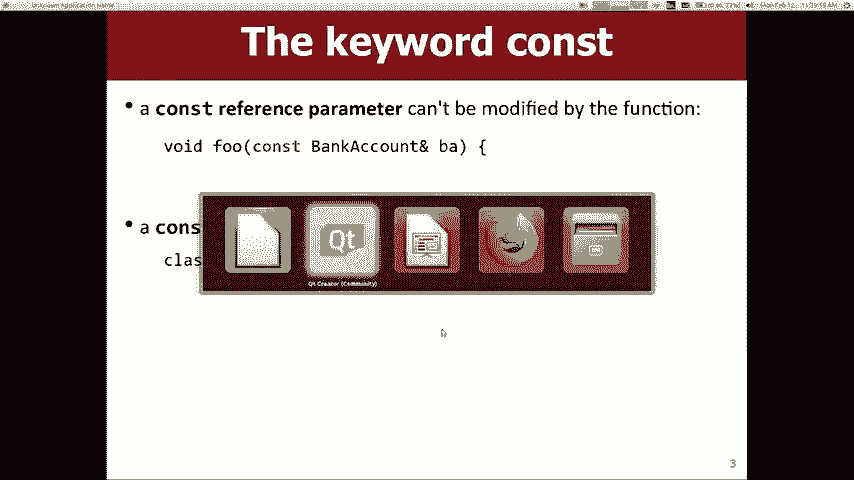

其次，在编写类时，可以将成员方法声明为`const`。这意味着该方法不会修改调用它的对象的状态。例如，一个查看栈顶元素的`peek`方法就应该是`const`的。

以下是判断哪些方法应为`const`的步骤：
1.  检查该方法是否会修改对象的任何成员变量。
2.  如果不会，则在其声明和定义末尾添加`const`关键字。
3.  这有助于编译器捕获意外的修改错误，并使代码意图更清晰。

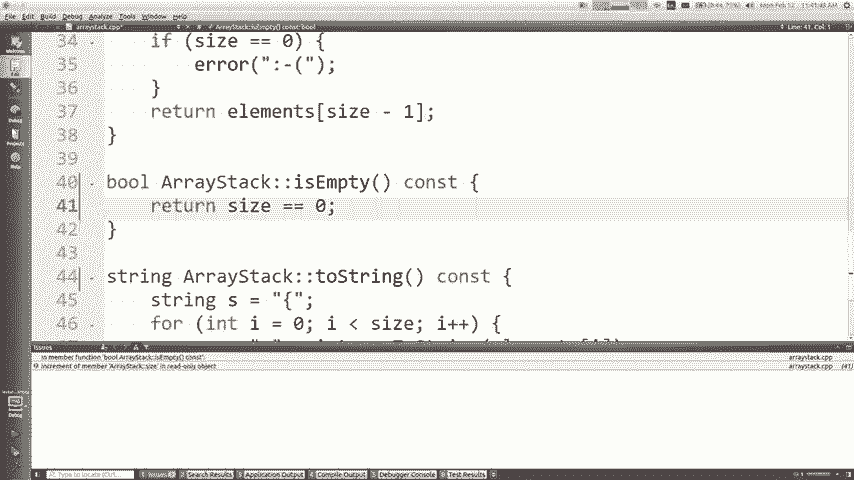

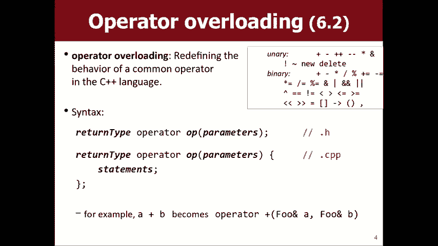

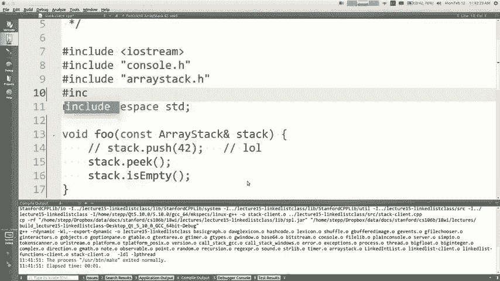

---

## 运算符重载 ✨

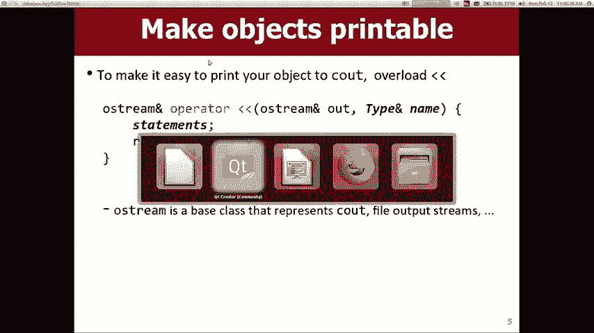

我们已经学会了如何安全地使用对象，现在来看看如何让对象的使用更加直观，比如直接使用`cout`打印它们。C++的运算符重载功能允许我们为自定义类型定义运算符的行为。

例如，向量（`Vector`）类重载了`+=`运算符，使得`v += “Marty”;`这样的操作成为可能。虽然功能强大，但应谨慎使用，仅当运算符的意义对于该数据类型显而易见时才进行重载。

一个非常普遍且合理的用途是重载输出运算符`<<`，使对象可打印。其通用语法如下：
```cpp
// 在 .h 文件中声明
friend std::ostream& operator<<(std::ostream& out, const MyClass& obj);

// 在 .cpp 文件中定义
std::ostream& operator<<(std::ostream& out, const MyClass& obj) {
    out << obj.toString(); // 或其他打印逻辑
    return out; // 必须返回输出流以支持链式调用
}
```
通过这种方式，我们就可以像使用内置类型一样，使用`cout << myObject;`来打印自定义对象了。

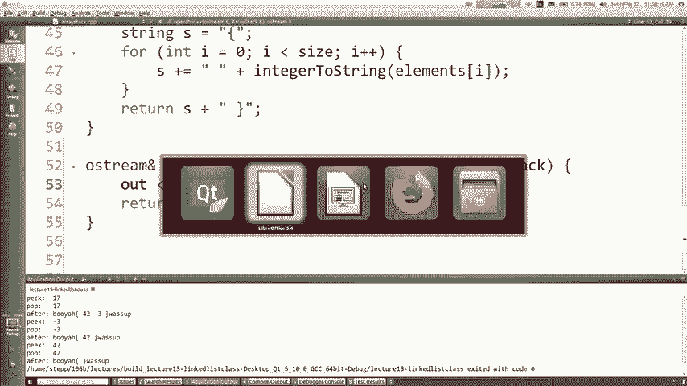

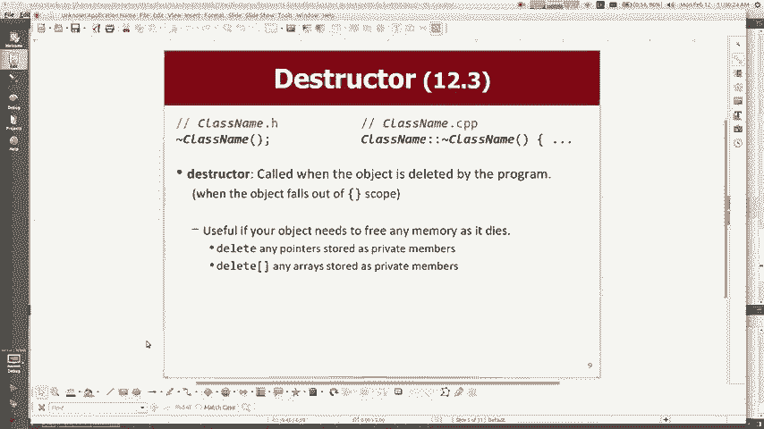

---

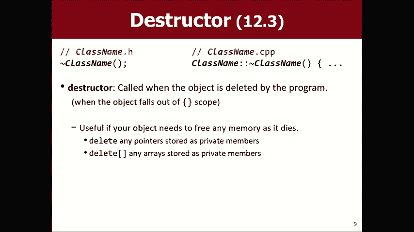

## 析构函数与内存管理 🧹

当我们使用`new`关键字在堆上动态分配内存时，必须负责在对象不再需要时释放它，否则会导致内存泄漏。析构函数就是完成这个清理工作的特殊成员函数。

析构函数的名称是在类名前加波浪号`~`。当对象离开其作用域或被`delete`时，析构函数会自动调用。

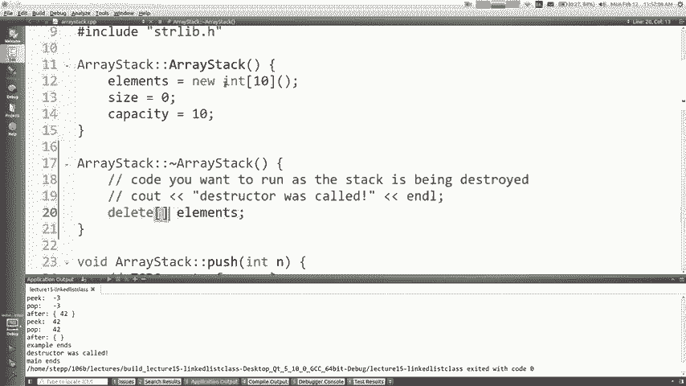

例如，我们的`ArrayStack`类在构造函数中使用`new int[capacity]`分配了一个数组。因此，我们需要在析构函数中释放这块内存：
```cpp
ArrayStack::~ArrayStack() {
    delete[] elements; // 释放动态数组
}
```
**注意**：释放数组时必须使用`delete[]`，而非单独的`delete`。对于类中其他未使用`new`分配的成员（如`size`, `capacity`），编译器会自动管理它们的生命周期，无需在析构函数中处理。

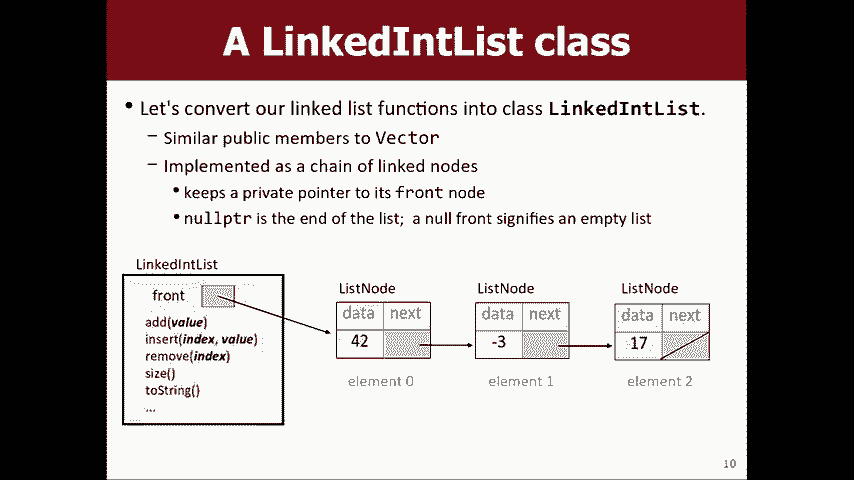

---

## 将链表实现为类 🔗

之前我们以过程式风格操作链表，需要将头指针作为参数传递给各个函数。现在，我们将数据和操作封装到一个`LinkedList`类中，这是更符合面向对象编程的方式。

在这个类中，链表的头指针`front`将作为一个私有成员变量。所有操作链表的方法（如`addFront`, `removeFront`, `printList`）都成为该类的成员方法，它们可以直接访问`front`，而无需将其作为参数传递。

这种封装的好处是：
*   **客户端代码更简洁**：使用者只需创建`LinkedList`对象并调用其方法，无需关心节点、指针等底层细节。
*   **实现细节被隐藏**：复杂的指针操作和内存管理被封装在类内部，降低了使用者的认知负担。

这就像雇用一个承包商来粉刷房子：你只需要指定颜色，而不需要亲自去挑选油漆罐和处理所有刷漆的细节。


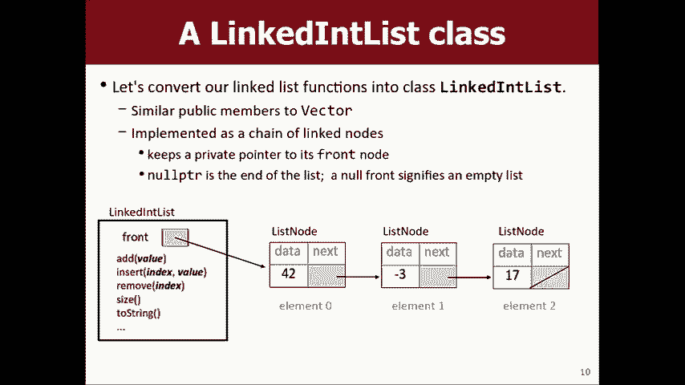

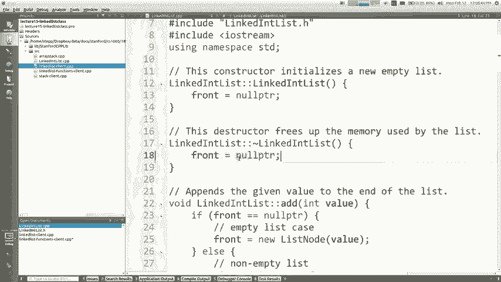

---

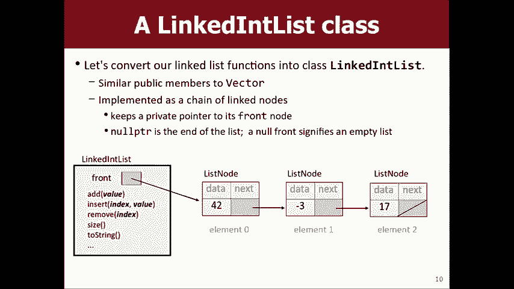

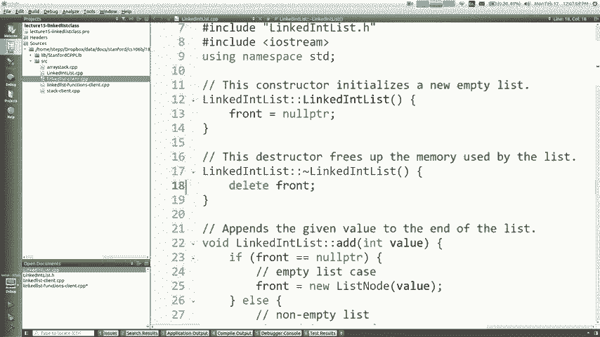


## 优先级队列简介 🚑

最后，我们来初步了解一种新的抽象数据类型（ADT）——优先级队列。它类似于普通队列，但出队的顺序不是“先进先出”，而是基于元素的“优先级”。优先级更高（通常用更小的数字表示）的元素会先被处理。

优先级队列的核心操作是：
*   `enqueue(value, priority)`: 将带有指定优先级的元素加入队列。
*   `dequeue()`: 移除并返回优先级最高的元素。
*   `peek()`: 查看优先级最高的元素但不移除。

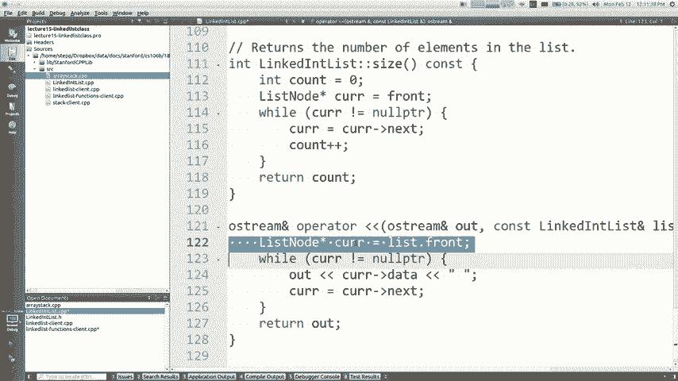

考虑如何实现它？我们可以使用：
1.  **未排序的数组/链表**：入队快（直接加在末尾），但出队慢（需要遍历查找优先级最高的元素）。
2.  **已排序的数组/链表**：出队快（优先级最高的在头部），但入队慢（需要找到正确位置插入以维持顺序）。
3.  **堆（Heap）**：一种特殊的树形结构（通常用数组实现），它能使入队和出队操作的时间复杂度都达到高效的 **O(log n)**。这是实现优先级队列的经典且高效的方法。

在后续的作业中，你将会实践使用不同的内部数据结构来实现优先级队列。

---

## 总结 📚

本节课我们一起学习了多个核心主题：
1.  使用`const`关键字来保护数据不被意外修改，并明确方法职责。
2.  通过运算符重载（特别是`<<`）使自定义类更易于使用。
3.  利用析构函数管理动态分配的内存，防止内存泄漏。
4.  将链表封装成类，隐藏实现复杂性，提供清晰的客户端接口。
5.  初步认识了优先级队列的概念及其不同的实现策略（未排序/已排序结构、堆）。

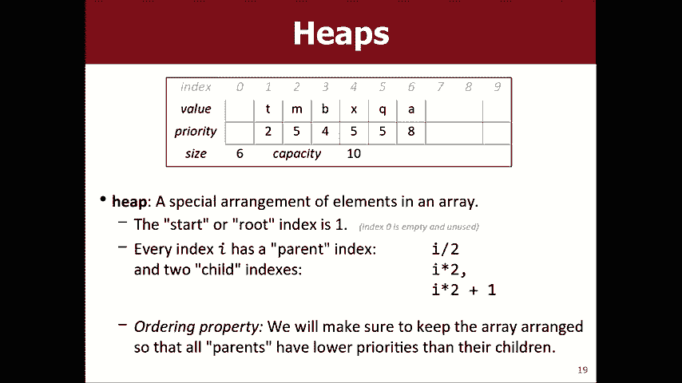

掌握这些知识，你将能够设计出更安全、更易用且更高效的C++自定义数据类型。