# 【斯坦福大学】CS106B C++中的抽象编程 · 2018年冬（完结·中英字幕·机翻） - P15：【Lecture 15】CS106B Programming Abstractions in C++ Win 2018 - 鬼谷良师 - BV1G7411k7jG

我想你们可能知道我们的期中考试是明天，那是我们今天在哪里，中期是明天晚上，请在这里取消我们通常的部分，尽管某些部分，领导者正在与自己的学生一起进行评论，是的，是的，是的，他。

问了一个很多人可能会想到的问题，他说你告诉我，如果我来上课，你会给我一些正确的东西，我记得我，记住这一点，但我告诉你每天都有什么人站在后面，大约30秒钟后，因为他们正在等待，所以我要。

大约15到20分钟就可以给你，所以如果你在这里，坚持下去，如果它已经过了一半，我还没有给你，那就像在向我摇晃，向我招手，就像嘿记得你在做什么，说我会给你，我会很感激你在这里所以不是。

我上课时只是动物图片，我保证，明天再看考试，晚上，我知道你们专注于您的压力， ，广场上有很多很好的问题，询问期中和实践，问题，如果您有问题，我们会尽快开放，关于事情，所以我今天要谈一点考试。

尽管我的意思是，我认为，一般来说，你们有一段时间的学习主题列表， ，在实践考试中查看，所以本次讲座不是期中考试，但我会讲一些关于中期的东西，我也会讲一些，今天有一些新资料，但我知道您根本不在乎，因为。

这不是您现在关注的重点，所以今天我的封面，我今天涵盖了所有新事物这一事实是基于以下几点： ，我的意思是说，如果您使用的是四分之一系统， ，没有太多的讲座，所以你不能只是丢掉它们，我必须，总是保持前进。

我必须继续覆盖新事物，以完成所有任务，我需要在星期一教你一些东西，所以我们得到的讲座不如本单元那么多，涵盖所有内容的材料，我也知道你们那里的人有钱，他们星期五要抛弃我，因为你星期四晚上参加了考试。

他不会在星期五出现，所以我觉得我会想念你们很多，虽然如此，无论如何我今天还是要覆盖一些东西，我们今天要去的地方是，我们仍然会在，星期五，如果明天晚上考试后您还剩下什么，那我该怎么办。

首先要做我今天想做的第一件事，问题和办公时间，而美国国家航空航天局（NASA）就是关于这个话题，叫做Big O ，重新整理一下有关该主题的内容，因为我认为可能是，有用的，还是一个小技巧，无论如何。

看到我明白了，这不是最后一个技巧，我会在另一个技巧中，谈论它的大O主题我没有涉及很多，我没有很多，讲课时间来详细介绍它，所以有意义的是。

令人困惑，所以我将一直讲到幻灯片5 ，来自第2周，所以我想谈谈Big O的一般想法，是您可以假装它们各自采用的单个代码声明，一个单位的时间来执行，因此如果执行的for循环为十，重复。

也许我们会说循环执行十个语句，或者如果for ，循环主体中有五个命令，它会重复十次，也许是for循环，执行十乘五等于50的语句，所以我们假装有，语句需要的这种基本原子的一种执行时间单位。

为了现在写那是不正确的，这不是真的，不同的陈述需要，不同的时间量，但是如果您愿意的话，这是一个很好的起点，要将现实生活的所有复杂性归结为它，它变得非常复杂，快速。

所以让我们假装每条语句要花一个时间来运行，假设如果您调用一个函数并且该函数中包含n条语句，则，函数调用需要花费一些时间，因此即使，如果函数调用中包含for循环，则函数调用为一条语句。

则调用该函数的代价不是一个，而是所有重复，函数内部的代码，这就是，在我们的小世界中调用一个函数，我们生活在重复中，乘以那里的事物数，例如，如果有一个函数，其中有五个语句，我编写了一个for循环。

该循环十次调用该函数，大约需要50个电台才能理解，所以像这样的模型，如果您有一个if-else语句，则住进去，如果它进入， if和if语句数量是否在else中， else中的语句只执行它实际执行的语句。

所以这是，有点像草率的代码执行模型，所以看一下测试，可能会给您一个问题，您可能需要在哪里做类似的事情，正确的，这是什么运行时间，所以我会问很多这些问题，有一个名为N的变量，我不告诉你它的值是多少。

这是一个整数，这个想法基本上是相对而言，结束它是一个正确的变量，所以你知道夫人。循环将是n次，那是身体的n倍n倍，所以身体有一个陈述是n倍， n乘以1，身体得到四个陈述，是其外国咒骂的n乘以n， 。

所以这是显示这些类型的事物的一般方式，现在这些都是非常人为的代码，但我实际上是在尝试做，是让您能够查看您的代码并说哦，我正在遍历我的3 ，我正在做，我正在做，哦，那要花这么多，要执行的语句。

我希望您对此有大致的了解，现在好了，我们从中学到的东西，谈论Big O是很多情况下，运行时仅在，处理大量数据时，您的算法可能有点草率或，如果您仅处理10个学生或数据库的10条记录或，这样的事情。

但是如果您要处理一百万个，无论您是在浪费每条记录的时间，十亿美元都变得越来越重要，学生们每双滑雪板都好，所以我们谈到了如何将数字变成喜，玫瑰正是我们更加关注的事情，您知道您可以衡量。

任何您可以运行一段代码并启动秒表，然后停止，秒表，您可以说花了5秒钟或类似的时间，但是，这是非常有缺陷的，因为我的计算机可能与为您的计算机供电时有所不同，可能会给我更多的处理能力，所以这与绝对值无关。

给定人员的一段代码量，在今天的游戏中，相对而言，如果我，使输入大小更大需要多长时间？ ， Alber的运行时间和作为输入单位增长的增长比例是多少，在这两件事之间，什么是计算机科学家认为的。

关于代码运行时最有趣的话题，所以我们来谈谈，关于它的增长率或算法的复杂性，好吧，计算机科学家决定的是，您不需要获取，过于挑剔，几乎没有什么价值和细节，您应该专注于，输入大小与运行时间成正比，因此您知道。

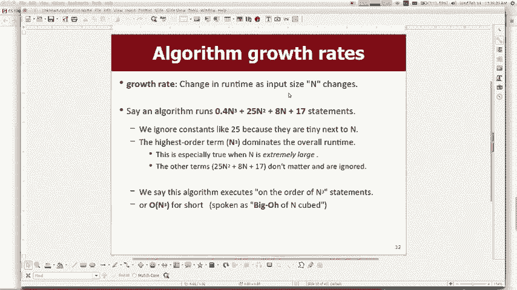

如果您的算法的零点是四点加，它将使您找到的结果运行，是因为n真的变得比那个表达式的第三部分大，是最重要的部分，因为如果n为一千，则n ，第三是十亿左右，所以这十亿完全使任何，在该表达式中。

n的次幂数百万或数千，因此，就像我们作为计算机科学家团队所决定的那样，我们将，简化这些日子，使其更容易讨论，但扔掉，所有较低的幂并且丢掉任何小常数，它几乎没有倍数，倍数或倍数，因此最终状态全丢了。

大约进入第三个，确保零点进入到30s不同于进入，第三点是不同的，如果你指出了另外四个节奏和一个，一种算法，与第三种算法成比例，我们俩花费的时间不同，但是兄弟的增长是什么。

我们很在乎这就是我们所说的运行时间，花费了很多陈述的顺序大约是第三，语句运行，我们说n的阶次为第n个阶，所以我们称之为，喙哦，对了，所以这才是真正的重点，就你们而言，我想向您介绍的原因是因为您。

知道我们关心效率我们关心好的算法，正在做很多使用集合的代码，并且该集合，如果您以错误的方式使用集合或选择了错误的代码，集合来解决给定的问题，这实际上会使程序变慢，你们在写一些家庭作业时已经看到了一些。

作业也是如此，所以我真的只想让你拥有那就是，最终目标是很好地了解如何制作算法，所以，就像这些不同集合的某些方法和功能一样，他们需要执行才能运行的大运行时，您知道我们在说什么，需要花费固定时间的事情。

例如在最后添加一些东西，向量的时间是恒定的，因为您不必移动，您周围的任何事物都只是放在最后，它是在快速寻求价值，获取值或在给定索引处设置值也很快，所以我们，说花费固定的时间，我们说基本上需要一个单位。

一次，但是任何可能需要循环很多次的操作，我们说很多价值观都需要花费时间，因为它是成比例的，到向量的大小a花费所有时间将所有元素转移到，的n个元素，所以现在在这种情况下，您知道我认为。

幻灯片中我有一个名为M的变量，之类的东西，现在我的向量大小是n，因此，像您正在处理的东西之类的东西，或者现在很多的东西，的学生也会感到困惑，好吧，您插入了前置向量，需要n倍的转换才能最终得到它。

但是如果您像这样插入，向量的中间，我们还要说一半，事情按n的顺序排列是因为如果您将n加倍， ，做了什么小静脉，所以如果我改变输入大小，只要n是n的一部分，更改将是n的百分之一的运行时间。

该表达式由于其增长与n成正比，所以不要，在中间考虑太多，到底是不是在最后，例外情况是，如果您恰好在最后插入它或喜欢，一个或两个元素远离最末端或类似的东西，然后，只需要一两件事，而不必真正改变任何东西。

因此您，知道我在你的中期学习表上给你的表上有，这些大方法可以解决所有这些问题，但是有一个明显的例外，如果您碰巧正在处理列表的最后一个实际上是Big O ，其中之一是因为它并不需要真的运送任何人。

这样您就可以观看，反正一点点，这实际上归结为，您必须在我向您显示代码的地方回答问题，然后说什么是大O ，这段代码，所以您必须首先了解集合方法，而且您必须先了解这些规则，例如是否有循环。

如果您有一个函数调用，该怎么做，并且如果将所有内容组合在一起，应该能够了解不同事物的运行时，所以我将跳过此幻灯片，但是我的意思是这张幻灯片的要点是，大O算法更糟，花费的时间真的非常长，您不希望这样做。

因此这里有一些示例，涉及Big O的代码，这是我的工作，我要你明天中期做，所以像这个第一名，看起来像那些在大厅里的时代吗，是的，他们上来的只有一个，单曲时间[音乐] ，因此，如果他们走了。

那么第一个for循环，第二个for循环，我在，我要移走的时候，我可以做一个妓女吗，另外一个是整体，他们执行了整个代码，所以有人被绊倒了，您会看到两个for循环，很多人都说哦，两个for循环都可以。

我们不相乘的土匪，其次是另一个加号，如果我只是这样做，您就喜欢合并此文件，然后，实际上是两英寸，所以先将小片切碎，脖子基本上是一个人，所以他需要我进去，所以我们有，首先带我去了，除了时代，那仍然是男人。

我们还有一个问题，所以有时我会用，不会直接说结束的表达，但您应该能够说出，这就是要做的事情，所以你说如果我相信外面的这种需要，而不是一次，但是如果我的第一个或循环甚至有一个特定的，您曾说过。

如果它的第一部分从0到n次扇动， ，这意味着要重复任何时间的平方， ，集合是N平方的，这意味着第一个for循环将是，上升，所以我认为如果我们在“是”中找到，它将翻两番，代理机构30说不递归怎么办。

如果我有递归功能， ， 1190很大，而参议院的召唤总是很难为之思考，您很痛苦，我保证我不会再问您有关Big O递归的任何问题，足够棘手，您必须用完全不同的理论来学习，类调用递归关系。

您将了解递归的原因，运行时之战我不会问你，但是如果你需要我的话，打电话给每个人都可以工作，这将是很好的平方，所以这，正确，如果我将2x-1-x-3移开，只要Tracking的手指已经，什么都不做。

那么元素的数量应该是常数，元素，所以我的意思是我知道我可以让你最后知道它的背面，与其他任何地方，并缓慢，所以我不会去镍约你37 ，几小时后，您知道我是否可以再问一遍第二个代码，在水平线下面。

我做了一个向量n次，先生，嗨， ，然后我清除了这个插入所需的时间， ， N平方大二人组的大O更多这是一个组合，你会很好地说这是怎么回事，我不记得的一套很好，我的意思是你可能不得不看一下你的大。

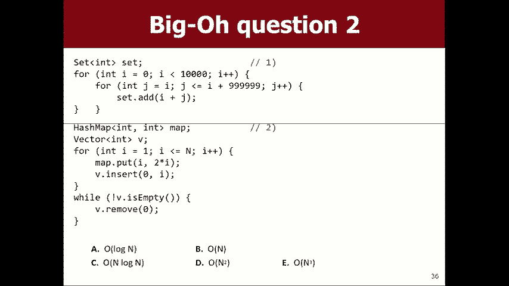

 o抬起手，我将回到幻灯片上一秒钟，我必须跳一下。

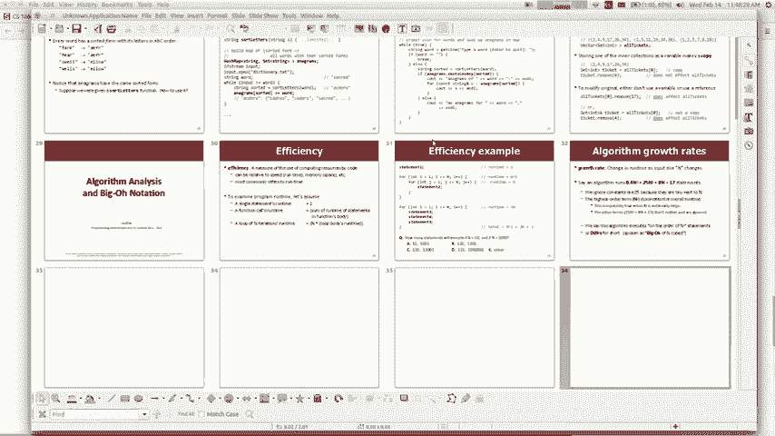

第二个um我们了解集合和映射集合的大部分日志都是大的，关键操作“添加/删除”包含一个哈希集，其中大多数，如果您在记忆中有困难，可以将其常见的包含操作删除，不用担心，它在备忘单上，在语法讲义上，在，好吧。

如果我知道那是真的，我是说我有一些学生问我喜欢，那么为什么N的对数和简短的答案是我们要学习，详细介绍如何实现这两个集合，然后您将知道，直接说明为什么它是log n的大O，这与重复切片数据有关。

分成越来越小的块，直到找到要搜索的内容，我将向您展示如何尽快执行此操作，但现在我们只需要知道。

如果知道的话，就是这些操作的运行时间，然后返回到，我们正在谈论的大O问题，如果我有一个问题，我们会在这里， [音乐] ，还是有点正确，这无关紧要。

所以我做了一个叫做awesome的变量并接受了2000的awesome ，从零到棒极了，是的，但不是没有看到运行，那么，如果这些循环在N或某个希望的地方，而所有这些顺序都在。

我们可以将代码设为n个平方律的眼睛，恒定的最大值邻近贝克的相似的最大值，可以很好地结束我的意思是n是可以确定的数字， n真的很小，因此代码不会花很长时间，但是整个过程。

大O就像如果n真的变得非常大会发生什么，那将是，整个直觉，我们试图与这最后一个他妈的，然后我们将移动，如果我们有一个哈希图和一个向量，有时我在，哈希图，然后在向量中插入一些内容，然后循环播放直到向量。

是空的，元素不在矢量中， [音乐] ，开始远离这些东西，为什么不+并在底部，循环，唯一的消失，所以实际上我一开始就在做任何插入操作，这意味着总体上，丢失视频和正方形，然后我循环播放，直到它变空为止。

我们从，开始，好吧，所以它是N平方，然后是N平方的整体兴趣和平方见，如果这是过去的话，你们现在会准备好了我知道一个问题。

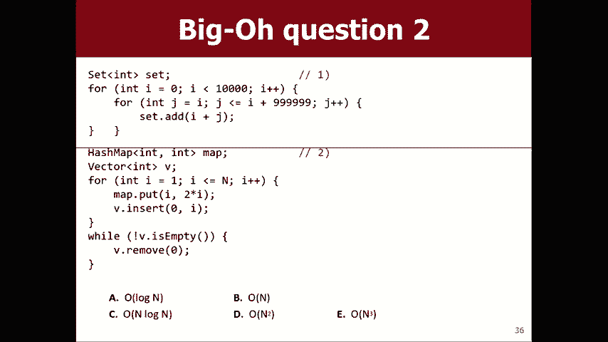

问题是这是否只是一个常规映射，那些方法的运行时间很长，所以，如果我现在确实放在这里，这就像log plus和log n plus n，所以现在，你怎么做的日志仍然比常规日志小，而且小得多，实际上。

所以我们只是忽略它，如果它是乘法的对数是否是加性的， n乘以n，则为n log n，但如果它是像这样的顺序相加的，然后最大的一个吞下较小的一个，哦，是的，我的意思是说如果Elsa是我们的我不。

我也不会试图欺骗您，还有很多其他原因，因为就像Elsa只是将，它进入哪个分支，所以您知道我是否执行了类似的操作， 2是零，然后做地图1否则做向量或类似的东西，所以现在一半时间在做地图，一半时间在做地图。

向量的东西，就像半个N平方的东西和半个n对数对齐，这是，它会以相同的基础出现我不知道，所以只需要运行时间，不管它进入哪一个， papito每次都放弃这里的决定，因为为了插入，在那里。

我只是将所有其他元素滑过，这样我就可以适应，取代连接我们自己的东西，它将其他人移交给妈妈免费，如果我说上帝要更好地对我说零告诉你，只需修改该位置，使每一列的常量都可以。

就像如果这次测试的电话要花很长时间，那么每次通过，通过循环，必须再次进行测试，再次进行测试，因此，您必须在运行时计算中考虑这一点，我可能不是，会让你这么做的，因为那比我给你看的要棘手或棘手。

关于示例问题，但是是的，我的意思是，您知道测试的时间了，进行循环测试所需的时间大部分是循环运行时间的一部分，我们运行的测试通常是快速对象，例如，我小于n是否是此向量，空是一堆空的东西。

我觉得你们想要另一个，只给房间里人的秘密小提示好吧，这就是我认识我妻子的方式。

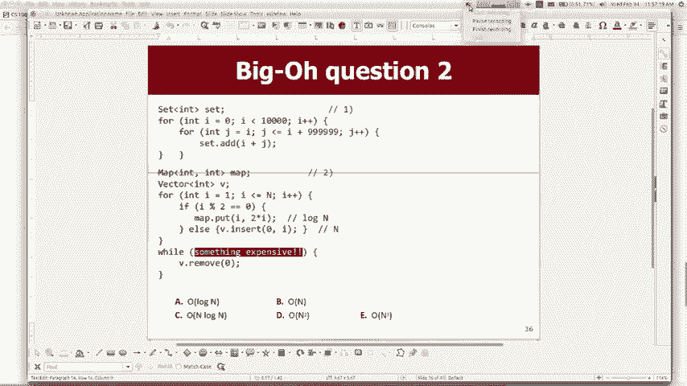

可以，然后呢，好吧，我知道这是有史以来最严重的转折，但我想谈一谈，在几分钟内谈论一些新东西，我知道那不是你的头在哪里，现在就可以了，但这是我要做的，如果不是。

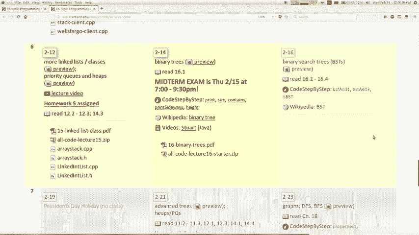

你要做什么，然后我不知道我不能强迫你，但是等一下我，不想在哪里我不，我不想要这个文件我，想要一个不同的东西，所以我想告诉你下一步我们要去哪里。

下一个高级材料将是关于一个叫做，二叉树与我们刚才讨论的其他内容并不完全无关，这是因为我们与您如何有效实施，设置我们谈论的是那些方法来自其中的一些或如何，我们可以高效地实施这些事情，我们学到了很多。

链表和数组，如何实现向量，如何实现，实现一个堆栈并排队这种东西，所以这是我要诀窍，教您继续使用它来实现集合，因此树是一种结构，用鼻子做成的，最常见的是我们谈论每个节点的二叉树，有两个下一个指针。

我们不真正地将它们称为下一个，我们没有或全部，我要去的企鹅下一个左指针和右指针，指针看起来有点像他要画的树， ，树必须计算的属性，例如有向叶的对称性，这个-链表，以及您从自己转到下一个列表。

去网络也是一个根节点，你可以用递归来描述根节点，定义一棵树为空或它是具有一棵树和一棵树的节点，在它下面，您可以形容这并非巧合，递归结构，因为基本上从您的人的角度来看，树是，指针的混合听起来并不很棒。

就像两件事一样，您在本课程中最享受的是我选择相信的，这就是我选择认为您对此有想法的方式，这就是一棵树，再来一棵树将是我们将用来实现粗糙集的东西，想法是，您将在左侧存储较小的内容，在左侧存储较大的内容。

对，当您搜索事物时，您将向左，向左，向右，向右走，根据您需要变大还是变小找到它们，这将，使您可以快速找到一组目标元素值，我们将立足于人们做很多事情的想法，计算机科学中的树，您可以存储家族树。

您可以存储目录，您可以存储字母树来存储您在手机上键入的单词的树， ，自动完成基本上就是一棵树，以这些字母开头的单词，并暗示可能的单词，如果您正在编写编译器或编程语言，则为输入内容，编写树来处理表达式。

这一次再加上一次，就像一棵运算符和操作数的树各种各样的东西，像那样，在人工智能决策树中大量使用，您的算法需要做或考虑一下，所以到处都是树，他们是超级骗子，而且实际考虑的是。

面试工作面试有关实习和他们喜欢的东西的问题，二叉树编码问题，因为如果您可以这样做，您只需向他们证明，你可以做指针，可以做递归，所以他们应该，基本上雇用您，所以这可能是您想要的主题。

为了从这门课程变得很棒，我在这里有一个像巫师的问题，这些是有效的，哪些是无效的？ ，这些无效的树，只是有人举起你的手，这些不是合法的二叉树，是的，你说五号是什么，错了，不是周期性的，它可以追溯到开始。

它可以回到顶部，是的，是的，其他任何非法树木都可以。 ，你知道我想我昨晚说过，你可以使用二叉树，好像，代表家庭，尽管如果我们的例子不能很好地工作，这样做是因为您可以让两个父母一定要指向一个孩子，但是。

好的，不，是的，有点主意，好的，这里有一些，术语向您抛出了很多术语，树的每个小元素都是，一个节点，但这是我们谈论叶子列表时使用的相同术语，链表中的某种起始节点，您称其为起始节点，并带有一个。

我们称之为二叉树的根源，我们有很多类似条约的条款，它们被称为子树，您分别是左子树和右子树，这些站点上您下方的节点以及读者第二层的孩子，树中反叛者的总数称为树的高度，有趣。

因为我刚刚谈到了如何使用集合来实现树，只需在树上往下走，直到找到你要的东西，搜索，因此树的高度与运行时间有很大关系，处理树的各种算法，但您知道我们稍后再讲，我想无论如何，如果您愿意的话。

我会开始使用这些术语，用一个你不记得的词，只是对我大吼，我会提醒你，这意味着什么，所以您可以使用C ++对象和结构来实现树，我们将编写一个称为树节点的小结构，用于存储一块，数据。

指向左侧的指针和指向右侧的指针，就像我们有一个，小列表节点，存储了一条数据和一个指向下一个节点思想的指针，您可以存储所需的任何类型的数据，但对于初学者来说，我一直很喜欢，从intz开始。

因为我认为蚂蚁是这种最简单的类型，可以存储，这是一个树状结构，我已经在这张幻灯片上花了很多时间，它只是一个包含数据的三个节点，我在右边的指针上可以，构造一个，然后您可以问一问是否是一片叶子？ 。

在两个null的右边，所以它就像带有某些方法的结构，大部分是在我向您展示方法时，它们已经在类中，但是，结构也可以有方法，所以所有的数据就此左右，事情就是这样，如果您想使用它来构建一棵树，这就是。

看起来糟糕，我在做什么，这为什么我，所有这些旧文件都打开等待我不想让这不安全等待，哦，这是讲座二叉树，好吧，我不知道那里发生了什么，所以这是，如果您想构建我在ASCII艺术中粗略绘制的那棵树。

你会说根存储左9个根，子存储右6个根，子存储14，然后左左为负三，左为右，你知道吗，你能看到这些线条基本上是如何建立那幅画的，我在这里没有null，因为树节点的构造函数设置了，子项自动为空。

直到您更改它们为止，以便使后四个，知道在十九号中有三个他们的叶子全都是空子，好吧，所以你知道我是否说过root root right right right等于new ， 88的树节点。

因此根右上左右将是88，因此向下，在这里，你知道我的意思，所以我会买一些昂贵的好东西，这是我的妻子远程向我发送情人请求消息这是什么，给我买些昂贵的东西，亲爱的，我想那会在这里，就像， 88就在右边，哦。

您能否拥有三个分支的左能量和中能量，所以我确定，您几乎可以做任何您想做的事情我们将要学习的大部分内容，向前是有两个子树的树，如果您有三个子树，则称为二叉树，我们称之为三元树，您可以拥有四棵三元树。 。

有多少个孩子，但是我认为很多概念可以概括为，可以用两个做，可以用三个做，可以用四个做，你会看到，就像大多数整洁的东西，我不知道我是不是向你展示了。

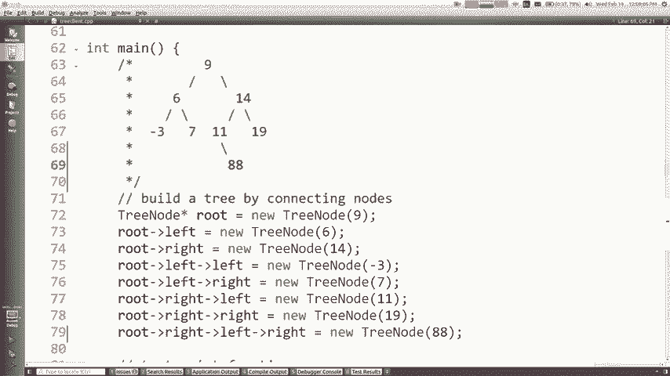

人们为什么在这里和这里使用树木或其他东西的原因类似的幻灯片，以及，我还说过我们将用它来实现集合和东西，我猜，我要说的是，如果您有能力一分为二，这是非常强大的功能，然后从那里添加拆分为三个功能。

并没有增加太多的功能，所以我认为我想获得的好处是。

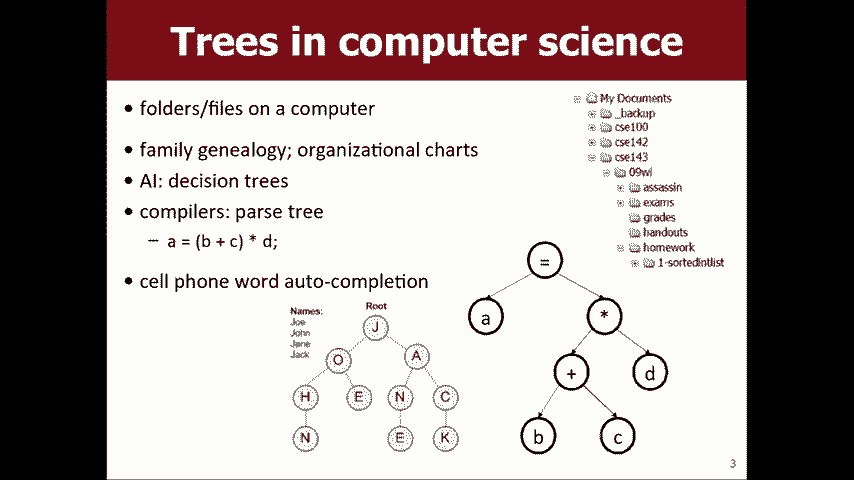

有两个孩子还可以，尽管这是合法的，但如果您有可能做更多的事情，无论如何还是需要一棵树，所以我做了一棵树，看起来很多，就像我们上周制作列表节点链接列表的代码一样， 。

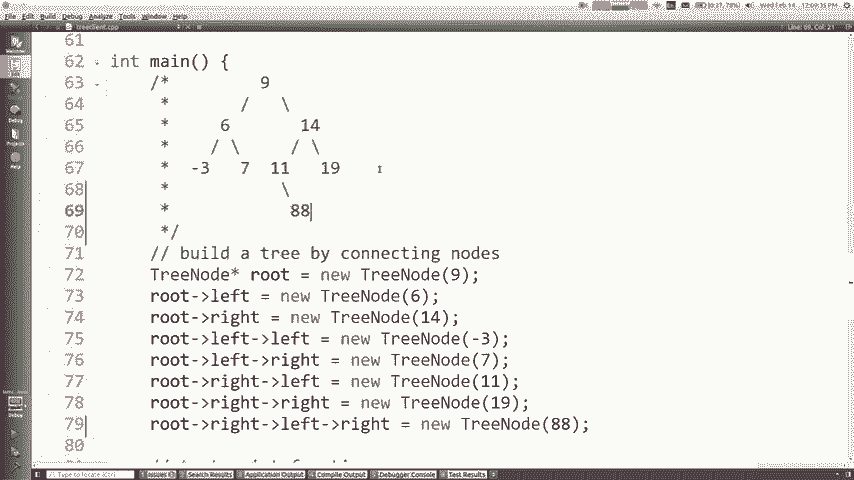

好吧，我在哪里，所以想象一下我有那些放在最后一个节点上的节点，幻灯片，我想编写一个打印整个树图的函数，树上每行只有一个元素，所以它打印我不在乎我的顺序，不在乎订单，而是想要的订单， 17：

14这就是如果我们必须写我在这里说的代码的事情，除了，树指针作为参数，所以您知道我们使用链接列表来完成此操作，链接列表的最前面作为参数，因此应该看起来很漂亮，类似于该权利，好吧。

让我们看看这里我想编写一个函数。

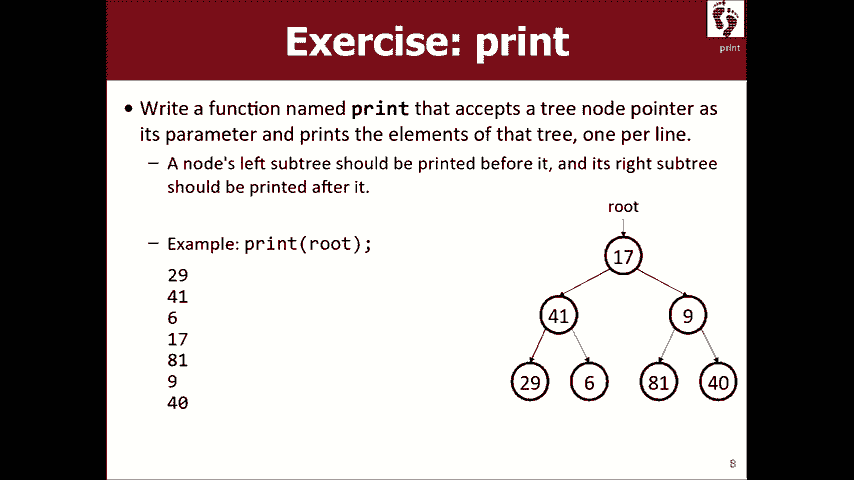

叫做print，它是您过去的根，好吧，让我们进入那里，我的意思是，空的，我们还没有写，所以再次提醒我，当我们，打印一个链接列表，您如何喜欢在元素中走动以及，看看他他在做什么，是的。

就像临时指针或当前指针一样， ，说虽然不为null转到下一个转到下一个转到下一个所以看起来，这样可能是正确的选择，所以也许您说树节点，当前等于节点，然后当当前不为空指针，然后。

而不是当前等于当前点下一步您会离开，你突然做的对不起，我希望你能看到这有点，棘手，因为您需要左走，然后右走，链表很简单，因为它是线性的，只有一个下一个节点，到但现在我们必须去其他两个地方。

所以我该如何循环，我现在做一个电流，Curt将它分成两个电流吗，指针，然后那些必须指向儿童的指针，我必须分成四个，当前，您是否看到这比仅打印出一个链表更加棘手，好吧，我早些时候告诉过你一些事情。

你可能现在还记得我说过，树是关于将指针与递归混合在一起的，所以这就是，可怕的更好的方法是不修剪树，而while递归循环，如何。

递归是否可以帮助我们很好地解决这个问题，让我们回到所有，学会了死刑并复发他说，是的，我会给你一个，第二个简单的turbo我们将得到两个基本案例，但是如何打印出漂亮的，就像在其他树上弄怪一样。

如果我在那棵树下找到那个点，很自然很容易阅读其他东西，他会带我们扎根树木是一些条约是非常自我的基因，这就是波斯人所拥有的类似权利，所以我喜欢任何其他方式，想想递归，如果我有一个神奇的功能可以。

打印除我以外的所有其他节点，如果我愿意，则打印与我自己有关的所有内容，不，你不知道，如果我有这样的功能，这个问题会真的。

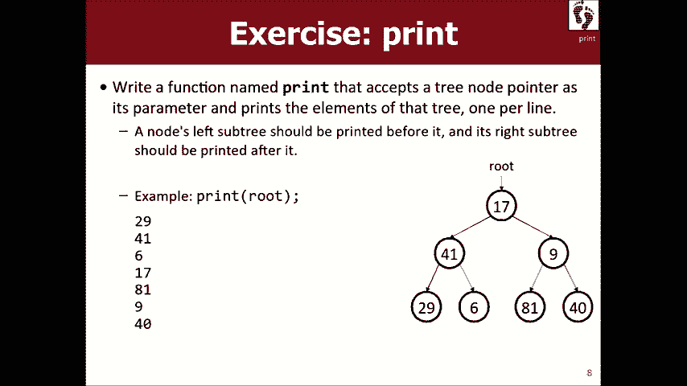

很容易，因为我会做的就是说好吧，让我们看看我有一个，神奇的功能，所以我会查看节点数据Endel，然后将其称为，魔术功能，我会通过我的左边，我会调用魔术功能，我会通过，我的权利。

所以神奇的功能将打印所有其他人，我会，打印自己，如果我们拥有神奇的功能，那将会很棒，但是，当然你们已经足够多的时间看到了这个技巧魔术功能是我，我是神奇的功能，力量就是您的力量，如果我只是让您大吃一惊。

那您应该先在人下学习一些，但我教给你的东西至少对，这是什么基本案例什么是易于打印的树是的叶子，听起来很好，所以叶子是没有任何子节点的节点，所以我想基本上你不想我走到左边如果左边没有，正确，例如。

如果node left不为null，则打印左侧，因为我不想，如果我走得太远，则会在空节点上调用该行，这会导致我的崩溃，程序确定，然后如果权利不为空，那么打印权利，让我们，看看它现在是否正常工作。

仅供参考，这是我们拥有的树，哦，天哪，我上课之前没有编译它。哦，不，我要输五分钟，哦，我从来没有想过我会看到我的学生会说为什么来的那一天，我的C ++比我的Java慢得多，这是颠倒的。

当人们说我从来没有这样的事情时，树，好吧，它崩溃了，但是稍等片刻， 9 6 negative 3 7 14 11 a它打印了所有节点，对，我们做到了，这么聪明，你会摇滚这个测试，我知道。

我想我们可以做一点，更好，因为我真的认为我确实希望您学习该课程，关于递归的问题是您应该尽可能地懒惰，它与称为“臂长递归”或“ ，递归Zen就像找到最真实的基础，不，不，你做什么，只是不。

正确打印任何内容，让我让我为您修改此代码，我会尽力指出这个代码是可以的，确实有效，我猜它有一个小错误，如果树的整体根是， null会崩溃，因为它尝试打印，空路由的数据，但是没关系，那没关系。

但我真正希望您理解的是，这段代码是一臂之力，递归，这不是最好的方法，这将会出现，一遍又一遍又一遍，当我们谈论二叉树时，你应该总是，首先考虑空情况，如果，传入的节点为空指针，那么您就知道为空null 。

节点无所事事，如果树为空，则不应该打印任何内容，但是，否则我应该打印它的数据，就这样，可以，但是我不再需要这些测试，因为如果左边为空，如果右边为null，它只会调用并执行此操作，所以我可以，这样说。

实际上，如果您不介意，我宁愿我不喜欢空树枝， if-else的原因，为什么我不说节点不为null打印它就打印它，左边是对的，代码是更好的，我比其他人更喜欢，一个是因为另一个有两个if。

而这个仅需要一个if ，我认为递归代码的一个好特性是，您只专注于自己的事情，而不关注下一个家伙的事情，不用担心，下一个家伙是否为null或左侧是否为null或是否担心，关于您是否现在不专注于自己。

如果您不太清楚这是，仍然要首先工作我会运行它，所以您不要认为我疯了，它确实打印了里面所有不同元素的树，因此可以正常工作，首先，但又像您知道笔记不为空一样，打印您的数据，然后继续递归打印您的左侧，这可能。

为null的情况下，它将立即退出，或者可能不为null ，它会打印一堆东西，然后为正确地做同样的事情，我们编写的大多数二叉树函数都有一个优雅的Zen ，这样的解决方案，他们将有大量的ifs。

否则为if和，武装递归的其他解决方案，所以我为您的目标，伙计们是为了使您更趋向于优雅的解决方案，我认为，对于二叉树尤其重要，我只剩一两分钟了，让我们再做一件事，我将如何，计算树中节点数的大小。

让我提醒您，您对树所做的一切都是递归的，所以如果那是我的树而我，想知道其中有多少个节点，我该如何计算，自我相似性是一种神奇的功能，它可以帮助我完成大部分，工作，只是将打印功能做得很好，我会告诉你什么。

您知道我不想一定喜欢复制该代码，但我认为我们可以，考虑一下你知道的不同种类的树木，我想仍然有这种，像你然后你的孩子的自我相似性，以及他们的大小如何，就像我告诉你我已经知道这东西的大小一样。

子树是3我以某种方式神奇地知道，我以为我们知道，这个子树的大小是4，所以我知道3和4，我问你大小是多少，您的尺码3和4是多少，您在它们的上方，所以总共3加4 ，加上1对您来说。

实际上返回的是树的大小1加上大小，左边的节点加上右边的节点的大小我们忘记了基本情况是什么，最简单的树，知道节点是否为null的大小。null的大小是多少，树0 0没有错，如果它是空的，那将是一片叶子。

否则为1加上孩子的大小（如果孩子全部是，它们的零，它们对总数没有贡献，所以这就是这些函数的作用，通常看起来我停下来了，祝您学习顺利。

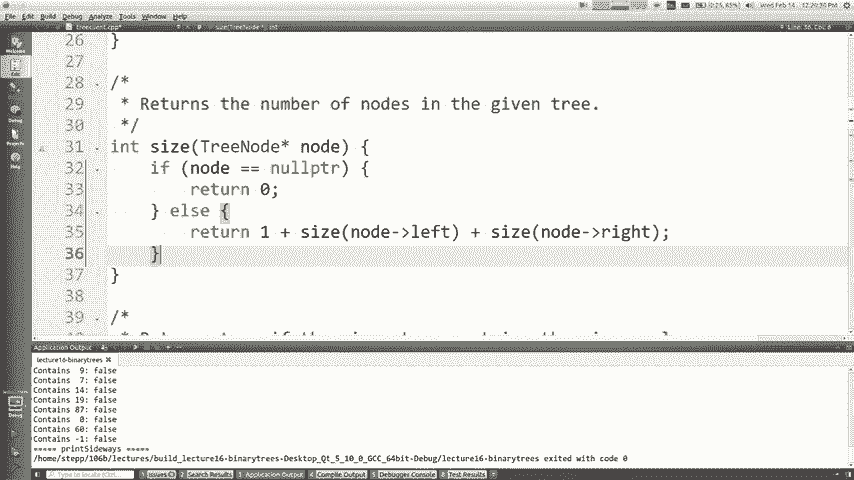