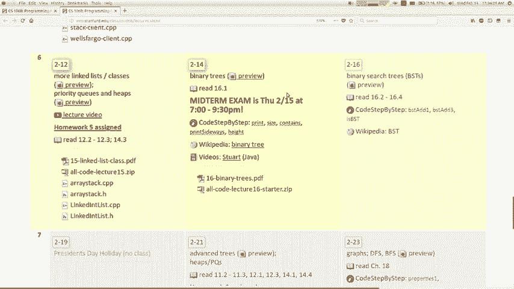
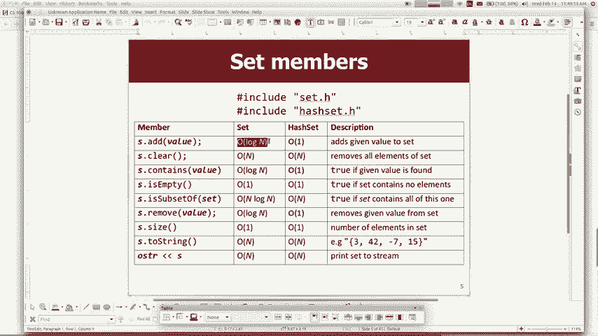
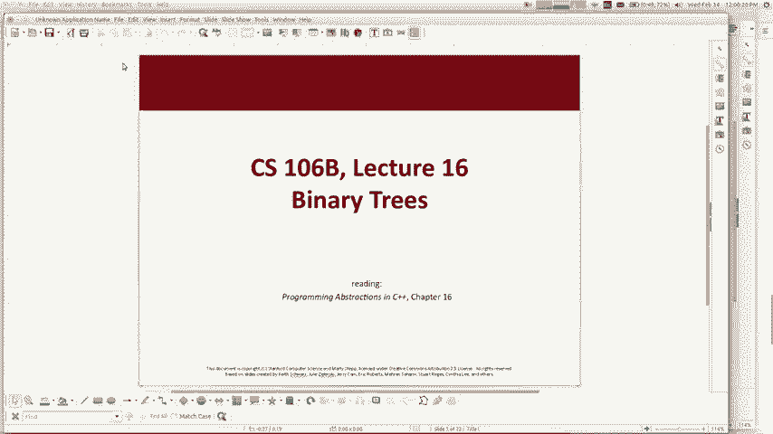
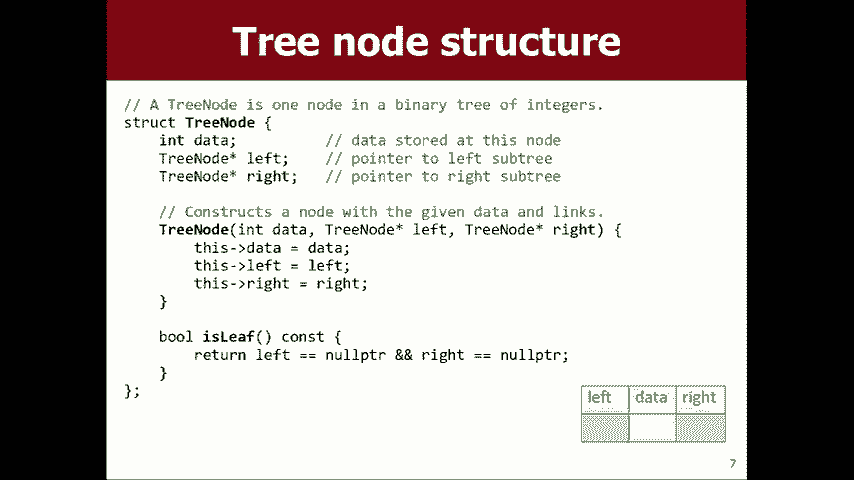
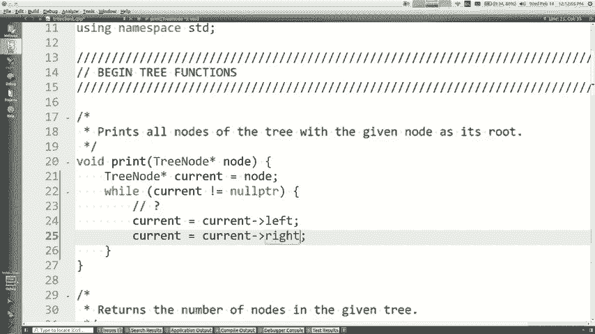

# 课程15：算法复杂度分析与二叉树入门 🌳

在本节课中，我们将学习两个核心主题：算法复杂度（Big O）的分析方法和二叉树数据结构的基本概念。首先，我们会回顾如何评估代码的运行效率，理解为什么算法复杂度对处理大规模数据至关重要。接着，我们将初步探索二叉树的结构、术语及其递归特性，为后续实现高效集合（如Set）打下基础。

## Big O 复杂度分析回顾 📊



上一节我们提到了期中考试，现在我们来重点复习算法复杂度分析的核心思想。Big O 表示法帮助我们描述算法运行时间随输入规模增长的变化趋势，这对于选择高效算法至关重要。

### 基本执行模型

我们采用一个简化的模型来分析代码：假设每条语句执行需要一个单位时间。这虽然不完全精确，但能帮助我们快速估算复杂度。

例如，一个执行10次的循环，若循环体内有5条语句，则总执行时间单位可估算为：
```
总时间 ≈ 循环次数 × 循环体内语句数 = 10 × 5 = 50 个单位时间
```
函数调用的时间则取决于函数内部所有语句的执行时间总和。


### 关注增长趋势

计算机科学家更关注运行时间的**增长趋势**，而非绝对时间。我们通常会忽略常数因子和低次项，只保留最高次项。例如，对于一个运行时间表达式 `4n³ + 20n² + 100`，当 `n` 很大时，`n³` 项占主导地位，因此其 Big O 记为 **O(n³)**。

### 集合操作的复杂度

了解不同数据结构的操作复杂度对于编写高效程序非常重要。以下是部分关键操作的复杂度：
*   **向量（Vector）**：在末尾添加元素（`add`）和按索引访问（`get`/`set`）是 **O(1)**。在开头或中间插入/删除元素可能需要移动其他元素，是 **O(n)**。
*   **集合（Set）与映射（Map）**：基于树实现的集合（如 `TreeSet`），其 `add`、`remove`、`contains` 等核心操作通常是 **O(log n)**。基于哈希表实现的集合（如 `HashSet`），这些操作在平均情况下是 **O(1)**。

### 代码复杂度分析示例

以下是分析代码段复杂度的思路：

1.  **嵌套循环**：若外层循环执行 `n` 次，内层循环也执行 `n` 次，则通常为 **O(n²)**。
    ```cpp
    for (int i = 0; i < n; i++) {
        for (int j = 0; j < n; j++) {
            // 常数时间操作
        }
    }
    ```
2.  **顺序循环**：多个依次执行的循环，复杂度相加，取最高阶项。
    ```cpp
    for (int i = 0; i < n; i++) { ... } // O(n)
    for (int j = 0; j < n; j++) { ... } // O(n)
    // 总复杂度仍为 O(n)
    ```
3.  **循环中的函数调用**：需考虑函数自身的复杂度。若循环 `n` 次，每次调用一个 **O(n)** 的函数，则总复杂度为 **O(n²)**。


> **注意**：递归函数的复杂度分析通常更复杂，可能涉及递归关系式求解，本课程期中考试不要求掌握递归的 Big O 分析。


## 二叉树数据结构初探 🌲



理解了算法效率后，我们来看一个能高效实现集合操作的数据结构——二叉树。二叉树是递归定义的，每个节点最多有两个子节点（左和右），这种结构非常适合用于快速搜索。


### 二叉树的定义与术语

一棵二叉树要么是空的，要么由一个根节点以及其下方的左子树和右子树（均为二叉树）组成。

以下是二叉树的基本术语：
*   **节点（Node）**：树中的每个元素。
*   **根节点（Root）**：树的顶层节点。
*   **子节点（Child）**：一个节点下方的直接相连节点。
*   **父节点（Parent）**：一个节点上方的直接相连节点。
*   **叶节点（Leaf）**：没有子节点的节点。
*   **子树（Subtree）**：一个节点及其所有后代构成的树。
*   **树的高度（Height）**：从根到最远叶节点的路径长度。




### 二叉树的代码表示

我们可以用结构体（`struct`）来定义一个二叉树节点：

```cpp
struct TreeNode {
    int data;           // 节点存储的数据
    TreeNode* left;     // 指向左子树的指针
    TreeNode* right;    // 指向右子树的指针

    // 构造函数
    TreeNode(int value) {
        data = value;
        left = nullptr;
        right = nullptr;
    }
};
```

使用该结构体，我们可以手动构建一棵树：

```cpp
TreeNode* root = new TreeNode(17);
root->left = new TreeNode(9);
root->right = new TreeNode(14);
root->left->left = new TreeNode(-3);
// ... 以此类推构建其他节点
```

### 二叉树的递归遍历



处理二叉树最自然的方式是递归。例如，要打印树中的所有节点，我们可以利用树自身的递归结构。

一种直观但不够简洁（非“递归禅意”）的打印方法是：


```cpp
void printTree(TreeNode* node) {
    if (node == nullptr) {
        return; // 基础情况：空树不打印
    }
    cout << node->data << endl;
    if (node->left != nullptr) {
        printTree(node->left);
    }
    if (node->right != nullptr) {
        printTree(node->right);
    }
}
```


更优雅（更具“递归禅意”）的版本是，相信递归调用能处理好子节点，无需显式检查子节点是否为空：


```cpp
void printTreeZen(TreeNode* node) {
    if (node == nullptr) {
        return; // 基础情况：空树
    }
    cout << node->data << endl; // 处理当前节点
    printTreeZen(node->left);   // 递归处理左子树
    printTreeZen(node->right);  // 递归处理右子树
}
```



### 计算二叉树的大小


同样地，计算树的节点总数也可以优雅地用递归实现：

```cpp
int treeSize(TreeNode* node) {
    if (node == nullptr) {
        return 0; // 空树大小为0
    }
    // 当前节点(1) + 左子树大小 + 右子树大小
    return 1 + treeSize(node->left) + treeSize(node->right);
}
```

## 总结 🎯

本节课中我们一起学习了两个重要主题。

首先，我们深入回顾了 **Big O 复杂度分析**，明白了它是衡量算法随输入规模增长而耗时变化的标准方法。我们学会了简化分析模型，关注最高阶项，并了解了常见集合操作的复杂度，这对于编写高效程序至关重要。

其次，我们初步探索了 **二叉树数据结构**。我们了解了其递归定义、基本术语，并用代码实现了树节点。最重要的是，我们掌握了使用递归来遍历和操作二叉树的基本模式，例如打印所有节点和计算树的大小，这为我们后续学习利用二叉树实现高效集合打下了坚实基础。


理解这些概念将帮助你在面对大量数据时选择合适的数据结构和算法，并为你解决更复杂的编程问题（包括面试中常见的二叉树问题）做好准备。