# 【斯坦福大学】CS106B C++中的抽象编程 · 2018年冬（完结·中英字幕·机翻） - P16：【Lecture 16】CS106B Programming Abstractions in C++ Win 2018 - 鬼谷良师 - BV1G7411k7jG

所以大家好，我知道您希望今天看到Marty ，注意到他昨天不在期中，但他要我告诉你，他在检查室里的所有事情，因为他的妻子在工作，所以在那里，将很快在世界上迈出第一步，我敢肯定，他一定会分享，图片。

我认为有一个女孩，我知道他是否正在考虑将她命名为，期中加薪，但我想他们会和夏娃一起去，他的妻子赢了那个，战斗是的，所以对你们所有人来说意味着您可能会看到，我中有很多人对此感到遗憾，马蒂希望他也能在这里。

但在我们之前。

开始，我只想先发布几条公告， ，昨天有几个人在备忘录中留下了一些东西，所以如果你已经，丢失了一个水壶，汽车钥匙或您的课本，下课后来看我，然后也是总统日周末，这意味着星期一没有演讲，很棒。

这也意味着周日没有任何活动，因为部门负责人，也像三天的周末，所以如果您有任何疑问，请随时，只要实际上，只要在广场或眩光和克莱尔上的帖子都会在周一开放，有更多的人手，这很好，所以让我们开始谈论。

二进制搜索树，所以今天我们将结束对二进制的讨论，我们从周三开始谈论的树木，然后，我们将学习一种称为二进制搜索的特殊类型的二进制树，具有很好的排序特性的树，可以进行很多操作，快得多。

所以我们将那些常见的操作编码为破坏者，警报二进制搜索树是如何实现斯坦福地图和集合的，因此，如果您想知道为什么他们这么快，为什么要对它们进行排序，讲座完全适合您，然后我们也将基本上。

在今天和下一个星期三之间实现一个二叉搜索树，我们进入二叉搜索树，我想谈谈遍历，所以遍历，就像解决任何树问题的最佳方法，所以基本上如果有任何树，问题，您将需要做一些您需要去做的事情，看一下节点。

看一下它的子节点，所以共有三个，遍历遍历在查看之前您在节点处正在做的事情，在任何孩子的顺序中，我们都会看到这就是为什么它被称为，一旦我们进入二叉搜索树，那么基本上就是你去了，左，然后是您自己。

然后是右和后置订单，您可能会猜到您是先做孩子然后自己做孩子，思考它的另一种方式是您可以考虑它，就像您一样，可以追踪您的树和您传递节点顺序的方式，表示要遍历的订单，因此在进行预购时，如果。

第一次在左侧传递内容时，您将其打印出来，以便，这种情况下，它会像是17，然后是41，然后是29，然后您将在此处，我们已经发现41，然后下降6并转到此处对不起，有点滞后，这是完成后的样子，但是，基本上。

您会四处走动，然后依次执行17、41、29、29 ，六个，然后传递981和40，您可以按顺序执行相同的操作，并进行后期订购，以便订购，这是您第二次通过该号码，因此，你知道这是我们第一次通过他们。

现在我们通过了29 ，我们已经通过41现在我们通过6现在我们通过17现在81现在9现在是40然后，然后在您通过右侧时发布订单，以便基本车轮见示例，使用所有这三种方法，但是要牢记它们，因为几乎。

任何树木问题都可以通过遍历的某种变体来解决，所以无论何时您，需要对树木做一些尝试首先考虑一下，嘿，这是一个，遍历问题我应该使用哪个遍历，是的，所以如果你想谈谈，与邻居一起尝试找出前后顺序遍历的内容。

这棵树的沙皇，好的，有人要分享他们发现的预订遍历吗，是的，我说的是42岁，所以我们有42 15 986 339好的，那顺序是什么，在后面，对不起，这应该是42岁，好吧，然后发布订单好吧。

我认为那几乎是对的，所以让我们看看吧，通过右边的15，让我右边的86，然后我想你说，三个，但我们还没有通过右边的三个，所以我们下去并通过39 ，是的，首先是的，所以39但是你说的其他所有内容，点9。

然后点42，所以如果你是的话，那么86在9之前是因为你，在处理音符本身之前先处理左孩子，这种情况就像当您通过它时，它像底部一样向下走，所以我们，在底层法院9我通过了86 ，知道这个ol似乎毫无意义。

我正在让你学习，对此感到抱歉，但是就像一旦您开始做树的问题，如果您还记得的话，遍历就像基本上所有的树问题都可以写成，弄清楚遍历，然后弄清楚该怎么做，节点，希望那些匹配，所以我们在星期三写了一个打印函数。

 ，看起来像这样，如果我们移动电话，您认为会发生什么。

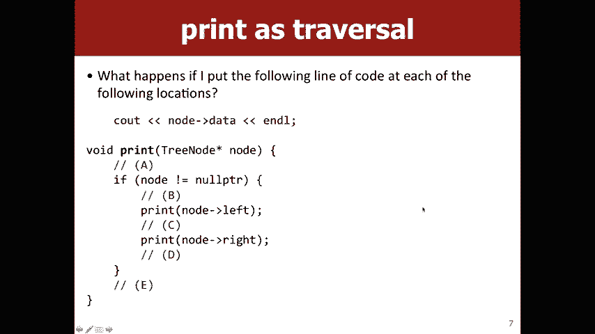

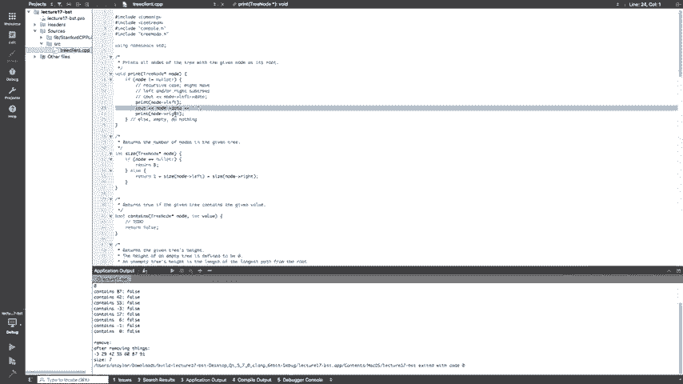

打印便签本身的任何想法是的，是的，如果我们把它。

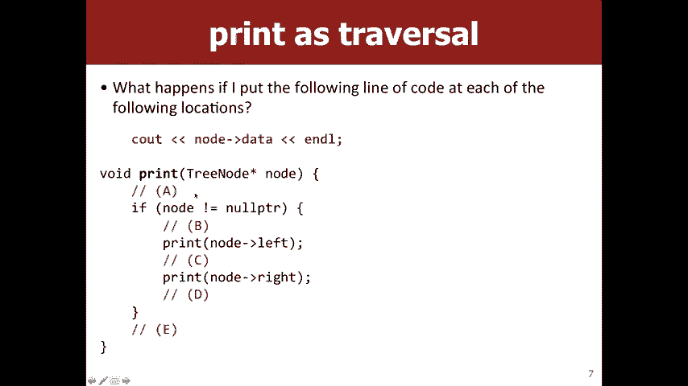

在这里，然后您将看到您也尝试将其扩大，上，你们所有人都能看到更好的结果吗，所以让我们开始吧，如果我们尝试运行此命令，您将看到。

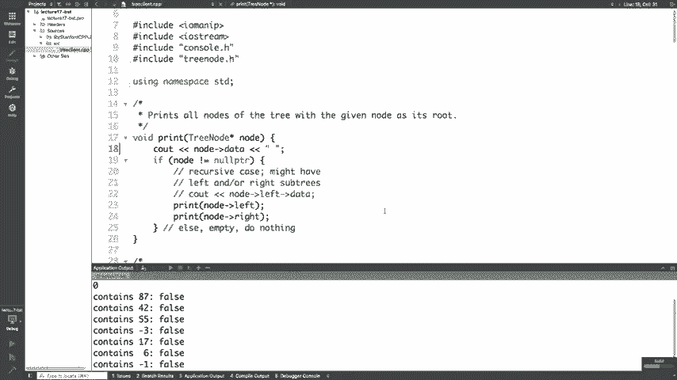

一些丑陋的文字基本上说，我们崩溃了，是的，所以它说在，程序执行基本上意味着您打空而您没有，检查null，然后您尝试取消引用痣，好吧，您怎么看。

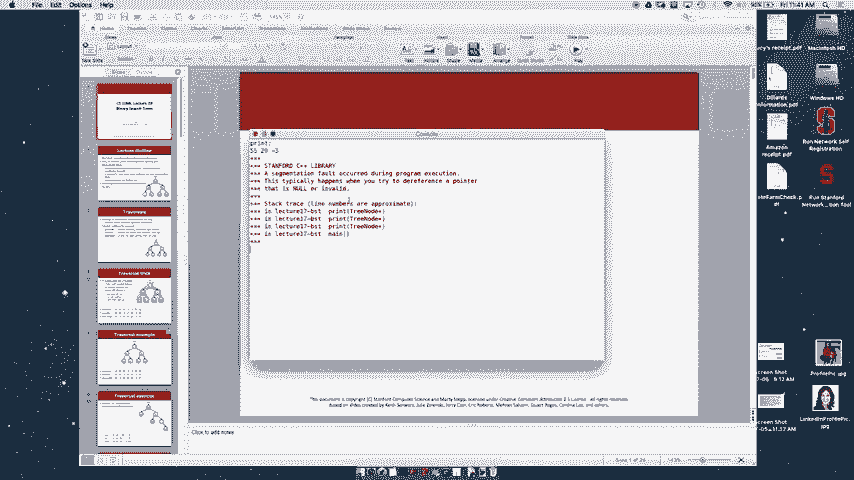

如果我们把这行放在b ，它会是遍历的一种类型吗，是的，所以它将被预购。

遍历的意思是我们先看一下音符本身，然后再看，它的子CA的情况很好。

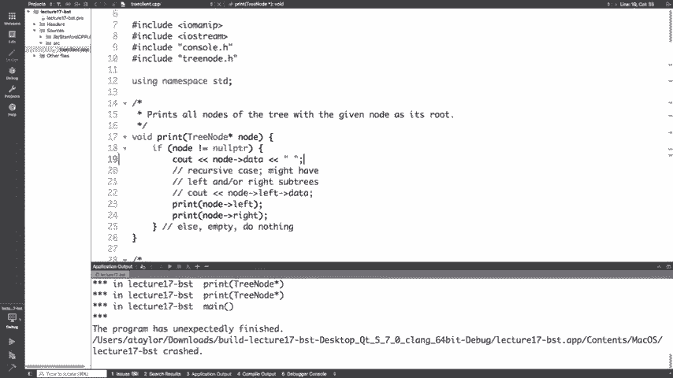

我真的不能切换屏幕，但是55是这棵树的根。 。

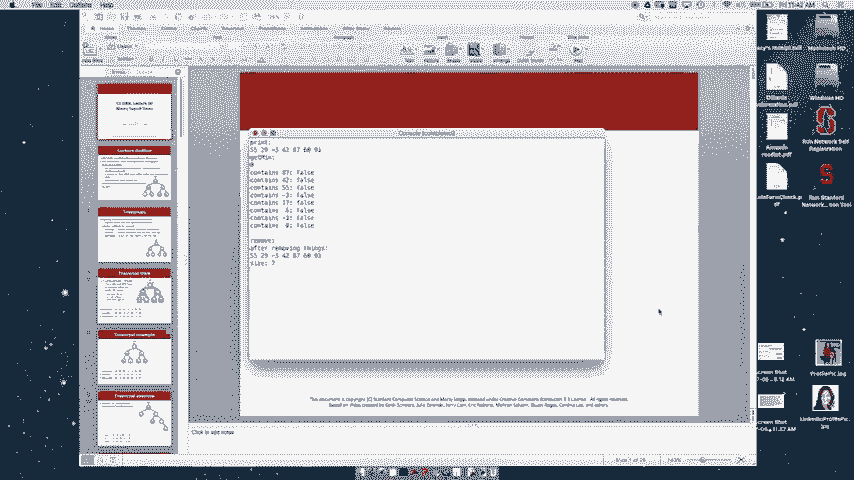

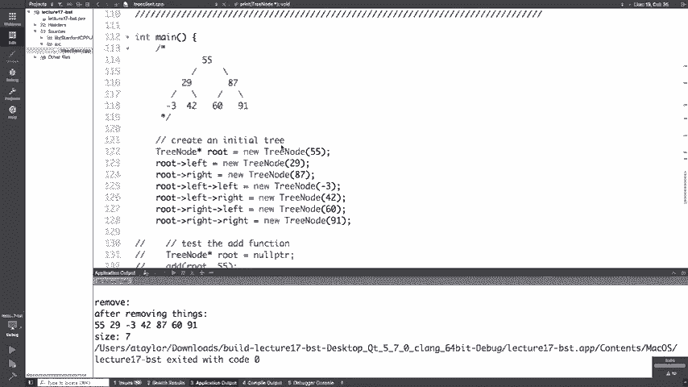

在这里先打印59然后再打印29然后他们得到3等。

它是一种遍历，是的，然后你会，大家是的，然后我们也将遇到相同的无指针问题，我们之前所见，所以这基本上只是重新排列，打印出的节点似乎没什么用，但这就像，实际上，有时有时会在树的打印方式上产生巨大差异。

好吧，这就像好吧，所以我们有这些树，我们可以将它们打印出来，很棒，我们可以遍历它们，这也很棒，但更多的是，有用的是能够判断您的树是否包含元素对，因为那是我们看到的大集合操作之一，因此。

让我们谈谈如何为二叉树编写包含项，但想法是，如果该值在树中任何我们想返回true的位置，否则返回true ，我们返回假，所以任何人对任何技术都有任何想法，也许我们刚刚了解到，可以帮助我们，是的，是的。

所以我们的想法是我们仍然要继续研究，树中的值，所以我们仍然想使用遍历，而不是，实际打印该值，我们想查看该节点上的值是否等于，我们正在寻找的价值非常正确，就像我说的，所有树问题基本上都是遍历问题， 。

伪装好吧，所以我们知道我们要做什么，好吧，我们知道我们要。

在做类似不包含左值的事情，不包含右值，所以，现在的问题是，这是哪种遍历？ ，在检查节点的任何子节点之前先检查节点，邮购后，我们将首先检查所有子代是否具有该值，然后再返回。

这个节点或命令有多少人认为预购这些，你的手好吗，很多人认为有多少人认为后订单有多少人，认为遍历是完全错误的，多少人认为他们真的不应该，今天就来上课，就像在期中停下来一样运送，是的， ，显然是正确的答案。

喜问观众，所以可以预购是一个很好的选择，选择，因为我们拥有所需的所有信息，如果我们正在寻找，一个节点，我们有足够的信息可以告诉我们，这就是，我们正在寻找正确的方法，是的，如果没有日期，那么返回值很大。

怎么办，您想处理包含我们使两个孩子的电话，是的，你就像我领先一步，所以问题就像我们，需要将所有这些包装在if否不等于null指针和yes中，因为我们正在进行递归，而我们目前缺少我知道的基本情况。

你们都知道这是问题的答案，所以看，所以我们让它的节点不等于空指针，好吧，所以我们，避免我们的基础或我们有一个基本案例，我们要对这两个调用执行什么操作，是的，所以可以，这个或这个返回值是真的。

所以基本上我会在这里做的是，通常对于树是一个很好的基本案例，它会检查节点是否为null以及，然后经历并检查该值，这就是，我们先在此节点上进行，然后遍历订单，以便我们可以尝试。

是的，运行它，好吧，我们看到树中有87个树，而树中有50个55 ，像6不在我们的树中，所以我们的contains函数似乎正在工作，关于遍历都有哪些问题，并且包含是的，所以。

问题就像为什么我们必须在这里进行预遍历，为什么我们不能，做一个帖子，让我们尝试一下。

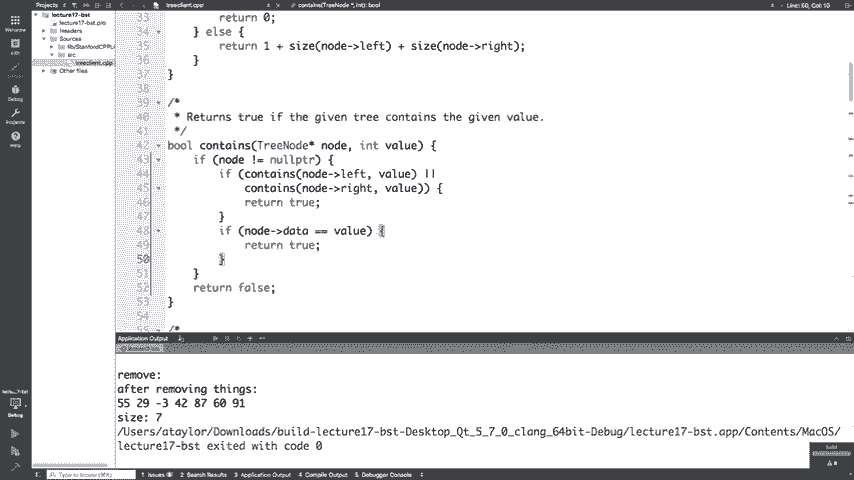

所以我们得到相同的结果包含继续工作，这是一个好兆头，在这里没关系，就像你仍然会得到一样，回答问题就像让我说我去了这个节点，然后看到像或，就像我有能力知道这个节点是我要寻找的节点， 。

而不是做那么简单的检查，我喜欢一直走到我的叶子，节点需要做很多额外的工作，所以这里更多的是优化，并非绝对必要的东西，例如有些功能，他们喜欢您做事的顺序确实很重要，是个好问题，好吧。

在我们继续研究二叉搜索树之前，还有其他问题吗。

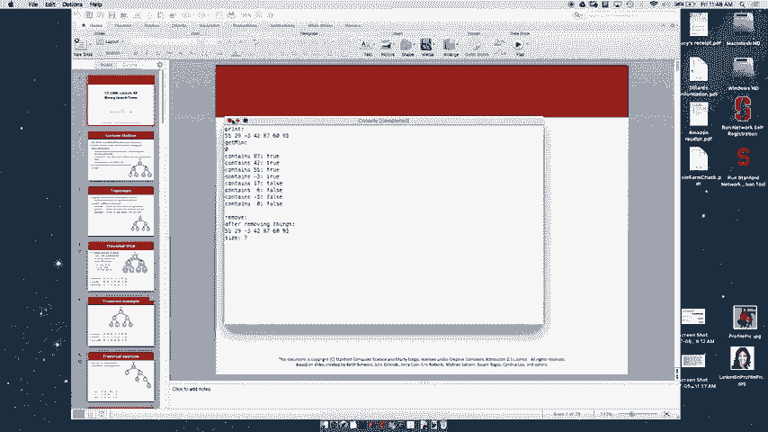

包含函数的功能非常不错，每个人都能很好地工作。

知道此函数的运行时是什么，所以我听到了一些登录信息， ，一些目的，所以基本上我想一个好问题是我是否需要，搜索树中的每个节点，是的，我看到了很多点头，因此，哦，一个，所以我想我们可以做得更好。

因为布景又回来了，所有人都记得昨天的创伤经历，所以还好，如此二进制。

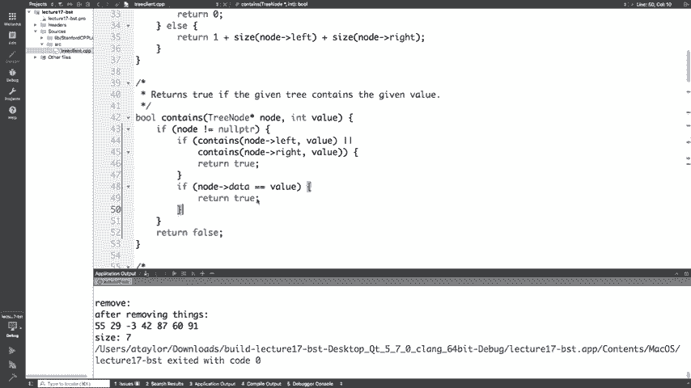

搜索树实际上让我们进入了这个哦，有关博客，所以目前我们的推文是，就像所有节点都是随机顺序一样，但是如果我们强制执行顺序，树的构造方式的特性，我们可以获得更好的结果，所以我们要订购的是我们要说的好。

我左边的一切都比我小，一切都比我小，权利比我大，这是递归属性，这意味着您，知道我去左边的孩子还是右边的孩子，他们也在做，以二进制搜索为例，您了解所有信息，在这棵树上，小于55的树在这边。

但就像您在所有事物上一样，大于29但小于55的子树将在此子树中，所以让我们看看是否，可能就像更改我们的contains函数以获取旧日志n ，而不是n次正确的O，为什么不与伴侣交谈并尝试。

找出一种优化我们的包含功能的方法，此订购属性。

好的，所以我要把这个放回去，因为有人要进行遍历，关于如何更改此设置的任何想法，因此我们无需查看所有，树中的节点，我们只能看一些，是的，因此我们可以在此处进行的优化是，我们不需要。

这样做，我们不需要查看子树的两侧，例如，如果我们，寻找35，很抱歉让我们做34，我们知道如果我们看到18 ，没有机会在这里的任何地方，所以我们正在寻找30或我们，可以像整个臂架一样划掉整个子树，好的。

然后我们达到35，我们知道这比我们的数字大，寻找不可能在这里的任何子树中，所以我们，像每个路径上的大量节点一样越界越好，之所以要这样做，是因为现在它正在n的o o中登录n，所以是。

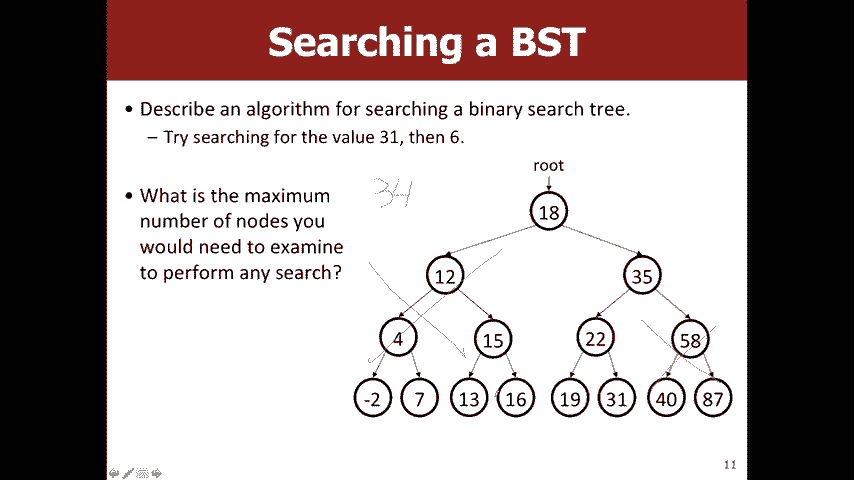

所以问题是为什么这不算是公平的递归，基本上，这不是独立交易，因为我们所做的一切都是，我们当前所处的节点就像所有这些if语句都与，我们当前位于的节点，而不是我们想要的节点，如果我们尝试做某些事情。

例如节点是否剩余数据或，这样的问题是一个很大的问题，无论如何，我们，需要对此功能进行操作，让我们尝试运行它，这样所有这些都将返回。

假那里发生了什么，除了55是我们的根，我们缺少了什么。

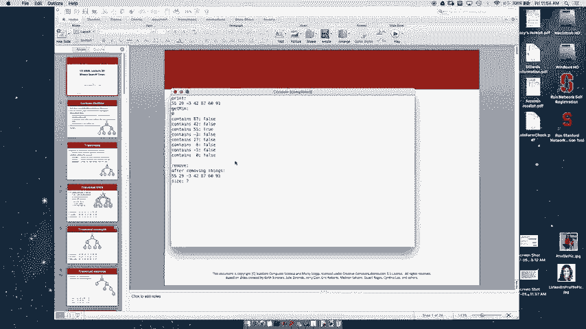

这里，是的，我听说基本案例已经关闭，好吧，所以如果我们再次尝试运行，是的，我们现在看到了，这与我们看到的匹配。

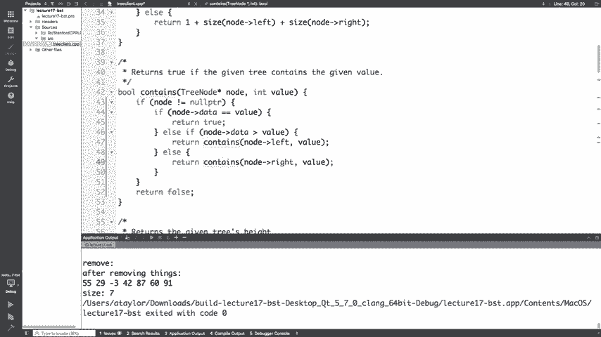

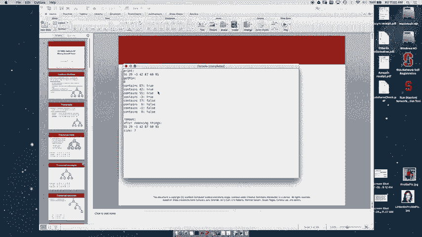

好吧，嗯，所以我们早先的一个问题是等待，为什么我们不能做，像邮购订单一样，是否有一种简单的方法可以做到这一点，功能，所以任何人都可以看到一种方法，是的，所以基本上，您必须先查看当前节点，然后才能进行。

决定要向左还是向右走，因此遍历确实很重要，对此包含哪些问题，功能或类似的原因，为什么它工作或为什么更快，是的，这里的回叫，问题就像假设我们当前正在查看87和节点，我们正在寻找的是10。

该代码不会返回false，所以在这种情况下，那么87是，大于值rikes大于10的87 ， 87的左孩子小于87，可能会或可能不会，是10，所以我们会说子树是否包含10，这样它就不会。

必然返回false，因为如果我们曾经到达该左子树中的节点，等于值，然后返回true，然后返回true，是，然后像这样一个大的人会回到那可能。

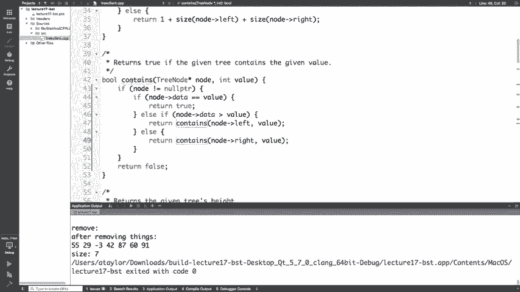

好吧，关于bsts的另一个很酷的事情是，获得最低要求非常容易， BST的最大价值，这是我们原始树的好孩子，必须像对待数组或数组一样正确地查看每个值，向量或链接列表，您必须查看所有内容。

以便任何人有任何想法，三重奏的最小值是一直到，左，所以它是没有左子孩子的第一个节点，感觉为什么好吧，好吧，嗯，这个想法好吧，我们只需要看一下。

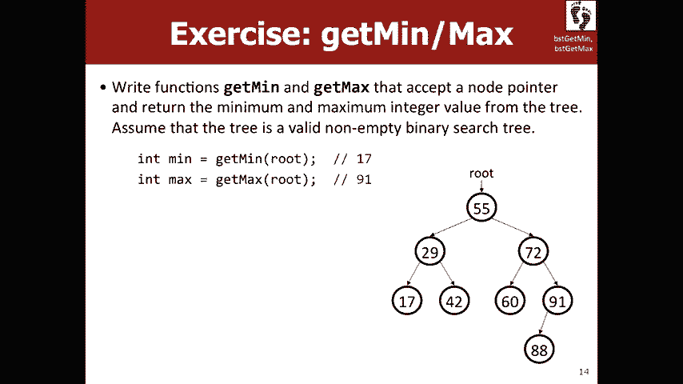

在左侧而不是在右侧尺寸的CJ上，将左侧的还好，所以我们可以继续下去，这段代码缺少基本情况是什么，所以，什么是好的基本案例，是的，所以如果我们要做类似的事情，在这里，如果不等于空点指针。

我们可以做这样的事情，这是我们之前见过的，但是问题出在最后，就像这里，如果它是空指针，那么做一些事情就像一个空，树没有最小值，所以我们实际上需要做些微的改变，基本情况下。

我们说“好”是我的左孩子null，然后描述了，我们之前讨论的条件，我们想要第一个音符，没有左继子就好，否则，让我们写更多的柯诺值，为什么bsts很棒的另一个例子，因为这只是log n而不是o ， n次。

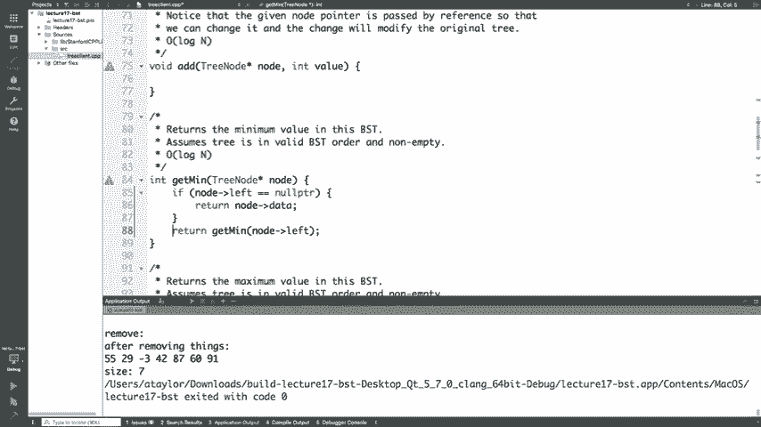

到目前为止，我们一直在作弊，因为我一直在你知道我们只是，通过链接这些节点神奇地创建了这个BST，就像，这对于这个BST来说很棒，但是我们如何才能让其他bst赞一下，这样就可以添加功能了。

那么我们如何添加到BST中，您可以想象在那里，您可能会添加很多不同的方式，例如我的意思是如果您给我，一组值，例如，您可以从中得出许多不同的vsts ，一组值，但是我们希望找到权重，就像添加一个好的方法。

尽可能少地完成工作的树的价值，因为我们，真正懒惰的计算机科学家，所以我们希望对更改进行最少的更改，越树越好，那么他们如何与伴侣交谈并设法弄清楚，像是将值14添加到此树中的好地方，好的。

有人有任何想法要分享吗？对不起，好的，所以我们的想法是让它成为树中现有节点的子节点，还没有孩子，让我们下降到19岁，然后，使其成为19的左孩子，那么您如何选择像19而不是，是其他节点，是的。

这样的想法就可以了，就像这个想法还可以，所以14个更大，大于8，所以我们知道它必须在树的右侧并且更大，比11小，因此它必须位于11子树的右侧且小于， 19，因此它必须位于不存在的xix子树的左侧，因此。

让我们让子树等于节点14听起来像，我们今天所做的一切，是的，我听到人们说的声音就像包含其中的声音，正确的想法是让我们像在树中搜索要放入的节点，因为无论如何集都不能有重复，我可以找到它很好，如果。

我们找不到想要的地方到我们一直在寻找的地方，而您，知道发现null必须是我们的节点应该去的地方，那。

好吧，让我们复制包含的代码，我们可以弄清楚我们想要什么。

改变这里，好吧，嗯，我们大概不会有任何类似的东西，返回值或错误值应全部添加，但我们想在，我们当前所在的节点具有我们想要的值，我们是否想要更改，我们的树好吧，所以我们可以返回好吧，然后是什么，然后好吧。

我们，让我们知道你走对了最后一件事，在这里，我们还有另一个返回值，所以如果节点为空指针，我们该怎么办，是的，抱歉哦，是的，我得到了，所以我们可以说节点等于您知道新的树节点，值还行。

所以让我们尝试运行此代码，这样我就可以摆脱我的帮助了， Insta BST好吧，让我们尝试运行它。

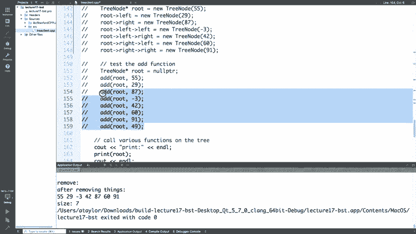

我们的树不存在，所以您认为这是怎么回事，为什么我们的树。

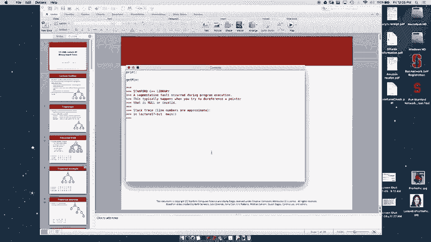

添加功能无法正常工作，您喜欢与伴侣交谈几分钟，并尝试找出为什么我不工作，好吧，如果有人对这里出了什么问题有任何想法，是的，是的，所以我们在这里有一个问题，这个节点超过五个值，这意味着，在这里。

当我们尝试将其设置为等于未反映变化的事物时，回到缅因州，因为它是另一个范围，因为我们复制了，树节点变量好吧，我们已经看到了这一点，带有链接列表，那么通过引用传递的解决方案是什么？ 。

就像这是一个非常微妙的观点，所以你们都对什么问题，是的，所以问题是我们是否需要检查是否没有数据不相等，有价值，所以让我们尝试将其注释掉，以便您知道只有一部分，那实际上是先尝试运行它，我要先运行。

然后我本来要运行它，就是这样，我们知道这可行，所以我们得到了相同或相同的树，但是在这里。

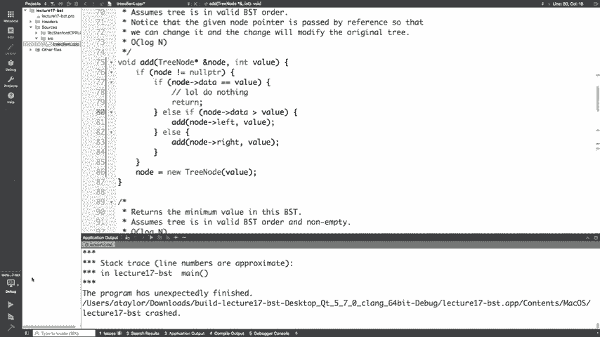

让我们尝试不要让我们试着没有这部分，我正在运行它，以便进行汇编或。

树只有一个值，是的，所以那是当我们因为。

我们只检查节点是否为空指针，执行此代码，所以我们将失去其余的树，是的，就像我以为指针已经基本上通过引用传递了，就像为什么不反映此更改，而问题是因为嗯，所以凯，新的树节点返回一些值，例如0 X ABC。

并且该节点最初具有，其他一些值，例如0 X 1 2 3而不是大约0 X 1 2 3是从main或，从调用函数到这个函数，所以这就像一个完全，将变量与前一个变量与主要变量分开，所以我说好。

而不是0 X 1 2 3我们想要0 X ABC，它对应于指向，像这个具有这个值的节点，就是这样，问题实际上不是在指向正确的东西，这些变化。

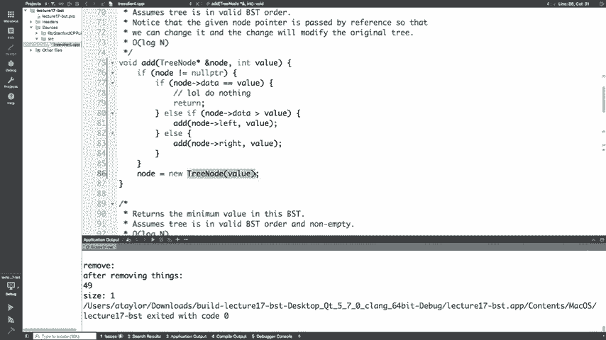

并不反省吗，那我觉得我有一个幻灯片，这很清楚，所以是的，问题是你知道这里我们喜欢有这个可变的音符，应该指向45，但是就像完全分开一样，在42中应该指向45，这样做更有意义，非常微妙的一点好吧。

再看看我们通常想要做的另一件事，看到带有链接列表的内容是您要清理您的内存吗，只是想让树上的垃圾随处可见，以便程序处理，直到它最终耗尽了内存，所以um可能要与合作伙伴讨论。

就像您可以用来释放我们需要的树的一般算法一样，释放组成树的所有节点的所有内存，好吧，任何人对我们可以用来解决此问题的任何想法都有，问题是的，是的，所以建议是我们可以进行后期处理，遍历。

所以为什么不喜欢预订或有序遍历工作，在这里，是的，所以我们首先需要确保没有任何问题，如果需要，需要在我喜欢删除自己之前清理的孩子，离开自己，我无法接触那些孩子，所以那不是。

实际上就像在释放树上做得很棒一样，就像释放根和，别无其他，因此这是事后遍历使，大多数情况下，我们实际上不会在这里涂上它，因为您将在，您的下一个作业，但主要的提示是去上课，所以我们聊了。

关于某些示例或预购，最好包含，我们讨论了一些，如果您认为自己会使用，有序遍历或为什么您将其称为有序遍历，像发生了什么事，是的，在YouTube之前是个好主意， ，支持者是的，这个主意还可以。

因为有序遍历被称为顺序，就像当您使用有序遍历打印二进制搜索树时得到的树，是的，是的，是的，我不知道他们从哪里来的，但是，因此，如果您尝试检查您的树是否是二叉搜索树，也许，您需要使用某种顺序遍历才能像。

我们正在查看的元素实际上是有序的，所以这是正确的， ，您会在汉考克区看到类似的问题，所以我们，还剩五分钟，我可以研究如何从BST中删除，但我知道您有，昨天中期，这是一个三天的周末，所以我要放树。

