# 课程16：二叉搜索树（BST）基础 🧮

在本节课中，我们将学习一种特殊的二叉树——**二叉搜索树（Binary Search Tree, BST）**。我们将了解它的排序特性，以及如何利用这些特性实现高效的查找、插入等操作。这些操作正是斯坦福的 `Map` 和 `Set` 类库如此快速和有序的原因。


---

## 回顾：树的遍历 🌳

上一节我们介绍了二叉树的基本概念。本节中，我们来看看如何系统地访问树中的每一个节点，这个过程称为**遍历**。

遍历是解决几乎所有树问题的核心方法。本质上，你需要访问节点本身，并查看其子节点。根据访问节点的顺序，有三种主要的遍历方式：

*   **前序遍历**：先访问当前节点，再递归访问左子树，最后递归访问右子树。
*   **中序遍历**：先递归访问左子树，再访问当前节点，最后递归访问右子树。
*   **后序遍历**：先递归访问左子树，再递归访问右子树，最后访问当前节点。

另一种理解方式是：想象你沿着树的边缘行走，每次经过一个节点时，根据遍历规则决定是否“处理”它（例如打印其值）。

以下是遍历一个示例树的结果：
*   **前序遍历**：17, 41, 29, 6, 9, 81, 40
*   **中序遍历**：29, 41, 6, 17, 81, 9, 40
*   **后序遍历**：29, 6, 41, 81, 40, 9, 17

请记住这些遍历方式，因为几乎任何树问题都可以通过某种遍历的变体来解决。

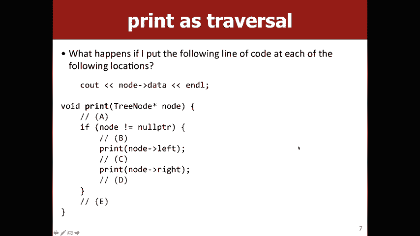

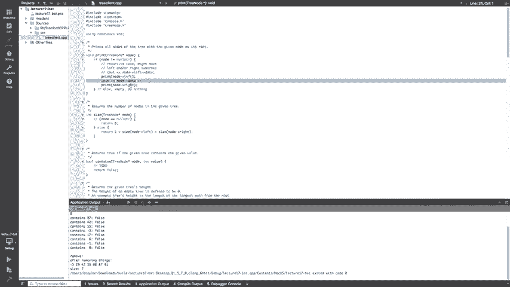

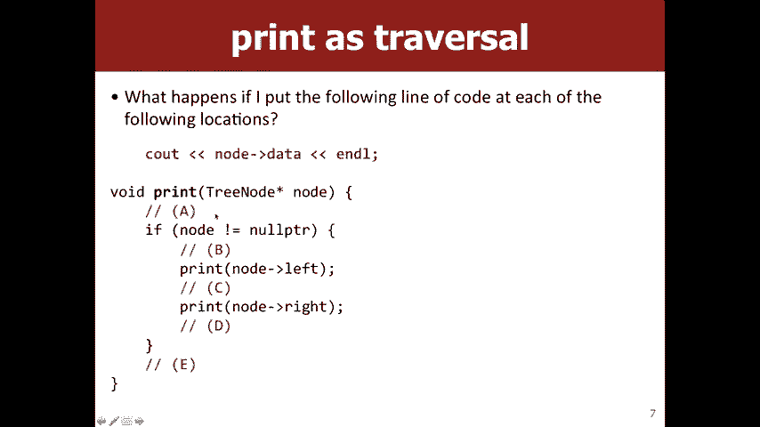

---

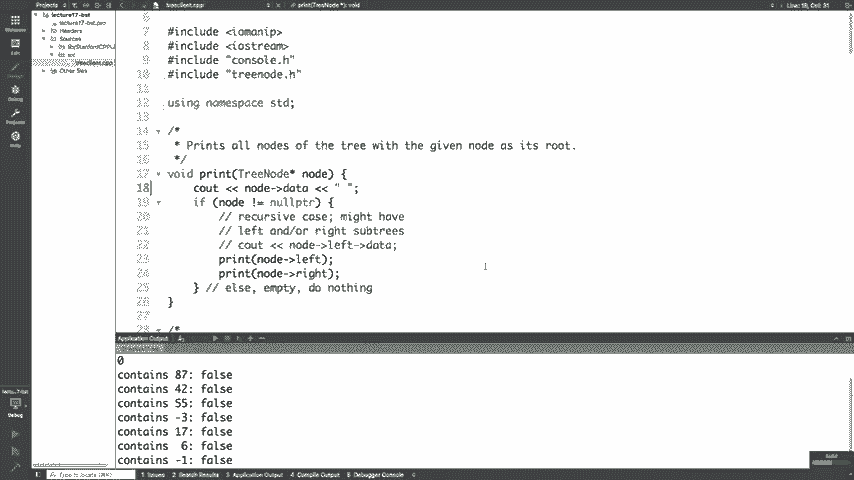


## 为普通二叉树实现 `contains` 函数 🔍

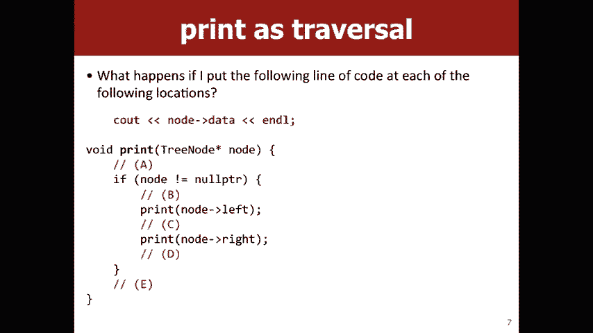

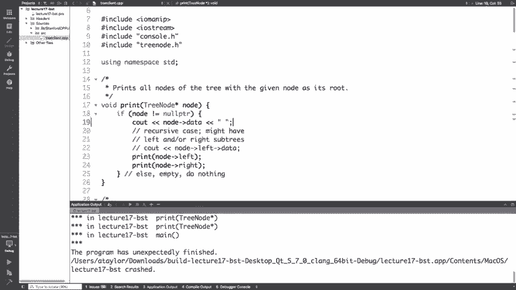

现在，让我们讨论如何为二叉树编写一个 `contains` 函数。这个函数的目标是判断一个值是否存在于树中的任意位置。如果存在则返回 `true`，否则返回 `false`。


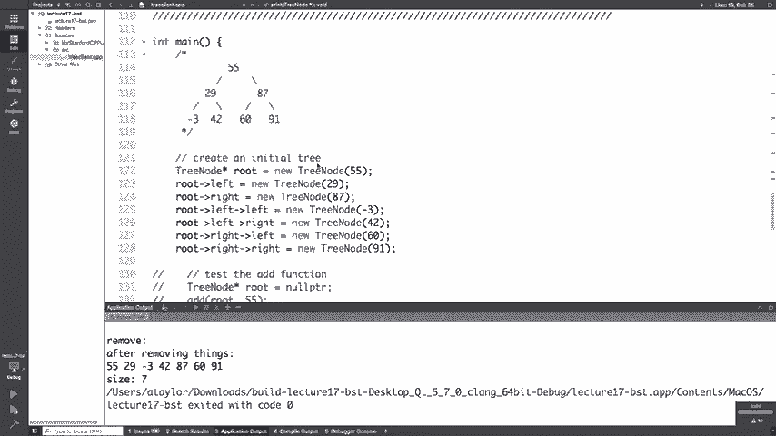


以下是实现这个函数的一种思路：

我们知道需要检查树中的每一个值，因此仍然需要使用遍历。我们不是打印节点的值，而是检查节点的值是否等于我们要找的值。

```cpp
bool contains(TreeNode* node, int value) {
    if (node == nullptr) {
        return false; // 基本情况：空树不包含任何值
    }
    // 检查当前节点
    if (node->data == value) {
        return true;
    }
    // 递归检查左子树和右子树
    return contains(node->left, value) || contains(node->right, value);
}
```

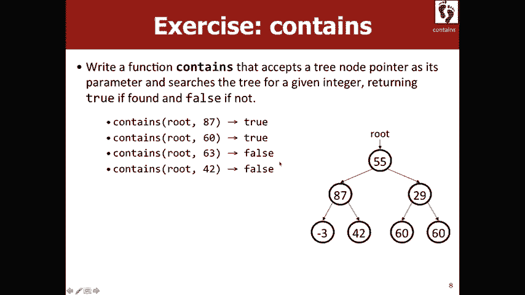

这个函数使用了前序遍历的思想（先检查当前节点，再检查子树）。对于普通的、无序的二叉树，我们必须检查所有节点，因此这个函数的时间复杂度是 **O(n)**，其中 n 是节点总数。

---

## 引入二叉搜索树（BST） 🚀

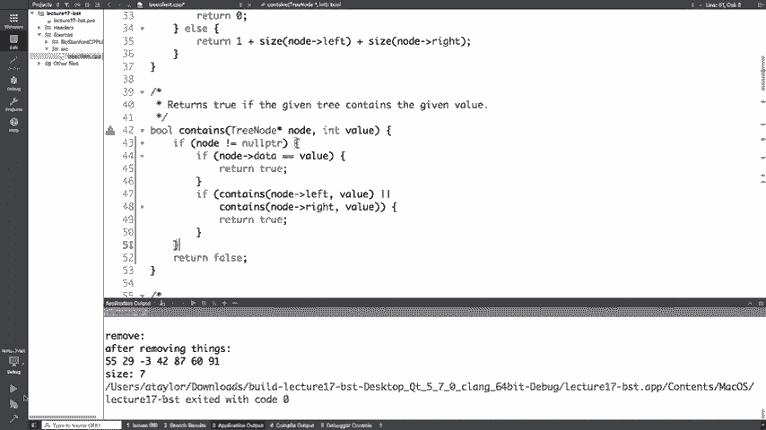

上一节我们实现了一个通用的 `contains` 函数，但它的效率不高。本节中，我们来看看如何通过一种特殊的树结构来大幅提升效率。


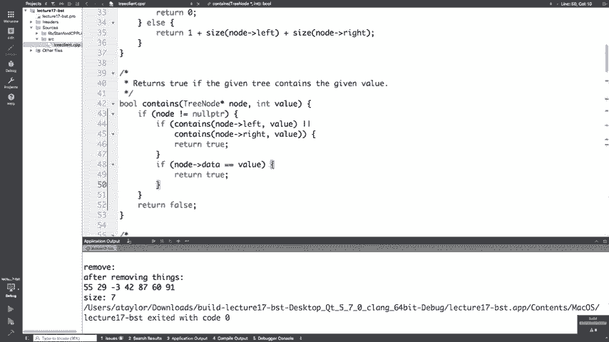

**二叉搜索树** 在普通二叉树的基础上增加了一个排序属性：
*   对于树中的任意节点，其**左子树**中的所有节点值都**小于**该节点的值。
*   其**右子树**中的所有节点值都**大于**该节点的值。
*   这个属性**递归地**适用于所有子树。

这个属性带来了巨大的优势：当我们在 BST 中搜索一个值时，在每一步，我们都可以根据当前节点的值决定是去左子树还是右子树继续搜索，从而**跳过整棵子树**。


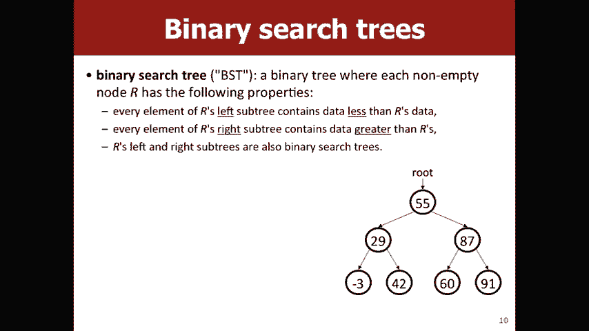

---

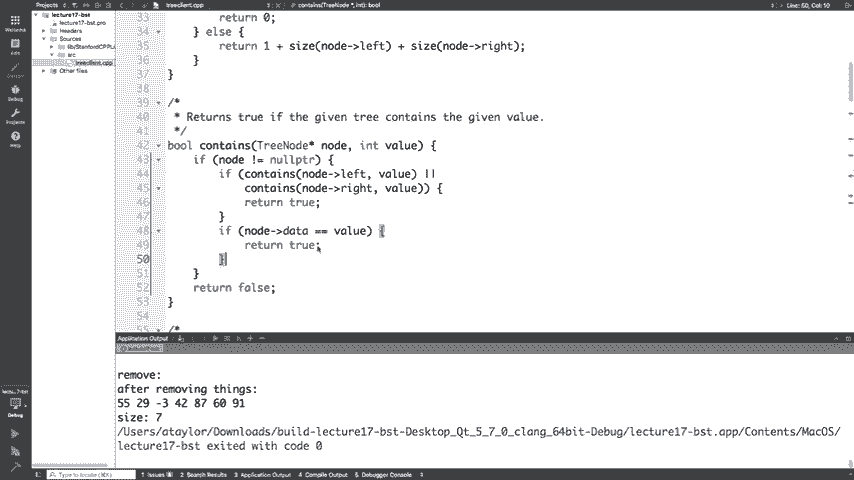

## 为 BST 实现高效的 `contains` 函数 ⚡

利用 BST 的排序属性，我们可以优化之前的 `contains` 函数。

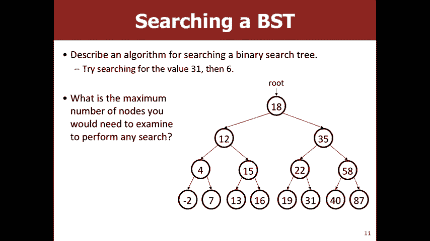

以下是优化后的思路：
我们不再需要同时检查左右子树。如果要找的值小于当前节点值，我们只需搜索左子树；如果要找的值大于当前节点值，我们只需搜索右子树。

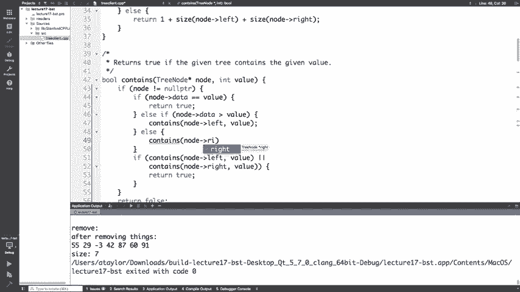

```cpp
bool containsBST(TreeNode* node, int value) {
    if (node == nullptr) {
        return false; // 未找到
    }
    if (value == node->data) {
        return true; // 找到
    } else if (value < node->data) {
        // 目标值更小，只搜索左子树
        return containsBST(node->left, value);
    } else { // value > node->data
        // 目标值更大，只搜索右子树
        return containsBST(node->right, value);
    }
}
```

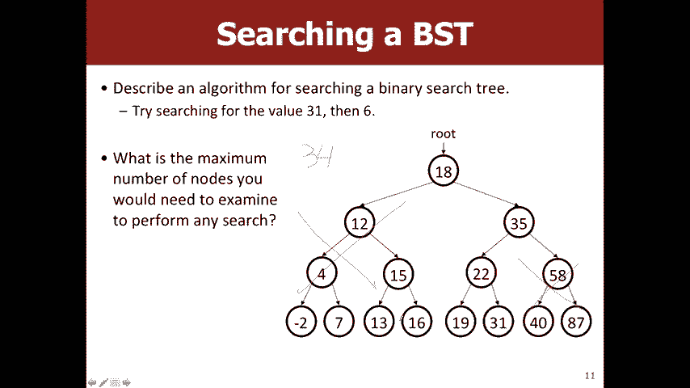

这个优化后的函数时间复杂度是 **O(log n)**（在平衡的树中），比 O(n) 快得多。注意，这里的遍历顺序是**中序遍历**的一种应用，因为我们先根据节点值做判断（类似于“访问”），再决定递归方向。

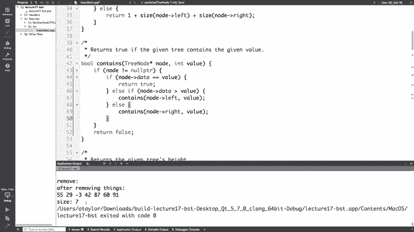


---

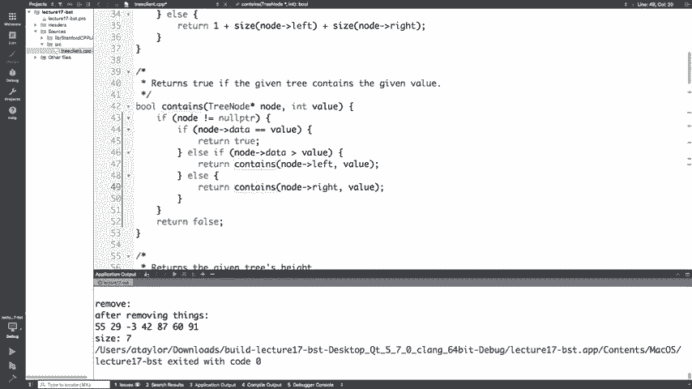


## BST 的其他优势操作 ✨

BST 的排序属性还使得其他一些操作变得非常高效。

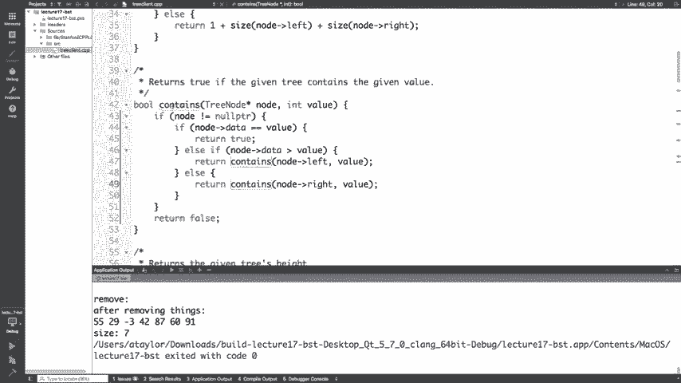

**查找最小/最大值**：
*   最小值：沿着树的**最左侧**路径一直向下，直到没有左子节点的节点。
*   最大值：沿着树的**最右侧**路径一直向下，直到没有右子节点的节点。

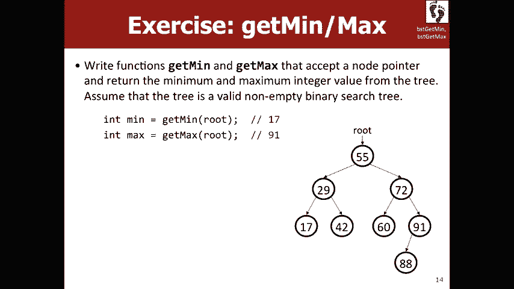

```cpp
int findMin(TreeNode* node) {
    // 假设树非空
    while (node->left != nullptr) {
        node = node->left;
    }
    return node->data;
}
```

这个操作的时间复杂度也是 **O(log n)**，而在无序的数据结构中（如链表），你需要 O(n) 的时间来检查所有元素。

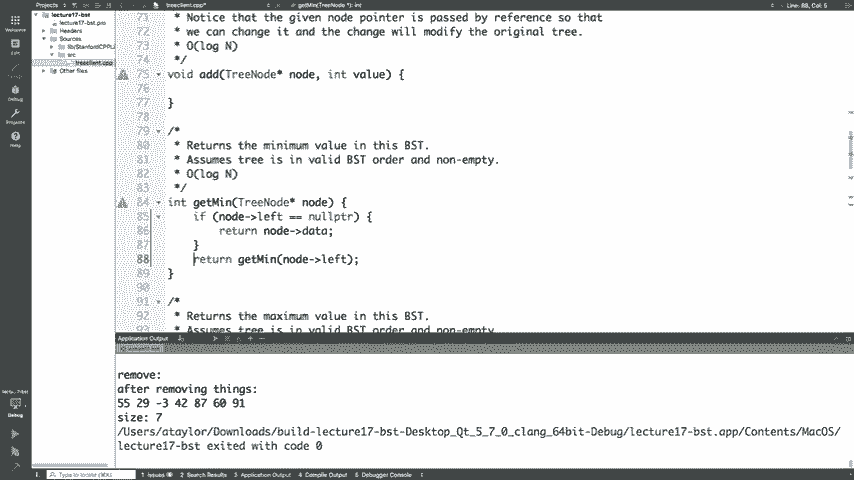

---

## 向 BST 中插入节点 ➕

现在，我们来看看如何向 BST 中添加一个新值。目标是找到正确的位置插入，同时保持 BST 的排序属性不变。

插入算法的思路与 `contains` 函数类似：
1.  从根节点开始，比较要插入的值与当前节点的值。
2.  如果值更小，则走向左子树；如果值更大，则走向右子树。
3.  重复此过程，直到到达一个 `nullptr`（空位置）。这个空位置就是新节点应该插入的地方。
4.  创建新节点并将其链接到树中。

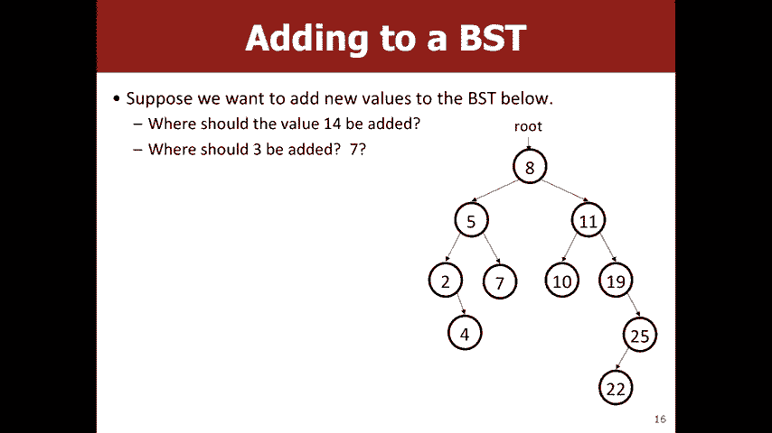

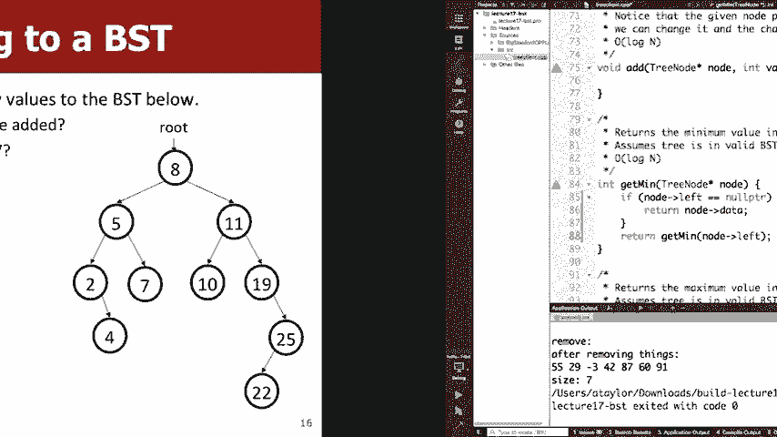

这里有一个关键点：为了修改树的结构（将新节点链接到其父节点上），我们需要**通过引用传递节点指针**，或者处理返回值来更新父节点的指针。

```cpp
void insertBST(TreeNode*& node, int value) {
    if (node == nullptr) {
        // 找到插入位置，创建新节点
        node = new TreeNode(value);
    } else if (value < node->data) {
        // 插入到左子树
        insertBST(node->left, value);
    } else if (value > node->data) {
        // 插入到右子树
        insertBST(node->right, value);
    }
    // 如果 value == node->data，说明值已存在（假设不允许重复），什么也不做
}
```

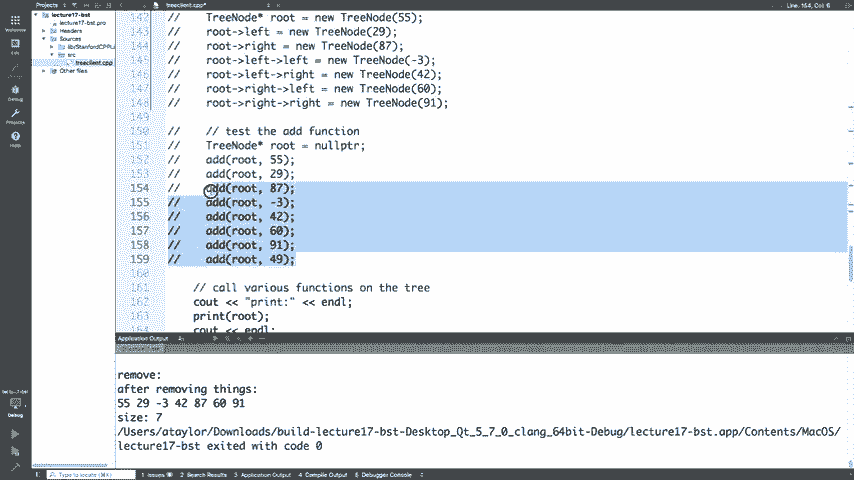


注意参数 `TreeNode*& node`，这是一个指向指针的引用，它允许我们修改调用者传来的指针变量本身（例如，将 `nullptr` 改为指向新节点的指针）。

---

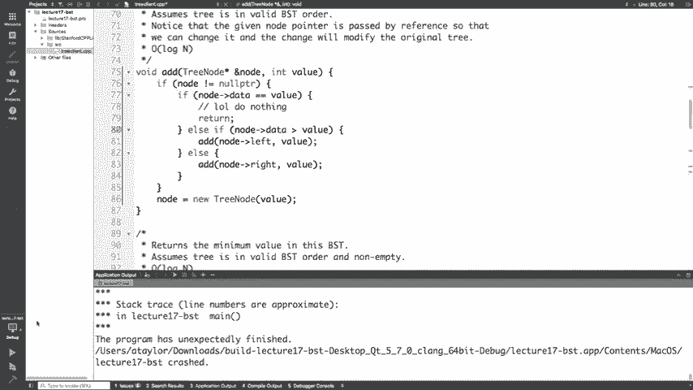

## 释放树的内存 🗑️


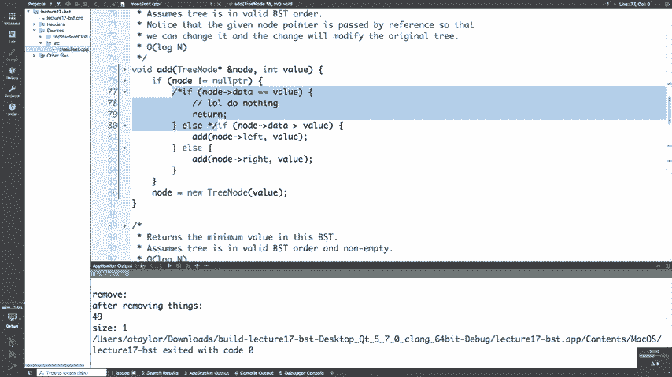


当我们使用完一棵树（尤其是用 `new` 创建的树）后，应该释放其内存以避免内存泄漏。

释放树内存的合适算法是**后序遍历**：
*   必须先递归释放所有子节点的内存，然后才能安全地释放当前节点本身。
*   如果使用前序或中序遍历，在释放当前节点后，就无法再访问其子节点，从而导致内存泄漏。

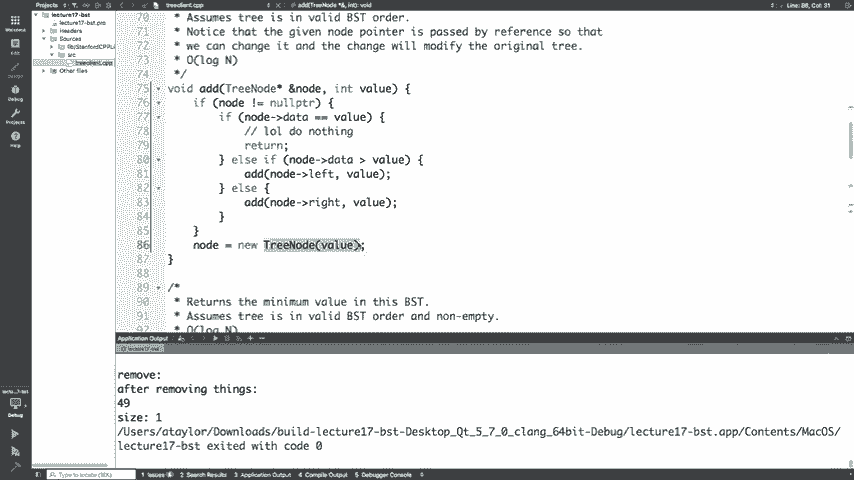

```cpp
void freeTree(TreeNode* node) {
    if (node == nullptr) {
        return;
    }
    // 后序遍历：先释放孩子
    freeTree(node->left);
    freeTree(node->right);
    // 最后释放自己
    delete node;
}
```

---

## 总结 📚

本节课中我们一起学习了：
1.  **树的遍历**：前序、中序、后序遍历是处理树问题的基础模式。
2.  **二叉搜索树**：一种具有排序属性（左子树 < 根节点 < 右子树）的二叉树，该属性递归成立。
3.  **BST 的高效操作**：
    *   `contains`：利用排序属性，时间复杂度可优化至 O(log n)。
    *   `findMin`/`findMax`：通过一直向左/右查找，时间复杂度为 O(log n)。
    *   `insert`：通过类似搜索的过程找到插入位置，并注意通过引用传递指针以正确修改树结构。
4.  **内存管理**：使用**后序遍历**来安全地释放整棵树的内存。

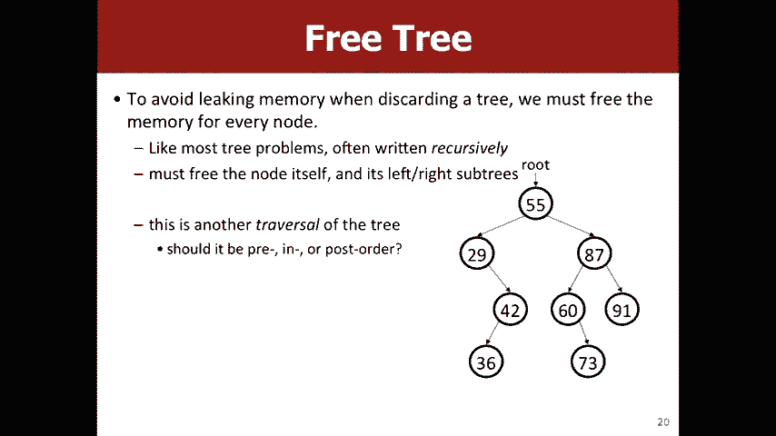

BST 是实现高效查找和动态集合的基石数据结构。在接下来的课程中，我们将继续探索 BST 的更多操作，例如删除节点。