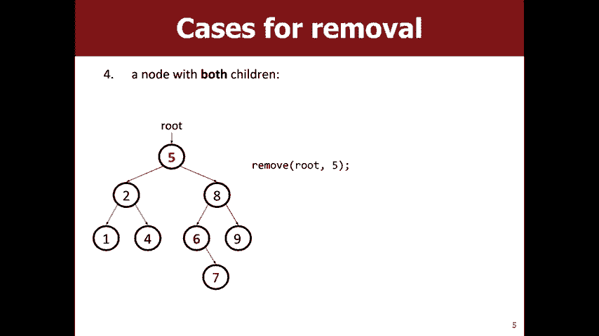
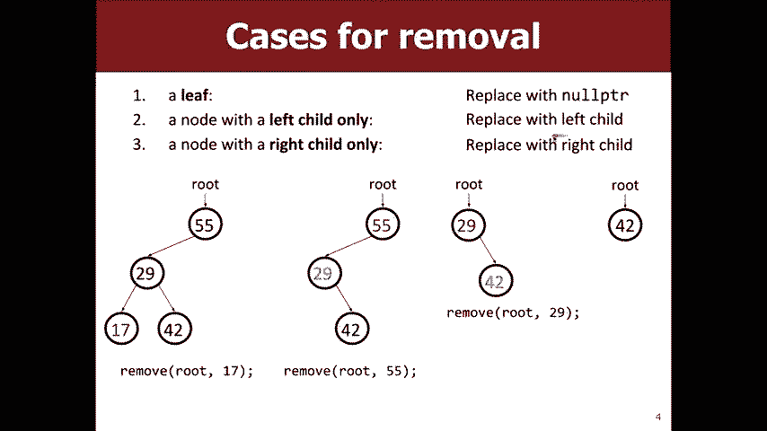
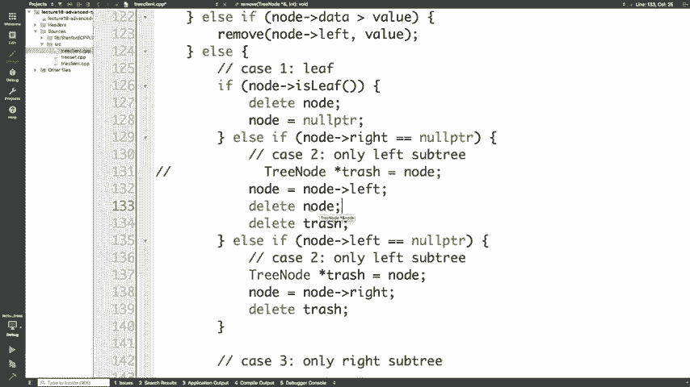
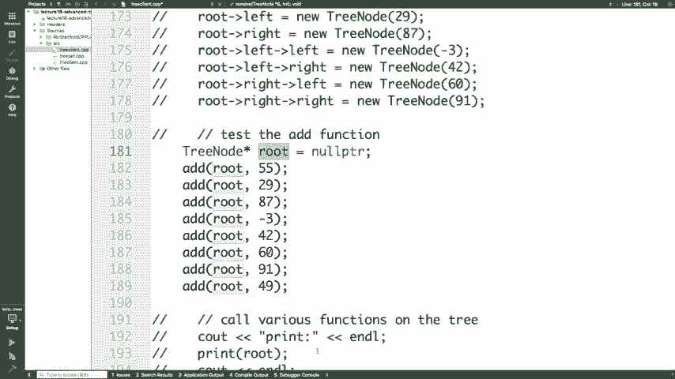

# 【斯坦福大学】CS106B C++中的抽象编程 · 2018年冬（完结·中英字幕·机翻） - P17：【Lecture 17】CS106B Programming Abstractions in C++ Win 2018 - 鬼谷良师 - BV1G7411k7jG

所以今天我们将通过讨论来结束对树木的讨论，一些高级树并完成一些我们没有得到的操作，到星期五，所以我们将使用remove然后完成二进制搜索树方法，然后。

我们将查看并查看如何使用二进制集或对不起二进制搜索树，实施设置和映射，然后我们将讨论树木平衡的概念，这真的很重要，因为这是我们获取登录时运行时间的方式，讨论，然后我们将讨论一些称为try的非二叉树。

是我最喜欢的数据结构之一，然后以一些有关，功课六今天就出来了，所以就像我们谈论的进修一样，周五的二进制搜索树，这就是其中所有内容，左边小于根，右边的一切都大于，该小组。

所以我们讨论了如何添加和包含但从BST迁移，有点棘手，所以就像其他人一样，您会发现如何删除，您知道这里的这个节点而没有违反BST属性的任何想法，这是一个更容易的情况，是的，在这种情况下，这真的很容易。

因为我们可以像摆脱这个笔记一样，否则我们仍然有一个BST ，如果我们想摆脱7怎么办，我们该怎么做呢？ ，删除7之类的东西比较困难，因为您仍然需要处理7 ，右边的子树是8，但是因为只有一个子树。

所以您可以，就像您说的那样用8替换7，好吧，如果我们要尝试做，像删除五个，是的，但是你要做什么，约翰想和一个伴侣聊几分钟是个好主意，看看我是否认为可以，让我们用节点替换这五个，真的很好。

所以也许尝试找出用哪个节点替换它，好的，Seimei想分享任何想法，所以在这里作为刷新或当我们有一片叶子时，我们说一个真的很容易，因为当我们只有一个孩子的时候，我们就可以摆脱它，我们用什么替换了它。

就像我们试图删除55我们替换了什么， 55你说的完全正确，所以当你只有一个左孩子时，你可以，只需更换它，然后如果您只有一个合适的孩子，就可以更换，具有正确子节点的节点，那么在这种情况下。

您知道我们有这个概念，如果我们要替换一个孩子，但您不能只喜欢选择或选择8 ，用权利代替，因为您仍然必须像对待所有， 8的子树是否有人有任何想法，例如可能是一个很好的音符，替换为，是的。

所以您可以尝试执行类似的操作，将五个替换为八个，所以在那一点上，我们仍然需要处理六个和九个问题，所以我，认为您处在正确的轨道上，就像我们希望将其替换为，有些东西，但是一个合适的孩子并不一定能解决。

我们仍然有这个，这个最难的孩子该怎么办是什么意思，九点六，那么六点有什么特别之处，好吧，这是六种蓝色，非常好，非常正确，您肯定在正确的轨道上，是的，太棒了，所以观察结果是六个是蓝色，六个也是最小的。

子树中的元素，因此它是此子树中的最小元素，您现在可以用六个替换这五个，我们知道六个必须更大，比这里的一切都多，因为我们知道六个大于五个，我们知道，那6较小，这里的所有内容都是因为6我们刚刚说了。

子树中的最小元素确实有意义，所以这是一个，好东西是因为我们注意到6做6时，左右审判，是的，所以子树的最小元素只会有一个正确的，之所以聊天，是因为孩子的年龄比左孩子少，像这样的最坏元素是不好的。

所以问题是为什么，我们不会为您使用可以用于，所以您可以使用最大的元素，从左侧子树中选择，或者从右侧子树中选择最小的元素，是的，但是任何一种实现都是完全，有效。

所以使用六个数字的好处是这是我们刚才谈到的简单情况，大约在上一张幻灯片中，我们可以直接执行此操作，可以替代，人们对此二进制搜索树删除的感觉还不错吗，到目前为止，最困难的二进制搜索树操作还可以。

所以我们需要，找到子零食的最小元素，我们有办法做到这一点吗，无论如何，我记得从星期五开始，我们写的一种方法，不，就像一个星期前一样，星期五没有人在这里，好吧，我不知道为什么我的。

可爱的火山口很有趣，好吧，所以我们写了印刷尺寸包含高度加得到，男人得到最大的数量，并努力消除像我们这样的方法中的任何声音，可以用yes让男人们好吧，所以好吧，为了这样，我们说有四个，案例是正确的。

但是为了达到这四个案例，我们首先必须找到，我们想要删除我记得的任何人的元素，我们正在使用二分搜索树的公式，例如如何获取该元素，我们要删除的，因此，如果数据小于该值，那么我们要做什么是好的，所以如果。

我们正在寻找的价值大于我们目前所处的价值，如果您认为自己处在正确的轨道上，我们想向左或向右走哪条路，是的，您说对了，因为路线右边的所有东西都比，我们要寻找的路线和价值比桥梁还大，说正确的删除节点。

让我们看看如果节点数据大于呼叫您返回，好，所以我们有四个案例了，子树右子树，好吧，如果那是一片叶子，我们要怎么办，但是，是的，所以我们可以说好吧，我们将此节点设置为null指针，嗯。

关于这件事的一件事就是那个节点发生了什么，内存中存在的结构仍然存在吗，所以我们要做什么，做那个是的好吧，所以你可以调用删除节点，然后不，它等于空，指针好，所以我在这种情况下，我们只有左边的子树。

所以问题是当我们删除该节点时，在这种情况下，我们是否必须创建一个临时值，因为我们不是，对那个节点做任何事情，就像我们不需要从中获取任何信息，该笔记或类似的东西，但我们会在需要的地方看到其他示例。

做一些临时的工作，是的，你能看到吗，就在那里，好酷，是的，所以问题是为什么我们要删除此注释并将其设置为等于，空指针，就像我以为大家都说过，您不需要这样做就可以了，所以，发生的事情是当我们删除便笺时。

我们肯定需要删除它，因为，我们不希望该知识存在，但您还需要将其父对象设置为，指向该节点的父指针等于null，因为您不希望这样，父指针继续向下指向不像那样的内存，不是垃圾，所以在这种情况下。

您必须同时做这两种事情，是的，有点像ADD，我们必须如何将节点设置为等于，新节点基本上是相反的，那当您，关于这种情况还有什么其他疑问？ ，在这种情况下做的正确，所以问题是当您删除笔记时实际上是什么。

如此发生，好吧，对不起视频中的人上课，好的，就像人们看到这部分感觉如何，竖起大拇指，很大的问题是问题是因为通知按价值传递给他，通过引用，当您说等于null不会改变任何内容，好的观察。

所以我们应该怎么做才能通过引用，所以总的来说，随时进行修改，就像任何形式的链接数据结构一样，列表或通过引用传递给它的树是最好的选择，加上星期五的精彩观察， [音乐] ，对，好的，这些都是很好的问题。

好的，所以当我们有正确的注释时，将其作为空点作为空指针，所以我们只有一个左子树，我们想要做什么，这暗示着。

在这种情况下，我们想用左杆代替它，但是我们该怎么做。

我们将拥有类似node等于right左右的东西，但这就是全部，我们需要做的还有其他吗，是的，是的，所以我们需要举行，我们需要创建一个，临时变量，因此这可以回溯到您关于我们是否需要一个，垃圾变量。

在这种情况下我们这样做是因为我们需要从，我们要删除的那个节点，然后我们删除垃圾，然后我们，在正确的情况下做相反的事情，那么您对此有什么疑问，两种情况，是的，所以问题是我们是否需要将垃圾桶声明为旧的。

指针，因此在这种情况下，如果您只是删除叶节点， 。

希望父母将其拉为零，这样，正确的情况下，我们不希望29继续指向任何东西，所以我们，会在左侧产生或，因此他会将29指向左侧的null，但在，在这种情况下。

我们实际上希望公平地将29替换为在其中删除29的位置，如果我们要使55指向null，则想用42代替29 ，那么您最终将不会失去整个42个子树，从这里树，这就是为什么我们在这种情况下不做空指针的原因。

将其设置为等于我们现在而不是说它-不，我们等于说，聪明的孩子那里有一台笔记本电脑，这很合理，其他人也有，问回去是的，所以问题是为什么我们有这个垃圾指针所以。

假设我们没有此权限，因此在这种情况下，我们可以选择删除，像这里这样的节点-在这里删除节点您无法使用剩下的节点做任何事情，因为，左边的节点不再存在，只是叛逆而已，或者，想在这里删除节点。

就像在删除节点一样，重新分配给新值，因此在这种情况下相当于删除。

 42，而不是删除29个大问题，您准备好应对非常困难的情况。

好吧，在这种情况下，我们必须再次使用哪个功能，所以得到最小的，不好，所以我们说我们要替换节点附近的值，用最小值正确删除，所以我们不需要喜欢重新排列树，我们只想替换该节点。

所以如果您可以通过说节点数据来做到这一点，等于最小值oops，然后对，这很有意义，所以这就是我们有五个，我们想用六个代替它，所以我们可以。

只需将6的数据复制到节点5中，那么我们现在这里有6 ，五对是的，所以您要在这里而不是获取最小的节点对是。

节点权的最小值，这样您就可以得到最小值，子树而不是整个树的最小值，好吧，那太好了，我们现在有一个六层，我们还需要做什么呢还有另外六个在这里，所以，我们需要怎么处理那个节点六。

一些基本案例实际上就像是另一种基本案例。

可能是完全使用此删除功能，是的，是的，所以我们想在左侧或右侧的节点或节点本身上调用remove，所以，我们想正确处理节点，因为如果要在节点本身上调用remove ，我们将最终删除刚才更改正确的那个节点。

这样就不会，很好，好的，所以我们在右边的节点上调用remove，然后寻找一个最小值，基本上，这段代码正在做的是，好吧，让我们找到最小，像这样的六个值，让我们用六个替换五个节点，而不是，五个。

然后我们从树中删除六个，但这实际上正在接近，基本案例，因为我们知道该案例将在此处出现，这是更容易的情况，是的，最小值是，所以问题是，例如如果树中不存在最小值，get min必须返回一个。

就像假设我们的代码在星期五是正确的一样，我们将返回一个值，该值在您的树中是一个很好的问题，是的，所以，保证是树坐着，我们会尽一切努力是的，是的，好吧，问题就像这些第一个调整语句是什么。

就像您的规范BST代码一样，我们只是往左走，正确地找到您想要做某事的节点，是的，这仅仅是，就像寻找要删除的节点，然后我们终于在这里找到它， ，然后我们讨论了这四个案例，所以案例一是叶子。

您只是想将父级设置为等于空指针，然后第二种情况是，我们可以用它的孩子代替它，然后第四种情况是，第四种情况是整棵树，我们需要找到最小的树，值，然后将节点替换为最小值，然后删除，树的最小值，所以好消息是。

这与vsts一样困难，真的很喜欢，如果得到的话，你会像钉钉子一样，还有其他，有关于这个的问题。

所以我们花了很多时间谈论BS T，您可能想知道我们为什么，这样做，这就是斯坦福基本上是如何设置邮票的方式，斯坦福地图已实现，这就是为什么当您遍历自己的，设置您会得到正确的订单，这与我刚刚拥有的哈希不同。

随机值，因为BS密钥是有序的，这也是为什么，登录时搜索添加和删除元素的原因是因为二进制搜索树，有一个准时的博客，所以我们只写了add contains并删除了，基本上需要一个类似的东西。

您知道我们可能喜欢这个树集，将具有这些添加包含和删除方法，但它们不会占据屋顶，因为您的二进制文件集应该只包含正确的单词，例如，当您使用斯坦福集时，您不必像哦，这是，我正在传递的树节点根，您不必跟踪。

那个球可以让球保持正确的位置，所以一个很普通的事情是，您将拥有这样的服务，这就是您作为客户的目的，回忆起使用集合或地图的人，然后此功能将，就像一些助手一样打电话，这是我们星期五在课堂上编写的代码。

而今天，它只是作为该节点的根节点传递，感觉是的，所以好消息是，是的，问题是我们假设我们，根据这些参数构造一条路线，只是班上的一员，所以在发生什么事之前。

方法和下面这是我保留的一项根本权利，跟踪主要方法，我在这个根上调用广告，您可以想象，您将需要这棵树集，然后您才知道它跟踪根，本身，这样客户就不需要做我在这里所做的事情了，是的， 。

问题就像我们为什么要保留为什么不能为什么客户不能只是保留，跟踪根，所以您可以想象一下，在第一周我们就好了，所以，我们正在学习设置和映射它，所以有一个像树一样的东西，节点星。

您需要首先将此值设置为null指针，然后像，您需要像这样传递但不要担心，因为这是此数据结构，对继续前进真的很好，就像是的，我一直在使用向量，所以，这就是为什么您想要在计算机科学中很喜欢很多次。

您想向用户隐藏一些实施细节，以便，在这种情况下，您想要隐藏起来，就像实际上是二进制搜索一样，用户并不真正在乎的树，它只需要代码，就需要数据，工作的结构和时间的反弹，我们保证是正确的，题。

好吧，好吧，嗯，这对性别而言效果很好，但是地图上有键和值，因此您可以，有点想像你不会有那样的单一拉伸，就像一个正确的值，您现在将存储密钥，并且膝盖可以存储一个值，无论您想要什么类型。

然后重要的是您有一棵树，这是二进制的，它是由键排序的，而不是由键的值排序的，为什么对您来说真的很快，就像我按到键一样，您只能，像一个键但唯一的键，但是您可以拥有相同值的倍数。

之类的事情是因为您在密钥上有这个二进制搜索树，所以，您基本上就像一组键，每个键都有一个关联的值，与它有关的集和地图的另一个棘手的事情是你，必须实现这个左侧，我不知道你们是否尝试过。

创建像您自己的结构一样令人困惑，但如果您没有遇到怪异的事情，问题可能是因为，太好了，您对斯坦福的资产和地图有什么疑问？ ，实施yeah键锁，嗯，好吧，问题是不应该锁定与Jack的连接，就像。

这些是按字符串排序的，所以它是JKL，所以J小于K但L更大，比K高，这就是为什么L在此子树中，而J在此子树中，以及，您可以看到这些值基本上只是随机的，我认为，没有对值的排序，这就是为什么很难像这样写。

包含值函数，但是写包含键真的很容易，所以基本上，我们刚才编写的所有方法在map中都有一个类似的方法，因此您，已放置要添加的包含键，包含和删除或删除另一个，您必须像get方法一样编写的大更改才能获取值。

与键相关联，但是与包含非常相似，只是，而不是返回true或false，您将返回实际值，与之相关的信息，所以我知道我只是说斯坦福图书馆基本上使用，一个二叉搜索树，它实际上对其做了一些修改，原因是。

它不是一个像普通的二进制搜索树，它被修改为具有，所谓平衡的东西，所以这个重要的原因是因为当你，不平衡的二进制搜索树让您失去日志和运行时，就像，例如，如果您插入，元素按此顺序排列。

例如5然后1然后2然后4然后3然后是，是的， ，最终像这样结束了，基本上是元素，所以与其让您知道一棵漂亮的树，每L个级别基本上就像一侧的另一半元素，另一半你会得到很多，所以如果你有这条线。

在这棵树上做类似包含的东西的时间是多少，您只需要自己像一个非常精美的链表，那不好，为了防止这种情况发生，这是极端的情况，的情况下，虽然您可以想象您是否像一千个节点那样关闭了，在这里的活动中。

您可能想知道一个子树990中有十个，另一个子树中有，那仍然是非常糟糕的，所以并不一定需要像，直线仍然让您仍然有很糟糕的朋友时光，所以基本上，平衡树是您只需要确保子树本质上就是其中之一。

相同大小或非常接近相同大小，因此我们的斯坦福图书馆，实际上有保证内置，并且有一些类似的修改，您可以做的是确保获得平衡树，因此一个示例，您可以做的是称为红黑树的事情，您将了解更多，这些。

如果您想继续进入计算机科学，没有人编码红黑树，​​您不需要知道如何编码红黑树，像这样的课程的树，但基本上的想法是你做一个叫做，树木旋转来维持平衡，就像你一样，节点着色，以确保只有这么多的节点和一个子树。

与另一个子树相比，如果您有兴趣的话，那会很复杂，看起来更多，但斯坦福图书馆将实现类似，这个不错的公告考试分数简短超时时间是，在成绩范围内发布，因此如果您之前没有做过很好的跳过帐户。

您可以通过对课程入门代码进行分级来实现此目的，如果您的屁股，字张贴在广场上，您也可以访问我们的网站获取统计信息， ，升级信息，有些人可能做得还不够好，但是，本季度仍有很多机会获得积分。

像这个期中考试丝毫不表示您喜欢计算机，科学，这是我们必须做的一门考试，而且还有很多，本季度剩下的机会，无论您想要什么成绩，都能获得出色的成绩，并且，那么另一件事是因为马蒂（Marty）不会去校园。

艾米和我都增加了办公时间，您可以看看您是否去，转到网站上的员工页面，很好，所以我答应我在这里谈论尝试，这是我最喜欢的数据，结构，所以尝试工作的方式我们一直在讨论二进制树，有一个左孩子和一个右孩子。

有人说些什么，嗯，所以，你有一个左孩子和一个右孩子，但是逻辑上的问题就像为什么，我们不能这样做，我们想要多少个孩子，而尝试是，像是的，是的，我们可以这样，所以尝试的方式是每个节点基本上都在存储。

像您一样，它用于存储字符串，这就是斯坦福词典的方式，实现，因此每个节点有26个子指针，每个字母对应一个，字母（如果您正在为其他语言编写词典） ，取决于该字母的大小的指针很少，所以基本上您。

想如果您跟随您知道一个指针，然后是T指针，然后， e指针会拼写出单词8，所以想法是当您，就像跟随那些指针往下走一样，尝试最终会导致失败，节点，如果该节点的单词是true，则表示您没有单词， ，如果没有。

那么您就不会工作，但是就像不错的事情是，如果没有，他的话是对的，但是就像您仍然在尝试添加一个节点那样，表示您对单词的前缀是正确的，所以您可以想像哦，你什么都不是，但是哦，你仍然可以呆在节点上的唯一原因。

因为你是因为你最终会建立，或者如果您遵循正确的指针，那么我就像一个更清晰的例子，我承认，所有空指针，因为否则将有20个大小为26的数组，这很难理解，但是您可以想象他们实际上就像。

您在该数组中也是23个空指针，所以如果您尝试欺骗，你试图看到好吧，这个词是我们部落中的一个词，我们，将从这里开始，好吧，第一个字母是一个，所以我要去，放下指针，下一个字母是T，所以我要放下T指针。

下一个字母是e，所以我要下e指针，看它说单词是，是的，因此，如果我们尝试将其视为，曾经在我们的词典中是一个词，我们会走的很好，然后是N，然后是C ，为空，所以我们会说好吧，一旦尝试中一言不发。

您有什么疑问，关于尝试，是的，所以问题是我们是否像一个人一样，以及我们如何，知道on是一个有效的单词，因为那不能仅仅作为前缀，因为一个，所以这就是为什么我们有这样的词字段是因为当您，继续说下去。

我会说是对还是错，因为你会说英语，和其他语言确实有作为其他单词前缀的单词，因此您只是，就像一个布尔标志，如果您是一个单词或不是一个很好的问题，是的，问题是按照定义，尝试中的所有叶子都是单词，是的， 。

是真的，您还有什么其他问题好吗，是的，所以我们没有时间，写包含前缀，因为我确实想谈论霍夫曼，但本质上，这个想法是可以的，如果您碰到一个空节点，则您不是前缀，因为您已经，放弃尝试。

然后如果单词中的字母用完了，您会喜欢，跟着下来，你仍然在尝试中的一个节点，那么你是一个词，然后要获得下一个字符，则减去，请先输入ASCII字母或ASCII值，以找出哪个，要去的指针。

然后您知道递归沿着那个孩子走，所以大，区别在于您拥有左右数组，而不是左右，指针作为提示，您可以对霍夫曼使用类似的方法，作业6，您需要在字符和数字之间转换，对，所以您可能要减去而不是减去a的值。

零的值您对尝试有什么最后疑问？ ，您想去哪里霍夫曼，所以今天要写作业六，基本上你在做什么，编写一种压缩方案以使文件更小，以便ASCII有一个，每个字符正确的字节数，无论怎样，都具有相同数量的喜欢。

就像没有人使用过的怪异标点一样占据了相同的质量空间，因此，相反，我们要做的是像可变长度，会像空格一样，而A小于一个字节，好吧，这些只是四位而不是八位，但是您得到了一些东西，像Z可能更长，但这没关系。

因为我们使用的Z更少，如果您有一个很大的文件，我们总体上会这样做，您的文件仍然会，较小，所以我们的想法是我们将在您拥有的地方创建一棵树，有一个左指针和一个右指针，您有一个零和一个指针，所以您。

知道左需求接近于零，右意味着趋向于一，然后这个想法是，例如，如果您在树中较高，那么您将在较短的二进制文件中下降，值是很好的，因为那样的话看起来就像是压缩的方式，工作正常，因此要执行此操作。

基本上是一堆步骤， ，在讲义上有概述，但您需要计算每个出现的次数，文件中的字符，就像逐字符读取文件，然后，将字符和计数放入优先级队列，以便您，刚写完的作业又回来了，那么您想使用。

优先级队列以创建霍夫曼树，然后遍历该树以查找，字符到二进制映射，因此我们遍历此树的方式有点类似，我们如何遍历尝试，您将如何建立这个，根据您要指向的指针，然后针对其中的每个字符的字符串。

然后将其转换为压缩二进制版本的文件，基本上，当您进行此设置时，您想知道当您离开时，你想喜欢一个事实，那就是你只走了零，你走对了，你想保持追踪，所以只要走一个就行，你就会，用这种方式建立你的弦。

那么当您解压缩时，您需要喜欢从某个地方开始，然后喜欢，选择是向左走还是向右走，具体取决于您阅读的是1还是0 ，关于霍夫曼的一件好事是，您永远不会有前缀，就像是对字符的有效编码一样，所以您不喜欢。

在你的树的中间并以一个类似的结局结束，在这里输出这个字符，或者我像所有有效字符一样继续前进，是叶节点，有一些输入，并通过此分配输出内容，因此您将使用位流，输入和输出单个位而不是完整字符，因为再次。

该设计的重点是喜欢压缩文件，因此您需要在，位级别而不是角色级别关于霍夫曼的任何问题都让您兴奋不已，好的，我星期五见。

