# 课程名称：CS106B C++中的抽象编程 · 第17讲：高级树结构 🌳

## 概述
在本节课中，我们将结束对树结构的讨论，学习一些高级的树操作和概念。我们将完成二叉搜索树的删除操作，探讨如何使用二叉搜索树来实现集合和映射，并介绍树平衡的重要性。最后，我们将了解一种非二叉树结构——Trie树，并简要介绍与作业六相关的霍夫曼编码。

---

## 二叉搜索树的删除操作

上一节我们介绍了二叉搜索树的基本概念和添加、查找操作。本节中，我们来看看如何从二叉搜索树中删除一个节点。

删除节点时，需要确保不违反二叉搜索树的属性。根据要删除节点的子节点情况，我们可以分为四种情况来处理。


以下是删除节点时可能遇到的四种情况及其处理方法：

1.  **删除叶子节点**：如果要删除的节点是叶子节点（没有子节点），操作很简单。我们只需将其父节点指向该节点的指针设置为 `nullptr`，然后释放该节点的内存。
    ```cpp
    // 伪代码示例：删除叶子节点
    parent->child = nullptr;
    delete nodeToRemove;
    ```

2.  **删除只有一个左子节点的节点**：如果要删除的节点只有一个左子节点，我们可以用它的左子节点来替代它。
    ```cpp
    // 伪代码示例：用左子节点替代待删除节点
    Node* temp = nodeToRemove;
    nodeToRemove = nodeToRemove->left;
    delete temp;
    ```

3.  **删除只有一个右子节点的节点**：与情况2类似，如果要删除的节点只有一个右子节点，我们可以用它的右子节点来替代它。
    ```cpp
    // 伪代码示例：用右子节点替代待删除节点
    Node* temp = nodeToRemove;
    nodeToRemove = nodeToRemove->right;
    delete temp;
    ```

4.  **删除有两个子节点的节点**：这是最复杂的情况。我们不能简单地用其中一个子节点替代，因为这样会破坏BST的结构。常见的策略是：
    *   找到该节点**右子树中的最小节点**（或左子树中的最大节点）。
    *   用这个最小节点的值覆盖要删除的节点的值。
    *   然后，递归地在右子树中删除那个值最小的节点（此时它最多只有一个右子节点，属于情况2或3，处理起来很简单）。

    例如，要删除值为5的节点（有两个子节点），我们找到其右子树中的最小节点6，将5替换为6，然后在右子树中删除原来的节点6。

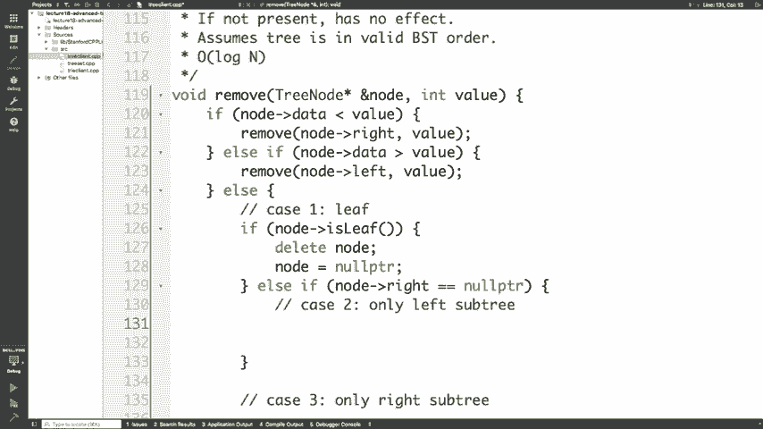

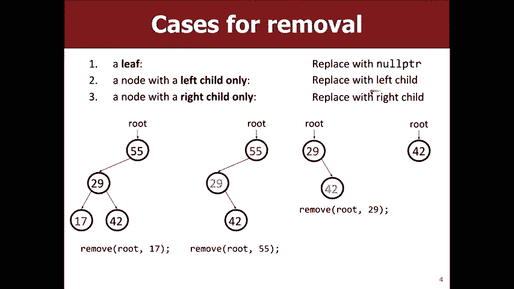

---

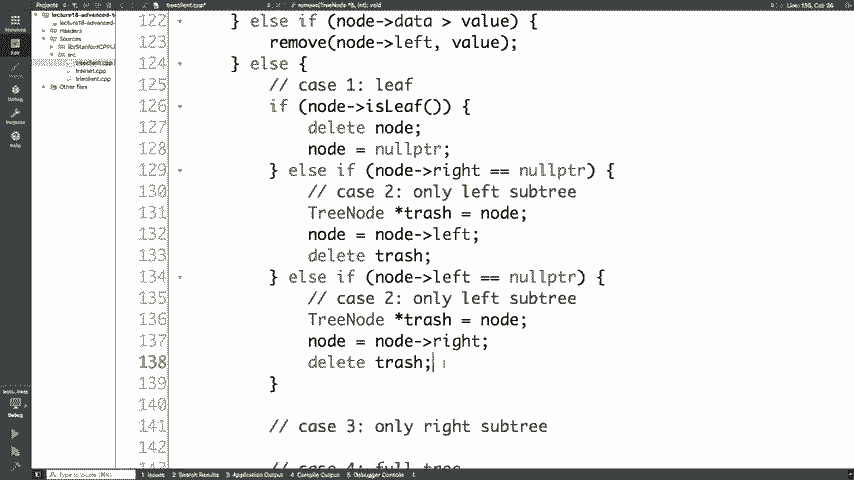

## 使用二叉搜索树实现集合与映射

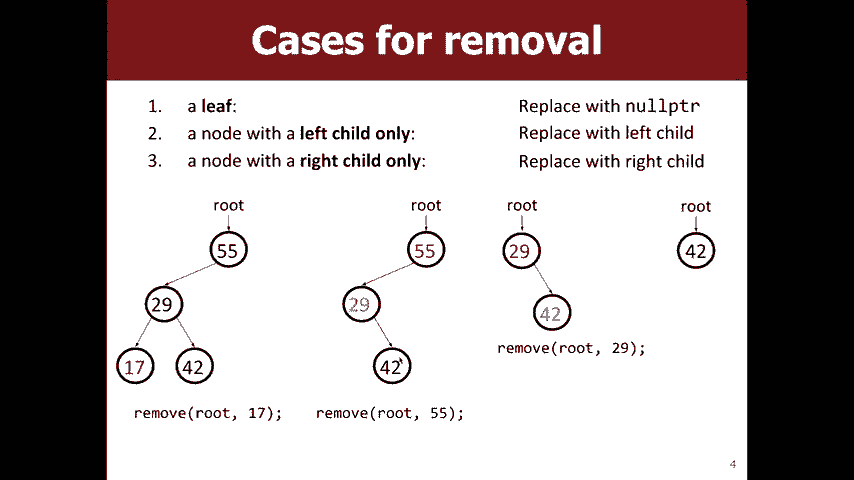

理解了二叉搜索树的核心操作后，我们来看看它如何作为更高级数据结构的基础。

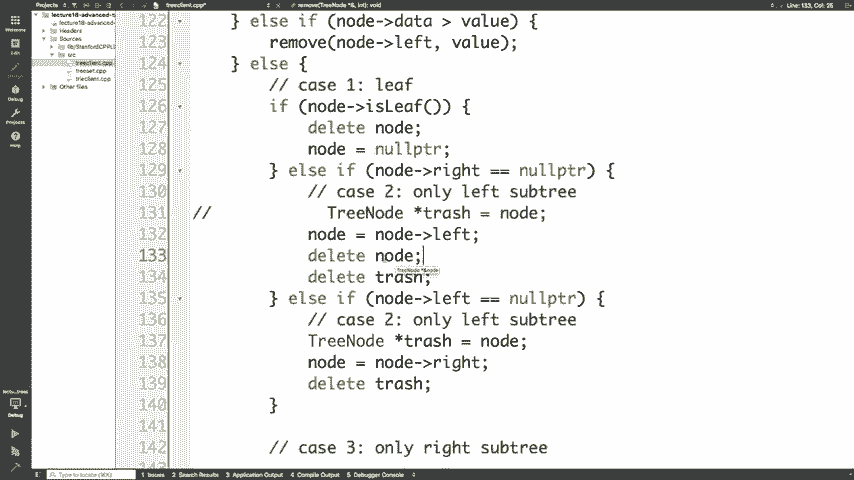

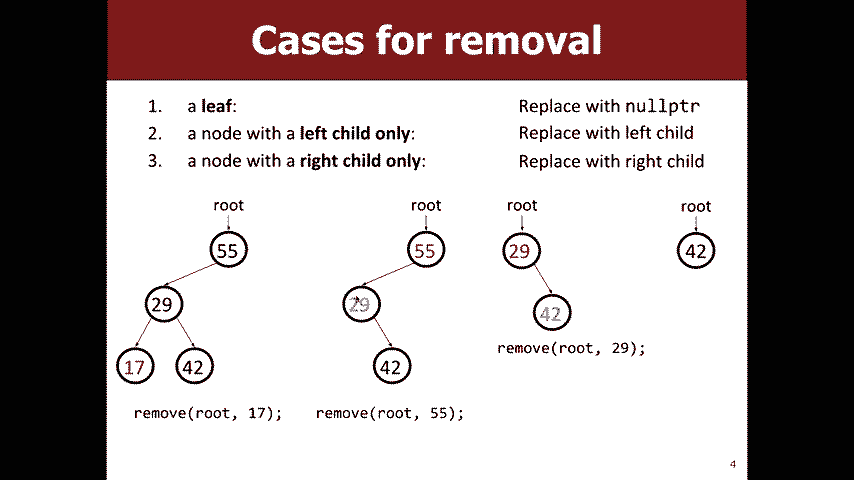

**集合** 是一个不包含重复元素的数据结构。我们可以使用二叉搜索树来实现它，树中只存储键（key）。`add`、`contains` 和 `remove` 操作直接对应于我们刚才讨论的BST操作。

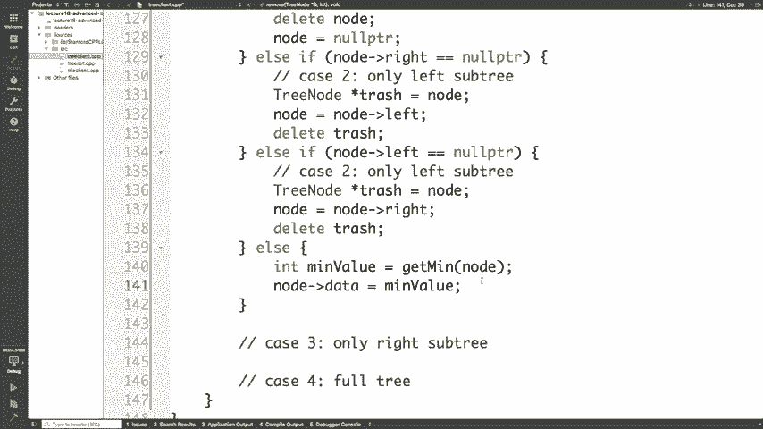

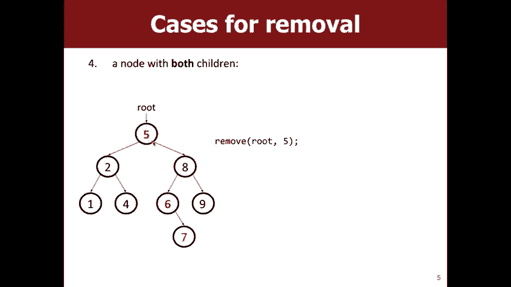

**映射** 是键值对的集合。实现映射时，二叉搜索树的每个节点不仅存储一个键，还存储一个与该键关联的值。树仍然根据键来排序，而不是值。因此，像 `containsKey` 和 `get`（根据键获取值）这样的操作可以高效地实现，但 `containsValue` 则不那么高效。

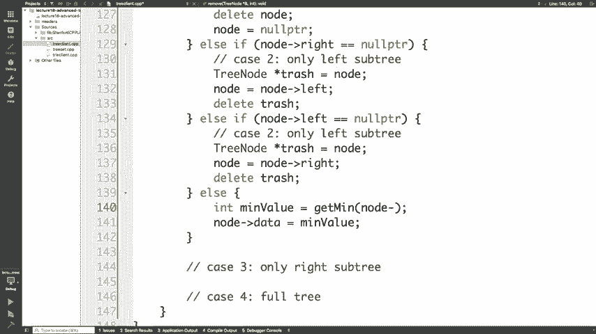

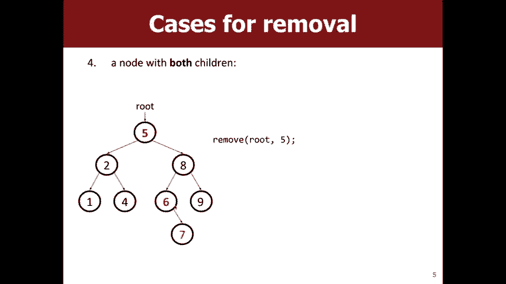

在实际的库实现（如斯坦福的库）中，会用一个类（如 `TreeSet` 或 `TreeMap`）来封装二叉搜索树的根节点，对用户隐藏实现细节，只提供简洁的接口。

---

## 树的平衡 ⚖️

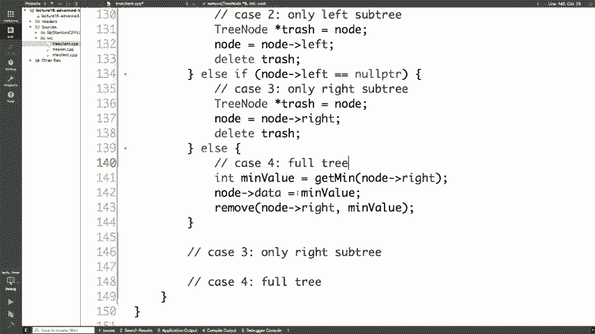

我们之前提到，二叉搜索树的操作时间复杂度理想情况下是 **O(log n)**。但这依赖于树是平衡的。

一个**不平衡的二叉搜索树**可能会退化成类似链表的结构。例如，如果按顺序插入 1, 2, 3, 4, 5，树会变成一条向右倾斜的链，此时查找的时间复杂度会退化到 **O(n)**。

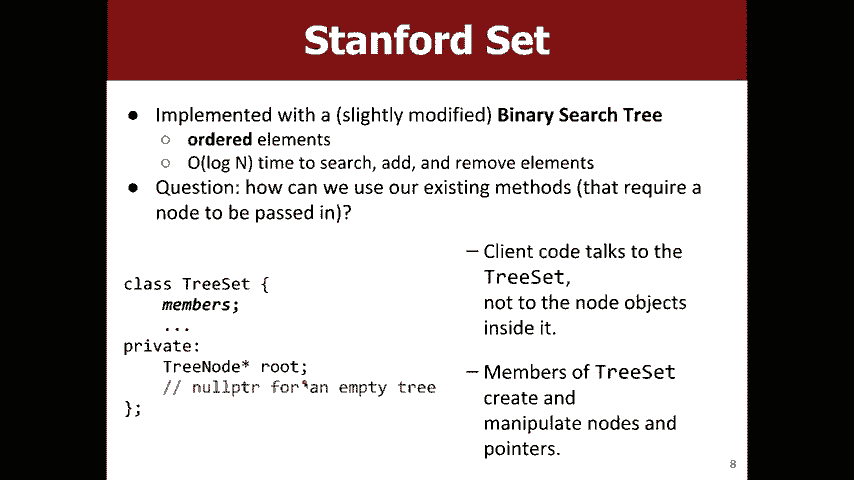

**平衡树** 的目标是确保树的左右子树高度大致相等，从而维持对数级的时间复杂度。实现平衡的算法有很多，例如红黑树或AVL树。它们通过“旋转”等操作在插入和删除时动态调整树的结构。虽然我们不需要在本课程中手动实现这些复杂结构，但理解平衡的概念至关重要，因为它是保证高效操作的基础。

---

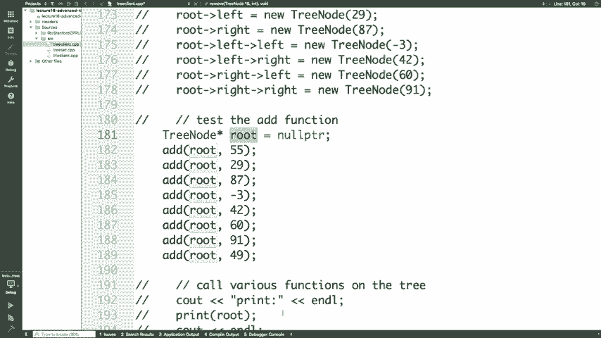

## Trie树：一种用于字符串的非二叉树 📚

之前我们讨论的树每个节点最多有两个子节点。Trie树（前缀树）是一种特殊的树，用于高效存储和检索字符串集合。

在Trie树中：
*   每个节点代表一个字符（或字符串的前缀）。
*   从根节点到某个节点的路径构成了一个字符串。
*   每个节点包含一个指针数组（例如，对于小写英文字母，是大小为26的数组），指向可能的下一字符。
*   节点中的一个布尔标志（如 `isWord`）用于标记从根到该节点的路径是否构成一个完整的单词。

例如，存储单词 “ate”：
1.  从根节点开始，跟随 ‘a’ 的指针。
2.  到达代表 ‘a’ 的节点，再跟随 ‘t’ 的指针。
3.  到达代表 “at” 的节点，再跟随 ‘e’ 的指针。
4.  到达代表 “ate” 的节点，并将其 `isWord` 标记为 `true`。

查找一个单词或判断一个前缀是否存在非常高效，时间复杂度为 **O(m)**，其中 m 是单词长度。

---

## 作业六：霍夫曼编码简介

今天发布的作业六涉及实现一种文件压缩方案——霍夫曼编码。

其核心思想是使用**可变长度编码**来替换固定的ASCII编码。出现频率高的字符（如空格、’e’）用较短的二进制串表示，出现频率低的字符用较长的二进制串表示，从而在整体上减小文件大小。

实现步骤概述：
1.  **统计频率**：读取文件，计算每个字符出现的次数。
2.  **构建优先队列**：将每个字符及其频率作为节点放入最小堆（优先队列）。
3.  **构建霍夫曼树**：
    *   反复从优先队列中取出两个频率最小的节点。
    *   创建一个新的内部节点，其频率为这两个节点频率之和，并将这两个节点作为其左右子节点。
    *   将这个新节点放回优先队列。
    *   重复此过程，直到队列中只剩一个节点，这个节点就是霍夫曼树的根。
4.  **生成编码表**：遍历霍夫曼树，向左走代表 ‘0’，向右走代表 ‘1’。到达叶节点时，就得到了该叶节点字符对应的二进制编码。
5.  **压缩**：读取原文件，根据编码表将每个字符转换为对应的二进制位流，并写入输出文件。
6.  **解压**：读取压缩后的位流，从霍夫曼树根开始，根据每一位是 ‘0’ 还是 ‘1’ 决定向左或向右移动，到达叶节点时输出对应的字符，然后回到根节点继续处理下一位。

霍夫曼编码的一个关键特性是**前缀码**：任何一个字符的编码都不是另一个字符编码的前缀。这保证了在解码时不会产生歧义。

---

## 总结

本节课中我们一起学习了：
1.  二叉搜索树中**删除节点**的四种情况及其处理方法。
2.  如何利用二叉搜索树作为底层实现来构建**集合**和**映射**抽象数据类型。
3.  树**平衡**的重要性，它是保证二叉搜索树操作效率（O(log n)）的关键。
4.  **Trie树**的结构与应用，它是一种高效处理字符串集合的非二叉树。
5.  作业六相关的**霍夫曼编码**基本原理，这是一种利用二叉树进行数据压缩的有效方法。

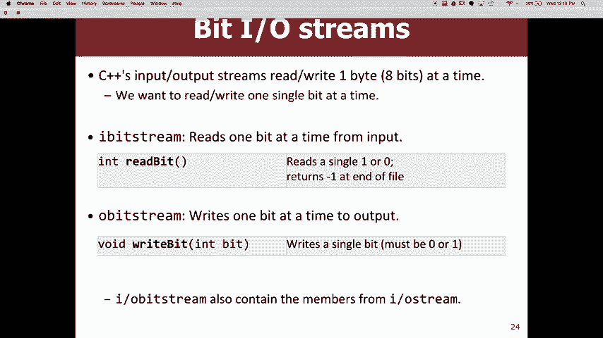

通过掌握这些高级树结构的概念，你对于如何利用树来解决复杂问题有了更深入的理解。