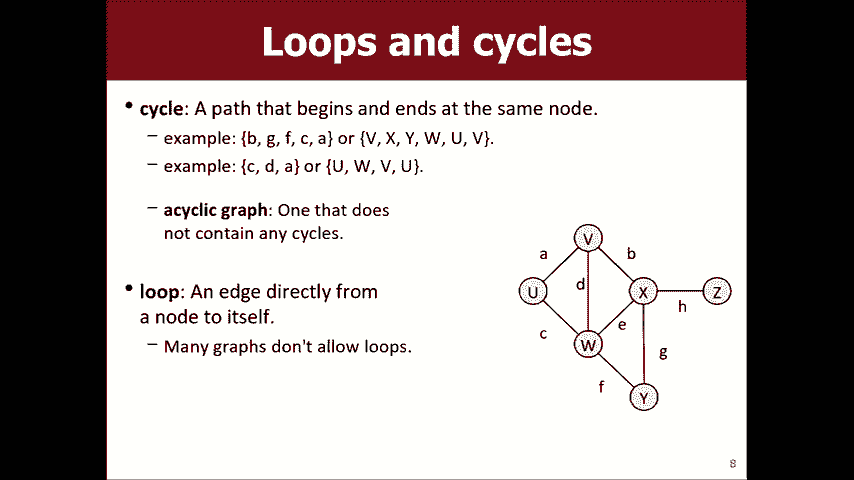
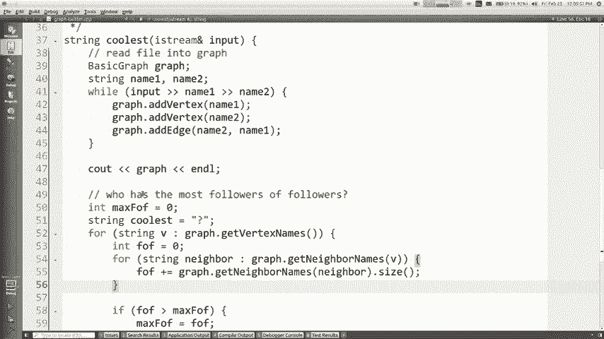

# 【斯坦福大学】CS106B C++中的抽象编程 · 2018年冬（完结·中英字幕·机翻） - P18：【Lecture 18】CS106B Programming Abstractions in C++ Win 2018 - 鬼谷良师 - BV1G7411k7jG

好吧，我假设您的掌声是感谢您的高品质，您上周参加的期中考试的权利，哦，不，也许还有其他事情，呃，不，但我确定你知道我已经参加了，有一阵子我有重要的事情要照顾，这很适合，我，我想这是父母周末，有几个。

一对父母在房子里很高兴见到您，欢迎光临CS 106 BI ，想向房间里的任何父母道歉我是你的孩子不在的原因，回应您的来电和短信，因为它们正在残酷地处理我，辛苦的家庭作业是我的错，对此我深表歉意。

但是是的，这是父母周末，因为你知道我刚刚成为一个，父母，这是我的小宝贝。

我的意思是我告诉自己，我不会花整整堂课，谈论婴儿真的很棒，她很棒，很健康，她做得很好，我今天没有带她进来。他好像5天大了，我不是，被允许带她进入大学校园，那将是我的疏忽，真的是过山车。

就像我的妻子从字面上去工作一样，期中的一天，我们就像在制作女子组合的副本和东西，上个星期左右要去照顾所有的事情，在本季度的剩余时间里，我仍然会按照一定的审核时间表，他们在家中要做一些重要的工作。

主要涉及粪便，而且我每周都会去做一些演讲，我可能会每天都在这里，星期五我可能会在每个星期的另一天，但实际上任何一天都会继续，帮助我在完成课程时弄清楚事情，但是我认为我们。

我知道通常我会给你看我的照片来奖励你上课，小狗和我的动物我想也许这次我可以给你看几个，婴儿图片很酷耶，嗯，让我们看看，等等，她在哪儿，这是夏娃的照片，我在看。

她出生时打篮球我的妻子真的很生我的气，看着她推到这里时的三分全明星大战，是在她的小卷饼包裹的东西，实际上并不难，因为所有，你做的就是把它们包裹起来，把它们包裹起来，他们喜欢，移动他们的手臂和腿。

然后很容易跟踪，之后，他们只是无法真正移动到任何地方，只需将它们变成，小墨西哥玉米煎饼，然后您就可以走开了，很容易，所以她在这里，这是她还在医院里，我无法告诉的最好的情况是她看起来更像我还是像我的妻子。

得到了我的schnoz对不起亲爱的我不知道这是我已经告诉你了这个，我认为这是我最喜欢的一张，当你，你把你的小手伸出来，他们用他们的小手抓住你的手，手指和东西只会融化你，我不是感性的类型，我什至都不是。

变成婴儿，但是以某种方式当您的婴儿这样做时，就像您整个，之后世界就不同了，我想这是我跟她开玩笑或双关语或我最喜欢的时刻之后，我想的就是，当我们要带她回家时，我必须向她介绍，我们的动物有三只狗和两只猫。

我有点害怕，这些狗会向她吠叫，是要咬还是会发生什么事，他们会跳过她的划痕吗，他们超酷，我不知道动物只有本能，他们只是看到这个小婴儿，就像我得到了这些奔放的狗一样，并跳起来。

他们基本上在天花板上进行循环去循环，它们是如此充满活力，但，不知何故，当我抱着这个婴儿在他们面前时，他们就得到了，知道他们有点像不寒而栗，他们仔细地嗅着她，他们，很安静，很温柔，这真是太好了。

这是夏娃和我的法国人，斗牛犬艾比（Abby Bullet Abby）融化了我的心，知道这是她和我的另一只狗巴尼，我的妻子谨慎地花园，但是他，前夕和我们的猫咪两只小猫真的很棒。

真的很好奇她另一只猫的照片在哪，一只猫的照片有另一只猫，小猫真的不是，知道怎么做她我想我认为狗就像想要保护她，猫就像是在说这意味着我受到的关注减少了，现在您知道，狗和猫之间的差异这里还有她妈妈。

小睡一会儿我告诉你，你知道你和某人有一个婴儿，它真的向您展示了有关您伴侣的一些东西，例如我不认识你们中的一些人，伙计们现在可能在恋爱关系中约会，我觉得，真的很幸运。

就像我找到了一个值得与我共度一生的伴侣，你真的看到，当你有孩子的时候，你知道就像你在他们的身边看到他们一样，最好的，最坏的情况是当他们处于极度痛苦中时会看到它们， 。

当他们过去两天的睡眠时间总计为45分钟时， ，真的，这是一个真正的考验，它确实向您显示了您是什么样的人，选择与您共度时光，而我妻子太神奇了，这真的，让我们在一起，你知道这真的很特别， [掌声] 。

她赚的钱比我不喜欢做的多，然后有人寄给我这张照片，我一直在谈论我的孩子，就像墨西哥卷饼，有人寄给我这不是夏娃的照片，而是，我想走了两次，我要走了，然后谈论其他，的东西，但你知道谢谢你和我在一起。

我知道这个季度，过去几周会有点怪异，我很难达到，仍然在电子邮件中我仍然在广场上我至少会在每个星期五在这里尝试，更清楚地告诉您如何联系到我，你知道艾米和阿什莉会帮助我们完成事情的，在本季度结束时。

我想简要谈谈中期和，班上的情况如何我知道我认为阿什利也许，在星期三谈了一点，但是我们给你的期中成绩打分，应该有你的成绩，现在应该可以查询，而且我还发布了一些有关您在课堂上的表现的信息。

而且你知道有些人不喜欢他们的表现，或者他们不喜欢他们，屏幕上的数字，我想我会说的是，您仍然有很多机会可以改变这一点，在家庭作业中表现出色5 6 7在期末考试中表现出色，参加本节，您还有很多积分可以赚。

如果您有不同的目标，我会看到您的成绩百分比有所提高，会说不要放弃，仍然有很多波特，或者留下了，我们的很多要点都被推到了本季度末，所以，知道我通常会说你知道继续做自己在做的事，并且请记住，您知道是否在。

有关您的情况的网页请记住，我将您的分数拟合为一条曲线， ，大约一半的人会得到A，而大约30％的人会得到B ，你知道很多人会获得比你可能更高的分数，担心会这样，所以你知道不要放弃，只是继续前进。

做你正在做的事情哦，最后一件事，我开始喜欢教你，新的东西今天我要教你一些东西，一种of样，一种结合睡眠剥夺激素的肾上腺素，所以今天心情很好，所以我很高兴能给大家，一个额外的湖，所以是的，你走了。

我想我必须花一些时间，天，所以我也应该让您过得很晚，所以无论如何都可以，我想教你一些东西，所以让我跳到现在，我们就在这里，现在在课堂上，我们刚刚学习完二进制，树，所以希望您能看到自己知道上下文。

这里的二叉树是，指针和递归的混合体，这有助于我们进一步了解您，可以实现集合Set Maps和lexicon之类的集合，您知道我们很友善，在这次旅程中，我们将了解我们所有不同的系列。

数据结构库以及它们如何工作，如何实现它们，以便我们，继续说，今天我们要学习的是，我们将开始学习一种新型的，一个叫做图的集合，图非常强大，非常有趣，所以您知道这将从今天开始，我们将在整个，下周也是好吧。

这是我在第18章图表上的幻灯片。

教科书，如果您听到单词图，您可能会想像笛卡尔平面，用x和y画一条线或类似的东西，这样V和吃掉边缘，是两个顶点之间的连接，有时它们称顶点为节点，因此它更像是链表，其中包含节点，有时它们之间的边缘。

它们被称为圆弧，所以您可能会听到其他术语，但是我，要说顶点和边缘，我认为这很常见，是的，边缘，将一对顶点相互连接，所以这是一张图形的图片， ABCD，并且在某些顶点之间有边缘，那里有一整束。

今天我要告诉您的关于图的术语一个术语是，顶点的度数是触碰到它的三个边的数量，在右上角的图片上好，所以图表非常有趣，可以用来解决一大堆有趣的计算机的数据结构，科学问题，我们将在这里快速介绍一些问题。

例如社交网络Facebook Twitter或其他哦，如果您，想看很多婴儿照我完全把它们都丢在Facebook上了，和instagram如果您想加我，我将很乐意向您展示我的所有宝贝。

图片网络通常基本上是相互连接的人物图，当他们彼此成为朋友或彼此关注时的边缘，诸如地图，航空公司地图，道路地图，Google Maps之类的东西，东西之间的联系，你知道边缘是，道路，航班和顶点。

而城市则是地点，您想通过正确的选择，所以有很多这样的例子，这就是一个图形，mm-hmm这是我所用的其他图形示例，不会经历其中的每一个，但是你知道你可以，可以将很多东西视为图，即使它看起来不像是。

首先向您显示图表，例如您可以考虑课程和，在大学的先决条件，就像你知道我的意思是什么，如果你有这样的图，那将是一个顶点，什么将是一个边缘，是，是的，当然是节点或顶点，而边缘就像某物是否是。

先做一些其他事情，是的，你可以用化学方法做到这一点，通过解决迷宫来做，有各种各样的例子链接，在网页之间，页面本身就是顶点，如果页面是链接，到另一个代表边缘的页面，这样您就可以这样思考。

我可以在其他页面上找到类似的内容，这些是一些您将使用图表的示例，它们遍布我，没有列出大量使用图形的示例，就像当您在构建处理器时布置电路时， ，各种各样的东西，所以如果你要代表一个迷宫。

您知道我们稍微想过迷宫记得我们写了一个递归，从迷宫中逃脱的算法，您能否将迷宫视为图形？ ，将是顶点，边缘将是什么，如果您的答案是肯定的，父母可以随时自愿，是的，这是一种很好的思考方式。

例如您可以叠加一个，网格上，然后您可以访问的每个小方块就像一个生日，如果可以从一个到另一个相邻的正方形之间有一条边，其他的，还有一堵墙，所以是的，这是一个很好的答案，像那些是顶点，粗线是。

他们之间的边缘那种自然的权利，你可能会成为一个图表，我知道你不认为这是为什么，认为它是一个网格图，我在这里有这些选择题，基本上，您知道很多图算法都涉及到查看邻居，你们已经写了一些像人生游戏这样的算法。

 ，涉及看给定事物的邻居，所以很多这些邻居，算法基本上是图算法，因此很多事情都可以，如果您愿意，可以将其建模为图形，您可能会说好，等等，为什么我在乎，关于这一点，我不是，我不需要晃晃成为一个图表。

我已经盐晃晃晃了，我，用来网格化，您知道我不需要迷宫即可成为图形，我可以用，递归，所以我想这引发了一个很好的问题，例如为什么我要，认为这些问题是图形问题，如果我能给我带来什么呢？ 。

已经有其他方法可以很好地解决这些问题，答案是，许多聪明的人研究了图并提出了用于，搜索图以对图进行排序图处理Brasch在，陷阱，如果您可以解决他们的问题并将其转变为图形问题，则。

可能存在一些众所周知的现有算法来解决该问题，然后找到问题的答案，这是一个非常普遍的窍门，计算机科学将一个问题简化为另一个问题，其中第二个是，有一个已知的解决方案，这是我们做的一件很普通的事情。

这就是为什么我们，可能想将这些其他事情视为图形问题，好很多次，当我们谈论图形时，我们想考虑，路径是一种从一个地方到另一个顶点再到另一个地方的方法，将顶点表示为要访问的路径，也可以将其记为一组。

沿任何一种方式走，您都可以得到相同的信息，唯一的例外是如果有多个连接的边，一对相同的顶点，但是我通常不会像，在我们今天的示例中，例如，如果您想从，在该图中顶点V到Z可以使顶点与相同路径相同，基本上正确。

当您有一条路时，您有时会担心多久，路径是您必须走过多少条边才能知道该路径，许多这样的示例，例如，如果该图的路径是航空公司的话，飞行，那么路径长度是什么样子，如果你说我有一个所有的图，今天的航空公司航班。

这条路径的长度为三，这是否意味着在现实世界中您可以从纽约飞往三家商店，芝加哥芝加哥丹佛丹佛西雅图，对，所以您可能会说您有任何路径，长度较短的话，您是否有一些打击较少的打击垫，例如，是的，无论如何。

这是我们谈论路径长度的一个术语， ，成为邻居或与另一个顶点相邻的概念仅表示，那里有一个直接的边缘好的术语，所以您知道一条路，不一定要最短或最好，或者如果我想找到一个，从u到VI的路径可能只沿第8条边线。

但这也完全有效，从u到W-x-y从W到V或其他任何可以弹跳的地方，周围可能出于某些原因，您想要更长的路径，或者某些原因，您在锻炼自己，在跑步时在跑步，您并不总是想要，最短的路径。

因为您可能要回到他的起点，所以，最短的路径就是您所知道的，因此您可能想运行一个，无论如何，您都可以走不同的路来获得相同的结果，目的地，所以这里有更多术语可以从另一个顶点到达一个顶点。

如果从第一个开始的路径上存在，在一起，如果有一条从， A到B，所以在图中显示的是每个顶点都在一个，彼此可达，只要跟随边缘，就能无处不在，在右下角有一些这样的图，如果需要，顶点是D和E再次与其他顶点分离。

现实世界中的示例，例如您的灯没有进入某些国家或，你在做管道或电插头或诸如此类的东西，网络无法到达其他网络的其他部分，有各种各样的方法，你可以想象这个朋友圈子你知道你的朋友没有，和他们的朋友成为伙伴。

所以你知道这些小朋友，右图的区域，我们称其为连通，这意味着每个，顶点可以到达其他所有顶点，因此右上角的图与，左下角是连接的右下角不是完整的图是，从字面上看，每个顶点的边都指向其他每个顶点。

这种情况很少见，但有一些例子，您知道，数据集，因此了解能力和联系非常重要，我知道，举例说过航班，我的意思是连通性很好，因为那时你，说嘿，无论您在哪个城市，都有某种飞行计划可以，卖给你。

这将带你到你想去的地方或你要塞的东西，在城市的电源线中，您说我需要确保所有设备都已连接，因为我希望每个房子都可以正常供电，这样才能达到那里的能力，某些路径称为循环循环是您最终到达的位置。

刚开始的地方并不是一件坏事或一件好事，有时您想找出没有周期的节奏或解决方案，所以您知道该图中的示例通常是vx WV ，如果您不能在同一条路径上两次遍历同一条边，请遵循，琐地猜测。

您可以只跟随母狗两次就对您说，我们通常不将其视为周期，因为您必须走同样的优势，没有任何周期的图两次被称为非循环图，废话是周期性的，我可以通过显示周期来证明这一点，对，所以您能告诉我一些可以做的更改吗。

图变成了循环，就像我必须修改以使其成为，一个循环图是的，每次等待都去掉边缘，让我不知道这些东西在这里，所以您。

说好删除边缘H我想如果我删除H，图形就不再，已连接，但II仍然可以正确循环，因为我仍然可以像这样去，如果存在任何以相同顶点开始和结束的循环，则，图仍然是循环的，所以什么也不会给我带来其他变化，是的。

删除所有边缘，我喜欢您认为先生的方式，这是正确的，回答有人可以对图形进行较小的侵入性吗？是的，您可以，去除多个边缘是的，去除C D和FCDF，因此很难，读了一下。

但是像这样一个人还在那这个人还在那这个人还在，在那里，这个人还在那里，那个人还在那里，就是你想要的，是的，对我来说正确，我猜一个启发法似乎是连接他们的正确数字，这里没有任何循环是的。

所以我的意思是您的答案还可以，我应该问一些更具体的问题，也许我应该说你能，这是周期性的，但仍然正确，所以他的答案将是正确的，嗯，无论如何，有些图具有自环，而图具有边，像这样像边缘一样走向自己。

最被称为循环，我们将在示例中使用的图表中没有某些数据，设置它真的没有任何意义，我的意思是，如果您正在做，您是否可以想象航空公司航班是否像您一样购买了从SFO到SFO的航班，只是向上飞来飞去， 。

或某种没有意义的东西，没人愿意买，那个航班和他们剩​​下的食物一样好，你不想买那个，飞行，以至于数据表明这没有意义，但有时您可以做到这一点，就像某些社交网络可以让您与自己成为朋友并了解一些东西。

有时候我可以通过聊天程序向自己发送消息，有时不知道这是有道理的，但大多数情况下我们不会在数据中包含，好，那是周期，就像我要使用这些术语一样。

可能会说嘿，让我们寻找一种算法，该算法在，在图中，您可以假设该图是循环的，并且您有时会知道，这就是我在前进过程中将如何使用这些术语的方式，所以让我们来谈谈，关于图的一些变化，您将看到一个变化是。

所谓的加权图，所以您再次知道它取决于数据集，但是，例如，如果您正在乘飞机或驾车，这是一种非常简单的减肥方法，边缘会很好，重量是飞机飞行的英里数，因此。

如果我想寻找一条从您认识SFO到迈阿密或其他任何地方的道路，那么也许，我想要重量更轻的那个，因为，我必须飞翔，还有其他方法可以加重那些无法，一定是距离，你知道像图并不总是关于。

物理空间并在地图上走动之类的东西，因为我，认为如果它们超过边缘的重量会像多长时间会很诱人，优势是，但是我想您想测试一下，您可以选择给工作人员加重的另一种方法，可以等待边缘。

这些城市之间突然之间机票的价格是多少，现在您正在尝试以最便宜的价格进行优化，我知道我们没有父母，周末，你们有时会乘飞机回家探望他们，但有时，您正在排序，您想要最便宜的一个，即使那个最便宜的一个。

额外的中途停留，在丹佛，无论您仍然购买那个权利， ，所以那样将是您可以对同一张图加权的另一种方式，好吧，我告诉你，我们将学习搜索路径的算法，我们可以搜索优化某些属性的路径。

优化长度边缘数量您还可以优化总重量，路径，这就是这里的一个例子，大多数权重被假定为非负数，这不一定很困难，规则，但是就像在许多数据集中一样，负数是没有意义的，就像他们不付钱让您搭乘飞机。

或者如果是里程数， ，没有负面的飞行，这里没有虫洞，所以重量，如果您想考虑的话，通常都被认为是积极的，图的等价性，您可能会认为未加权图是，所有边缘的权重等于1或类似的东西。

图的另一种称为有向图的有向图是，边缘只有一种方式，就像我之前向您展示的示例一样，假设您可以沿边缘的任一方向行驶，但，图上有这些小箭头，基本上我们说的是不，不，那边，只有从A到B而不是从B到A。

那么那口井的一些例子是什么，您在告诉我一些先决条件，这可能是您想要的一个示例，方向，因为106a是106 B的先决条件106 B不是106a的先决条件，命令关系的方向很重要，对吧，你不想接受那些。

如果你们中的任何一个已经报名参加下一个106次课程，则顺序错误，四分之一，你弄乱了，你就弄错了右边的箭头，嗯，嗯，所以，另一个例子是Twitter，就像我可以关注Jennifer 。

劳伦斯箭从我到她的最后一个我检查了她没有跟着我回来，尽管收到了我的无数讯息，但今天我们会再次检查两次，但您知道方向性很重要，因为我要看她的推文，有时不对我的方向性表示怀疑，有时在道路上很重要。

或者不离开单向街道而您却有两向，正确的街道，所以如果我们成为，彼此的朋友，我们都是朋友，指示如果没有您成为我的朋友，我就不能成为您的朋友，这种方式不同，因此取决于数据集的含义取决于。

图形建模权我也想提到所有这些不同的组合，图的所有这些不同属性可以组合在一起使用，加权有向图或非加权循环无向，这些不同品质的所有这些不同组合，取决于你在做什么，好吗，到目前为止我们怎么样。

到目前为止的任何图形问题，告诉你我真的很想进来我要得到我要得到我的妻子，为了帮助我，我要录制一段视频，让我和狮子王抱着我的孩子，你知道背景音乐，我真的很想喜欢，今天要给你们吃。

但是下周五我要带那是我要的，下周五告诉你，以弥补我的其他演讲，质量，但无论如何都请继续关注，所以这些是一些一般的东西，关于图，我认为这主要只是概念性的东西，我将向您展示一些。

在一分钟内用图进行编码我想指出的一件事是图，实际上与其他类型的数据结构紧密相关，我们了解了链表的相关知识我们了解了二叉树的相关知识，基本上是具有很多额外约束的图，链表是每个顶点都有的一个有向图。

最多有一个出站边是定向边，并且有一条路线，没有入站边缘的前部和[音乐] ，没有出站边的最终节点，所以它有点像，对它的约束二叉树最多可以有两个出站，边缘还有一些关于如何不能拥有两个的限制。

通向相同目的地的路径，依此类推，但这些是，图的子集，所以这很有趣，让我们来看一下，就像您实际如何用图形编码一样，这看起来像我们有一个，用于图编程的库，它称为基本图类。

我们提供给你们的斯坦福收藏图书馆和作业，启动我们给您的zip文件，称为基本图形，它代表一个，加权有向图，这样您就可以使边缘具有一种方向，如果您想，您可以对它们施加压力，所以开始它并不那么复杂。

您只需将库包含在程序中即可构建图，然后您可以向其中添加顶点和边，您知道其中一些方法，例如，如果您尝试两次添加相同的顶点，则尝试添加时会出现错误，顶点之间的边缘是不存在的，您会得到这样的错误，事情。

它的方向就像你说，从C到D 9，如果您想同时使用两种方式，则不能同时直接，我在这里用C和B完成了操作，您可以将边从B添加到C，然后从C添加到B ，基本上，这就像具有一个方向性的边缘。

这就是基本图形的入门方法，这里是一些，基本图形库具有的方法和成员可以添加边和，您可以清除的顶点可以将所有顶点或边作为一个集合进行索取，您可以遍历它们，您可以请求顶点的所有邻居， 。

它会告诉您所有您可以行跳跃到该顶点或从该顶点到达的顶点，只是去除东西边缘，您可以要求提供可以打印出图形的尺寸，这是一个非常标准的东西，您在顶点及其顶点之间知道，邻居，所以这就是我想要做的一点编程问题。

你们只是这样，我们可以喜欢玩这个库一秒钟，并得到，熟悉它好吧，所以我认为我不需要给你看这张幻灯片，但让我，来吧，让我快速回到幻灯片，我会回到那，所以我想，写一个叫做“最酷”的东西。

我将在其中读取一个完整的Twitter文件，追随者，然后我将找出谁的追随者最多， ，因此，此文件的各行上都有两个令牌，每个令牌有两个单词，或者，命名或其他名称，如果显示2则表示1号人是，跟着第二个人。

好吧，我想输出，跟进他们的追随者的大多数追随者确实是有道理的，所以这里。

我在队列创建器中，我想编写此最酷的功能， ，文件作为参数，所以在这里我想和大家一起写这个，好的，也许我可以帮助您入门，因为您知道其中一些，只是要读取文件，所以如果您想查看文件，它看起来像。

这个Twitter点txt只是一堆名字，这意味着斯图尔特跟随马蒂，海伦跟随埃尔默，以此类推，如果我想读那些话，我想我可以做这样的事情，字符串行，而从输入到该行获取行。

变量实际上您知道每行只有两个令牌的原因，我想我也可以只用一个名字来命名字符串，也可以输入，箭头名称一个，然后也是箭头名称-只需读取两个单词两个标记，如果无法做到这一点，它将给我一个错误。

因此我正在读取两个名称，我想用这些名字做什么？有人帮助我，我想，想要崩溃，好的，所以您说如果图形不包含名称，我应该添加节点，名称，所以我认为您的评论中隐含的是应该有一个，正确的图。

让我们做一个基本的图调用图，然后我可以做，图点添加顶点名称一和名称-我忘了让我们仔细检查一下，如果调用给定名称为add vertex且该顶点已存在，则执行该操作，已经存在没有任何好处。

所以mm-hmm如果可以的话，我们可以添加它们，他们已经在那里，那会没事的，然后还可以，在这两个人之间放置一条边，好图从名字1添加边到，像这样命名两个，如果您想查看是否有正确的图形，您可以说。

看看图和所有，只是看看它是否有效，看起来还不错我这里有一张满是名字的图表，有点难以阅读，但基本上先打印所有顶点，然后再打印每个边缘，小箭头，所以我认为与文件匹配，所以我们得到了一个图形，在其中有数据。

该图可以，我如何确定谁是大多数关注者，如果只是追随者怎么办？我如何看待最追随者？ ，知道，是的，就像您拥有的邻居数量一样，程度是，追随者的数量很多，我想指出的一件事就是，想知道一个人有多少追随者。

所以我们说这是詹妮弗，劳伦斯就在那里，这是我马蒂，就在这里，我就像是，我遵循这样的权利，这就是我们的图形将要存储的内容，因此，如果您愿意，知道有多少个邻居j-law你知道有一种方法，叫获取邻居。

但获取邻居会告诉你有多少出站，边缘，有多少人在跟着你，你知道我的意思，所以我，认为我们遇到的问题是我不想知道有多少，顶点在这个系统中的邻居，因为那是，人关注我想知道有多少人关注他们，你知道吗，我是说。

我们该怎么做，我们如何调和，这使我产生了想法，是的，嗯，这是解决这个问题的好方法，基本上，让我们，边缘存储了另一种方式，我凭直觉就知道了，就像我跟随你一样，所以边缘应该走那条路，但看图只是。

对于解决我们要解决的问题和问题非常有用，我们要解决的是谁跟随我，以便我知道我想要，为了能够吸引我的关注者，您知道我的意思，所以我有点想要，从我到我的追随者的优势，这就是我强调你的顺序，建议在这里。

所以现在确实是， Jayla对我有优势，因为我关注她，柏拉图式的好吧，所以如果我想知道多少，我们就说几，追随者该人是否有我认为您回答过的您说过的话，如果，您想在图形中的顶点上循环，可以说图形点得到。

顶点有几种方法，其中一种叫做获取顶点名称，将返回一组所有顶点的所有字符串，另一个称为get vertex set的对象，它返回一堆指向更多对象的指针，有关顶点的信息是我将使用此获取名称的时间，因此。

如果您想遍历它们，则在该字符串中输入顶点，如果我想知道如何，他们拥有许多追随者，这些追随者只会是图点，而得到V点大小的邻居，那就像他们有多少追随者，但我不想知道，他们有多少追随者我想知道有多少追随者。

他们有权利，那么我该怎么做，图如何存储该关注者和关注者，是的，基本上，对于每个邻居，让我们问一下他们有多少个邻居，对，所以让我们对图中的每个邻居进行类似操作， V的名称。

所以我们现在要遍历所有直接关注者，关于邻居的追随者，所以我可以说图得到这个的邻居，邻居，我可以做一件事的点大小，这可能是我，可能有重复，我可能在这里重叠，所以我可以通过解决。

把东西扔进一个集合或类似的东西对我来说很好，所以基本上我只想要像int followers等于零的东西，然后在这里，我将使追随者拥有自己的追随者，再加上等于就可以了，所以对于。

每个跟随我的人我都会问谁跟随他们我会数，这些全部，我将所有这些计数器加起来，追随者知道了，我想要的是谁拥有最多的，追随者的追随者，所以基本上这只是您的最大计算量，一旦完成给定的计算。

就知道跟随者的最大跟随者为零，这个人的追随者，我只是在做像你这样的事情，该人的关注者和关注者大于我所看到的最大值，那么， max等于此权利，但该功能的最终目标是，应该返回最酷的人的名字。

谁拥有最多的关注者，所以我认为除了存储，最大我应该存储他们的名字，以便像字符串最酷的人等于我不那样，知道是谁，然后如果这个人是我见过的最大，最酷的应该成为V这个我现在正在看的人，当我，完成。

我将返回最酷的人，这个图中最酷的人是Mara，就像我所有的数据集一样，就像不是那么微妙地亲吻我的老板，希望他们能给我奖金或，父母Mehran sahami是这里讲师的老板， ，计算机科学系。

因此无论如何您以后都可以浏览数据，如果您在查看内容时遇到一些麻烦，请验证这是正确的答案，我正在说要下载代码并放一些，打印语句以观察不同的循环，但是，该练习的重点是我说过我只是想使用该库，一点。

看看它如何工作，你知道这是一个不错的小图书馆，您知道如果没有这个，我们将有可能解决这个问题，您知道的图书馆使用我们在写之前学到的收藏，所以我，不说看这会打开一个解决问题的全新世界，或者。

我只是向您展示这样的内容就是使用此示例，图书馆，会有一些问题，我们将学习解决，这将非常适合解决问题，因此这是这里的目标，对，是的，我们在此处编写的有关此代码的任何问题。

好吧，让我们在这里多看看一些东西，我将开始教你，关于在图形中查找路径的信息，在这里，我将向您展示两个，如果我们很简单的学习算法，我们将学习更复杂的算法， ，我想您会发现每种算法都有好处，因此。

当您搜索路径时，有时您只想知道一个地方是否，从我驾驶的其他地方可以到达我可以达到的目标，到达今天有时您想最大化或最小化我想要的东西，我想要的跳数最短的路径最短我想直飞。

航班有时您希望最低的等待时间我想要最便宜的航班，所以我，想要最少的距离这种事情，所以您知道不同的算法看起来，对于不同的事情，此示例是从迈阿密到SFO I的最短路径，认为需要飞往檀香山。

但这不是最低花费的途径，因为中的里程数和定价等等，所以您要淘汰，不同的东西取决于对您重要的东西，好吧，让我们学习，一些路径搜索算法之一被称为深度优先搜索， DFS，这意味着您从给定的顶点开始寻找路径。

目标顶点和执行此操作的方法是尝试一条路径，具有不同的边缘，不同的邻居，不同的方式，去选择其中一个，然后尽可能地跟随它，看看它是否导致，您到达目的地，如果这样您就停止了，否则请返回并尝试，与众不同的是。

您对算法的一般风格听起来都很熟悉，你尝试一些东西，看看它是否有效，是否不起作用，然后尝试一些东西，不同，我爱你们，我想念我，我想念你们中的所有17个人，父母你的孩子大多数时候都不来上我的课，为您展示。

但现在还是有一些新面孔，我只是在开玩笑，但是，这就像我们几个星期前学到的递归和回溯选择，尝试探索它，然后如果它不起作用，这是递归的，回溯通常完成的算法，因此如果您要搜索，此图中从8h到8的路径。

您尝试去B，然后从B尝试，从每个我要去F到e回来尝试去看，所以你尝试，去我那里你仍然找不到H，所以你有点备份，没有其他方法可以沿着那棵选择树走，所以您支持所有，最多尝试八种方法DD导致GG导致H此算法。

不会考虑不会尝试找到最佳路径和最短路径，最小重量路径，它只是尝试查看是否可以找到路径，是否可以找到，它为您提供了路径深度优先搜索，所以这里是，有关如何编写已访问v1的此类markdown的伪代码， 。

知道如何标记东西，标记标记方块，并且知道如何标记东西，您不会两次访问同一广场，因此您以某种方式对其进行了标记，然后您递归地先从每个邻居进行深度搜索，看看是否，邻居将导致v2，如果是，则停止。

否则请取消选择并尝试，下一个邻居好吧，这个伪代码有点高级，不是，详细说明您要做的每个细节，因为我要，您编写此代码，但这是它的主意，请选择资源管理器，取消选择每个，邻居。

直到您通常在执行此操作时找到目标为止，最终目标是您想找到一条路径，然后让该路径给出，给我一个顶点矢量，因为我应该拜访你，知道给我，回答它是某种数据结构，所以如果您想这样做，并存储路径。

然后你们知道该怎么做，回溯算法，您可以沿着矢量或您通过的对象，您所做的所有正确选择就在这里，您只需通过，沿着路径参数，然后在访问每个顶点时将其添加到路径，您正在建立，然后如果您已经找到目的地时间。

那么我，知道如果您没有找到自己的技能，就可以编写类似的代码，回答，然后取消选择从路径中删除该顶点并尝试尝试，否则，该算法讨论的是将事物标记为正在访问，而我，真的不说该怎么做。

如果你不得不去的话你会怎么做，编写这样的内容，如何标记之前访问过的顶点，您有我们的基本图形库，您知道这些想法，您认为，他就像让我们写一个更好的图形，你在说什么，我给我写了一个图。

你想在上面写一个更好的图，不，不，所以要保持某种布尔状态，我该在哪里，把所有这些布尔值放在这里，尽管我认为您主要是在给我我所得到的，想要更像我在哪里，我该如何记住这些信息？ 。

被访问过的人都被标记为常数，你可以用你说的选择的载体，我会说有一种包装，我们选择的向量，以便您可以使用集合并存储信息，在其中我会说而不是向量，可能更像是集合或地图，还是像这个顶点我访问过它是或不是。

所以一个顶点图是两个，布尔值或可能只是一组顶点，您之前曾访问过，当您访问顶点时，将其放置在集合中，完成后就可以将其删除，从集合中避免，因为他们不想不小心弄乱，图，但是是的，您也可以像在某些人中那样。

就像您参观了Boggle Square一样，您喜欢将字母更改为，另一封信-自己有一个面包屑，让您知道自己，是在做之前做的，好吧，那样的东西就是您将如何标记一个，所访问的顶点。

所以这是深度优先搜索我会告诉你深度优先搜索，这是一个很好的算法，因为谈论简单描述它很简单，实施起来并不难，你们以后会实施它，很明显，它无法通过任何特定方法找到最佳的路径。

它找不到最短的路径不一定找不到最短的路径，体重路径必然会偶然发现，但并非如此，保证这样做，所以这是一个缺点，所以可以保证，如果有，它会找到一个路径，并且很容易找到将路径作为矢量。

并忽略了想要看看它的人的道路，这些都是好事，但是，它不是最佳的，不会返回最短或最重的重量路径，另外一种算法，我正在快速地执行这些算法，我并没有花费很多时间，他们。

因为我有点想在下周晚些时候为你们节省一些，下一个我们要剩下几分钟，这就是所谓的广度优先搜索，告诉您他们做了什么深度优先搜索，深深地让我尝试尽可能走那条路，看看我是否必须到达那里或，不，如果那会回来。

广度优先搜索是相反的，让我们移动一个，每个方向的一点点，让我们搬到我的邻居那里看看，如果我在附近所有地方都找到金子，看看我是否，找到他们所有邻居都能看到的球，如果我找到一个目标，您会发现这是一个迭代。

深化搜索关于广度优先搜索的最好的事情是，保证找到最短的路径，最短的边缘，您将找到最短的路径，一个很棒的地方，我们在哪里完成了要搜索的算法，两件事情之间的路径，我们想要阶梯中最短的一件，作业分配技巧。

您以为自己在蜡上蜡，您正在编写广度优先搜索，学习一些空手道，而不是一两个，这是广度优先搜索的一个示例，你们正在寻找一条途径，将一个单词变成另一个单词，一次换一个字母，你们用了一堆纸堆和队列， 。

数据结构来实现您正在实现的算法，广度优先搜索将单词取出，然后按一个单词找到单词的所有邻居，搬来换一个字母邻居，你们这样做了，所有的邻居，并把它们放在一堆，并与你在一起，在作业2中实现了这个想法。

只是不知道它叫做，也许因此，如果您对广告资源进行广度优先搜索，就会发现以下内容，第一次看bdd的直接邻居时，我都不是，所以你看看他们的直系邻居B最后的邻居，寻找邻居的邻居，并最终将您引向我，这就是。

从领带到领带的最短路径，再说一次，我只想给你看一个很短的伪代码，但这不是，实际上，它与您的单词阶梯代码不同，您可以使提示提示记住，因为顶点字母Q最初访问时只存储起点，顶点。

然后有一个循环将顶点拉出队列并添加，它的所有邻居都怪异字母单词单词单词单词单词字母拉前面的东西，离开队列将所有邻居添加回队列中，这不是堆栈，只是个别的顶点，最终如果您标记了目的地，顶点为，就是这样。

我没时间了，所以我必须停在那里，但谢谢你，父母和学生在这里度过了一个很棒的父母周末，我会看到大家，在星期一谢谢。

