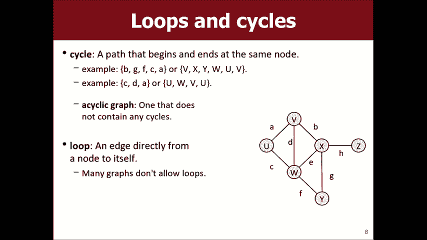
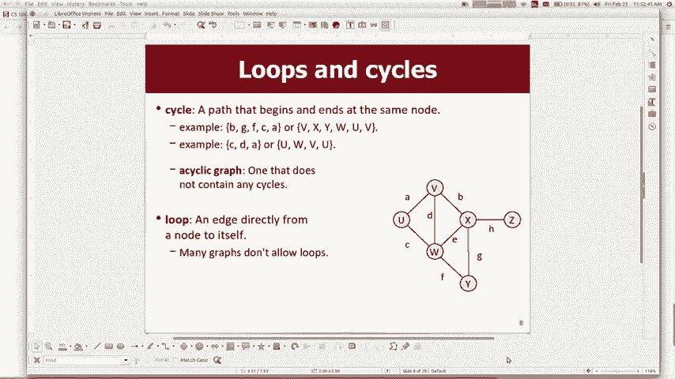
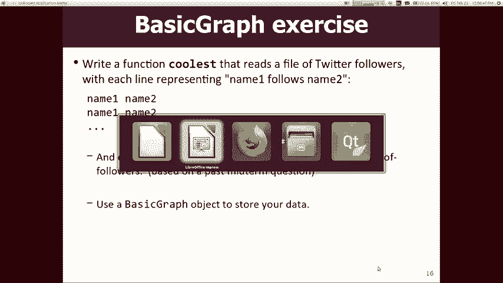
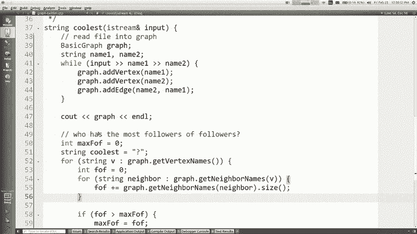
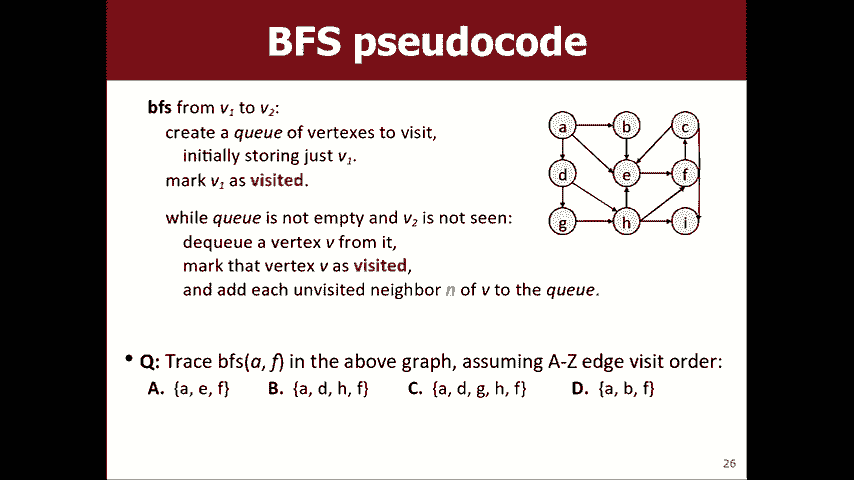

# 课程18：图论基础与算法 🗺️


在本节课中，我们将学习一种新的数据结构——图。图是一种强大的工具，可以用来表示和解决许多现实世界中的问题，例如社交网络、地图导航和任务调度。我们将从图的基本概念开始，了解其构成和术语，然后学习如何使用代码库来操作图，最后介绍两种基础的图搜索算法。

## 图的基本概念

上一节我们介绍了本课程的主题。本节中，我们来看看图到底是什么。


图由**顶点**和**边**组成。顶点（有时也称为节点）是图中的基本单位。边是连接一对顶点的线，表示它们之间存在某种关系。在某些语境下，边也被称为弧。

以下是图的一些核心术语：
*   **度**：一个顶点的度是指与其相连的边的数量。
*   **路径**：路径是从一个顶点到另一个顶点所经过的一系列顶点。路径的长度是指路径中包含的边的数量。
*   **相邻**：如果两个顶点之间存在一条直接的边，则称它们是相邻的。
*   **可达性**：如果从顶点A到顶点B存在一条路径，则称B是从A可达的。
*   **连通图**：如果一个图中的任意两个顶点之间都是可达的，则称该图为连通图。
*   **环**：环是一条起点和终点是同一个顶点的路径。不包含任何环的图称为**无环图**。
*   **自环**：一条连接一个顶点到其自身的边。

## 图的变体

了解了图的基本构成后，我们来看看图的一些常见变体，它们能帮助我们为不同问题建模。

图的属性可以根据具体问题进行调整和组合：
*   **加权图**：图中的每条边都被赋予一个数值（权重），可以代表距离、成本或时间等。公式表示为：`边 = (顶点A, 顶点B, 权重W)`。
*   **有向图**：图中的边具有方向性，从起点指向终点。这表示关系是单向的，例如Twitter的关注关系。在代码中，这通常表示为 `addEdge(起点, 终点)`。
*   **无向图**：边没有方向，关系是双向的，例如Facebook的好友关系。它可以看作是一种特殊的有向图，其中每条边都有两个方向。



## 图的代码表示



理论需要实践来巩固。现在，我们来看看如何在程序中使用图。

斯坦福CS106B课程提供了一个名为 `BasicGraph` 的库，用于表示和操作加权有向图。以下是如何使用它的一些基本操作：

```cpp
#include “basicgraph.h”
// 创建一个图
BasicGraph graph;
// 添加顶点
graph.addVertex(“A”);
graph.addVertex(“B”);
// 添加有向边，并可选择添加权重
graph.addEdge(“A”, “B”); // 默认权重为1
graph.addEdge(“C”, “D”, 4.5); // 添加权重为4.5的边
// 获取顶点的所有邻居（出边指向的顶点）
Set<Vertex*> neighbors = graph.getNeighbors(“A”);
// 获取图中所有顶点
Set<Vertex*> allVertices = graph.getVertexSet();
```

## 图搜索算法简介



掌握了图的基本操作后，我们就可以探索如何在图中寻找路径了。本节将介绍两种基础的搜索策略。

图搜索的核心目标通常是找到从一个顶点到另一个顶点的路径。根据需求不同，我们可能希望找到任何一条路径、最短路径或代价最小的路径。

### 深度优先搜索 (DFS)

深度优先搜索的策略是“一条路走到黑”。它从起点开始，随机选择一条边深入探索，直到无法继续或找到目标。如果失败，则回溯到上一个分岔点，尝试另一条未探索的边。



以下是DFS的伪代码思路：
```
算法 DFS(当前顶点 v, 目标顶点 target, 已访问集合 visited, 当前路径 path):
    如果 v 等于 target:
        将 v 加入 path
        返回 true (找到路径)
    标记 v 为已访问 (加入 visited)
    将 v 加入 path
    对于 v 的每一个邻居 n:
        如果 n 未被访问:
            如果 DFS(n, target, visited, path) 为真:
                返回 true
    从 path 中移除 v // 回溯
    返回 false (未找到路径)
```
DFS实现简单，能找到一个解，但不保证是最短路径。

### 广度优先搜索 (BFS)

与DFS相反，广度优先搜索的策略是“层层推进”。它从起点开始，先探索所有直接相邻的顶点，然后再探索这些相邻顶点的邻居，以此类推，像涟漪一样扩散开来。

以下是BFS的伪代码思路：
```
算法 BFS(起点 start, 目标 target):
    初始化队列 q
    初始化集合 visited 记录已访问顶点
    将 start 入队，并标记为已访问
    while (队列 q 不为空):
        当前顶点 curr = q.dequeue() // 从队首取出
        如果 curr 等于 target:
            重构并返回路径 // 通常需要额外记录父节点信息
        对于 curr 的每一个邻居 n:
            如果 n 未被访问:
                标记 n 为已访问
                记录 n 的父节点为 curr // 用于最后重构路径
                将 n 入队 q
    返回 “未找到路径”
```
BFS的优势在于它**保证能找到从起点到目标的最短路径**（以边的数量计）。



---
本节课中我们一起学习了图数据结构的基础知识。我们了解了图的顶点、边、连通性等核心概念，认识了加权图、有向图等常见变体。我们还初步接触了`BasicGraph`库的基本用法，并学习了深度优先搜索和广度优先搜索这两种基础图算法的工作原理。在接下来的课程中，我们将更深入地应用这些算法解决实际问题。