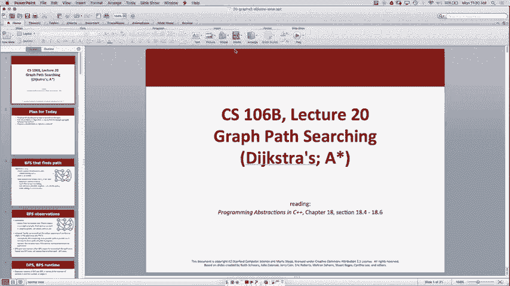
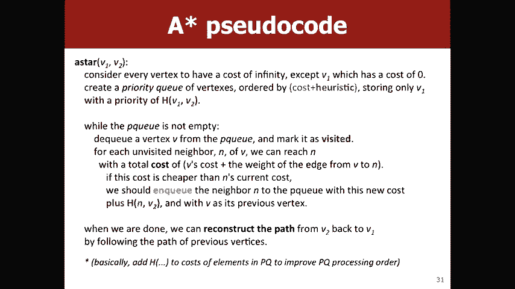

# 【斯坦福大学】CS106B C++中的抽象编程 · 2018年冬（完结·中英字幕·机翻） - P19：【Lecture 19】CS106B Programming Abstractions in C++ Win 2018 - 鬼谷良师 - BV1G7411k7jG

所以今天我们要结束了，但是您在星期五开始谈论，这是广度优先搜索或BFS专门讨论如何，最终找到要搜索的节点后，重新构建路径，首先，我们将讨论Dijkstra的算法，这实际上是一个，图表非常重要的问题。

可以，所以我们可以找到一条路径，这是深度优先搜索，我们可以根据数字找到最短路径，边的宽度优先搜索，但是我们能找到成本最低的路径吗，在边缘权重方面，所以我们将讨论Dijkstra的。

我们今天将开始讨论的另一种算法称为，这颗星基本上像Dijkstra的新版本和改进版，因此可以运行，快一点好吧，所以希望从周五开始看起来有点熟悉，广度优先搜索并没有在整个周末消失，但是这个主意。

在存储要查找的所有节点时进行广度优先搜索，在队列中，然后每次看到您标记的新节点时， ，你看它所有的邻居我想聊聊的主要区别，今天大约是如果我们有这样的顶点队列，您将永远无法，好吧。

所以我仍然碰巧看到了这个顶点，但这不是一个好方法，重建这条路径，以便能够做到这一点，对于每个节点，所以您知道A的邻居是BE和D，因此我们可以说，如果您尝试从中搜索，则以前是a，然后从那里去。

到F之类的东西，那是最大的不同，您将在家庭作业中执行此操作，所以我不想放弃，有关如何跟踪此问题的太多细节，只是想一想，你知道也许我应该如何跟踪以前的每个节点，什么做这个算法关于广度优先搜索一些好的观察。

总是会找到最短的数字或最短的路径，就边缘数量而言，如果不加重裂纹，那将是最佳选择，成本，但正如Dijkstra对于加权图所看到的那样，这可能不是，成本最低的途径之一是难以重建。

您在路径中遍历的边的实际顺序，因此使用DFS确实很容易，因为我们只是知道从矢量跟踪，顶点，但是在BFS中，您必须多加一些思考，每次搜索重建该路径深度会占用较少的内存，因为，没有整个队列，因此重建，路径。

但是BFS找到最短的路径，因此您需要权衡一些，可能会想，如果有人告诉您，您只需要找到一条路，在两个顶点之间，您对BFS有什么疑问？ ，在我们继续讨论Dijkstra的问题之前。

如果有人好奇我还有最后一件事，我会，谈论运行时，基本上是您一次遍历每个边缘，顶点一次，所以它是V加T的o，我们将谈论一件事要注意，这是au v + e吗，我们会看到Dijkstra的面积更大一点。

运行时，这就是为什么我们不总是使用Dijkstra的而是运行时相同的原因， DFS很好吗，所以我一直在暗示这个想法，有这个加权图，我们如何找到最短的成本路径，在现实世界中，这是一个很好的例子。

有时您知道而不是飞翔，从这里直飞纽约，在芝加哥停留可能会更便宜，等等，如果您更在乎金钱而不是像您这样的时间长短，可能想在芝加哥停留并节省几百美元的机票，所以，任何人都有其他类似的例子，例如哦。

现实世界中的图形，每个边缘都有一定的重量，您可能会在意最小化，边缘的长度与我们参观的地方数量的关系是的是的，因此，例如，如果您有一张城市地图，则可能需要等待，通过遍历所需时间的长度来确定边缘。

因为前进的方向非常不同，在旧金山的大街上走一英里我知道你是否，看过它的照片，但看起来像这样，因为它是如此陡峭，就像您知道的一样，一垂直英里，与正常街道右侧的一英里非常不同，因此，如果您要尽量减少该街道。

则可能不想走这条街，时间长的好例子别人有其他想法，另一个例子可能是，如果您喜欢服务器有时如何处理请求，像是根据那台服务器的延迟，您可能想要更多，很少相关的服务器在所有事情上的延迟都较短，那是另一个例子。

所以作为一个例子，为什么BFS不够好，解决方案好吧，任何人看到从A到F的BFS都会找到我会选择的路径，找到对X的正确路径，所以BFS会找到正确的路径，以便，成本是九，有人能找到更好的道路，是的。

实际上在那边，你曾经是这样的，所以总督，而不是九个，每个成本只有六个，所以有时会停更多次，总的来说便宜些取决于你的背部，所以如果这张图很简单，因为我们只能看一下，但是您知道可以想象成百上千个。

成千上万的顶点和边缘可能会变得困难得多，所以这， Guy Dykstra提出了一种基本上可以解决此问题的算法，因此， Dykstra在计算机科学领域非常重要，他获得了图灵奖， 。

有点像诺贝尔计算机科学奖，所以如果您看一下，赢得图灵奖的人的名单令人印象深刻，我最喜欢的故事可能不是真的，但就像我最喜欢的轶事有关， Dijkstra是你可以看到他的名字叫ijk，这就是为什么。

传说这就是为什么CS中的循环计数器以ijk开始的原因，因为，这个家伙说他在计算机科学方面很有影响力，所以他看到了这个问题，并开发了一种算法来找到最小的重量路径或最小的成本。

加权有向图中一对顶点之间的路径，因此可以解决，好的想法，我们需要从给定的路径中找到最短或成本最低的路径，顶点，所以不太理想，因此该算法不一定会找到，像两个好的路径之间的最小成本路径是的。

它很好地找到了F到a ，到e，但是想要找到B到F，则必须再次运行此算法，事情的基本前提是我们，每次看到一个新顶点时，我们都会用，我们已经看到的先前顶点中的一个，而不是Q，我们只是，盲目地和Q邻居。

我们将跟踪边缘成本，以达到那些，邻居，然后随着我们通过此算法将更新这些成本和，最终，我们将拥有成本最低的路径，因此伪代码会有点，涉及更多的想法基本上是从B 1开始，您在我们的示例中知道a ，成本为0。

因为我们已经在这里了，我们什么都不知道，关于任何其他音符的​​信息，我们只是说它们具有无限大的，成本，那么我们要走了，所以我们已经看到您在使用队列之前开始，使用优先级队列。

因为我们要基于边缘成本进行排序，我们将使用按成本排序的顶点优先队列，然后， PQ不是空的，我们要去DQ成本最低的节点，而市场是，拜访之后，我们将查看到达所有其他邻居的费用，然后说，好的。

所以到达所有这些邻居的成本最多是花费的成本，让我到达我正确的节点，加上到达我的邻居正确的边缘成本，所以如果我在节点B和，到达B花了七点时间，然后到达C距离， C的总成本最多为9，那么它的成本可能会更低。

比该节点的当前成本要大，因此，如果它小于该当前成本，则，我们会便宜一点，以Q结束，以较低的成本使那个邻居静音，如果它大于我们只是忽略的部分，因为也许我们可以通过，成本是8而不是9。

所以我们只用8来让cui ，那么我们需要记住必须经过哪些顶点才能使，同样，您对此有什么疑问，我们也会做一个例子，但是，好吧好吧，我们选择了我们想要从A到F或最喜欢的例子的方法，因此，为了做到这一点。

我们将使用某种着色方案，黄色表示它的末端很可爱，所以您知道我们仅在固化我们的算法时才开始，起始节点的成本为零，然后Y为节点，我们对此一无所知，我们所知道的，也许甚至没有办法在这种情况下到达那些节点。

图从a开始，然后绿色，这是我们访问过的节点， ，处理，然后从我们的优先级队列中进行DQ，所以我们的第一步是，获取a的所有邻居，我们希望将他们排入队列，是的，有人知道我们保留什么，队列应该是什么样子。

在我们成为优先队列之后，您应该知道流程后的样子，到，是的，所以你有D 1和B 2 ，正是这样，我们知道，以最高的成本成为可能-从，因为我们可以走这条边缘，我们知道我们可以做到这一点。

只需沿这个边缘右转即可花费一个，这样您就可以更新了，所有这两个成本，然后说好，我的先前工作已恢复到现在的状态，下一个节点是什么，我们将提出任何想法，是的，我们要看D，因为D的成本比B低，而那是两个。

队列中的所有内容都正常，所以它将查看D，那么D的邻居是什么，赫兹（Hertz）认为还可以，所以C的成本是，会结束Q好吧，听到有人说任何其他想法，我看到了一些，人们说三个。

所以从D到C的成本是2是完全正确的，但是花了我们一个人才能到达D正确的位置，因此，因为我们试图找到，从A到FX的距离，我们想找到以某点为代价的距离，从A到C变成三点，人们对此有何看法，好吧。

D会一直保持你的座位对不起，看到三个F ，的E并与9个对等排队，因此1 + 8，然后裘德被提示与5和E ，会加上3所以1加上这些边缘成本，因为到达D的成本，没关系，那么接下来要进行DQ的音符是什么。

有多少人认为B有多少人认为还好有多少人认为，许多人认为e我们认为人们认为GF我呢，好吧，我是，所以我想你们都明白了，对，B是下一个，因为它的当前建议成本为2，所以，我们看一下B。

那么BD和E的邻居是什么，我们需要做的是，带有D的任何东西否，所以我们忽略D，因为我们访问了D怎么回事，我们应该为你做些什么，我们要更改优先级还是将其保持不变，多少人认为改变多少人认为保持不变是的。

所以我们，希望保持不变，因为2加10是12，比3大很多，所以，到达e的最快方法显然不是通过V ok，所以我们该怎么办，再看下一个，或者说实际上是C和E之间的联系，所以我们只选择C 。

因为这就是幻灯片的写法，C指向H，FH也可以，数字16的优先级3加13关于X 2多少人认为，我们想要更改F的优先级，有多少人认为我们希望保持F的优先级，相同，好的不参与也可以，是的。

就像选举没有更好的投票率，你们所有人都可以做得更好，所以让我们尝试，再次有多少人认为我们应该改变，所以我们在看，有多少人认为我们应该改变F的优先级？ ，许多人认为它应该保持同样出色的出色性能，是的。

因为，我们的新优先事项我们知道，如果我们经历C，我们可以付出代价， 8之3加5和8之和小于9，这就是为什么我们要更新ok的原因，现在我们在看E这些邻居是Dean我们E的邻居是G ，我们要更新G吗？

有多少人认为是？有多少人认为现在可以，完全可以，我们忽略更新G接下来要做的是DQ ，嗯，抱歉，要成为D多维数据集的下一个名字是G狗屎，所以G的邻居是F。 。

人们认为我们应该更新F有多少人认为我们应该保持现状，五加一，所以fnaught变成六，那么我们的下一个DQ是f， ，因此我们发现优先级为6个苛性碱，即f-G /对不起a 。

 -D-G-f如果我们追溯以前的指针，是的，你如何储存好，所以问题是我们如何知道，先前的指针是您知道F先前是G且G先前是D等等，嗯，所以这是一个问题，您必须考虑在做作业时，存储它们。

因为否则将无法执行此步骤，并且有很多，不同的方式来做到这一点，只是要有创造力， [音乐] ，是的，问题就像没关系，如果Indy不是真的，我们将使用无穷大，存在于计算机程序之类的计算机程序中。

而不喜欢无穷大，如何，我们会在每种编程语言中用C ++表示那个um吗，有这样的概念，例如最大int和最小in一些最小int ，就像最小的负整数值和最大的最大值一样，整数值。

所以有一些常量基本上代表了我的意思，这不是，正无穷大约为20亿，但这通常是，计算机科学家代表Vindi是的，是的，这个问题还可以，所以在PQ为，不为空，因此此内部代码找到或喜欢这样。

为什么我们在找到一个，继续进行下去，以便此伪代码可以找到，从a到图形中每个顶点的最短路径，但是在此，现在我们找到F，我们知道不会有更短的路径，因为，就像如果我们经历了一条较短的道路， 。

您的边缘权重是非负的，就像您必须经历额外的，边缘，因此这些边缘只会增加正确的成本，因此我们知道，不可能有更快的F路径，所以这是我们可以做的优化，因为我们知道我们是专门从A到F，而不是像find那样。

从A到另一个顶点的最短路径或最低成本路径，很好地捕捉图表，大家还有什么其他问题，迪克斯特拉的，因此，对Dijkstra的算法进行了一些评论，这就是所谓的贪婪算法，它是使局部最优的算法，选择。

希望可以导致全局最优，所以我们，采取似乎最好的方法，就像我们在查看每个顶点并说，成本最小的那个是我们接下来应该看的那个，然后，我们希望总体上能够像找到，所有路径上的最短路径，因此这是一个贪婪算法的示例。

如果，您对贪婪算法感兴趣，因此应选择CS161，因为他们会说话，关于这些很多，这的REIT似乎还可以，我们只是这样做了，它确实找到了一条最短的路径，也许那只是运气，也许我创造了这个。

以这种方式起作用的示例，但它之所以有效，是因为它总是，维护关于优先级队列的两个属性，因此对于每个顶点，我们访问了当前信息，或者您知道我们在PQ中将当前信息标记为。

记录的成本是该顶点与源顶点之间的最低成本，因此，一旦我们访问了优先级队列中的一个节点并对其进行DQ，就不可能再快了，到达该节点的方法，因为任何更快的事物都会像其他所有事物一样涉及。

优先队列中的费用不大于所访问的费用，节点，因此就像遍历任何其他节点一样，您将获得更大的成本权， ，然后对于所有未访问的顶点，那些仍然处于优先级的顶点，将这些优先级排队在优先级队列中，例如我们的费用。

如果只看一下，就知道暂时分配的是当前最短路径，在我们实际访问过的顶点处，因此可以保持这两个顶点，属性，这就是为什么它起作用的原因，这就是为什么dexter是一个非常酷的人，他想通了所有这些，所以好吧。

你为什么不尝试与合作伙伴一起做Dijkstra的，废话，看看进展如何，好吧，让我们来看一下Dijkstra的算法如何处理这些图，当我们启动将其顶点化的算法时，PQ中最初包含的是什么，从我们的关键键开始。

是的，所以容易，以优先级为零的起始节点关闭，好吧，那么我们要DQ ，我们要说的很好，这个人已经去过了，所以D治愈了，邻居B和G是的，所以B以优先权180进入，所以这里的边缘和，然后她以30的优先级进入。

所以要成为DQ G，因为G ，成本较低，所以我们将进行DQ，所以我们该怎么办，在看完GD后，会结束您的发言，那么一个人的体重是多少， D抱歉，我能听到，所以D得不到Priority One的帮助是的。

所以D进入150的多维数据集，因为花了30才到达G，然后G同步它，从G到D再花120欧元，所以总费用是150欧元，所以，我会说这个一零这三十个好吧，那我们接下来做什么q 。

人们认为我们dqb接下来有多少人，对不起，完全没有看到是的，好吧，怎么办，很抱歉，我们仍在查看G，所以对，nqa是什么， 50 30加20好的，接下来我们要做什么，好吧，所以我们访问DQ好吧。

我们要多少成本，我们要什么节点，结束q是的，所以费用高50，所以您可以更新b2b费用70，因为70是，少于80，所以改变这个，说70，我们想看的其他音符，从院长那里，花费130 。

所以我们已经有了QD 130好的，所以我们接下来要看的是哪种钞票， 70好吧，那么从B出发，我们将在Y处注视什么，以便使F具有成本， 80好吧，那么你们都可以看到绿色的吧，好吧，这怎么样呢？ 。

这是D当前的130f，在我的屏幕上看起来好多了80好的，这些费用分别为0 30 50和70，所以知道这样做的人- ，不，我们现在不去拜访您，是的，所以感谢D花费了130，您可以写下来，所以f花费了80。

我们已经做好了，所以D花费了120，因为80 240 ，我们需要添加到优先级队列中的其他注释，看到角色扮演Diaz花费120，所以CS花费是130可以，所以我们现在在这里做什么是的。

所以开始备份一个我不知道是否，我显然可以抹掉，我不能抹掉，所以从F开始我们是80岁，所以f ， QC的优先级为150，NQ d的优先级为120，然后我们将DQ D ，因为D 120正好小于150是。

好的，所以它将C更新为130，因为一旦我们查看D 120 Plus 10，它将为1 ，是130小于150是的，所以我们看问题是当我们在B时好吗，对于可能遇到相同问题的人，我将以任何方式回答，因此。

问题是可以的，我们处于磁珠状态，并且有一条从B到A的路径，花费20 ，所以我们不应该回头看看答案吗？ ，回头看看a，因为我们已经访问过a，因此您可以看到70 ，加20等于90，而90大于50则很好。

 Texters的工作很好，那么好D是120，那么C就应该是130， ，那么H会是150。人们对这个例子有何感想？ ，关于Dijkstra的一般，是的， [音乐] ，然后，如果您去的话。

那么所有代表您的车上的权威，那么您就是，基本上，我们必须要有某种存储方式来关联，每个节点都具有与先前顶点相同的成本，因此例如，当我们查看何时处理E时，我们必须标记B ，我们喜欢旅行的G，是的。

我们给Ewing评了70分， ，他们以前很担心，所以您必须提出一些建议，像BFS，我们必须想出一些方法来跟踪，因为这个先前的顶点才对，是的，问题是说优先级队列具有，当时我们知道的最低成本是。

所以那是百分之一百，考虑它的好方法，所以只看四个顶点，从优先级队列全部访问了DQ ，优先队列中的费用对于那些像，仅使用访问的顶点即可达成协议，是的，这是您作业时必须考虑的一个问题，抱歉，请尝试，好吧。

是的，是的，所以在这种情况下，答案是，从例如变成a是B-f-D-C-H，它的成本C是路径C ，花费了150 ，好的，所以请记住当我今天谈论BFS和DFS时，他们记得，那个运行时是什么，哦。

V +寻求我们对每个顶点进行一次检查， ，迪克斯特拉的每条边都有一点不同，所以，优先队列的工作方式，因为我知道你们都，在您的优先队列上工作时，您可能会注意到，我们最好的。

可以做的是拥有NQ和DQ并更改log n的优先级，这是您的关键，优先级队列具有运行时间，因此无法在恒定时间内执行这些操作，喜欢在恒定的时间内进行所有这些操作，所以基本上每次都，您必须更新优先级队列。

它是对数V操作而不是O ，一个操作的原因，这就是为什么您会像V log V Plus这样进入，假设您的图形已连接，则意味着每个顶点，至少有一条边可以写成对数V是的，所以，它与您每次都息息相关。

因此每次您想添加当前，节点，您正在查看该节点正确的所有边缘，因此对于每个节点，边缘，您最终只能查看优先级队列，因此您可能不得不更改，优先级，例如每次您看到边缘时，这都在改变优先级，作为对数V的操作。

因为您对我们的一方是一个很好的问题，如果您是，对所有这一切都感兴趣，例如161是一个很棒的课程，可以带他们去看看图，算法和大O以及非常详细的信息，但士气就是这一点，幻灯片是。

基本上Dijkstra是解决该问题的一个非常好的算法，可以解决，但是如果您只是想在两个节点之间找到一条路径，那就是，最好使用BFS或D上的DFS，因为它具有更快的运行时间，好吧。

让我们谈论一个像Dijkstra的plus plus一样的恒星，所以我们说，试图找到一条从A到C的道路，假设这是您的，绝望，你不能通过正确的，所以如果我们是任何人有任何。

 Dijkstra算法的想法看起来就像Dijkstra算法一样，这是Dijkstra的算法，如果可以的话，理想的情况是在这里，它不知道正确地做那件事，所以基本上你会发生什么，喜欢它的人会在这里探索。

然后在这里喜欢这里，正确进入C，因为它正在注视着所有方向的分支，不知道像嘿，我的目标在这里，所以我也许想尝试，尝试以这种方式移动，这样的问题是我们唯一的信息是，考虑到Dijkstra的距离是。

从起始顶点到当前顶点，我们在右边，所以我们知道了距离，从A到B，我们只是在做这些，我们一直在跟踪这些成本，如果迪克斯特拉的人足够聪明，你可能会像你一样遥不可及，可以尝试根据某种方式猜测从B到C的距离。

启发式的好吧，就像我们试图从你那里知道这里到这里，我们实际上最终倒退了，这不好，您也可以看到，在这里，因此，如果我们要尝试摆脱这种情况，请确保此上下文正确，是您下一件作品的样子。

所以如果我们试图从这里走到这里，看到就像走到角落一样，就像没有办法，将会是最快的道路，就像我们一直在这里和这里所知道的那样，很多，额外的工作吧，这个想法还可以。

让我们尝试为算法提供一些有关此未知数的提示，从B到C的距离，也许可以让我们变得更聪明，决定，而不是盲目地向各个方向走，以便做到这一点，我们将使用一种称为启发式的东西，基本上是求和。

指标就像是对某个未知距离的猜测，因此很明显，如果我们知道，我们可以使用的距离，但这就是我们要解决的问题，那不是一个很好的解决方案，所以从本质上讲，这只是在尝试，像一个非常准确的猜测。

这些启发法有什么重要意义，是他们需要始终低估成本还是喜欢做对，但要知道，确切地说，它永远都不能高估成本，所以一个很好的例子是，您尝试了解自己是否正在实施Google Maps，并且。

试图找到从旧金山到纽约的最便宜路线，绝对的最短路径就是你所知道的实际路径，旧金山到纽约的直线距离，因为，没有比沿着直线前进更快的方法了， ，就像他们实际使用启发式方法的一种启发式方法的例子。

诸如此类的事情也有试探法来尝试预测给定的电子邮件是否，是否为垃圾邮件，并且可能查看发件人的收件人数量密钥，像if这样的词可能包含尼日利亚王子一词可能是垃圾邮件，所以。

这是计算机科学中其他地方使用的启发式方法的一个例子，对于一颗星星，我们需要提出一种启发式方法来猜测距离，然后，您会听到所有可允许的启发式超级幻想术语，意味着我们需要并且我们永远都不能高估距离，因为。

如果我们高估了距离，那么我们就会陷入错误的情况，关于我们好像走错了方向，也许我们会选择一个，最佳路径，所以基本上恒星是如何运作的，就是整个a2b事物，与Dijkstra相同。

但是从B到C使用这种额外的启发式方法，因此您，希望将两者都纳入我们的优先事项，因为我们想看看，在我们查看之前，我们认为与目标的距离较短的节点，距离目标较远的节点，就像我们不想，向后走到某个地方。

您对此有什么疑问，是的，这是一个很好的问题，例如，您如何选择一个，启发式um基本上，您必须对图形有所了解才能，选择一种启发式方法，因为如果您一无所知，很难，就像您不能依靠某种信息进行启发式搜索一样。

在Google Maps示例中，我们知道就像您不能在两个之间，放置比直线距离快的任何东西，但是如果要映射，这样的Wikipedia无效，因为您没有像这样的概念，直线。

所以它实际上取决于获取有关您的图形和，知道一些关于您的图的信息，这就是尝试出现的示例，使用启发式方法，您认为此图将是一个很好的启发式方法，其中，你知道旅行到一个广场，你只能这样旅行。

这个方向或您无法诊断的方向，是的，所以一个建议是可以的，就像我们可以使用，这就是欧氏距离这是您在几何学中学到的东西，可能值得像x的平方根减去x1减去x2再加上（如果有的话） ，看到了。

但是您基本上知道是否要绘制直线距离，所以是的，我们可以完全做到这一点，对于，请记住，是否存在一种更简单的启发式方法，如果，我在这里，我想到达这里是我需要走的最少正方形数，有人会说听起来正确吗。

我只是听不清楚，回来，像是的，你像是在我们一样举起你的手，我们需要到达这里，我们只能说好，我们必须喜欢Moute ，你知道至少我们要一直走到这一步，这样，因为我们不能做任何对角线的欧几里得距离，工作。

所以这是您知道的直线距离，但这仅仅是，易于实施，特别是使此幻灯片看起来像，好多了，因为如果您的直线距离不是我要做的所有事情，所以是的，我们会说您知道在这种情况下，要花六点时间才能看到，从这里开始。

因为您必须走到这条路，这样，好吧，真的，基本上很快，所以这是Dijkstra的代码，这是明星，迪克斯特拉（Dijkstra）是明星，你并没有改变太多，最大的不同是，您必须先了解费用和优先事项。

然后再将其合并，启发式的，所以是的，我们需要付出成本再加上启发式的知识，将原始节点优先级存储为零，现在我们将从，启发式，然后在我们排队时，我们需要将启发式纳入，从那个节点到最终目标，哦，太好了。

非常感谢，祝你有美好的一天。

