# 【斯坦福大学】CS106B C++中的抽象编程 · 2018年冬（完结·中英字幕·机翻） - P2：【Lecture 02】CS106B Programming Abstractions in C++ Win 2018 - 鬼谷良师 - BV1G7411k7jG

上次谁告诉我，如果您怀孕的话可以sc猫砂，我要在我爱人的妻子中使用那个，所以谢谢我，有几条公告开始了我们的讲座，我们本周将运行以帮助人们处理各种事情，因此，一个是我知道你们中有些人来自106 AJ班。

 JavaScript，您知道，由于该类是相对较新的类，因此我们认为，从那门课和那种语言过渡可能会更困难，在106 B中向我们提供JavaScript，因此，如果您修了106 AJ，并且需要帮助， 。

从语言转换过渡到今天晚上7点，晚上在惠普大楼101室再次面向106名AJ人，我要说的是它将着重于JavaScript和C ++之间的差异，如果您来自Java的6/8或常规版本，或者来自某些。

其他类型的编程背景左图标或我推荐的东西，也许不参加本节，因为它不会针对您的特定需求，需要我鼓励你今晚去，在7点，我们小组的负责人Shreya将主持该次会议，好的， ，您可能想知道的会议是明天晚上七点。

在Tresidder，我们要做一个可爱的创作者，帮助会议，因为我认为很多人最终陷入困境或中途，在整个设置过程中，使一些Creator正常工作并出现了某种错误，信息弹出，他们不知道如何解决它。

所以请带上笔记本电脑，我们会为您修复它，希望它能正常工作，所以明天，在7时令人印象深刻，将有一些我们的TAS和一些我们的，那里的部门负责人我们将会有几个人在帮助，所有出现的疯狂可爱的创作者们。

我鼓励你去，是的，我明天也要给你们发送电子邮件，我希望您注册各个部分，我希望您提交以下信息的偏好设置，次您将在本周四到现在之间进行操作，周日，然后在下周初，我们将把您分配到您的部分，以便。

我要开始提醒您明天您将无法做，直到明天下午才开放，直到星期四好，所以，就像回顾一样，我们现在所处的位置您知道我们所做的很多事情，如果您单击以下链接，则会在讲座页面下的网站上发布： ，说讲座可以向下滚动。

我会像全班视频一样发布，我在这里记录在计算机上的代码，我将发布所有我们编写的代码，幻灯片，让我们the了一口可爱的创意项目，你知道我会在下课后再做一次，好吧，所以，让我们回到它，我们正在学习C ++。

我们正在学习我，开始谈论函数嘿，所以我写了一个叫做Song的函数，打印一些消息，一些我认为有用的歌词，然后我，重复两次，我从程序的主要部分两次调用了该函数，好的，这样所有的作品都可以正常工作。

但是在演讲结束时，我向您展示的是如果您剪切此功能并将其粘贴到，就像同一程序不再编译一样，这里产生一个错误，它说对不起，我无法控制它说这首歌是，没有声明，这实际上只是一个C ++怪癖，它必须要有东西。

在Java或JavaScript等许多其他语言中使用它们之前声明，您可以调用一个函数，然后在文件的较低位置写入，该函数的定义，它将理解它将找出C ++，而不是，如此之多。

这是令人讨厌的解决问题的一种方法，就是始终，在main之上声明函数，但是我认为一个很普通的样式是，首先是主要功能，然后是其他功能，因此如果您要这样做，则，您需要执行的操作的方式现在让我跳到幻灯片上。

这是我们遇到的问题，这是一个不同的功能，示例，但是如果您尝试调用一个函数然后编写其主体，您将，得到一个错误，该函数做什么只是计算，但在C ++中解决此问题的方法是使用一种称为，函数原型。

您要做的就是写出标题，返回类型的名称，参数类型，然后放入分号和，基本上，您是在告诉编译器，就像我保证的欠条一样，以后我要写这个函数，所以请不要给我编译器错误，如果，我尝试调用该函数，现在程序可以运行了。

程序可以编译了，所以我如何做到这一点，我认为很多程序员都是这样做的。

该函数我在哪里，你在这里写函数，然后一次，完成编写后，复制标题，然后转到此处的顶部，该程序导入后，您粘贴相同的标题，但您将，分号，再一次称为函数原型好吧，现在我编译，而且它的工作原理和行为方式相同。

所以这只是一点C ++问题，我们必须解决，好了，如果您知道是否有任何参数， ，这需要一个索引，我必须在这里和下面的X处写索引，那里的标题将从原型到主体的匹配，稍后再进行功能介绍，让我再谈一些同类的功能。

关于我今天要去听课的地方，所以让我实际备份一些幻灯片。

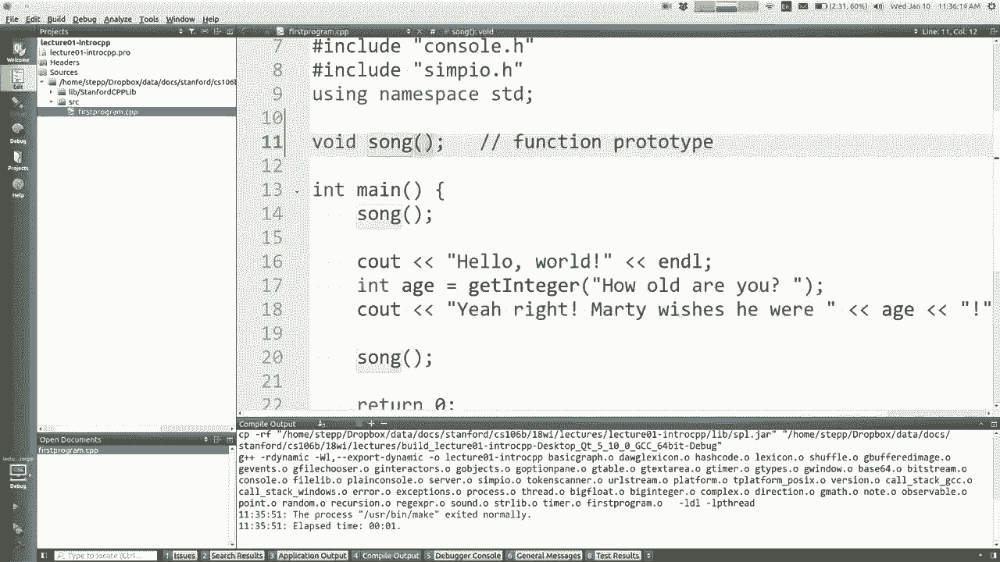

这来自于本书的第2章和第3章，您甚至无需编写某些函数就可以调用的函数是，关于数学计算的东西，有一个名为C math的库，您可以，包括使用那些尖括号的海图包含，记住有时包含和有时会有引号，方括号记住区别。

通过了解我对C数学库有什么了解，那些角度记录，这是一个标准的系统库，附带了正确的语言，来自斯坦福，不是我们本地的项目，而是全球的，是的，所以每个C ++安装功能都应附带此功能，有点熟悉。

大多数语言都具有绝对的功能，取值三角函数平方根这些东西都在这里，在Java中，我知道并非每个人都来自Java ，登录C ++，您无需编写数学点，而只需编写函数的名称，说符号或平方根或电源好吧。

所以这些都是有用的，我不会去，他们非常详细，因为我猜你已经看过这种，操作，之后我们可能需要它们，好吗，所以我在哪里谈论，我们讨论了原型的申报单，让我教你一些。

 C ++对函数所做的不同操作是一个很酷的功能，它被称为默认参数，这是如果您想拥有一个其参数，可选的值，您可以在函数的标题中声明参数，但随后您可以说出池并为其赋值，即主叫方，可以传递一个值。

或者如果他们不传递一个值，那么您将使用此默认值，因此，我写了一个叫做打印行的函数，你传递一个数字和一个字符，它将打印该字符重复多次，只是一个小工具，函数，但我决定的是如果您不传递参数，我将使用。

默认重复次数为10，默认字符为星号，因此，平均只有五只幼犬的宽度而不是字符，默认，字符传递这些参数，我将做一个星号的10个副本，这是一个，有点愚蠢的例子，但我只是想表明这个想法。

这里的排序问题是参数从左到右，所以，如果您省略此示例中，它将无法通过没有宽度的字符，您只能在正确的地方忽略它，所以无论如何，有时在语言中有用的功能允许我们拥有一个变量，函数的参数数量还可以。

Java没有javascript有，但是JavaScript几乎允许任何东西，因此C ++和JavaScript共享，在某些方面作为默认参数，我们本周不会使用太多，我想谈谈参数的工作原理。

因为C ++ ，与其他语言有一些不同，所以有一个概念，可能不知道其名称，但您可能暗中了解它的名称，称为值语义，这意味着当您传递参数时，您实际上是，这样做是为了传递该参数值的副本，从而，这表明，例如。

在此程序中，我试图编写一个，称为swap的函数，您传递了两个is，我交换了它们的值，以便，交换函数a的末尾的值曾经是一个无檐小便帽，他，评估需要正确，这是我输入的三行的结尾，尝试将这些值放入a中。

然后将x值放入B中，所以最后，该函数的值我已经交换了值，但是当我回到我身边时，我却很害怕，值仍然是x + y，我还没看过，您是否了解为什么这样的情况，例如功能交换并没有真正做到。

任何您了解的内容都可能看到了，我们看到的地方，来自，因为这些变量是朋友或B，这些变量成为， x和y的值就是这样，所以如果我交换ASD，我交换的副本是，不他妈的原始变量好吧，这就是所谓的值语义。

这个大问题的幻想术语不是每个参数在，传递参数时，您可以想到六个示例之一吗？ ，您更改了它们的值后，您仍然会在主菜单或，在运行时或在每个被调用的前沿，如果您将基因对象传递给其他任何对象。

如果您传递了数组然后可以更改元素，则可以通过yes ，在阵列中，然后您回到我面前，阵列仍在更改，我是的，所以您在上一期中看到了某些价值，当然，当您通过它们时，它们的确会发生变化。

但是像intz这样的简单事物，它具有复制权，因此进行复制的想法就是这种价值语义，认为其他形式的行为可以使您传递某些东西，并且能够，被改变，这是另一种称为参考的语义，语义，所以我想再谈一谈参考语义。

当您传递参数时，您实际上携带的是原始变量，在多种语言中，下一个参考语义的一个功能是，由数据类型自动确定你们刚才说的很好，传递它共享对象的数组，因此隐式看起来像什么类型的。

您传递的值会更改参数将使用的行为，但如果不是，它在C ++中的工作方式，每个数据类型都可以作为值或，作为参考，所以这段代码就是传递示例，整数作为引用，所以这意味着我们要做的是编写一个，在该函数中。

参数中的变量类型后面的与号和，当我说交换是百分比a和人B时，这意味着什么，确实是我们的X＆Y ，他们是相同的他们不是复制他们是彼此相同的名字， a和B是x和y的别名，所以如果我在那里修改a和B 。

它确实确实在这里修改了数据库或x + y，所以现在最后一个函数，幻灯片的输出是1735，但是这个是35，确实将它们交换了1735 17 ，像Java这样的语言，如果您将信息作为参数传递，然后。

想要更改信息或计算新的东西，您将如何获得，从函数返回到main的信息将返回到您调用的位置，通常使用return来返回值C ++，您可以返回值，或者您可以这样做，这是从，函数，您将其作为参考传递。

然后更改参考，指的是这样一种有趣的概念，我们将利用，我们在编程时会遇到这种情况，因为基本上我们想要的任何数据类型，使用它作为参数，我们需要确定在传递它时是否要复制它，或者，我们是否要在通过时分享它。

这是我们需要做出的决定，这的特定示例是一个称为输出参数I的示例，不知道您是否曾经看过xkcd漫画，这是一种愚蠢的怪异漫画，在网络上，他们有一件有趣的事情，就像您可以约会那些，距离您的年龄不远，但更多。

只是一个愚蠢的想法，如果您，想写一个函数来计算我允许的年龄范围，根据这个愚蠢的公式，你会怎么做，因为你需要，返回需要返回最小年龄和最大年龄的两件事，你知道我的意思的范围，那么你如何很好地返回两件事。

不能，但是您可以有两个参考参数min和Max可以填写，这些值，并且基本上将这些值发送给调用方，因此，您只需过去48年的中世纪年龄， ，我在这里是程序的主要部分，然后是这些变量，不论年龄大小。

我都会根据此最小值和最大值填充它们，公式等等，在函数的末尾，Young对于男性具有这个价值，而old具有Max的值，所以我已经使用了这些参数，传递信息，但提供存储输出信息的存储空间，超出功能范围。

所以实际上您会注意到我什至没有分配，您对它们主要感兴趣的任何值都可以将它们传递为，参数没有任何价值，因为重点在于，不使用只是腾飞的值作为新值，而是替换任何值，值曾经是可以的，所以这个想法称为输出参数。

 ，他们活泼开朗，他们有钱，所以可以，我希望他们也能清理垃圾箱，但是无论如何，这就是，输出参数，这也是发送两个，信息，如果您只打算返回一件东西，则可以只使用一个，为此返回，但由于您要输出两件事。

因此这些参考，参数是不错的选择，所以嘿，让我们练习吧，写，等式叫二次方程，你知道二次方程就可以了，在2a二次公式上的正负b平方负4ac ，解形式为ax平方加BX加C的二次方程等于0，因此如果。

您想将二次方程写为C ++函数，需要的参数以及将传递的参数类型，参考，值8老板会传递给您什么，好吧，B和C，所以我让我开始写作，你告诉我该怎么做。

在这里，嗯，这是最后一个挠曲程序，我要关闭我已经完成的那个程序，这里又有一个，所以你要我写一个二次函数，然后你，在C中的it B中说，以匹配平方加BX加C等于其他。

像这样的输出参数是二次方程通常具有，并非总是两个真实的根，但通常如此，所以这些根将是实数。

我将这些根源介绍给调用此功能的人员，好吧，是的，我通过引用将它们传递给他们，就像那些最终成为实数一样，因此，也许双“＆”号的根为一，而第二“＆”号的根为二，或类似的权利，您可能会说您想退还他们，但。

由于其中有两个，很难归还，因此您必须归还，他们的阵列或一些看起来很傻的东西，因此，只需将它们作为参考，并像我对迪克的kcd所做的那样填写，约会的事情，该函数是否在左侧返回任何值，我认为。

结果是这些根源正确，所以我认为这是我需要做的主要事情，产生，所以也许我不需要返回任何东西，我只是使用输出参数，输出您可能在想的信息，为什么我不只是使用C输出来打印，结果的根源您为什么认为这可能是。

是将结果存储在这些变量中还是更好地进行打印？ ，还是两者兼而有之，或者您如何决定这样的事情？ ，是的，他是对的，如果您将它们打印得很好，它说的会更加个性化，您可以在控制台上看到它们，但是它们消失了。

如果您想计算它们并将其用作更大的一部分该怎么办，计算或程序中的其他内容您基本上无法将其打印出来，它已经消失了，因此返回它的功能更加多样化，完全正确，因此，我认为我们应该这样做，但你知道这个主意是。

在缅因州打电话称这件事就像在这里，我要声明，一些变量来存储路线，我不必给它们任何值， ，然后我将a和B与C的传递值称为二次传递值，然后这些，变量是BR将要存储在其中的结果，计算好的快速问题。

为什么我不通过这些作为参考？ ，为什么不对B和C进行in和符号，我该怎么办？ ，决定你怎么看，是的，我不会改变B的值，和C，为什么要确保您知道自己并不总是想正确分享事情，我的意思是。

您是否与朋友共享电话？没有，您想拥有自己的空间吗？ ，好吧，您确实与某人合住了宿舍，也许您希望您不，写，所以您可能希望删除该“＆”号，然后再删除，我不知道这是什么比喻，但是是的，我想如果您的目标不是。

修改不需要的内容以使其成为“＆”号和一些参考，学生开始担心效率，例如我是否可以参考？ ，内存可以更快地运行吗？不必担心它可能在某些地方，微观层面，但不足以解决问题，编译器确实擅长，无论如何都要优化。

所以这不是使程序快速运行的方法，担心或如何保存内存回答有四个字节的内存，不用担心，好吧，让我们在这里实际进行计算，请记住，二次方程式为负B加或负基B 。

在2a处减去负4ac的平方，对吧，让我们看看我是否可以尝试这样做。

负B部分，您不能说加号或减号，所以我们将其作为加号，和减号加上平方根，如果我想要平方根就是其中之一，看到数学函数，我可以说喷射喷射来自于。

我们的程序的平方根是b平方减去4ac B乘以B减去4 。

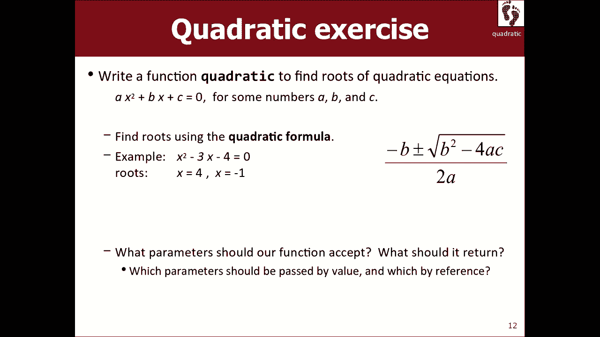

乘以C，然后是2a以上的全部，所以所有这些，在那里被2a除，所以右边是根1，然后根2相同，但是，而不是加号-因为加号或减号是我认为如果，您想提高效率，可以将这部分拉出来不是，叫行列式或尖叫或类似的东西。

所以也许我会打电话给，我忘记了判别双精度D等于哪个，所以我也许会，说D，所以我不必两次计算该东西，或者我什么都不知道，写出来，你可以在这里优化一点，然后再优化，成为根2，就是这样，我希望计算出两个根。

 ，公式，所以现在我在缅因州这里叫它，让我们看看是否有，正确的答案，所以它说根是4，负1是听起来正确X ，减4倍X加1我认为看起来不错，是的，我们在CS中，这几乎是强制性的。

我们所有人都会像基本简单的代数一样吸取数学，和数学之类的东西，但是我认为我发现我最尴尬了，当我尝试做加减运算时，看着你的人越多，你就不能像一位数字或，无论如何看起来都在工作的重点，例子是玩参考参数。

只是谈论参数，通过C ++传递，所以你们对此有疑问吗？ ，参数是的，哦，这是一个有趣的问题，所以如果这是一个参考，那么如果我刚刚写了，像42在这里，所以现在像42是路线1所以现在我要更改42的值。

成为其他值，例如42岁时存在生存危机， ，现在还有其他一些价值，答案是不起作用，我是说我可以告诉你，如果您尝试编译，它将说我的意思是该错误使您感到困惑，基本上不能使用带有文字双精度值的双引用。

传递一个文字值，只是一个数字，作为参考参数，您必须，传递一个内存位置，基本上是一个变量，你必须传递一个，可以在内存中被引用是的，这样就不会起作用了，关于参考参数的问题，是的，此程序假定。

二次方程式有两个实根，但并非总是如此，这种情况我认为您确定的方式就是您查看此D ，在这里DI相信的迹象告诉你有多少真正的根，所以我认为，只是为了继续前进，我要把它弄碎，但是你会。

最起码的话假设有两个真实的根，否则你会说在D上做if-else ，正弦值，因此您将需要检查是否有，是不是有两个根，是的，这对于B和C的某些值是不起作用的，如果我传入一个新对象该怎么办，是的。

我看看你是否在某种新物体中害虫，我的意思是我会说，简单的答案是您传入变量链接，因为变量名称，代表内存中的位置，实际上引用就像我想要的，从主共享到二次共享该内存，因此您无法传递任何，没有存储位置。

它可能是变量的名称，可能是，数组的索引，它必须是您已分配放置空间的地方，一些东西，最简单的答案就是变量，所以如果你只是，声明了一个新对象，就在我有此突出显示的地方，将其存储为任何名称，但也不希望这样。

所以是的，变量名是最简单的答案，很好的问题了，是的哦，记录默认传递的是什么类型的东西，答案什么都没有，然后我将讲到每一秒钟，每件事都是作为副本传递给C ++ ，除非你放了一个＆号，所以我可能会破坏了。

一分钟，但是就像你有一个大的东西，比如一百万个数组，任何人都将其作为参数传递的元素，您实际上不想复制那些，数百万个元素占用大量内存和时间，因此您实际上会，通过引用传递诸如此类的某些信息，但您会做出。

一定要放那些安伯森一家，但你必须做到这一点，因为人们永远做不到，为你，你总是必须决定通过事情，通过引用自己，所以您只需要考虑一下，您不需要多考虑的其他语言，所以我想说。

我想说的最后一件事是关于函数和参数以及东西，解决一个大问题，您必须考虑如何将问题分解为，小块，有时我们称其为分解问题，是好事还是坏事，我不会花时间在106 B上讲我，我想解决一个主题时就想到它。

但是我确实认为这是一个主题， ，学生可以在我已经在课堂网站上写了讲义的地方复习，在讲义区域，我将其称为程序分解讲义，建议您看看它，其中有一些我认为的代码示例，当你上交作业时，很容易沉稳，没有那么富有。

我们将对您具有良好分解代码的代码进行评分，所以也许您想，查看讲义中的一个好例子或一个反例，或两者兼而有之，他构成了一个问题，你肯定知道，函数的大小优于其他函数，但存在某些依赖性。

在比其他更好或更差的功能之间，如果您觉得自己很生锈，建议稍微刷新一下，关于如何分解一个大问题，好吧，我认为是一种很好的简单启发式方法，如果您查看缅因州，缅因州是否对总体。

程序将要做或确实意味着所有不好的事情或仅缅因州，缅因州有一条线跳到其他地方，而另一处则完成所有，缅因州的工作可能也很糟糕，应该让您知道其中大部分调用的少量行吗，其他功能一起做大块的工作，好吧，去看看。

讲义，如果您想了解更多信息，以便我继续前进，那就很多，每堂课都要包装材料，所以我想谈一谈弦乐，在C ++中，您可能已经了解了字符串，但是我将着重于， C ++中不同或独特的事物，所以您知道字符串是，对。

它是一个字符集合，所以如果您说string s等于您好，想要使用字符串，您必须包括一个免费的库，因为没有用，在C ++中免费，所以您说要包含字符串，并且要有尖括号，这样您，知道这是系统问题。

现在您可以说string s等于hello string ，可以是从零到多的任意数量的字符，所以很多，您对Java或JavaScript的字符串有很多直觉，在这里会很好，就像它们的索引从零开始， 。

您可以切出不同的字符，并可以进行操作以大写，小写并转换字符串并创建子字符串并搜索内容，就像这里的很多东西一样，只是方法名称略有不同，或者，坏消息是C ++具有两种不同类型的字符串， ，导致错误。

我将尽力在一分钟内帮助您了解差异，但这很糟糕，这不是马蒂不喜欢的许多事情之一， C ++是他们弄乱了两种类型的字符串哦，好吧，让我，给你看一些例子，所以这里有一些更熟悉的东西。

你知道如果你声明一个字符串，那么字符中的索引从零开始，在此示例中，索引从零到七个独立字符，如果您来自以下位置，则它们本身将存储为称为care的数据类型的值，如果您来自JavaScript。

则Java与Java基本相同，并没有真正的概念，即使只是，在C ++和Java中仅一个字母，各个字符是不同的，称为care的类型，它是原始数据类型，因此如果您要访问，您可以使用方括号来实现单个字符。

例如s括号， 3是索引3处的第四个字符，它是字母D ，如果您要访问个人，这里的示例在Java中很酷，性格你还记得怎么做吗，这里有一个叫做care的方法，还有一个叫做substring的方法，所以。

几乎没有什么不同的语法，实际上，该Intex稍好一点，一小会儿C ++比Java更好的功能谢谢，嗯，存储个别字符，因为这些护理值可以是，自由地转换为int和从int转换的字符值实际上只是，整数编码。

因此，如果将字符转换为INT，它将给您，一些数字，我们稍后可能会讨论，但是无论如何，这是里面的内容，一个字符串，您可以执行各种操作，在字符串上，您可以用加号连接字符串，例如，如果我有字符串Mar 。

我可以将Mart关联起来，这很酷，您可以在C ++中做的一件事，如果您可以询问哪个屏幕出现在屏幕的前面或后面，您将无法使用Java进行操作，其他顺序，也可以通过说等于来询问它们是否彼此相等。

等于或不等于，所以如果我问s 1是否大于2 ，字符串Marty是否比字符串晚于字母顺序， Cynthia区分大小写，它使用这些数字ASCII和涂层，比较，但这是比较字符串顺序的好方法，您可以。

说等于等于不等于询问街道是否等于特定文本，还是没有用Java，您记得您不应该，使用equals equals比较Java JavaScript中的字符串，Java可以。

记住如何比较一个字符串和另一个必须写点EQ的字符串， UAL就像方法一样，C ++做到了这一点，您可以说，像其他所有酷的类型一样，等于等于，这里很好，嗯，一件有趣的事，这是微妙的，我认为这将是。

一些学生迷失了Java和JavaScript中的字符串被称为，不可变的字符串，一旦创建了字符串，其值就永远不会改变，您可能会说，那不是真的，我一次做了一个字符串，然后我，大写它完全是你错了马蒂。

但实际上你，是不是您创建了一个新的第二个流，将其大写并替换了，第一个和第二个您从未真正更改过字符串，使它只是用C ++中的其他字符串替换它就无法更改，字符串，这样您就可以像调用故事一样调用这些方法。

那里存储了什么，如果还有更多停止代码，可以停下来停下来，我想我是，与Java稍有不同，但在大多数情况下可能不会影响，您的编码风格非常多，这些只是您可以做的一些小事情，用字符串做，所以是的。

我承认我没有向您展示该方法，但我只是，举个简单的例子，我认为这是比赛需要索引的幻灯片， ，从那里开始的长度，那么多字符将它们切出，这棵树是的，我比辛西娅大得多，军医命令比看到的要大，所以后者越大越好。

如果排列成较小的，则较早的方式与以intz相同的方式较少，首先是大不稳定，后来只是按字母顺序比较，实际上当我制作幻灯片时，开玩笑是因为我和这个叫辛西娅·李的女人一起上课，我只是，想表现得比我还大。

所以我不知道哪个好笑，她的距离比我还远，但我在溪流地带我变得比，她至少嗯，所以这里有一些这样的方法，我猜是，这些方法是不言自明的，也许是不同的，您已经用Java或JavaScript调用过的名称的名称。

例如，在Java中，您可以说出子字符串，但是在C ++中，它是substr，但是您知道我的意思，你可以说找东西没什么不对，我认为这在Java中称为索引，您可以要求输入相同的长度，多种语言。

所以我对这些方法不甚了解，也不应该太，令人震惊的可能是，唯一奇怪的是当您搜索事物时，说在这些方法中找到您通常知道的东西，返回一个int像发现什么索引一样正确，如果您说Marty员工并搜索步骤。

它将找到6的索引，对，因为S从那里开始，但是如果您搜索某物，在大多数语言中都找不到，因为它返回的是返回的英寸数，表示未发现实际上像一些负数一样，不是，在C ++中找到负一错误，它不返回负一错误，回报。

所以有点愚蠢，所以有些学生会写等于吗，否定的，并且永远都是假的，因为它暂停或返回，随便什么，但我不知道其中有些奇怪，但我认为这是，在这一点上，可管理的怪异对到目前为止关于，字符串方法是的，哦。

点比较它很像Java的“比较”概念，如果您有两个字符串，则传递到哪里，则少一个将是，负数与相等的负数相比更大，则为零，如果您左边的那个更大，它将是一个正数，因此它返回一个。

有符号整数表示两个字符串的相对顺序，是的，当我向这些表格显示斜体字或，粗体就像占位符部分一样，无论变量是什么，叫你会在那写那个变量名，所以如果你有一个字符串，叫名字。

你要写名字点比较名字点水平线其他字符串，是的，为什么在暂停中输入字符串，为什么不在引号中，当您想创建一个新值时，该字符串是一些变量，因此，他们已经确定这是一个变量，并且变量名称不会输入，带三个值的引号。

所以这就像一个附带的筛选库，内部变量，好吧，我想要一些数字，这是一些魔术数字，这可能是一个很大的数字，一个非常小的整数，所以无论该数字是多少，您都可以。

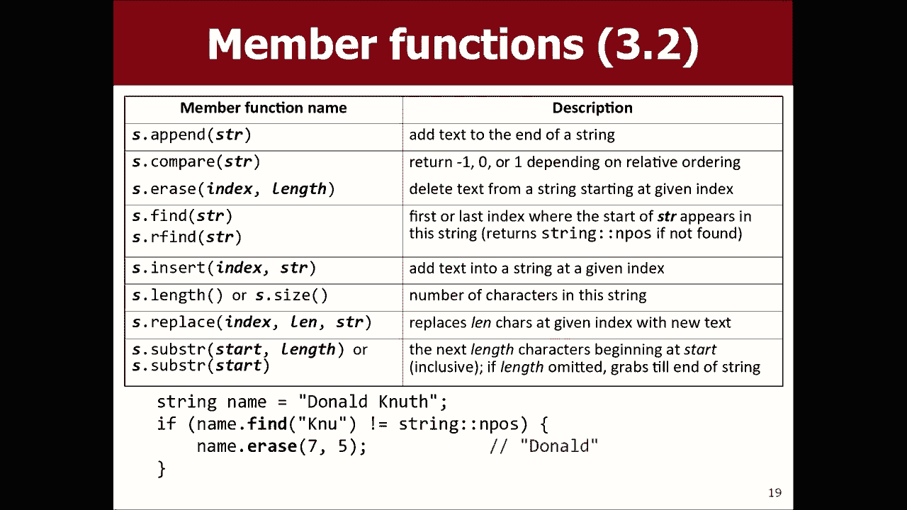

希望看到我们始终可以正确尝试，所以我们先包含字符串，然后再，字符串名称等于Marty步骤，然后让我们找出名称，然后，让我们看看暂停是否是暂停indle我的猜测有些疯狂，我认为是因为它可能不在该索引上。

所以，这意味着我猜它不在任何地方，是的，你去那就是我不知道，但这就是n暂停的值。

好的，另一个问题，这个数字代表什么只是一个常数它只是一些魔术，数字，它可能是64位整数的最大可能值，整数，所以它可能就是它的最大值，在字符串中可能找不到它，所以它只是一个。

恒定值基本上您不必担心该值是多少，寻找可以的东西，所以这些是字符串，这里还有一些字符串，我们在斯坦福大学觉得C ++字符串所缺少的功能，这对其他现代语言的Java JavaScript很有帮助。

所以我们做了，引用中名为stir Lib的图书馆是我们当地的斯坦福图书馆，它有一些，像开始这样的功能，所以它以大写到小写结尾，这些不是，在默认字符串库中，我们还包括一些用于。

将字符串与其他数据类型相互转换，例如仅将整数转换为，这种东西加倍，C ++包括这些东西，其他方法，但是很难做，我们想让它更容易一点，关于语法的事情是，我们编写的方法是外部的，函数。

您必须将字符串作为参数传递，而不是，上一张幻灯片中的那些是字符串内部的方法，说出流名称，然后说一个点，然后说出您想调用的方法，例如，例如，如果我想做大写版本的martístep，我不能。

过来这里说大点的名字点，方法不是自动，完成任何事情，因为没有这样的方法，而是你要做的就是你，包括这个混乱的Lib字符串库H，然后再次在这里您仍然不，用大写字母说，而不是用大写字母说。

函数返回字符串的大写版本，因此您必须说出名称，等于它本身的大写形式，类似于您可能使用的形式，记住从Java之类的东西，所以现在当我打印名称时，这是Mari步骤，大声对你大喊，所以在那里这些功能还有其他。

该库中的函数，您也可以在课程网站上查看，是其他功能，是所有这些之上的，所以这个想法是实际的，字符串对象本身随这些一起提供，这是C ++培训的一部分，在这里对这些人进行分类，就像有人已经写信给你分类一样。

不能在类中添加更多方法，因此我们不能使方法像在内部一样，字符串，但我们可以编写您在字符串中传递的外部函数，我们会做一些事情，所以我们除了最后一个，幻灯片哦，我想您必须同时包括搅拌Lib和琴弦。

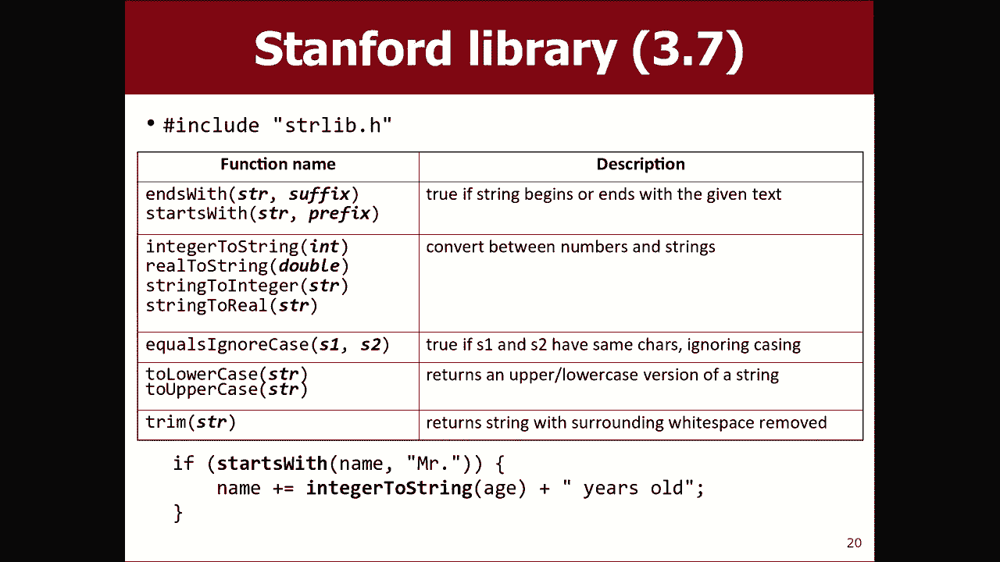

从技术上讲，我们的搅拌Lib包括绳子，所以您确实会得到两者，但我认为，最佳做法是只包含您认为需要的所有内容。

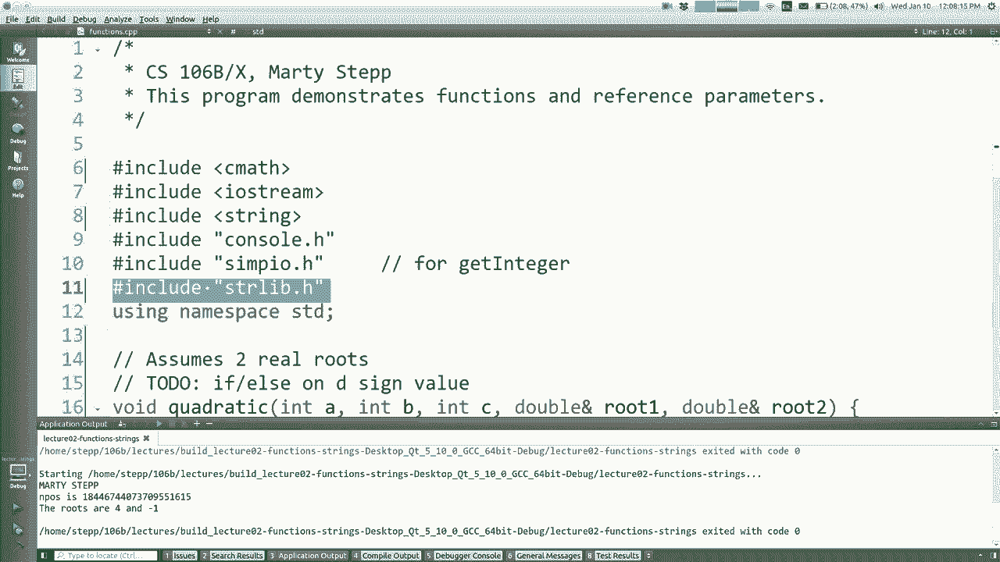

所以哦，我不想刷这些转换功能，这些很有用，将整数转换为字符串，反之亦然，例如将字符串转换为字符串。

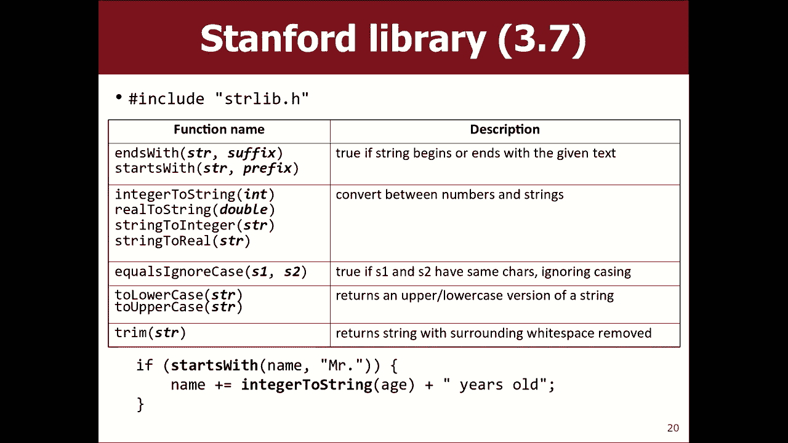

就像您知道int或字符串年龄搅动等于42一样，就像某人的年龄或，无论如何，您想获得int 42，很多人都有这种本能， ，您想投下等于42岁的东西，因为，你已经学会了自己，就像有些人已经学会了你。

可以在不同类型之间键入类型转换，我认为在JavaScript中有一个，称为parse int或其他功能的函数，但是不能正常工作，取而代之的是，您需要调用我们的称为字符串的函数为整数，然后经过年龄搅拌。

然后它将返回您知道的int 42，现在您，如果将其保留为字符串，则可以使用该int计算内容，数值计算就可以了，如果您要吃42和，您由于某种原因想要字符串42，还有一个要整数的字符串，还有。

整数字符串可以。

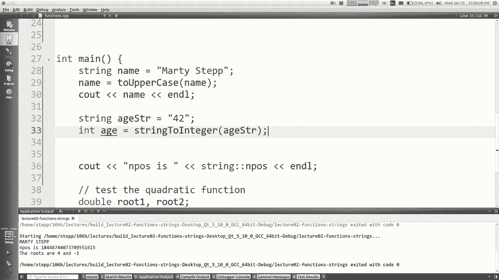

所以这是一个运动问题，我是说我正在混合很多东西，我们今天已经学到的和混合引用，我已经有了字符串，你应该，一秒钟看一下，一次就在右侧获得了多个选择，你看看它，我们将在一分钟内谈论它的输出。

所以一个很勇敢的人想告诉我他们认为正确，回答，马蒂的妈妈国家环保总局，好吧，你怎么知道的，所以我们通过A和B这是Marty并向右走，所以Marty是这并向右走，可以，所以我要在这里删除。

但是根据您的回答，您仍然可以， M在这里的输出中，为什么M仍然在那里但未被传递，引用它作为常规参数传递，它是字符串的副本，因此，当我删除字母M时，更改不会恢复正常，这样。

消除答案C和E然后说B加等于0 ，字符串a在第一个字母处的字符0是字母A ，因为M被删除，所以B变成了stepa，然后我们插入foo这样，变得僵硬的oopah这些更改作为参考已通过。

直接修改main中的B变量，因此它们会持续存在，因此当我们打印a的完好无损而b已更改时，是的，我，认为你是对的，我认为是D，如果没有得到，那是好的，我的意思是，今天第一次看到参考文献，但您可能想练习。

逐步在代码中包含参考参数和内容的其他问题，像这样我喜欢在测试中我喜欢有一个，代码编写问题和共同阅读的混合体，我将向您展示一些我要说的代码，它是做什么的，所以您必须通过这个小谜团来解决难题，问题。

看看输出结果是什么，您对此有一些疑问，有道理的问题，我尽量避免说出有道理，因为我猜格里·甘蔗是其中之一，他说我们其他的教授很有道理，我想有人削减了，他一直都这么说，他们剪接起来，你们看到了这件事。

他说的YouTube很有意义，大概一分半钟，我现在说我每天都在，怕你们会把这些拼接在一起，我猜是所有咒骂词中的一个超级剪裁，但是，是的，无论如何，要去看它在斯坦福大学的意思是Big O我在那儿。

我在那儿，那里我在伯克利一两个是的，无论如何，让我们继续前进，您可以从可以询问的键盘上读取字符串，用户输入一个字符串，您可以说嘿，您叫什么名字，等他们，要输入答案，我们在上一堂课中输入了整数。

说一个整数，你也可以说获取行从用户我读取行，上次谈到C的情况，您可以间接使用C我，说虽然我认为C n不是很好，也许不是很好，选择和C in不好的另一个原因是，当您尝试读取一个，流一次只能读取一个单词。

所以如果您说自己的名字叫约翰·杜，它只会读John部分，所以大多数人都觉得这很奇怪，当您按ENTER键时，您键入的所有内容均是您的输入，因此我们有一个，名为get line的函数。

您会说出提示消息是什么，它将，向他们询问该消息，然后等待他们键入一行，返回整行，所以我认为这是正确的方法，令人困惑的是已经有一个功能，所以我推荐中间的那个是蓝色的，得到一行以读取用户输入的字符串，好吧。

我不会，真的花所有的时间在这张幻灯片上，让我们做一些运动问题，让我们一起编写一个名为name diamond的函数，然后传递一个字符串参数，然后打印出字符串字母的菱形图案，就像这样。

可以将其作为功能的控制台输出，所以也许，如果您想继续玩下去，可以帮助我，步骤站点，所以我们写一个名为Diamond的网站。

所以，我当然首先要你告诉我标题。

参数是否命名为diamond正确使用字符串，所以string s ，好吧，NIEM钻石的退货类型是什么，是的，我的意思是你说的有些人可能已经说过了，你知道我明白了。

人们对此有些困惑，因为此功能的结果是。

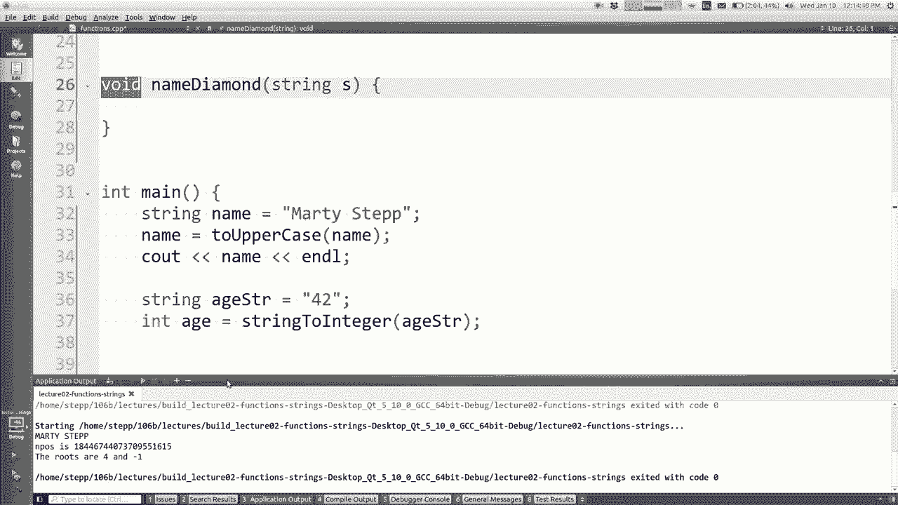

打印文本，所以人们走了哦，这是一个字符串，所以它返回一个字符串，但我不希望您返回我要求您打印出的字符串，字符串作为输出，我希望该输出在控制台上，我不希望您返回，如果要我解决一个问题。

我希望您输出它们是不同的，问题，我想让你退还一些东西，我一定会用这个词，返回问题的描述，我会说返回或返回那个或，随便什么，但不要使用return一词，我暗示您不需要，返回任何东西，是的。

我希望您打印输出，这是一个无效的方法，所以还可以，我需要打印所有的RT，所以我该怎么做，有人帮我解决。

再次打印m，然后MA和ma是两个Y，然后开始打印， RT Verde好的，那么我该怎么做，我会接受部分答案，让我开始，告诉我一些对您有所帮助的内容，好吧。

让我们一支钢笔在for循环中做索引我想我可以做到，对于int的部分，我等于零，并且我小于字符串长度，所以它称为s ，点长度好吧，现在我在做什么每一行好吧，写这些子字符串，如果您愿意。

Mme ma是那些字符的r个子范围。

如果我将这些字符串方法备份到这里，可能会有所帮助，所以你说了子字符串，所以如果我要开始索引并增加长度，它将给我，你知道从那里开始有很多字符，所以如果我要打印Em Mema 。

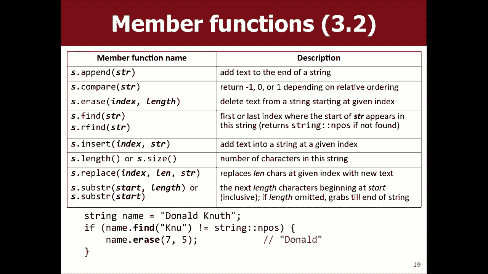

您是在说我想做点什么吗？开始是什么，什么是，长度从零开始，就像我要打印的前几行一样，只是第零个字符我可以走多远，好吧，如果我看到了怎么办，那和substr不会修改s，它基于s返回一个新的字符串，所以我。

可以尝试一秒钟，我们可以测试一下，让我让我，注释掉所有其他内容，因为我只想有一个空的main，所以让我们开始吧，名字迪蒙·马蒂（Dimond Marty），我能得到什么？玛特（Mart）就在眼前。

是看起来像第一行的长度，它打印零个字符，所以我的意思是，也许我们想说我加一只印多一点，所以现在我，起床去Marty好吧，很酷，这是一个不错的开始，所以您可能会说得很好，天哪。

我该如何更改此循环以同时打印其他部分，我认为，同一循环必须完成全部工作，我们可以与他们一起生活，我们到目前为止，也许这部分是钻石的前半部分，也许，我们将在下半年编写另一段代码，好吧。

我该如何打印这样的东西，好像前面有空格，所以也许一秒钟我们可以忽略空格，让我们尝试打印，首先在每一行上正确的小子串，那么我该怎么做，您认为还可以，我只是要再次遍历，字符串，但是索引是不同的。

那么如果我把它放在这里是什么意思。

您只传递一个参数，这意味着从该索引到末尾，但是在此之前省略所有内容，好吧，让我们看看是否可以让我尝试一下。

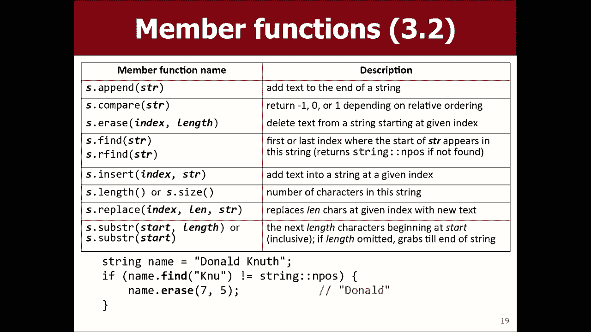

搞清楚那是怎么回事，但是打印两次却很聪明，所以我喜欢两次见到我的名字，但这不是正确的输出，所以也许，再说一遍，就是我加一个起点，再加上一个，让我们看看现在是否有帮助，很好，除了我希望这些人搬过来。

所以我该如何将他们搬到，正确的你怎么看，哦，我可以用空格替换字符吗，是的，我可以猜到，我当时想就像在这里我想做两件事我想打印一些，空格数，然后第二个我想打印s的子字符串，所以我，如果我可以避免的话。

我宁愿不喜欢mutilate，尽管我当然会，认为如果您不介意我可以那样做，我宁愿，弄清楚我需要打印多少空间，然后再打印那么多空间，就像我怎么知道有一天我需要打印多少个空格。

尚未从字符串的正确链接中听到消息-如果您要打印，角色反复没有魔法命令，所以我们只需要做一个，为此循环，就像它的四个循环jj小于j加，看到空间，我不是说Endel不会走下去，只是往前走，然后。

问题是要在您的建议的点上移动多少个空格，长度-我可能是正确的，它可能偏离了我们一个，试试看，嗯，我要告诉你一件事，空格的数量正在增加，所以，因此，如果您减去我，那将使数字下降，那么。

如果只有我的空间那是什么，如果可以的话那是什么，那是，接近，但我被一个人吸引了，似乎我有很多加一，正确的问题，所以也许我再加上一个空格是一个我们有名字的好工作团队，所以无论如何我只是在玩字符串。

以播放字符串方法，我的目标是运动时间到了，我没时间了，所以我会，让您今晚和明天查看这两节课，设置可爱的创作者，明天下午我会通过电子邮件向您发送有关部分注册的信息，谢谢大家。

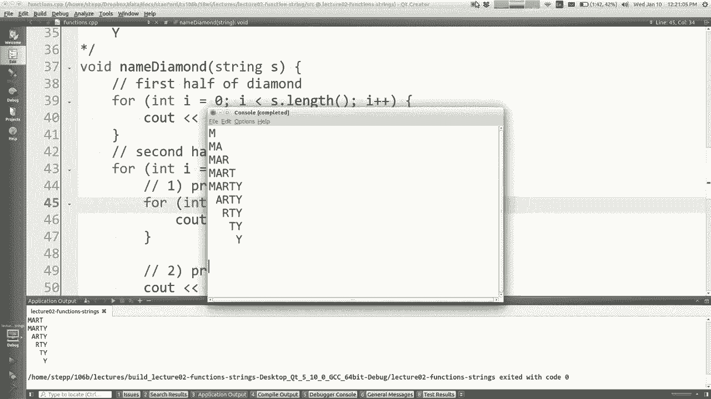