# 📘 课程名称：CS106B C++中的抽象编程 · 第02讲

## 📋 概述
在本节课中，我们将学习C++函数的核心概念，包括函数原型、参数传递机制（值语义与引用语义）、默认参数以及字符串的基本操作。我们还将通过编写一个二次方程求解函数和一个字符串菱形打印函数来实践这些概念。

---

## 🔧 函数原型与声明


上一节我们介绍了基本的函数定义和调用。本节中我们来看看C++中一个特有的要求：函数在使用前必须被声明。


在C++中，如果你先调用一个函数，然后在文件后面才定义它，编译器会报错，提示该函数“未声明”。这与Java或JavaScript等语言不同。

解决这个问题的方法是使用**函数原型**。函数原型就是函数的声明，它只包含返回类型、函数名和参数类型，并以分号结尾。它相当于向编译器承诺：“我稍后会定义这个函数”。

**代码示例：**
```cpp
// 函数原型声明
void printMessage();

int main() {
    printMessage(); // 调用函数
    return 0;
}

// 函数定义
void printMessage() {
    cout << "Hello, World!" << endl;
}
```

许多程序员的常见做法是：先写完函数定义，然后将其函数头（即返回类型、函数名和参数列表）复制到文件顶部，并加上分号，作为原型声明。

---

## ⚙️ 参数传递：值语义与引用语义

理解了函数声明后，我们来看看C++中参数是如何传递的。这涉及到两个核心概念：**值语义**和**引用语义**。

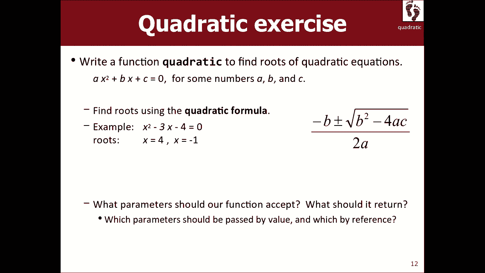

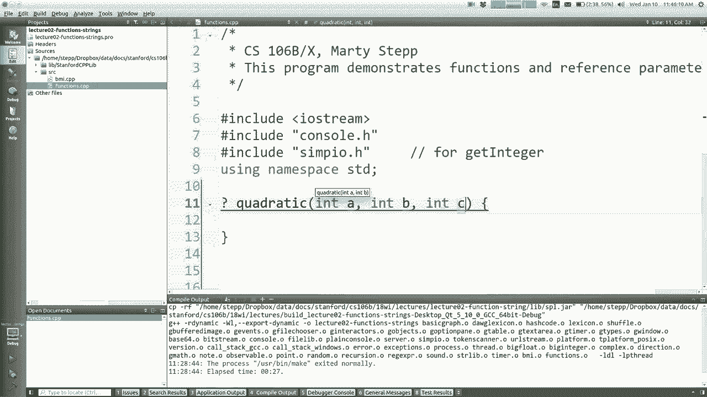

### 值语义
默认情况下，C++使用**值语义**传递参数。这意味着当你将一个变量传递给函数时，传递的是该变量值的**一个副本**。函数内部对参数的任何修改都不会影响原始的变量。


**代码示例：**
```cpp
void swap(int a, int b) {
    int temp = a;
    a = b;
    b = temp;
}
int main() {
    int x = 5, y = 10;
    swap(x, y);
    // x 仍然是 5, y 仍然是 10
}
```
在上面的`swap`函数中，交换的只是`a`和`b`这两个副本，`main`函数中的`x`和`y`并未改变。

### 引用语义
如果你希望函数能够修改调用者传递的原始变量，就需要使用**引用语义**。通过在参数类型后添加`&`符号，可以将参数声明为引用。这样，函数内的参数就是原始变量的一个“别名”，对它的修改会直接影响原变量。

**代码示例：**
```cpp
void swap(int &a, int &b) { // 注意这里的 & 符号
    int temp = a;
    a = b;
    b = temp;
}
int main() {
    int x = 5, y = 10;
    swap(x, y);
    // x 现在是 10, y 现在是 5
}
```

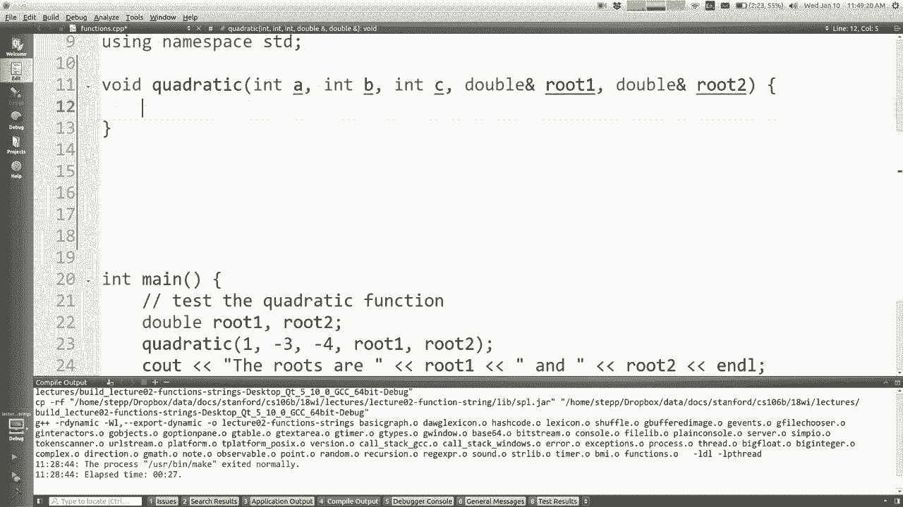

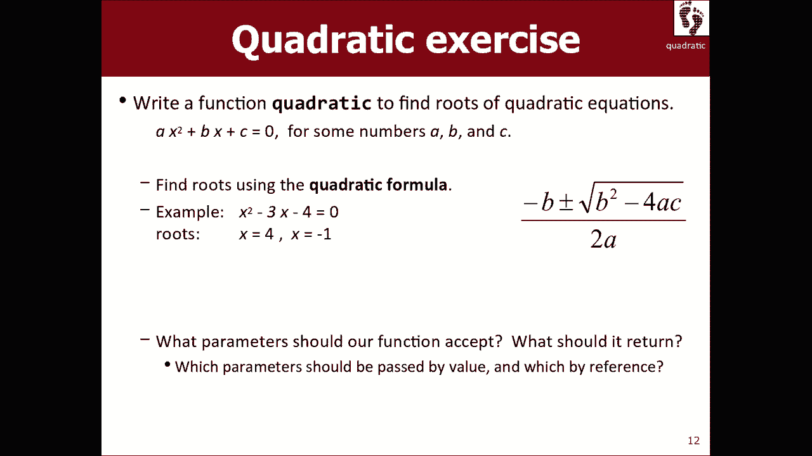

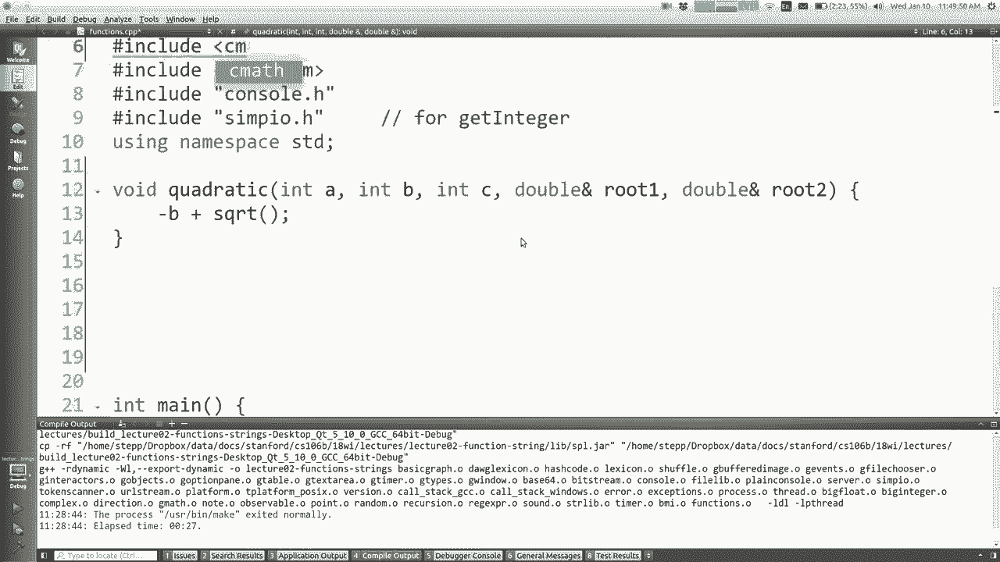

引用参数的一个典型用途是**输出参数**，即函数需要“返回”多个值。由于`return`语句只能返回一个值，我们可以通过引用参数将结果“填充”到调用者提供的变量中。


**代码示例（输出参数）：**
```cpp
// 计算允许的约会年龄范围（基于一个虚构公式）
void datingRange(int age, int &min, int &max) {
    min = age / 2 + 7;
    max = (age - 7) * 2;
}
int main() {
    int young, old;
    datingRange(48, young, old);
    // young 和 old 现在被赋予了计算后的值
}
```

**注意**：引用参数必须传递一个变量（即内存位置），不能直接传递一个字面量（如`42`）。

---

## 🧮 实践：编写二次方程求解函数

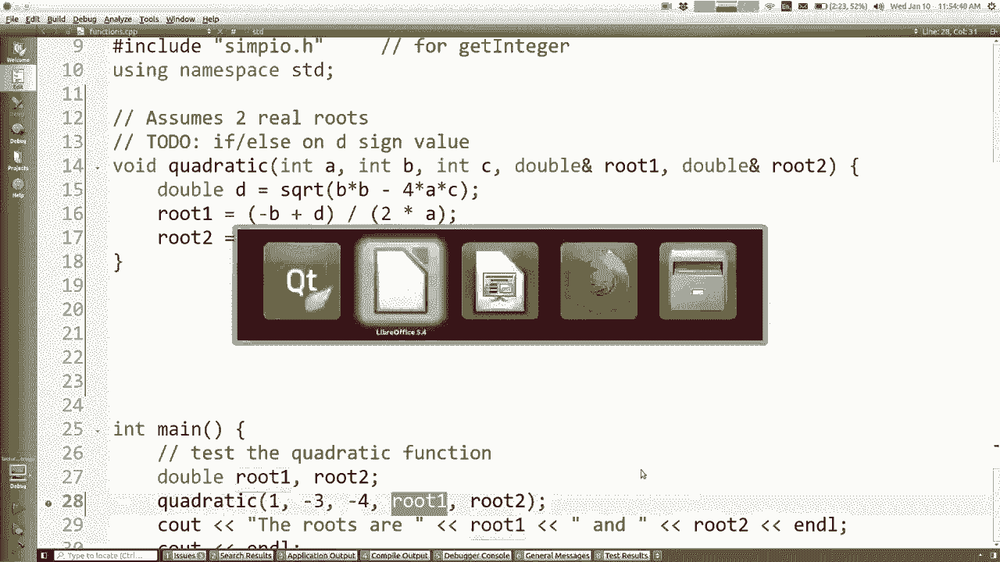

让我们运用引用参数来编写一个实用的函数：求解二次方程。

二次方程的标准形式是：**ax² + bx + c = 0**。其求根公式为：
**x = [-b ± √(b² - 4ac)] / (2a)**

我们的函数需要接收系数a, b, c，并通过两个引用参数`root1`和`root2`返回两个实根（本示例假设判别式大于等于0）。

**代码实现：**
```cpp
#include <cmath> // 用于 sqrt 函数

void quadratic(double a, double b, double c, double &root1, double &root2) {
    double discriminant = b * b - 4 * a * c;
    root1 = (-b + sqrt(discriminant)) / (2 * a);
    root2 = (-b - sqrt(discriminant)) / (2 * a);
}

int main() {
    double r1, r2;
    quadratic(1, -3, -4, r1, r2); // 解方程 x² - 3x - 4 = 0
    // r1 约为 4.0, r2 约为 -1.0
}
```
**思考**：为什么系数`a`, `b`, `c`没有使用引用传递？因为在这个函数中，我们只需要它们的值进行计算，并不打算修改它们。

---

## 📝 字符串操作

现在，我们将注意力转向C++中的字符串。C++标准库提供了`string`类型，但使用时需要包含头文件`<string>`。


### 基本操作
字符串的许多操作与Java/JavaScript类似：
*   索引从0开始，使用`[]`访问单个字符。
*   使用`+`进行字符串连接。
*   使用`==`, `!=`, `<`, `>`等运算符直接比较字符串（按字典序）。
*   使用`.length()`获取字符串长度。
*   使用`.substr(start, length)`获取子串。


**代码示例：**
```cpp
#include <string>
using namespace std;

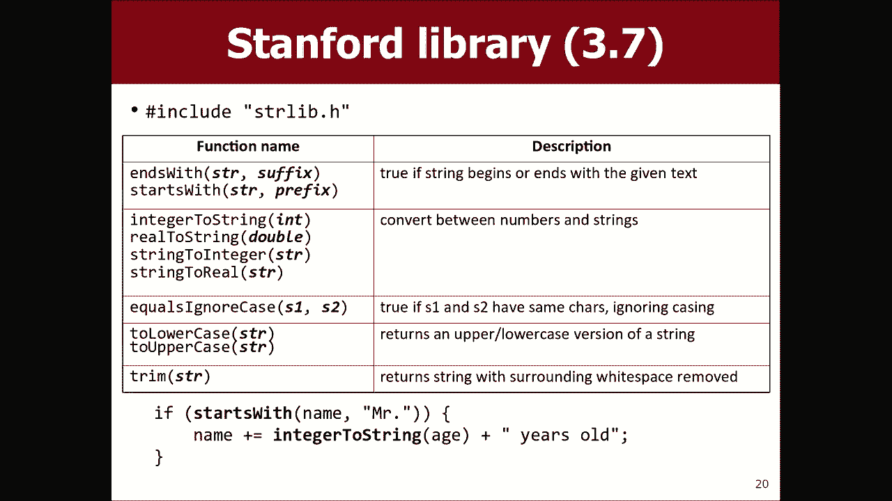

string name = "Marty";
char firstChar = name[0]; // ‘M’
string greeting = "Hello, " + name; // “Hello, Marty”
bool isLater = name > "Cynthia"; // true，因为 “Marty” 在 “Cynthia” 之后
```


### 斯坦福库扩展
C++标准字符串库缺少一些常用功能（如大小写转换）。为此，斯坦福课程提供了一个扩展库`“strlib.h”`，它包含一些有用的函数，如：
*   `toUpperCase(str)`: 返回大写字符串。
*   `toLowerCase(str)`: 返回小写字符串。
*   `stringToInteger(str)`: 将字符串转换为整数。
*   `integerToString(num)`: 将整数转换为字符串。


**注意**：这些是独立的函数，而不是字符串对象的方法。


**代码示例：**
```cpp
#include “strlib.h”
string name = “Marty”;
string shout = toUpperCase(name); // 返回 “MARTY”
int num = stringToInteger(“42”);
string numStr = integerToString(123);
```

### 读取用户输入
从控制台读取一行字符串，推荐使用课程库提供的`getLine(prompt)`函数，它会读取用户输入的全部内容（直到回车），而不仅仅是第一个单词。

**代码示例：**
```cpp
#include “simpio.h”
string name = getLine(“What is your name? “);
```

---

## 💎 实践：编写字符串菱形打印函数


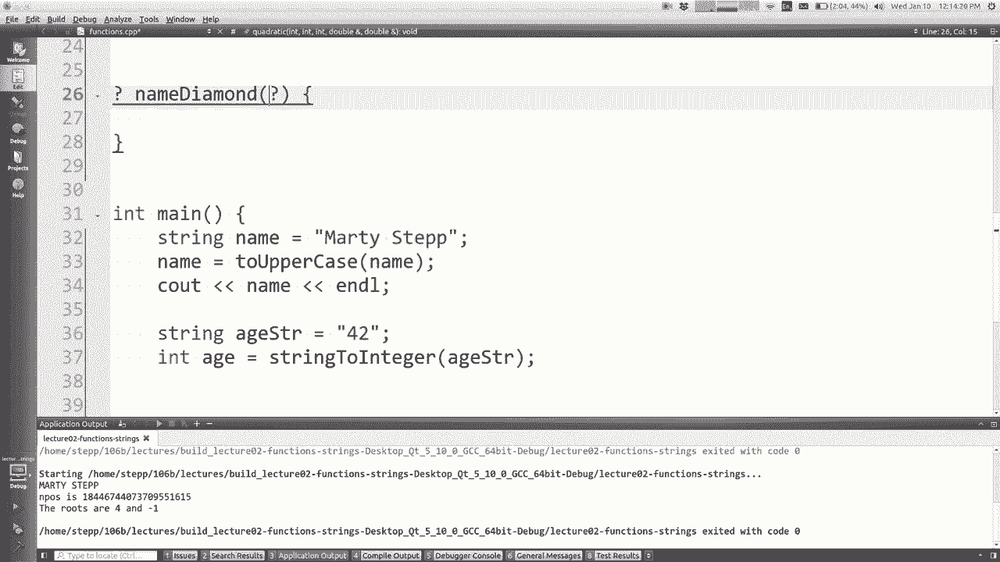


最后，我们通过一个练习来巩固对字符串和循环的理解：编写一个`nameDiamond`函数，它接收一个字符串，并打印出该字符串字母组成的菱形图案。

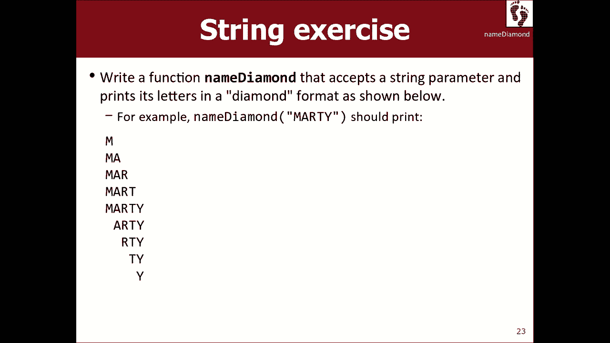

例如，对于输入`”Marty”`，输出应为：
```
M
Ma
Mar
Mart
Marty
 arty
  rty
   ty
    y
```

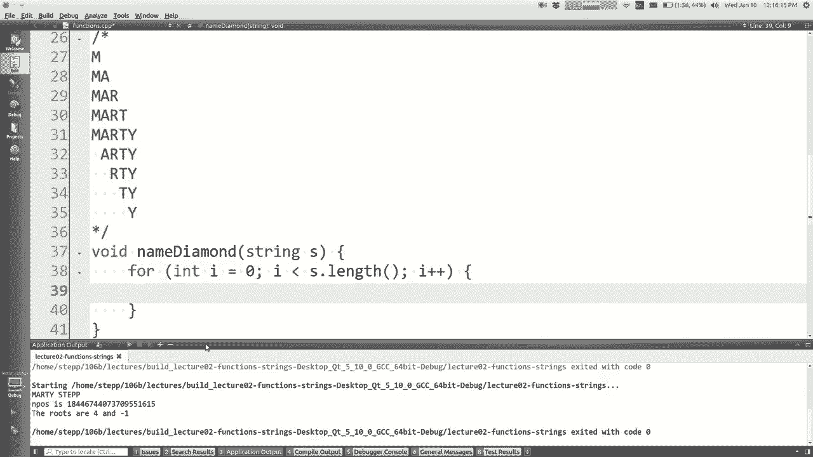


**实现思路：**
1.  上半部分（递增）：循环从索引0到字符串末尾，每次打印从开头到当前索引的子串。
2.  下半部分（递减）：另一个循环，打印逐渐增加的空格，然后打印从当前索引到末尾的子串。

这个练习留给大家课后完成，重点在于熟练运用字符串的`.substr()`方法和循环控制。

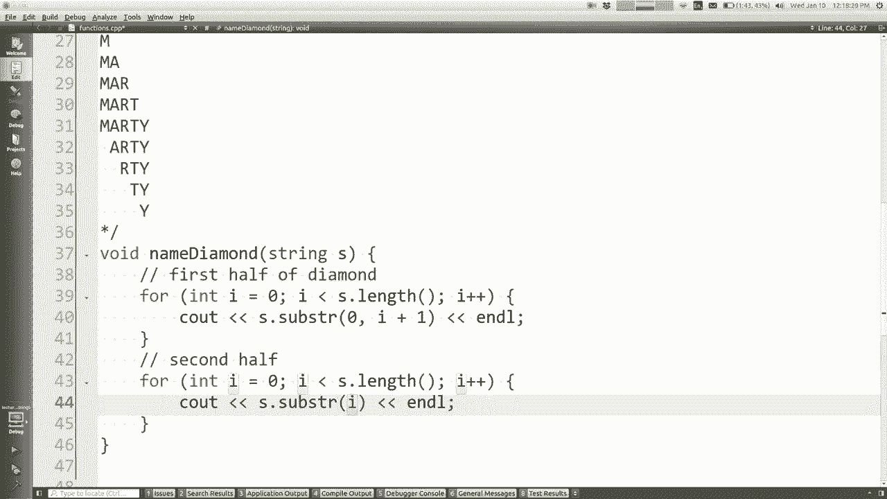


---

## 📚 总结
本节课中我们一起学习了：
1.  **函数原型**：在C++中必须先声明后使用，通过函数原型解决。
2.  **参数传递**：理解了**值语义**（传递副本）和**引用语义**（传递别名，使用`&`符号）的区别，以及**输出参数**的用途。
3.  **字符串基础**：学习了C++`string`的基本操作、比较、连接，以及斯坦福`strlib`库提供的扩展功能。
4.  **实践应用**：通过编写二次方程求解函数和构思字符串菱形打印函数，将理论应用于实际问题。


掌握这些函数和字符串的基础知识，是构建更复杂C++程序的基石。