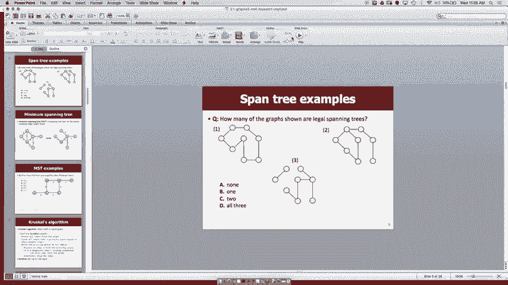
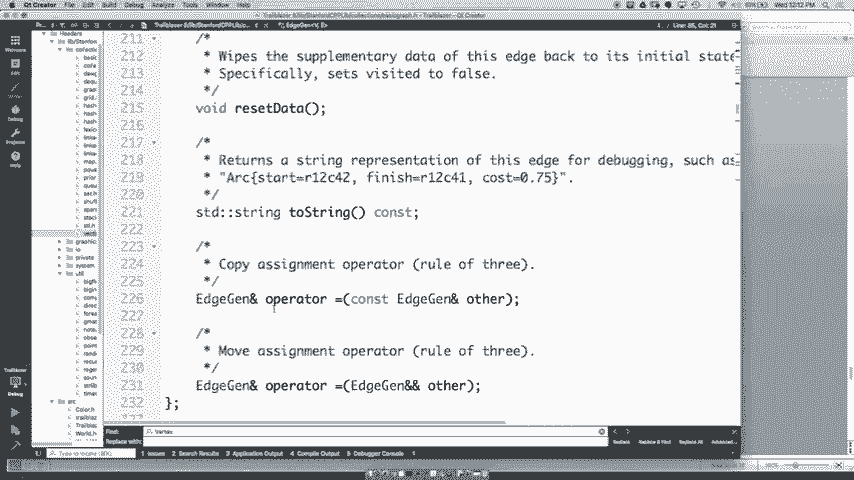
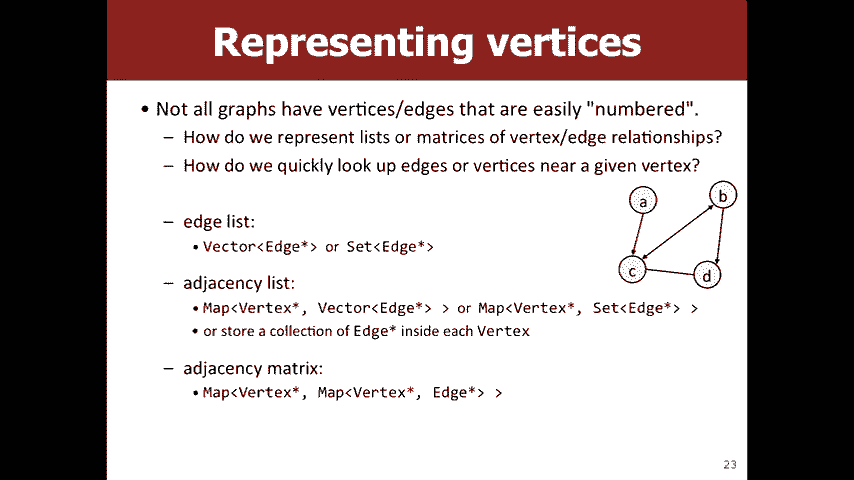
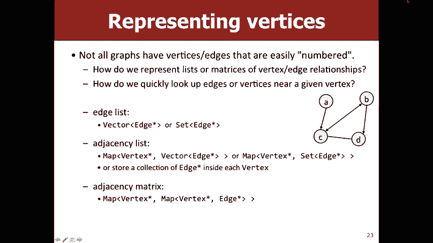

# 课程20：最小生成树与图的实现 🌳

在本节课中，我们将学习图论中的两个核心概念：**最小生成树** 和 **图的实现方式**。我们将首先理解什么是生成树和最小生成树，然后学习一个寻找最小生成树的经典算法。最后，我们将探讨如何在计算机中表示和实现图这种数据结构。

---

## 什么是生成树？ 🤔

上一节我们介绍了图的基本概念。本节中我们来看看生成树。

生成树是一个无向连通图的子图。它必须满足以下条件：
1.  包含原图的所有顶点。
2.  是一个树（即无环且连通）。
3.  边的数量为 **V - 1**（其中 V 是顶点数）。

以下是一些判断示例：
*   如果一个子图包含环，则它不是生成树。
*   如果一个子图没有连通所有顶点，则它不是生成树。
*   如果一个子图的边数不是 V - 1，则它不是生成树。

---

## 什么是最小生成树？ ⚖️

理解了生成树后，我们来看看它的一个特殊变体。

最小生成树是所有生成树中，**边的权重总和最小**的那一棵。在带权图中，我们通常希望找到成本最低的连接方案。

例如，考虑一个图，如果选择权重为8的边而不是权重为4的边，那么生成树的总成本就会增加，因此它就不是最小生成树。

以下是寻找最小生成树的思路：
*   目标：连接所有顶点，同时使总边权最小。
*   它与寻找两点间最短路径的算法不同，最小生成树关注的是**整个图**的全局最优连接。

---

## 克鲁斯卡尔算法 🛠️

为了高效地找到最小生成树，我们需要一个算法。本节介绍克鲁斯卡尔算法。

克鲁斯卡尔算法的工作方式如下：
1.  将图中所有边按权重从小到大排序（通常使用优先队列）。
2.  初始化一个空的边集，用于存放最小生成树的边。
3.  按顺序检查每条边，如果这条边连接了两个当前尚未连通的子图（或集群），则将其加入最小生成树的边集。
4.  重复步骤3，直到最小生成树中包含 **V - 1** 条边。

算法的核心在于如何快速判断一条边的两个端点是否已经连通。这通常可以使用**并查集**这种数据结构高效实现。

以下是算法的一个关键检查步骤：
```cpp
if (!isConnected(edge.start, edge.end)) {
    addEdgeToMST(edge);
    union(edge.start, edge.end); // 合并两个集群
}
```

---

## 图的实现方式 💻

我们已经讨论了图的算法，现在来看看如何在代码中表示图。

图需要存储顶点和边。有三种常见的实现方式，各有优劣，选择哪种取决于你需要频繁进行哪些操作。

以下是三种主要的实现方法：

1.  **边列表**
    *   **描述**：简单地存储一个包含所有边的列表。
    *   **优点**：实现简单；遍历所有边很高效。
    *   **缺点**：查找某条边是否存在或查找某个顶点的所有邻居效率很低，需要遍历整个边列表。

2.  **邻接表**
    *   **描述**：为每个顶点维护一个列表，记录与其相邻的所有顶点（或边）。
    *   **优点**：查找一个顶点的所有邻居非常高效；添加顶点和边也很快。
    *   **缺点**：检查任意两个顶点间是否有边存在，需要遍历其中一个顶点的邻居列表。

3.  **邻接矩阵**
    *   **描述**：使用一个 V×V 的二维矩阵。如果顶点 i 和 j 之间有边，则 `matrix[i][j]` 为1（或边的权重），否则为0。
    *   **优点**：检查任意两个顶点间是否有边存在速度极快（O(1)）。
    *   **缺点**：占用空间大（O(V²)）；添加新顶点成本高；查找一个顶点的所有邻居需要遍历整行。

---

## 实现选择与算法适配 🤝


不同的图算法适合不同的底层实现。




*   **广度优先搜索**：适合使用**邻接表**，因为需要频繁访问每个顶点的所有邻居。
*   **克鲁斯卡尔算法**：适合使用**边列表**或**邻接表**，因为算法需要遍历所有边。使用邻接矩阵则需要检查 V² 个位置，效率较低。
*   **添加顶点**：**边列表**和**邻接表**表现良好，而**邻接矩阵**则非常低效。

在实际的课程库（如CS106B的 `Graph` 类）中，通常采用一种**混合策略**：同时维护一个边集合（便于全局边遍历）和每个顶点的邻接边集合（便于查找邻居），在易用性和常见操作效率之间取得平衡。


---




## 总结 📚

本节课中我们一起学习了：
1.  **生成树** 是连通无环且包含所有顶点的子图。
2.  **最小生成树** 是权重总和最小的生成树，用于解决如网络布线、道路规划等最低成本连通问题。
3.  **克鲁斯卡尔算法** 通过按权重排序边，并逐步合并未连通的集群来构建最小生成树，其高效实现依赖于并查集。
4.  **图的实现** 主要有边列表、邻接表和邻接矩阵三种方式，它们在不同的操作（如查找邻居、检查连通性、添加顶点）上各有优劣，需要根据具体算法需求进行选择。




理解这些概念和权衡，将帮助你为不同的问题选择最合适的数据结构和算法。