# 课程21：哈希表 🗂️

在本节课中，我们将要学习一种称为“哈希表”的数据结构。这是一种非常高效的数据结构，能够实现常数时间复杂度的添加、删除和查找操作。我们将从最简单的想法开始，逐步解决实现过程中遇到的各种问题，最终理解现代编程语言中哈希集和哈希映射背后的核心原理。

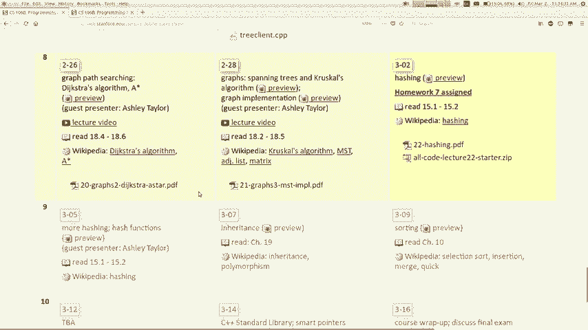

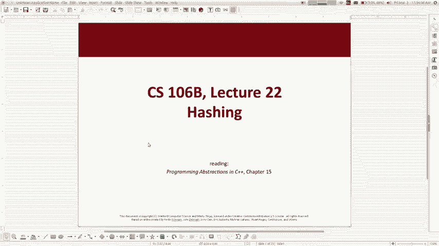

上一节我们介绍了多种集合的实现方式及其性能。本节中，我们来看看如何通过哈希表实现近乎完美的常数时间复杂度操作。

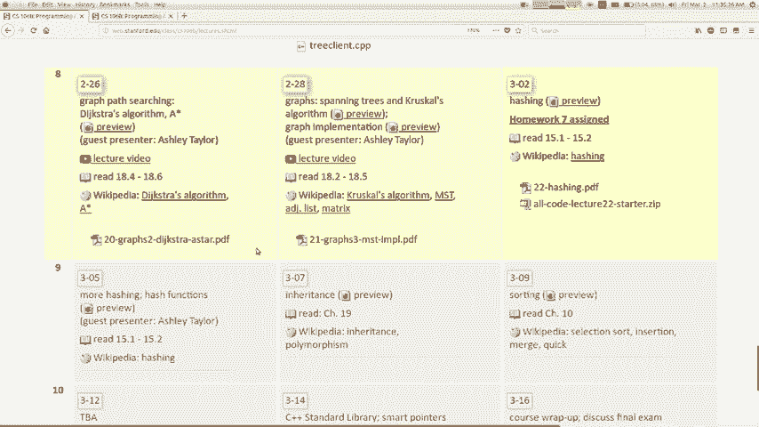

## 概述：哈希的核心思想

这里的背景是，我们一直在学习如何实现各种不同的抽象数据类型（ADT）。我们学习了如何实现向量和链表，也学习了如何使用二叉搜索树来实现集合。

今天，我们将讨论如何实现**哈希集**和**哈希映射**。这是一个非常巧妙的想法。还记得吗？在哈希集中，添加、删除和搜索操作的时间复杂度都是 **O(1)**。这是最好的时间复杂度。你可能会好奇，如何能实现一个能“瞬间”找到元素的集合？这正是我们今天要探讨的。

## 从简单想法开始：直接地址表

假设我们正在尝试实现一个存储整数的集合。为了简单起见，我们先从一组整数开始，之后再扩展到字符串等其他数据类型。

如果我们用之前学过的方式存储，比如用一个未排序的动态数组来实现集合，那么操作的效率如何？
*   **添加**：很快，只需放到数组末尾。时间复杂度为 O(1)。
*   **包含（搜索）**：必须遍历所有元素。时间复杂度为 O(n)。
*   **删除**：需要找到元素，然后可能需要移动其他元素来填补空缺。时间复杂度为 O(n)。

对于集合来说，`contains`（查找）操作是最重要的。如果搜索速度很慢，即使添加很快，体验也会很差。当数据量 n 很大时，O(n) 的搜索时间是不可接受的。

我们学过用二叉搜索树实现集合，其添加、删除和查找操作的时间复杂度都是 **O(log n)**。这比 O(n) 好得多，但我们能否做得更好呢？

让我们思考一个奇特的想法：**如果你把值 n 存储在数组的索引 n 上会怎样？**

例如，添加元素 7，就把它放在数组索引 7 的位置。添加元素 2，就放在索引 2 的位置。这样，所有操作会变得非常简单：
*   **添加**：直接跳到对应索引，放入值。时间复杂度 **O(1)**。
*   **包含**：检查对应索引处是否有值。时间复杂度 **O(1)**。
*   **删除**：将对应索引处的值清零。时间复杂度 **O(1)**。

这听起来是个完美的 O(1) 方案！但显然，它存在很多问题。

## 直面问题与初步解决方案

这个“完美”想法存在哪些问题呢？以下是一些关键的反对意见及其初步解决方案：

1.  **问题**：无法存储负数（没有负的数组索引）。
    *   **方案**：维护两个数组，一个存正数，一个存负数。或者使用绝对值函数。

2.  **问题**：无法存储非整数类型（如字符串、浮点数）。
    *   **方案**：我们稍后再解决这个问题。先专注于让整数版本工作。

3.  **问题**：如果要存储的值非常大（比如一百万），就需要一个极其庞大的数组，其中绝大部分空间是空的，造成巨大浪费。
    *   **方案**：使用一个固定大小的数组，并通过取模运算将大范围的数值映射到小范围的索引上。例如，对于容量为 10 的数组，值 `1543` 可以存放在索引 `1543 % 10 = 3` 的位置。

这个“取模”操作引出了哈希的核心概念。

## 哈希函数与哈希表

我们将一个较大值域的元素映射到一个较小固定范围（通常是数组索引）的过程称为 **哈希（Hashing）**。
用来存储这些值的数组结构称为 **哈希表（Hash Table）**。
执行这种映射的函数称为 **哈希函数（Hash Function）**。

对于我们简单的整数集合，一个基础的哈希函数可以是：
`hashCode(value) = abs(value) % arrayCapacity`

这个版本的哈希函数仍然有问题：**多个不同的值可能会被哈希到同一个索引中**。例如，`37` 和 `47` 在容量为 10 的数组中，都会映射到索引 7。这个问题称为 **冲突（Collision）**。

冲突是哈希表必须解决的核心问题。我们不能简单地忽略它，否则新值会覆盖旧值，导致数据丢失。

## 冲突解决策略

有两种主要的冲突解决策略：**开放寻址法**和**链地址法**。

### 策略一：开放寻址法（线性探测）

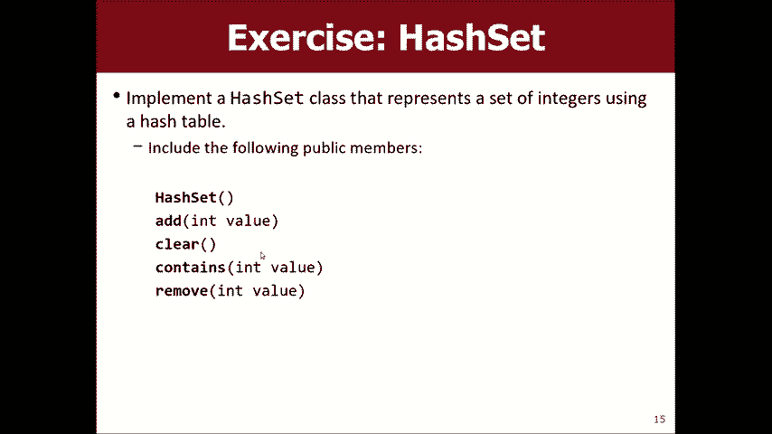

这种方法在发生冲突时，将元素放入哈希表中的“下一个”空闲位置。
*   **类比**：就像去宿舍，发现你的房间有人，你就搬到隔壁的空房间。
*   **问题**：这会使搜索、删除操作变复杂。查找元素时，如果哈希到的位置不是它，就必须线性地向后探测，直到找到该元素或遇到空位。这可能导致元素聚集形成“簇”，最坏情况下，操作时间复杂度会退化到 O(n)。

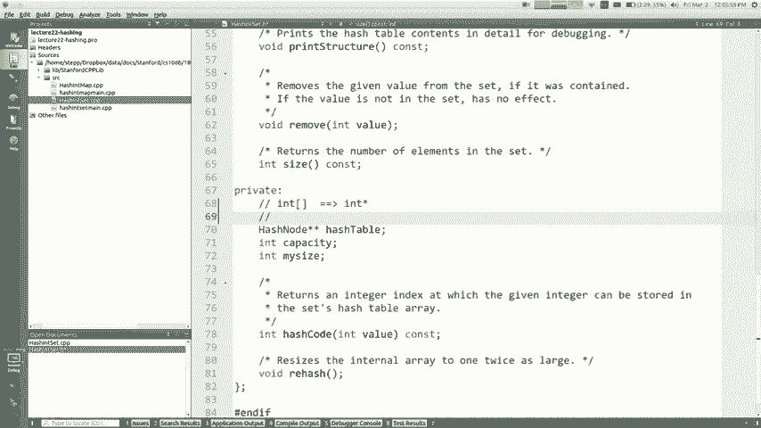

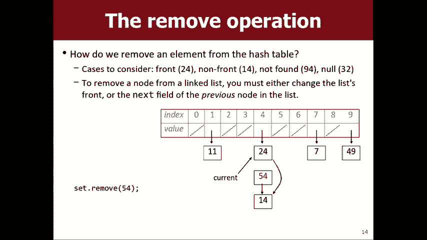

### 策略二：链地址法（单独链接）

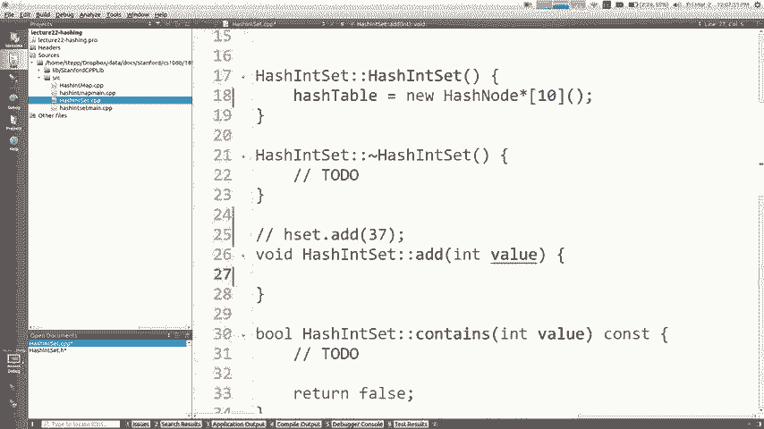

这是更常用且更好的方法。它不直接在数组的每个槽位存储单个值，而是存储一个**链表**。
哈希表变成了一个“链表数组”。
*   **工作原理**：所有哈希到同一索引的元素都被放入该索引对应的链表中。
*   **操作**：
    *   **添加**：计算哈希值，找到对应链表，将新节点插入链表头部（O(1)）。
    *   **包含**：计算哈希值，遍历对应链表查找元素。
    *   **删除**：计算哈希值，在对应链表中找到并删除节点。
*   **优势**：即使发生冲突，也只需要在短链表中进行操作。只要链表足够短（后面会讨论如何保证），这些操作的平均时间复杂度仍然是 **O(1)**。

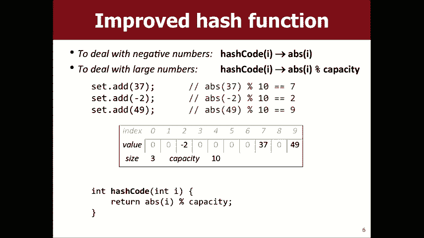

现在，我们来看看如何用代码实现一个基于链地址法的简单哈希集。

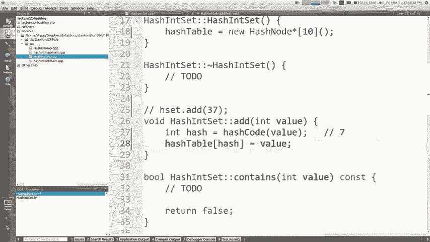


## 代码实现：整数哈希集

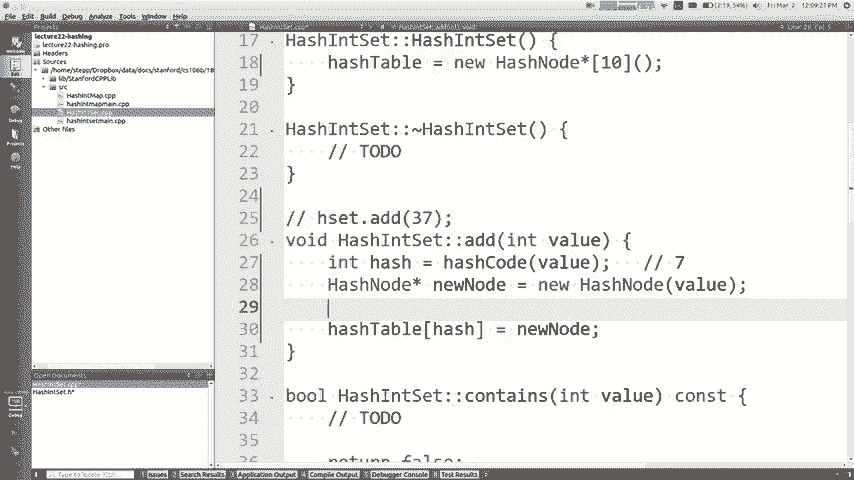

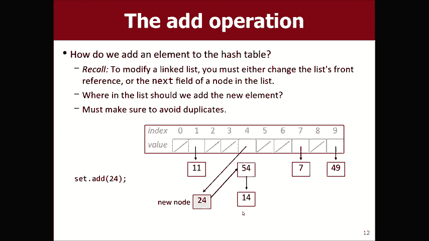

以下是一个简化版的整数哈希集（`HashIntSet`）核心实现框架，展示了添加和查找操作。

```cpp
class HashNode {
public:
    int data;
    HashNode* next;
    HashNode(int d, HashNode* n = nullptr) : data(d), next(n) {}
};

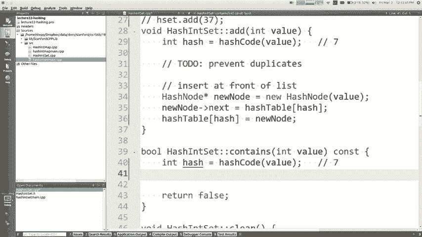

class HashIntSet {
private:
    HashNode** hashTable; // 指针数组，每个元素指向一个链表
    int capacity;         // 数组容量（桶的数量）
    int size;             // 集合中元素总数

    // 哈希函数
    int hashCode(int value) const {
        return abs(value) % capacity;
    }

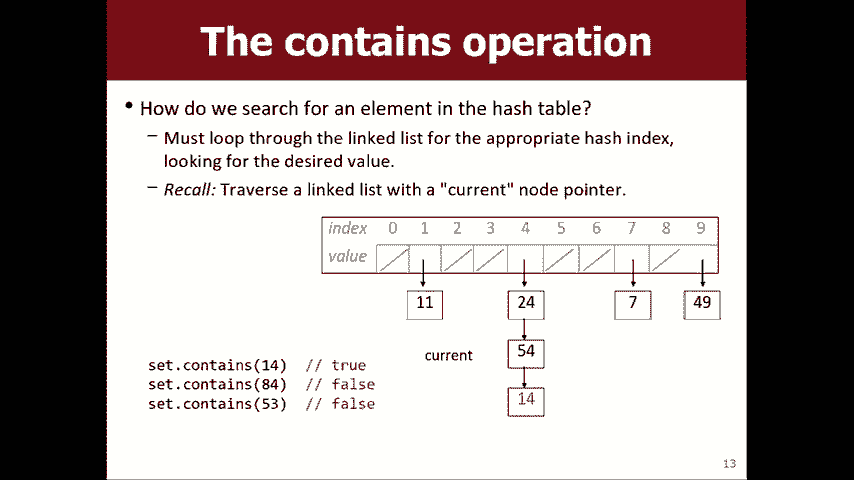

public:
    HashIntSet(int cap = 10) : capacity(cap), size(0) {
        hashTable = new HashNode*[capacity](); // 初始化数组指针为nullptr
    }

    ~HashIntSet() { /* 需要释放所有链表和数组内存 */ }

    // 添加元素
    void add(int value) {
        // 1. 检查是否已存在（避免重复）
        if (contains(value)) {
            return;
        }
        // 2. 计算哈希值
        int index = hashCode(value);
        // 3. 在链表头部插入新节点
        HashNode* newNode = new HashNode(value, hashTable[index]);
        hashTable[index] = newNode;
        size++;
    }

    // 检查元素是否存在
    bool contains(int value) const {
        int index = hashCode(value);
        HashNode* current = hashTable[index];
        // 遍历链表
        while (current != nullptr) {
            if (current->data == value) {
                return true;
            }
            current = current->next;
        }
        return false;
    }

    // 删除元素（略，需处理链表节点删除）
    void remove(int value) { /* ... */ }
};
```

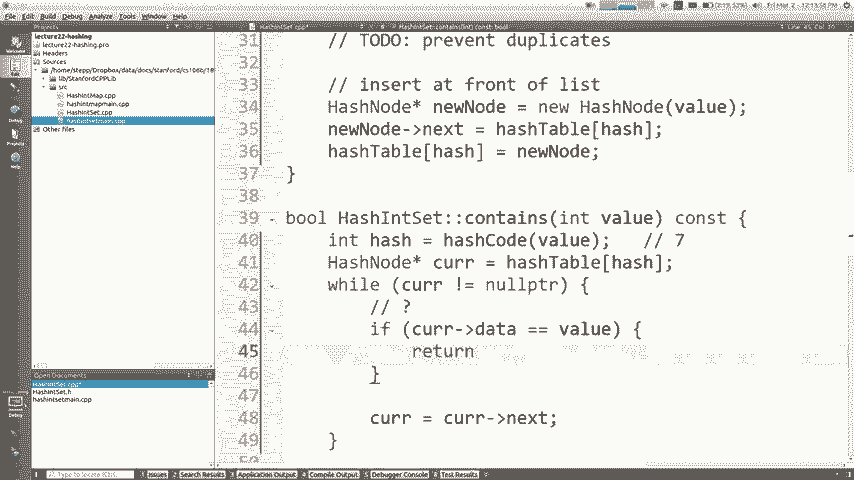

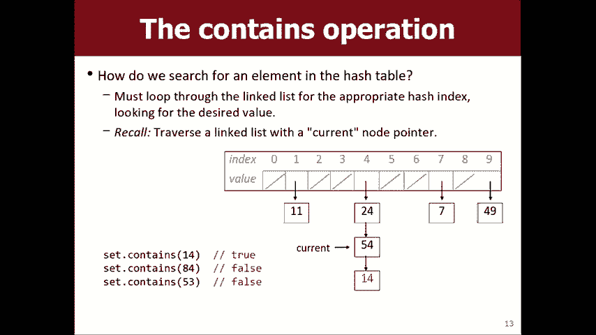

## 保证性能：负载因子与重哈希

链地址法在链表较短时能保证 O(1) 性能。但如果所有元素都哈希到同一个桶中，哈希表就退化成了一个链表，性能变为 O(n)。

如何避免这种情况？
1.  **良好的哈希函数**：目标是让元素均匀分布到各个桶中。对于整数，取模运算的除数（即数组容量）最好选择一个**质数**，这可以减少某些模式导致的聚集。
2.  **合适的桶数量（容量）**：如果元素数量（size）远大于桶数量（capacity），每个链表的平均长度就会变长。我们定义 **负载因子（Load Factor）** = size / capacity。
3.  **动态重哈希（Rehashing）**：当负载因子超过某个阈值（例如 0.75）时，我们需要扩大哈希表的容量（例如翻倍），并**重新计算**所有现有元素的哈希值（因为 `capacity` 变了），然后将它们插入到新的、更大的哈希表中。这个过程虽然耗时（O(n)），但能显著降低平均负载因子，保证后续操作的效率。

## 总结与扩展

本节课中我们一起学习了哈希表的核心原理。
*   我们从“直接地址表”的理想化 O(1) 操作出发。
*   识别了其存在的问题：负数、大数值、非整数类型。
*   引入了**哈希函数**的概念，将大范围数据映射到固定大小的表。
*   认识到**冲突**是不可避免的，并学习了两种解决策略，重点是**链地址法**。
*   通过代码实现了基于链地址法的哈希集，看到了 `add` 和 `contains` 操作如何工作。
*   最后，我们了解了维持哈希表高性能的关键：**良好的哈希函数**和**通过重哈希控制负载因子**。

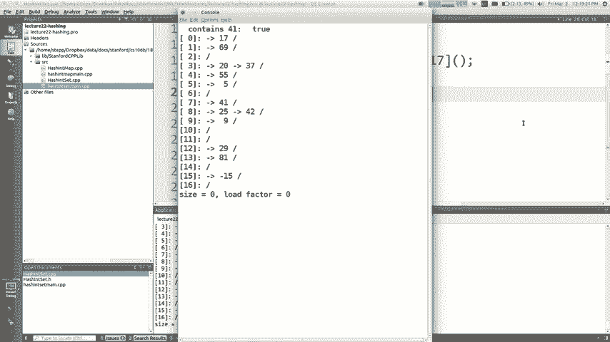

哈希表是计算机科学中极其重要和高效的数据结构，它是许多语言中 `HashSet`、`HashMap`、`dict` 等类型的基础。理解其原理，不仅能帮助你有效使用它们，也能在需要时构建自己的高效存储方案。

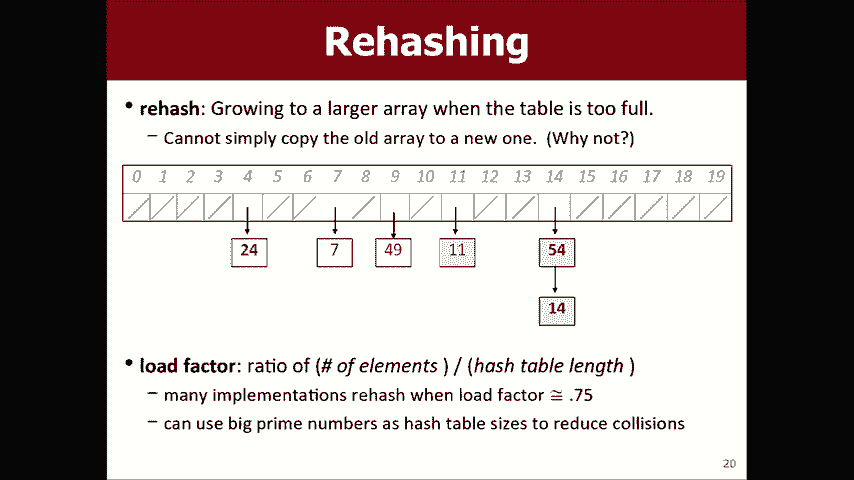

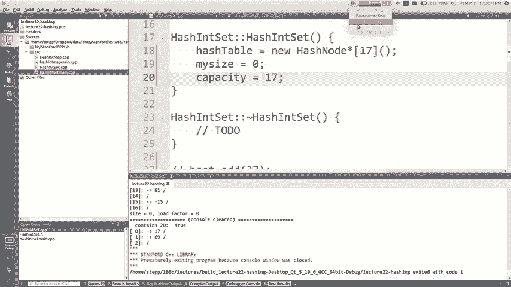

---
**附注**：
*   哈希表的迭代顺序是不可预测的，因为它取决于哈希函数和桶的遍历顺序。
*   作业7是一个关于图算法的作业，请及时开始。
*   哈希表的内容非常丰富，我们还有更多细节（如删除操作、重哈希的具体实现、字符串的哈希函数等）可以在后续深入学习。