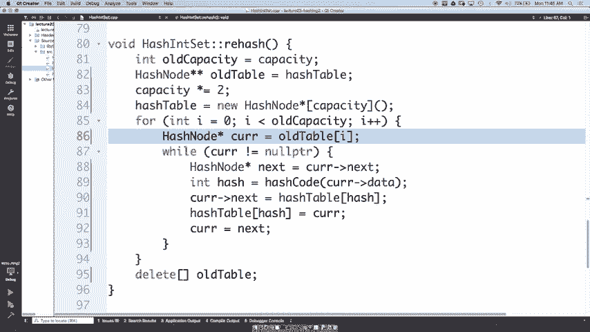
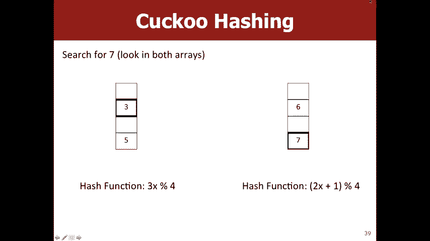
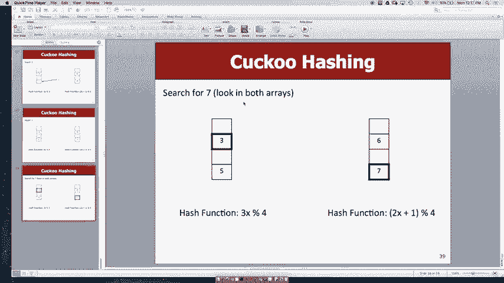

# 【斯坦福大学】CS106B C++中的抽象编程 · 2018年冬（完结·中英字幕·机翻） - P22：【Lecture 22】CS106B Programming Abstractions in C++ Win 2018 - 鬼谷良师 - BV1G7411k7jG

很酷，对不起视频中的人，但是基本上我们只是在聊，关于重新哈希，所以对我们为什么要重新哈希还是有任何疑问，某种算法可以做到这一点，或者您准备好开始编码了吗？ ，因此负载系数只是一个数字，代表平均长度。

哈希图中的链接列表，因此哈希表中的元素数，除以正确的铲斗数量，得出的是坚果平均数量，每个存储桶中的元素，我们希望该平均值较小，以便您，不必像一个很大的链表一样进行迭代，因为我们想要。

我们试图获得一个恒定的运行时，所以我们希望这些，希望这些链接列表平均很小，例如只有几个，元素是的，所以问题是元素总数或，每个索引中的元素通常我们使用元素总数是因为，因此，我们假设我们将稍作讨论。

但是我们认为，散列函数很好地将元素分布在所有，桶，所以我们假设我们的哈希，函数只会将所有内容放到存储桶0中，因此非常安全，假设您在所有存储桶中都拥有相同的数字， ，可能会有些问题。

而不会提出一些很好的问题。

好吧，让我们谈谈如何实现重新哈希，好吧，我包括了一些，刚刚遍历哈希的入门代码，一般而言，当我们想要增加数组或将其加倍时，可以正确映射，因为那是一个容易获得的数字，所以好节点等于哈希表，我们。

有点想复制所有这些东西，以便我们将来拥有它，因此，如果您有能力，那么我们想创建一个新的哈希表，那么该怎么做，我们这样做，是的，他们确实记得那种哈希表的样子，表类型是它是指向哈希节点的哈希指针的数组。

好吧，那我们就要投入产能，因为我们想要那么多的水桶和，你把括号括起来，所以一切最终都为空，好了，现在好了，在这里，所以在这里，好了，我们有当前元素要放入。

我们新的哈希表我们如何知道您应该将哪个存储桶放入，是的，所以我们喜欢我们必须获取哈希值，然后修改我们的，容量，所以我们可以调用哈希码，说得好，所以哈希等于，曲线数据还可以。

所以我们想把它放在哈希表的最前面，增加人们对星期五的记忆，只是更多的回头，星期二的哈希表示她的下一个等于完全哈希表的灰分， ，那么我们会说哈希表hash等于正确，因此将其插入到，我们的存储桶还可以。

所以现在我们要转到旧哈希表中的下一个元素，所以通常会喜欢她的等值曲线，但是接下来是什么，问题是这样做的，对不起，我没有，所以可能是因为没有，下一个，但是我们可以在这里赶上它，当前X的值是多少。

这是我们做的，是的，所以我们基本上像其他人一样迷路了，原始列表，因此我们必须确保将其保存下来，然后再向下保存，在这里，我们可以说咖喱等于下一件我们要做的事情，在这个功能，他们不是记忆。

还是我们正在做我们需要做的一切，记忆或我们所有的变量都正确，是的，基本上每次您都正确，打电话给新的你想有一个相应的删除确实说删除旧，很好，所以我们可以尝试运行此，好吧好吧。

所以我们可以添加添加仍在工作好吧，我们的负载系数越来越大，右上角有很长的链表，所以我们实际上不是，在您认为应该在任何地方调用rehash的地方，是的，是的，因此，您始终希望在添加方法的末尾进行检查。

以确保您，并不是说您不需要重新哈希，所以我们有一个有用的功能，负载系数，所以我们可以说如果这大于最大负载系数，那么我们，想重新整理好吧好吧，好吧，现在我们跳到两倍大小，我们有，将所有元素移到上方。

继续执行该操作，然后我们再次跳过，你有关于重新哈希的问题吗，是的，所以问题是为什么我们为什么要如此频繁地重新哈希，首先，我开始时只用了很少的水桶，所以这是一个，我这样做是有点卑鄙的。

只是为了让我们看到重新哈希发生了，多次，但是我想你的问题是为什么我们选择这样，元素数量少，那是因为您甚至想要知道，最大的存储桶中仍包含少量元素，因此您可以，想想如果只是为了不使用哈希函数而是随机分配。

像桶号这样的数字对您所有的元素，您都会有一些，桶会比其他桶更长，所以您甚至想要更长的桶，这种上限只有几个元素，所以这就是为什么，我们选择如此小的负载系数，另一个答案是，重要的是包含比添加的几率快的权利。

这仍然像是矢量，您将尺寸加倍，它不是那么昂贵，因为您没有这样做，经常有多种原因，是的，问题是当您寻找优先队列时，我们在数组上用方括号调用了delete，这很好，但是，当我们拥有链表优先级队列时。

您实际上删除了所有，希望这些节点对任何人都不会感到惊讶，然后为什么呢？ ，我们只是在这里删除数组，而不是像这样去，通过并删除所有链接节点，因此，如果您实际上正在尝试，删除整个结构，您将必须删除节点。

但是这些节点，仍然存在于我们的新哈希表中，因此我们不想删除节点，因为，我们仍然想要相同的元素，而我们的新元素在更大的哈希中，表，这就是为什么我们不这样做，更好的问题是为什么我们不这样做，在这里做这件事。

我认为这是因为Marty尚未做到这一点，星期五讲课的入门代码，我认为Marty只是想让他，请注意，您应该执行此操作，因此扩展该操作非常容易，并且，如果您在现实生活中实现这一点，绝对是一件好事，是的。

在后面的路上很棒，所以问题是为什么会有这个，哈希图中元素数量的区别，然后，哈希图中的存储桶数，因此您需要知道存储桶数，因为它在哈希码函数中使用，它会返回哈希，由存储桶的数量修改。

然后您需要知道元素的数量，如果您想进行尺寸调整或类似的操作，则需要，桶的数量告诉你真的很重要，因为它告诉你，在数组中查找的位置以及元素的数量更多是一个，该特定集合的属性确实有意义，是的，桶是完全是索引。

是的，是的，所以它也有点像，您对向量PQ或RAID PQ的大小和容量有多大的了解，或幻灯片还可以，这里，你懂，是的，所以您是对的，哈希表中的所有内容都是空指针，但是，从旧桌子上弯下来。

我们有点遍历旧桌子，桌子，所以旧桌子不应该把所有这些都关掉，所以，时间的利益，如果还有更多的问题，你为什么不出来聊天，给我下课后，但只是为了确保您了解所有材料，但。

这些真的是很好的问题，所以您可能想知道这是一个哈希集，我们如何处理哈希图，与BST讲座非常相似，我们讨论了如何使用BST ，首先在BST中为地图设置一个，这样您就可以知道自己想要一个，更改哈希节点。

使其必须具有键和值字段，而不是，就是那个数据字段，因为您需要存储两条信息，然后的想法是，一些函数名称有点，就像您必须实现一个contains函数一样，所以您，仍然有包含，但是现在包含了键，而不是添加您。

会把yep get返回值，所以你必须搜索，您的密钥的哈希映射，然后从该节点获取值，但通常，非常相似的最大区别之一是，当您放置，您必须检查其中是否有东西已经在您的哈希图中，并且。

不像之前或当我们在集合中添加一些东西时，我们只是知道，忽略了重复添加，如果需要，我们将不得不实际更改值，已经有那个钥匙，例如，如果我们要让您知道这一点，值并将其更改为清晰。

然后我们将在这里摆脱Marty ，像这样用克里斯代替他，是的，这个问题很好，所以这导致了一个明显的问题，这是要命名的ID表，例如超级有用，可能有用但，如果您想将名称命名为ID或类似名称，那我们该谈谈。

也许我们可以灰历史，所以用一个整数，这很容易，因为您可以做一些事情，例如，通过哈希表的长度来修改它的值，但要包含一个字符串，并没有像字符串和哈希那样的数字等效，确实需要这个数字，以便您知道要看哪个索引。

所以我，可能会说，如果我只是喜欢随意选择，是的，但是我怎么找到一个数字说他们都是42，所以让我们，谈论什么使一个好的哈希函数，然后我们可以尝试思考，字符串的一些很好的哈希函数，所以哈希的最重要属性。

代码必须保持一致，所以如果您有两件事是相同的，它们需要具有相同的哈希值，所以为什么呢？ ，是的，如果要散列，第一次添加元素并将其放入该索引时，然后当您稍后在哈希函数中进行搜索时，返回一个，不同的索引。

那么您将无法在哈希中找到您的元素，桌子，所以你只是会说它不在那儿，即使它是正确的，所以基本上，我们的哈希值在那时将是无用的，还可以警告，这是不一定需要与他们只需要完全相同的对象。

如果在某种平等权利的概念下它是平等的，那么这就是两个，不同的向量，但是到这三行代码的结尾，它们具有，相同的元素，即使有两个独立的向量，如果您将其称为V 1等于V 2则它们将被视为相等。

会返回true的哈希码必须与这些哈希码相同，出于同样的原因，我们想要在任何时候寻找带有，元素1和3可以指向相同的索引，所以为什么我们说一个等于B他们必须具有相同的，哈希码，但如果不等于B，为什么还可以。

相同的哈希码，是的，所以基本上你是正确的，所以基本上在那里，无限多的流对，它们只有40亿个整数，所以，您将必须拥有2个具有相同数字的字符串，因为您不能，就像将无数个字符串唯一地分配给40亿个数字一样。

 ，你就是这就是为什么我们之前有冲突，并且哈希函数还可以，发生碰撞，因为实际上这是不可避免的，所以我们，刚刚谈到了哈希码必须具有的内容，因为如果没有，这种一致性将无法正常工作，只是您的哈希将无法。

找到您想要的质量的元素，这不是严格的，这是必需的，因为期望的质量是哈希值分布合理，这样您就知道何时进行映射或何时提出哈希，尝试使用所有这40亿个字符串对所有字符串起作用，例如，数字不只是十个。

为什么我们要这个属性，为什么呢？ ，这很重要，是的，如果您有，更好的分布式哈希函数，您将在所有，因此，您的链表的实际长度将非常接近，负载因数，我们说我们的负载因数很小，所以可以算出来，很好。

但是如果您有一个分布不均的哈希函数，例如，你知道一个极端的例子，你可能最终会得到一个链表，像是一个包含所有元素的链表，因此大小无关紧要，您的阵列是，您仍然会将所有内容放在同一个存储桶中， 。

那不会是一个运行时的O的酷，所以请保持在，请注意，有效的哈希函数必须具有一致性和良好的哈希，功能必须分布合理且一致，因为，你不可能拥有一个好的但无效的哈希函数，对吧？ 。

所有人都认为这个哈希函数有多少人认为这是有效的，很多人认为这是无效的，多少人认为这是有效的，因为当您输入相同的字符串时，您将得到相同的数字，因为每个字符串都给您正确的数字42，所以它会有效。

在正确的存储桶中查找，但是这是一个很好的哈希函数吗？ ，人们认为是，多少人认为是，这将是链接列表，例如，这是实现链接列表的一种非常困难的方法，对，所以，这将是有效的，但不好，这是怎么回事，所以我们。

只是随机分配一个整数有多少人认为这是有效的，人们认为这是无效的，是的，所以这是无效的，因为您，会得到两个不同的随机整数，但是当您放入同一个，字符串好吧，我们将它放到内存中的那一个返回内存。

字符串的地址是正确的数字，所以有多少人认为，这是有效的有多少人认为这是无效的是的，这有点，更难，因为您可以在主函数中使用两个字符串，就像他们都是嗨家伙一样，但是有不同的记忆，地址，因为它们是不同的变量。

所以在这种情况下， ，会是无效的哈希函数，好吧，这个有多少人，认为这是一个有效的哈希函数，只是使用字符串的长度，是的，您说得对，因为如果您的字符串链接了，它不会改变。

你会得到同一个桶有多少人认为这是一个很好的哈希，函数是的，就像数学一样，总比总是返回要好， 42，但是如果您尝试对字典中的所有单词进行散列，则不会，字典中有很多不同长度的单词，即使我们。

拥有大小为100的数组，您不会真正知道其中的元素，第99个桶和第100个桶，因为英语没有，那个长度比42好得多，我会说仍然不是很大，那这个怎么样呢，让我们只返回第一个的值，我们字符串的字符。

那么多少人首先认为这是正确的，如果两个字符串相同，则它们必须具有相同的首字符，关于这一点，您认为这是一个很好的哈希函数吗，您认为这是，有多少人认为它比前一个更好，前一个有多少人认为这更糟。

这仍然有点疯狂，我们绝对可以做得更好，是的，很好的直觉，所以我想说的更好，只是因为你知道，您正在对字典中的所有单词进行哈希处理，从而为您提供26种选择，是的，没有很多以X开头的单词，但可能有。

以X开头的单词比长度为26的单词多，例如好吧，让我们尝试做得更好一点为什么我们不只是将所有，反击垫号中字符串中的单词或所有字符正确，这是最后两个的混合体，所以这个有效吗？ ，比上一个还好。

所以会发生什么事情，发生冲突，并且此哈希函数，是的，正是这样，它们作为字谜的单词最终将散列为相同的词，桶，所以可能仍然不是很大，肯定是前两个方面的改进，因为您获得的价值范围更广，而且您可能会获得。

更好的分配，所以这是克里斯·桃（Chris peach）做的另一场演讲，一个带有Wikipedia的大量文章标题的模拟，他将所有内容散列，他们使用我们刚刚看到的哈希函数，所以有点像我，可能有点令人困惑。

但从本质上讲红色意味着这些存储桶，真的很长，白色表示水桶是空的，我们代表，这是一个窗口而不是一行，因为有很多哈希桶，对50，000，所以基本上任何时候您看到白色时，它都是空的桶，您会看到红色。

这是一个非常满的水桶，所以这不是超级好，散布着很多白色，所以好吧，如果我们尝试解决该字谜问题并尝试获得，这样可以更好地分配一些白色，加权总和，这样的想法就可以了，让我们把弦的每个位置都放在蝙蝠上。

字符值乘以质数的幂只是为了得到，更好的分配方式是您知道第0个索引本身，然后第一个索引是字符乘以31，然后，第二个索引就像可怕的除以31的平方，以此类推，更好的分配确实可以使我们在这里做的事情有意义。

所以我们，也希望成为素数，只是在一般情况下，散列与素数更好，所以我以前只是这实际上是在Java中使用的是哈希，字符串的函数，所以它从这样的随机变量开始，数字也只是为了增加点差，所以并不能全部从0开始。

以及类似我们拥有的那种权力结构的回报，因此您仍然可以，碰到一些类似这两种碰撞的碰撞，但最好，比以前所有字谜相撞的地方是的，是的，问题是，好的，这个函数会返回一个很大的数字，所以那个身体要带去哪里，位置。

这基本上是考虑您希望他们使用的哈希函数的好方法，可在任意数量的存储桶上工作，因此哈希有趣，所以是一个很好的哈希函数，应该真正返回40亿整数的整个范围，然后由，该哈希函数的用户修改存储桶的数量。

因为如果我们，假设上限为17，例如当我们想要重新哈希时， 234我们将变得像我们将不会获得免费的好处，散列，所以是的，基本上是在您要输入的地方，在编写哈希函数时不使用哈希函数，很好的问题，是的。

这应该是一个否，因为好的，所以哈希，原来是5 3 8 1，然后31次5创造1加像是的，所以它不会，确实有一个班级相等，因为这里有一定的班级，但是不错，是的，这与滑雪如何像ascii重视这些角色有关。

基本上，f比e大1，而资本B与a相距30，所以它像，如果实际尝试将其解码为ASCII值，则最终结果，我不知道副词，但是像a是97 B是98以及大写字母，数字或其他不同的字母或大写字母，抱歉，如果您是。

实际解码它与这些字母的距离有多远有关，彼此很酷，您还有第二个问题吗？ ，所以这与我认为这些幻灯片类似，我认为这是，与此相反，但想法就像零字符，用哈希值乘以31的字符串长度乘以31的幂。

字符串的长度倍数的长度使您倍增，这就是，很多次，您最终将哈希乘以31，这样才是合理的，但是好吧，这是如何工作的超级细致的细节并不重要，就像您不会被要求开发一个非常好的直接哈希函数一样，也许在你的生活中。

这并不是我真正理解这一点的方式，我们只是，找到了很好的哈希函数，如果您愿意，我们会继续使用它们，真的很深入安全性或加密技术之类的事情，你会的，但是总的来说，计算机科学家不会开发新的哈希，功能。

重要的是要理解，例如为什么这个分布，这个值也不错，从技术上讲，它的长度是，像无符号整数一样，因为它永远不会为负，所以如果您比较，从int到unsigned int有时会像编译器警告一样，所以我认为。

这就是为什么，所以我认为从字面上看，这就像是从， Java源代码，因此他们不想在中的编译器警告， Java源代码，但不是，它就像一个特殊的unsigned int，所以，它不能有负值。

所以如果您将负数与某物进行比较，不能取负值，就像发生了一些奇怪的事情一样，凉，所以这是我们原来的，是新的哈希函数，就像蓝色是，真的很好，因为这是一到两个大小的水桶，所以你有一个很好的，摊开的白色少很多。

摊开的少很多，所以我们的平均水桶，大小要小得多，您对在哈希中识别有什么疑问，功能是好的还是有效的，是的，这是一个很好的问题，像您如何知道散列函数是否分布均匀，实际上，人们做的事情是。

他们知道他们只是蠕变，他们运行模拟来，看到您正在使用这种哈希函数的数据是，有一个很好的平衡权，所以Facebook使用的哈希函数，用名称或其他名称创建哈希映射，可能与。

可能会喜欢显示Wikipedia文章的哈希函数，因为那些，是两种不同的字符串，所以是的，有些猜测，涉及运行模拟，一般来说很难说这是，最佳的散列函数，但是您应该能够体会一下，比较这两个哈希函数。

其中一个会变得更好，分发一些大问题，所以这对您有帮助，因为我，已经告诉过您，您一生中可能永远不必编写自己的哈希，字符串函数是您将必须为以下对象编写哈希函数： ，您进行创建，因此。

如果您只是像点一样进行创建，那么您，尝试将您的观点放到哈希集中，以使哈希就像我不，知道如何散布你的观点，所以我放弃并扔给你，错误是因为没有点的哈希值，所以为了解决这个问题， 。

将不得不编写您自己的哈希码函数，并且等于运算符是，等于运算符，就算您喜欢这两个对象相等，在您眼中是该类的设计师，那么您将返回true，因此在此，假设两个点的x坐标匹配和， y坐标匹配。

但您可能认为可能存在不同的要求，然后您还可以查看哈希码，您必须考虑如何，我可以在课堂上真正结合这些部分吗，所以总体来说我们有很好的哈希，基本类型的函数，例如蚂蚁或流，因此您需要。

用某种方式喜欢那些东西或平衡那些被添加的那些部分，一起创建自己的哈希函数，这就是发生的事情，情况就像我们将两个不同的数字相乘以获得更好的传播，实际上有点类似于我们的字符串哈希函数的最终版本。

我们在那里等待所有这些字符的方式有所不同，因此总而言之， ，经历了一个集合的许多不同实现， ，发现一个跨越一个跨越的区域，我觉得这是一个非常真正的，计算机科学中很酷的部分，例如我们可以做到这一点。

这是惊人的， ，因此，您可以在计算机中完成其他非常酷的事情，如果您没有这些像我们一样的科学将无法做到，在这种数据结构上有固定的时间保证，是的，实际上有一个，开个玩笑。

如果您正在接受像软件工程面试这样的面试，有人问你，哦，如果你能解决这个问题，不知道只是一个哈希，你可能是对的，是的，因为这就像，就是这么好，计算机科学中的很多东西都归结为，突然之间，您的问题就这样。

更容易，您可以更快地完成，好吧，哈希在计算机科学中很重要，因为它对技术很有好处，访谈，这对散列集很有用，但对于，密码学和某种AI背后的想法，如果您想存储密码列表，可以像这样存储，是的，但随后有人看着你。

肩扛计算机将正确查看所有这些密码，因此，是的，这真的很糟糕，因为现在大家都知道我的密码并且可以登录，是我说的对，然后您重新分配了成绩或类似的成绩，成为一个好的系统。

所以一个主意是为什么我们不将其放入代码中，我们适合代码的一种方法是我们可以正确地对其进行哈希处理，因为哈希将，给我们这种随机的数字，实际上并没有很多，为什么这个数字来自密码一二三和它的直觉。

某人很难回去弄清楚那个数字原来是什么，有一些警告，这是您的哈希函数，这还不够，只是为了有效且分布合理，您通常也希望拥有，他们不仅使它达到40亿，而且使之成为一个庞大的数字，因为你真的想避免碰撞。

因为你可以像，夏娃很棒，并将一二三哈希值密码设置为哈希值相同，功能，那么您最终会像马蒂一样意外登录为，我说的对，所以您不希望其他人能够像猜测密码一样，然后随机进入您的帐户，因此我们真的希望尽可能接近。

尽可能减少冲突数量，以便这些哈希函数，否则这些哈希码对于密码来说确实是唯一的，其他棘手的部分，是我们希望这是所谓的单向哈希函数，意味着看这个数字并不容易，像原始值一样的值是多少。

所以我们的英寸哈希函数是，取数字，然后将其修改为10或对不起，这是绝对值，正确的数字，所以我可以像看哈希函数一样，这是我可以很容易弄清楚的数字的绝对值，您的密码里克是正确的，就像有两个选项一样： 。

负数对，所以我们要创建一个所谓的单向哈希，这里有一些sha-256的例子，通常会再次使用，可能不只是因为您正在做一些需要做的事情，人们只做sha-256的密码，他们没有编写自己的哈希函数。

您是否有关于密码学中如何使用哈希的问题，是的， ，问题是，如果您拍摄了256张图片，您找不到密码，那么，它们是您可能会攻击并尝试采取的几种不同方式，像尝试找出密码是什么，嗯，所以一个例子就像好吧。

我可以只看一个像我已经，输入您的用户名，然后我就从abcd开始，然后向下，问题是密码组合太多或太多，独特的密码，基本上可以永久使用，因此该怎么做，相反，像黑客通常所做的是，他们会像，密码的数量。

因此这些密码都被散列了，但是如果可以的话，就像您知道的那样，您可以尝试访问散列函数，就像，通过它输入单词密码，然后与多个不同的用户匹配，在该文件中，那么您就知道他们的密码必须是密码，依此类推。

因此我将其称为字典攻击， ，不能放屁的常见方法是随机给sha-256放东西，这是没有办法的，喜欢反向工程，除了原来的密码，尝试所有的一些组合很好的问题是的，问题是黑客很难访问像此文件这样的文件。

这并不难，就像不该发生的事，而是某事，确实发生了，所以我从来没有做过，所以我想我真的不能说有多难，是的，但这是发生的事情，每隔几个月，也可以防止类似我刚才所说的字典攻击，如果您基本上喜欢。

您可以通过它来给每个用户一个数字，根据他们要注册您网站的数量，然后，散列数字和密码的组合，这样您就不会，能够像密码一样尝试并获得大量的点击次数，像密码逗号一，密码逗号二，所以它仍然应该，永远是的。

所以就像Linkedin密码转储没有那样做，并且喜欢，这就是为什么如果您听说我的密码转储真的很糟糕，像2012年一样，我认为2011年臭名昭著总是让您的密码陷入困境，是的，这被称为是错误的，是的，我。

我也想剩下一点时间，所以我想谈一谈，设置哈希表的另一种方式是一个有趣的事实，您可以告诉所有，您的朋友喜欢您今天在CS 106牛肉中学到的东西，鸟叫杜鹃鸟，它们产卵，其他鸟筑巢，像原始的鸟儿一样被踢出去。

让这些新的父母，这些父母，这些鸟照顾他们的孩子，所以这很重要，因为，引导我们进入一种称为杜鹃哈希的事物，因此杜鹃背后的想法，哈希就是我们需要的包含真的非常快的东西，就像我们保证的那样。

我们只需要看两个地方就没有链接列表或类似的东西，我们只是要看两个最大值max，所以在，为了做到这一点，我们可以做的是可以有两个不同的数组，像两个不同的哈希表，并且每个哈希表都有不同的哈希，函数。

因此我们可以尝试将元素放入两个元素中，然后，我们只是选择一个空位，所以当您搜索时，包含以后，您只需要查看这两个点中的每个，这件事是广告变得有点困难，因为添加时，可能必须踢出一个已经存在的元素并将其移至。

其他哈希表，这就是为什么它被称为布谷鸟哈希，所以有点，例如，如果我们想以鸟类为例，那么重要的是，它们具有两个不同的哈希函数，因为如果它们相同，则像，发生冲突的事物将在两个哈希表中发生冲突。

而不仅仅是在一个哈希表中发生冲突，对，所以当我们插入三个散列函数时，它们就是两个，随机选择将其放在此数组中，这是九， mod 4是1，所以您放了6，所以是13 mod 4，也是1 OK 。

 5所以15 mod 4是3 10加1是11 mod 4是3我们插入7我们所以7所以我们插入7 ，你得到21 mod 4是1，我们放在这个位置，而15 mod 4会放在这个位置，正确。

所以我们的问题还可以，我们将不得不踢这两个之一，出来，所以它放了7，这是随机的，然后我们将5移到，到另一张桌子，然后将其放在该位置，所以我变得更长一点，因为你可以想象也许，这个地方已经有东西了。

然后您必须将其移回这个位置，桌子等等等等，但是真正酷的是当您搜索，包含您只需要看这两个点就不必看，这样包含的其他任何地方真的非常快，因为它只会最大化，看两个元素，是的，问题是，您是否可能会进入这个周期。

而您知道我们一样，在这里放五个，然后我们像棍子一样踢在这里，你知道吗，在这里四个，然后我们要在这里踢棍子，在这里三个，然后，然后是七个现在的七个，然后是五个，那你可以结束吗，在这个循环中，是的。

因此通过这一实现，更难，因为如果发生这种情况，您必须跟踪此类循环，基本上像您的两个表之一创建一个像新的哈希函数一样，那么你也可以非常小心地确保自己是，重新整理一个必要的项目。

因为您可以想象如果只剩下一个地点，您的桌子上您的广告时间会非常长，所以这个问题很好，关键是要告诉您有很多设置方法，哈希以使用哈希，因此在搜索解释时要好一些，它包含但在应用程序方面有点差，所以有。

您可以使用散列来进行我们刚刚给出的散列的许多不同方式，您一个我们刚刚告诉您一个非常普通的一个，现在布谷鸟哈希，关于对今天我们学到的东西进行哈希处理的最后一个问题，好吧，周一休息。

