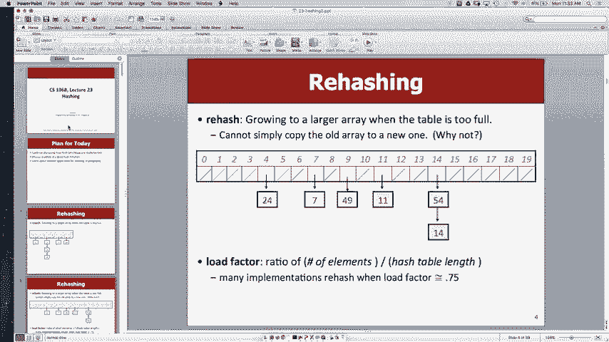
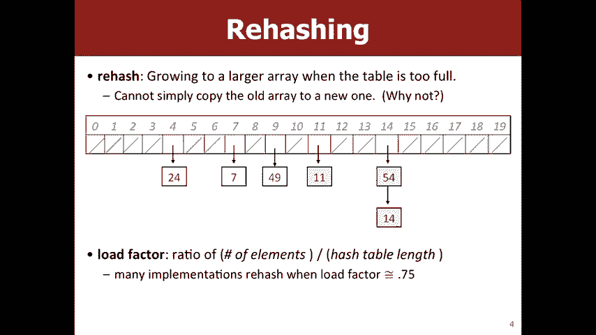
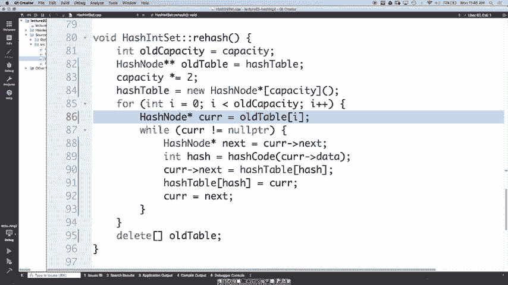
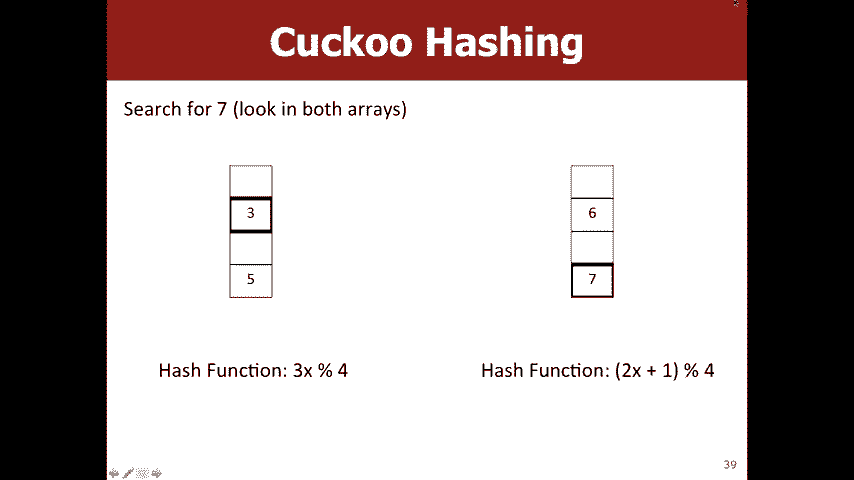
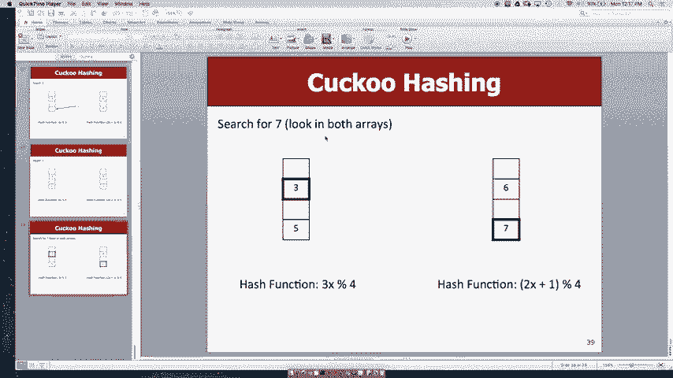

# 课程22：哈希表实现与哈希函数详解 🔍

在本节课中，我们将深入探讨哈希表的实现细节，特别是重新哈希（rehashing）的过程，以及如何设计一个良好的哈希函数。我们将从哈希表的基本概念出发，逐步讲解如何通过重新哈希来维持哈希表的性能，并讨论哈希函数的关键属性及其在实践中的应用。



---

## 哈希表与负载系数 📊

上一节我们介绍了哈希表的基本结构，本节中我们来看看如何通过负载系数来评估哈希表的性能。负载系数是一个数字，代表哈希表中链表的平均长度。具体来说，它是哈希表中元素的总数除以桶（bucket）的数量。公式如下：

**负载系数 = 元素总数 / 桶的数量**

我们希望负载系数保持较小，这样每个桶中的链表平均长度就很短。因为哈希表的目标是实现常数时间的查找和插入操作，如果链表过长，我们就需要遍历很长的链表，从而影响性能。

---

## 重新哈希的实现 🔄

当负载系数超过某个阈值时，我们需要执行重新哈希操作。重新哈希的目的是增加桶的数量，从而降低负载系数，保持哈希表的高效性。以下是重新哈希的基本步骤：



1. 创建一个新的哈希表，其桶的数量通常是原哈希表的两倍。
2. 遍历原哈希表中的所有元素，根据新的桶数量重新计算每个元素的哈希值。
3. 将元素插入到新哈希表的对应桶中。
4. 删除原哈希表，释放内存。

以下是重新哈希的伪代码示例：

```cpp
void rehash() {
    int newCapacity = capacity * 2;
    HashNode** newTable = new HashNode*[newCapacity];
    for (int i = 0; i < newCapacity; i++) {
        newTable[i] = nullptr;
    }
    for (int i = 0; i < capacity; i++) {
        HashNode* current = table[i];
        while (current != nullptr) {
            int newHash = hashCode(current->data) % newCapacity;
            HashNode* next = current->next;
            current->next = newTable[newHash];
            newTable[newHash] = current;
            current = next;
        }
    }
    delete[] table;
    table = newTable;
    capacity = newCapacity;
}
```

在重新哈希过程中，我们需要注意内存管理。每次创建新的哈希表时，都需要确保在适当的时候释放旧哈希表的内存，以避免内存泄漏。

---

## 哈希函数的设计原则 🛠️

哈希函数是哈希表的核心组成部分。一个好的哈希函数需要满足以下两个关键属性：

1. **一致性**：如果两个对象相等，那么它们的哈希值必须相同。这是因为在查找元素时，我们需要根据哈希值定位到正确的桶。
2. **均匀分布**：哈希函数应该将元素均匀地分布到所有桶中，以避免某些桶过长，从而影响性能。

以下是一些哈希函数的示例及其评价：

- **返回常数（如42）**：虽然有效（一致性满足），但分布极差，所有元素都会进入同一个桶。
- **使用字符串长度**：分布较差，因为不同长度的字符串数量有限。
- **使用字符串的第一个字符**：分布仍然不理想，因为只有26种可能（假设为小写字母）。
- **加权求和**：将字符串中每个字符的值乘以一个质数的幂，然后求和。这种方法通常能提供较好的分布。

以下是加权求和哈希函数的示例：

```cpp
int hashCode(const string& str) {
    int hash = 0;
    for (char c : str) {
        hash = hash * 31 + c;
    }
    return hash;
}
```

这种哈希函数在Java中被广泛使用，因为它能有效减少冲突，并提供较好的分布。

---

## 哈希表的扩展应用 🌐

哈希表不仅用于集合（HashSet），还可以用于映射（HashMap）。在HashMap中，每个节点需要存储键和值两个字段。以下是HashMap与HashSet的主要区别：

- **添加操作**：在HashMap中，添加操作需要检查键是否已存在。如果存在，则更新对应的值；如果不存在，则插入新的键值对。
- **查找操作**：在HashMap中，查找操作根据键返回对应的值。

以下是HashMap中查找操作的伪代码：

```cpp
Value get(Key key) {
    int hash = hashCode(key) % capacity;
    HashNode* current = table[hash];
    while (current != nullptr) {
        if (current->key == key) {
            return current->value;
        }
        current = current->next;
    }
    return nullptr; // 键不存在
}
```

---

## 布谷鸟哈希 🐦

布谷鸟哈希是哈希表的另一种实现方式，它通过使用两个不同的哈希函数和两个数组来避免链表的使用。在布谷鸟哈希中，每个元素可以放在两个可能的位置之一。查找操作只需要检查这两个位置，因此查找速度非常快。

然而，布谷鸟哈希的插入操作可能比较复杂，因为可能需要踢出已存在的元素并将其移到另一个位置。如果发生循环冲突，可能需要重新哈希或调整哈希函数。

---

## 哈希在密码学中的应用 🔐

哈希函数在密码学中也有重要应用。例如，密码通常以哈希值的形式存储，而不是明文。一个好的密码哈希函数需要满足以下要求：

1. **单向性**：从哈希值很难反推出原始密码。
2. **抗碰撞性**：很难找到两个不同的密码具有相同的哈希值。

常用的密码哈希函数包括SHA-256等。这些函数通过添加随机盐（salt）来进一步增加安全性，防止字典攻击。

---

## 总结 📝

本节课中我们一起学习了哈希表的实现细节，包括重新哈希的过程和哈希函数的设计原则。我们还探讨了哈希表在集合、映射以及密码学中的应用。哈希表是计算机科学中非常重要的数据结构，掌握其原理和实现方式对于编写高效的程序至关重要。





通过本节课的学习，你应该能够理解如何通过重新哈希来维持哈希表的性能，以及如何设计一个良好的哈希函数。同时，你也了解了哈希表在不同场景下的应用，为后续的学习和实践打下了坚实的基础。