# 【斯坦福大学】CS106B C++中的抽象编程 · 2018年冬（完结·中英字幕·机翻） - P23：【Lecture 23】CS106B, Programming Abstractions in C++, Win 2018 - 鬼谷良师 - BV1G7411k7jG

没关系，所以这是第九周哇，我猜这几周都在赛车，我的宝宝的第三周是她生命的第三周，所以我们，我想现在有两个不同的星期计数器同时在同时运行，如果您好奇爸爸的情况如何，那很好，这很有趣，我会说。

每个星期都比上一个星期好玩，因为就像他们一开始一样，只是坐在那里，他们什么也没做，所以这是一个非常可爱的马铃薯，你知道，每两个小时就可以了，我可以更换Boop ，对您而言，但年龄越大。

他们越能开始做您的事情，知道他们开始看着你，他们抓住你的小指，我，不知道这就像您开始欣赏这些小小的小东西一样，手势，您正在寻找，您知道自己假设他们还有更多的选择。

比他们真正拥有的代理更喜欢他们会看着你微笑，你会走的哦她对我微笑她对我微笑好像没有她的脸，肌肉只是随机碰巧在那一刻对齐，看起来像，微笑，你知道，但你认为她曾经对我微笑，你知道我会说你。

知道这真的给了我关于工作的新视角，整天应对她的大惊小怪，po嘴和哭泣是一种很好的做法，学生对期中成绩和这类事情的抱怨，真的有很多相似之处哦，不，我只是在开玩笑，但无论如何， ，玩得很开心。

你知道我继续非常感谢所有， Namie和部门领导实际上所做的所有工作，在剩下的大部分时间里，我大部分时间都缺席，我希望这里的季度也很好，嗯，所以今天，我们要做什么我们一直在谈论散列。

没有关于兑现您上一次作业的作业，现在分配任务是关于图形的Trailblazer程序，原定于星期一开始一周，但由于我们爱你们，我们决定延长，定于下周三欢迎[鼓掌] ，是的，请注意。

作业7的延迟时间仍然没有用，所以您已经，必须在那个日期之前把它交出来，如果你不把他们交出来的话，就可以了，到那时我们将不能接受任何积分，因此请注意，截止日期还是可以的，但是会给您几天的时间。

正如我在此之前所说的，今天定于14日在这里，我们正在研究的这些主题都可能在最后阶段，因此我们了解到，在我要教的决赛中可能会出现哈希问题，您今天进行排序时，我们可能会在决赛中出现排序问题。

在这之后可能要花几节关于继承的讲座，在决赛中成为一个继承问题，这就是为什么你关心这就是为什么你，应该以四倍的速度收听或观看此视频的其余部分。

你现在正在看，好吧，让我今天去看幻灯片，让我们，说说排序，我想你知道当你把东西放进去时，排序是什么，订单有不同的顺序，您可以将其整理成我的意思，我认为，数据类型具有所谓的自然顺序，例如，如果有矢量。

任意一种intz，那么您通常会说哦，我把这些小数值，在数组的早期或较大的值在数组的后面，因此您可以想象，许多不同数据类型的自然排序，例如如果我有一个向量，奇怪的是我如何对它们进行很好的排序。

这可能像字母顺序或，就像您知道的东西，但是它不敏感，您是否总是想按字母顺序排序？ ，按长度排序或按其他度量排序，所以我的意思是排序的想法，只是意味着想出一些您想要的订单，然后安排您的。

数据按顺序排列好吧，现在有趣的事情之一，关于排序的原因我们想教您有关排序的原因之一就是，一个经典的计算机科学问题，它具有很好的特性， ，一大堆你可以做到的方式，排序算法，它们以自己的方式都很有趣。

有趣的运行时和内存使用要求给他们，他们在那里，谈论大O谈论递归和，其他主题，实际上其中一些算法非常聪明，它是，非常有趣，所以今天我将快速向您展示两个或三个，排序算法，您知道我想要的目标是。

了解它们是如何工作的，我不会要求您从头开始编写任何代码，测试，但我可能会问你，如果我运行的话，这是一些数据吗？ ，算法对这些数据的排序会发生什么，使我画出一张图片，一些在测试中会发生的事情。

所以这里的列表有一个，一堆不同的排序算法，我将重点介绍其中的几种，现在转发，这可能是我最喜欢的愚蠢排序算法， Boco对名称进行了排序，因为它不是真正的算法， ， bogo sort的想法是。

您将数据混洗，然后检查是否发生了，已经按照排序将自己洗牌了，如果有，您停止了，如果没有，你重复一遍，所以我打个比方，我总是用50来接你，一副纸牌，然后去捡起正确的52张纸牌，这就像概率。

你五十岁就可以拿起纸牌，完美排序的王牌王后签入您知道所有方式的排序顺序，当然这是不太可能发生的，但是如果您持续进行足够的时间，也许你会碰巧得到排序的输出，所以这是一个愚蠢的算法，当然。

您永远都不会真的想要这样做，这是我要交谈的唯一原因，关于它，我认为这是一个有趣的问题，当然，现在最坏的情况是大O很明显，最坏的情况是什么，这个平均数，您说的是阶乘，可能更多。

预期的情况可能发生的最糟糕的事情是什么，如果我做这个无限，就永远不会，只是碰巧永远不会将它拖入，当然，正确的顺序可能在弹道上是不可能的，如果永远坚持下去，它将永远不会变得更多。

更有可能最终得到正确的答案，但有可能，你不会，但是无论如何，这有点含糊，如果你，其实涂了这个，我不是真的，徽标开始说，虽然现在没有排序，但它具有我们的两个功能，将不得不写。

所以排序意味着从头到尾循环并检查，如果邻居不正常，那么这一次要花多长时间，功能需要M的o我有几个人说是的，因为我，必须遍历整个数组，我正在寻找邻居，邻居混乱，没有排序，所以一旦大声就打电话，事件。

还有一段时间没有进行随机排序，所以我认为最好的情况是，该算法的最佳解决方案是什么，因为我愿意，考虑任何排序算法，考虑最佳情况是很有趣的，可能的情况或平均情况，最坏的情况最坏的情况永远存在。

无限可能已经发生的最好的事情是什么，对，这是一种有趣的怪异情况，如果您通过，已经排序的数组需要花费多长时间调用它，一旦说是，就对它进行排序，因此while循环不会，输入，所以它就停止了。

所以实际上需要n个最佳情况下的o ，最坏的情况是我听到有人说的平均水平，我认为这是一个很好的直觉，就像您知道的一样，如果您参加我们的三门课，例如103 109，您会更多地谈论，可能性。

所以我的意思是您可能会改组为正确的可能性，我想起一副纸牌，例如52张纸牌中应该有一张，首先，所以52张卡中的一张首先着陆，然后给出，首先降落的概率是下一张卡片的概率为51 ，正确的卡片落在第二位。

所以您有点像52张一张51张一张，从50到49中的一个一直下降，所以这是所有产品的总和，最终成为因数超过N的阶乘可能性，就在给定的随机播放上，所以我的意思是有时候您将必须执行此操作哦，这是，可怕的是。

您知道n阶乘运行时确实很糟糕，所以我不是，如果您确实希望看到它运行，则将其作为一种严肃的算法进行讨论。

我实际上有一个可爱的创作者项目中的代码，而我要编写的代码，为每个排序算法再次运行，在此我设置了数组的初始大小，和最大尺寸，也许我会将初始尺寸设置为5，在这里我只是为了，两端各有一个随机数向量。

然后进行排序，算法，我会花多长时间，然后打印多长时间，如果，我打电话给我我下面有虚假的函数或我有，选择我今天将教您这些不同的种类，因此，如果您将其用于BOGO排序，则需要花费半秒钟的时间。

甚至排序10个元素，等等，让我在这里做一些事情，而不是n次2 ，我不加，我认为看到运行时间为此增长真的很有趣，所以有点非线性，但是我喜欢它，就像，再增加一个，大约是以前数量的10倍，元素因为它就像阶乘。

所以第11个元素需要11倍，只要第12个元素花费的时间是该元素的12倍，那么这可能会花费，大概4或5秒，我会猜测11个元素中有4个，尽管这是一个平均值，如果它可能卡住了，我不知道我们会回来，我会离开。

在运行的同时我们不希望演讲被n的大O阻塞。

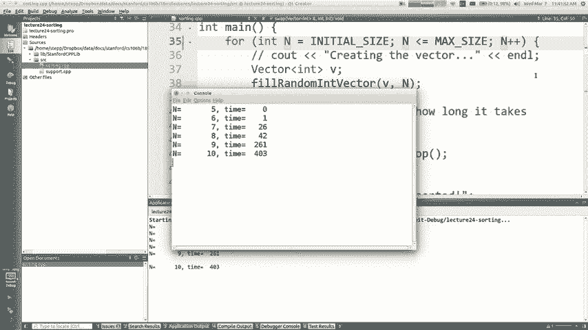

这里的阶乘代码，但是无论如何节奏都是愚蠢的，所以让我们继续，在一个真正的排序算法上，我认为谈论um很好笑，选择排序是我们想要的第一个类似实际合法的真实排序算法，与您讨论节排序是在数组中扫一扫的内容。

或者，向量，找到最小的元素，然后移动它，将其交换到最前面，所以就像在此数据中，我认为最小值为负4 ，我想我扫了一下，找到了，然后将其交换到，数组好了，现在非常重要，我想确保您了解这是，不像一个向量。

你说删除，每个人都移过来塞，就像我交换了2个元素的值，那真的很重要，我这样做的原因是，如果我删除并添加每个人的，变速变速真的很慢，我不想做，好的，所以我基本上将前索引与最小索引交换，所以现在。

第一次扫描第一个索引现在就在其中存储了正确的第一个值，您进行另一次扫描，但从第二个索引索引开始，寻找最小的剩余元素，然后移动，索引一，所以现在哦，第二个下降了，那里被交换了。

第二个索引现在从第二个索引第三个开始再次扫描，索引，您能否找到我认为是七个的剩余最小元素，然后交换为索引三，您需要进行多少次扫描，哦，所以我的意思是我不是说整个算法的大O 。

有多少次了解想弄清楚谁要搬到最前面，让他们遍历数组并查看所有值，看看我是否该，是最小的一项，我必须要做多少次，不要减去其中之一，是的，因为非常非常，最后一个，没有人愿意和别人一起散步。

所以我们就是不这样做，所以基本上n对n减去一个扫频运行一次扫频需要多长时间，单次扫描，这取决于对，第一次扫描总共需要n次。

这种算法的运行时间就像您知道n加n减1加n 。

减2加对，一直到3加2加1 ，是自然界的东西，是的，所以，如果您知道一些数学，你知道那里的那个系列的总和有一个简化，等于n乘以n加2的1，基本上等于1/2，如果，没有很好的本能。

为什么我听到了一个很好的描述，那如果你把它放在这里，然后把它和这个配对，这使得n加1正确，那么如果您采用n加1或n ，负1对不起，您将其与这两个配对，使n加1 ，正确，如果您将它们加在一起，您有多少对。

您就有1/2 ，这些对中的n对，您有2倍以上的n n加1 ，好，所以等于您知道N平方大致等于N平方，两个大约N的平方加1/2 n的那个家伙，所以，选择排序是n平方，这就是我的意思。

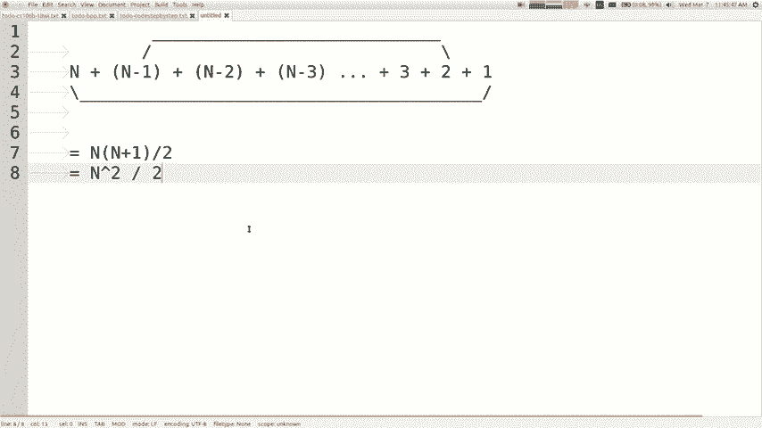

那就是这个算法的运行时间是多长时间，看看你是否不相信，我和我的怪异数学和东西，您只需运行代码即可进行衡量，您可以测试并查看正确的内容，可以凭经验进行验证哦，我喜欢这个11 。

元素花费了45秒12个元素的速度更快，因为您知道随机万岁。

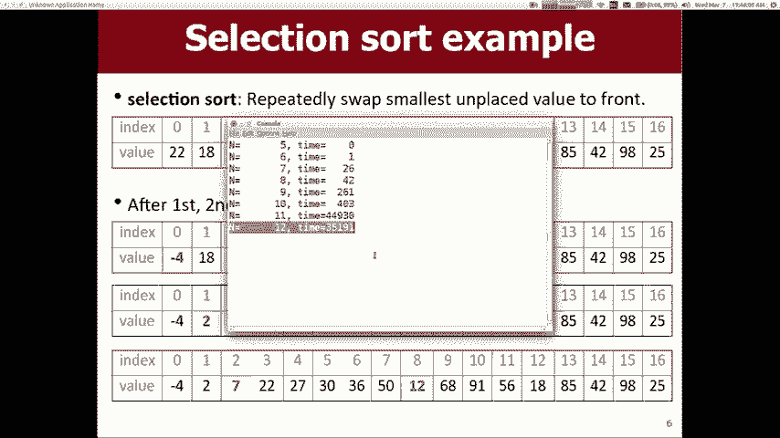

谁知道会发生什么，好吧，我现在要停止该程序，让我们开始吧，回到同一程序，我在这里有选择排序，在这个文件中的实现，如果我跳到那里，你实际上可以，没有显示代码，因为我只想就，概念。

但是代码基本上就是从索引开始的样子，我和你从我加1走过，叹了口气看是否还有，小于我的东西，如果发现较小的东西，则将它们交换，只需获取每个索引并将其他值放入其中就可以了，所以如果您有的话。

知道Big O的本能，你可能会说哦，我有两个for循环，直到向量的大小为n，因此通常当您有两个，嵌套循环达到集合的大小，通常意味着，循环代码为N平方N右的大O ，所以你现在去那里。

只是为了验证它是N的大O平方，让我们，实际运行它，我想在这里做的是我认为最好的方法，说明Big O将以不同大小运行，每个大小都是其两倍，每次其他尺寸加倍，我们就开始，大小为10。

我们将上升到大约100k，然后看代码多长时间，拿达雷尔，所以我认为，如果您忽略了低数字，那么较小的数字会更大，主观上更多的波动，当您使n变大时，您会看到大约四倍，两倍于您使运行时增大了四倍，因此。

运行时间是输入大小之差的平方（如果我是，将运行时间增加三倍，每次运行时间将增加九倍，每次运行时间增加100倍时，输入值增加10倍，因此更改，运行时间的平方是输入大小变化的平方，所以这是N 。

平方算法几乎恰好是您乘大算法的四倍，这里的数字好吧，选择的东西排序。

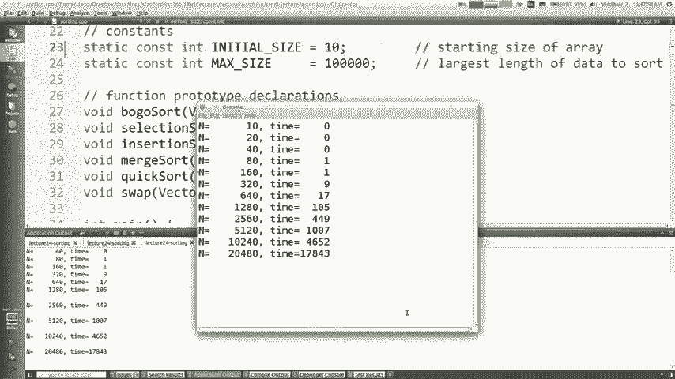

我可能会要求您进行测试，如果您正在运行，这就像一个数组，选择排序向我展示前几幅，因此选择开始就可以了，您只需向我展示哪些元素可以，交换或类似的东西，我认为您可以处理那些不是。

通常在考试中遇到最困难的问题，所以如果您提出问题，您可能会没事的，关于选择排序或它如何工作，是的，如果您是，试图挑选谁进入索引四，然后你走过去，这是什么，已经有最小值了，是的，我是说我认为这段代码。

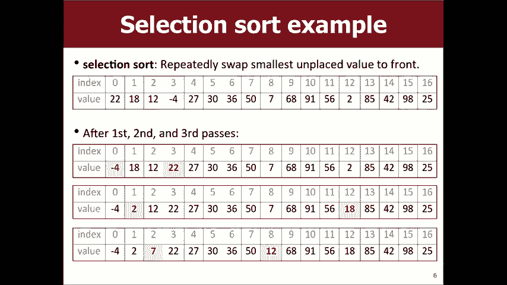

在这里，我们可以选择排序它说交换，我认为代码，交换说，哦，不，但是我认为您可以做的基本上可以，只是说，如果我不是J，那么交换那三个可能会给你一个，较小的运行时间提升，但其他所有大O仍将是N平方的。

像这样，好吧，这是选择排序。

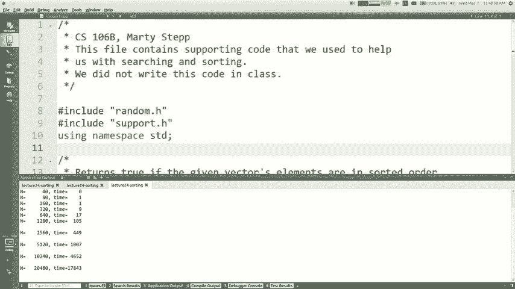

记得我们刚才讲过的最坏情况平均情况，关于大平均值的平方，我想我们只是在谈论，通常，平均值通常约为N平方，最好的情况下最坏的情况是什么时候会花更少的时间，比起N平方，你知道BOGO排序是最好的情况。

的n个记住这一点，那就是如果您将其输入，则输入一个已排序的输入，像您只是在询问某些值是否是。

已经在正确的排序索引中，如果我将排序后的输入输入到选择排序中，它的运行速度将比，并发誓您认为还是会发生什么？ ，是的，是一样的，因为它确实不会更快，仍然需要扫一扫以验证它是否不知道该数组已排序，直到。

它基本上完成了所有这些扫描，我想您可以想象一个优化，如果您扫过哪里，并以某种方式检查它是否按照您的排序，扫过你可能会停下来，如果它没有被分类的话，最优化，因此编写的代码基本上是N平方的O ，时间。

输入是否已经排序或大部分都不重要。

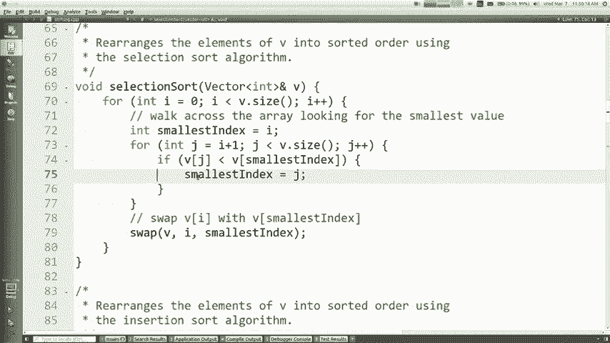

排序或类似的内容，只是让您知道，最好的情况下最坏的情况在这里都是一样的，好吧，让我们看看，如果您不介意，在另一轮运行中，哦，那只是一些运行时图，已经谈论过运行时间了，它说让我们谈论其他的。

断言排序通常称为插入排序，比选择排序稍好一点，插入排序的作用是他认为数组具有两个分量a ，前部分已经排序，数组的后半部分没有排序，在某种意义上已经排序的选择排序也具有该属性，就像您的索引一样。

我正在将左侧所有元素都放在，正确的地方，但我想这有点不同，因为，插入排序左侧的部分相对排序，但可能不是，最小的东西，所以这就是你要做的就是开始成长，通过在每次添加元素时向其左侧对区域进行排序。

您将其移至已排序元素的适当位置，区域，如果您继续这样做，则随着区域的最终增长，消耗整个数组整个数组将被排序我想说插入，排序最类似于许多人对事物进行排序时，您正在拿起手牌或作为老师我一直在想的例子。

您是否进行了一系列测试，并且您基本上知道我的姓氏，您要做的是手中握有一堆，未分类的堆在，你在桌子上拿了一张新桌子，你就好了，我手里拿着三个，最后一件事是a和B和Y，这就是你知道的L所以，在成为你之后。

但在电线之前，所以你需要一个新的，它以一堆中的排序顺序换了一个新的，你知道我的意思是就像你已经，一堆正在生长的小堆，您在堆放东西时就添加一些东西，接下来，我将为您展示图片和示例以及代码。

但是它的运行时间也是n平方N平方的大O ，就像您可能称之为复杂性类之类的东西，而不是选择排序，但是您知道我们谈到了这些常量如何，在大O中非常重要，但这是一个N平方，碰巧通常有一个，较低的常量。

然后进行选择排序，因此在N平方的类内，您可以，仍然有比其他东西更快的东西，所以这被认为，比选择排序好一点，这是一张图片，所以您要做的是将一个元素堆按以下顺序排序，定义。

因为一个元素不会因第一号手机而混乱，第二个要素，你说还可以，订购我的那堆，所以我将其交换，以便现在我有了一堆，现在两个，你有十五个，排序器，所以现在您看第三个索引的日期是两个，并且您说我。

要把他包括进我分类好的堆里，因为他出了问题，所以我会换掉他，直到他按你的顺序排列，如此有趣，也许这个家伙是对的，在这里，如果所有其他这些都已排序， ，那么你想包括这个家伙，然后把他带到正确的地方。

你是交换掉掉交换掉还是交换掉掉交换，直到他处于正确的位置选择排序，看起来很遥远，想出了很多办法来做这种算法，邻居交换一次将您移回一个索引，直到您到达，正确的地方，交换工作较少，如果，它已经被排序是真的。

但是如果它几乎已经被排序了，如果不是很糟糕，则排序该算法将运行，速度更快，因此，如果您基本上想查看此代码，则算法为，像您有一个整数，就像您对自己的大小的限制，排序的桩是，然后有一个int J。

您要向后走直到它到达。

归零或直到您处于排序顺序，所以看起来像这样，你有一个完整的，这基本上是排序堆的终点，现在，您从J开始，我是I，然后交换回来，J是新元素，只要您大于，您要插入的元素，因此有两个循环。

堆的增长和while循环可以交换回来，直到每个新元素，在循环的正确位置，而循环又嵌套，它们看起来都一样，与数组的大小有关，外循环很明显，与内部while循环中数组的大小有关，还不清楚。

内部while循环的边界是，但是我想，它是从我开始的，它在某种程度上与大小有关，所以在最坏的情况下，如果要查看，可以一直返回数组的开头，这个东西在起作用，这里是插入排序哦，你知道我在做什么。

运行该命令时应该已经完成​​，您会得到输出，如此了解，就像这里的选择排序输出一样，让我保留一些内容，运行时数据在这里，这是选择所花的时间，我不知道为什么，有一个换行符。

但是无论现在有什么让我们进行插入排序，我都会，只需将其更改为此处以说插入排序即可编译并运行，然后我们开始，所以我的意思是比较有点困难，因为字体不是，我猜是一样的大小，但我认为我们看到的是它快一点，抱歉。

我不能完全将这些排列完整，但是您知道如果您查看25 ， 60次选举需要400毫秒，而插入则需要280次，而您，知道10到40的大小需要四点六而三点六是，只是随机一点就好一点点快一点，整理了数据。

但仍然有大约运行时间的时间，对，如果您要为越来越大的输入数据继续绘制图形，我，认为您会看到这种趋势继续下去，所以我们仍然在谈论N平方，在这里，我认为我们提到的最好的情况是排序的时间或大部分时间，排序后。

如果它已经完全排序，则整个函数为， N的大O值真的很酷，所以这是插入的不错的属性，如果在最坏的情况下，它仍然具有N平方，但在最好的情况下仍具有，它进行了很多交换，所以我认为在最坏的情况下插入。

排序实际上比选择排序慢一点，因为它是如此之多，交换，但是无论如何，您对插入有任何疑问吗，分类，我认为如果必须编写代码，选择排序更容易正确实现，你知道他们给了你一块空白的画布吗？ 。

排序更像是人类实际对物理进行排序时的行为，对象，好吧，让我忘记之前我要复制并粘贴运行，插入源的时间，所以我们可以比较所有这些不同的源，好吧，现在我想开始教你一些很酷的奇特风格，您已经准备好了。

让我们谈谈合并排序，这可能是最后一个。

我到今天为止，我们将看到合并排序是非常有趣的算法，您要做的就是将数据分割为分而治之的算法，一半，您将两个半部分排序，然后将两个半部分合并回去，组合成一个分类的拉动，因此它的过程比它更详细。

但这是一个基本的想法，嘿嘿，一堆堆的东西移动了，而你却一起出现了，归纳为一种算法，可以想象这两堆测试和测试，在他们身上有一个人的名字基本上，你要做的就是看两堆，无论是哪个字母先出现，您都要抓住那个。

然后您，只是重复一遍，您知道我们现在抓到的第二个决赛，最重要的是有一张新纸，因为它在那里抓了一张，所以现在你，再次比较第一轮的增长重要性，而不是抓住其中的一个，一个反复出现，您只需继续这样做。

直到书籍文件，精疲力尽，您现在已经内置了一个文件，这就是合并排序的作用，将一半分成两半，然后将它们合并在一起通常实现，在草书李中，我们将在稍后讨论为什么，它的运行时间是n log N的Big O。

我想让您记住当您，将N的大O平方与n log n的大O进行比较，之所以不同，是因为就像大O的排序规模一样，彼此相邻，但我希望您了解那样，更好的n log n比N更好，平方，我们将在一分钟内看到，好吧。

让我们尝试了解一下，算法工作更多一点，这是一个数组，我想使用，合并排序算法，所以我该怎么做将其分成两半，现在我对，一半如何将一半好好排序，就可以对它们进行插入排序或，正确的方法，但是嗯。

只要我有一个比那个更快的排序算法，如果合并，我可以用什么排序房子，如果我在房子上递归调用自己的函数，听起来像种，一个疯狂的主意，但你们已经做了太多的递归，以至于你，也许现在对这个疯狂的想法感到满意。

所以如果我们合并排序，左半部分将再次重复整个循环，我们将分割右半部分，然后我们将分类一半，如何对合并的部分进行分类，再次对其进行排序，因此我们将其再次拆分为小小的单个元素，现在我们已经将那些拆分了。

我们必须对它们进行排序，排序22您如何排序18如果只有一个，则无事可做，元素hmm似乎是一个非常基本的情况，您可能会说这种算法hmm ，有趣，所以也许我们不需要做任何事情，因为您现在已经微不足道了。

什么也不做，并排序这两个一个元素数组，我们现在需要合并它们，变成一个，那么我们如何将它们视为一堆，而您只是抓住了一个，每堆较小的一个，直到你把18个较小的做好为止，所以我来抓，他们和22岁。

所以我会抓住他们，所以我现在就知道，我必须做同样的事情，那里的东西12和负4分裂他们排序他们没有，要合并它们，负数4首先出现，所以毕竟现在是这样，我已经尝试完成，可以将可怜的元素排序到正确的位置。

在上面，所以让我们将这两堆现在分别进行排序并，让我们合并它们，以便抓住最小的一个，抓住负的四个，然后抓住，十二，然后抓住18，然后抓住22，你得到然后。

您在右侧在这里所做的所有相同的魔术拆分它们拆分它们，再次无事可做合并它们再次分裂这两个无事可做合并它们，现在合并这两堆抓七抓31抓42抓58 ，现在我们得到了两个四个元素或两个堆，所以抢抢抢直到你。

把这些都整理好之后再把它们放在一起，现在，如果您对此表示怀疑，我会听到您在说什么，没有，这比循环和交换人与物的速度要快，对，因为这似乎需要做很多工作，但您只需要，相信我，我的意思是大O与n的大值有关。

我只需要，说服您，如果我们正确实施，它将更快。所以让我们再次，谈论我认为该算法最困难的部分是合并部分，您有两个分别进行排序的子堆，需要放入，他们一起放在一个单一的类中，所以你如何做到这一点，想象一下。

您有这两个四号堆，您需要，合并它们，我认为实现此目的的最简单方法是将它们视为，我猜有两个小向量，您可以认为它就像索引一样，指向你在每一堆中所处的位置，就像每一个他一样。

我不是在第一堆表演的地方-他一直在我所在的地方，第二堆，当您从堆中选择时，我们加上加上索引可以移动，前进过去，所以您从这里开始，在14-23 14中进行比较，你能接受考特尼吗，你加上我现在想成为一个人。

再加​​上，准备32到23，就可以看到，然后您会看到Plus +步骤，怎样做，只是重复一遍，所以我们都有，我敢打赌，我们可以锻炼大脑中的肌肉，让我们尝试一下，这是我唯一想和你们一起编码的人，因为。

我认为这是唯一真正令您兴奋的尝试将其实现为，这里是一对，所以说合并排序，我有一个函数，说合并排序就在这里吧，所以请记住我说过的话，将数据分成两半，然后我说将两半分类，然后说合并它们好吧，我会帮助。

告诉您一些信息，因为我知道您知道我们必须在这里共同努力，我将把数据分成两半的困难部分，听起来很乱，向量类中有一个不错的方法叫做子列表，其中，您传递起始索引和长度，它将像您知道的子字符串一样切片。

它将切出许多元素并将其作为新向量返回，如果我，说类似intz的矢量左等于B点子列表是什么，上半年指标，零双向链接到您，V点大小超过正确，然后向量，等于2的V点大小到末尾I的V点子列表的英寸右边。

认为如果不传递第二个参数，它将一直持续到，最后，所以我做了最困难的部分，如何将这些半部分分类，我应该在左边调用断言排序，还是在右边调用插入排序，我该怎么办，是的，我应该递归递归，我应该叫合并排序。

是不是仍然觉得很奇怪，就像合并排序不起作用，我是，编写它，我对此还没有信心，但是是的，就像我们完成之后，这将是正确的说法，以表明您完全正确，现在我们必须，在我做这些讲解之前，我会先说说合并它们。

我最常犯的错误是我开玩笑的那个，我总是问你关于递归的问题我是什么，到目前为止，我都忘了这段代码，我爱你们，我教给你了一些东西，卡住让我很高兴，嗯，是的，我们需要一个基本案例，以便您知道基本情况。

案例工作通常就像什么事情然后我不需要做任何事情，递归正确，我们正在实现的东西似乎很棘手，我们确实需要递归的情况下什么时候我不需要递归是什么，是易于排序的向量，是的，它只是一个元素，甚至是零。

就像基本上是V点大小一样，小于或等于一项法律无事可做我说的小于或等于，一个，因为我想很可能他们可以传递一个空向量，让我们，只要确保我们能处理所有情况就可以了，不是这样，不是这样。

如果我在不需要第二个参数的情况下做错了，这是这个吗，也许我确实需要第二个参数好，所以长度将是V点大小，减去左点的大小即剩下的全部内容，然后合并，可以记住我们所说的关于合并算法的内容， 。

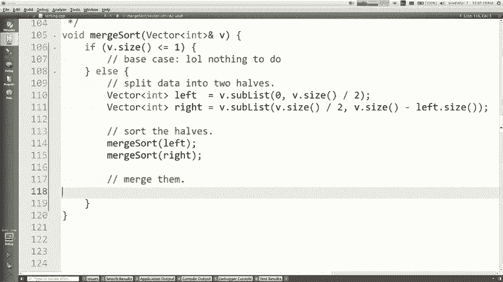

您应该将图片备份到屏幕上，并且应该具有这些索引，进入左右两个向量，并记住我们，假设我们的代码正常工作，那么当我们说我们被合并时， ，一半，我们以为那是可行的，现在之后，回到我们那里。

那些一半现在已经正确排序，所以我猜我猜我。

可以在这里做的是，我可以说您知道左右已排序，现在将它们合并。

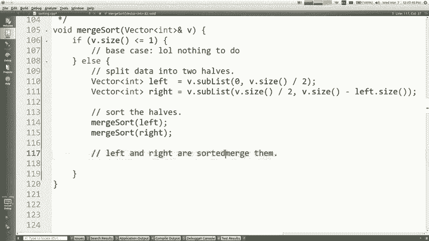

所以让我们跟随这张照片，让我们使i1和i2和i1等于。

零，这是左数组中的索引，int I 2等于零，即，是在正确的数组中的索引，是的，所以现在让我们反复选择哪个是，较小，我认为这可能会是一会儿循环，也许当我1 ，小于左点符号或I 2小于右点尺寸。

一旦这两个intz都超过了其部分的大小，向量，然后有谁做对了，所以我认为我们需要做的是，决定我应该从左边还是右边，我认为代码的格式如下： ，从左到右，我的意思是听起来很明显，但我，是的，好的。

让我们忽略if部分，但是您如何，左边的元素是什么意思，左边的元素在哪里，方面，我认为指数为零很好，在一般情况下，索引我一个正确的，所以如果我说左括号基本上是我要比较的。

现在是在比较我赢得的左括号和右括号I- ，我想从这两个东西中取较小者，我从哪里拿走，我在哪里放这个好，你还记得这里的目标是对向量进行排序， V，所以现在我已经取出了V的内容，对它们进行了排序，现在我。

需要将排序后的结果放回V，所以我认为这样做的好方法是，清除V或，或者我猜您可以做的是，您可以说另一种方式，编写此循环标题就像我正在尝试设置每个， V的值，所以我可以做一些类似int等于零小于V点的操作。

我加号的大小，所以这里的目标是我要设置VI为左，一只眼睛，或者如果我从右边拍摄，我将VI设置为正确，我-你呢，可以理解，就像我在选择要放入V的排序版本中的内容一样，所以如果你从左边拿东西。

我想如果你忘记了。

看看这里的图片，我将其放在VI中，做那部分，但我还需要做什么，也许有人呼吁，是的，我必须在索引中添加一个，就像我从i1中提取一样，我必须移动，向前一个，所以我看着上面的照片中的数字32 。

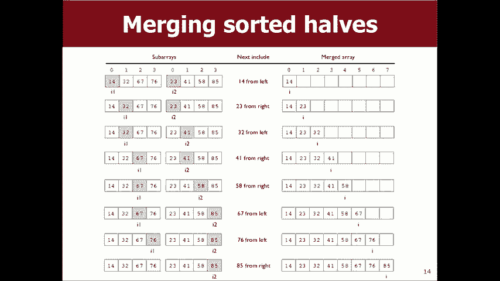

是的，正如您所说，让我做1加加，然后，如果您从右边拿走，我就加2加，是的，所以现在我跳过，声明，如果您像我一样，可能会打扰您，只是加热一下，底层修复它我已经解决了它，您不能忍受观看未写的内容。

那里的一段代码，那是什么测试，我的意思是我基​​本上认为如果剩下一个，较小时，请左移右，因此我认为是最初尝试编写此代码，就像如果左眼比右眼小-那么我将从，左侧右侧大部分是正确的，尽管您有一个问题。

知道那是什么，是的，如果我们已经放弃了该代码，那么该代码将无法正确执行操作，一个或另一个阵列的边缘（如果您已经消耗了所有，左边的元素，那么你就不能进入我赢得的括号，因为它将，失去平衡。

如果您已经消耗了权利的所有要素，您无法访问将超出范围的访问元素和xi2，所以我认为，基本上，我想修补此if test以确保是否没有剩余，右侧或左侧的一个小于右侧的一个，这是我想两次从左边拿东西的两次。

类似以下内容，我想我认为这有点棘手，布尔测试完全正确的第一次尝试，但我想你想要的东西，如果I 2超过了正确的大小，或者I 1没有超过，左边的叹气和左边的叹气较小或类似的东西。

就像如果我们在边界内并且它较小，那么从左边取走，我认为，合并是代码中最难的部分，拆分和排序是，神奇的简单部分，我们只需调用函数并执行版本和操作即可，但这就是合并的东西，如果您没有很多东西。

我希望它现在可以使用，相信我们能正确解决这个问题我会在主要功能中说，在这里，如果我调用合并排序，如果我没有真正对向量进行排序，它将崩溃，就像如果我们不这样做不起作用，你会知道如果我有这个。

真正快速的运行时间，但是我欺骗了它，因为它甚至都无法排序，你知道我的意思是我不会让自己摆脱那好吧，让我们，试试看，让我们看看它准备得有多快，这本应该很大，运动，让我们一起看这些运行时编号，我们完成了。

记得另一个人我可能已经忘记了另一个人做了什么，让我们一起来看一下，合并它们的插入排序以完成40，000个元素，花了大约一分钟的时间进行合并排序，而用一半，秒不到半秒，哦，你知道是否可以看到。

有点隐藏在我的讲台后面，但是58秒的速度要快得多，相对于300毫秒，这就像速度更快，但是速度更快，但是如果您，仔细考虑一下，记得我说过N平方和n登录是一个，差异很大，基本上是您所使用的数字。

退出多个事件，然后将其添加到多个登录帐户中，因此您取出了一个， 40000的倍数，您添加了14之类的倍数，或者是，很多不同的权利，这就是为什么这些数字如此不同，这里的时间还可以。

但我们来谈一谈大O因为大O实际上是关于增长的，认为这些数字足够小，以至于很难看到一种模式，让我们得到更大的数字，让我们上升一个档次，然后转到而不是，上升到十万让我们去一千万美元，看看会发生什么。

所以现在我们有了一些更大的数字，我们可以在这里查看，已经破坏了结局，你知道我基本上告诉你哪位女士，已经病了，应该是，我告诉你会发生什么，尽管那是n log n的Big O，但是。

我不知道您是否知道如果您仅查看这些数字，你知道我的意思是我想如果你对Big O不太了解，你会看，可能会说它是n的大O，因为它看起来像，如果您将n加倍，则运行时间有点像，大约是正确的两倍。

但是如果您真的要更精确，那也许，更像是两点你所知道的东西，这就是log n ，看起来比线性稍微多一点，抱歉，运行时更改将等于，输入大小的变化，您现在可以输入了，这就是我真正喜欢的。

可以比较的是我可以显示多少元素，排序20，000个元素所需的时间中有多少个元素，插入排序我可以知道合并排序中有超过一百万个元素，所以我，意思是我希望我已经说服了您，合并排序更快，并且确实可以。

对数据进行排序，因为如果不对数据进行排序，程序将崩溃，好的，这是一个很好的例子，您知道递归排序和另一个。

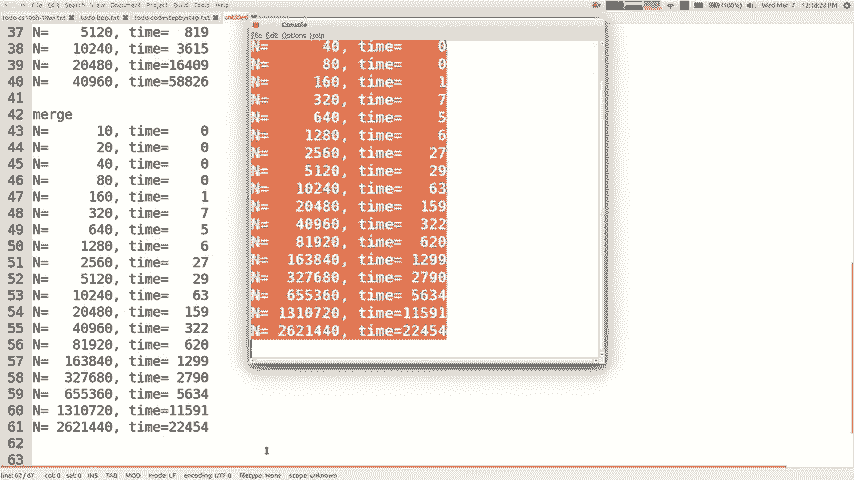

关于合并排序真的很酷的事情，我可能无法，今天要详细讨论的是，与其他一些排序不同，可以并行化的算法现在你们可能已经听说过，知道一切都在这些云层中，你知道这些充满了大农场，服务器并共同努力以解决庞大的数字。

问题和问题，像这样的权利，当然，这是因为我们拥有，基本上用不了聪明的方法来使单个计算机更快，过去曾经是每两年一个人的速度，电脑将使您加倍知道摩尔定律，计算机变得越来越快，分子对我们来说正成为问题。

知道所以这就像我们快要耗尽空间以达到相同的速度， ups，所以我们可以使事情更快的唯一方法是拥有很多计算机，很好地解决问题，所以我们在这方面还没有真正谈论过，关于并行算法的类。

例如采用一种算法并具有两种算法，工人在两台或两台以上的计算机上工作，这有点不合时宜，这堂课的范围也许有一天我们会坦率地讲授这门课的一部分，我们之所以不教您的原因是因为C ++的功能不是很好。

支持该时间步，因为他的加号是在大约同一时间做出的，我就是这样，无论我说什么是合并排序，都非常有利于，被多台计算机拆分和并行化，希望您可以，明白为什么我的意思是按字面意思划分工作，所以这只是一步。

删除以将一半的数据发送到其他计算机，看到这里，您对此部分进行排序，我将对我的部分进行排序，一旦完成，我们将合并，他们都回来了，所以这是一件非常有力的事情，基本上已经得到验证，通过查看它。

但我不知道您是否对此充满信心。

看这段代码，如果您直接转到此代码，我的意思是首先，坦率地说，关于递归还没有太多谈论Big O ，因为很难谈论您参加我们的一些理论课程，以为是109161，您将了解到称为递归关系的信息。

提出了103我忘记了哪门课程的内容，但是您会，了解有关递归算法的推理方法，运行时很好，这对我来说还不是很清楚，无论如何，你对这样的事情有直觉吗，好吧，这是我的尝试，可以让您直观地了解此循环。 。

一次执行一次此循环磁带以运行该循环一次，整个循环以完成重复，无论如何，请愿书正确地完成了每次重复所要进行的工作量，几个索引，加上印度的加号似乎并不算是一个常数，工作量还可以，所以工作是n我必须做几次。

这是一张横跨n的图片以完成其词，您可以想到它们，作为二维空间要完成的工作，您可能会说完成的工作量，每次通话，然后简短地说明通话次数或总次数，我们需要打的所有电话，所以实际上下降到多少，这堆电话得到。

如果你被二除以二除，你真正要问的是被两个元素除以一个元素，时间K除以Q得到很多东西的次数是一种，需要在这里进行的工作，这大概是为什么，事情需要n log n的Big O运行。

如果将它分成五分之六或六十二分怎么办，是的，我是说你，开始获得像以日志为基础的5或以日志为基础的信息，是因为任何日志都可以转换为其他任何日志，所以它只是一个，常数时间日志。

但实际发生的是如果您有这些多个工作人员，有趣的多个处理器使讨论变得更加困难，但是，让它变得更快更有趣，因为我没时间了，所以我必须停下来，在那里，但正在整理中，我将在星期五再见到你们，我们会谈。

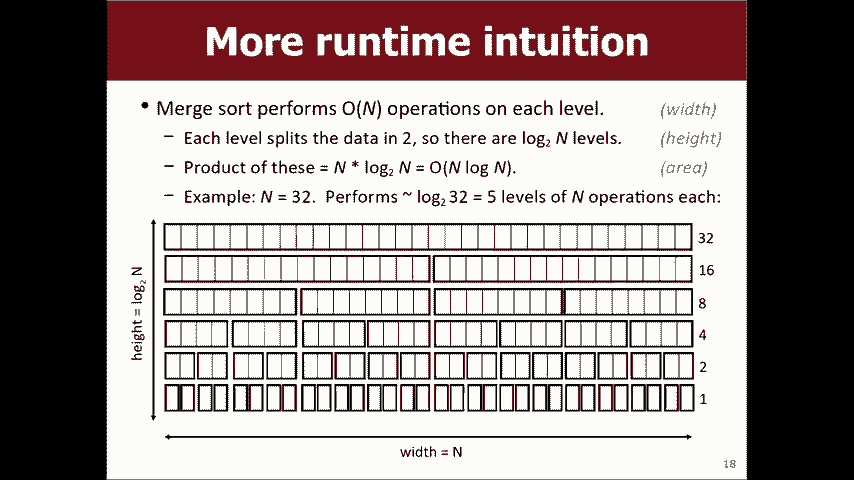

关于继承非常感谢。

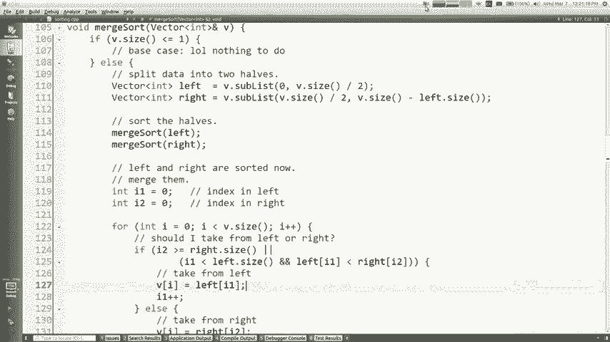