# 课程23：排序算法详解 🧮

在本节课中，我们将学习几种经典的排序算法。我们会从简单的算法开始，逐步深入到更高效、更巧妙的算法。理解这些算法的工作原理、时间复杂度和适用场景，对于解决编程问题和优化程序性能至关重要。

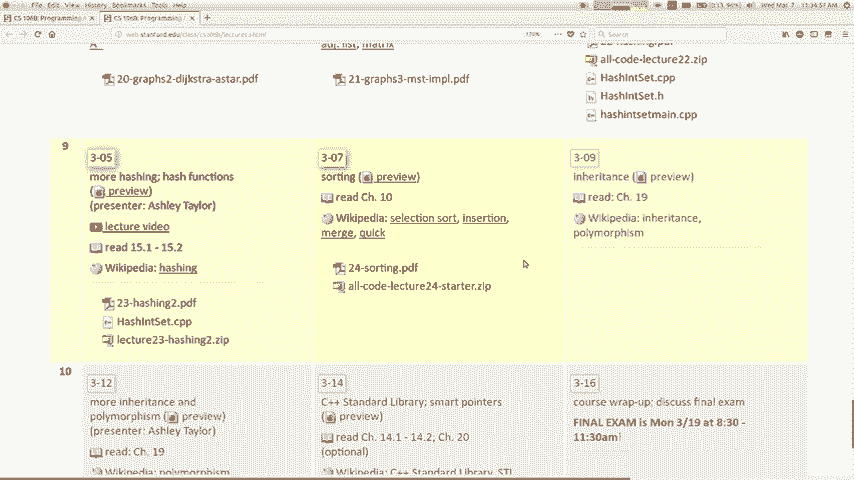

## 概述

排序是计算机科学中的一个基本问题，目标是将一组数据按照某种特定顺序重新排列。不同的数据类型有不同的“自然”顺序，例如数字可以按大小排序，字符串可以按字母顺序排序。但有时我们也需要根据其他标准（如长度）进行排序。今天，我们将介绍几种不同的排序算法，分析它们的运行时间，并理解其背后的思想。

## 冒泡排序 (Bogo Sort)

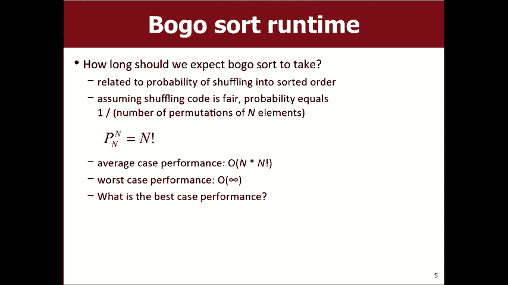

首先，我们来看一个非常低效但有趣的算法——冒泡排序。这个算法并非真正的实用算法，但它能帮助我们理解排序问题的本质。


冒泡排序的思路是：随机打乱数组，然后检查数组是否已经排好序。如果是，则停止；如果不是，则重复这个过程。这就像从一副扑克牌中随机抽取，期望某次恰好抽到完全按顺序排列的牌。

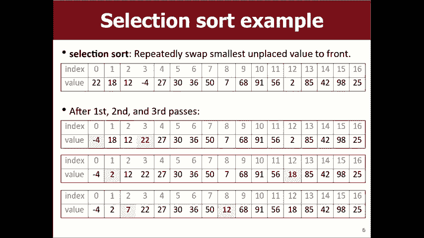

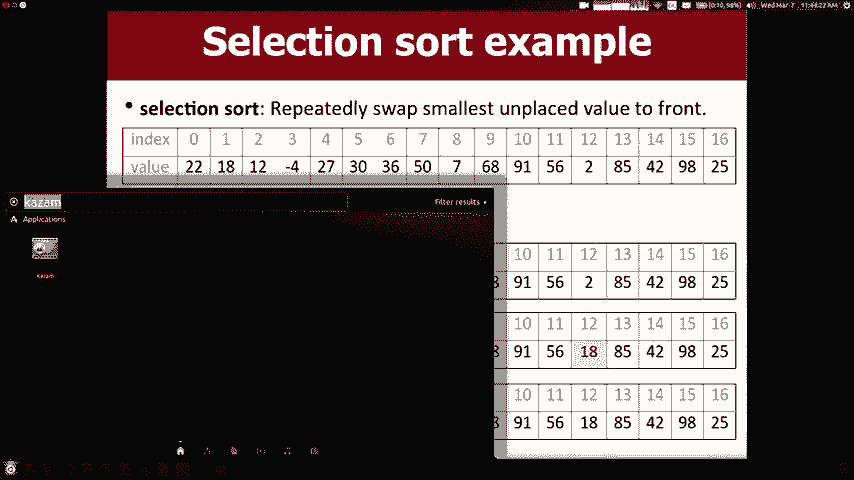

以下是该算法的核心逻辑描述：
```cpp
while (!isSorted(array)) {
    shuffle(array);
}
```


**时间复杂度分析**：
*   **最好情况**：如果输入数组已经是排序好的，那么只需要一次检查，时间复杂度为 **O(n)**。
*   **最坏/平均情况**：算法可能永远无法得到正确排序，或者需要极长的时间。理论上，单次随机打乱得到正确顺序的概率是 **1/(n!)**，因此平均时间复杂度是 **O(n!)**，这是非常糟糕的。

显然，我们永远不会在实际中使用冒泡排序。介绍它只是为了对比和引出更高效的算法。


## 选择排序 (Selection Sort)


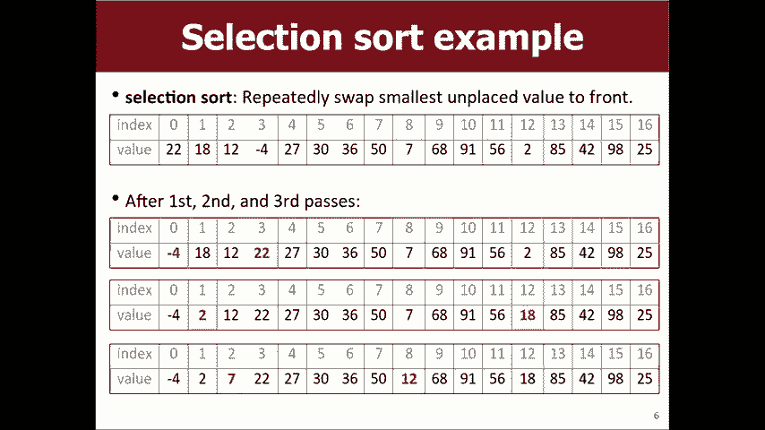


上一节我们看了一个“碰运气”的算法，本节我们来看第一个实用的算法——选择排序。它的思想直观且易于实现。

选择排序的工作方式是：在数组中扫描一遍，找到最小的元素，将其与数组第一个位置的元素交换。然后，从第二个位置开始扫描，找到剩余元素中的最小值，将其交换到第二个位置。如此重复，直到整个数组排序完成。

以下是该过程的伪代码描述：
```
for i from 0 to n-1:
    minIndex = i
    for j from i+1 to n:
        if array[j] < array[minIndex]:
            minIndex = j
    swap(array[i], array[minIndex])
```

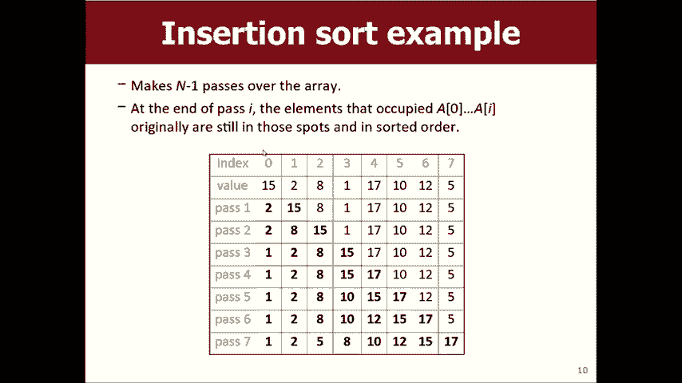

**时间复杂度分析**：
选择排序需要进行大约 n + (n-1) + ... + 2 + 1 次比较。这个数列的和是 **n(n+1)/2**，因此选择排序的时间复杂度是 **O(n²)**。无论输入数据是已经排序、完全逆序还是随机，它都需要同样的时间，即最好、最坏和平均情况都是 **O(n²)**。

## 插入排序 (Insertion Sort)

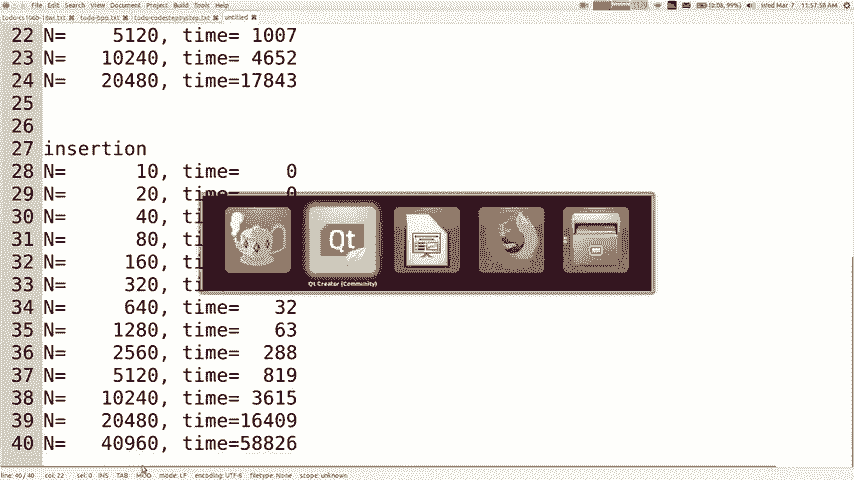

理解了选择排序后，我们来看另一个 **O(n²)** 级别的算法——插入排序。它模拟了人们手动排序的方式，例如整理一手扑克牌。

插入排序将数组视为两部分：前面是已排序部分，后面是未排序部分。算法开始时，已排序部分只包含第一个元素。然后，它依次将未排序部分的每个元素“插入”到已排序部分的正确位置，从而逐步扩大已排序区域。

以下是该过程的步骤描述：
1.  从第二个元素开始（索引 i = 1）。
2.  将该元素（称为 key）与前面已排序的元素从后向前比较。
3.  如果 key 比前面的元素小，则将前面的元素向后移动一位。
4.  重复步骤3，直到找到 key 的正确位置，将其放入。
5.  对下一个未排序元素重复上述过程。

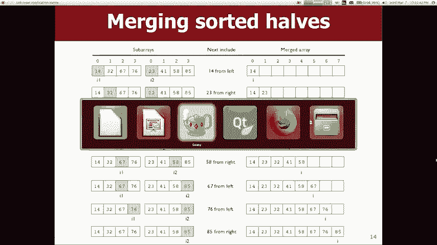

**时间复杂度分析**：
*   **最坏/平均情况**：需要嵌套循环，时间复杂度为 **O(n²)**。但由于其内部循环的移动操作比选择排序的交换操作更高效，所以实际常数因子通常比选择排序小。
*   **最好情况**：如果输入数组已经基本有序或完全有序，插入排序只需要进行少量的比较和移动，此时时间复杂度接近 **O(n)**。这是插入排序的一个显著优点。

## 归并排序 (Merge Sort)


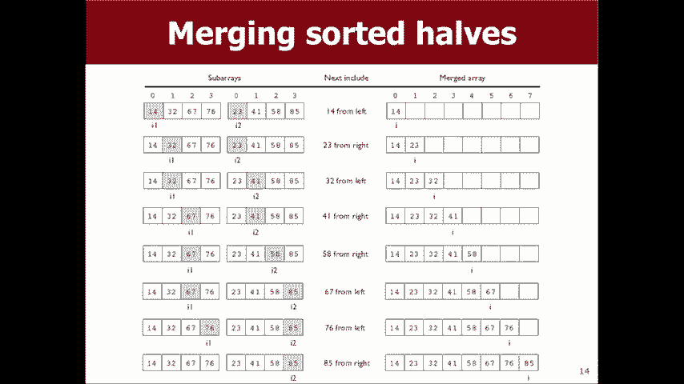

前面介绍的算法都是 **O(n²)** 级别的。现在，我们来看一个更高效、采用“分治法”的算法——归并排序。它的性能有了质的飞跃。


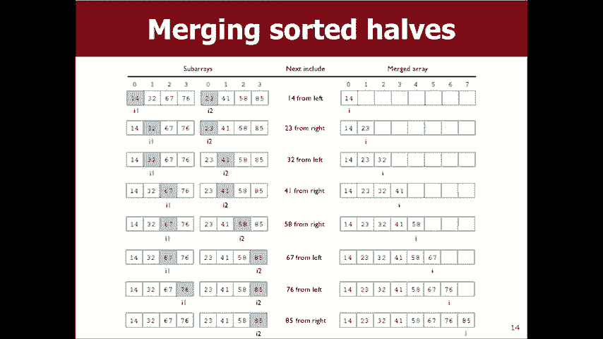

归并排序的核心思想是“分而治之”：
1.  **分**：将数组递归地分成两半。
2.  **治**：对每一半分别进行排序（递归调用归并排序本身）。
3.  **合**：将两个已排序的半部分合并成一个完整的已排序数组。

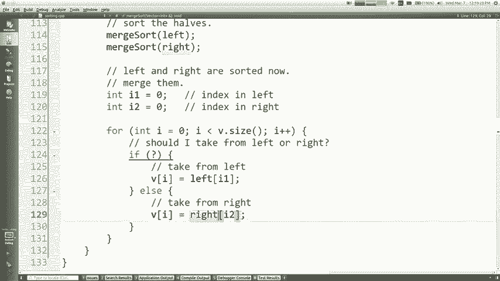


合并两个已排序数组是归并排序的关键步骤。我们可以使用两个指针分别指向两个数组的起始位置，比较指针所指的元素，将较小的元素放入结果数组，并移动相应的指针，直到所有元素都合并完毕。

以下是归并排序的递归框架：
```cpp
vector<int> mergeSort(vector<int>& v) {
    if (v.size() <= 1) return v; // 基本情况
    int mid = v.size() / 2;
    vector<int> left = mergeSort(v的前半部分);
    vector<int> right = mergeSort(v的后半部分);
    return merge(left, right); // 合并两个已排序数组
}
```

**时间复杂度分析**：
归并排序不断地将问题规模减半，需要进行大约 **log₂n** 层分割。在每一层，合并所有子数组的总工作量是 **O(n)**。因此，归并排序的总时间复杂度是 **O(n log n)**。与 **O(n²)** 相比，当 n 很大时，**O(n log n)** 的效率要高得多。

**额外优势**：
归并排序的“分”步骤天然适合并行计算。我们可以将不同的子数组分配给不同的处理器同时进行排序，最后再合并结果，这能极大地提高在大规模数据上的排序速度。


## 总结

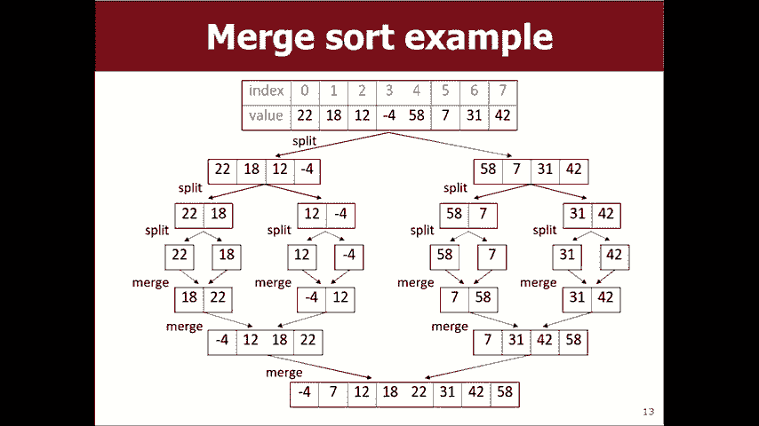

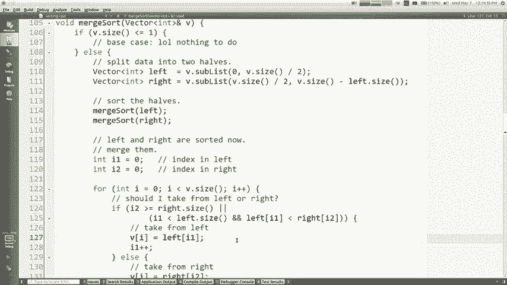

本节课我们一起学习了四种排序算法：
1.  **冒泡排序**：一个低效的理论示例，时间复杂度为 **O(n!)**。
2.  **选择排序**：直观但效率不高，在任何情况下的时间复杂度都是 **O(n²)**。
3.  **插入排序**：模拟人工排序，平均为 **O(n²)**，但对近乎有序的数据效率很高，最好情况可达 **O(n)**。
4.  **归并排序**：采用分治法的高效算法，时间复杂度为 **O(n log n)**，并且易于并行化。


理解这些算法的差异和适用场景，是成为一名优秀程序员的重要基础。在接下来的课程中，我们将继续探索C++中其他的编程抽象概念。