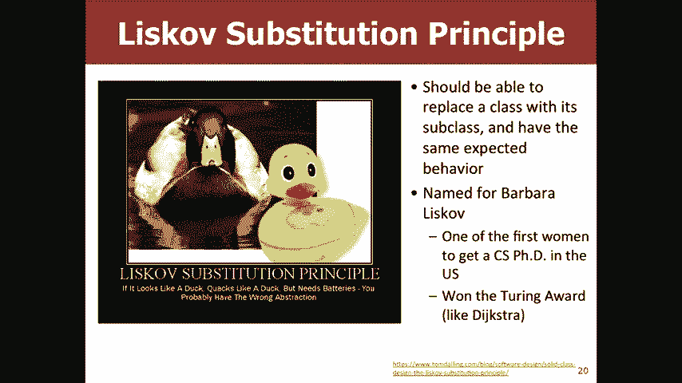

# 【斯坦福大学】CS106B C++中的抽象编程 · 2018年冬（完结·中英字幕·机翻） - P24：【Lecture 24】CS106B Programming Abstractions in C++ Win 2018 - 鬼谷良师 - BV1G7411k7jG

因此，我们的最终审核会议将在下周四发布。 ， 3月15日7：00至8：30 pm由Zach领导，和Noland或很棒的部门负责人，现在请出来370 ， 370，他们将处理许多不同类型的问题，您将看到。

期中会有很多问题，这将不是视频。

录制好吧，让我们谈谈继承，所以继承是一种，与不同的类有关的方法，以及使之间的代码冗余最小化的方法，类别，并允许客户端对不同类别进行类似处理，这是我们将在周一回到的话题，其中一部分将是。

实施一系列建立员工系统的课程，彼此相关的不同类型的员工是的，所以继承，是表明两个类相关的方法，也是共享代码的方法，在两个或多个类之间以及层次结构之间，这是，继承是您拥有一个类别，而另一类别。

孩子一般来说，你上一堂课是什么样子，吸收其数据和行为的另一种含义，所以超类是，父类和子类是子类，所以基本上，通常看到的是，子类可以做超类可以做的所有事情，但是，它可能会做一些不同的事情。

也许可以做得更好，所以，一个例子就是我的G对象家族，所以您可能已经看到了， Java中的权利，但是我们也有C ++这些库，基本上，所有这些不同类型的图形，例如G椭圆形或G线或G标签，以及。

那么我们称之为G对象的所有不同类型及其优势，那就是你要说所有这些共同的行为，知道各种不同类型的图形可以包含某个点或具有，颜色在屏幕上有正确的位置，实际显示的内容不是字符串文本标签还是，线或矩形。

它们都将在屏幕上的某个位置，所以得到， X对Y的意义对所有这些都是相同的，但您也有，这些不同的子类可能具有独特的行为或可能实现，这些略有不同，因此G标签例如具有字体或具有。

您可以设置与之相对的文本对于多边形，知道多边形以Times New Roman字体表示是什么意思，正确，所以您会看到通过创建此层次结构，您可以利用一些，常见行为和通用代码，但您仍然可以实现。

特定于该类的自己的方法我们正在研究什么问题，你们都有关于继承的原因，为什么我们可能想要这样做，好的，作为这个示例的一部分，我们将实现一些，员工，所以所有员工都赚了48，就像所有这些规则一样， 。

真正重要的是我们只想为以下行为定义常见行为，员工，然后除了这些类型的员工，雇员的子类型，例如律师或程序员，秘书或专利，可以做额外事情的律师，因此我们将主要关注律师和，热情的律师。

因此律师可以做您可以做的所有事情，但是，他们也知道如何起诉人们正确的重要技能，律师专利律师知道如何起诉他人，也知道如何申请专利，如何通过归档文件使人们变得超级富有，所以我不会编写代码，所有员工类别。

因为您没有这些有趣的权利，时薪等，是的，这是我们的班级定义，好，那么您，可以想象我们的律师可以有完全相同的行为，他们知道如何，起诉，所以让我们写律师课好吧，所以我们的专利律师会尽一切努力。

如果员工知道如何提起诉讼并且知道如何向UM申请专利，他们就可以这样做，让我们写任何人看到这些类的任何问题你怎么办，说是的，这是很多相同的代码，所以通常在CS 106a和CS中。

 106就像现在在您的CS Cruz中，您应该知道喜欢的代码，冗余，最好是我们没有教给你任何其他东西，例如代码冗余，是不好的，所以你知道如何分解成方法和类似的东西，尽量减少这种冗余，但是在这种情况下。

我们没有一个好方法，让您的专利律师能够直接检查员工，因此我们，拥有整个继承关系，这样您就可以拥有，利用这种共同的行为，通常看起来像，在代码中，你有上课，你知道你叫什么名字，就像律师，然后这样：如果。

 Java关键字，他们不想让它成为某种历史的实际用词，原因，但他们因此使用了冒号，这只是意味着扩展了公众范围，然后，超类的，所以这看起来像是阶级律师向公众延伸，员工，这意味着现在每个律师都会自动获得。

休假表格中的小时工资休假天数，您不需要任何，该代码正确，它会自动具有它，您不需要编写那些，您不需要以任何方式更改它们的方法，这样您就可以，获得所有这些强大的功能，好吧，所以让我拉起吧，这是我们的。

原始的律师代码是正确的，所以如果我们将其写成公开表示，请知道，现在我们实际上不需要定义任何这些方法，因为它们已经，通过员工超类进入，然后在这里我们可以摆脱，所有这些代码-因为员工已经定义了这些方法。

所以代码将，就已经在我们身边了，所以我们创造的整个过程真的很酷，新型员工，我们必须编写四行代码，您问什么问题，所有人都有。

所以我们谈了另外两个话题，所以如果我们有你的，员工我们的员工是一个班级，然后我们的律师是正确的，那么您在哪里，您认为程序员应该如何考虑程序员，员工可以做的所有事情，然后还知道如何编写代码，所以您也可以。

想想有多少人对什么可能是一个好的超类有任何想法，对程序员来说，是的，所以我们可以把它放在这里，这样程序员就可以了，关于专利律师，所以是专利律师，做到员工可以做的所有事情。

并且知道如何提起诉讼以及如何提起诉讼，是的，所以在这里我们实际上可以将专利律师扩展为律师，因为您有专利律师会做律师所做的一切，并且，您隐含地知道员工所做的一切，只是添加了，功能，在这种情况下。

最好有一些东西，看起来像这样，而您知道拥有专利律师作为直接律师，将员工分类，因为您可以利用专利律师的优势，或抱歉，如果您能够利用律师的起诉方法，您的专利律师对此有什么疑问，所以这会导致明显的下一个问题。

或者可能导致明显的下一个问题，好的问题，所以这很好，因为我们的员工碰巧都拥有，同样的四种方法，然后我们只是扩展它们，但是，如果我们想让这些员工有一点点，具有不同的行为权利。

所以您知道并非所有员工都能做到，相同的金额，并非所有员工都有相同的地图假期等，是的，所以这是我们以前的同一个员工示例，但是现在您知道了，拥有一些额外的规则，所以您可能会认为很好，如果我们。

只是想改变我们的律师，使其具有不同的形式，如此直接的示例，其中有休假表格，应该返回粉红色，右边的黄色，所以我们先来看一下这个程序，这是我们的女佣，是的，好的，基本上你可以看到，像这样。

这是丽莎的雇主信息，我们实际上可以，使Lisa成为雇员权利，因为通过成为律师签证是，员工，这就是这种继承结构的优势之一，我们可以，在这里给这些打印员工信息打电话，好吧，所以看看他们有。

相同的信息很有意义，因为他们都是员工，所以您，如果我们想改变行为的逻辑性，可能会说好，事情就是让您知道编写我们自己的假期表格方法，所以问题，这是说它不知道休假形式存在，因为这是一个。

员工的方法而不是律师的方法，所以基本上，发生的是它正在尝试使用像律师，实际上并没有明确地说，哦，我们有这个，我们有另一个，一种叫做休假表格的方法，所以它不知道去看员工，那个假期表格的类。

所以我知道Holly可以查看错误消息，说休假表格的格外定义与中的任何装饰都不匹配。

律师好吧，为了做到这一点，我们必须做一个叫做“覆盖”的事情，因此，覆盖它涉及替换超类方法或成员函数，在子类中有一个新版本，这就是我们试图做的，以我们的休假表格示例为例，但问题出在C ++中。

您必须使用此，称为virtual的关键字，当您看到此方法时，它会告诉您类似的内容，并且，员工，您实际上可能不得不更具体地关注子类，弄清楚什么是实际的方法实现，这可能是一个方法，这被C ++覆盖了。

这就是其中之一，在此过程中，我们逐渐了解和喜爱许多有关C ++的怪癖，四分之一，基本上总是称虚拟的，从来没有真正的好，没有虚拟的原因，因此在超类中都应该始终是虚拟的，就像在任何子类中一样。

一旦您开始使用virtual就可以使用virtual ，到处都是因为它可以避免一些奇怪的错误，例如我们刚才看到的正确的错误，是的，所以虚拟只进入点H文件，然后进入点CPP ，就像平常一样，然后您还需要。

确保您在dot H文件中为律师声明了该方法，而不仅仅是，员工还可以。

这是说虚拟字符串休假表格，然后在这里我们想，说好吧，让我们虚拟化这个伟大，所以现在当您运行它时，编译，现在它由于某种原因运行，不是说这就是为什么，不好意思，请保持[音乐] ，抱歉。

我忘了宣布自己是律师而不是雇员，所以现在您可以在这里看到，丽莎是粉红色而不是黄色的，这很好地说明了为什么虚拟是如此，重要的是，如果我们在员工那里摆脱了这个虚拟环境，它不会抛出任何。

编译器错误它不会让您知道任何错误，但是当我们崩溃时，现在是黄色而不是粉红色，所以总是使用虚拟是的，好的，问题是，您是否必须在员工中以及在您和，从技术上讲，在您的律师中，您只需要一个雇员即可，就像。

 Java如果您在Java中进行了任何继承，则方法会自动声明，像C ++这样的虚函数应该只使用虚函数，我可以，自动成为仅使用虚拟的行为，他们搞砸了，他们弄错了其他面向对象的编程语言，像自动使用一样。

只是将所有重写的方法都设为虚拟C ++ ，不太道德，这个故事只是使用虚拟的，如果不是那么多的话，额外的代码，这是使用您的班级的客户会想到的，希望是的，所以即使您，不要覆盖它们，可以将它们虚拟化就可以了。

 ，像嘿这样的编译器，我们将来可能会覆盖它，只是请注意一下，并确保是的，我们正在寻找最具体的，最正确的执行方式，好吧，问题是如果您想覆盖，传入，因此在这种情况下，两种方法采用了不同的参数。

实际上被区别对待，因此它们将被视为不同的方法，因此，您实际上无法覆盖传递给它的参数很大的问题，尽管您也，不能覆盖返回类型哦，是的，我们在后面是，那是更好的吗，先生，好的。

所以与我们知道的人一起工作得很好。

但我们也说过，我们的律师获得的报酬是，我们的程序员或我们的员工做得对，所以我们可以投入。

本来可以写这样的方法，只是说好吧，英寸的律师，您将其分别放入我们的律师，然后在这里我们说薪水，我们本来可以说还好80，000，但是这个问题，如果我们想让您知道通货膨胀发生了，我们想得到所有。

员工加薪3％或如果我们这样做的话，如果我们改变，雇员律师不会看到变更权律师仍会返回80，000 ，这意味着现在我们需要在第一步中在两个不同的地方更改代码，或者，我们欠律师的薪水都不是很好的选择，所以在。

为了解决这个问题，我们可以致电并利用员工的薪水。

方法，因此，如果看起来像是您将打电话给薪水，您必须。

指定您是在打电话给员工的薪资方式而不是律师，工资法，所以如果你只是说回报工资乘以2 ，递归的权利，我们知道这将错过一个基本案例的发胖时间，碰巧你会像无限量的钱一样付给他们两倍，因此。

只要您想调用超类成员函数，请确保，您将类名与冒号一起使用，是，好吧，问题是我们为什么要称呼这种超一流的薪水，在这种情况下，我们知道律师希望获得比正常人高两倍的报酬，员工更像非律师员工，并且为了获得。

值不这样，所以我们只能说好员工的薪水是40，000，所以，您将获得80，000的报酬，但是问题是如果我们要提高，每个人的薪水是50，000，我们仍然希望律师可以，他们要付十万而不是八万，所以如果你只是。

说我们然后需要喜欢在两个文件中而不是仅在一个文件中进行更改，是的，所以这就是为什么我们称员工薪水，所以如果我们改变，员工薪资方法中的某些内容会自动反映在，律师薪资方法，因此我们可以在此处进行更改。

以便员工薪资。

抱歉，好吧，问题是如果我们没有专利律师，我们还有什么，需要喜欢将所有这些变更从员工那里复制到律师那里，年龄，所以我们会因为想让律师拥有自己的，薪资方法您需要在点H文件中定义薪资方法。

问题是不等我们从上一个中得到薪水方法了吗，所以是的，但是我们没有从雇员点H覆盖的能力，所以，我们有H点员工的薪资方法，但是我们没有能力，覆盖它，我们还没有告诉计算机律师有更具体的信息，实施薪水。

这就是为什么我们需要像薪水方法那样，律师的点H档案，所以问题是您在两个，好的，从技术上讲，除非您要进行更改，否则实际上不需要律师，专利律师的行为，但这只是一种良好的编程习惯，一切都是虚拟的。

因为您可能正在写这名律师而没有想到，将会有一位专利律师，而有人则是，要去写专利律师课，或者他们可能想然后，他们试图使用您的类，您使用继承并尝试减少代码，冗余虽然很棒，但是最终您会知道尝试实现和。

覆盖这些方法，将无法正常工作，是的，好的虚拟，没关系，所以如果虚拟机确实可以告诉计算机没问题，我要拉起并在我身上弹奏，所以在这里你知道我们在通过它，像这里的员工这样的员工信息，它将打印出所有这些信息。

有关该员工的信息，例如工资和休假日等，如果您发生什么情况，我们将其称为员工点薪，没有虚拟的，它将总是像这样使用这种方法员工，是的，但是如果您将其定义为虚拟的，那么它将知道可以，我们需要。

寻找更具体的实现方式，我们将对此进行更多讨论，在星期一，当涉及到多态性时，声明为超级类型的相似对象，就像声明为，员工而不是律师，但是是的，它只是告诉计算机，就像嘿，还有更多的东西可能会有更具体的更好。

像去检查这样的实施，看看这名雇员实际上是一名律师， ，如果这样的话，请使用律师薪水而不是员工薪水，这真的很好，问题。

是的，好的，我们希望有一种不同的行为，好的，所以我们想让您知道子类的额外行为，例如，能够提起诉讼还涵盖了我们想要拥有不同类型的，员工有不同的实现方式，所以您希望向律师付款，现在更多的问题是。

如果我们想改变个人行为，这些类的实例不是所有律师都是一样的，不是全部，员工都是一样的东西，所以总的来说我们会有什么，为了使类的每个实例具有不同的行为而使用，是的，所以一般来说，您必须要有一个构造器。

这些不同的参数，好吧，我们只说我们有这里的员工，每年$ 40，000，加上每年$ 5，000的收入，这是一场不错的比赛。

在这里我们可以写我们的构造函数，所以说我们有员工，八年了，我们将让我们的私人耳朵好听，我的耳朵会宣布这一点，在这儿，我们等于您的耳朵，我们将为律师做同样的事情，我们给他们一所法学院。

他们也会得到一个建设者，好吧，我们也需要，要更改或使用它，我们需要将其更改为我的5，000倍，几年，然后我们需要改变通胀，我可以说这个人已经工作了两年了，可以说她去了。

到斯坦福就我刚才所做的更改有任何疑问，就像，实现的构造函数是的，问题是我在哪里可以听清楚，因此，我应该把耳朵放在哪里等于两年，这就是在实施，是点CPC的构造函数，所以基本上点H具有，构造函数声明。

然后点CPP实现它，而main实际上，使用构造函数，所以这些是我对问题的重大更改，好吧，坚持我大约两分钟，我们会看到出色的工作，是的，是的，应该没关系，让我们尝试运行它看看会发生什么，今天。

我只是向您展示很多奇怪的QT创建者错误，所以，说你们中有多少人见过x86架构找不到的符号， 64是的，对于那些在家看电视的人来说，您可能还在提高，举起这里的每个人都举手，所以我不知道你是否见过你。

可以去编译输出，所以这是说我没有，实施我的律师建设者来搅动我的法学院，好吧，让我们再试一次好吧，所以现在说律师的建设者必须，显式初始化没有默认值的基类employee ，构造函数，这回到您的问题。

所以它发生在这里是，每当您创建律师时，您也在创建员工权利，因为，律师是员工的子类，因此，要创建员工，您必须，将此员工构造器队列称为需要好几年的时间，并且，所以这里发生的事情是它不知道如何给员工打电话。

构造函数，因为您必须用很多年才能调用它，这是，有点微妙的地方，关于那个问题有什么问题，所以，问题是为了解决这一问题，我们需要更改构造函数，以便，输入员工的参数，是的，这是完全正确的，所以在这里我们可以。

像个我的耳朵一样，我必须在这里改变这几年，然后我们，员工可能不得不改变这一点，所以也许这个人已经工作了四个，几年了，所以让我们尝试再次运行它，它将仍然具有相同的功能，问题，因为即使我们给了它多少年。

我们实际上并没有，告诉它如何处理这几年的时间，所以这是个税。

看起来像这样，在C ++中还是冒号，但是基本上，构造函数，然后放一个冒号，然后将超类名称和，参数，以便调用超类构造函数，因此在这种情况下。

它看起来像这样，您可以说像我的耳朵员工，像这样的语法有什么问题，看到，现在我们可以运行它了，它可以编译，实际上现在您确实有一些，基于该人工作年限的可变性，因此，问题是有时您可以使用默认参数。

但我们会注意它在哪里，如果未传递任何内容，则会默认分配一个值，这样您就可以知道自己，可以做类似的事情，好吧，让我们不要拥有我们的员工，已用蓝色H停止了此操作，并没有花费很多年，而没有，这个年数。

我们会说没事，并且会默认，将其初始化为零，因为我们认为您雇用时没有任何工作，经验，所以它应该是可以的，所以它确实可以解决这个问题，实际上，每当您聘请律师时，您就想成为一名员工，并且，如果有意义的话。

可以用非零年数雇用员工，那么，同样有道理的是，像律师一样，可以聘请一名，非零年数，因此尽管默认参数将获得，我正在谈论的这个问题仍然不是最好的，解决大问题。

好吧，这是我们最后的律师，他们可以聘请其他律师。

他们可以起诉别人的薪水，这是我们实施的所有不同方法，重申一下，您有这个具有调用超类的构造函数，构造函数，然后确保在覆盖方法时，我们需要像那些超类一样调用我们使用的超类方法，在此处命名。

然后还要确保在我们的dot H文件中将virtual用于，我们的方法对继承机制有任何疑问，我知道C ++的语法确实很糟糕，但C ++搞砸了，但是，继承原理仍然相同，好吧，让我们谈谈继承的一些危险。

所以我告诉了大家，这种喜欢中间代码冗余并显示这些关系的好方法，在类之间，您可能会想像哦，现在我想在所有内容上使用它，也许不是因为您像哇，那只是很多垃圾语法，永远都不想去处理，但是在某些情况下，您不会。

想使用继承，所以为什么不与邻居交谈并尝试像，如果您想在这三种情况中的任何一种下使用继承，或者，你不会为什么为什么要很好地使用继承呢？ ，我从未听过的安静对话我是你最安静的对话，听说过，好吧。

你们所有人都怎么看，有多少人认为您，应该对3d点和2d点使用继承，人们认为您应该这样做是的，如果这种幻灯片被称为继承的危险， ，你只是用那个那个正方形和矩形呢？有多少人，想你应该有多少人认为你不应该好。

排序如何， vector和vector应该并且应该都可以，所以实际上在所有这三个方面，案例继承不是正确的方法，因为基本上它会发生变化，预期的行为，因此，如果您在3d点上调用2d距离，将会有错误的举止。

因为您要合并， Z坐标是一个距离，因此您可以知道它是XY还是， 0 0，但是您可能像是在50英尺高的天空中，或者像是在空中，摩天大楼，因此您可能位于相同的XY位置，但位于不同的Z ，位置。

所以距离不应该更容易，是的，所以问题是，如果您执行点2d扩展点3d并将Z坐标初始化为0， ，会是一个更好的选择，因为那样的话您会少一些这种意外，行为，虽然您应该进入一个2d点就能像。

设定的Z坐标或3d点的某物，因此a应该是2d点，被允许具有该功能，在这种情况下，仍然可能，不是正确的方法，我们会回答这个好问题，是的，然后您的，矩形没有她的最新矩形，不应该有带有vs的集合。

隐藏一个对正方形实际上没有意义的方法，然后，排序的向量可能会使客户感到困惑，因为如果您说好的向量该怎么办，您是否可以在索引零处插入元素，然后如果我们返回，您知道，我们得到的下一行代码是我们打印出此向量。

其索引为，都以错误的顺序排列，或者您知道递归回溯有很多，像在矢量递归的开始处插入东西的过程，我们向量的开始，如果我们要删除的不是，我们添加的内容可能会引起很多人的困扰，因此， 。

所谓的Liskov替代原理，基本上就是，应该能够用其子类的实例替换类，并具有，相同的预期行为，所以我想提出这个问题的一部分就是这个，因为Barbara Liskov Sue的现象是惊人的，具有面向对象。

编程，她重新定义了人们对面向对象的看法，编程并创建了很多这些原则，这些原则真正指导了人们，今天上课的课程和遗传，她还记得我和Dijkstra谈论图灵奖时，是的，所以她也获得了图灵奖，只是她像。

她是美国最早获得计算机科学博士学位的女性之一，最早获得图灵奖的第一位女性之一，科学家，如果看不到我不知道我们可以在后面看到，但是说如果它看起来像鸭子一样嘎嘎叫鸭子但需要电池，可能有错误的抽象。

因为您不能用，新的机械鸭子，预期具有相同的行为，好吧，所以现在。

你们都在想，好吧，您了解了继承，然后我们，了解了这些危险，似乎没有一种很好的方法，如果我合法地拥有了我想要的所有冗余代码，该怎么办？ ，利用您所说的关于2d点和3d的优势，指出并找到隐藏该行为的方法。

所以，记得我说过你不得不，你认识班级律师：公职人员，所以你也可以有一个私人，这是公共继承，这意味着客户可以调用任何，律师对象的员工方法私有继承需要您获得全部，代码，但您没有得到所有，如果有道理。

那么您就不会得到方法，你不是，如果我们要上课，客户将无法做到，律师私下扩展员工，您将无法打电话给所有，雇员对律师对象的方法，除非律师对象明确，定义这些方法好吧，因此通常我们会针对像，肮脏的向量。

我们可能想在索引处隐藏插入内容，如右图所示，或者在2d点示例中，如果我们有2d点，扩展3d点，则可能需要隐藏更改Z坐标方法， 3d点中的任何一个，这样您就不会选择将该方法公开，您是否有疑问，是的。

问题似乎并非全部，这么直观，为什么你会想在现实世界中基本上做到这一点，您可能想要像正方形和矩形这样的G正方形和G ，矩形将是一个很好的例子，因为您要隐藏以获取宽度，并获取高度方法，您也不想像矩形一样。

例如固定边长法之类的，因为那并不是真的，矩形很有意义，所以您喜欢，但您想保留，确实要，基本上有一个正方形的图，他在向右画一个矩形，是的，我正在检查XY内部方框，相同的是检查XY。

所以在矩形内部以及类似的东西，所以这将是一个真实的例子，您可能想私下，如果您要创建自己的犹太广场，则从grx继承，是的，好的，所以问题是这段代码实际上是什么样的。

让我们进入这里，假设我们私下扩展员工，首先是你不能做的事，你永远不能说好吧，我们不再，承认丽莎是雇员丽莎只是秘密地雇员，所以我们，因为程序员知道lisa是雇员，但客户不是，所以我们。

不能再打电话给该打印员工信息了，好吧，让我们打电话给她，员工并对此进行评论很好，所以现在它所说的假期是，员工的私人成员，所以现在就像放假一样，因为如果我们回到，我们的律师给您H点，您永远都不会宣布休假。

因此，您应该不休假，从员工进入律师的公共部分的那些方法中， ，属于律师的私人部分，所以就像私人助手功能，因此，当我们去这里时，您会得到像假期一样的私人身份，员工，这样您就无法实际休假给律师对象吗？ 。

正是为了重申这一点，使得客户端只能调用，您希望它调用的方法，以便在有有害方法的情况下员工，你可以摆脱那是的，因此，假设您希望我们的薪水是基于实际的薪水时间-- ，例如假期3或有时，所以您可以说假期3 。

我摆脱了这一行，所以我们可以编译它，所以在这里您看到我们已经，实际上减去了30天，因为我们的休假天数是，内部使用相同的方式，只是外部不使用，就像您一样，可能写了一个冒泡或冒泡的方法来保持。

希望它曾经以某种方式组成，所以有点像你，可以打电话给泡沫，但客户不能打电话给泡沫，所以，问题是您仍然必须使用虚拟我知道虚拟就像真实的一样，拖动，但是从技术上来讲，就像您一样，不要因为好，所以虚拟的。

星期一，当我谈论要像打电话时说，律师是雇员，但是因为您摆脱了那种功能，您不需要那么多虚拟，是的，问题是为什么我们不需要说这样的话，所以不是，这么说是错误的，但实际上我们是在打电话给律师放假的日子， 。

律师放假的日子恰好是员工放假的日子，所以我们不需要，明确地说去员工休假，因为里面什么都没有，想与员工休假发生冲突的律师班，天你怎么说具体说明什么，所以我们在点H文件中这样做是说我们正在扩展员工和。

因为我们没有律师自己的假期方法，所以它将，自动使用员工休假日的好问题，如果您是。

感兴趣的另一种方法来解决这个问题。

直觉是所谓的构图，而不是像，好吧，我要你知道我是斑马或我是正方形，我要说的是，我还是一个矩形，或者我是某种矢量，我会说我是，也是一个向量，您只需要像一个向量一样保留私有实例变量，然后，只要您需要致电。

无论返回什么，您都可以进入索引，您的方法看起来像矢量狗，但无论您使用哪种实例，变量，因此，如果您对此感兴趣，那就叫做合成，是的，问题是您是否私下继承的实际上是什么样的，等于说好，所以我们私下继承了员工。

所以我们，公开所有员工的公开资料，基本上我们将其私有化，在这里，我不是构造函数，但其​​余的是，所以这些是，等价与否在逻辑上等价于概念上等价，是的，好的，这就是员工的状态，称此为私人并发布。

例如说可以私下扩展此，实际上不是那样写的，所以接下来发生的是因为我们公开，这里有优先休假的形式，所以我们有一个公众，假期大问题是的，所以问题是我们是否真的想让假期成为公众假期？ ，认为这是一个国际假期。

所以我们要做的就是在我们的，博雅尔，我们不得不去律师放假的日子，然后我们就可以回来，员工休假日，这是一种非常常见的模式，看到我们只是将这个超类的方法称为我只想问的好问题，非常简要地介绍了C ++。

与其他面向对象的方法不同， Java或Python之类的编程语言允许您进行多重继承，这可以让您说某事是两件事，所以例如，输入流和输出流就在C ++中，因此您可以将其写为。

 I / O流既是输入流又是输出流，它是一个，可以读取和写入流，这是大多数情况下的原因之一，其他编程语言没有这是因为很多时候人们，像好吧，我像婴儿班，我也像狗班，所以我想做一个，小狗班。

所以小狗既是婴儿又是狗，所以我将两者都延伸，然后突然间，由于婴儿吃得很饱，您的代码就中断了，与狗的饮食方式不同，而您的婴儿所发出的声音与，狗制造的，那么小狗应该拥有哪只狗，所以是的，基本上，多重继承。

您真的不需要这样做，很好，谢谢，你好，星期一见。