# 课程名称：CS106B C++中的抽象编程 · 第24讲：继承


## 概述 📚
在本节课中，我们将要学习面向对象编程中的一个核心概念——继承。我们将探讨如何通过继承来建立类之间的关系、减少代码冗余，并允许客户端以统一的方式处理不同类型的对象。课程将通过一个员工系统的例子，详细讲解继承的语法、覆盖方法、构造函数调用以及需要注意的潜在问题。

---

## 什么是继承？ 🔗
上一节我们介绍了类的基本概念，本节中我们来看看如何让不同的类之间建立联系。继承是一种表明两个类相关的方法，也是一种在类之间共享代码、最小化冗余的手段。它允许我们创建一个层次结构。

在继承中，我们有一个**超类**（或父类）和一个**子类**（或派生类）。子类会继承超类的所有数据和成员函数（行为）。通常，子类可以做超类能做的所有事情，并且可能以不同的方式或更好的方式实现某些功能。

一个常见的例子是图形对象库。例如，`GOval`（椭圆）、`GLine`（线）、`GLabel`（标签）都是`GObject`的子类。它们共享一些共同行为，比如知道自己在屏幕上的位置（`getX`, `getY`）、拥有颜色等。但每个子类也有自己独特的行为，比如`GLabel`有字体属性，而`GOval`则没有。

通过创建这种层次结构，我们可以利用通用代码，同时为特定类实现独有的方法。

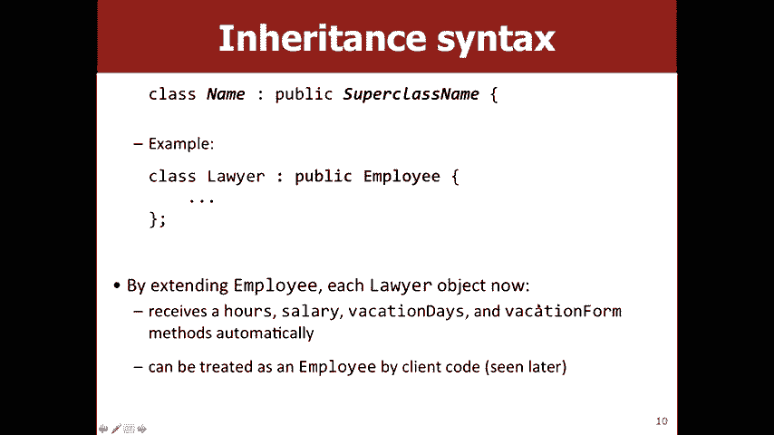

---


## 为何使用继承？ 🤔
我们使用继承主要有两个原因：
1.  **表明类之间的关系**：明确表达“律师是一种员工”这样的关系。
2.  **减少代码冗余**：将通用的代码放在超类中，避免在多个子类中重复编写。

为了说明这一点，我们将实现一个简单的员工系统。

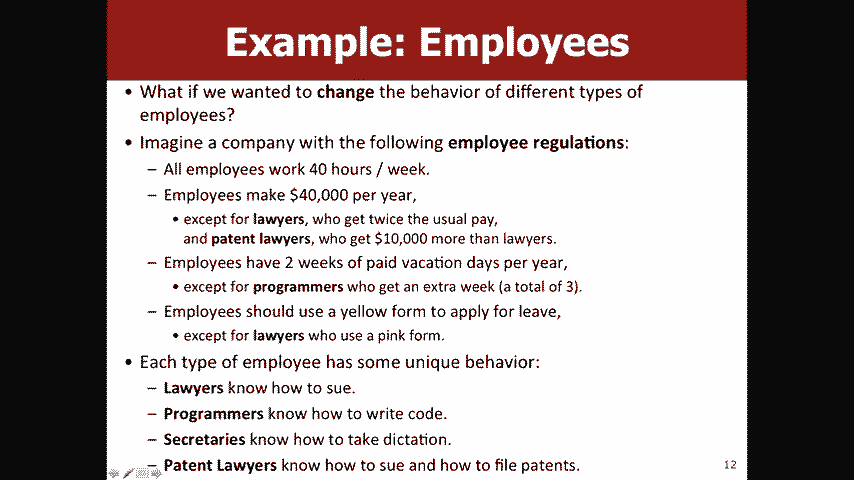

---

## 员工系统示例 👥
假设我们有一个`Employee`（员工）基类，所有员工都有一些共同属性，比如姓名、时薪、休假天数。

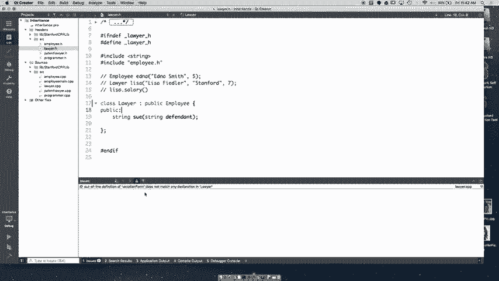

```cpp
class Employee {
public:
    virtual std::string getName();
    virtual double getHourlyWage();
    virtual int getVacationDays();
    virtual std::string getVacationForm();
    // ... 其他方法
};
```

现在，我们想创建`Lawyer`（律师）类。律师是一种员工，因此他们拥有员工的所有属性和行为。此外，律师还拥有自己独特的行为，比如`sue`（起诉）。

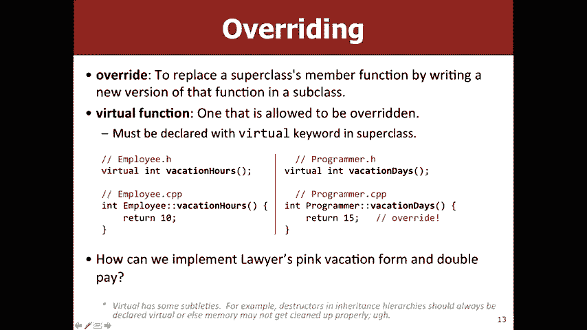

如果不使用继承，我们可能需要在`Lawyer`类中重新定义所有`Employee`已有的方法，这会导致大量代码重复。

以下是使用继承的`Lawyer`类定义：

```cpp
class Lawyer : public Employee {
public:
    void sue(std::string person);
    // 不需要重新定义 getName, getHourlyWage 等方法，它们已从 Employee 继承。
};
```


这里的语法 `class Lawyer : public Employee` 表示 `Lawyer` 类公开继承自 `Employee` 类。这意味着 `Lawyer` 对象自动拥有了 `Employee` 的所有公共成员函数。


---


## 覆盖方法 ✏️
上一节我们让子类继承了超类的行为，但有时我们希望子类对某些行为有不同的实现。例如，假设所有员工的休假表格默认是黄色的，但律师的休假表格是粉红色的。

我们可以在 `Lawyer` 类中重新定义 `getVacationForm` 方法。这个过程称为**覆盖**。

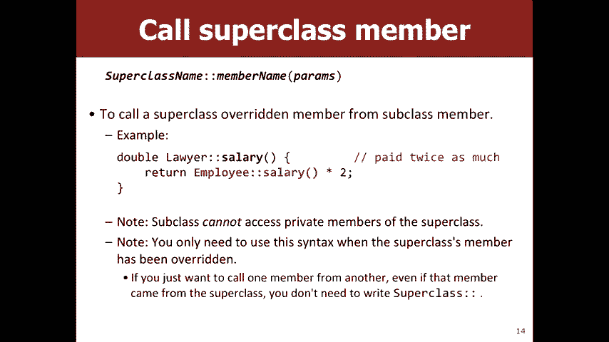

在C++中，为了正确地覆盖超类中的方法，我们需要在超类的方法声明前使用 `virtual` 关键字。

在 `Employee` 类中：
```cpp
virtual std::string getVacationForm();
```

在 `Lawyer` 类中：
```cpp
// 在 .h 文件中声明
virtual std::string getVacationForm();


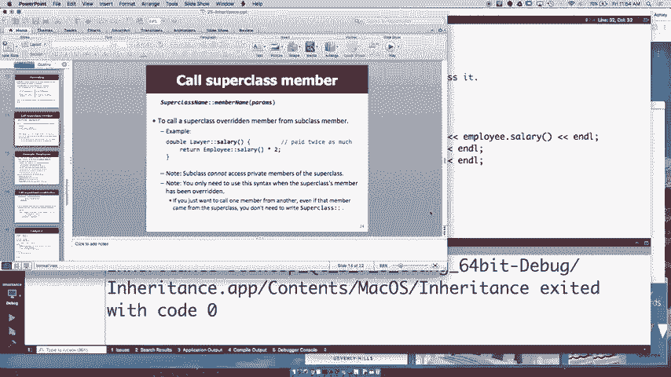

// 在 .cpp 文件中实现
std::string Lawyer::getVacationForm() {
    return “pink”;
}
```

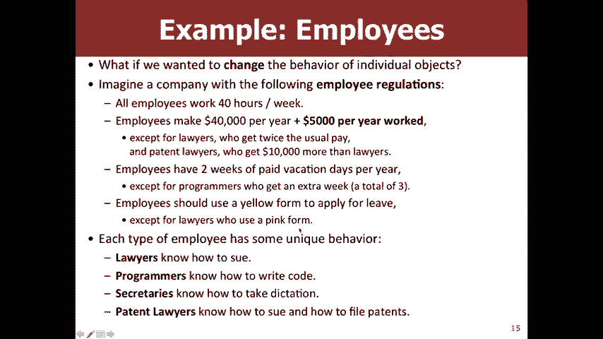

**重要提示**：在C++中，为了启用覆盖机制，超类中的方法必须声明为 `virtual`。一个好的习惯是，对于任何可能被子类覆盖的方法，都将其声明为虚拟函数。

---

## 调用超类方法 📞
有时，在覆盖一个方法时，我们并不是要完全替换超类的实现，而是在此基础上添加或修改一些功能。

例如，假设`Employee`的`getSalary`方法返回`$40,000`，而`Lawyer`的薪水是普通员工的两倍。我们可以在`Lawyer`的`getSalary`方法中调用`Employee`的`getSalary`方法，然后将其结果乘以2。


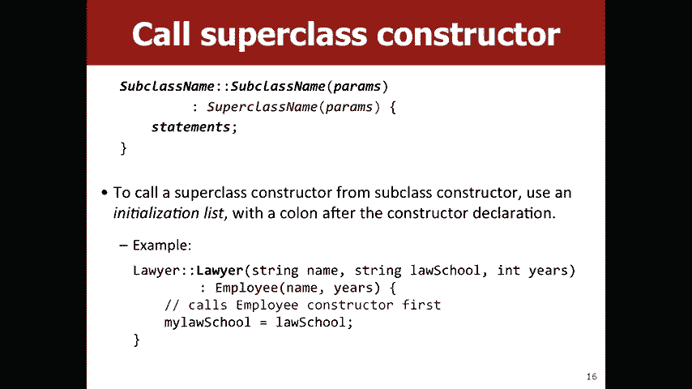

```cpp
double Lawyer::getSalary() {
    // 调用超类 Employee 的 getSalary 方法
    return Employee::getSalary() * 2;
}
```

使用 `Employee::` 来明确指定我们调用的是超类的方法，避免递归调用自身的 `getSalary` 方法。这样做的好处是，如果未来`Employee`的薪水计算方式改变了（例如，加入了工龄系数），`Lawyer`的薪水计算会自动基于新的规则调整，无需修改`Lawyer`类的代码。


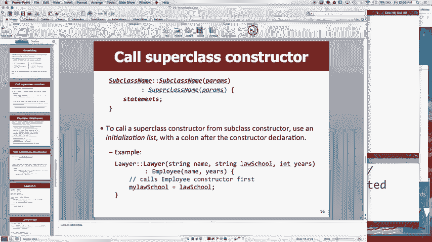

---

## 构造函数与继承 🏗️
当创建子类对象时，实际上也同时创建了其超类部分的对象。因此，子类的构造函数需要负责初始化其超类部分。

如果超类没有默认构造函数（即不需要参数的构造函数），或者我们希望用特定参数初始化超类，就必须在子类构造函数的初始化列表中显式调用超类的构造函数。

假设`Employee`类有一个构造函数，接受工作年限作为参数：
```cpp
Employee::Employee(int yearsWorked) { /* ... */ }
```

那么，`Lawyer`类的构造函数需要这样写：
```cpp
Lawyer::Lawyer(int yearsWorked, std::string lawSchool)
    : Employee(yearsWorked) { // 调用超类构造函数
    // 初始化 Lawyer 特有的成员
    myLawSchool = lawSchool;
}
```

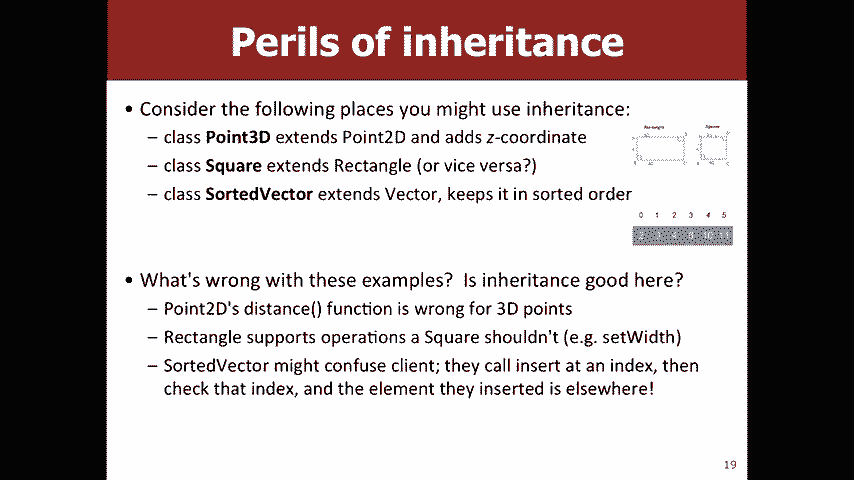

初始化列表位于构造函数参数列表之后，函数体之前，以冒号开头。


---

## 继承的潜在危险与替代方案 ⚠️
虽然继承功能强大，但并非所有“是一种”的关系都适合用继承来实现。滥用继承可能导致违反“里氏替换原则”。

**里氏替换原则**指出：程序中，超类对象出现的地方，都应该可以透明地替换为其子类对象，而程序的行为不变。

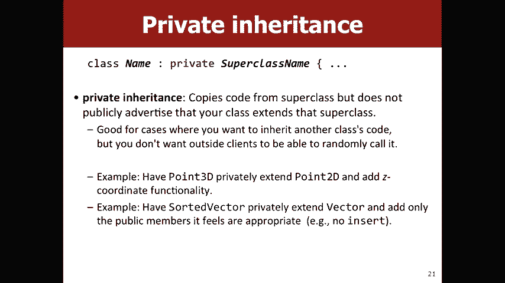

以下是几个不适合使用继承的例子：
1.  **`Point2D` 继承 `Point3D`**：虽然二维点可以看作是z坐标为0的三维点，但`Point2D`对象不应该有`setZ`这样的方法。这可能导致意外的行为。
2.  **`Square` 继承 `Rectangle`**：正方形是矩形的一种，但正方形要求长宽相等。如果`Square`继承`Rectangle`，并覆盖了`setWidth`和`setHeight`方法以保持相等，那么当客户端代码以一个`Rectangle`的引用操作`Square`对象时，可能会破坏正方形的约束。
3.  **`SortedVector` 继承 `Vector`**：有序向量在插入元素时会自动排序。如果它继承自普通`Vector`，那么从`Vector`继承来的`insert`方法（在指定位置插入）就会破坏有序性，导致客户端困惑。

在这些情况下，可以考虑以下替代方案：
*   **私有继承**：使用 `class Lawyer : private Employee`。这样，`Employee`的公共成员在`Lawyer`中变成了私有成员，客户端无法直接调用。这可以用于“按实现继承”，即只想复用代码，而不想暴露接口。
*   **组合**：这是更常用、更灵活的方式。不在类之间建立“是一种”的关系，而是建立“有一个”的关系。例如，`SortedVector`类内部可以持有一个`Vector`类型的私有成员变量，然后提供自己的公共接口，在内部调用这个`Vector`对象的方法。

```cpp
class SortedVector {
private:
    Vector myElements; // 组合：SortedVector “有一个” Vector
public:
    void insert(int value) {
        // 在 myElements 中插入 value 并保持排序
        // 不暴露 Vector 的非排序插入接口
    }
    // ... 其他方法
};
```

---

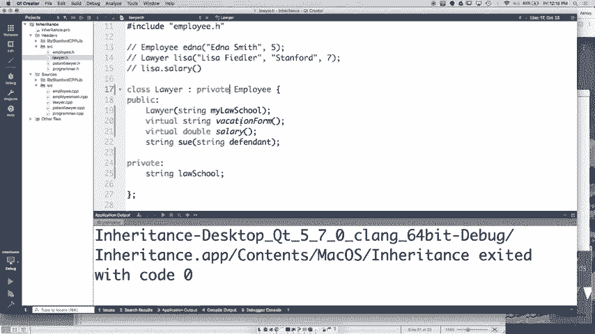

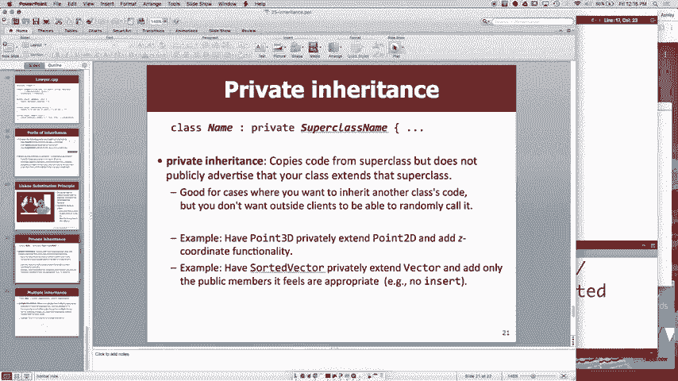

## 总结 🎯
本节课中我们一起学习了C++中继承的核心概念。

我们首先了解了继承如何用于表达类之间的关系和共享代码。然后，我们通过员工系统的例子，实践了如何定义继承关系、使用`virtual`关键字覆盖方法、在子类方法中调用超类实现，以及正确编写子类的构造函数。

最后，我们探讨了继承可能带来的设计问题，特别是违反里氏替换原则的情况，并介绍了私有继承和组合这两种替代方案，以帮助我们构建更健壮、更易维护的面向对象系统。

记住，继承是一个强大的工具，但应当谨慎使用，优先考虑组合而非继承，这通常是更灵活的设计选择。